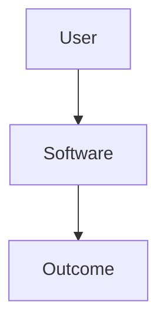

<!--
TEMPLATE MAP (reference-only)
.claude/templates/docs/01-discovery/01-brief.md

OUTPUT MAP (write to)
docs/01-discovery/01-brief.md

NOTES
- Keep headings unchanged.
- Add Mermaid diagram whenever it improves clarity.
-->

# 01 Brief — Problem Framing

## 1) One-sentence description
<One sentence: what software is this?>

## 2) Why now (problem)
- Current pain:
- Root cause:
- Who is hurting:

## 3) Target users
- Primary user:
- Secondary user:
- User environment (web/mobile/desktop/internal):

## 4) Goals (what success looks like)
- G1:
- G2:
- G3:

## 5) Non-goals (explicitly not doing)
- NG1:
- NG2:

## 6) Success criteria (testable)
- SC1 (how to verify):
- SC2 (how to verify):
- SC3 (how to verify):

## 7) Assumptions & open questions
- A1:
- Q1:

## 8) User journey (Mermaid)

