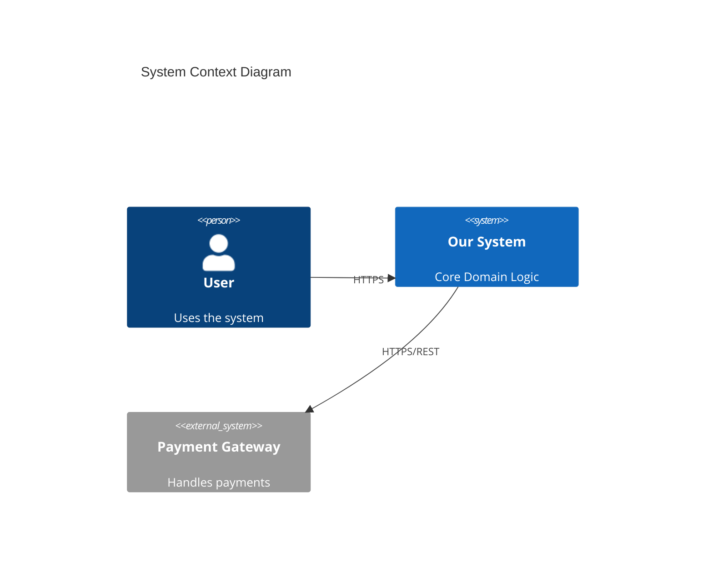
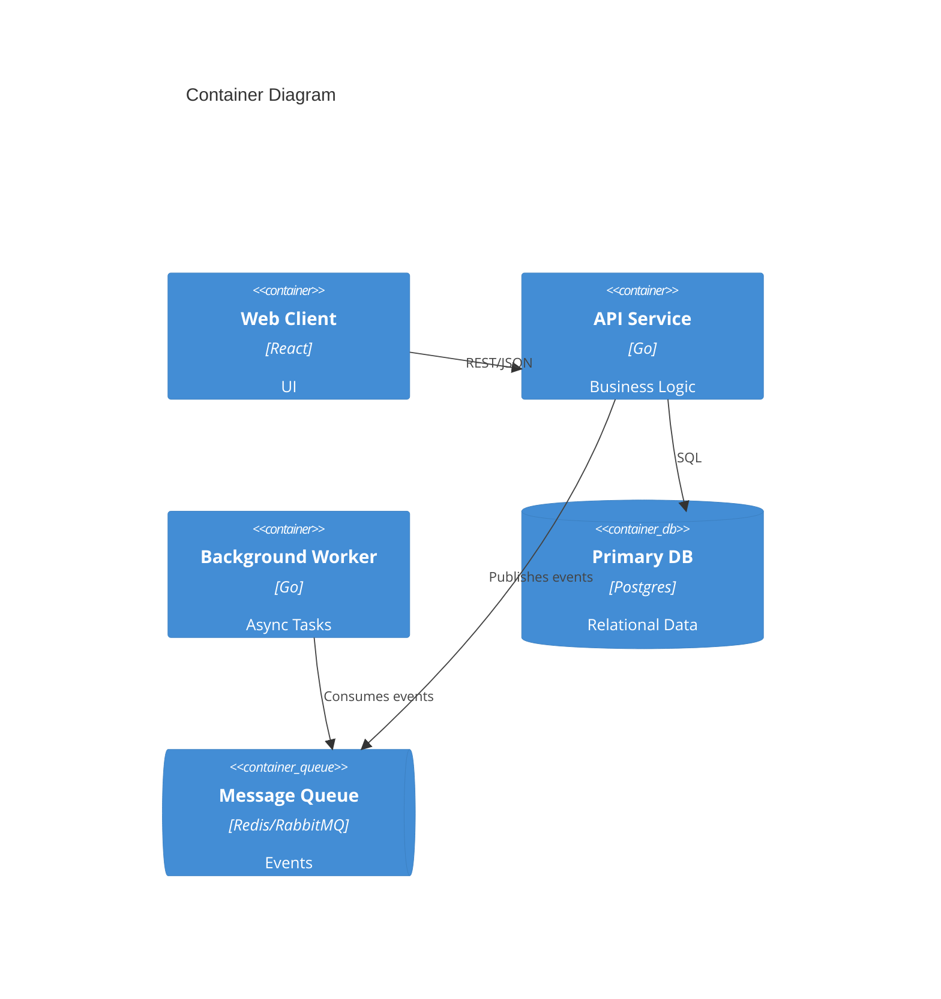

<!--
TEMPLATE MAP (reference-only)
.claude/templates/docs/03-architecture/01-hld.md

OUTPUT MAP (write to)
docs/03-architecture/01-hld.md

NOTES
- Keep headings unchanged.
- Focus on STATIC STRUCTURE but include RATIONALE and STRATEGY.
-->

# 01 High-Level Design (HLD) — Structure

## 1) Architecture Style & Principles
- **Pattern**: (e.g., Modular Monolith / Microservices / Event-Driven / Hexagonal)
- **Key Principles**:
  - (e.g., API First)
  - (e.g., Stateless Compute)
  - (e.g., Async communication by default)

## 2) System Boundary (C4 Context)
- **Users**: Who interacts with the system?
- **External Systems**: What APIs/SaaS do we depend on?



## 3) Containers & Tech Stack (C4 Container)
- **Web App**: React/Next.js (Reason: ...)
- **API Gateway**: Nginx/Kong (Reason: ...)
- **Core Service**: Node/Go (Reason: ...)
- **Worker**: Python (Reason: ...)
- **Database**: Postgres (Reason: ...)



## 4) Data Architecture Strategy
- **Ownership**: (Which module owns which data?)
- **Caching**: (Strategy: Write-through / TTL? Tech: Redis?)
- **Consistency**: (Strong vs Eventual?)

## 5) Cross-cutting Concerns (Implementation View)
### 5.1 Authentication & Authorization
- **AuthN**: (e.g., JWT via Gateway)
- **AuthZ**: (e.g., RBAC in Service layer)

### 5.2 Observability
- **Logs**: (Structured JSON -> ELK/Datadog)
- **Metrics**: (Prometheus endpoint)
- **Tracing**: (OpenTelemetry context propagation)

### 5.3 Error Handling
- **Global Strategy**: (Standard error response format, retry policies)

## 6) Code Structure Strategy (High-Level File Tree)
**Repo Structure**: (Monorepo vs Polyrepo?)

```text
/ (root)
  /apps
    /api-server      # Core API
    /web-client      # Frontend
  /libs
    /shared-utils    # Common logging, auth
  /deploy            # K8s manifests / Terraform
  /docs              # Architecture docs
```

**Module Pattern**: (e.g., Hexagonal / Layered?)
```text
/src
  /domain            # Entities & Logic
  /application       # Use Cases
  /infrastructure    # DB adapters, API clients
  /interfaces        # HTTP handlers
```
