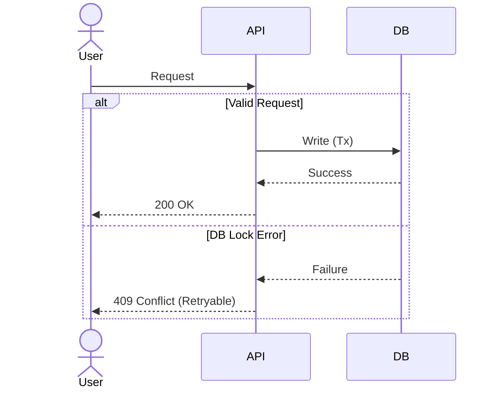
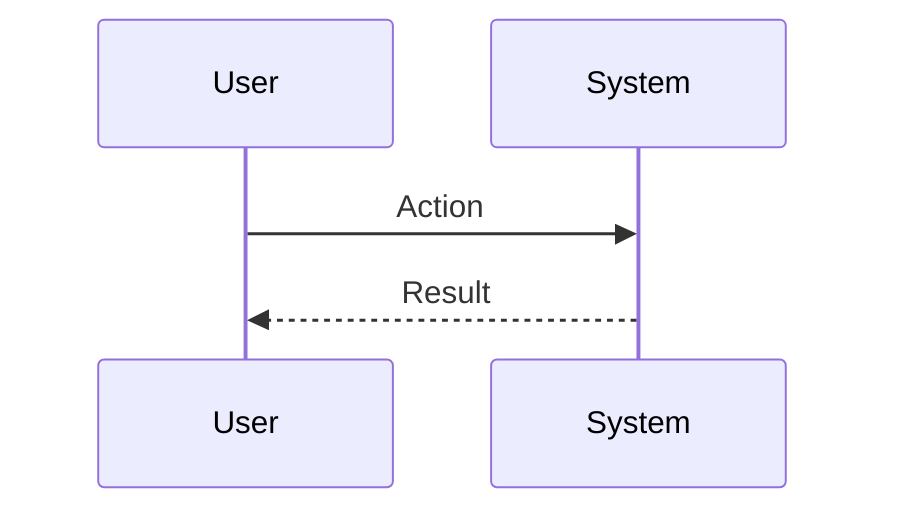
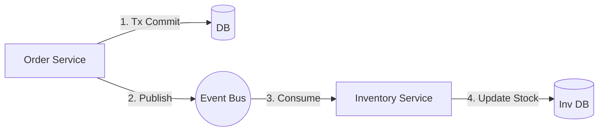
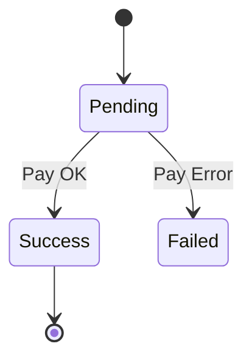

<!--
TEMPLATE MAP (reference-only)
.claude/templates/docs/03-architecture/02-dataflow.md

OUTPUT MAP (write to)
docs/03-architecture/02-dataflow.md

NOTES
- Keep headings unchanged.
- Include UNHAPPY PATHS (errors) and CONCURRENCY controls.
-->

# 02 Data Flow & Sequences

## 1) Critical Business Flows

### Flow 1: <Name> (Happy Path + Error)
**Goal**: ...
**Concurrency**: (Optimistic Locking? Idempotency keys?)

### Flow 2: <Name>

## 2) Asynchronous Event Flows
**Pattern**: (e.g., Outbox pattern? At-least-once delivery?)

- **Event**: `OrderCreated`
- **Producer**: `OrderService`
- **Consumers**: `InventoryService`, `EmailService`

## 3) Entity State Machines
### Entity: <Name> (e.g., Order / Payment)

## 4) Consistency & Recovery
- **Distributed Transactions**: (Saga / TCC / None?)
- **Idempotency**: (How do we handle duplicate events?)
- **Compensation**: (What happens if step 3 fails?)
