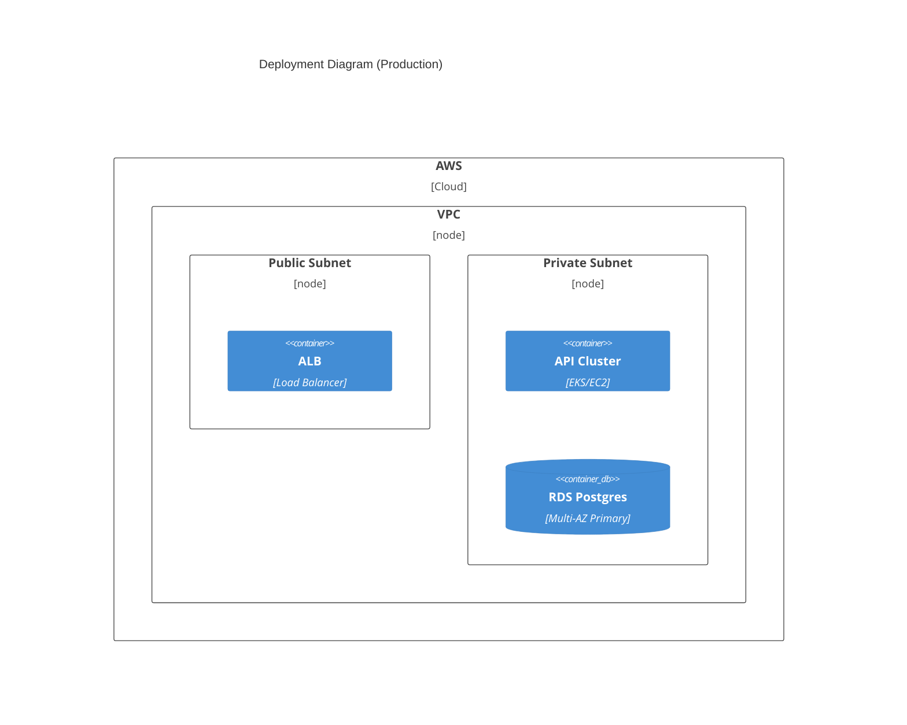

<!--
TEMPLATE MAP (reference-only)
.claude/templates/docs/03-architecture/03-deployment.md

OUTPUT MAP (write to)
docs/03-architecture/03-deployment.md

NOTES
- Keep headings unchanged.
- Include ENVIRONMENT DIFFERENCES, SCALING, and DISASTER RECOVERY.
-->

# 03 Deployment & Infrastructure

## 1) Deployment Topology (Prod)
- **Cloud/Region**: (e.g., AWS us-east-1)
- **Strategy**: (Multi-AZ / Multi-Region?)

## 2) Environment Strategy
| Feature | Dev | Staging | Prod |
|---------|-----|---------|------|
| Data | Mock/Seed | Anonymized Dump | Real Customer Data |
| Infra | Docker Compose | Scaled down (1 node) | HA (Multi-AZ) |
| Logs | Debug | Info | Info/Warn |

## 3) Capacity & Scaling
- **Expected Load**: (e.g., 1000 RPS)
- **Compute Scaling**: (HPA CPU > 70%? Manual?)
- **Database Sizing**: (Instance type, Storage auto-growth)
- **Cache Strategy**: (Cluster mode? Eviction policy?)

## 4) Disaster Recovery (DR)
- **RPO (Data Loss)**: (e.g., < 5 mins)
- **RTO (Downtime)**: (e.g., < 1 hour)
- **Backup Policy**: (Daily snapshots + PITR 7 days)

## 5) Network & Security
- **Ingress**: (WAF rules? CloudFront?)
- **Egress**: (NAT Gateway required?)
- **Secrets Management**: (AWS Secrets Manager / Vault?)
