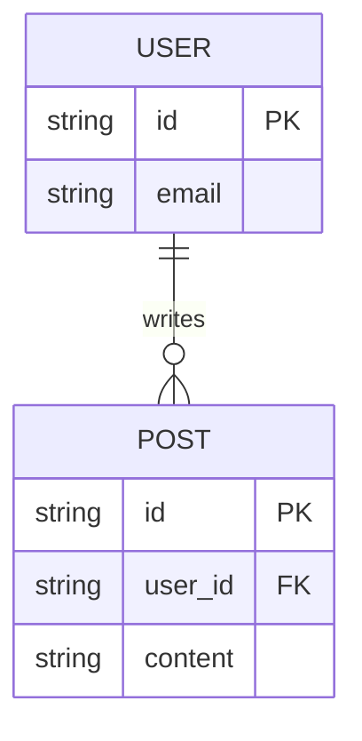

<!--
TEMPLATE MAP (reference-only)
.claude/templates/docs/05-design/02-schema/01-database.md

OUTPUT MAP (write to)
docs/05-design/02-schema/01-database.md

NOTES
- Keep headings unchanged.
- Group Tables by MODULE to allow parallel ownership.
-->

# 01 Database Schema

## 1) ER Diagram

## 2) Tables (by Module)

### Module: User
#### Table: users
- `id` (PK): UUID
- `email`: VARCHAR(255), Unique

### Module: <Name>
#### Table: <table_name>
- `id` (PK): UUID
- `column`: Type
