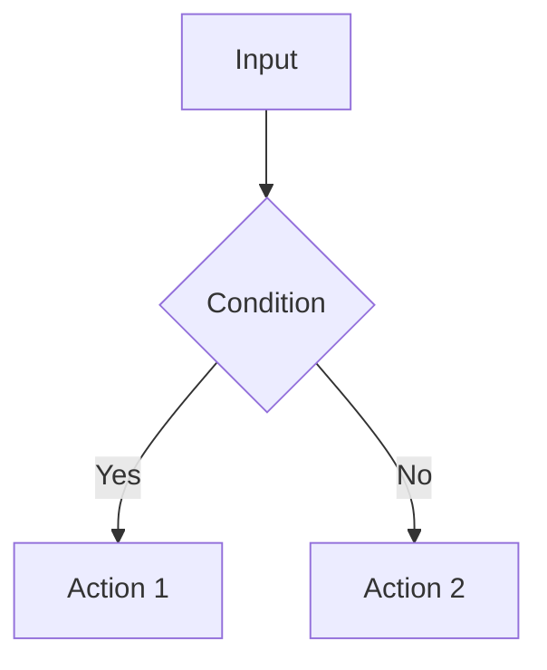

<!--
TEMPLATE MAP (reference-only)
.claude/templates/docs/05-design/03-modules/01-module-template.md

OUTPUT MAP (write to)
docs/05-design/03-modules/<module-name>.md

NOTES
- Keep headings unchanged.
- Low-Level Design for a specific module.
-->

# Module: <Name>

## 1) Assets (Traceability)
- **API**: See `Module: <Name>` in `01-contracts/01-api.md`
- **DB**: See `Module: <Name>` in `02-schema/01-database.md`
- **Events**: See `01-contracts/02-events.md` (Topic: `<topic>`)

## 2) Responsibilities
- What does this module do?

## 3) Internal Logic (Flow)

## 4) Classes / Functions
- `ServiceX`:
  - `methodA()`: Description
- `RepositoryY`:
  - `find()`: Description

## 5) Dependencies
- Uses: Module Z, Lib P
