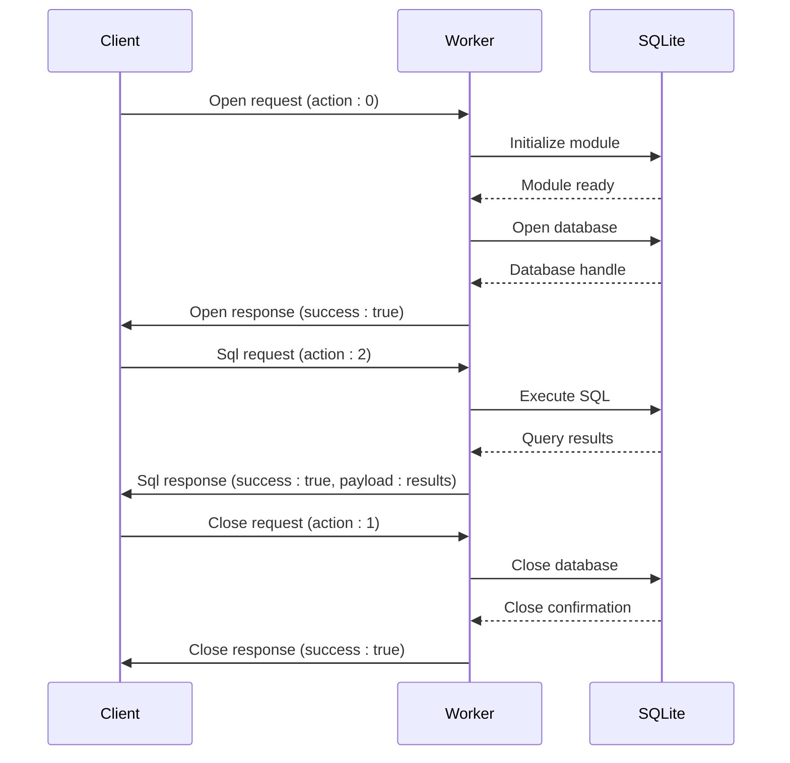

# API Reference

<cite>
**Referenced Files in This Document**   
- [index.ts](file://src/index.ts)
- [sqliteWorker.ts](file://src/sqliteWorker.ts)
- [sqliteWorker.d.ts](file://src/sqliteWorker.d.ts)
- [database.mjs](file://src/jswasm/api/oo1-db/db-statement/database.mjs)
- [statement.mjs](file://src/jswasm/api/oo1-db/db-statement/statement.mjs)
- [database.d.ts](file://src/jswasm/api/oo1-db/db-statement/database.d.ts)
- [statement.d.ts](file://src/jswasm/api/oo1-db/db-statement/statement.d.ts)
</cite>

## Table of Contents
1. [Main open() Function](#main-open-function)
2. [Database Class API](#database-class-api)
3. [Statement Class API](#statement-class-api)
4. [Worker API and Message Protocol](#worker-api-and-message-protocol)
5. [Type Definitions](#type-definitions)
6. [Usage Examples](#usage-examples)
7. [Versioning and Backwards Compatibility](#versioning-and-backwards-compatibility)
8. [Client Implementation Guidelines](#client-implementation-guidelines)

## Main open() Function

The `open()` function is the primary entry point for creating a SQLite database connection in web-sqlite-v2. It returns a promise that resolves to a SqliteWorkerI instance, establishing a connection to a database stored in OPFS (Origin Private File System) or memory.

The function accepts a database name as a string parameter and internally creates a Web Worker to handle database operations off the main thread. It sends an Open action message to the worker with a unique message ID and the database name as payload. The function sets up a message handler to receive responses from the worker, though the current implementation includes a placeholder sleep that prevents completion.

The open() function supports various database configurations through the database name parameter, allowing implementations to create or connect to databases with different storage backends. The function is designed to be asynchronous, returning a promise that resolves when the database connection is established.

**Section sources**
- [index.ts](file://src/index.ts#L64-L86)

## Database Class API

The Database class provides a comprehensive interface for interacting with SQLite databases, offering methods for SQL execution, transaction management, and database operations.

### SQL Execution Methods
The Database class includes several methods for executing SQL statements:
- `exec()`: Executes SQL with optional callbacks and result handling options
- `selectValue()`: Returns the first column of the first row from a query
- `selectValues()`: Returns the first column across all rows
- `selectArray()`: Returns the first row as an array
- `selectObject()`: Returns the first row as an object
- `selectArrays()`: Returns all rows as arrays
- `selectObjects()`: Returns all rows as objects

These methods support parameter binding through the `bind` option, allowing safe execution of parameterized queries. The `exec()` method accepts an options object that can specify row mode (array, object, or stmt), callback functions for row processing, and other execution parameters.

### Transaction Handling
The Database class provides robust transaction support:
- `transaction()`: Executes a callback within a transaction, automatically committing on success and rolling back on error
- `savepoint()`: Executes a callback within a savepoint transaction, providing nested transaction capabilities

Both methods use a try-catch pattern to ensure proper transaction cleanup, committing changes when the callback completes successfully and rolling back in case of errors.

### Database Operations
Additional database operations include:
- `close()`: Closes the database connection and finalizes any outstanding statements
- `export()`: Serializes the database contents into a Uint8Array
- `changes()`: Reports the number of changes made by recent operations
- `isOpen()`: Checks if the database connection is open
- `prepare()`: Prepares a SQL statement for repeated execution

**Section sources**
- [database.mjs](file://src/jswasm/api/oo1-db/db-statement/database.mjs#L34-L681)
- [database.d.ts](file://src/jswasm/api/oo1-db/db-statement/database.d.ts#L39-L96)

## Statement Class API

The Statement class represents a prepared SQL statement and provides methods for parameter binding, execution, and result retrieval.

### Prepared Statement Lifecycle
The Statement class manages the lifecycle of prepared statements:
- `finalize()`: Finalizes the statement and releases native resources
- `reset()`: Resets the statement for re-execution, optionally clearing bindings
- `clearBindings()`: Removes all parameter bindings from the statement

These methods ensure proper resource management and allow statements to be reused efficiently.

### Parameter Binding
The Statement class provides flexible parameter binding capabilities:
- `bind()`: Binds values to statement parameters using positional or named parameters
- `bindAsBlob()`: Forces a value to be bound as a BLOB regardless of its type

The bind() method supports multiple calling patterns:
- Single value binding: `stmt.bind(value)` binds to the first parameter
- Indexed binding: `stmt.bind(index, value)` binds to a specific parameter
- Array binding: `stmt.bind([value1, value2])` binds multiple values by position
- Object binding: `stmt.bind({name: value})` binds named parameters

### Result Retrieval
After executing a statement with `step()`, results can be retrieved using:
- `get()`: Retrieves column data by index or into a provided container
- `getInt()`: Retrieves column as integer
- `getFloat()`: Retrieves column as float
- `getString()`: Retrieves column as string
- `getBlob()`: Retrieves column as Uint8Array
- `getJSON()`: Retrieves column and parses as JSON
- `getColumnName()`: Gets the name of a column by index
- `getColumnNames()`: Gets all column names

The `step()` method advances the statement to the next row, returning true if a row is available or false if the result set is exhausted.

**Section sources**
- [statement.mjs](file://src/jswasm/api/oo1-db/db-statement/statement.mjs#L32-L500)
- [statement.d.ts](file://src/jswasm/api/oo1-db/db-statement/statement.d.ts#L9-L54)

## Worker API and Message Protocol

The worker API implements a message-based communication protocol between the main thread and the Web Worker that executes SQLite operations.

### Message Protocol
The protocol uses a structured message format with three action types:
- Open (0): Initialize a database connection
- Close (1): Close a database connection
- Sql (2): Execute SQL statements

Each message includes:
- `action`: The action code (0, 1, or 2)
- `messageId`: A unique identifier for the message
- `payload`: Action-specific data

Response messages include:
- `action`: Echoes the request action
- `messageId`: Echoes the request message ID
- `success`: Boolean indicating success or failure
- `payload`: Result data on success
- `error`: Error message on failure
- `errorStack`: Stack trace on failure

### Worker Implementation
The worker implementation in sqliteWorker.ts handles incoming messages and dispatches to appropriate handlers:
- `handleOpen()`: Initializes the SQLite module and opens a database connection
- `handleSql()`: Executes SQL statements and returns results
- `handleClose()`: Closes the database connection

The worker uses the sqlite3InitModule to load the SQLite WASM module on demand, ensuring efficient resource usage. Database operations are performed through the sqlite3.oo1.DB interface, with results formatted according to the message protocol.

Error handling is implemented consistently across all handlers, with detailed error information including message and stack trace returned to the client.



**Diagram sources**
- [sqliteWorker.ts](file://src/sqliteWorker.ts#L68-L242)
- [index.ts](file://src/index.ts#L64-L85)

**Section sources**
- [sqliteWorker.ts](file://src/sqliteWorker.ts#L7-L242)
- [index.ts](file://src/index.ts#L6-L27)

## Type Definitions

The type definitions for web-sqlite-v2 are defined in the SqliteWorkerI interface and supporting types.

### SqliteWorkerI Interface
The SqliteWorkerI interface defines the contract for the database adapter:
- `sql<T>()`: Executes SQL and returns typed results
- `transaction()`: Executes a callback within a transaction
- `on()`: Registers event listeners for database events
- `close()`: Closes the database connection

### ExecOptions Interface
The ExecOptions interface defines configuration options for SQL execution:
- `bind`: Parameter values for binding
- `callback`: Function called for each row
- `rowMode`: Format of returned rows (array, object, stmt)
- `columnNames`: Explicit column names for object mode
- `returnValue`: Specifies returning result rows
- `multi`: Enables/disables multi-statement execution

### ExecResult Interface
The ExecResult interface defines the structure of execution results when configured to return rows:
- `resultRows`: Array of result rows in the specified format

### DB Class Definition
The DB class type definition includes:
- Constructor overloads for different configuration patterns
- Method signatures for all database operations
- Property definitions for database metadata

### Stmt Class Definition
The Stmt class type definition includes:
- Constructor signature with internal token protection
- Method signatures for statement operations
- Property definitions for statement metadata

**Section sources**
- [sqliteWorker.d.ts](file://src/sqliteWorker.d.ts)
- [database.d.ts](file://src/jswasm/api/oo1-db/db-statement/database.d.ts)
- [statement.d.ts](file://src/jswasm/api/oo1-db/db-statement/statement.d.ts)

## Usage Examples

### Basic Database Operations
```typescript
const db = await open("users.db");
const users = await db.sql<{ id: number; name: string }>(
  "SELECT id, name FROM users",
);
await db.close();
```

### Transaction Example
```typescript
await db.transaction(async (tx) => {
  await tx.sql("CREATE TABLE IF NOT EXISTS todos (id INTEGER PRIMARY KEY, title TEXT)");
  await tx.sql("INSERT INTO todos (title) VALUES ('Learn SQLite WASM')");
  const rows = await tx.sql<{ id: number; title: string }>(
    "SELECT id, title FROM todos ORDER BY id DESC",
  );
  console.log("Rows:", rows.length);
});
```

### Event Handling
```typescript
db.on("log", (msg) => console.log("[db]", msg));
db.on("error", (err) => console.error("DB error:", err));
```

### Prepared Statements
```typescript
const stmt = db.prepare("INSERT INTO users (name) VALUES (?)");
stmt.bind("Alice");
stmt.step();
stmt.reset();
stmt.finalize();
```

### Parameter Binding
```typescript
// Positional parameters
db.sql("SELECT * FROM users WHERE age > ? AND active = ?", [25, true]);

// Named parameters
db.sql("SELECT * FROM users WHERE name = :name", { name: "Alice" });
```

### Error Handling
```typescript
try {
  await db.sql("INVALID SQL");
} catch (err) {
  console.error("SQL error:", err);
}
```

**Section sources**
- [index.ts](file://src/index.ts#L34-L59)
- [database.mjs](file://src/jswasm/api/oo1-db/db-statement/database.mjs)
- [statement.mjs](file://src/jswasm/api/oo1-db/db-statement/statement.mjs)

## Versioning and Backwards Compatibility

The web-sqlite-v2 API is designed with backwards compatibility in mind, following semantic versioning principles.

### API Stability
The core API surface is considered stable, with the following guarantees:
- The `open()` function signature will not change in minor versions
- Database and Statement class methods will maintain backward compatibility
- The worker message protocol will remain stable within major versions

### Breaking Changes
Potential breaking changes in future versions may include:
- Addition of new methods to existing classes
- Extension of type definitions with optional properties
- Enhancement of error handling with additional information

When breaking changes are necessary, they will be introduced in major version increments with appropriate migration paths.

### Deprecation Policy
Deprecated features will be:
- Marked with deprecation comments in the code
- Maintained for at least two minor version cycles
- Accompanied by migration guidance in documentation

### Extension Points
The API provides extension points for future enhancements:
- The ExecOptions interface can be extended with new options
- Event types can be expanded to include additional events
- The worker protocol can support new action types

**Section sources**
- [index.ts](file://src/index.ts)
- [sqliteWorker.ts](file://src/sqliteWorker.ts)
- [sqliteWorker.d.ts](file://src/sqliteWorker.d.ts)

## Client Implementation Guidelines

### TypeScript Usage
For TypeScript consumers, the API provides full type safety:
```typescript
interface User {
  id: number;
  name: string;
  email: string;
}

const users = await db.sql<User>("SELECT * FROM users");
// 'users' is automatically typed as User[]
```

### JavaScript Usage
For JavaScript consumers, the API works seamlessly:
```javascript
const users = await db.sql("SELECT * FROM users");
users.forEach(user => {
  console.log(user.name);
});
```

### Error Handling Best Practices
Always wrap database operations in try-catch blocks:
```typescript
try {
  await db.transaction(async () => {
    await db.sql("INSERT INTO users VALUES (?)", [name]);
  });
} catch (error) {
  console.error("Transaction failed:", error.message);
}
```

### Resource Management
Ensure proper cleanup of resources:
```typescript
let db;
try {
  db = await open("mydb.db");
  // Perform database operations
} finally {
  if (db) {
    await db.close();
  }
}
```

### Performance Considerations
- Use prepared statements for repeated queries
- Batch operations within transactions
- Avoid long-running transactions
- Close databases when not in use

### Testing Strategies
Use the provided e2e test patterns as guidance for testing database interactions, ensuring comprehensive coverage of CRUD operations, transactions, and error conditions.

**Section sources**
- [index.ts](file://src/index.ts)
- [sqliteWorker.d.ts](file://src/sqliteWorker.d.ts)
- [tests/e2e/*.test.ts](file://tests/e2e/)