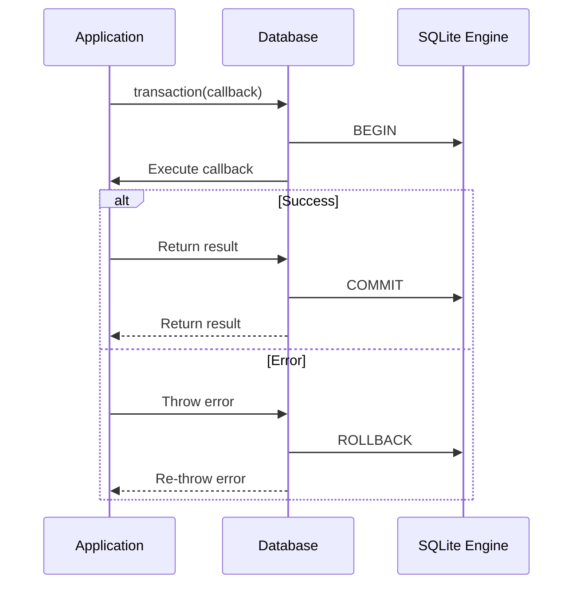
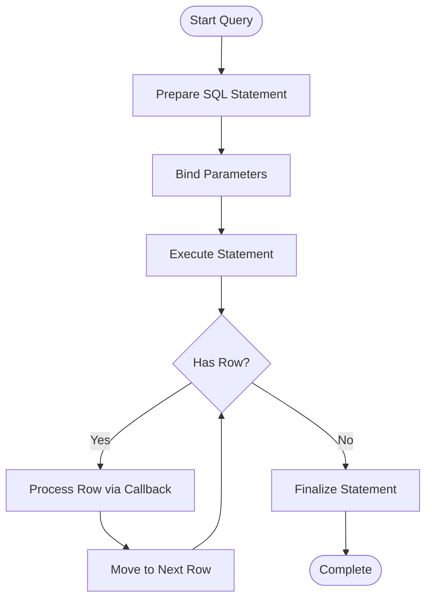

# Database API

<cite>
**Referenced Files in This Document**   
- [database.mjs](file://src/jswasm/api/oo1-db/db-statement/database.mjs)
- [statement.mjs](file://src/jswasm/api/oo1-db/db-statement/statement.mjs)
- [execution.mjs](file://src/jswasm/api/oo1-db/db-statement/execution.mjs)
- [validation.mjs](file://src/jswasm/api/oo1-db/db-statement/validation.mjs)
- [db-ctor-helper.mjs](file://src/jswasm/api/oo1-db/db-ctor-helper.mjs)
- [database.d.ts](file://src/jswasm/api/oo1-db/db-statement/database.d.ts)
- [index.ts](file://src/index.ts)
- [sqliteWorker.ts](file://src/sqliteWorker.ts)
</cite>

## Table of Contents
1. [Introduction](#introduction)
2. [Core Methods](#core-methods)
3. [Transaction Handling](#transaction-handling)
4. [SQL Execution Options](#sql-execution-options)
5. [Practical Examples](#practical-examples)
6. [Memory Management](#memory-management)
7. [Concurrency and Thread Safety](#concurrency-and-thread-safety)
8. [Error Handling](#error-handling)

## Introduction
The Database class in web-sqlite-v2 provides a comprehensive interface for interacting with SQLite databases through WebAssembly. This API enables developers to execute SQL statements, manage transactions, and handle database operations efficiently in web environments. The class is designed to work with both in-memory and persistent storage (OPFS) databases, offering a fluent interface for database operations.

The Database class is implemented as part of the OO1 API, which provides a high-level wrapper around the native SQLite C API. It handles connection management, statement preparation, parameter binding, and result processing, abstracting away the complexities of direct WASM interaction. The API supports both synchronous and asynchronous operations through Promise-based methods, making it suitable for modern web applications.

**Section sources**
- [database.mjs](file://src/jswasm/api/oo1-db/db-statement/database.mjs#L1-L688)
- [database.d.ts](file://src/jswasm/api/oo1-db/db-statement/database.d.ts#L1-L109)

## Core Methods

### exec()
The `exec()` method executes SQL statements with flexible result handling options. It accepts either a raw SQL string or an options object that provides fine-grained control over execution behavior.

**Parameters:**
- `sql`: SQL string or options object containing execution parameters
- `options`: Optional configuration object with properties:
  - `bind`: Parameter values for positional or named parameters
  - `callback`: Function invoked for each row in the result set
  - `rowMode`: Result format ("array", "object", or "stmt")
  - `columnNames`: Explicit column names for object mode
  - `returnValue`: "resultRows" to collect all results
  - `multi`: Boolean to enable/disable multi-statement execution

**Return Types:**
- Returns the Database instance for chaining when no result collection is requested
- Returns an `ExecResult` object with `resultRows` array when configured to collect results

**Promise Resolution:**
The method resolves immediately upon completion of SQL execution, with the resolution value depending on the configuration. When using callback-based processing, the promise resolves after all rows have been processed.

**Error Conditions:**
- Throws if the database is closed
- Throws on SQL syntax errors
- Throws on constraint violations
- Throws on invalid parameter binding

### select()
The Database class provides several convenience methods for data retrieval that build upon the `exec()` method:

- `selectValue()`: Returns the first column of the first row
- `selectValues()`: Returns the first column across all rows as an array
- `selectArray()`: Returns the first row as an array
- `selectObject()`: Returns the first row as an object
- `selectArrays()`: Returns all rows as arrays
- `selectObjects()`: Returns all rows as objects

These methods simplify common query patterns and automatically handle statement preparation, execution, and cleanup.

### prepare()
The `prepare()` method compiles SQL into a reusable Statement object, enabling efficient execution of parameterized queries. The returned Statement can be used multiple times with different parameter values, improving performance for repeated operations.

### close()
The `close()` method terminates the database connection and releases associated resources. It automatically finalizes any outstanding prepared statements and ensures proper cleanup of native memory. After closing, any attempt to use the database instance will throw an error.

**Section sources**
- [database.mjs](file://src/jswasm/api/oo1-db/db-statement/database.mjs#L224-L361)
- [database.mjs](file://src/jswasm/api/oo1-db/db-statement/database.mjs#L518-L592)
- [database.mjs](file://src/jswasm/api/oo1-db/db-statement/database.mjs#L67-L103)

## Transaction Handling

### Commit/Rollback Semantics
The Database class provides transaction management through the `transaction()` and `savepoint()` methods. The `transaction()` method wraps operations in a SQL transaction, automatically committing on successful completion or rolling back on error.



**Diagram sources**
- [database.mjs](file://src/jswasm/api/oo1-db/db-statement/database.mjs#L611-L633)

### Nested Transaction Behavior
The API supports nested transactions through savepoints, implemented via the `savepoint()` method. Each savepoint creates a named checkpoint that can be independently rolled back without affecting outer transactions.

When a savepoint operation fails, it rolls back to the savepoint and releases it, allowing the outer transaction to continue. This provides fine-grained error recovery while maintaining transactional integrity at higher levels.

The implementation uses a fixed savepoint name "oo1" internally, ensuring consistent behavior across nested calls. Multiple levels of savepoints can be nested, with each level providing independent rollback capability.

**Section sources**
- [database.mjs](file://src/jswasm/api/oo1-db/db-statement/database.mjs#L634-L651)

## SQL Execution Options

### Row Mode Configuration
The API supports multiple row modes for result formatting:

- **Object mode**: Results are returned as objects with column names as keys
- **Array mode**: Results are returned as arrays with values in column order
- **Custom mode**: Results can be formatted using custom functions or objects

The row mode is specified through the `rowMode` option in the execution parameters. Object mode is particularly useful for applications that need named access to result fields, while array mode provides better performance for large result sets.

### Result Formatting
Results can be customized through several mechanisms:

- The `columnNames` option allows explicit specification of column names in object mode
- The `callback` option enables row-by-row processing with custom formatting
- The `returnValue: "resultRows"` option collects all results into an array

For streaming large result sets, the callback pattern is recommended as it processes rows incrementally without loading the entire result set into memory.

### Streaming Large Result Sets
For handling large datasets, the API provides streaming capabilities through the callback mechanism. Instead of collecting all results in memory, applications can process rows as they are generated:



This approach minimizes memory usage and allows for early processing of results.

**Section sources**
- [execution.mjs](file://src/jswasm/api/oo1-db/db-statement/execution.mjs#L53-L61)
- [database.mjs](file://src/jswasm/api/oo1-db/db-statement/database.mjs#L224-L361)

## Practical Examples

### Creating Tables
```javascript
await db.exec(`
  CREATE TABLE IF NOT EXISTS users (
    id INTEGER PRIMARY KEY,
    name TEXT NOT NULL,
    email TEXT UNIQUE,
    created_at TIMESTAMP DEFAULT CURRENT_TIMESTAMP
  )
`);
```

### Inserting Data
```javascript
// Single insert
await db.exec({
  sql: "INSERT INTO users (name, email) VALUES (?, ?)",
  bind: ["John Doe", "john@example.com"]
});

// Bulk insert
await db.transaction(async () => {
  const stmt = db.prepare("INSERT INTO users (name, email) VALUES (?, ?)");
  for (const user of users) {
    stmt.bind([user.name, user.email]).step();
    stmt.reset();
  }
  stmt.finalize();
});
```

### Querying with Parameters
```javascript
// Named parameters
const user = await db.selectObject(
  "SELECT * FROM users WHERE email = :email",
  { ":email": "john@example.com" }
);

// Positional parameters
const users = await db.selectObjects(
  "SELECT * FROM users WHERE name LIKE ?",
  [`%${searchTerm}%`]
);
```

### Handling Bulk Operations
```javascript
// Efficient bulk insert with prepared statement
await db.transaction(async () => {
  const stmt = db.prepare("INSERT INTO logs (level, message, timestamp) VALUES (?, ?, ?)");
  for (const log of logs) {
    stmt.bind([log.level, log.message, log.timestamp]).step();
    stmt.reset();
  }
  stmt.finalize();
});
```

**Section sources**
- [database.mjs](file://src/jswasm/api/oo1-db/db-statement/database.mjs#L224-L361)
- [statement.mjs](file://src/jswasm/api/oo1-db/db-statement/statement.mjs#L105-L178)

## Memory Management

### Connection Lifecycle
The Database class manages memory through proper resource cleanup in the `close()` method. When a database is closed, it:

1. Finalizes all outstanding prepared statements
2. Removes the database from internal tracking maps
3. Calls sqlite3_close_v2() to release the native handle
4. Cleans up event listeners and callbacks

Applications should explicitly call `close()` when a database is no longer needed to prevent memory leaks.

### Connection Pooling and Reuse
While the API does not provide built-in connection pooling, best practices for connection reuse include:

- Reusing database instances across related operations
- Using transactions to group related operations
- Caching prepared statements for frequently executed queries
- Implementing application-level connection pooling for high-concurrency scenarios

For web applications, consider keeping a single database connection open for the duration of a user session, closing it when the session ends.

**Section sources**
- [database.mjs](file://src/jswasm/api/oo1-db/db-statement/database.mjs#L67-L103)
- [db-ctor-helper.mjs](file://src/jswasm/api/oo1-db/db-ctor-helper.mjs#L72-L157)

## Concurrency and Thread Safety

### Concurrent Access Limitations
The web-sqlite-v2 library has specific limitations regarding concurrent access:

- Database connections are not thread-safe and should not be shared across workers
- Operations on a single database connection should be serialized
- The OPFS VFS has its own concurrency controls that may affect performance

The implementation uses a worker-based architecture where database operations are delegated to a dedicated worker thread, preventing blocking of the main UI thread.

### Best Practices for Concurrency
To handle concurrent access safely:

1. Use separate database instances for different operations when possible
2. Wrap related operations in transactions to ensure atomicity
3. Use savepoints for nested operations with independent rollback capability
4. Avoid long-running transactions that may block other operations
5. Implement retry logic for operations that may fail due to contention

The worker-based design inherently provides isolation between database operations and UI rendering, improving overall application responsiveness.

**Section sources**
- [sqliteWorker.ts](file://src/sqliteWorker.ts#L1-L243)
- [index.ts](file://src/index.ts#L1-L92)

## Error Handling
The Database API provides comprehensive error handling through:

- Thrown exceptions for synchronous errors
- Promise rejection for asynchronous operations
- Detailed error messages with SQLite result codes
- Stack traces for debugging

Common error conditions include:
- Database closed errors when operating on a closed connection
- SQL syntax errors from invalid queries
- Constraint violations for unique, foreign key, or check constraints
- Resource errors for memory allocation failures
- I/O errors for file system operations

Applications should implement appropriate error handling and recovery strategies based on these error types.

**Section sources**
- [database.mjs](file://src/jswasm/api/oo1-db/db-statement/database.mjs#L224-L361)
- [validation.mjs](file://src/jswasm/api/oo1-db/db-statement/validation.mjs#L1-L102)