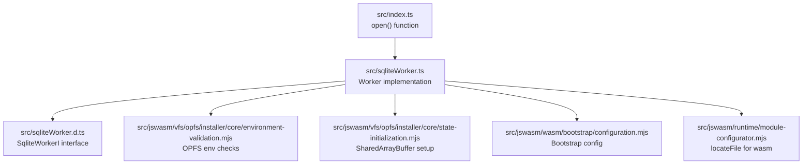
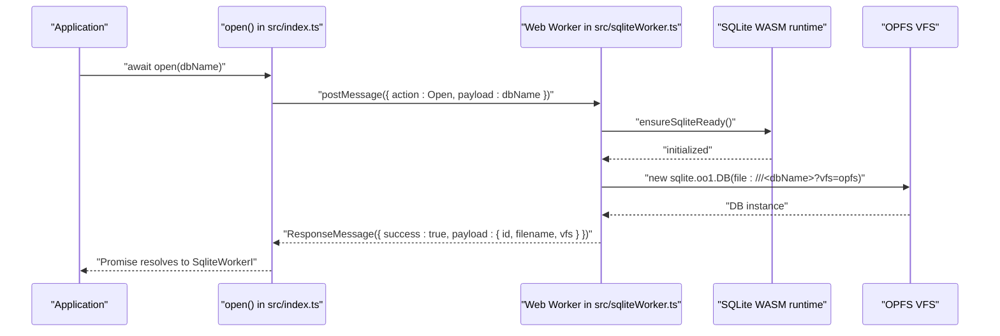
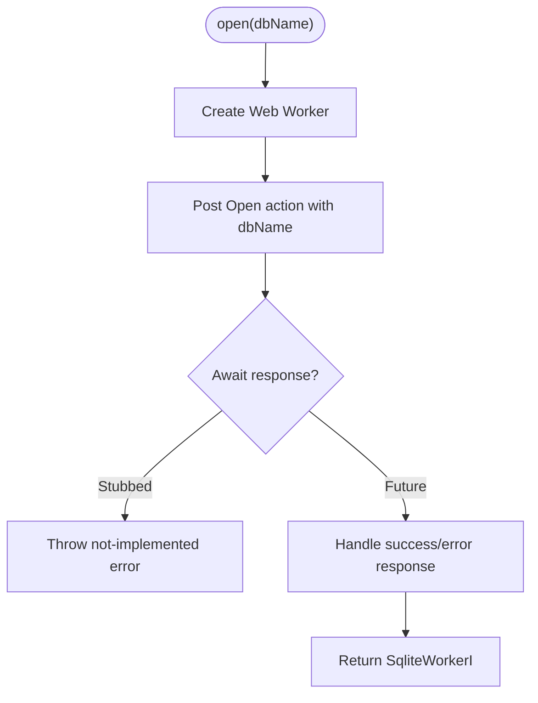
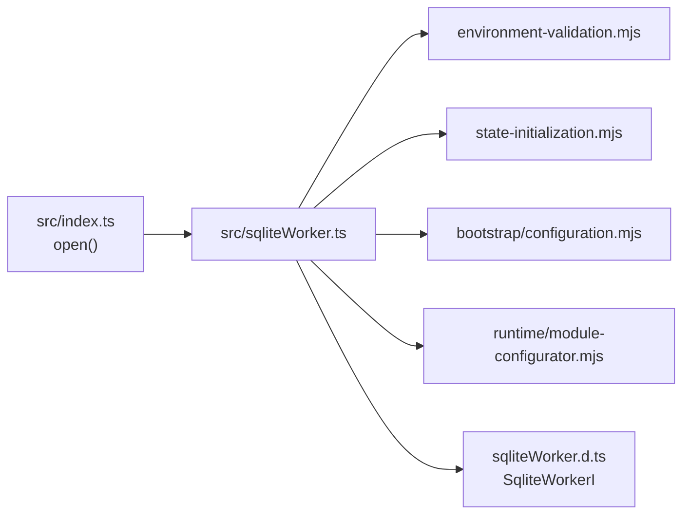

# Main API

<cite>
**Referenced Files in This Document**
- [src/index.ts](file://src/index.ts)
- [src/sqliteWorker.ts](file://src/sqliteWorker.ts)
- [src/sqliteWorker.d.ts](file://src/sqliteWorker.d.ts)
- [src/jswasm/vfs/opfs/installer/core/environment-validation.mjs](file://src/jswasm/vfs/opfs/installer/core/environment-validation.mjs)
- [src/jswasm/vfs/opfs/installer/core/state-initialization.mjs](file://src/jswasm/vfs/opfs/installer/core/state-initialization.mjs)
- [src/jswasm/wasm/bootstrap/configuration.mjs](file://src/jswasm/wasm/bootstrap/configuration.mjs)
- [src/jswasm/runtime/module-configurator.mjs](file://src/jswasm/runtime/module-configurator.mjs)
- [tests/e2e/error-handling.e2e.test.ts](file://tests/e2e/error-handling.e2e.test.ts)
- [tests/e2e/database-lifecycle.e2e.test.ts](file://tests/e2e/database-lifecycle.e2e.test.ts)
- [tests/e2e/performance.e2e.test.ts](file://tests/e2e/performance.e2e.test.ts)
- [tests/e2e/worker-client.ts](file://tests/e2e/worker-client.ts)
- [package.json](file://package.json)
- [dist/index.d.ts](file://dist/index.d.ts)
</cite>

## Table of Contents
1. [Introduction](#introduction)
2. [Project Structure](#project-structure)
3. [Core Components](#core-components)
4. [Architecture Overview](#architecture-overview)
5. [Detailed Component Analysis](#detailed-component-analysis)
6. [Dependency Analysis](#dependency-analysis)
7. [Performance Considerations](#performance-considerations)
8. [Troubleshooting Guide](#troubleshooting-guide)
9. [Conclusion](#conclusion)
10. [Appendices](#appendices)

## Introduction
This document describes the main API entry point for web-sqlite-v2, focusing on the open() function. It explains the function signature, return type, initialization behavior, worker creation, and connection setup. It also covers error handling, usage patterns in TypeScript and JavaScript, advanced configuration options (including memory-related settings and VFS selection), integration with module bundlers and ESM imports, and common issues such as cross-origin restrictions with OPFS and SharedArrayBuffer requirements. Finally, it includes performance tips and warm-up strategies.

## Project Structure
The main API surface is defined in the primary entry file and backed by a Web Worker implementation. Supporting infrastructure includes OPFS VFS installation, environment validation, and Wasm bootstrap configuration.

**Diagram sources**
- [src/index.ts](file://src/index.ts#L1-L92)
- [src/sqliteWorker.ts](file://src/sqliteWorker.ts#L1-L243)
- [src/sqliteWorker.d.ts](file://src/sqliteWorker.d.ts#L1-L115)
- [src/jswasm/vfs/opfs/installer/core/environment-validation.mjs](file://src/jswasm/vfs/opfs/installer/core/environment-validation.mjs#L1-L52)
- [src/jswasm/vfs/opfs/installer/core/state-initialization.mjs](file://src/jswasm/vfs/opfs/installer/core/state-initialization.mjs#L1-L126)
- [src/jswasm/wasm/bootstrap/configuration.mjs](file://src/jswasm/wasm/bootstrap/configuration.mjs#L1-L32)
- [src/jswasm/runtime/module-configurator.mjs](file://src/jswasm/runtime/module-configurator.mjs#L1-L31)

**Section sources**
- [src/index.ts](file://src/index.ts#L1-L92)
- [src/sqliteWorker.ts](file://src/sqliteWorker.ts#L1-L243)
- [src/sqliteWorker.d.ts](file://src/sqliteWorker.d.ts#L1-L115)

## Core Components
- open(dbName): Promise<SqliteWorkerI>
  - Purpose: Open a SQLite database and return a SqliteWorkerI-compatible adapter.
  - Behavior: Creates a Web Worker, sends an Open action with the database name, and awaits a response. The current implementation stubs out the rest of the flow and throws a not-implemented error after sending messages.
  - Return type: Promise resolving to a SqliteWorkerI instance.
  - Rejection cases: Throws an error if the Open action is not implemented or if the worker responds with an error payload.
- SqliteWorkerI: The adapter interface exposed by the worker, including methods for SQL execution, transactions, import/export, closing, and event subscription.

**Section sources**
- [src/index.ts](file://src/index.ts#L29-L92)
- [src/sqliteWorker.d.ts](file://src/sqliteWorker.d.ts#L1-L115)

## Architecture Overview
The main API delegates to a Web Worker that initializes the SQLite WASM runtime and opens a database using the OPFS VFS by default. The worker handles messages, validates actions, and responds with structured payloads.

**Diagram sources**
- [src/index.ts](file://src/index.ts#L64-L92)
- [src/sqliteWorker.ts](file://src/sqliteWorker.ts#L47-L110)

## Detailed Component Analysis

### open() Function API
- Signature: open(dbName: string): Promise<SqliteWorkerI>
- Parameters:
  - dbName: Database name or path. The worker constructs a file URL with the OPFS VFS query parameter internally.
- Return type: Promise resolving to a SqliteWorkerI instance.
- Initialization behavior:
  - Creates a Web Worker using a module worker import.
  - Sends an Open action with the provided database name.
  - Awaiting a response is currently stubbed; the implementation throws a not-implemented error after posting messages.
- Worker creation and connection setup:
  - Worker listens for messages, normalizes action codes, and routes to handlers for Open, Sql, and Close.
  - On Open, ensures the SQLite WASM module is ready, creates a database instance with OPFS VFS, and responds with metadata.

**Diagram sources**
- [src/index.ts](file://src/index.ts#L64-L92)
- [src/sqliteWorker.ts](file://src/sqliteWorker.ts#L208-L243)

**Section sources**
- [src/index.ts](file://src/index.ts#L61-L92)
- [src/sqliteWorker.ts](file://src/sqliteWorker.ts#L68-L110)

### SqliteWorkerI Interface
- Methods and capabilities:
  - sql<T>(query: string): Promise<T[]>
  - transaction<T>(fn: (db: SqliteWorkerI) => Promise<T> | T): Promise<T>
  - export(): Promise<Uint8Array>
  - import(bytes: ArrayBufferView | ArrayBuffer): Promise<void>
  - close(options?: { unlink?: boolean }): Promise<void>
  - on(event: "ready" | "open" | "close" | "error" | "row" | "log", handler: (...args: unknown[]) => void): void
- Notes:
  - The interface defines the contract for the adapter returned by open().
  - The current implementation focuses on Open/Sql/Close routing in the worker.

**Section sources**
- [src/sqliteWorker.d.ts](file://src/sqliteWorker.d.ts#L1-L86)

### Worker Message Protocol
- Actions: Open, Close, Sql
- Request/Response shape:
  - RequestMessage: action, messageId, payload
  - ResponseMessage: action, messageId, success, payload, error?, errorStack?
- Validation and dispatch:
  - Action normalization supports numeric or string action names.
  - Dispatches to handleOpen, handleSql, handleClose.

**Section sources**
- [src/sqliteWorker.ts](file://src/sqliteWorker.ts#L16-L46)
- [src/sqliteWorker.ts](file://src/sqliteWorker.ts#L208-L243)

### OPFS and Environment Requirements
- OPFS VFS is used by default when opening a database in the worker.
- Environment validation checks:
  - SharedArrayBuffer and Atomics availability
  - WorkerGlobalScope presence
  - OPFS APIs availability
- SharedArrayBuffer setup:
  - The worker initializes SharedArrayBuffers and views for OPFS operations.

**Section sources**
- [src/sqliteWorker.ts](file://src/sqliteWorker.ts#L81-L110)
- [src/jswasm/vfs/opfs/installer/core/environment-validation.mjs](file://src/jswasm/vfs/opfs/installer/core/environment-validation.mjs#L1-L52)
- [src/jswasm/vfs/opfs/installer/core/state-initialization.mjs](file://src/jswasm/vfs/opfs/installer/core/state-initialization.mjs#L20-L53)

### Bootstrap and Module Configuration
- Bootstrap configuration:
  - Defaults include memory, bigIntEnabled, debug/warn/log/error handlers, and wasmfsOpfsDir.
- locateFile:
  - Resolves WebAssembly file paths relative to import.meta.url.

**Section sources**
- [src/jswasm/wasm/bootstrap/configuration.mjs](file://src/jswasm/wasm/bootstrap/configuration.mjs#L1-L32)
- [src/jswasm/runtime/module-configurator.mjs](file://src/jswasm/runtime/module-configurator.mjs#L1-L31)

## Dependency Analysis
The main API depends on the worker implementation, which in turn depends on the SQLite WASM runtime and OPFS VFS installation utilities. Environment validation and state initialization are prerequisites for OPFS operation.

**Diagram sources**
- [src/index.ts](file://src/index.ts#L1-L92)
- [src/sqliteWorker.ts](file://src/sqliteWorker.ts#L1-L243)
- [src/sqliteWorker.d.ts](file://src/sqliteWorker.d.ts#L1-L115)
- [src/jswasm/vfs/opfs/installer/core/environment-validation.mjs](file://src/jswasm/vfs/opfs/installer/core/environment-validation.mjs#L1-L52)
- [src/jswasm/vfs/opfs/installer/core/state-initialization.mjs](file://src/jswasm/vfs/opfs/installer/core/state-initialization.mjs#L1-L126)
- [src/jswasm/wasm/bootstrap/configuration.mjs](file://src/jswasm/wasm/bootstrap/configuration.mjs#L1-L32)
- [src/jswasm/runtime/module-configurator.mjs](file://src/jswasm/runtime/module-configurator.mjs#L1-L31)

**Section sources**
- [src/index.ts](file://src/index.ts#L1-L92)
- [src/sqliteWorker.ts](file://src/sqliteWorker.ts#L1-L243)

## Performance Considerations
- Warm-up strategies:
  - Initialize the SQLite WASM module early by invoking ensureSqliteReady() in the worker prior to heavy operations.
  - Pre-open a database in a background worker to reduce latency on first use.
- Serialization overhead:
  - Large SQL payloads and result sets incur serialization costs when crossing the worker boundary. Batch operations and minimize round-trips.
- OPFS metrics:
  - The worker tracks operation counts and timings for OPFS operations, which can inform tuning of buffer sizes and async behavior.

**Section sources**
- [src/sqliteWorker.ts](file://src/sqliteWorker.ts#L47-L56)
- [src/jswasm/vfs/opfs/installer/core/state-initialization.mjs](file://src/jswasm/vfs/opfs/installer/core/state-initialization.mjs#L99-L126)
- [tests/e2e/performance.e2e.test.ts](file://tests/e2e/performance.e2e.test.ts#L1-L118)

## Troubleshooting Guide
- Cross-origin restrictions with OPFS:
  - SharedArrayBuffer and Atomics must be enabled via COOP/COEP headers. The environment validator reports missing requirements.
- Worker limitations:
  - OPFS VFS cannot run in the main thread; it requires a worker with Atomics.wait() support.
- Error handling patterns:
  - SQL errors propagate as rejected promises with error messages.
  - Test coverage demonstrates catching invalid SQL syntax and missing tables/columns.

**Section sources**
- [src/jswasm/vfs/opfs/installer/core/environment-validation.mjs](file://src/jswasm/vfs/opfs/installer/core/environment-validation.mjs#L1-L52)
- [tests/e2e/error-handling.e2e.test.ts](file://tests/e2e/error-handling.e2e.test.ts#L1-L51)

## Conclusion
The main API provides a straightforward entry point to open a SQLite database via a Web Worker. While the current implementation stubs the awaited response, the worker’s Open handler demonstrates the intended flow: initializing the SQLite WASM runtime, selecting OPFS VFS, and returning a typed adapter. Advanced configuration is primarily handled by the underlying bootstrap and runtime utilities, with environment validation ensuring OPFS readiness. For production usage, address OPFS environment requirements, adopt warm-up strategies, and leverage the adapter’s methods for robust error handling and performance.

## Appendices

### API Reference: open(dbName)
- Signature: open(dbName: string): Promise<SqliteWorkerI>
- Behavior:
  - Creates a Web Worker and sends an Open action with the given database name.
  - Awaiting a response is currently stubbed and throws a not-implemented error.
- Return:
  - Promise resolving to a SqliteWorkerI instance.
- Errors:
  - Throws if Open is not implemented or if the worker responds with an error.

**Section sources**
- [src/index.ts](file://src/index.ts#L61-L92)

### Usage Examples
- Basic database opening:
  - See example usage in the main API documentation comment.
- Error handling with try/catch:
  - Refer to end-to-end tests demonstrating catching SQL errors.
- Proper await patterns:
  - Await the Promise returned by open(), then await db.sql() calls.

**Section sources**
- [src/index.ts](file://src/index.ts#L29-L60)
- [tests/e2e/error-handling.e2e.test.ts](file://tests/e2e/error-handling.e2e.test.ts#L1-L51)

### Advanced Configuration Options
- Memory-related settings:
  - Bootstrap configuration exposes memory and bigIntEnabled toggles.
- VFS selection:
  - The worker constructs a file URL with the OPFS VFS query parameter by default.
- Debug mode:
  - Bootstrap configuration includes debug/warn/log/error handlers.

**Section sources**
- [src/jswasm/wasm/bootstrap/configuration.mjs](file://src/jswasm/wasm/bootstrap/configuration.mjs#L1-L32)
- [src/sqliteWorker.ts](file://src/sqliteWorker.ts#L81-L87)

### Integration with Module Bundlers and ESM Imports
- ESM import:
  - The project declares type: module and exports a default entry.
- Worker import:
  - The main API imports the worker with an inline worker plugin.
- locateFile:
  - Resolves WebAssembly file paths relative to import.meta.url.

**Section sources**
- [package.json](file://package.json#L1-L20)
- [src/index.ts](file://src/index.ts#L1-L3)
- [src/jswasm/runtime/module-configurator.mjs](file://src/jswasm/runtime/module-configurator.mjs#L1-L31)

### Browser Compatibility and OPFS Requirements
- SharedArrayBuffer and Atomics:
  - Required for OPFS; missing headers cause environment validation to fail.
- WorkerGlobalScope:
  - OPFS VFS requires a worker context.
- OPFS APIs:
  - FileSystemHandle, FileSystemDirectoryHandle, FileSystemFileHandle, and navigator.storage.getDirectory must be present.

**Section sources**
- [src/jswasm/vfs/opfs/installer/core/environment-validation.mjs](file://src/jswasm/vfs/opfs/installer/core/environment-validation.mjs#L1-L52)

### Database Lifecycle and Persistence
- Persistence across connections:
  - End-to-end tests demonstrate creating a database and verifying data persists across separate connections.

**Section sources**
- [tests/e2e/database-lifecycle.e2e.test.ts](file://tests/e2e/database-lifecycle.e2e.test.ts#L1-L47)