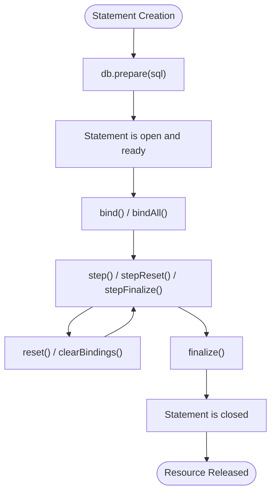
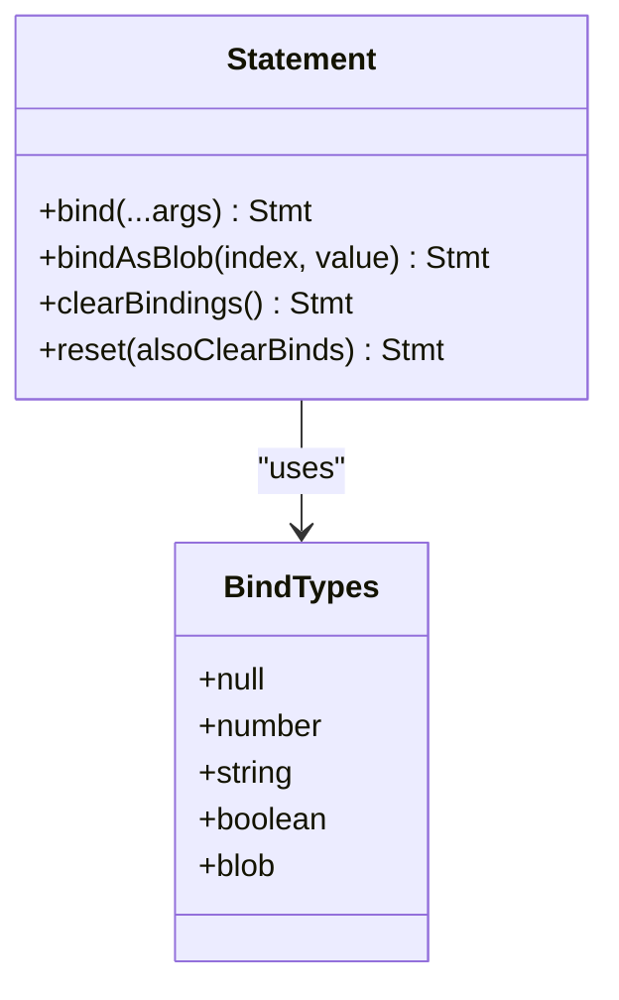
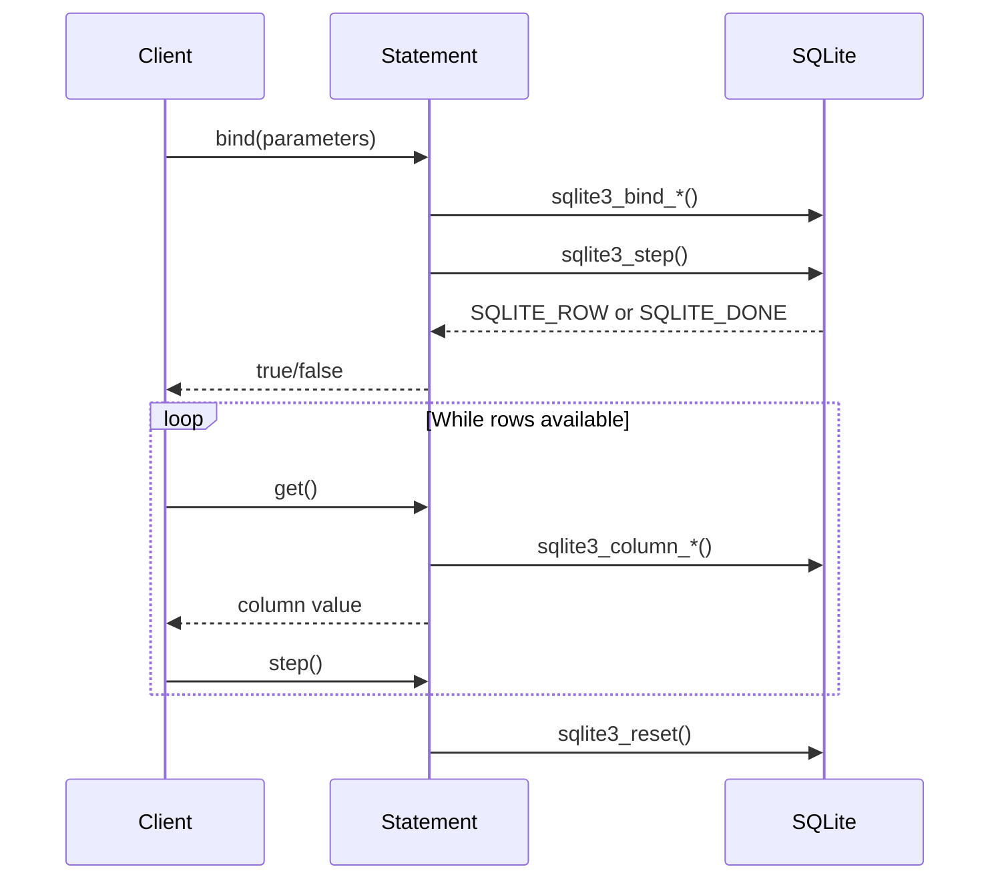
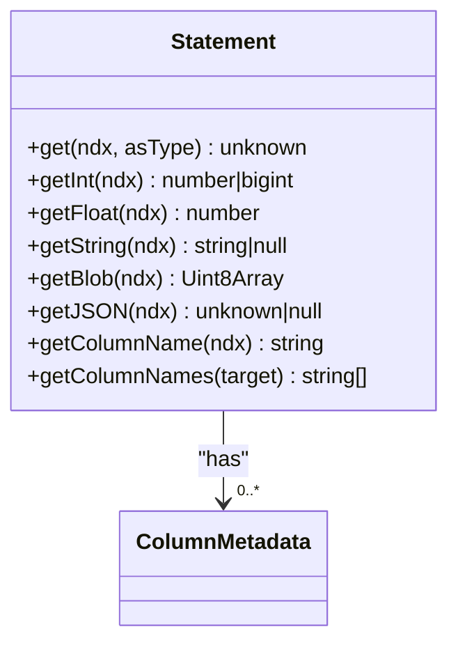
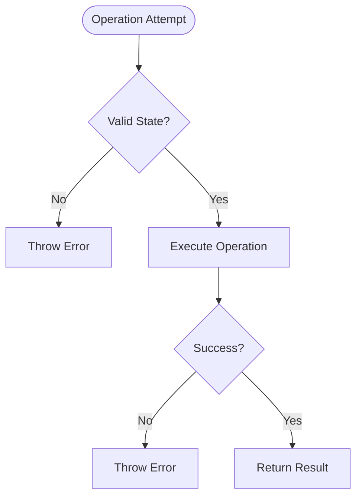

# Statement API

<cite>
**Referenced Files in This Document**   
- [statement.mjs](file://src/jswasm/api/oo1-db/db-statement/statement.mjs)
- [binding.mjs](file://src/jswasm/api/oo1-db/db-statement/binding.mjs)
- [execution.mjs](file://src/jswasm/api/oo1-db/db-statement/execution.mjs)
- [validation.mjs](file://src/jswasm/api/oo1-db/db-statement/validation.mjs)
- [database.mjs](file://src/jswasm/api/oo1-db/db-statement/database.mjs)
- [prepared-statements.e2e.test.ts](file://tests/e2e/prepared-statements.e2e.test.ts)
</cite>

## Table of Contents

1. [Introduction](#introduction)
2. [Statement Lifecycle](#statement-lifecycle)
3. [Parameter Binding](#parameter-binding)
4. [Execution Methods](#execution-methods)
5. [Result Retrieval](#result-retrieval)
6. [Resource Management](#resource-management)
7. [Error Handling](#error-handling)
8. [Performance Considerations](#performance-considerations)
9. [Usage Examples](#usage-examples)

## Introduction

The Statement class in web-sqlite-v2 provides a comprehensive interface for working with prepared SQL statements. This API enables efficient execution of parameterized queries, bulk operations, and complex data retrieval patterns while maintaining proper resource management and error handling. The Statement class serves as a wrapper around SQLite's prepared statement functionality, exposing methods for binding parameters, executing queries, retrieving results, and managing statement state.

**Section sources**

- [statement.mjs](file://src/jswasm/api/oo1-db/db-statement/statement.mjs#L29-L501)

## Statement Lifecycle

The lifecycle of a Statement instance begins with preparation via the `db.prepare()` method and ends with finalization. Statements are created exclusively through the Database.prepare() method, which internally calls the Statement constructor with a guard token to prevent direct instantiation.



**Diagram sources**

- [statement.mjs](file://src/jswasm/api/oo1-db/db-statement/statement.mjs#L38-L68)
- [database.mjs](file://src/jswasm/api/oo1-db/db-statement/database.mjs#L184-L213)

**Section sources**

- [statement.mjs](file://src/jswasm/api/oo1-db/db-statement/statement.mjs#L38-L68)
- [database.mjs](file://src/jswasm/api/oo1-db/db-statement/database.mjs#L184-L213)

## Parameter Binding

The Statement class provides flexible methods for binding parameters to prepared statements, supporting various data types and binding patterns. The primary binding method is `bind()`, which accepts parameters by index or name and supports multiple data types.

### Binding Methods

The API supports several binding approaches:

- **bind()**: Primary method for binding single values or multiple parameters
- **bindAsBlob()**: Forces binding as BLOB type regardless of inferred type
- **clearBindings()**: Clears all bound parameters from the statement



**Diagram sources**

- [statement.mjs](file://src/jswasm/api/oo1-db/db-statement/statement.mjs#L105-L177)
- [binding.mjs](file://src/jswasm/api/oo1-db/db-statement/binding.mjs#L22-L32)

**Section sources**

- [statement.mjs](file://src/jswasm/api/oo1-db/db-statement/statement.mjs#L105-L177)
- [binding.mjs](file://src/jswasm/api/oo1-db/db-statement/binding.mjs#L22-L32)

### Data Type Support

The binding system automatically determines the appropriate SQLite type based on JavaScript input:

| JavaScript Type        | SQLite Type          | Notes                                         |
| ---------------------- | -------------------- | --------------------------------------------- |
| null/undefined         | SQLITE_NULL          | Bound as NULL values                          |
| number                 | SQLITE_INTEGER/FLOAT | Integer for whole numbers, float for decimals |
| string                 | SQLITE_TEXT          | Default string binding                        |
| boolean                | SQLITE_INTEGER       | Stored as 0 (false) or 1 (true)               |
| ArrayBuffer/TypedArray | SQLITE_BLOB          | Binary data binding                           |

**Section sources**

- [binding.mjs](file://src/jswasm/api/oo1-db/db-statement/binding.mjs#L40-L58)

## Execution Methods

The Statement class provides several methods for executing prepared statements, each with different semantics for result handling and statement state management.

### Execution Flow



**Diagram sources**

- [statement.mjs](file://src/jswasm/api/oo1-db/db-statement/statement.mjs#L209-L230)
- [statement.mjs](file://src/jswasm/api/oo1-db/db-statement/statement.mjs#L269-L358)

**Section sources**

- [statement.mjs](file://src/jswasm/api/oo1-db/db-statement/statement.mjs#L209-L230)
- [statement.mjs](file://src/jswasm/api/oo1-db/db-statement/statement.mjs#L269-L358)

### Execution Methods

The following methods are available for statement execution:

- **step()**: Advances the statement to the next row, returning true if a row is available
- **stepReset()**: Combines step() and reset() for single-row queries
- **stepFinalize()**: Combines step(), reset(), and finalize() for one-off queries

**Section sources**

- [statement.mjs](file://src/jswasm/api/oo1-db/db-statement/statement.mjs#L209-L260)

## Result Retrieval

The Statement class provides comprehensive methods for retrieving query results with various formatting options and type handling.

### Column Access Methods

The API offers multiple ways to access column data:

- **get()**: Retrieves column values with flexible output formats
- **getInt()**: Retrieves column as integer
- **getFloat()**: Retrieves column as float
- **getString()**: Retrieves column as string
- **getBlob()**: Retrieves column as BLOB
- **getJSON()**: Retrieves column and parses as JSON



**Diagram sources**

- [statement.mjs](file://src/jswasm/api/oo1-db/db-statement/statement.mjs#L269-L438)

**Section sources**

- [statement.mjs](file://src/jswasm/api/oo1-db/db-statement/statement.mjs#L269-L438)

### Type Conversion Rules

When retrieving values, the API applies the following type conversion rules:

- **SQLITE_NULL**: Returns JavaScript null
- **SQLITE_INTEGER**: Returns Number or BigInt depending on size and configuration
- **SQLITE_FLOAT**: Returns Number
- **SQLITE_TEXT**: Returns String
- **SQLITE_BLOB**: Returns Uint8Array

**Section sources**

- [statement.mjs](file://src/jswasm/api/oo1-db/db-statement/statement.mjs#L298-L357)

## Resource Management

Proper resource management is critical when working with prepared statements to prevent memory leaks and ensure database integrity.

### Automatic Finalization

The API provides automatic resource cleanup through:

- Statement finalization when the database is closed
- Automatic finalization in convenience methods like stepFinalize()
- Internal tracking of open statements

### Explicit Finalization

Developers should explicitly finalize statements when they are no longer needed:

```mermaid
flowchart TD
A([Statement in Use]) --> B{Still Needed?}
B --> |Yes| C[Continue Using]
B --> |No| D[Call finalize()]
D --> E[Resources Released]
C --> B
```

**Diagram sources**

- [statement.mjs](file://src/jswasm/api/oo1-db/db-statement/statement.mjs#L57-L68)
- [database.mjs](file://src/jswasm/api/oo1-db/db-statement/database.mjs#L67-L92)

**Section sources**

- [statement.mjs](file://src/jswasm/api/oo1-db/db-statement/statement.mjs#L57-L68)
- [database.mjs](file://src/jswasm/api/oo1-db/db-statement/database.mjs#L67-L92)

## Error Handling

The Statement API provides comprehensive error handling for both binding and execution phases.

### Common Error Conditions

- **SQLITE_BUSY**: Database is locked by another operation
- **Constraint violations**: PRIMARY KEY, UNIQUE, NOT NULL, CHECK, or FOREIGN KEY constraints violated
- **Invalid parameter binding**: Incorrect parameter index or unsupported data type
- **Closed statement**: Attempting operations on a finalized statement

### Error Propagation

Errors are propagated through exceptions with descriptive messages, and the API includes validation methods to prevent illegal operations:



**Diagram sources**

- [validation.mjs](file://src/jswasm/api/oo1-db/db-statement/validation.mjs#L51-L55)
- [statement.mjs](file://src/jswasm/api/oo1-db/db-statement/statement.mjs#L220-L229)

**Section sources**

- [validation.mjs](file://src/jswasm/api/oo1-db/db-statement/validation.mjs#L51-L55)
- [statement.mjs](file://src/jswasm/api/oo1-db/db-statement/statement.mjs#L220-L229)

## Performance Considerations

The Statement API offers significant performance benefits for repeated query execution, but requires careful consideration of usage patterns.

### Statement Reuse vs One-off Queries

- **Reuse recommended**: For queries executed multiple times with different parameters
- **One-off preferred**: For queries executed only once
- **Bulk operations**: Use reset/rebind pattern for efficient bulk insertion

### Optimization Guidelines

- Prepare statements once and reuse them
- Use reset() instead of re-preparing for repeated execution
- Clear bindings only when necessary
- Finalize statements when no longer needed to free resources

**Section sources**

- [statement.mjs](file://src/jswasm/api/oo1-db/db-statement/statement.mjs#L89-L95)
- [prepared-statements.e2e.test.ts](file://tests/e2e/prepared-statements.e2e.test.ts#L57-L77)

## Usage Examples

The following examples demonstrate common usage patterns for the Statement API.

### Parameterized Queries

```javascript
const stmt = db.prepare("INSERT INTO users (name, age) VALUES (?, ?)");
stmt.bind("Alice", 30).step();
stmt.reset().bind("Bob", 25).step();
stmt.finalize();
```

### Bulk Insertion with Reset/Rebind

```javascript
const stmt = db.prepare("INSERT INTO data (value) VALUES (?)");
data.forEach((value) => {
    stmt.bind(value).stepReset();
});
stmt.finalize();
```

### Handling Large BLOB Data

```javascript
const blobData = new Uint8Array([
    /* large binary data */
]);
const stmt = db.prepare("INSERT INTO files (content) VALUES (?)");
stmt.bindAsBlob(blobData).stepFinalize();
```

**Section sources**

- [prepared-statements.e2e.test.ts](file://tests/e2e/prepared-statements.e2e.test.ts#L7-L108)
