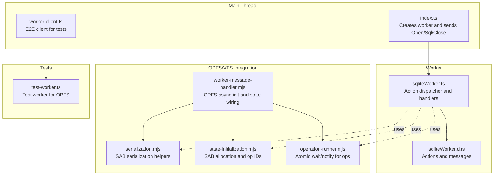
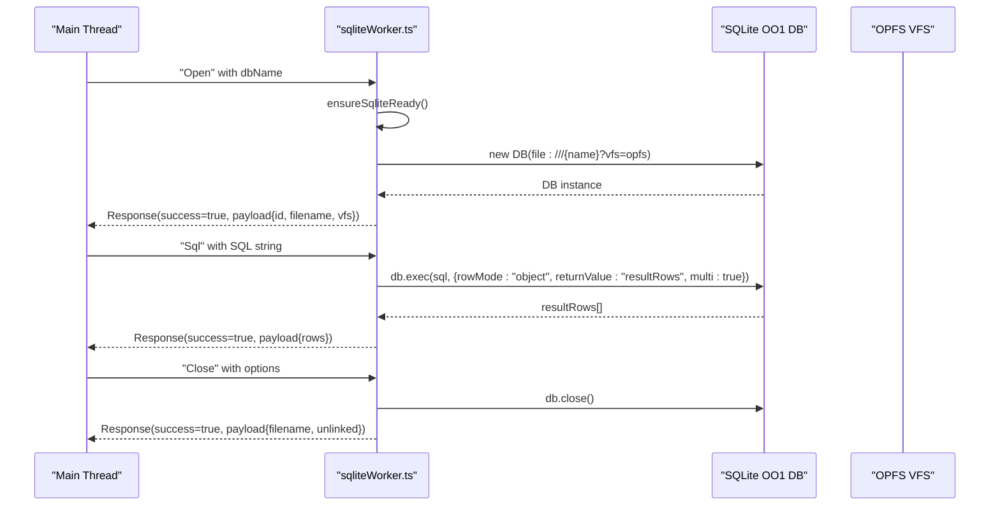
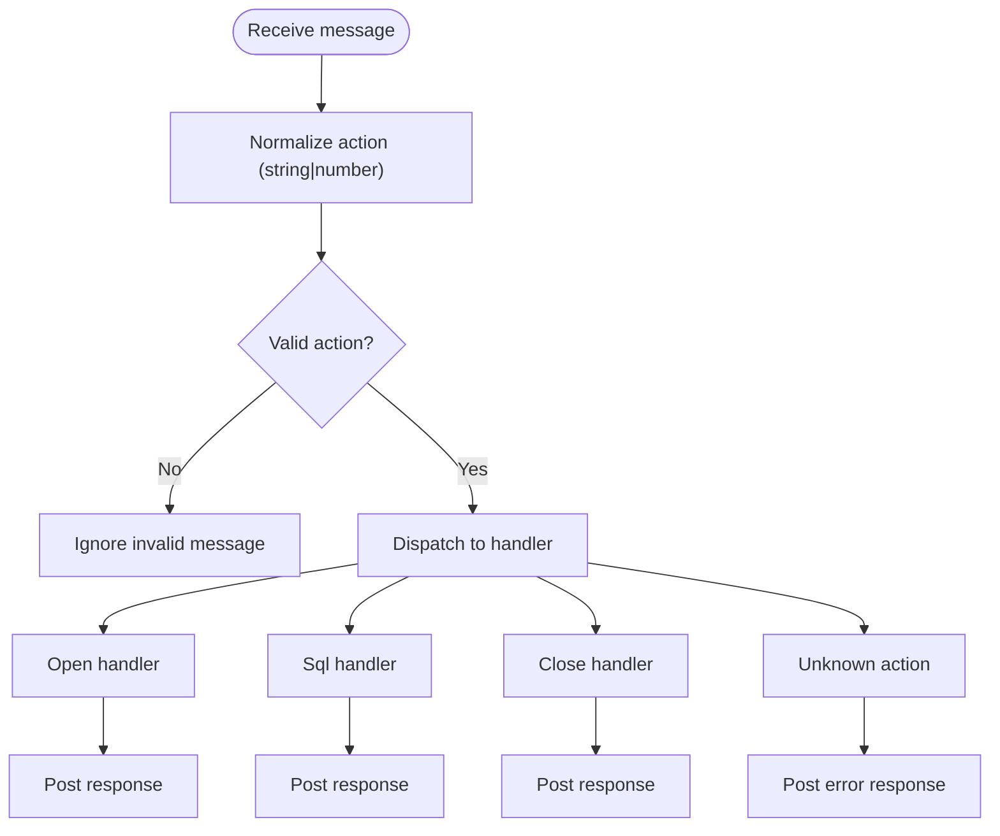
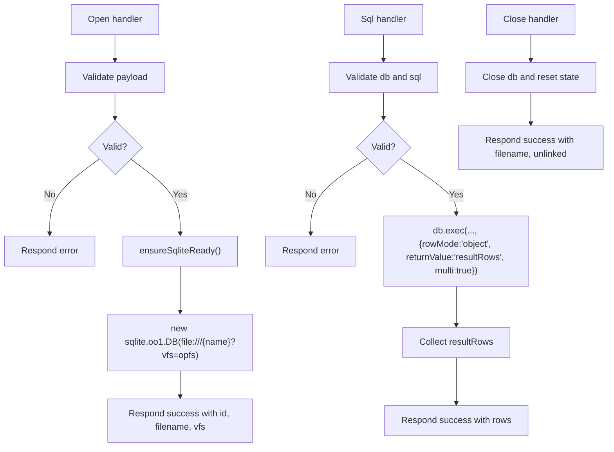
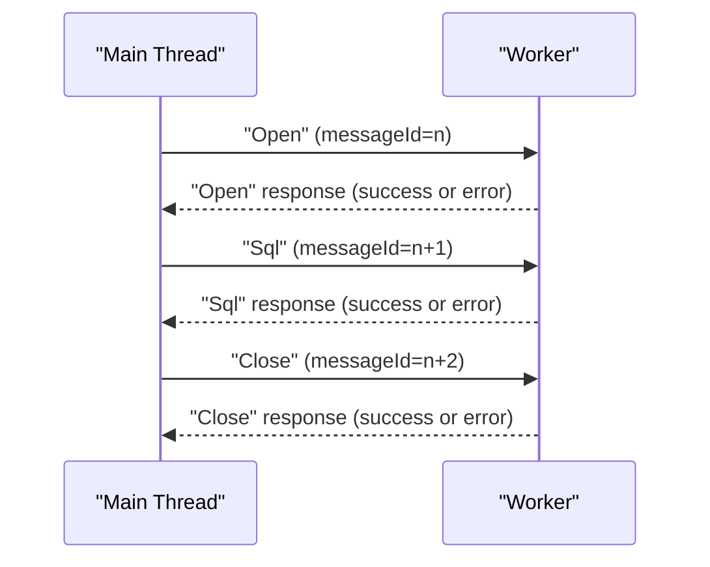
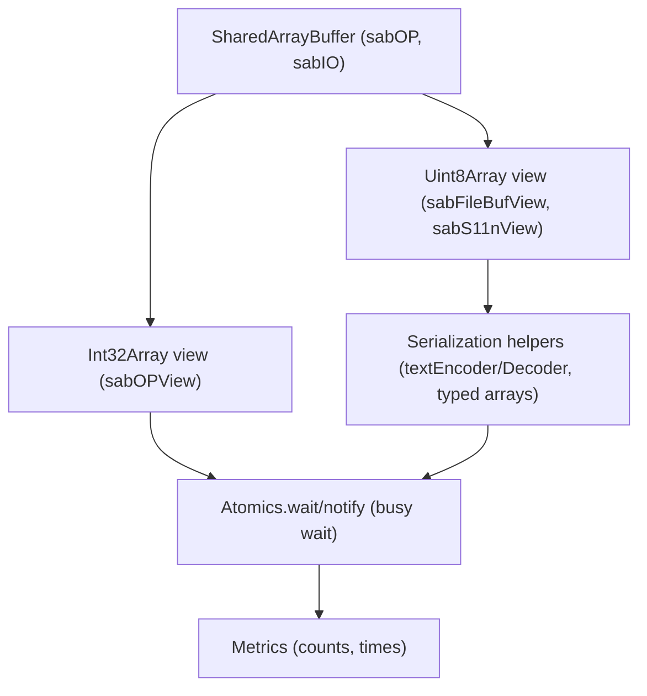
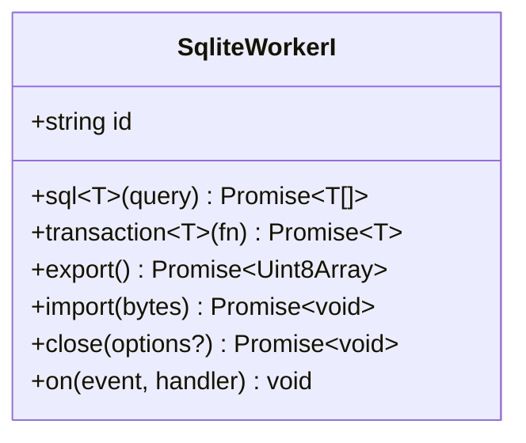
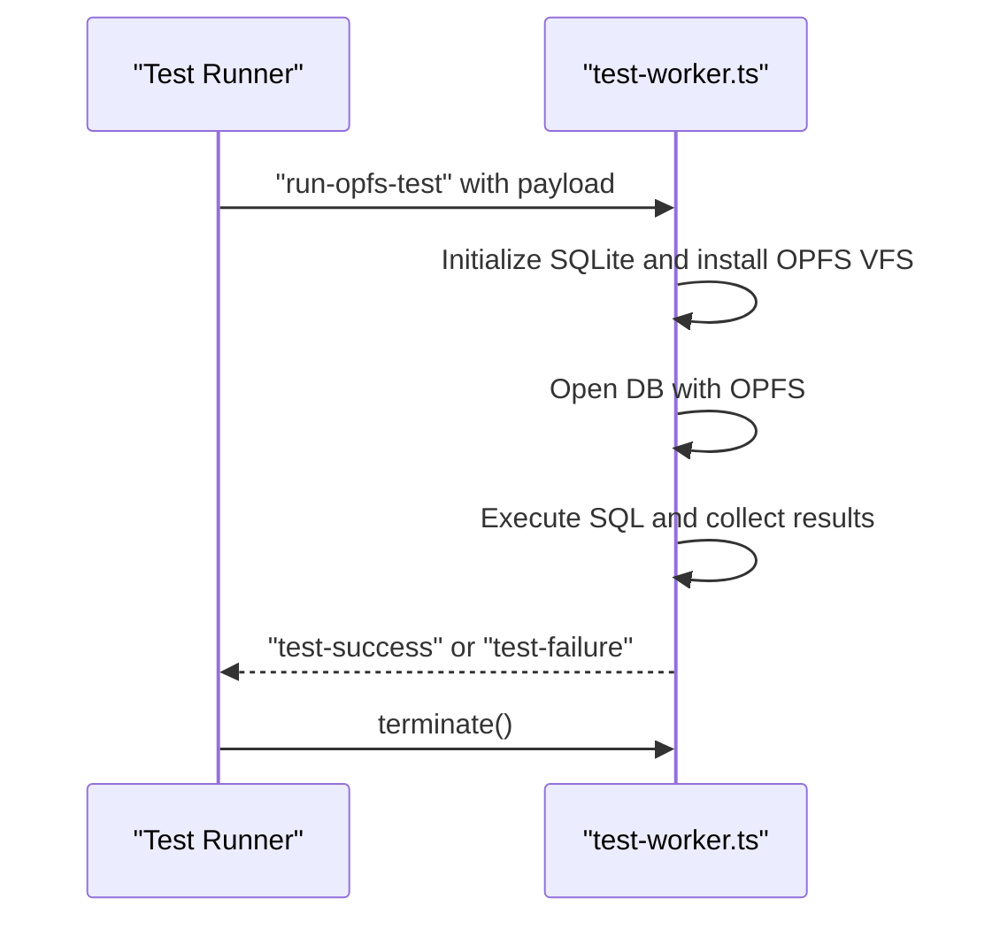
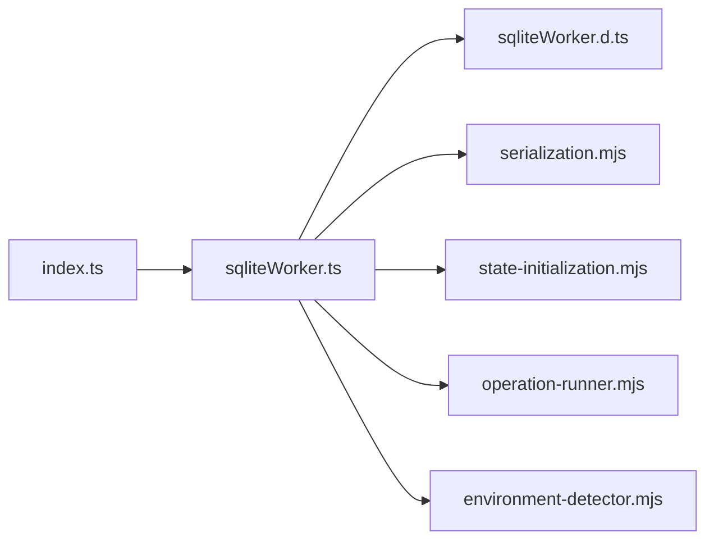
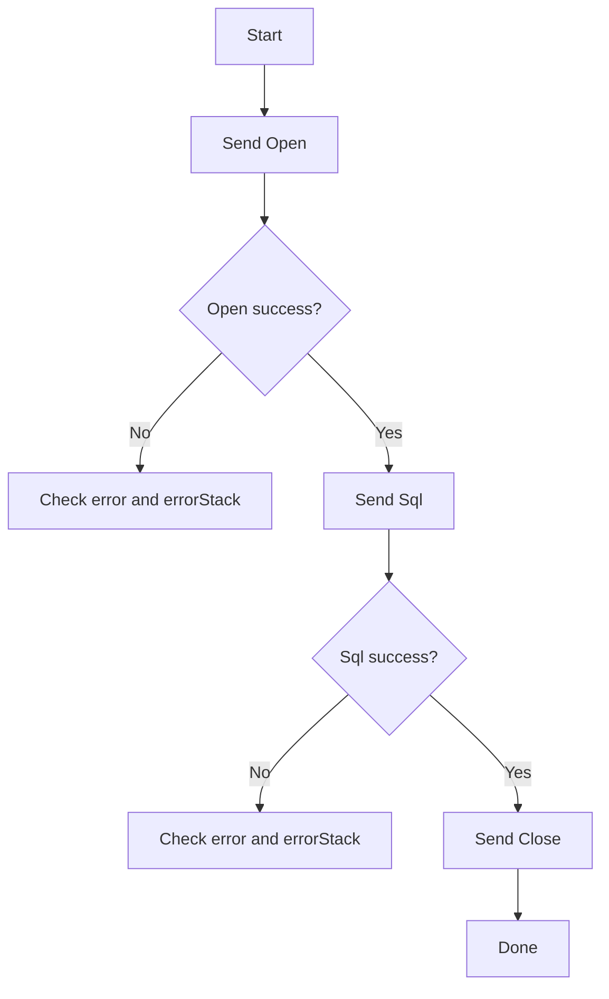

# Worker API

<cite>
**Referenced Files in This Document**
- [sqliteWorker.ts](file://src/sqliteWorker.ts)
- [sqliteWorker.d.ts](file://src/sqliteWorker.d.ts)
- [index.ts](file://src/index.ts)
- [worker-message-handler.mjs](file://src/jswasm/vfs/opfs/installer/utils/worker-message-handler.mjs)
- [serialization.mjs](file://src/jswasm/vfs/opfs/installer/core/serialization.mjs)
- [state-initialization.mjs](file://src/jswasm/vfs/opfs/installer/core/state-initialization.mjs)
- [operation-runner.mjs](file://src/jswasm/vfs/opfs/installer/core/operation-runner.mjs)
- [http-server.ts](file://scripts/http-server.ts)
- [environment-detector.mjs](file://src/jswasm/runtime/environment-detector.mjs)
- [worker-client.ts](file://tests/e2e/worker-client.ts)
- [test-worker.ts](file://tests/e2e/test-worker.ts)
- [performance.e2e.test.ts](file://tests/e2e/performance.e2e.test.ts)
- [error-handling.e2e.test.ts](file://tests/e2e/error-handling.e2e.test.ts)
</cite>

## Table of Contents

1. [Introduction](#introduction)
2. [Project Structure](#project-structure)
3. [Core Components](#core-components)
4. [Architecture Overview](#architecture-overview)
5. [Detailed Component Analysis](#detailed-component-analysis)
6. [Dependency Analysis](#dependency-analysis)
7. [Performance Considerations](#performance-considerations)
8. [Troubleshooting Guide](#troubleshooting-guide)
9. [Security Considerations](#security-considerations)
10. [Conclusion](#conclusion)
11. [Appendices](#appendices)

## Introduction

This document provides detailed API documentation for the Web Worker interface in web-sqlite-v2. It covers the message protocol structure, action codes, request/response payloads, error reporting, bidirectional communication between main thread and worker, initialization and lifetime management, SharedArrayBuffer usage for high-performance data transfer, the SqliteWorkerI interface and its methods, advanced usage patterns, security considerations, debugging strategies, and performance implications.

## Project Structure

The Worker API spans several modules:

- Worker entry and message handling logic
- Protocol definitions and interface contracts
- OPFS/VFS integration for high-performance IO and SAB-backed serialization
- Test harnesses demonstrating usage and environment setup

**Diagram sources**

- [index.ts](file://src/index.ts#L1-L92)
- [sqliteWorker.ts](file://src/sqliteWorker.ts#L1-L243)
- [sqliteWorker.d.ts](file://src/sqliteWorker.d.ts#L1-L115)
- [worker-message-handler.mjs](file://src/jswasm/vfs/opfs/installer/utils/worker-message-handler.mjs#L1-L126)
- [serialization.mjs](file://src/jswasm/vfs/opfs/installer/core/serialization.mjs#L1-L43)
- [state-initialization.mjs](file://src/jswasm/vfs/opfs/installer/core/state-initialization.mjs#L30-L126)
- [operation-runner.mjs](file://src/jswasm/vfs/opfs/installer/core/operation-runner.mjs#L30-L84)
- [worker-client.ts](file://tests/e2e/worker-client.ts#L1-L34)
- [test-worker.ts](file://tests/e2e/test-worker.ts#L1-L74)

**Section sources**

- [index.ts](file://src/index.ts#L1-L92)
- [sqliteWorker.ts](file://src/sqliteWorker.ts#L1-L243)
- [sqliteWorker.d.ts](file://src/sqliteWorker.d.ts#L1-L115)
- [worker-message-handler.mjs](file://src/jswasm/vfs/opfs/installer/utils/worker-message-handler.mjs#L1-L126)
- [serialization.mjs](file://src/jswasm/vfs/opfs/installer/core/serialization.mjs#L1-L43)
- [state-initialization.mjs](file://src/jswasm/vfs/opfs/installer/core/state-initialization.mjs#L30-L126)
- [operation-runner.mjs](file://src/jswasm/vfs/opfs/installer/core/operation-runner.mjs#L30-L84)
- [worker-client.ts](file://tests/e2e/worker-client.ts#L1-L34)
- [test-worker.ts](file://tests/e2e/test-worker.ts#L1-L74)

## Core Components

- Worker message protocol and actions
    - Actions: Open, Close, Sql
    - RequestMessage: action, messageId, payload
    - ResponseMessage: action, messageId, success, payload, error, errorStack
- Worker action handlers
    - Open: initializes SQLite module and opens a database with OPFS VFS
    - Sql: executes SQL and returns rows
    - Close: closes the database and optionally unlinks persistent storage
- SqliteWorkerI interface
    - Methods: sql, transaction, export, import, close, on
    - Events: ready, open, close, error, row, log

**Section sources**

- [sqliteWorker.d.ts](file://src/sqliteWorker.d.ts#L1-L115)
- [sqliteWorker.ts](file://src/sqliteWorker.ts#L1-L243)

## Architecture Overview

The Worker API uses a simple request/response protocol over postMessage. The main thread creates a worker, sends an Open request, then performs Sql operations, and finally sends a Close request. The worker validates actions, dispatches to handlers, and posts structured responses. For high-performance IO, OPFS is integrated with SharedArrayBuffer-backed state and serialization.

**Diagram sources**

- [sqliteWorker.ts](file://src/sqliteWorker.ts#L68-L206)
- [sqliteWorker.d.ts](file://src/sqliteWorker.d.ts#L88-L115)

## Detailed Component Analysis

### Message Protocol and Payloads

- Actions
    - Open: initializes SQLite and opens a database with OPFS VFS
    - Sql: executes SQL and returns rows
    - Close: closes the database and optionally unlinks persistent storage
- RequestMessage
    - action: number or string enum member
    - messageId: number
    - payload: varies by action
- ResponseMessage
    - action: echoed from request
    - messageId: echoed from request
    - success: boolean
    - payload: varies by action
    - error: string (optional)
    - errorStack: string[] (optional)

**Diagram sources**

- [sqliteWorker.ts](file://src/sqliteWorker.ts#L35-L45)
- [sqliteWorker.ts](file://src/sqliteWorker.ts#L208-L242)

**Section sources**

- [sqliteWorker.d.ts](file://src/sqliteWorker.d.ts#L88-L115)
- [sqliteWorker.ts](file://src/sqliteWorker.ts#L16-L29)
- [sqliteWorker.ts](file://src/sqliteWorker.ts#L208-L242)

### Worker Action Handlers

- Open
    - Validates payload (non-empty string)
    - Ensures SQLite module is ready
    - Opens DB with OPFS VFS
    - Responds with id, filename, vfs
- Sql
    - Validates DB is open and payload is a string
    - Executes SQL with rowMode "object" and collects resultRows
    - Responds with rows
- Close
    - Optionally unlinks persistent storage (behavior delegated to OPFS wrappers)
    - Responds with filename and unlinked flag

**Diagram sources**

- [sqliteWorker.ts](file://src/sqliteWorker.ts#L68-L111)
- [sqliteWorker.ts](file://src/sqliteWorker.ts#L112-L166)
- [sqliteWorker.ts](file://src/sqliteWorker.ts#L168-L206)

**Section sources**

- [sqliteWorker.ts](file://src/sqliteWorker.ts#L68-L206)

### Bidirectional Communication and Lifetime Management

- Initialization
    - Main thread creates a worker and sets up message handlers
    - Sends Open request with messageId
    - Waits for success response before issuing Sql requests
- Lifetime
    - Sql requests can be issued multiple times
    - Close request should be sent to release resources
- Error handling
    - Both request and response include error and errorStack fields
    - Unknown actions and invalid payloads are rejected with error messages

**Diagram sources**

- [index.ts](file://src/index.ts#L64-L91)
- [sqliteWorker.ts](file://src/sqliteWorker.ts#L208-L242)

**Section sources**

- [index.ts](file://src/index.ts#L64-L91)
- [sqliteWorker.ts](file://src/sqliteWorker.ts#L208-L242)

### SharedArrayBuffer Usage for High-Performance Data Transfer

- SAB allocation and operation IDs
    - SharedArrayBuffer is allocated for OPFS operations
    - Operation IDs are defined for synchronization
- Serialization/deserialization
    - UTF-8 encoding/decoding for strings
    - Typed arrays for numeric types
    - DataView for cross-endian reads/writes
- Atomic wait/notify
    - Busy-wait loop using Atomics.wait/notify for async completion
    - Metrics tracking for serialization and operation timings

**Diagram sources**

- [state-initialization.mjs](file://src/jswasm/vfs/opfs/installer/core/state-initialization.mjs#L30-L126)
- [serialization.mjs](file://src/jswasm/vfs/opfs/installer/core/serialization.mjs#L1-L43)
- [operation-runner.mjs](file://src/jswasm/vfs/opfs/installer/core/operation-runner.mjs#L30-L84)

**Section sources**

- [state-initialization.mjs](file://src/jswasm/vfs/opfs/installer/core/state-initialization.mjs#L30-L126)
- [serialization.mjs](file://src/jswasm/vfs/opfs/installer/core/serialization.mjs#L1-L43)
- [operation-runner.mjs](file://src/jswasm/vfs/opfs/installer/core/operation-runner.mjs#L30-L84)

### SqliteWorkerI Interface and Implementation Notes

- Methods
    - sql(query): executes SELECT-like queries and returns typed rows
    - transaction(fn): runs a function within a transaction boundary
    - export(): exports database as bytes
    - import(bytes): imports database bytes
    - close(options?): closes database and optionally unlinks persistent storage
    - on(event, handler): subscribes to lifecycle and diagnostic events
- Implementation
    - The interface defines the contract; the worker implements Open/Sql/Close actions
    - Additional methods (export/import/transaction) are part of the adapter contract and may be implemented elsewhere

**Diagram sources**

- [sqliteWorker.d.ts](file://src/sqliteWorker.d.ts#L1-L87)

**Section sources**

- [sqliteWorker.d.ts](file://src/sqliteWorker.d.ts#L1-L87)

### Advanced Usage Patterns

- Direct worker usage for advanced scenarios
    - Create a Worker from a module URL and send custom messages
    - Handle worker messages and terminate when done
- Example: E2E test worker demonstrates running OPFS-enabled SQLite operations inside a dedicated worker

**Diagram sources**

- [worker-client.ts](file://tests/e2e/worker-client.ts#L1-L34)
- [test-worker.ts](file://tests/e2e/test-worker.ts#L1-L74)

**Section sources**

- [worker-client.ts](file://tests/e2e/worker-client.ts#L1-L34)
- [test-worker.ts](file://tests/e2e/test-worker.ts#L1-L74)

## Dependency Analysis

- Worker depends on SQLite WASM module and OPFS VFS
- OPFS integration uses SharedArrayBuffer for high-performance IO
- Environment detection distinguishes web vs worker contexts

**Diagram sources**

- [index.ts](file://src/index.ts#L1-L92)
- [sqliteWorker.ts](file://src/sqliteWorker.ts#L1-L243)
- [sqliteWorker.d.ts](file://src/sqliteWorker.d.ts#L1-L115)
- [serialization.mjs](file://src/jswasm/vfs/opfs/installer/core/serialization.mjs#L1-L43)
- [state-initialization.mjs](file://src/jswasm/vfs/opfs/installer/core/state-initialization.mjs#L30-L126)
- [operation-runner.mjs](file://src/jswasm/vfs/opfs/installer/core/operation-runner.mjs#L30-L84)
- [environment-detector.mjs](file://src/jswasm/runtime/environment-detector.mjs#L1-L45)

**Section sources**

- [index.ts](file://src/index.ts#L1-L92)
- [sqliteWorker.ts](file://src/sqliteWorker.ts#L1-L243)
- [sqliteWorker.d.ts](file://src/sqliteWorker.d.ts#L1-L115)
- [environment-detector.mjs](file://src/jswasm/runtime/environment-detector.mjs#L1-L45)

## Performance Considerations

- Message serialization overhead
    - Responses include rows as objects; large result sets increase serialization cost
    - Prefer batching SQL operations to reduce round-trips
- SharedArrayBuffer benefits
    - OPFS operations use SAB for zero-copy IO and atomic synchronization
    - Serialization helpers minimize copying and leverage typed arrays
- Busy-wait and metrics
    - Operation runner uses Atomics.wait with busy-wait loop; metrics track wait and operation times
- Practical guidance
    - Use transactions for bulk operations
    - Avoid extremely large SQL strings in requests
    - Monitor performance in tests to estimate overhead

**Section sources**

- [performance.e2e.test.ts](file://tests/e2e/performance.e2e.test.ts#L1-L119)
- [operation-runner.mjs](file://src/jswasm/vfs/opfs/installer/core/operation-runner.mjs#L30-L84)
- [serialization.mjs](file://src/jswasm/vfs/opfs/installer/core/serialization.mjs#L1-L43)

## Troubleshooting Guide

- Worker not responding
    - Ensure Open is successful before sending Sql
    - Verify messageId increments and responses match requests
- Error reporting
    - Responses include error and errorStack fields
    - Tests demonstrate error propagation for invalid SQL and missing tables
- Environment and headers
    - SharedArrayBuffer requires COOP/COEP headers
    - A local HTTP server sets these headers for development
- Debugging steps
    - Use browser devtools to inspect worker messages
    - Log onmessage handlers in the main thread
    - Confirm OPFS availability and environment detection

**Diagram sources**

- [sqliteWorker.ts](file://src/sqliteWorker.ts#L208-L242)
- [error-handling.e2e.test.ts](file://tests/e2e/error-handling.e2e.test.ts#L1-L50)

**Section sources**

- [sqliteWorker.ts](file://src/sqliteWorker.ts#L208-L242)
- [error-handling.e2e.test.ts](file://tests/e2e/error-handling.e2e.test.ts#L1-L50)
- [http-server.ts](file://scripts/http-server.ts#L151-L154)

## Security Considerations

- Origin isolation
    - SharedArrayBuffer requires COOP/COEP headers; the development server sets these headers
- Script injection risks
    - SQL payloads are executed as-is; sanitize inputs and use parameterized queries when supported
- Content Security Policies
    - Ensure CSP allows workers and inline evaluation if needed for development
- Environment checks
    - Verify OPFS availability and environment detection in worker contexts

**Section sources**

- [http-server.ts](file://scripts/http-server.ts#L151-L154)
- [environment-detector.mjs](file://src/jswasm/runtime/environment-detector.mjs#L1-L45)

## Conclusion

The Worker API provides a clean, message-driven interface for SQLite operations in a Web Worker. It supports Open, Sql, and Close actions with robust error reporting. High-performance IO is enabled via OPFS and SharedArrayBuffer, with serialization and atomic synchronization primitives. The SqliteWorkerI interface defines a consistent adapter contract, while the worker implementation focuses on the core actions. Proper environment setup, careful error handling, and performance-aware usage patterns ensure reliable operation.

## Appendices

### Appendix A: Protocol Reference

- Actions
    - Open: payload is a database name/path string
    - Sql: payload is an SQL string
    - Close: payload is optional with unlink flag
- RequestMessage
    - action: number or string enum member
    - messageId: number
    - payload: varies by action
- ResponseMessage
    - action: echoed from request
    - messageId: echoed from request
    - success: boolean
    - payload: varies by action
    - error: string (optional)
    - errorStack: string[] (optional)

**Section sources**

- [sqliteWorker.d.ts](file://src/sqliteWorker.d.ts#L88-L115)
- [sqliteWorker.ts](file://src/sqliteWorker.ts#L16-L29)

### Appendix B: Example Workflows

- Basic usage
    - Create worker, send Open, send Sql, send Close
- Advanced usage
    - Use test-worker.ts as a template for custom worker logic
    - Leverage OPFS VFS and SAB-backed serialization for heavy IO

**Section sources**

- [index.ts](file://src/index.ts#L64-L91)
- [worker-client.ts](file://tests/e2e/worker-client.ts#L1-L34)
- [test-worker.ts](file://tests/e2e/test-worker.ts#L1-L74)
