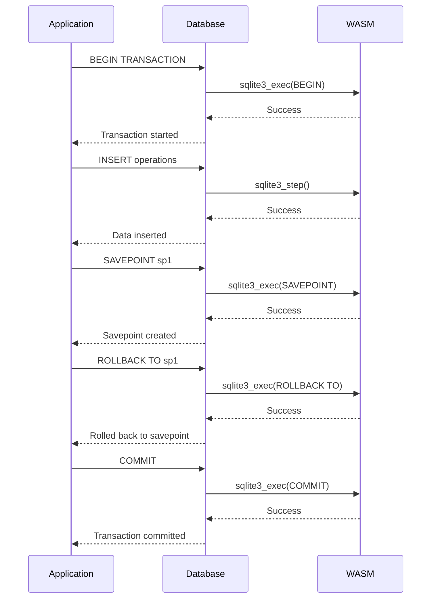
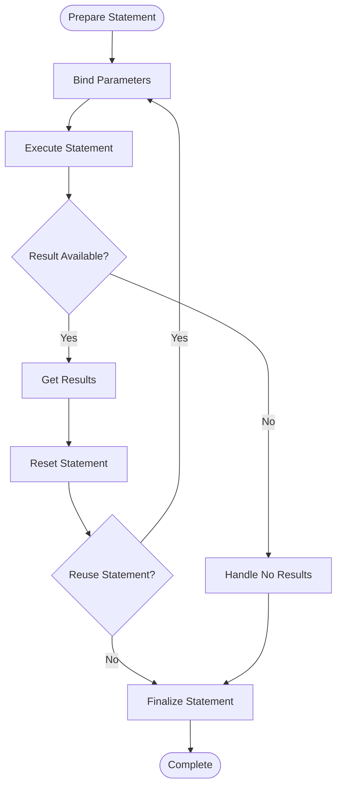
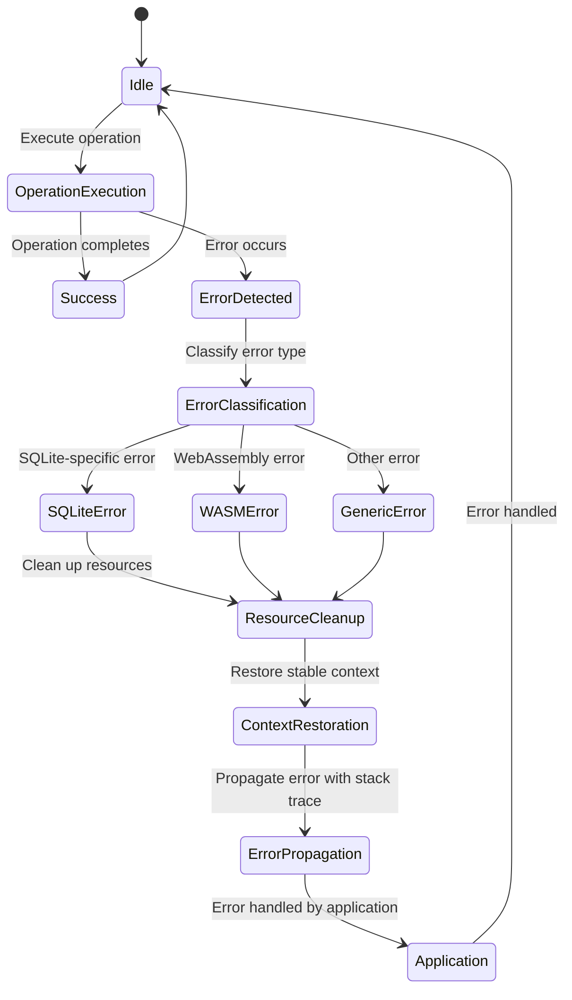
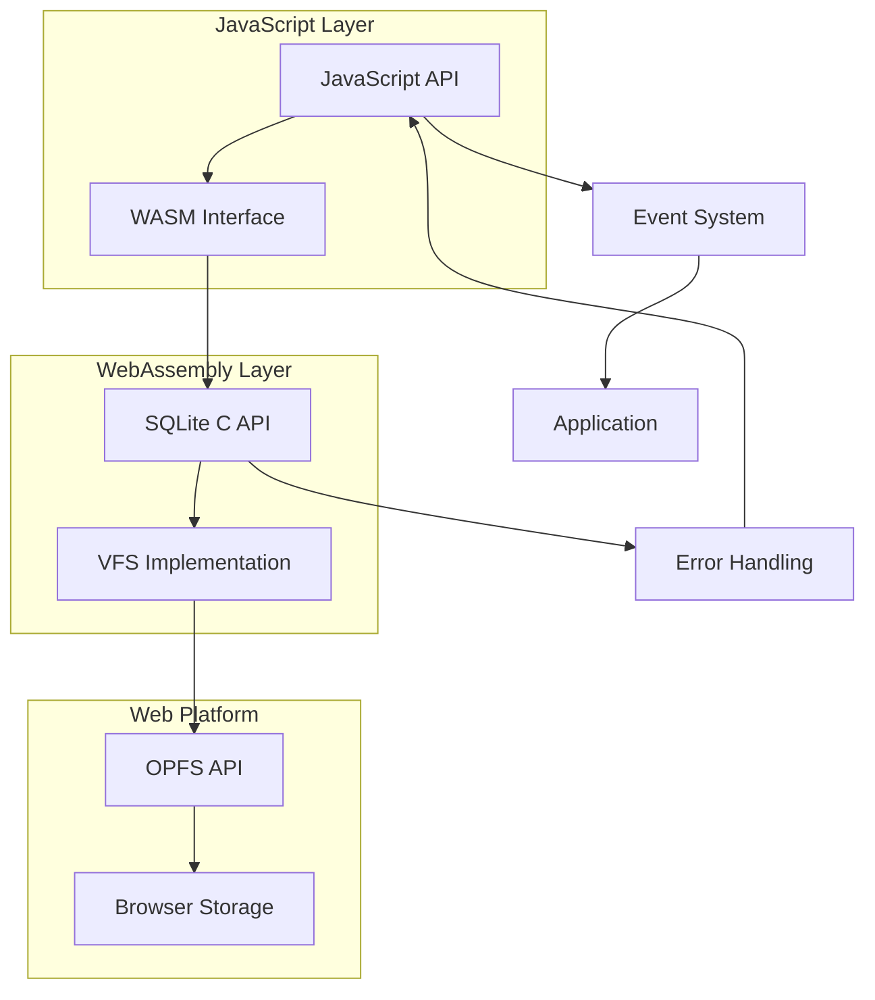

# Advanced Features

<cite>
**Referenced Files in This Document**   
- [transactions.e2e.test.ts](file://tests/e2e/transactions.e2e.test.ts)
- [prepared-statements.e2e.test.ts](file://tests/e2e/prepared-statements.e2e.test.ts)
- [error-handling.e2e.test.ts](file://tests/e2e/error-handling.e2e.test.ts)
- [schema-operations.e2e.test.ts](file://tests/e2e/schema-operations.e2e.test.ts)
- [index.mjs](file://src/jswasm/api/oo1-db/db-statement/index.mjs)
- [binding.mjs](file://src/jswasm/api/oo1-db/db-statement/binding.mjs)
- [execution.mjs](file://src/jswasm/api/oo1-db/db-statement/execution.mjs)
- [validation.mjs](file://src/jswasm/api/oo1-db/db-statement/validation.mjs)
- [statement.mjs](file://src/jswasm/api/oo1-db/db-statement/statement.mjs)
- [error-utils.mjs](file://src/jswasm/wasm/bootstrap/error-utils.mjs)
- [io-sync-wrappers.mjs](file://src/jswasm/vfs/opfs/installer/wrappers/io-sync-wrappers.mjs)
- [index.ts](file://src/index.ts)
- [sqliteWorker.ts](file://src/sqliteWorker.ts)
</cite>

## Table of Contents

1. [Transaction Implementation](#transaction-implementation)
2. [Prepared Statements Functionality](#prepared-statements-functionality)
3. [Error Handling System](#error-handling-system)
4. [Complex Queries and Bulk Operations](#complex-queries-and-bulk-operations)
5. [Schema Migrations](#schema-migrations)
6. [WASM Implementation Relationships](#wasm-implementation-relationships)
7. [Common Issues and Solutions](#common-issues-and-solutions)
8. [Performance Optimization Tips](#performance-optimization-tips)
9. [Best Practices](#best-practices)

## Transaction Implementation

The web-sqlite-v2 library provides robust transaction support through SQLite's native transaction system, implemented via WebAssembly. Transactions ensure atomicity, consistency, isolation, and durability (ACID properties) for database operations. The implementation supports explicit transactions using BEGIN/COMMIT/ROLLBACK commands as well as nested savepoints for granular control.

Nested transactions are implemented using SQLite's SAVEPOINT mechanism, allowing for partial rollbacks within a larger transaction scope. This enables complex business logic where certain operations can be rolled back independently while maintaining the overall transaction context. The e2e tests demonstrate successful transaction execution with COMMIT, rollback behavior with ROLLBACK, and nested savepoint functionality that allows rolling back to specific points within a transaction.

The transaction system handles automatic rollback on error conditions, ensuring data integrity when operations fail. When an error occurs within a transaction block, all changes made since the transaction began are automatically rolled back, preventing partial updates from being committed to the database. This behavior is critical for maintaining data consistency in web applications.

**Diagram sources**

- [transactions.e2e.test.ts](file://tests/e2e/transactions.e2e.test.ts#L102-L128)
- [sqliteWorker.ts](file://src/sqliteWorker.ts#L138-L142)

**Section sources**

- [transactions.e2e.test.ts](file://tests/e2e/transactions.e2e.test.ts)
- [sqliteWorker.ts](file://src/sqliteWorker.ts#L138-L142)

## Prepared Statements Functionality

Prepared statements in web-sqlite-v2 provide significant performance benefits and security advantages over direct SQL execution. The implementation allows for parameter binding, statement reuse, and efficient execution of repetitive database operations. Prepared statements are compiled once and can be executed multiple times with different parameter values, reducing parsing overhead and improving performance.

The parameter binding system supports both positional (?) and named ($name) parameters, allowing flexible query construction. The binding.mjs module handles type determination and conversion, supporting various data types including null, number, string, boolean, and blob. When binding values, the system automatically determines the appropriate SQLite type and performs necessary conversions, ensuring data integrity and optimal storage.

Statement reuse is a key performance feature, enabling applications to prepare a statement once and execute it multiple times with different parameters. This is particularly beneficial for bulk operations and repetitive queries. The reset() method allows statements to be reused without recompilation, while clearBindings() enables resetting parameter values. The implementation also supports binding arrays and objects directly, simplifying bulk operations.

**Diagram sources**

- [prepared-statements.e2e.test.ts](file://tests/e2e/prepared-statements.e2e.test.ts)
- [binding.mjs](file://src/jswasm/api/oo1-db/db-statement/binding.mjs)
- [statement.mjs](file://src/jswasm/api/oo1-db/db-statement/statement.mjs)

**Section sources**

- [prepared-statements.e2e.test.ts](file://tests/e2e/prepared-statements.e2e.test.ts)
- [binding.mjs](file://src/jswasm/api/oo1-db/db-statement/binding.mjs#L106-L197)
- [statement.mjs](file://src/jswasm/api/oo1-db/db-statement/statement.mjs#L75-L96)

## Error Handling System

The error handling system in web-sqlite-v2 is comprehensive and designed to provide meaningful feedback while maintaining application stability. It implements custom error types that extend JavaScript's Error class, providing detailed information about SQLite-specific error conditions. The system includes stack tracing capabilities and structured recovery strategies to help developers diagnose and resolve issues.

Custom error types include SQLite3Error for general SQLite errors and WasmAllocError for WebAssembly memory allocation failures. These error types include result codes that correspond to SQLite's native error codes, making it easier to identify specific failure conditions. The error messages are designed to be descriptive and include relevant context, such as the SQL statement that caused the error and the specific error code.

The recovery strategies implemented in the system follow a layered approach, with immediate error handling at the operation level and higher-level recovery mechanisms for critical failures. When an error occurs, the system attempts to clean up resources and restore a stable state before propagating the error to the application layer. This prevents resource leaks and ensures that subsequent operations can proceed safely.

**Diagram sources**

- [error-handling.e2e.test.ts](file://tests/e2e/error-handling.e2e.test.ts)
- [error-utils.mjs](file://src/jswasm/wasm/bootstrap/error-utils.mjs)
- [validation.mjs](file://src/jswasm/api/oo1-db/db-statement/validation.mjs)

**Section sources**

- [error-handling.e2e.test.ts](file://tests/e2e/error-handling.e2e.test.ts)
- [error-utils.mjs](file://src/jswasm/wasm/bootstrap/error-utils.mjs)
- [validation.mjs](file://src/jswasm/api/oo1-db/db-statement/validation.mjs#L28-L42)

## Complex Queries and Bulk Operations

web-sqlite-v2 supports complex queries and bulk operations through its comprehensive SQL execution engine and optimized data handling mechanisms. The implementation allows for multi-statement execution, complex JOIN operations, subqueries, and advanced filtering with WHERE clauses. The exec() method can handle multiple SQL statements in a single call, improving performance for batch operations.

Bulk operations are optimized through the use of prepared statements and transaction batching. By wrapping multiple insert, update, or delete operations in a transaction, applications can achieve significant performance improvements compared to individual operations. The library also supports bulk binding of parameter arrays, enabling efficient processing of large datasets.

The query execution system includes optimizations for result set handling, including configurable row modes (array, object, or statement) and efficient memory management. For large result sets, the system provides streaming capabilities through the step() method, allowing applications to process results incrementally without loading the entire dataset into memory.

**Section sources**

- [prepared-statements.e2e.test.ts](file://tests/e2e/prepared-statements.e2e.test.ts)
- [execution.mjs](file://src/jswasm/api/oo1-db/db-statement/execution.mjs#L26-L61)
- [statement.mjs](file://src/jswasm/api/oo1-db/db-statement/statement.mjs#L209-L231)

## Schema Migrations

Schema management in web-sqlite-v2 follows standard SQLite practices with additional safeguards for web environments. The implementation supports all standard DDL operations including CREATE, ALTER, and DROP statements for tables, indexes, and other database objects. Schema migrations can be performed programmatically through SQL execution or via higher-level APIs.

The library provides robust support for schema evolution, including adding columns to existing tables, creating indexes for performance optimization, and modifying table structures. The e2e tests demonstrate various schema operations such as creating tables with different column types, adding indexes, altering tables to add columns, and dropping tables.

Special consideration is given to schema operations in the context of OPFS (Origin Private File System), ensuring that file locks and concurrent access are properly managed during schema changes. The implementation also includes validation to prevent common schema-related errors, such as creating tables with invalid column types or violating constraints.

**Section sources**

- [schema-operations.e2e.test.ts](file://tests/e2e/schema-operations.e2e.test.ts)
- [sqliteWorker.ts](file://src/sqliteWorker.ts#L138-L142)
- [execution.mjs](file://src/jswasm/api/oo1-db/db-statement/execution.mjs)

## WASM Implementation Relationships

The web-sqlite-v2 library's advanced features are deeply integrated with its WebAssembly implementation, creating a tight coupling between JavaScript APIs and native SQLite functionality. The WASM module provides the core SQLite engine, while JavaScript layers handle API abstraction, error handling, and integration with web platform features.

The relationship between JavaScript and WASM is managed through a well-defined interface that exposes SQLite's C API functions to JavaScript. This includes direct access to sqlite3_prepare_v2, sqlite3_step, sqlite3_exec, and other critical functions that power the advanced features. Memory management between JavaScript and WASM is handled through shared memory buffers and careful allocation/deallocation patterns.

File system operations are implemented through OPFS (Origin Private File System) wrappers that translate SQLite's VFS (Virtual File System) calls to web platform APIs. This enables persistent storage while maintaining the security model of web browsers. The io-sync-wrappers.mjs module implements the necessary VFS methods like xRead, xWrite, xClose, and xSync, ensuring proper file handling in the web environment.

**Diagram sources**

- [io-sync-wrappers.mjs](file://src/jswasm/vfs/opfs/installer/wrappers/io-sync-wrappers.mjs)
- [sqliteWorker.ts](file://src/sqliteWorker.ts)
- [index.ts](file://src/index.ts)

**Section sources**

- [io-sync-wrappers.mjs](file://src/jswasm/vfs/opfs/installer/wrappers/io-sync-wrappers.mjs)
- [sqliteWorker.ts](file://src/sqliteWorker.ts)
- [index.ts](file://src/index.ts)

## Common Issues and Solutions

Several common issues arise when using advanced features in web-sqlite-v2, primarily related to transaction locking, statement finalization, and error propagation from WASM. Understanding these issues and their solutions is critical for building reliable applications.

Transaction locking occurs when multiple operations attempt to access the database simultaneously, particularly in concurrent environments. The OPFS VFS implementation includes locking mechanisms to prevent data corruption, but applications must handle SQLITE_BUSY errors appropriately. Implementing retry logic with exponential backoff is recommended for handling transient locking issues.

Statement finalization is crucial for preventing memory leaks in the WASM environment. Every prepared statement must be finalized either explicitly through finalize() or implicitly through reset() and garbage collection. Failure to finalize statements can lead to memory exhaustion, particularly in long-running applications with high query volumes.

Error propagation from WASM requires careful handling, as errors must be translated from SQLite result codes to JavaScript Error objects. The error handling system in web-sqlite-v2 provides this translation, but applications should implement additional error boundaries to prevent unhandled exceptions from crashing the application.

**Section sources**

- [io-sync-wrappers.mjs](file://src/jswasm/vfs/opfs/installer/wrappers/io-sync-wrappers.mjs)
- [statement.mjs](file://src/jswasm/api/oo1-db/db-statement/statement.mjs#L57-L69)
- [error-utils.mjs](file://src/jswasm/wasm/bootstrap/error-utils.mjs)

## Performance Optimization Tips

Optimizing performance in web-sqlite-v2 requires understanding both the JavaScript and WASM aspects of the implementation. Key optimization strategies include proper transaction management, efficient prepared statement usage, and careful memory management.

For transaction performance, batch multiple operations within a single transaction rather than using individual transactions for each operation. This reduces the overhead of transaction management and improves overall throughput. For bulk operations, wrap the entire operation in a transaction to achieve maximum performance.

Prepared statement reuse provides significant performance benefits for repetitive queries. Prepare statements once and reuse them with different parameters rather than preparing new statements for each execution. Use the reset() method to reuse statements efficiently, and consider maintaining a cache of prepared statements for frequently executed queries.

Memory management optimizations include using appropriate row modes (array vs object) based on access patterns, processing large result sets incrementally using the step() method, and ensuring timely finalization of prepared statements. For bulk operations, consider using parameter arrays to minimize JavaScript-to-WASM boundary crossings.

**Section sources**

- [prepared-statements.e2e.test.ts](file://tests/e2e/prepared-statements.e2e.test.ts)
- [execution.mjs](file://src/jswasm/api/oo1-db/db-statement/execution.mjs)
- [statement.mjs](file://src/jswasm/api/oo1-db/db-statement/statement.mjs)

## Best Practices

Adopting best practices when using web-sqlite-v2's advanced features ensures reliable, performant, and maintainable applications. Key practices include proper resource management, error handling, and architectural patterns that leverage the strengths of the library.

Always use transactions for related operations to ensure data consistency and improve performance. Implement comprehensive error handling with appropriate recovery strategies, including retry logic for transient errors like SQLITE_BUSY. Properly finalize all prepared statements to prevent memory leaks in the WASM environment.

Structure database interactions to minimize JavaScript-to-WASM boundary crossings by batching operations and using prepared statements effectively. Use parameterized queries exclusively to prevent SQL injection vulnerabilities. Implement connection pooling patterns where appropriate, though note that web-sqlite-v2 manages connections through the worker architecture.

Monitor performance using the library's built-in capabilities and implement logging to track query execution times and resource usage. This helps identify bottlenecks and optimize critical paths in the application.

**Section sources**

- [index.ts](file://src/index.ts)
- [sqliteWorker.ts](file://src/sqliteWorker.ts)
- [statement.mjs](file://src/jswasm/api/oo1-db/db-statement/statement.mjs)
- [execution.mjs](file://src/jswasm/api/oo1-db/db-statement/execution.mjs)
