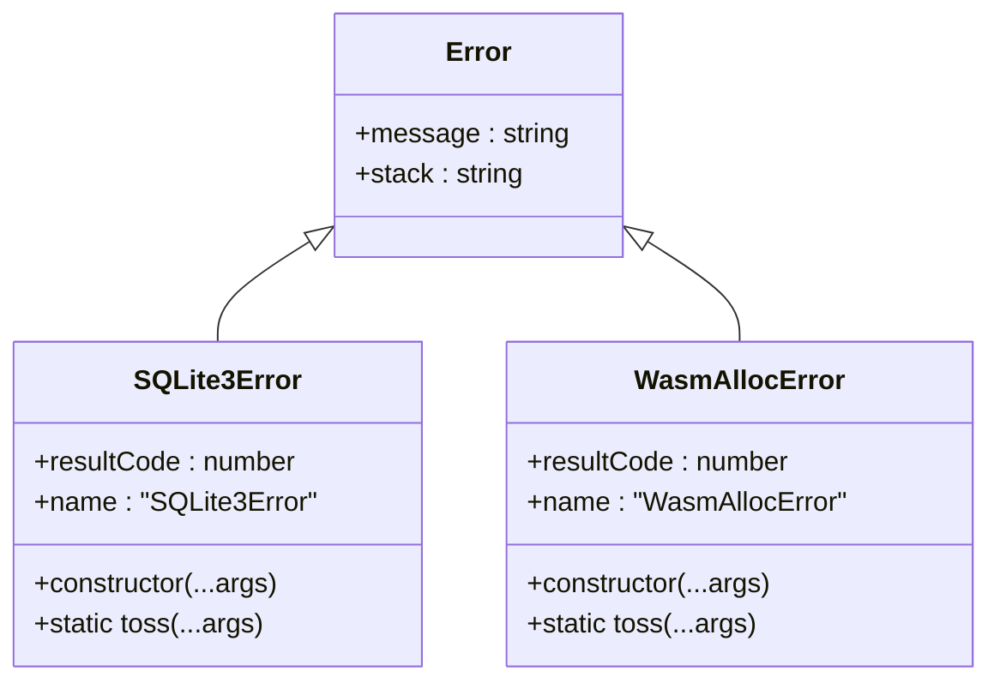
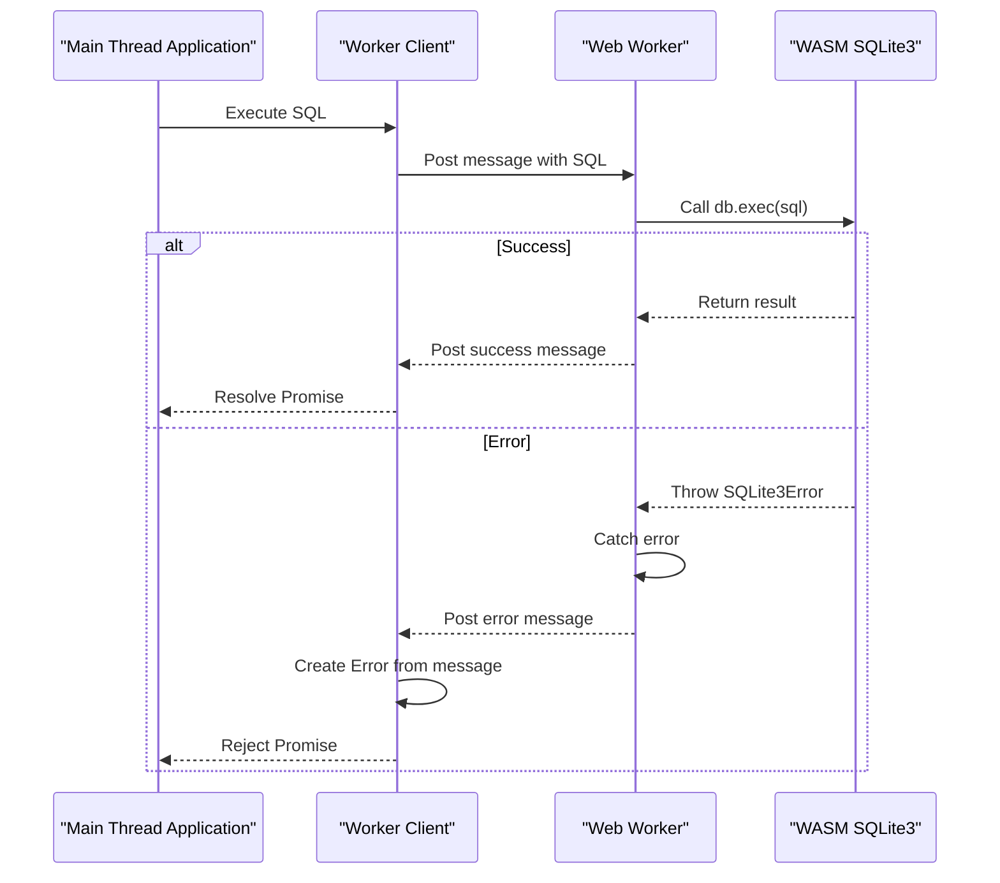
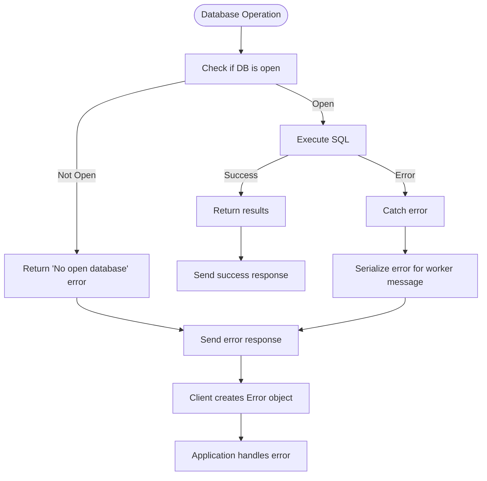

# Error Handling

<cite>
**Referenced Files in This Document**   
- [error-utils.mjs](file://src/jswasm/wasm/bootstrap/error-utils.mjs)
- [sqliteWorker.ts](file://src/sqliteWorker.ts)
- [worker-client.ts](file://tests/e2e/worker-client.ts)
- [test-worker.ts](file://tests/e2e/test-worker.ts)
- [validation.mjs](file://src/jswasm/api/oo1-db/db-statement/validation.mjs)
- [error-handling.e2e.test.ts](file://tests/e2e/error-handling.e2e.test.ts)
- [constraints.e2e.test.ts](file://tests/e2e/constraints.e2e.test.ts)
- [transactions.e2e.test.ts](file://tests/e2e/transactions.e2e.test.ts)
- [errno-constants.mjs](file://src/jswasm/system/errno-constants.mjs)
- [constants.ts](file://src/jswasm/vfs/filesystem/constants/constants.ts)
- [stream-operations.ts](file://src/jswasm/vfs/filesystem/stream-operations/stream-operations.ts)
- [operation-runner.mjs](file://src/jswasm/vfs/opfs/installer/core/operation-runner.mjs)
- [configuration.mjs](file://src/jswasm/wasm/bootstrap/configuration.mjs)
</cite>

## Table of Contents

1. [Introduction](#introduction)
2. [Error Type Hierarchy](#error-type-hierarchy)
3. [SQLite3 Result Code Integration](#sqlite3-result-code-integration)
4. [Error Propagation Mechanism](#error-propagation-mechanism)
5. [Error Handling Implementation](#error-handling-implementation)
6. [Synchronous vs Asynchronous Error Patterns](#synchronous-vs-asynchronous-error-patterns)
7. [Transaction Error Handling](#transaction-error-handling)
8. [Database Connection Failure Handling](#database-connection-failure-handling)
9. [E2E Test Examples](#e2e-test-examples)
10. [Debugging and Logging](#debugging-and-logging)
11. [Common Error Messages](#common-error-messages)
12. [Resilient Application Design](#resilient-application-design)

## Introduction

The web-sqlite-v2 library implements a comprehensive error handling system that bridges the gap between SQLite3's C API result codes and JavaScript's exception model. This documentation details the error hierarchy, propagation mechanisms, and best practices for building resilient applications using this library. The system is designed to provide meaningful error information while maintaining the performance characteristics required for WebAssembly-based database operations.

**Section sources**

- [error-utils.mjs](file://src/jswasm/wasm/bootstrap/error-utils.mjs)
- [sqliteWorker.ts](file://src/sqliteWorker.ts)

## Error Type Hierarchy

The error handling system in web-sqlite-v2 is built around a hierarchy of custom error types that extend JavaScript's native Error class. The primary error types are:

- **SQLite3Error**: The canonical error type used throughout the library, capturing SQLite3 result codes and providing consistent error messaging
- **WasmAllocError**: A specialized error type thrown when WebAssembly memory allocations fail

The SQLite3Error class is created through a factory function that takes the C API interface and a result code stringifier function as parameters. This design allows for consistent error creation across the library while maintaining a lightweight implementation suitable for tight loops.

**Diagram sources**

- [error-utils.mjs](file://src/jswasm/wasm/bootstrap/error-utils.mjs)

**Section sources**

- [error-utils.mjs](file://src/jswasm/wasm/bootstrap/error-utils.mjs)

## SQLite3 Result Code Integration

The error handling system integrates closely with SQLite3's result code system through the createResultCodeStringifier function. This function creates a resolver that maps numeric result codes to human-readable strings by first attempting to use the C API's sqlite3_js_rc_str function, and falling back to a generic message if that function is not available.

The SQLite3Error constructor is designed to handle various argument patterns:

- When constructed with a single integer argument, it treats this as a result code and uses the stringifier to generate the error message
- When constructed with a result code and additional arguments, it formats the message to include both the result code description and any additional context
- When constructed without a result code, it defaults to SQLITE_ERROR

This flexible constructor design allows for consistent error creation patterns throughout the codebase while accommodating different error scenarios.

**Section sources**

- [error-utils.mjs](file://src/jswasm/wasm/bootstrap/error-utils.mjs)

## Error Propagation Mechanism

Errors propagate through the system from the WebAssembly layer through the Web Worker to the main thread API. The propagation mechanism follows a well-defined path:

1. **WASM Layer**: SQLite3 C API calls return result codes, which are converted to JavaScript Error objects using the error utilities
2. **Web Worker**: The sqliteWorker.ts file handles these errors by catching exceptions and sending structured error responses back to the main thread
3. **Main Thread**: The worker client receives these error responses and converts them back into JavaScript Error objects for application use

The worker client uses a Promise-based interface that rejects with an Error object when the worker reports a failure. This maintains the familiar JavaScript exception handling pattern while abstracting the complexity of the worker communication.

**Diagram sources**

- [sqliteWorker.ts](file://src/sqliteWorker.ts)
- [worker-client.ts](file://tests/e2e/worker-client.ts)

**Section sources**

- [sqliteWorker.ts](file://src/sqliteWorker.ts)
- [worker-client.ts](file://tests/e2e/worker-client.ts)
- [test-worker.ts](file://tests/e2e/test-worker.ts)

## Error Handling Implementation

The error handling implementation is centered in the error-utils.mjs file, which provides factory functions for creating the custom error types. The implementation includes several key features:

- **Result Code Stringification**: The createResultCodeStringifier function provides a consistent way to convert numeric result codes to human-readable strings
- **Error Creation**: The createSQLite3Error and createWasmAllocError functions create the custom error constructors used throughout the library
- **Stack Trace Preservation**: Errors maintain their stack traces through the worker boundary by including the stack property in the error response
- **Contextual Enrichment**: The error constructor supports additional context through its flexible argument handling

The validation utilities in validation.mjs use the toss function (imported from the context) to throw errors when preconditions are not met, such as when attempting to use a closed database or statement handle.

**Section sources**

- [error-utils.mjs](file://src/jswasm/wasm/bootstrap/error-utils.mjs)
- [validation.mjs](file://src/jswasm/api/oo1-db/db-statement/validation.mjs)

## Synchronous vs Asynchronous Error Patterns

The library handles both synchronous and asynchronous errors through a consistent pattern. Synchronous errors, such as validation failures or immediate SQLite3 API call failures, are thrown directly and caught by the Web Worker's message handlers.

Asynchronous errors, which may occur during OPFS (Origin Private File System) operations, are handled through the SharedArrayBuffer-based communication between the main worker and the OPFS async proxy. The operation-runner.mjs file includes logic to detect and handle async exceptions by deserializing error information from the shared memory buffer.

The configuration system in configuration.mjs also handles potential errors during configuration resolution, particularly when dealing with lazy-evaluated configuration entries that might reference WASM exports before the bootstrapper is ready.

**Section sources**

- [error-utils.mjs](file://src/jswasm/wasm/bootstrap/error-utils.mjs)
- [sqliteWorker.ts](file://src/sqliteWorker.ts)
- [operation-runner.mjs](file://src/jswasm/vfs/opfs/installer/core/operation-runner.mjs)
- [configuration.mjs](file://src/jswasm/wasm/bootstrap/configuration.mjs)

## Transaction Error Handling

Transaction error handling follows SQLite3's standard behavior, where errors during a transaction can trigger automatic rollback. The e2e tests demonstrate this behavior, particularly in the transactions.e2e.test.ts file.

When an error occurs within a transaction block, SQLite3 will automatically roll back the transaction unless specific error handling is implemented. The library exposes this behavior through the standard SQL commands (BEGIN, COMMIT, ROLLBACK) and SAVEPOINTs for nested transactions.

The error handling system ensures that transaction-related errors are properly propagated, allowing applications to implement appropriate recovery strategies. For example, constraint violations during a transaction will cause the entire transaction to be rolled back, and this error condition is communicated back to the application through the standard error propagation mechanism.

**Section sources**

- [transactions.e2e.test.ts](file://tests/e2e/transactions.e2e.test.ts)
- [sqliteWorker.ts](file://src/sqliteWorker.ts)

## Database Connection Failure Handling

Database connection failures are handled at multiple levels in the system. The sqliteWorker.ts file includes specific error handling for cases where no database is open when a SQL operation is attempted, returning a descriptive error message.

The worker client in worker-client.ts handles connection failures by rejecting the Promise with an appropriate error. The test-worker.ts implementation demonstrates how to handle initialization failures, such as when the SQLite3 module fails to load or when the OPFS VFS cannot be installed.

The library also handles file system level errors through the errno constants defined in errno-constants.mjs and the filesystem constants. For example, when a file descriptor limit is reached, the stream operations will throw an EMFILE error, which is then propagated through the system.

**Diagram sources**

- [sqliteWorker.ts](file://src/sqliteWorker.ts)
- [worker-client.ts](file://tests/e2e/worker-client.ts)

**Section sources**

- [sqliteWorker.ts](file://src/sqliteWorker.ts)
- [worker-client.ts](file://tests/e2e/worker-client.ts)
- [stream-operations.ts](file://src/jswasm/vfs/filesystem/stream-operations/stream-operations.ts)

## E2E Test Examples

The e2e test suite provides several examples of error handling and recovery strategies:

- **error-handling.e2e.test.ts**: Tests for various SQL error conditions including invalid syntax, non-existent tables, and missing columns
- **constraints.e2e.test.ts**: Tests for constraint violations including PRIMARY KEY, UNIQUE, NOT NULL, CHECK, and FOREIGN KEY constraints
- **transactions.e2e.test.ts**: Tests for transaction behavior including successful commits, explicit rollbacks, and nested savepoints

These tests demonstrate defensive programming techniques such as:

- Validating SQL syntax before execution
- Checking for table existence before querying
- Handling constraint violations gracefully
- Implementing proper transaction management

The tests use a pattern of expecting specific error messages to contain certain substrings (e.g., "syntax error", "no such table"), which provides a reliable way to verify error conditions without depending on exact error message formatting.

**Section sources**

- [error-handling.e2e.test.ts](file://tests/e2e/error-handling.e2e.test.ts)
- [constraints.e2e.test.ts](file://tests/e2e/constraints.e2e.test.ts)
- [transactions.e2e.test.ts](file://tests/e2e/transactions.e2e.test.ts)

## Debugging and Logging

The error handling system includes several features to support debugging and logging:

- **Error Stack Traces**: When errors occur in the Web Worker, the stack trace is included in the error response, allowing developers to trace the error origin
- **Configuration Logging**: The bootstrap configuration includes debug, warn, error, and log functions that default to the console methods, providing visibility into the initialization process
- **Operation Metrics**: The OPFS installer includes timing utilities that can help identify performance issues that might lead to timeouts or other errors

The library uses a consistent error message format that includes both the SQLite3 result code and a descriptive message, making it easier to diagnose issues. For example, a syntax error will include both the result code (SQLITE_ERROR) and a message indicating the specific syntax problem.

**Section sources**

- [error-utils.mjs](file://src/jswasm/wasm/bootstrap/error-utils.mjs)
- [configuration.mjs](file://src/jswasm/wasm/bootstrap/configuration.mjs)
- [operation-runner.mjs](file://src/jswasm/vfs/opfs/installer/core/operation-runner.mjs)

## Common Error Messages

The library generates several common error messages that developers should be familiar with:

- **"syntax error"**: Indicates invalid SQL syntax
- **"no such table"**: Indicates an attempt to access a non-existent table
- **"no such column"**: Indicates an attempt to access a non-existent column
- **"UNIQUE constraint failed"**: Indicates a violation of a UNIQUE constraint
- **"NOT NULL constraint failed"**: Indicates an attempt to insert NULL into a NOT NULL column
- **"CHECK constraint failed"**: Indicates a violation of a CHECK constraint
- **"FOREIGN KEY constraint failed"**: Indicates a violation of a FOREIGN KEY constraint
- **"No open database. Call Open first."**: Indicates an attempt to execute SQL without an open database connection
- **"Invalid payload for Sql: expected SQL string"**: Indicates invalid input to the SQL execution function

These error messages follow a consistent pattern and are designed to be both human-readable and machine-parsable, allowing applications to implement specific error handling strategies based on the error content.

**Section sources**

- [error-handling.e2e.test.ts](file://tests/e2e/error-handling.e2e.test.ts)
- [constraints.e2e.test.ts](file://tests/e2e/constraints.e2e.test.ts)
- [sqliteWorker.ts](file://src/sqliteWorker.ts)

## Resilient Application Design

To build resilient applications with web-sqlite-v2, consider the following best practices:

1. **Implement Proper Error Handling**: Always wrap database operations in try-catch blocks or handle Promise rejections
2. **Use Transactions Appropriately**: Group related operations in transactions to ensure data consistency
3. **Validate Inputs**: Validate SQL statements and data before executing them
4. **Handle Connection Lifecycle**: Properly manage database connections, ensuring they are opened and closed appropriately
5. **Implement Retry Logic**: For transient errors, implement retry logic with appropriate backoff
6. **Monitor Resource Usage**: Be aware of file descriptor limits and other resource constraints
7. **Log Errors Appropriately**: Log errors for debugging while avoiding sensitive information disclosure

The library's error handling system is designed to support these practices by providing clear, consistent error information that applications can use to implement appropriate recovery strategies.

**Section sources**

- [error-handling.e2e.test.ts](file://tests/e2e/error-handling.e2e.test.ts)
- [constraints.e2e.test.ts](file://tests/e2e/constraints.e2e.test.ts)
- [transactions.e2e.test.ts](file://tests/e2e/transactions.e2e.test.ts)
- [sqliteWorker.ts](file://src/sqliteWorker.ts)
