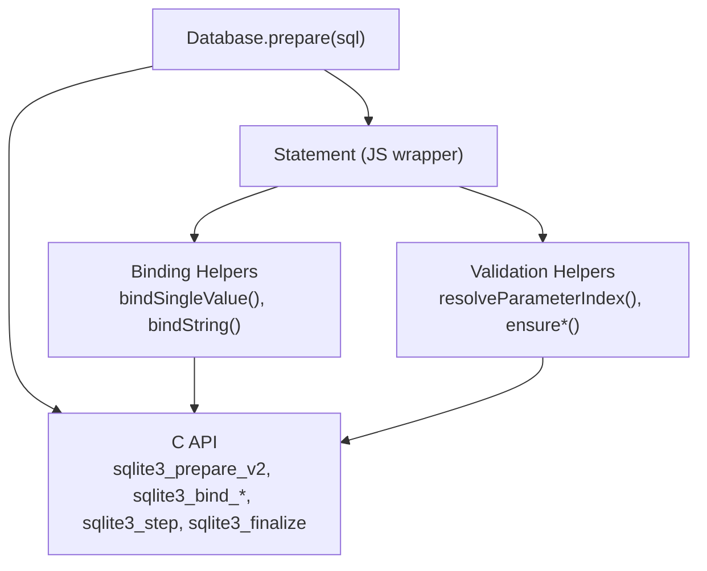
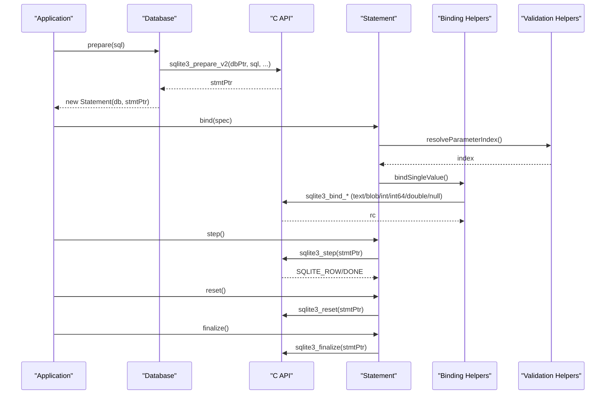
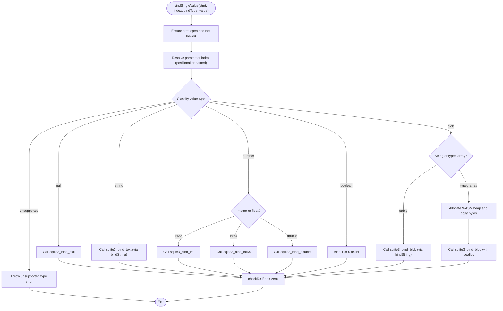
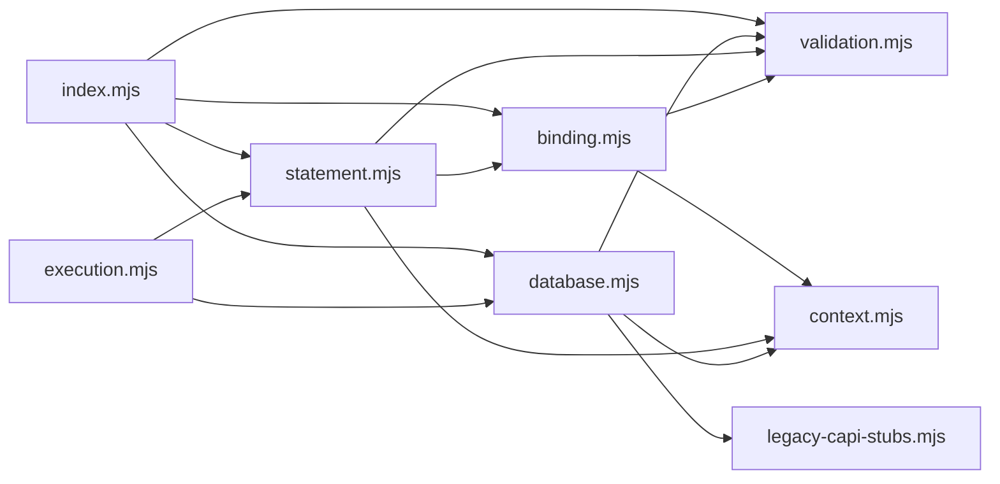

# Prepared Statements

<cite>
**Referenced Files in This Document**
- [binding.mjs](file://src/jswasm/api/oo1-db/db-statement/binding.mjs)
- [statement.mjs](file://src/jswasm/api/oo1-db/db-statement/statement.mjs)
- [database.mjs](file://src/jswasm/api/oo1-db/db-statement/database.mjs)
- [validation.mjs](file://src/jswasm/api/oo1-db/db-statement/validation.mjs)
- [execution.mjs](file://src/jswasm/api/oo1-db/db-statement/execution.mjs)
- [index.mjs](file://src/jswasm/api/oo1-db/db-statement/index.mjs)
- [context.mjs](file://src/jswasm/api/oo1-db/context.mjs)
- [legacy-capi-stubs.mjs](file://src/jswasm/wasm/bootstrap/runtime/legacy-capi-stubs.mjs)
- [prepared-statements.e2e.test.ts](file://tests/e2e/prepared-statements.e2e.test.ts)
</cite>

## Table of Contents

1. [Introduction](#introduction)
2. [Project Structure](#project-structure)
3. [Core Components](#core-components)
4. [Architecture Overview](#architecture-overview)
5. [Detailed Component Analysis](#detailed-component-analysis)
6. [Dependency Analysis](#dependency-analysis)
7. [Performance Considerations](#performance-considerations)
8. [Troubleshooting Guide](#troubleshooting-guide)
9. [Conclusion](#conclusion)
10. [Appendices](#appendices)

## Introduction

This document explains the prepared statements functionality in web-sqlite-v2, focusing on the lifecycle from compilation to finalization, parameter binding (positional and named), execution, and memory management in the WASM environment. It maps the JavaScript API to the underlying sqlite3_prepare_v2 and related C API calls, and provides practical guidance for efficient reuse, type handling, and avoiding common pitfalls such as unfinalized statements and improper reuse patterns.

## Project Structure

The prepared statement pipeline spans several modules under the OO1 API:

- Database.prepare compiles SQL into a native sqlite3_stmt via sqlite3_prepare_v2.
- Statement encapsulates the native statement and exposes bind, step, reset, clearBindings, and finalize.
- Binding helpers convert JavaScript values to SQLite types and call sqlite3*bind*\*.
- Validation helpers enforce safe usage (open handles, parameter indices/names, locking).
- Execution helpers demonstrate typical usage patterns (selectFirstRow, selectAllRows).
- The context provides shared utilities and error handling.

**Diagram sources**

- [database.mjs](file://src/jswasm/api/oo1-db/db-statement/database.mjs#L178-L214)
- [statement.mjs](file://src/jswasm/api/oo1-db/db-statement/statement.mjs#L98-L178)
- [binding.mjs](file://src/jswasm/api/oo1-db/db-statement/binding.mjs#L76-L206)
- [validation.mjs](file://src/jswasm/api/oo1-db/db-statement/validation.mjs#L72-L101)
- [legacy-capi-stubs.mjs](file://src/jswasm/wasm/bootstrap/runtime/legacy-capi-stubs.mjs#L58-L64)

**Section sources**

- [index.mjs](file://src/jswasm/api/oo1-db/db-statement/index.mjs#L1-L47)
- [context.mjs](file://src/jswasm/api/oo1-db/context.mjs#L1-L48)

## Core Components

- Database.prepare(sql): Compiles SQL to a native statement using sqlite3_prepare_v2 and returns a Statement instance.
- Statement: Wraps a native sqlite3_stmt and manages lifecycle and operations.
- Binding Helpers: Determine types, allocate memory, and call sqlite3*bind*\*.
- Validation Helpers: Enforce open handles, parameter indexing, and execution locks.
- Execution Helpers: Demonstrate typical usage patterns for selects and exec plans.

**Section sources**

- [database.mjs](file://src/jswasm/api/oo1-db/db-statement/database.mjs#L178-L214)
- [statement.mjs](file://src/jswasm/api/oo1-db/db-statement/statement.mjs#L98-L178)
- [binding.mjs](file://src/jswasm/api/oo1-db/db-statement/binding.mjs#L76-L206)
- [validation.mjs](file://src/jswasm/api/oo1-db/db-statement/validation.mjs#L72-L101)
- [execution.mjs](file://src/jswasm/api/oo1-db/db-statement/execution.mjs#L1-L41)

## Architecture Overview

The prepared statement lifecycle is orchestrated by the Database and Statement classes, with helpers mediating between JavaScript semantics and the C API.

**Diagram sources**

- [database.mjs](file://src/jswasm/api/oo1-db/db-statement/database.mjs#L178-L214)
- [statement.mjs](file://src/jswasm/api/oo1-db/db-statement/statement.mjs#L98-L178)
- [statement.mjs](file://src/jswasm/api/oo1-db/db-statement/statement.mjs#L209-L231)
- [statement.mjs](file://src/jswasm/api/oo1-db/db-statement/statement.mjs#L83-L96)
- [statement.mjs](file://src/jswasm/api/oo1-db/db-statement/statement.mjs#L52-L69)
- [binding.mjs](file://src/jswasm/api/oo1-db/db-statement/binding.mjs#L76-L206)
- [validation.mjs](file://src/jswasm/api/oo1-db/db-statement/validation.mjs#L72-L101)
- [legacy-capi-stubs.mjs](file://src/jswasm/wasm/bootstrap/runtime/legacy-capi-stubs.mjs#L58-L64)

## Detailed Component Analysis

### Database.prepare Lifecycle

- Compilation: Database.prepare calls sqlite3_prepare_v2 to compile SQL into a native sqlite3_stmt. The resulting pointer is stored in a WeakMap and associated with the Statement instance.
- Ownership: The Statement holds a reference to the owning Database and stores the native pointer for subsequent operations.
- Safety: The context’s checkRc throws on failure, and ensureDbOpen prevents operating on closed databases.

Key implementation references:

- [prepare(sql)](file://src/jswasm/api/oo1-db/db-statement/database.mjs#L178-L214)
- [context.checkRc](file://src/jswasm/api/oo1-db/context.mjs#L23-L34)

**Section sources**

- [database.mjs](file://src/jswasm/api/oo1-db/db-statement/database.mjs#L178-L214)
- [context.mjs](file://src/jswasm/api/oo1-db/context.mjs#L23-L34)

### Statement Class and Operations

- Construction: Statement instances are created internally by Database.prepare and guarded against external instantiation.
- Finalize: Releases native resources and clears internal state.
- ClearBindings and Reset: Reset optionally clears bindings; both reset the internal state to allow re-execution.
- Bind: Supports positional and named parameters, arrays, and objects. It validates parameter counts and indices.
- Step: Drives execution and updates internal state to allow get() calls.
- Getters: getInt, getFloat, getString, getBlob, getJSON coerce column values according to type and environment capabilities.

Key implementation references:

- [constructor guard](file://src/jswasm/api/oo1-db/db-statement/statement.mjs#L38-L46)
- [finalize()](file://src/jswasm/api/oo1-db/db-statement/statement.mjs#L52-L69)
- [clearBindings()](file://src/jswasm/api/oo1-db/db-statement/statement.mjs#L71-L81)
- [reset(alsoClearBinds)](file://src/jswasm/api/oo1-db/db-statement/statement.mjs#L83-L96)
- [bind(...args)](file://src/jswasm/api/oo1-db/db-statement/statement.mjs#L98-L178)
- [bindAsBlob(index, value)](file://src/jswasm/api/oo1-db/db-statement/statement.mjs#L180-L202)
- [step()](file://src/jswasm/api/oo1-db/db-statement/statement.mjs#L209-L231)
- [get(ndx, asType)](file://src/jswasm/api/oo1-db/db-statement/statement.mjs#L262-L359)

**Section sources**

- [statement.mjs](file://src/jswasm/api/oo1-db/db-statement/statement.mjs#L38-L69)
- [statement.mjs](file://src/jswasm/api/oo1-db/db-statement/statement.mjs#L71-L96)
- [statement.mjs](file://src/jswasm/api/oo1-db/db-statement/statement.mjs#L98-L178)
- [statement.mjs](file://src/jswasm/api/oo1-db/db-statement/statement.mjs#L180-L202)
- [statement.mjs](file://src/jswasm/api/oo1-db/db-statement/statement.mjs#L209-L231)
- [statement.mjs](file://src/jswasm/api/oo1-db/db-statement/statement.mjs#L262-L359)

### Parameter Binding and Type Handling

- Supported types: null, boolean, number, string, blob. BigInt is supported when enabled in the WASM environment.
- Determination: determineBindType classifies values; ensureSupportedBindType enforces supported types.
- Positional vs Named: resolveParameterIndex resolves names to 1-based indices; bind supports both forms.
- String and Blob: bindString allocates a C string and binds text or blob; bindSingleValue handles numeric types and conversion rules.
- Typed Arrays: ArrayBuffer and typed arrays are treated as blobs; strings are handled specially for blob binding.

Key implementation references:

- [BindTypes and classification](file://src/jswasm/api/oo1-db/db-statement/binding.mjs#L21-L33)
- [determineBindType](file://src/jswasm/api/oo1-db/db-statement/binding.mjs#L40-L60)
- [ensureSupportedBindType](file://src/jswasm/api/oo1-db/db-statement/binding.mjs#L68-L74)
- [bindString](file://src/jswasm/api/oo1-db/db-statement/binding.mjs#L85-L95)
- [bindSingleValue core](file://src/jswasm/api/oo1-db/db-statement/binding.mjs#L106-L197)
- [resolveParameterIndex](file://src/jswasm/api/oo1-db/db-statement/validation.mjs#L72-L101)

**Diagram sources**

- [binding.mjs](file://src/jswasm/api/oo1-db/db-statement/binding.mjs#L85-L197)
- [validation.mjs](file://src/jswasm/api/oo1-db/db-statement/validation.mjs#L72-L101)
- [context.mjs](file://src/jswasm/api/oo1-db/context.mjs#L23-L34)

**Section sources**

- [binding.mjs](file://src/jswasm/api/oo1-db/db-statement/binding.mjs#L21-L33)
- [binding.mjs](file://src/jswasm/api/oo1-db/db-statement/binding.mjs#L40-L60)
- [binding.mjs](file://src/jswasm/api/oo1-db/db-statement/binding.mjs#L68-L74)
- [binding.mjs](file://src/jswasm/api/oo1-db/db-statement/binding.mjs#L85-L95)
- [binding.mjs](file://src/jswasm/api/oo1-db/db-statement/binding.mjs#L106-L197)
- [validation.mjs](file://src/jswasm/api/oo1-db/db-statement/validation.mjs#L72-L101)

### Relationship Between Statement and sqlite3_prepare_v2

- Statement instances are constructed from the native sqlite3_stmt pointer returned by sqlite3_prepare_v2.
- The Statement class wraps this pointer and provides higher-level methods for binding, stepping, and finalizing.
- The relationship is established in Database.prepare and used throughout Statement methods.

Key implementation references:

- [prepare(sql) -> sqlite3_prepare_v2](file://src/jswasm/api/oo1-db/db-statement/database.mjs#L178-L214)
- [Statement constructor stores pointer](file://src/jswasm/api/oo1-db/db-statement/statement.mjs#L38-L50)
- [C API stubs for sqlite3_prepare_v2](file://src/jswasm/wasm/bootstrap/runtime/legacy-capi-stubs.mjs#L58-L64)

**Section sources**

- [database.mjs](file://src/jswasm/api/oo1-db/db-statement/database.mjs#L178-L214)
- [statement.mjs](file://src/jswasm/api/oo1-db/db-statement/statement.mjs#L38-L50)
- [legacy-capi-stubs.mjs](file://src/jswasm/wasm/bootstrap/runtime/legacy-capi-stubs.mjs#L58-L64)

### Execution Patterns and Usage

- Typical usage: prepare -> bind -> step -> get -> reset/finalize.
- Helpers demonstrate selectFirstRow and selectAllRows patterns, often using Statement.step and Statement.get.

Key implementation references:

- [selectFirstRow](file://src/jswasm/api/oo1-db/db-statement/execution.mjs#L1-L41)
- [selectAllRows](file://src/jswasm/api/oo1-db/db-statement/execution.mjs#L43-L61)

**Section sources**

- [execution.mjs](file://src/jswasm/api/oo1-db/db-statement/execution.mjs#L1-L41)
- [execution.mjs](file://src/jswasm/api/oo1-db/db-statement/execution.mjs#L43-L61)

### Memory Management in WASM

- String binding: bindString allocates a C string and passes SQLITE_WASM_DEALLOC so SQLite frees it automatically.
- Blob binding: bindSingleValue allocates WASM heap memory and copies bytes; SQLite is told to deallocate via SQLITE_WASM_DEALLOC.
- Finalize releases the native sqlite3_stmt and clears internal JS state; Database.close finalizes any outstanding statements.
- BigInt handling: When bigIntEnabled is true, integers may be bound as int64; otherwise, they may be coerced to double or integer depending on range.

Key implementation references:

- [bindString allocation/dealloc](file://src/jswasm/api/oo1-db/db-statement/binding.mjs#L85-L95)
- [blob allocation and dealloc](file://src/jswasm/api/oo1-db/db-statement/binding.mjs#L176-L184)
- [finalize() clearing](file://src/jswasm/api/oo1-db/db-statement/statement.mjs#L52-L69)
- [Database.close finalization loop](file://src/jswasm/api/oo1-db/db-statement/database.mjs#L64-L103)

**Section sources**

- [binding.mjs](file://src/jswasm/api/oo1-db/db-statement/binding.mjs#L85-L95)
- [binding.mjs](file://src/jswasm/api/oo1-db/db-statement/binding.mjs#L176-L184)
- [statement.mjs](file://src/jswasm/api/oo1-db/db-statement/statement.mjs#L52-L69)
- [database.mjs](file://src/jswasm/api/oo1-db/db-statement/database.mjs#L64-L103)

## Dependency Analysis

The prepared statement subsystem composes cleanly:

- index.mjs wires together validation, binding, execution, and statement creation.
- context.mjs centralizes shared utilities and error handling.
- database.mjs depends on validation and C API to prepare statements.
- statement.mjs depends on validation and binding helpers.
- binding.mjs depends on validation and WASM utilities.

**Diagram sources**

- [index.mjs](file://src/jswasm/api/oo1-db/db-statement/index.mjs#L1-L47)
- [context.mjs](file://src/jswasm/api/oo1-db/context.mjs#L1-L48)
- [validation.mjs](file://src/jswasm/api/oo1-db/db-statement/validation.mjs#L1-L103)
- [binding.mjs](file://src/jswasm/api/oo1-db/db-statement/binding.mjs#L1-L206)
- [statement.mjs](file://src/jswasm/api/oo1-db/db-statement/statement.mjs#L1-L501)
- [database.mjs](file://src/jswasm/api/oo1-db/db-statement/database.mjs#L1-L688)
- [execution.mjs](file://src/jswasm/api/oo1-db/db-statement/execution.mjs#L1-L223)
- [legacy-capi-stubs.mjs](file://src/jswasm/wasm/bootstrap/runtime/legacy-capi-stubs.mjs#L58-L64)

**Section sources**

- [index.mjs](file://src/jswasm/api/oo1-db/db-statement/index.mjs#L1-L47)
- [context.mjs](file://src/jswasm/api/oo1-db/context.mjs#L1-L48)

## Performance Considerations

- Reuse prepared statements: After binding and resetting, reuse the same Statement instance for repeated executions with different parameter values. This avoids recompiling SQL and improves performance.
- Prefer reset over finalize for short-lived loops; finalize only when the statement is no longer needed.
- Minimize allocations: Reuse buffers for blobs when possible; avoid unnecessary conversions between strings and typed arrays.
- Avoid excessive parameter churn: Batch operations where feasible to reduce overhead.
- Use appropriate getters: getInt/getFloat/getString/getBlob to avoid extra conversions.

[No sources needed since this section provides general guidance]

## Troubleshooting Guide

Common pitfalls and remedies:

- Unfinalized statements cause memory leaks: Always call finalize when done with a Statement. Database.close will finalize outstanding statements, but it is safer to finalize explicitly.
- Attempting operations on closed handles: Ensure the Database and Statement are open before calling methods.
- Invalid parameter names or indices: Use getParamIndex/getParamName to verify parameter metadata; resolveParameterIndex throws on invalid keys.
- Calling get() without a preceding successful step(): Statement enforces that step() returned true recently.
- Exec lock violations: Some operations are disallowed while a statement is locked by exec(); avoid mixing exec-driven iteration with manual step/bind.

Key implementation references:

- [finalize() and error handling](file://src/jswasm/api/oo1-db/db-statement/statement.mjs#L52-L69)
- [ensureDbOpen/ensureStmtOpen](file://src/jswasm/api/oo1-db/db-statement/validation.mjs#L28-L42)
- [resolveParameterIndex](file://src/jswasm/api/oo1-db/db-statement/validation.mjs#L72-L101)
- [step() state transitions](file://src/jswasm/api/oo1-db/db-statement/statement.mjs#L209-L231)
- [\_lockedByExec enforcement](file://src/jswasm/api/oo1-db/db-statement/statement.mjs#L233-L260)

**Section sources**

- [statement.mjs](file://src/jswasm/api/oo1-db/db-statement/statement.mjs#L52-L69)
- [validation.mjs](file://src/jswasm/api/oo1-db/db-statement/validation.mjs#L28-L42)
- [validation.mjs](file://src/jswasm/api/oo1-db/db-statement/validation.mjs#L72-L101)
- [statement.mjs](file://src/jswasm/api/oo1-db/db-statement/statement.mjs#L209-L231)
- [statement.mjs](file://src/jswasm/api/oo1-db/db-statement/statement.mjs#L233-L260)

## Conclusion

web-sqlite-v2’s prepared statements provide a robust, high-level abstraction over sqlite3_prepare_v2 and related APIs. The design emphasizes safety (validations), flexibility (positional and named parameters), and performance (reuse and minimal allocations). By following the lifecycle outlined here—compile, bind, step, reset/finalize—and adhering to the memory and reuse guidelines, applications can achieve efficient and reliable database operations in the WASM environment.

[No sources needed since this section summarizes without analyzing specific files]

## Appendices

### Parameter Binding Techniques and Examples

- Positional binding: Pass index and value to bind; supports arrays and objects for bulk binding.
- Named binding: Pass parameter name and value; resolveParameterIndex converts names to indices.
- Forced blob binding: bindAsBlob forces treating a string or blob as a blob regardless of inferred type.

Key implementation references:

- [bind(...args)](file://src/jswasm/api/oo1-db/db-statement/statement.mjs#L98-L178)
- [bindAsBlob(index, value)](file://src/jswasm/api/oo1-db/db-statement/statement.mjs#L180-L202)
- [resolveParameterIndex](file://src/jswasm/api/oo1-db/db-statement/validation.mjs#L72-L101)

**Section sources**

- [statement.mjs](file://src/jswasm/api/oo1-db/db-statement/statement.mjs#L98-L178)
- [statement.mjs](file://src/jswasm/api/oo1-db/db-statement/statement.mjs#L180-L202)
- [validation.mjs](file://src/jswasm/api/oo1-db/db-statement/validation.mjs#L72-L101)

### End-to-End Test References

- Prepared statements tests demonstrate parameterized execution patterns and result verification in worker contexts.

**Section sources**

- [prepared-statements.e2e.test.ts](file://tests/e2e/prepared-statements.e2e.test.ts#L1-L109)
