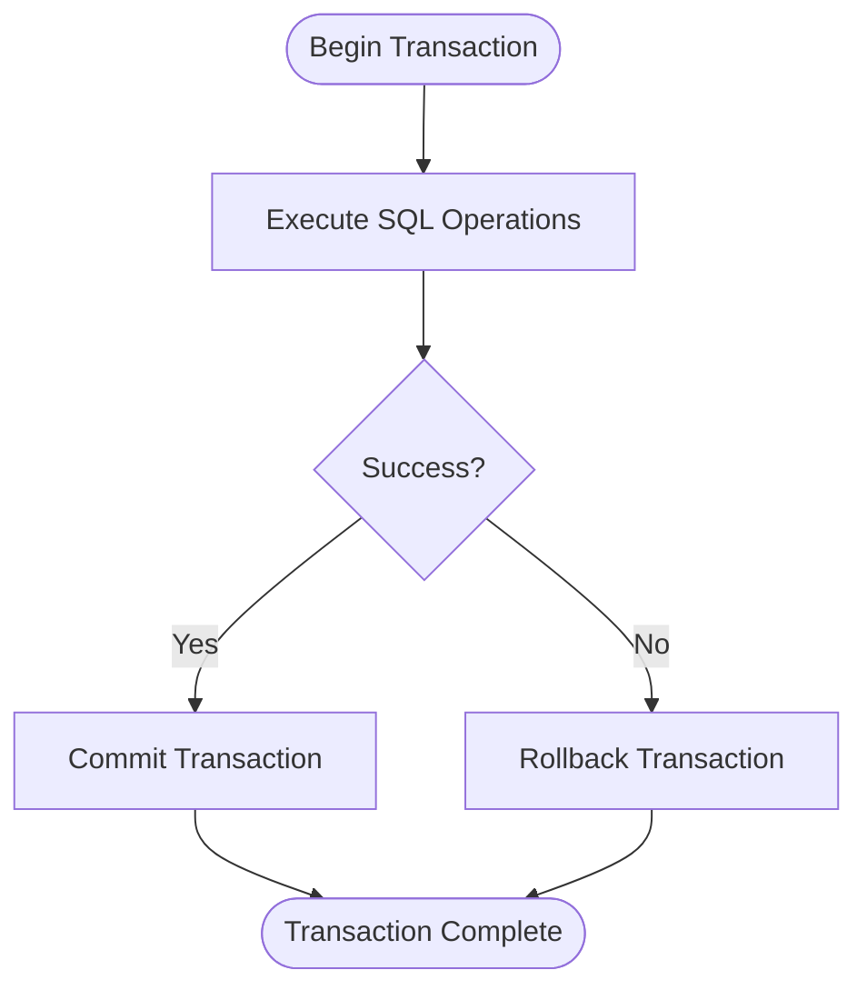
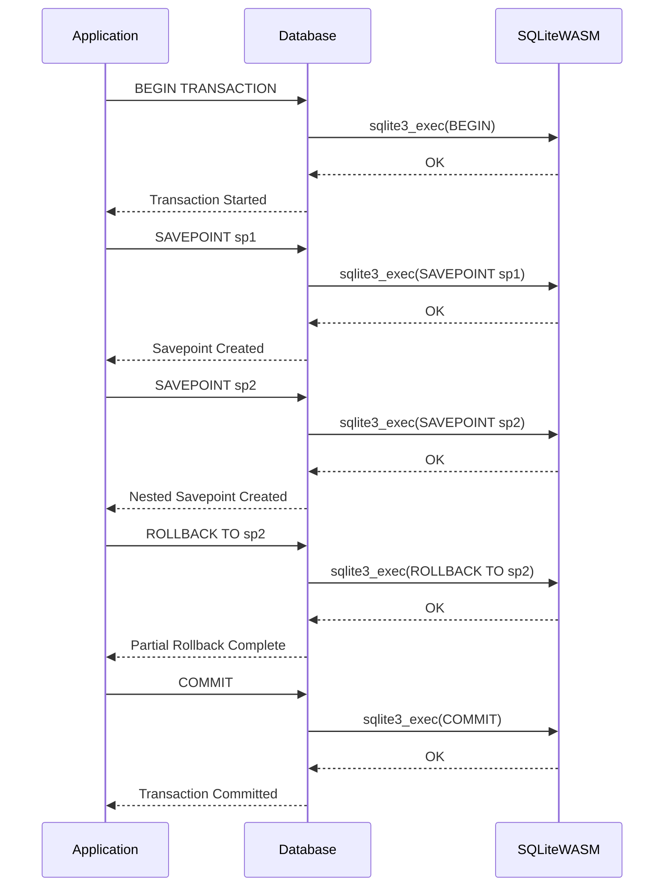
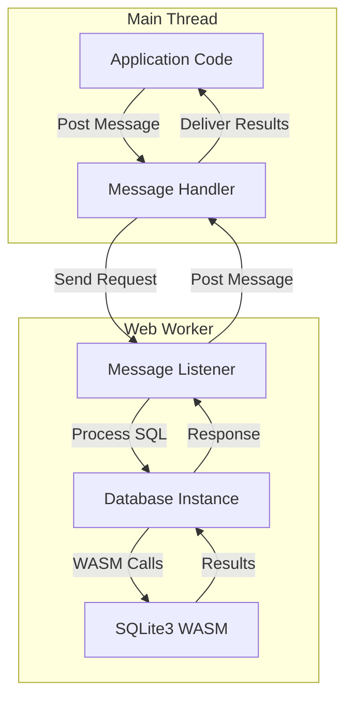
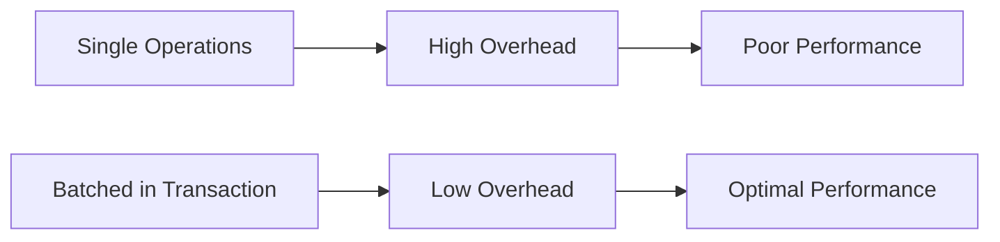

# Transactions

<cite>
**Referenced Files in This Document**   
- [transactions.e2e.test.ts](file://tests/e2e/transactions.e2e.test.ts)
- [sqliteWorker.ts](file://src/sqliteWorker.ts)
- [index.ts](file://src/index.ts)
- [worker-client.ts](file://tests/e2e/worker-client.ts)
- [test-worker.ts](file://tests/e2e/test-worker.ts)
- [database.mjs](file://src/jswasm/api/oo1-db/db-statement/database.mjs)
- [execution.mjs](file://src/jswasm/api/oo1-db/db-statement/execution.mjs)
- [index.mjs](file://src/jswasm/api/oo1-db/db-statement/index.mjs)
</cite>

## Table of Contents
1. [Introduction](#introduction)
2. [Transaction Lifecycle Implementation](#transaction-lifecycle-implementation)
3. [Nested Transactions and Savepoints](#nested-transactions-and-savepoints)
4. [Web Worker Architecture and Thread Management](#web-worker-architecture-and-thread-management)
5. [Explicit vs Implicit Transactions](#explicit-vs-implicit-transactions)
6. [Error Recovery and Rollback Mechanisms](#error-recovery-and-rollback-mechanisms)
7. [Concurrency and Isolation Behavior](#concurrency-and-isolation-behavior)
8. [Common Transaction Issues](#common-transaction-issues)
9. [Performance Considerations](#performance-considerations)
10. [Best Practices](#best-practices)

## Introduction
The web-sqlite-v2 library implements a robust transaction system that enables atomic database operations through the WebAssembly interface to SQLite3. This document details the implementation of transaction lifecycle management including begin, commit, and rollback operations, with a focus on how transactions are handled across the main thread and Web Worker boundary. The system supports both explicit transaction control through SQL commands and implicit transaction management, providing developers with flexible options for data integrity and performance optimization.

**Section sources**
- [transactions.e2e.test.ts](file://tests/e2e/transactions.e2e.test.ts#L1-L129)
- [sqliteWorker.ts](file://src/sqliteWorker.ts#L1-L243)

## Transaction Lifecycle Implementation
The transaction lifecycle in web-sqlite-v2 follows the standard SQLite transaction model with BEGIN, COMMIT, and ROLLBACK operations. When a transaction is initiated with BEGIN TRANSACTION, the database enters a transaction state where subsequent operations are grouped together. The transaction remains active until it is explicitly committed with COMMIT or rolled back with ROLLBACK.

The implementation leverages the SQLite3 C API through WebAssembly, where transaction state is managed by the underlying SQLite engine. The Database class in the oo1 API provides the exec() method that processes SQL statements, including transaction control commands. When multiple SQL statements are executed in a single exec() call with multi: true option, they are treated as a single batch, ensuring atomicity.

**Diagram sources**
- [sqliteWorker.ts](file://src/sqliteWorker.ts#L112-L166)
- [database.mjs](file://src/jswasm/api/oo1-db/db-statement/database.mjs)

**Section sources**
- [transactions.e2e.test.ts](file://tests/e2e/transactions.e2e.test.ts#L7-L38)
- [execution.mjs](file://src/jswasm/api/oo1-db/db-statement/execution.mjs)

## Nested Transactions and Savepoints
The system supports nested transactions through SQLite's SAVEPOINT mechanism, allowing for complex transaction hierarchies. Savepoints enable partial rollback within a transaction without affecting the entire transaction scope. This is particularly useful for implementing complex business logic where certain operations can fail and be rolled back independently while allowing the overall transaction to continue.

The e2e tests demonstrate nested savepoint functionality where multiple savepoints are created within a transaction. When ROLLBACK TO is executed with a specific savepoint name, all operations after that savepoint are undone, but operations before it remain intact. This provides fine-grained control over transaction boundaries and error recovery.

**Diagram sources**
- [transactions.e2e.test.ts](file://tests/e2e/transactions.e2e.test.ts#L102-L128)
- [database.mjs](file://src/jswasm/api/oo1-db/db-statement/database.mjs)

**Section sources**
- [transactions.e2e.test.ts](file://tests/e2e/transactions.e2e.test.ts#L102-L128)
- [index.mjs](file://src/jswasm/api/oo1-db/db-statement/index.mjs)

## Web Worker Architecture and Thread Management
The transaction system operates within a Web Worker architecture that separates database operations from the main thread. This design prevents UI blocking during potentially long-running database operations while maintaining transaction integrity. The main thread communicates with the Web Worker through message passing, sending SQL commands and receiving results.

Transaction state is maintained within the Web Worker context, specifically in the db variable that holds the current database connection. This ensures that transaction boundaries are preserved across multiple message exchanges. The worker architecture uses a message queue system where each SQL operation is processed sequentially, preventing race conditions and ensuring transaction isolation.

**Diagram sources**
- [sqliteWorker.ts](file://src/sqliteWorker.ts#L1-L243)
- [test-worker.ts](file://tests/e2e/test-worker.ts#L1-L74)

**Section sources**
- [sqliteWorker.ts](file://src/sqliteWorker.ts#L31-L34)
- [worker-client.ts](file://tests/e2e/worker-client.ts#L1-L34)

## Explicit vs Implicit Transactions
The system supports both explicit and implicit transaction modes. Explicit transactions are initiated with BEGIN TRANSACTION and must be terminated with either COMMIT or ROLLBACK. This gives developers full control over transaction boundaries and is recommended for operations involving multiple related SQL statements.

Implicit transactions are automatically managed by SQLite when no explicit transaction is active. Each individual SQL statement executes within its own transaction context, which is automatically committed upon successful completion. While simpler to use, implicit transactions can lead to performance issues when executing multiple operations due to the overhead of starting and committing individual transactions.

The choice between explicit and implicit transactions should be based on the specific use case. For batch operations or when multiple related changes need to be applied atomically, explicit transactions are preferred. For simple, isolated operations, implicit transactions provide a more straightforward programming model.

**Section sources**
- [transactions.e2e.test.ts](file://tests/e2e/transactions.e2e.test.ts#L7-L38)
- [execution.mjs](file://src/jswasm/api/oo1-db/db-statement/execution.mjs)

## Error Recovery and Rollback Mechanisms
Error recovery is a critical aspect of transaction management in web-sqlite-v2. When an error occurs during a transaction, the system must ensure that partial changes are properly rolled back to maintain data consistency. The current implementation handles errors through the standard SQLite error propagation mechanism, where any SQL error causes the transaction to be automatically rolled back if not explicitly handled.

The e2e tests demonstrate explicit rollback behavior, but automatic rollback on error presents challenges in the current architecture due to the stateless nature of the worker communication model. When an error occurs, the worker terminates the connection, making it difficult to verify the database state afterward. Future improvements could include enhanced error handling that allows for transaction recovery and inspection after failure.

Proper error recovery practices include wrapping transaction operations in try-catch blocks and implementing explicit rollback when exceptions occur. This ensures that resources are properly cleaned up and the application can respond appropriately to database errors.

**Section sources**
- [transactions.e2e.test.ts](file://tests/e2e/transactions.e2e.test.ts#L40-L100)
- [sqliteWorker.ts](file://src/sqliteWorker.ts#L156-L165)

## Concurrency and Isolation Behavior
The transaction system provides isolation between concurrent operations through SQLite's locking mechanisms. When a transaction is active, other operations attempting to modify the same data are blocked until the transaction completes. This ensures data consistency but can lead to performance bottlenecks if transactions are held for extended periods.

The OPFS (Origin Private File System) VFS implementation enables concurrent access to the database file from multiple workers, with SQLite managing the locking at the database level. However, long-running transactions can cause contention, particularly when multiple operations attempt to write to the same tables.

Isolation levels are controlled by SQLite's default behavior, which providesSerializable isolation for write transactions. This means that once a transaction begins, it sees a consistent snapshot of the database, and other transactions cannot modify data that has been read or written until the first transaction completes.

**Section sources**
- [database-lifecycle.e2e.test.ts](file://tests/e2e/database-lifecycle.e2e.test.ts#L69-L84)
- [test-worker.ts](file://tests/e2e/test-worker.ts#L19-L27)

## Common Transaction Issues
Several common issues can arise when working with transactions in web-sqlite-v2:

**Lock Contention**: Occurs when multiple operations attempt to access the same data simultaneously. This is particularly common in high-concurrency scenarios and can be mitigated by minimizing transaction scope and duration.

**Deadlocks**: Can occur when two or more transactions hold locks on resources that the others need. The system relies on SQLite's deadlock detection and resolution mechanisms, which will abort one of the transactions to break the cycle.

**Auto-commit Mode Interference**: Mixing explicit transactions with implicit auto-commit operations can lead to unexpected behavior. Developers should be consistent in their transaction management approach within a given operation.

**Worker Termination**: If the Web Worker is terminated while a transaction is active, the transaction state is lost. Proper error handling and timeout mechanisms should be implemented to prevent this scenario.

**Section sources**
- [transactions.e2e.test.ts](file://tests/e2e/transactions.e2e.test.ts)
- [sqliteWorker.ts](file://src/sqliteWorker.ts)

## Performance Considerations
Transaction performance is significantly impacted by several factors:

**Batching Operations**: Grouping multiple SQL statements within a single transaction reduces the overhead of starting and committing individual transactions. This can result in substantial performance improvements, especially for insert and update operations.

**Transaction Scope**: Minimizing the scope and duration of transactions helps reduce lock contention and improves overall system throughput. Long-running transactions should be avoided, particularly those that involve user interaction or network calls.

**Memory Usage**: Large transactions consume more memory as SQLite must maintain undo logs for rollback capability. For very large operations, consider breaking them into smaller transaction batches.

**WASM Overhead**: Each message passing between the main thread and Web Worker incurs overhead. Reducing the number of round trips by batching operations within transactions improves performance.

**Diagram sources**
- [transactions.e2e.test.ts](file://tests/e2e/transactions.e2e.test.ts#L7-L38)
- [sqliteWorker.ts](file://src/sqliteWorker.ts#L138-L142)

**Section sources**
- [transactions.e2e.test.ts](file://tests/e2e/transactions.e2e.test.ts)
- [execution.mjs](file://src/jswasm/api/oo1-db/db-statement/execution.mjs)

## Best Practices
To ensure optimal transaction management in web-sqlite-v2:

1. **Use Explicit Transactions for Related Operations**: Group related SQL statements within BEGIN and COMMIT to ensure atomicity and improve performance.

2. **Minimize Transaction Scope**: Keep transactions as short as possible to reduce lock contention and improve concurrency.

3. **Handle Errors Gracefully**: Always implement proper error handling with explicit rollback when exceptions occur during transactions.

4. **Avoid Long-Running Transactions**: Do not include user interaction or network calls within transaction boundaries.

5. **Use Savepoints for Complex Logic**: Implement nested savepoints to enable partial rollback within complex operations.

6. **Batch Operations**: Combine multiple insert, update, or delete operations within a single transaction to reduce overhead.

7. **Monitor Performance**: Be aware of the performance implications of transaction size and duration, particularly in high-concurrency scenarios.

8. **Test Error Recovery**: Verify that your application properly handles transaction failures and maintains data consistency.

**Section sources**
- [transactions.e2e.test.ts](file://tests/e2e/transactions.e2e.test.ts)
- [index.ts](file://src/index.ts#L43-L52)