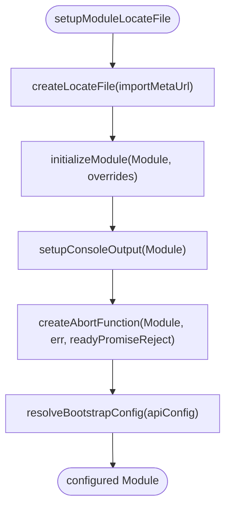

# Core Architecture

<cite>
**Referenced Files in This Document**
- [index.ts](file://src/index.ts)
- [sqliteWorker.ts](file://src/sqliteWorker.ts)
- [lifecycle-manager.mjs](file://src/jswasm/runtime/lifecycle-manager.mjs)
- [module-configurator.mjs](file://src/jswasm/runtime/module-configurator.mjs)
- [memory-manager.mjs](file://src/jswasm/runtime/memory-manager.mjs)
- [filesystem.mjs](file://src/jswasm/vfs/filesystem.mjs)
- [state-initialization.mjs](file://src/jswasm/vfs/opfs/installer/core/state-initialization.mjs)
- [sanity-check.mjs](file://src/jswasm/vfs/opfs/installer/utils/sanity-check.mjs)
- [io-sync-wrappers.mjs](file://src/jswasm/vfs/opfs/installer/wrappers/io-sync-wrappers.mjs)
- [vfs-integration.mjs](file://src/jswasm/vfs/opfs/installer/wrappers/vfs-integration.mjs)
- [configuration.mjs](file://src/jswasm/wasm/bootstrap/configuration.mjs)
- [install-oo1-db-api.mjs](file://src/jswasm/api/install-oo1-db-api.mjs)
- [context.mjs](file://src/jswasm/api/oo1-db/context.mjs)
- [js-storage-db.mjs](file://src/jswasm/api/oo1-db/js-storage-db.mjs)
- [worker-client.ts](file://tests/e2e/worker-client.ts)
- [package.json](file://package.json)
</cite>

## Table of Contents
1. [Introduction](#introduction)
2. [Project Structure](#project-structure)
3. [Core Components](#core-components)
4. [Architecture Overview](#architecture-overview)
5. [Detailed Component Analysis](#detailed-component-analysis)
6. [Dependency Analysis](#dependency-analysis)
7. [Performance Considerations](#performance-considerations)
8. [Troubleshooting Guide](#troubleshooting-guide)
9. [Conclusion](#conclusion)
10. [Appendices](#appendices)

## Introduction
This document describes the core architecture of the web-sqlite-v2 system. It explains how the main-thread API communicates with a Web Worker, which executes SQLite operations inside a WebAssembly (WASM) module backed by the OPFS (Origin Private File System) VFS. The design emphasizes separation of concerns across three layers:
- Main Thread API: Provides a convenient interface for clients to open databases, execute SQL, and manage lifecycle.
- Web Worker Execution Context: Handles message routing, database operations, and error propagation.
- WASM Module: Encapsulates SQLite runtime, memory management, and VFS integration.

Architectural patterns used include:
- Worker pattern for background processing off the main thread.
- Factory pattern for assembling runtime components (lifecycle manager, memory manager, module configurator).
- Adapter pattern for bridging the high-level OO1 API and low-level C API.

The document also details data flows for database operations, technical decisions around OPFS persistence, trade-offs between synchronous and asynchronous operations, infrastructure requirements, and performance considerations for large datasets.

## Project Structure
The repository is organized into distinct layers:
- Main thread entry and client-facing API
- Web Worker implementation
- JS/WASM bridge and runtime utilities
- Virtual File System (VFS) and OPFS integration
- WASM bootstrap and configuration
- High-level OO1 API installation

**Diagram sources**
- [index.ts](file://src/index.ts#L1-L92)
- [sqliteWorker.ts](file://src/sqliteWorker.ts#L1-L243)
- [lifecycle-manager.mjs](file://src/jswasm/runtime/lifecycle-manager.mjs#L1-L268)
- [module-configurator.mjs](file://src/jswasm/runtime/module-configurator.mjs#L1-L190)
- [memory-manager.mjs](file://src/jswasm/runtime/memory-manager.mjs#L1-L173)
- [filesystem.mjs](file://src/jswasm/vfs/filesystem.mjs#L1-L57)
- [configuration.mjs](file://src/jswasm/wasm/bootstrap/configuration.mjs#L1-L64)
- [install-oo1-db-api.mjs](file://src/jswasm/api/install-oo1-db-api.mjs#L1-L40)
- [context.mjs](file://src/jswasm/api/oo1-db/context.mjs#L1-L48)
- [js-storage-db.mjs](file://src/jswasm/api/oo1-db/js-storage-db.mjs#L1-L66)
- [state-initialization.mjs](file://src/jswasm/vfs/opfs/installer/core/state-initialization.mjs#L1-L127)
- [sanity-check.mjs](file://src/jswasm/vfs/opfs/installer/utils/sanity-check.mjs#L1-L123)
- [io-sync-wrappers.mjs](file://src/jswasm/vfs/opfs/installer/wrappers/io-sync-wrappers.mjs#L1-L236)
- [vfs-integration.mjs](file://src/jswasm/vfs/opfs/installer/wrappers/vfs-integration.mjs#L1-L74)
- [worker-client.ts](file://tests/e2e/worker-client.ts#L1-L34)

**Section sources**
- [index.ts](file://src/index.ts#L1-L92)
- [sqliteWorker.ts](file://src/sqliteWorker.ts#L1-L243)
- [filesystem.mjs](file://src/jswasm/vfs/filesystem.mjs#L1-L57)
- [package.json](file://package.json#L1-L62)

## Core Components
- Main Thread API: Exposes a simple open function that creates a Web Worker and posts requests. It defines the message protocol and action codes used for Open, Close, and Sql operations.
- Web Worker: Loads the SQLite WASM module on demand, maintains a database handle, and routes messages to dedicated handlers for Open, Sql, and Close. It responds with structured messages containing success/failure and payloads.
- Runtime Manager: Coordinates lifecycle phases (preRun, initRuntime, postRun), manages run dependencies, and exposes callbacks for initialization stages.
- Module Configurator: Provides locateFile resolution for WASM assets, console output handlers, abort function, and module overrides application.
- Memory Manager: Manages typed array views over the WASM heap, supports heap growth, and exposes resize functions compatible with Emscripten’s expectations.
- VFS and OPFS: Composes a filesystem facade and integrates OPFS via shared buffers and operation IDs. Provides sync wrappers for file operations and optional VFS methods (randomness, sleep).
- OO1 API Installer: Builds the high-level OO1 API (Database, Statement) and attaches UI-thread-only helpers like JsStorageDb. It uses a shared context to centralize error handling and pointer mapping.

**Section sources**
- [index.ts](file://src/index.ts#L1-L92)
- [sqliteWorker.ts](file://src/sqliteWorker.ts#L1-L243)
- [lifecycle-manager.mjs](file://src/jswasm/runtime/lifecycle-manager.mjs#L1-L268)
- [module-configurator.mjs](file://src/jswasm/runtime/module-configurator.mjs#L1-L190)
- [memory-manager.mjs](file://src/jswasm/runtime/memory-manager.mjs#L1-L173)
- [filesystem.mjs](file://src/jswasm/vfs/filesystem.mjs#L1-L57)
- [state-initialization.mjs](file://src/jswasm/vfs/opfs/installer/core/state-initialization.mjs#L1-L127)
- [io-sync-wrappers.mjs](file://src/jswasm/vfs/opfs/installer/wrappers/io-sync-wrappers.mjs#L1-L236)
- [install-oo1-db-api.mjs](file://src/jswasm/api/install-oo1-db-api.mjs#L1-L40)
- [context.mjs](file://src/jswasm/api/oo1-db/context.mjs#L1-L48)
- [js-storage-db.mjs](file://src/jswasm/api/oo1-db/js-storage-db.mjs#L1-L66)

## Architecture Overview
The system follows a layered design:
- Client Application interacts with the Main Thread API.
- The Main Thread API spawns a Web Worker and sends request messages with action codes.
- The Web Worker initializes the SQLite WASM module if needed, opens a database with OPFS VFS, executes SQL statements, and closes the database.
- The WASM module relies on runtime managers for lifecycle, memory, and configuration, and integrates with OPFS via VFS wrappers.

**Diagram sources**
- [index.ts](file://src/index.ts#L1-L92)
- [sqliteWorker.ts](file://src/sqliteWorker.ts#L1-L243)
- [lifecycle-manager.mjs](file://src/jswasm/runtime/lifecycle-manager.mjs#L1-L268)
- [memory-manager.mjs](file://src/jswasm/runtime/memory-manager.mjs#L1-L173)
- [module-configurator.mjs](file://src/jswasm/runtime/module-configurator.mjs#L1-L190)
- [filesystem.mjs](file://src/jswasm/vfs/filesystem.mjs#L1-L57)
- [state-initialization.mjs](file://src/jswasm/vfs/opfs/installer/core/state-initialization.mjs#L1-L127)
- [io-sync-wrappers.mjs](file://src/jswasm/vfs/opfs/installer/wrappers/io-sync-wrappers.mjs#L1-L236)

## Detailed Component Analysis

### Main Thread API and Message Protocol
- Defines action codes for Open, Close, and Sql.
- Sends request messages to the Web Worker and awaits responses.
- Uses a simple message protocol with action, messageId, and payload fields.

**Diagram sources**
- [index.ts](file://src/index.ts#L1-L92)

**Section sources**
- [index.ts](file://src/index.ts#L1-L92)

### Web Worker Execution Context
- Normalizes action codes and validates incoming messages.
- Ensures the SQLite WASM module is loaded before use.
- Handles Open by constructing a database with OPFS VFS, Sql by executing statements and returning rows, and Close by closing the database.
- Responds with structured messages including success flags, payloads, and optional error stacks.

**Diagram sources**
- [sqliteWorker.ts](file://src/sqliteWorker.ts#L1-L243)

**Section sources**
- [sqliteWorker.ts](file://src/sqliteWorker.ts#L1-L243)

### Runtime Lifecycle Management
- Manages lifecycle phases: preRun, initRuntime, postRun.
- Tracks run dependencies and triggers initialization when dependencies are fulfilled.
- Provides callbacks for adding preRun/init/postRun tasks and exposes a run() entrypoint.

**Diagram sources**
- [lifecycle-manager.mjs](file://src/jswasm/runtime/lifecycle-manager.mjs#L1-L268)

**Section sources**
- [lifecycle-manager.mjs](file://src/jswasm/runtime/lifecycle-manager.mjs#L1-L268)

### Module Configuration and Bootstrap
- Provides locateFile resolution for WASM assets and console output handlers.
- Supports abort function and module overrides application.
- Bootstrap configuration resolves defaults and derived settings (e.g., allocator export names) and lazily resolves thunk values.

**Diagram sources**
- [module-configurator.mjs](file://src/jswasm/runtime/module-configurator.mjs#L1-L190)
- [configuration.mjs](file://src/jswasm/wasm/bootstrap/configuration.mjs#L1-L64)

**Section sources**
- [module-configurator.mjs](file://src/jswasm/runtime/module-configurator.mjs#L1-L190)
- [configuration.mjs](file://src/jswasm/wasm/bootstrap/configuration.mjs#L1-L64)

### Memory Management
- Maintains typed array views over the WASM heap and updates them after memory growth.
- Implements resize_heap strategy with progressive growth attempts and alignment to 64KB pages.
- Enforces a maximum heap size of 2GB.

**Diagram sources**
- [memory-manager.mjs](file://src/jswasm/runtime/memory-manager.mjs#L1-L173)

**Section sources**
- [memory-manager.mjs](file://src/jswasm/runtime/memory-manager.mjs#L1-L173)

### VFS and OPFS Integration
- Initializes OPFS state with shared buffers, operation IDs, and SQLite constant mappings.
- Provides I/O sync wrappers for file operations (xRead, xWrite, xSync, xFileSize, etc.) using shared memory and serialization.
- Integrates optional VFS methods (xRandomness, xSleep) and registers OO1 API extensions (OpfsDb).

**Diagram sources**
- [state-initialization.mjs](file://src/jswasm/vfs/opfs/installer/core/state-initialization.mjs#L1-L127)
- [io-sync-wrappers.mjs](file://src/jswasm/vfs/opfs/installer/wrappers/io-sync-wrappers.mjs#L1-L236)
- [vfs-integration.mjs](file://src/jswasm/vfs/opfs/installer/wrappers/vfs-integration.mjs#L1-L74)

**Section sources**
- [state-initialization.mjs](file://src/jswasm/vfs/opfs/installer/core/state-initialization.mjs#L1-L127)
- [io-sync-wrappers.mjs](file://src/jswasm/vfs/opfs/installer/wrappers/io-sync-wrappers.mjs#L1-L236)
- [vfs-integration.mjs](file://src/jswasm/vfs/opfs/installer/wrappers/vfs-integration.mjs#L1-L74)

### High-Level OO1 API
- Installs OO1 classes (Database, Statement) and defines pointer accessors.
- Attaches UI-thread-only helpers (e.g., JsStorageDb) and sets up VFS post-open callbacks.

**Diagram sources**
- [install-oo1-db-api.mjs](file://src/jswasm/api/install-oo1-db-api.mjs#L1-L40)
- [context.mjs](file://src/jswasm/api/oo1-db/context.mjs#L1-L48)
- [js-storage-db.mjs](file://src/jswasm/api/oo1-db/js-storage-db.mjs#L1-L66)

**Section sources**
- [install-oo1-db-api.mjs](file://src/jswasm/api/install-oo1-db-api.mjs#L1-L40)
- [context.mjs](file://src/jswasm/api/oo1-db/context.mjs#L1-L48)
- [js-storage-db.mjs](file://src/jswasm/api/oo1-db/js-storage-db.mjs#L1-L66)

## Dependency Analysis
The system exhibits strong cohesion within each layer and loose coupling across layers:
- Main Thread API depends on Web Worker creation and message protocol.
- Web Worker depends on runtime managers, module configurator, and VFS integration.
- VFS and OPFS depend on WASM memory and shared buffers.
- OO1 API depends on the runtime context and C API bindings.

**Diagram sources**
- [index.ts](file://src/index.ts#L1-L92)
- [sqliteWorker.ts](file://src/sqliteWorker.ts#L1-L243)
- [lifecycle-manager.mjs](file://src/jswasm/runtime/lifecycle-manager.mjs#L1-L268)
- [memory-manager.mjs](file://src/jswasm/runtime/memory-manager.mjs#L1-L173)
- [module-configurator.mjs](file://src/jswasm/runtime/module-configurator.mjs#L1-L190)
- [filesystem.mjs](file://src/jswasm/vfs/filesystem.mjs#L1-L57)
- [state-initialization.mjs](file://src/jswasm/vfs/opfs/installer/core/state-initialization.mjs#L1-L127)
- [io-sync-wrappers.mjs](file://src/jswasm/vfs/opfs/installer/wrappers/io-sync-wrappers.mjs#L1-L236)
- [vfs-integration.mjs](file://src/jswasm/vfs/opfs/installer/wrappers/vfs-integration.mjs#L1-L74)
- [install-oo1-db-api.mjs](file://src/jswasm/api/install-oo1-db-api.mjs#L1-L40)
- [context.mjs](file://src/jswasm/api/oo1-db/context.mjs#L1-L48)
- [js-storage-db.mjs](file://src/jswasm/api/oo1-db/js-storage-db.mjs#L1-L66)

**Section sources**
- [index.ts](file://src/index.ts#L1-L92)
- [sqliteWorker.ts](file://src/sqliteWorker.ts#L1-L243)
- [filesystem.mjs](file://src/jswasm/vfs/filesystem.mjs#L1-L57)

## Performance Considerations
- OPFS is used for persistence, enabling large datasets and cross-session storage. However, OPFS operations are asynchronous at the browser level; the current worker implementation demonstrates synchronous-style handling in the Sql handler. This can lead to blocking behavior on the worker thread if long-running operations occur.
- Memory growth is handled with progressive attempts and alignment to 64KB pages. For large datasets, consider pre-sizing memory and minimizing frequent growth to reduce overhead.
- Shared memory is used for IO operations to avoid copying data between JS and WASM. Ensure buffers are sized appropriately to minimize serialization/deserialization costs.
- The OO1 API uses object row mode for results, which can increase memory usage for large result sets. Consider streaming or chunked retrieval for very large queries.
- Busy timeout is configured for OPFS-backed databases to mitigate contention. Tune this based on workload characteristics.

[No sources needed since this section provides general guidance]

## Troubleshooting Guide
Common issues and diagnostics:
- Worker initialization failures: Verify that locateFile resolves to the correct WASM asset path and that console output handlers are configured.
- OPFS readiness: Confirm that OPFS is available in the environment and that sanity checks pass. Use the sanity checker to validate xOpen, xRead, xWrite, xSync, and xFileSize operations.
- Memory growth failures: If heap growth fails, ensure the requested size does not exceed the maximum (2GB) and that memory alignment is correct.
- Error propagation: Responses include success flags and optional error stacks. Inspect error messages and stacks to diagnose failures in Open, Sql, or Close operations.
- UI thread limitations: Some helpers (e.g., JsStorageDb) are UI-thread-only. Ensure they are not used in worker contexts.

**Section sources**
- [module-configurator.mjs](file://src/jswasm/runtime/module-configurator.mjs#L1-L190)
- [sanity-check.mjs](file://src/jswasm/vfs/opfs/installer/utils/sanity-check.mjs#L1-L123)
- [memory-manager.mjs](file://src/jswasm/runtime/memory-manager.mjs#L1-L173)
- [sqliteWorker.ts](file://src/sqliteWorker.ts#L1-L243)

## Conclusion
The web-sqlite-v2 system cleanly separates concerns across main-thread API, Web Worker execution, and WASM runtime layers. It leverages OPFS for persistent storage, employs runtime managers for lifecycle and memory control, and installs a high-level OO1 API for ergonomic database operations. While the current implementation favors synchronous handling in the worker, careful tuning of memory, buffer sizes, and busy timeouts can improve performance for large datasets. The modular design enables future enhancements such as asynchronous OPFS operations and improved error handling.

[No sources needed since this section summarizes without analyzing specific files]

## Appendices

### Infrastructure Requirements
- Secure context: OPFS requires a secure context (HTTPS). Ensure the application runs in a secure environment.
- SharedArrayBuffer availability: Required for OPFS shared memory operations. Some browsers restrict SAB in third-party contexts.
- Worker support: The system uses Web Workers for background processing. Verify browser support and CSP policies.

**Section sources**
- [worker-client.ts](file://tests/e2e/worker-client.ts#L1-L34)
- [package.json](file://package.json#L1-L62)