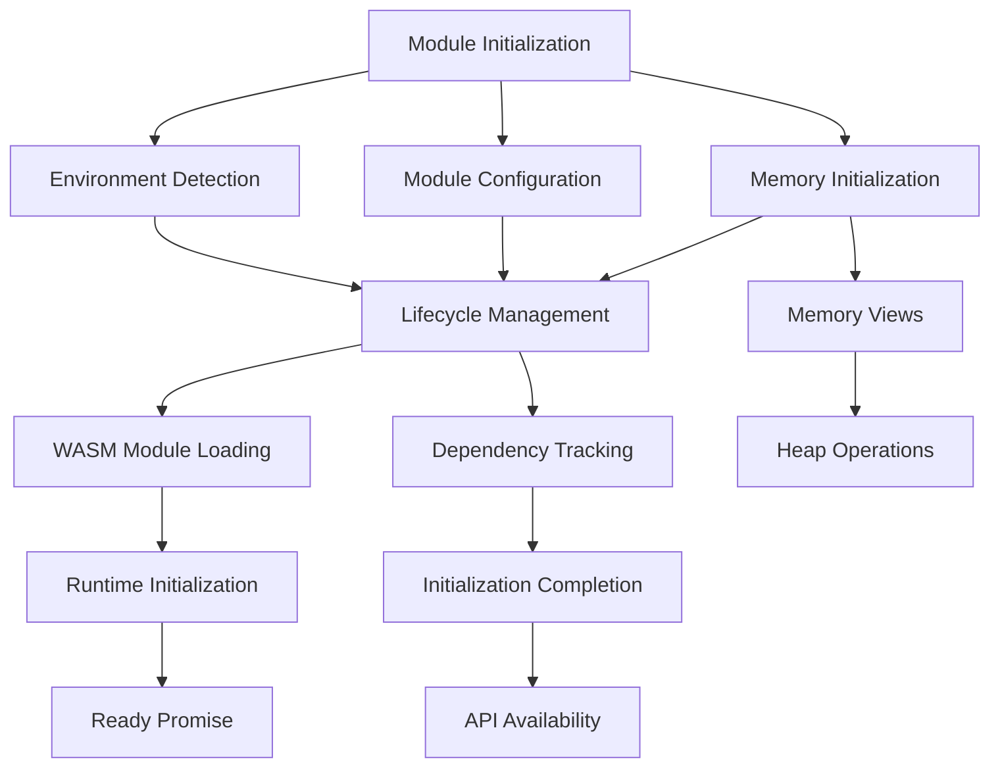
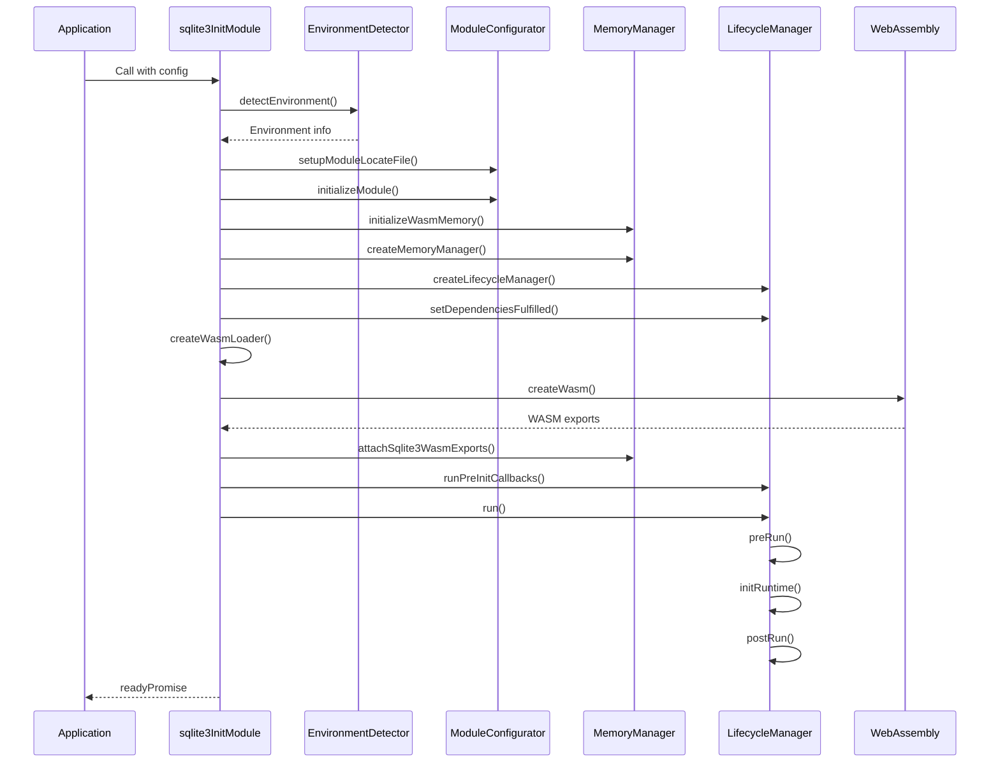
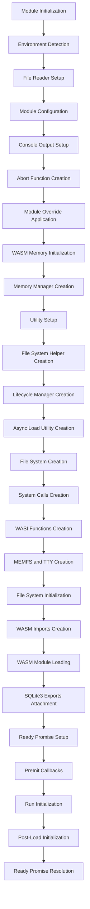

# Runtime Management

<cite>
**Referenced Files in This Document**   
- [lifecycle-manager.mjs](file://src/jswasm/runtime/lifecycle-manager.mjs)
- [module-configurator.mjs](file://src/jswasm/runtime/module-configurator.mjs)
- [environment-detector.mjs](file://src/jswasm/runtime/environment-detector.mjs)
- [memory-manager.mjs](file://src/jswasm/runtime/memory-manager.mjs)
- [sqlite3.mjs](file://src/jswasm/sqlite3.mjs)
- [runtime-types.d.ts](file://src/jswasm/shared/runtime-types.d.ts)
</cite>

## Table of Contents

1. [Introduction](#introduction)
2. [Runtime Architecture Overview](#runtime-architecture-overview)
3. [Lifecycle Manager](#lifecycle-manager)
4. [Module Configurator](#module-configurator)
5. [Environment Detector](#environment-detector)
6. [Memory Manager](#memory-manager)
7. [Component Interaction Patterns](#component-interaction-patterns)
8. [Initialization and Configuration Flow](#initialization-and-configuration-flow)
9. [Error Recovery and Initialization Issues](#error-recovery-and-initialization-issues)
10. [Performance Implications](#performance-implications)

## Introduction

The runtime management system in web-sqlite-v2 provides a comprehensive framework for initializing, configuring, and managing the lifecycle of the WebAssembly SQLite module. This system ensures stable execution across different browser environments by coordinating four key components: the lifecycle manager, module configurator, environment detector, and memory manager. These components work together to handle module instantiation, memory allocation, environment-specific configuration, and resource cleanup. The architecture follows Emscripten's runtime initialization patterns while extending them with custom functionality for SQLite-specific requirements.

## Runtime Architecture Overview

**Diagram sources**

- [sqlite3.mjs](file://src/jswasm/sqlite3.mjs#L85-L474)
- [lifecycle-manager.mjs](file://src/jswasm/runtime/lifecycle-manager.mjs#L16-L267)

**Section sources**

- [sqlite3.mjs](file://src/jswasm/sqlite3.mjs#L85-L474)

## Lifecycle Manager

The lifecycle manager coordinates the initialization phases of the WebAssembly module, handling preRun, initRuntime, and postRun phases while tracking dependencies. It implements a state machine that ensures proper sequencing of initialization steps and prevents premature execution.

The manager maintains three callback arrays for different initialization phases:

- **ATPRERUN**: Callbacks executed before runtime initialization
- **ATINIT**: Callbacks executed during runtime initialization
- **ATPOSTRUN**: Callbacks executed after runtime initialization

It also tracks run dependencies through a counter mechanism, where `addRunDependency` increments the counter and `removeRunDependency` decrements it. When the counter reaches zero, all dependencies are considered fulfilled, triggering the completion of initialization.

The `run` function orchestrates the entire initialization sequence, first checking for pending dependencies, then executing the preRun phase, initializing the runtime environment (including file system and TTY), and finally executing the postRun phase. The manager integrates with Emscripten's module system by calling the `onRuntimeInitialized` hook and resolving the ready promise upon successful initialization.

**Section sources**

- [lifecycle-manager.mjs](file://src/jswasm/runtime/lifecycle-manager.mjs#L16-L267)

## Module Configurator

The module configurator handles configuration overrides and file location resolution for the WebAssembly module. It provides several key functions for customizing module behavior:

The `createLocateFile` function resolves WebAssembly file paths, with special handling for "sqlite3.wasm" which is resolved relative to the import location. This ensures proper loading of the WASM binary regardless of the deployment environment.

The `setupModuleLocateFile` function configures the Module's locateFile property, using the import.meta.url to determine the base path. It also handles cleanup of global state and provides debugging information about the current location.

The configurator also manages console output through `setupConsoleOutput`, which sets up stdout and stderr handlers using either module-provided functions or default console methods. It creates an abort function that handles fatal errors by calling the onAbort hook, formatting error messages, setting the ABORT flag, and rejecting the ready promise.

Additionally, the configurator handles module initialization and override management through `initializeModule` and `applyModuleOverrides`, which allow for temporary configuration changes during initialization.

**Section sources**

- [module-configurator.mjs](file://src/jswasm/runtime/module-configurator.mjs#L14-L190)

## Environment Detector

The environment detector identifies the JavaScript execution context and provides appropriate file reading functions. It determines whether the code is running in a web browser, web worker, or other environment by checking for the presence of global objects like window and importScripts.

The `detectEnvironment` function returns an object with three properties:

- ENVIRONMENT_IS_WEB: true if running in a web browser (window object exists)
- ENVIRONMENT_IS_WORKER: true if running in a web worker (importScripts function exists)
- scriptDirectory: the base directory for resolving relative paths

For web workers, it uses self.location.href as the script directory. For web environments, it uses document.currentScript.src when available. It also handles blob URLs by clearing the script directory in such cases.

The `createFileReaders` function generates appropriate file reading functions based on the detected environment. In web workers, it provides a synchronous binary reader using XMLHttpRequest. For all browser environments, it provides an asynchronous reader using the Fetch API with same-origin credentials.

This detection mechanism ensures that the runtime can adapt to different execution contexts while maintaining consistent file loading behavior.

**Section sources**

- [environment-detector.mjs](file://src/jswasm/runtime/environment-detector.mjs#L13-L82)

## Memory Manager

The memory manager handles WebAssembly heap operations and memory view management. It provides a critical interface between JavaScript and the WASM memory space, ensuring proper memory access and growth handling.

The core functionality revolves around `updateMemoryViews`, which creates typed array views (HEAP8, HEAPU8, HEAP16, etc.) that point to the current WebAssembly memory buffer. This function must be called after any memory growth operation to ensure the views reflect the updated buffer.

The manager implements a sophisticated memory growth strategy through `createResizeHeapFunction`. This function attempts to grow the heap in multiple phases, using progressive growth strategies with different cut-down factors. It calculates an overgrown heap size with a safety margin and aligns the new size to 64KB page boundaries. The maximum heap size is limited to 2GB (getHeapMax returns 2147483648 bytes) to accommodate 32-bit addressing.

The `growMemory` function attempts to grow the WebAssembly memory by the required number of pages, updating the memory views upon success. If growth fails, it returns undefined, allowing the resize function to try alternative strategies.

The `initializeWasmMemory` function creates the initial WebAssembly memory instance, either using an existing memory object from the module or creating a new one with a default initial size of 16MB. The memory is configured with a maximum size of 2GB (32768 pages of 64KB each).

**Section sources**

- [memory-manager.mjs](file://src/jswasm/runtime/memory-manager.mjs#L17-L173)

## Component Interaction Patterns

The runtime components interact through a well-defined orchestration pattern centered around the sqlite3InitModule function. This function serves as the entry point and coordinates the initialization of all runtime components.

**Diagram sources**

- [sqlite3.mjs](file://src/jswasm/sqlite3.mjs#L85-L474)
- [lifecycle-manager.mjs](file://src/jswasm/runtime/lifecycle-manager.mjs#L16-L267)

**Section sources**

- [sqlite3.mjs](file://src/jswasm/sqlite3.mjs#L85-L474)

The interaction follows a dependency injection pattern where each component is initialized with references to the module and other required services. The lifecycle manager receives references to the file system and TTY implementations, while the memory manager receives the WebAssembly memory instance and module reference.

Configuration flows through the system starting with user-provided module arguments, which are processed by the module configurator. The configurator applies overrides and sets up console output and abort handling before passing control to subsequent components.

Memory management is tightly integrated with the WASM loading process. The memory manager creates the initial memory instance and memory views, which are then used by the WASM loader during module instantiation. When the module needs to grow its heap, it calls the resize function provided by the memory manager.

## Initialization and Configuration Flow

The initialization process follows a structured sequence of steps that ensure proper configuration and resource allocation before the module becomes operational.

**Diagram sources**

- [sqlite3.mjs](file://src/jswasm/sqlite3.mjs#L85-L474)

**Section sources**

- [sqlite3.mjs](file://src/jswasm/sqlite3.mjs#L85-L474)

The flow begins with environment detection to determine the execution context and set up appropriate file readers. The module configurator then processes user-provided configuration, setting up file location resolution, console output handlers, and the abort function.

Memory initialization occurs next, with the creation of the WebAssembly memory instance and the memory manager. The lifecycle manager is then created, establishing the dependency tracking system that will coordinate the initialization phases.

The file system is constructed with MEMFS (in-memory file system) and TTY (terminal interface) components. System calls and WASI (WebAssembly System Interface) functions are created to provide the necessary operating system abstractions.

WASM imports are assembled into a comprehensive object that includes system calls, memory, and other required functions. The WASM loader then uses this import object to instantiate the WebAssembly module.

After the WASM module is loaded, SQLite3 exports are attached, and the ready promise is set up with the lifecycle manager. PreInit callbacks are executed, followed by the main run sequence, which triggers the preRun, initRuntime, and postRun phases.

Finally, the post-load initialization function is attached, and the ready promise is returned to the caller, resolving when initialization completes successfully.

## Error Recovery and Initialization Issues

The runtime system implements several mechanisms for error recovery and handling initialization issues. The abort function serves as the primary error handling mechanism, providing a consistent way to handle fatal errors during initialization.

When an error occurs, the abort function:

1. Calls the Module's onAbort hook if present
2. Formats an error message with context
3. Sets the ABORT flag to prevent further execution
4. Enhances the error message with debugging information
5. Creates and throws a WebAssembly.RuntimeError
6. Rejects the ready promise to notify the caller

The system handles various initialization issues through specific patterns:

For WASM loading failures, the system implements a fallback mechanism. If streaming compilation fails (WebAssembly.instantiateStreaming rejects), it falls back to ArrayBuffer instantiation (WebAssembly.instantiate). This ensures compatibility with environments that don't support streaming compilation.

Memory allocation issues are handled through the progressive growth strategy in the memory manager. When a heap resize request fails, the system attempts multiple growth strategies with different overgrowth factors before failing. This increases the likelihood of successful memory allocation in constrained environments.

File loading errors are managed through the asyncLoad utility, which handles network failures and file not found errors. The system uses fetch with error handling that rejects promises with appropriate error messages when HTTP requests fail.

Dependency tracking prevents race conditions by ensuring that initialization doesn't proceed until all required dependencies are resolved. The runDependencies counter mechanism ensures that asynchronous operations complete before the runtime is considered ready.

Configuration errors are handled gracefully by using default values when possible and providing clear error messages when configuration is invalid. The system avoids throwing errors for optional configuration properties while ensuring required functionality is available.

**Section sources**

- [module-configurator.mjs](file://src/jswasm/runtime/module-configurator.mjs#L112-L138)
- [memory-manager.mjs](file://src/jswasm/runtime/memory-manager.mjs#L76-L122)
- [sqlite3.mjs](file://src/jswasm/sqlite3.mjs#L426-L447)

## Performance Implications

The runtime design has several performance implications that affect initialization time, memory usage, and execution efficiency.

Initialization performance is optimized through parallel operations where possible. The system uses asynchronous file loading with the Fetch API, allowing non-blocking resource retrieval. However, some operations like WebAssembly compilation are inherently sequential and represent bottlenecks.

Memory allocation strategies impact both startup time and runtime performance. The initial memory allocation of 16MB provides a reasonable default that balances memory usage with the need to avoid frequent growth operations. The progressive growth strategy in the memory manager attempts to minimize the number of memory growth operations, which are expensive due to the need to copy the entire memory buffer.

The memory manager's updateMemoryViews function is called after each memory growth operation, creating new typed array views for the expanded buffer. While necessary for correct memory access, this operation has a cost proportional to the number of view types created.

The dependency tracking system introduces a small overhead through the runDependencies counter and associated callback mechanisms. However, this overhead is justified by the improved reliability and coordination it provides.

Environment detection has minimal performance impact as it relies on simple property checks of global objects. The file reader selection is also efficient, with the synchronous reader in workers avoiding the overhead of Promises when not needed.

The use of Emscripten's runtime initialization patterns provides compatibility with a wide range of environments but may introduce some overhead compared to a more minimal custom runtime. However, this trade-off enables rich functionality and robust error handling.

Cache considerations are addressed through the use of import.meta.url for file resolution, which can leverage browser caching mechanisms for the WASM binary and other resources.

**Section sources**

- [memory-manager.mjs](file://src/jswasm/runtime/memory-manager.mjs#L56-L122)
- [sqlite3.mjs](file://src/jswasm/sqlite3.mjs#L124-L131)
- [environment-detector.mjs](file://src/jswasm/runtime/environment-detector.mjs#L53-L82)
