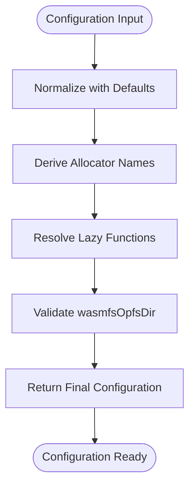
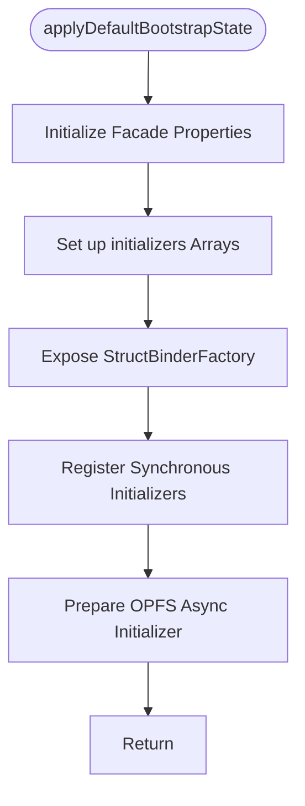
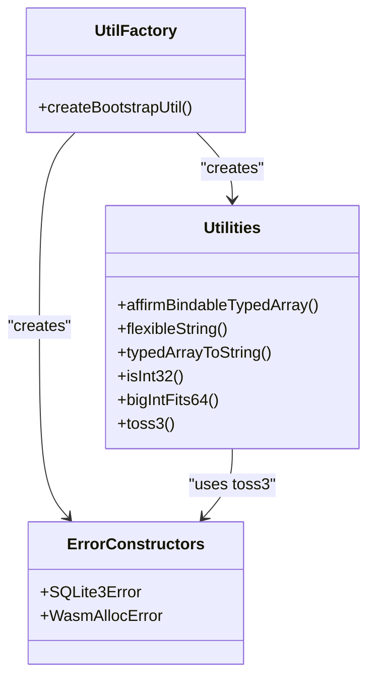
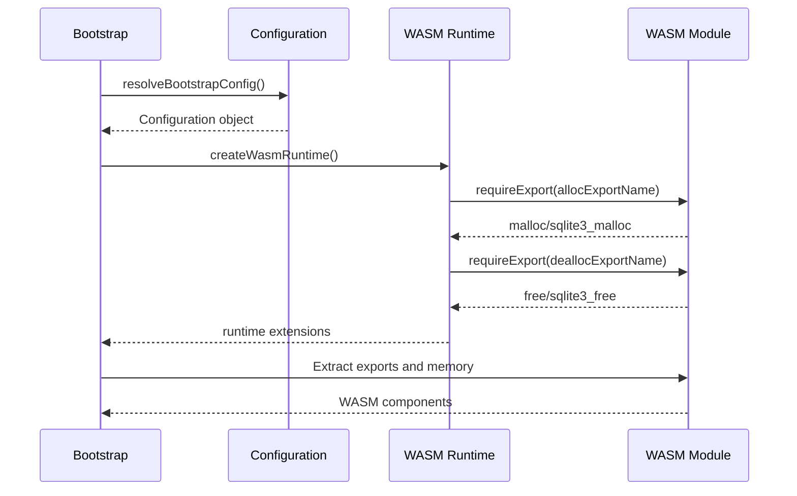
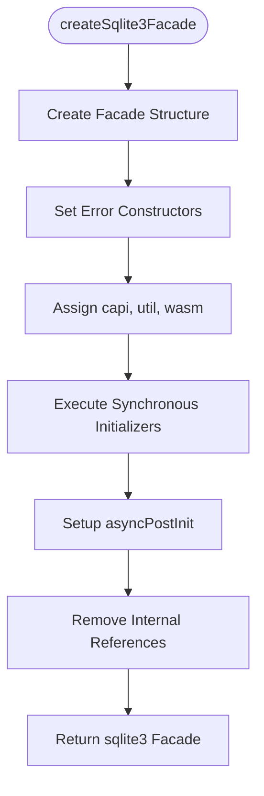
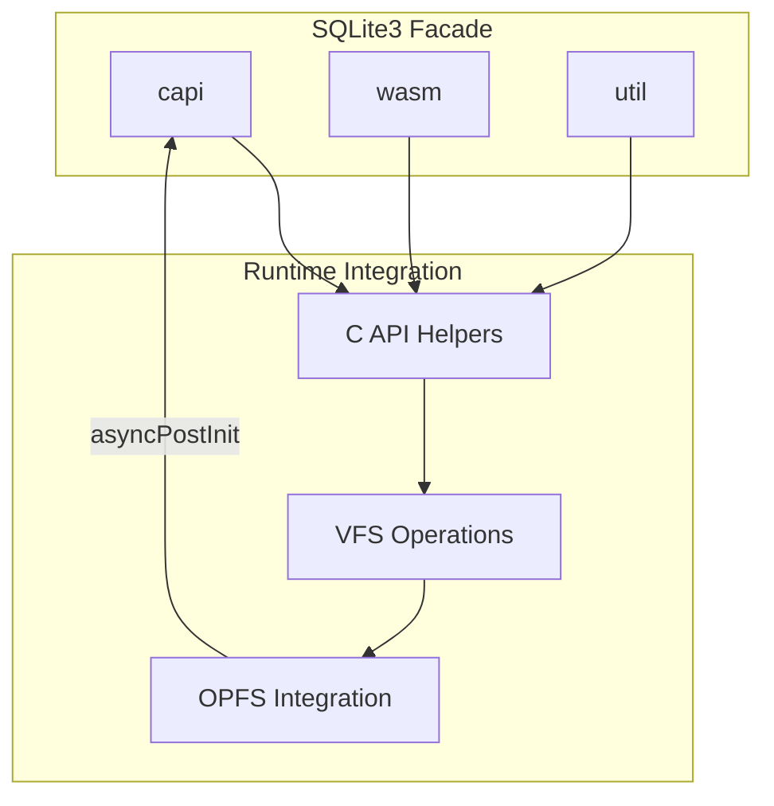

# WASM Bootstrap Process

<cite>
**Referenced Files in This Document**   
- [sqlite3Apibootstrap.mjs](file://src/jswasm/wasm/sqlite3Apibootstrap.mjs)
- [configuration.mjs](file://src/jswasm/wasm/bootstrap/configuration.mjs)
- [default-bootstrap-state.mjs](file://src/jswasm/wasm/bootstrap/default-bootstrap-state.mjs)
- [util-factory.mjs](file://src/jswasm/wasm/bootstrap/util-factory.mjs)
- [create-sqlite3-facade.mjs](file://src/jswasm/wasm/bootstrap/runtime/create-sqlite3-facade.mjs)
- [error-utils.mjs](file://src/jswasm/wasm/bootstrap/error-utils.mjs)
- [legacy-capi-stubs.mjs](file://src/jswasm/wasm/bootstrap/runtime/legacy-capi-stubs.mjs)
- [wasm-runtime.mjs](file://src/jswasm/wasm/bootstrap/runtime/wasm-runtime.mjs)
- [capi-helpers.mjs](file://src/jswasm/wasm/bootstrap/runtime/capi-helpers.mjs)
</cite>

## Table of Contents
1. [Introduction](#introduction)
2. [Bootstrap Initialization Sequence](#bootstrap-initialization-sequence)
3. [Configuration Management](#configuration-management)
4. [Default State Initialization](#default-state-initialization)
5. [Utility Factory and Error Handling](#utility-factory-and-error-handling)
6. [WASM Module Loading and Configuration](#wasm-module-loading-and-configuration)
7. [SQLite3 Facade Creation](#sqlite3-facade-creation)
8. [Runtime Integration and VFS Layers](#runtime-integration-and-vfs-layers)
9. [Common Bootstrapping Failures](#common-bootstrapping-failures)
10. [Performance and Compatibility Considerations](#performance-and-compatibility-considerations)

## Introduction
The WASM bootstrap process in web-sqlite-v2 establishes the foundation for running SQLite3 in web environments through WebAssembly. This documentation details the initialization sequence starting from sqlite3Apibootstrap.mjs, covering configuration resolution, state setup, utility creation, and facade construction. The process orchestrates the integration of an Emscripten-compiled SQLite3 module with JavaScript abstractions, creating a cohesive API surface while managing memory, error handling, and runtime dependencies. The bootstrap sequence ensures compatibility across browsers and provides extensibility points for custom initializers and virtual file system (VFS) integrations.

## Bootstrap Initialization Sequence

The bootstrap process begins with the `runSQLite3PostLoadInit` function in sqlite3Apibootstrap.mjs, which serves as the entry point after the WebAssembly module is instantiated. This function establishes the `sqlite3ApiBootstrap` global function that applications use to initialize the SQLite3 JavaScript bindings. The initialization sequence follows a strict order: configuration resolution, error utility setup, utility factory creation, WASM runtime initialization, C API helper construction, and finally facade creation. The process prevents re-initialization by caching the sqlite3 instance after the first successful bootstrap. Synchronous initializers are executed during facade creation, while asynchronous initializers (such as OPFS VFS setup) are deferred to the `asyncPostInit` method. This phased approach ensures that dependencies are available when needed while accommodating both immediate and deferred initialization requirements.

**Section sources**
- [sqlite3Apibootstrap.mjs](file://src/jswasm/wasm/sqlite3Apibootstrap.mjs#L28-L183)

## Configuration Management

Configuration management in the bootstrap process centers around the `resolveBootstrapConfig` function, which merges user-provided configuration with library defaults. The configuration object controls critical aspects such as memory management, BigInt support, and OPFS directory settings. The resolver handles both direct values and lazy-evaluated functions, allowing build tools to defer configuration resolution until the WASM environment is ready. Key configuration options include `exports` (WASM module exports), `memory` (WebAssembly.Memory instance), `bigIntEnabled` (BigInt64Array support detection), and `wasmfsOpfsDir` (OPFS mount point). The configuration also determines allocator symbol names through the `useStdAlloc` flag, which toggles between SQLite's memory management functions and standard malloc/free. Default logging functions (debug, warn, error, log) are bound to console methods, providing consistent diagnostic output.

**Diagram sources**
- [configuration.mjs](file://src/jswasm/wasm/bootstrap/configuration.mjs#L12-L63)

**Section sources**
- [configuration.mjs](file://src/jswasm/wasm/bootstrap/configuration.mjs#L12-L63)
- [sqlite3Apibootstrap.mjs](file://src/jswasm/wasm/sqlite3Apibootstrap.mjs#L54-L60)

## Default State Initialization

The `applyDefaultBootstrapState` function establishes the initial state of the bootstrap facade by setting up metadata, initializer lists, and global references. It initializes the `initializers` array for synchronous hooks and `initializersAsync` for asynchronous operations, providing extension points for additional functionality. The function registers several core initializers including version metadata injection, OO1 API installation, worker API setup, VFS initialization, and OPFS VFS preparation. A global reference to the StructBinderFactory is exposed as `Jaccwabyt`, enabling low-level struct binding capabilities. The default state also establishes the `defaultConfig` object and initializes the `sqlite3` property to undefined, preparing the facade for population during the bootstrap sequence. This centralized state management ensures consistent initialization across different embedding contexts.

**Diagram sources**
- [default-bootstrap-state.mjs](file://src/jswasm/wasm/bootstrap/default-bootstrap-state.mjs#L31-L57)

**Section sources**
- [default-bootstrap-state.mjs](file://src/jswasm/wasm/bootstrap/default-bootstrap-state.mjs#L31-L57)
- [sqlite3Apibootstrap.mjs](file://src/jswasm/wasm/sqlite3Apibootstrap.mjs#L146-L147)

## Utility Factory and Error Handling

The utility factory and error handling system provides foundational helpers used throughout the bootstrap process. The `createBootstrapUtil` function generates a utility object containing methods for typed array validation, string conversion, and error reporting. Key utilities include `affirmBindableTypedArray` for type checking, `flexibleString` for string coercion from various sources, and `typedArrayToString` for UTF-8 decoding. The error handling system creates specialized error constructors: `SQLite3Error` for general SQLite errors with result code integration, and `WasmAllocError` specifically for memory allocation failures. The `toss3` function provides a convenient way to throw SQLite3Error instances. These utilities are established early in the bootstrap sequence to ensure they're available for validating configuration and reporting initialization issues.

**Diagram sources**
- [util-factory.mjs](file://src/jswasm/wasm/bootstrap/util-factory.mjs#L10-L145)
- [error-utils.mjs](file://src/jswasm/wasm/bootstrap/error-utils.mjs#L8-L92)

**Section sources**
- [util-factory.mjs](file://src/jswasm/wasm/bootstrap/util-factory.mjs#L10-L145)
- [error-utils.mjs](file://src/jswasm/wasm/bootstrap/error-utils.mjs#L8-L92)
- [sqlite3Apibootstrap.mjs](file://src/jswasm/wasm/sqlite3Apibootstrap.mjs#L68-L71)

## WASM Module Loading and Configuration

WASM module loading and configuration involves integrating the Emscripten-compiled SQLite3 module with JavaScript abstractions. The bootstrap process extracts essential components from the module, including exported functions and memory instances, validating their presence before proceeding. The WASM runtime module provides higher-level memory management functions (`alloc`, `dealloc`, `realloc`) that wrap the configured allocator exports. It also implements the `pstack` temporary allocation system for efficient short-lived memory usage. The `compileOptionUsed` helper provides access to SQLite's compile-time configuration, enabling feature detection. The runtime extensions are merged into the WASM namespace, making them available through the `wasm` property of the final facade. This layer abstracts the raw WASM interface, providing a more ergonomic API for memory operations and system queries.

**Diagram sources**
- [wasm-runtime.mjs](file://src/jswasm/wasm/bootstrap/runtime/wasm-runtime.mjs#L16-L312)
- [sqlite3Apibootstrap.mjs](file://src/jswasm/wasm/sqlite3Apibootstrap.mjs#L108-L117)

**Section sources**
- [wasm-runtime.mjs](file://src/jswasm/wasm/bootstrap/runtime/wasm-runtime.mjs#L16-L312)
- [sqlite3Apibootstrap.mjs](file://src/jswasm/wasm/sqlite3Apibootstrap.mjs#L84-L103)

## SQLite3 Facade Creation

The SQLite3 facade creation process constructs the public API surface exposed to application code. The `createSqlite3Facade` function assembles the final sqlite3 object by combining error constructors, C API bindings, utility functions, and configuration. The facade includes the `asyncPostInit` method for executing asynchronous initializers, which runs the `initializersAsync` array registered during state setup. Synchronous initializers are executed immediately during facade construction, allowing them to modify the API surface before it's exposed. The facade structure mirrors the upstream SQLite3 JavaScript distribution while maintaining explicit control flow. Key properties include `capi` (C API bindings), `wasm` (WASM utilities), `util` (general utilities), and `config` (resolved configuration). After initialization, internal references to initializer arrays are removed to prevent accidental reuse.

**Diagram sources**
- [create-sqlite3-facade.mjs](file://src/jswasm/wasm/bootstrap/runtime/create-sqlite3-facade.mjs#L14-L82)
- [sqlite3Apibootstrap.mjs](file://src/jswasm/wasm/sqlite3Apibootstrap.mjs#L132-L143)

**Section sources**
- [create-sqlite3-facade.mjs](file://src/jswasm/wasm/bootstrap/runtime/create-sqlite3-facade.mjs#L14-L82)
- [sqlite3Apibootstrap.mjs](file://src/jswasm/wasm/sqlite3Apibootstrap.mjs#L132-L143)

## Runtime Integration and VFS Layers

Runtime integration and VFS layer setup connects the SQLite3 engine with browser-specific features like OPFS (Origin Private File System). The bootstrap process prepares for VFS integration by registering initializers that will configure the virtual file system during asynchronous initialization. The `sqlite3_wasmfs_opfs_dir` helper function manages OPFS directory configuration and initialization, while `sqlite3_js_vfs_list` provides access to registered VFS implementations. The C API helpers include functions for database serialization (`sqlite3_js_db_export`), VFS detection (`sqlite3_js_db_uses_vfs`), and file creation within the WASM filesystem. These integrations enable persistent storage through OPFS while maintaining compatibility with SQLite's traditional file-based operations. The separation between synchronous and asynchronous initializers allows VFS setup to occur after the core API is available.

**Diagram sources**
- [capi-helpers.mjs](file://src/jswasm/wasm/bootstrap/runtime/capi-helpers.mjs#L15-L591)
- [default-bootstrap-state.mjs](file://src/jswasm/wasm/bootstrap/default-bootstrap-state.mjs#L51-L55)

**Section sources**
- [capi-helpers.mjs](file://src/jswasm/wasm/bootstrap/runtime/capi-helpers.mjs#L15-L591)
- [default-bootstrap-state.mjs](file://src/jswasm/wasm/bootstrap/default-bootstrap-state.mjs#L51-L55)

## Common Bootstrapping Failures

Common bootstrapping failures typically stem from configuration issues, missing WASM exports, or environmental constraints. Key failure points include: missing or invalid `config.exports` or `config.memory` references, which prevent access to the WASM module's functionality; invalid `wasmfsOpfsDir` values that don't conform to the required '/dir-name' format; and BigInt64Array support detection failures in environments without BigInt support. The bootstrap process includes validation for these conditions, throwing descriptive errors through the `toss3` function. Other common issues include missing required WASM exports (detected by `requireExport`), allocation failures during memory operations, and initialization order violations (attempting to use the API before bootstrap completion). The error handling system ensures these failures are reported with actionable messages, including the specific missing export or invalid configuration parameter.

**Section sources**
- [sqlite3Apibootstrap.mjs](file://src/jswasm/wasm/sqlite3Apibootstrap.mjs#L94-L98)
- [configuration.mjs](file://src/jswasm/wasm/bootstrap/configuration.mjs#L73-L77)
- [wasm-runtime.mjs](file://src/jswasm/wasm/bootstrap/runtime/wasm-runtime.mjs#L27-L32)

## Performance and Compatibility Considerations

Performance and compatibility considerations are central to the bootstrap design, ensuring efficient initialization and broad browser support. The bootstrap process minimizes overhead by caching the sqlite3 instance after first initialization and using lazy property access for expensive operations. Memory management is optimized through the pstack temporary allocation system, reducing garbage collection pressure. The configuration system supports both standard malloc/free and SQLite's memory management functions, allowing optimization based on use case. Compatibility is maintained through feature detection (BigInt support, OPFS availability) and graceful degradation when advanced features are unavailable. The separation of synchronous and asynchronous initialization allows the core API to become available quickly while deferring potentially slow operations like OPFS setup. The modular design enables tree-shaking in bundlers, reducing payload size when certain features are not needed.

**Section sources**
- [sqlite3Apibootstrap.mjs](file://src/jswasm/wasm/sqlite3Apibootstrap.mjs#L44-L49)
- [configuration.mjs](file://src/jswasm/wasm/bootstrap/configuration.mjs#L20-L25)
- [create-sqlite3-facade.mjs](file://src/jswasm/wasm/bootstrap/runtime/create-sqlite3-facade.mjs#L35-L66)