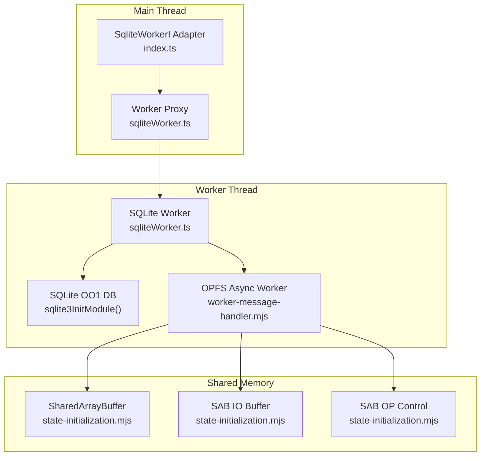
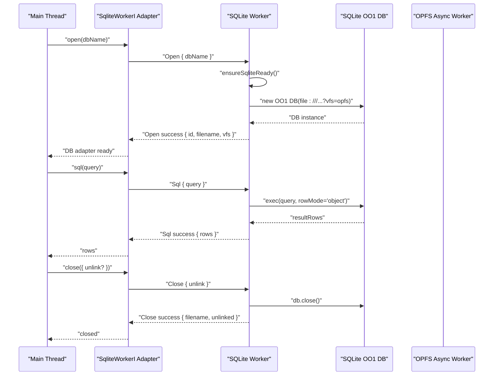
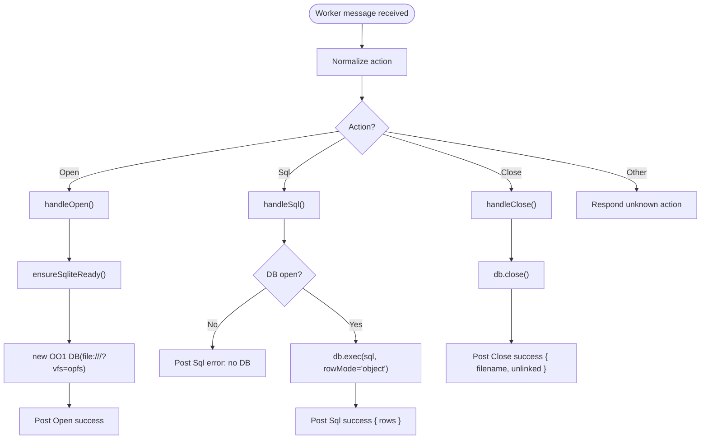
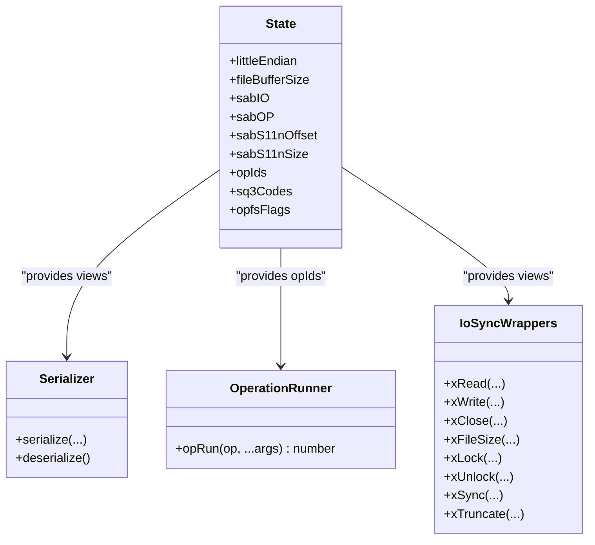
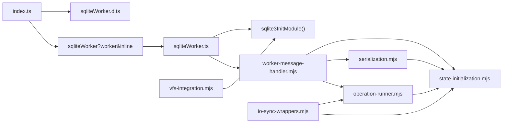

# Worker Integration

<cite>
**Referenced Files in This Document**
- [sqliteWorker.ts](file://src/sqliteWorker.ts)
- [index.ts](file://src/index.ts)
- [sqliteWorker.d.ts](file://src/sqliteWorker.d.ts)
- [worker-message-handler.mjs](file://src/jswasm/vfs/opfs/installer/utils/worker-message-handler.mjs)
- [state-initialization.mjs](file://src/jswasm/vfs/opfs/installer/core/state-initialization.mjs)
- [serialization.mjs](file://src/jswasm/vfs/opfs/installer/core/serialization.mjs)
- [operation-runner.mjs](file://src/jswasm/vfs/opfs/installer/core/operation-runner.mjs)
- [io-sync-wrappers.mjs](file://src/jswasm/vfs/opfs/installer/wrappers/io-sync-wrappers.mjs)
- [vfs-integration.mjs](file://src/jswasm/vfs/opfs/installer/wrappers/vfs-integration.mjs)
- [environment.e2e.test.ts](file://tests/e2e/environment.e2e.test.ts)
- [worker-client.ts](file://tests/e2e/worker-client.ts)
- [test-worker.ts](file://tests/e2e/test-worker.ts)
</cite>

## Table of Contents
1. [Introduction](#introduction)
2. [Project Structure](#project-structure)
3. [Core Components](#core-components)
4. [Architecture Overview](#architecture-overview)
5. [Detailed Component Analysis](#detailed-component-analysis)
6. [Dependency Analysis](#dependency-analysis)
7. [Performance Considerations](#performance-considerations)
8. [Troubleshooting Guide](#troubleshooting-guide)
9. [Conclusion](#conclusion)

## Introduction
This document explains the Web Worker integration architecture used by web-sqlite-v2 to offload SQLite computation to a dedicated worker thread while maintaining a clean main-thread API. It covers the message-passing protocol between the main thread and the worker, including action codes (Open, Close, Sql), data serialization, and error propagation. It also documents the worker’s lifecycle, thread safety mechanisms using SharedArrayBuffer, and communication patterns via postMessage. Concrete examples are drawn from sqliteWorker.ts to show how database operations are delegated and results are returned. Finally, it highlights the relationship between the worker and the main API, common issues such as worker termination and context loss, and performance considerations for large datasets.

## Project Structure
The worker integration spans several modules:
- A minimal SQLite worker that handles Open, Close, and Sql actions and responds via postMessage.
- A main-thread adapter that creates a worker, sends requests, and exposes a SqliteWorkerI interface.
- An OPFS-based asynchronous I/O subsystem that uses SharedArrayBuffer and Atomics for cross-thread coordination.
- Tests that validate environment support and worker behavior.

**Diagram sources**
- [index.ts](file://src/index.ts#L1-L92)
- [sqliteWorker.ts](file://src/sqliteWorker.ts#L1-L243)
- [worker-message-handler.mjs](file://src/jswasm/vfs/opfs/installer/utils/worker-message-handler.mjs#L1-L126)
- [state-initialization.mjs](file://src/jswasm/vfs/opfs/installer/core/state-initialization.mjs#L1-L127)

**Section sources**
- [index.ts](file://src/index.ts#L1-L92)
- [sqliteWorker.ts](file://src/sqliteWorker.ts#L1-L243)

## Core Components
- Worker message protocol: Defines RequestMessage and ResponseMessage shapes with action codes and messageId correlation.
- SQLite worker: Implements Open, Close, and Sql handlers, initializes SQLite on demand, and posts responses.
- Main API adapter: Creates a worker, sends Open requests, and forwards messages to the caller.
- OPFS async worker: Manages SharedArrayBuffer-backed serialization and operation coordination with the main worker.

Key responsibilities:
- Protocol normalization and validation in both main and worker threads.
- Lazy initialization of the SQLite runtime in the worker.
- Cross-thread synchronization using SharedArrayBuffer and Atomics.
- Robust error propagation with stack traces.

**Section sources**
- [sqliteWorker.d.ts](file://src/sqliteWorker.d.ts#L88-L115)
- [sqliteWorker.ts](file://src/sqliteWorker.ts#L1-L243)
- [index.ts](file://src/index.ts#L1-L92)
- [worker-message-handler.mjs](file://src/jswasm/vfs/opfs/installer/utils/worker-message-handler.mjs#L1-L126)

## Architecture Overview
The architecture separates concerns:
- Main thread: Provides a convenient API surface (SqliteWorkerI) and manages worker lifecycle.
- Worker thread: Runs SQLite computations, handles requests, and communicates results.
- OPFS async worker: Coordinates asynchronous filesystem operations using SharedArrayBuffer and Atomics.

**Diagram sources**
- [index.ts](file://src/index.ts#L64-L92)
- [sqliteWorker.ts](file://src/sqliteWorker.ts#L68-L206)
- [sqliteWorker.d.ts](file://src/sqliteWorker.d.ts#L88-L115)

## Detailed Component Analysis

### Message Protocol and Action Codes
- Action codes: Open (0), Close (1), Sql (2). Both main and worker accept numeric or string action names.
- RequestMessage: Includes action, messageId, and payload.
- ResponseMessage: Includes action, messageId, success flag, payload, and optional error/errorStack.

Validation and normalization:
- normalizeAction accepts either a string or number and maps to a canonical numeric action.
- messageId correlation ensures responses match requests.

Error propagation:
- On exceptions, workers send structured error payloads with message and stack lines.

**Section sources**
- [sqliteWorker.ts](file://src/sqliteWorker.ts#L5-L29)
- [sqliteWorker.ts](file://src/sqliteWorker.ts#L35-L45)
- [sqliteWorker.d.ts](file://src/sqliteWorker.d.ts#L88-L115)

### Worker Lifecycle and Initialization
- Lazy initialization: ensureSqliteReady initializes SQLite on first use.
- Open handler:
  - Validates payload and constructs a file URI with OPFS VFS.
  - Creates an OO1 DB instance and returns metadata (id, filename, vfs).
- Sql handler:
  - Requires an open DB; executes query with rowMode "object" and returns resultRows.
- Close handler:
  - Closes the DB and clears state; supports optional unlink semantics.

**Diagram sources**
- [sqliteWorker.ts](file://src/sqliteWorker.ts#L68-L206)

**Section sources**
- [sqliteWorker.ts](file://src/sqliteWorker.ts#L47-L56)
- [sqliteWorker.ts](file://src/sqliteWorker.ts#L68-L110)
- [sqliteWorker.ts](file://src/sqliteWorker.ts#L112-L166)
- [sqliteWorker.ts](file://src/sqliteWorker.ts#L168-L206)

### Main API Adapter and Delegation
- The adapter creates a worker and defines the Actions enum locally to avoid runtime .d.ts imports.
- It sends an Open request and logs responses.
- The adapter currently stubs sql and close operations; the primary goal is to demonstrate the worker message flow.

Benefits of offloading:
- Keeps the main thread responsive during heavy SQL execution.
- Leverages OPFS for persistent storage and efficient I/O.

**Section sources**
- [index.ts](file://src/index.ts#L1-L92)

### OPFS Async Worker and SharedArrayBuffer Coordination
- Shared memory layout:
  - SABIO: combined file buffer and serialization region.
  - SABOP: operation control region with atomic fields for operation selection and result codes.
- Serialization:
  - A serializer writes typed values into SABIO and reads them back on the worker side.
- Operation runner:
  - Sets opIds and result codes, signals the worker, and waits atomically for completion.
- I/O wrappers:
  - Wrap SQLite VFS methods to delegate to the async worker, copying data to/from SABIO.
- Optional VFS methods:
  - Provide fallback randomness and sleep using Atomics.wait.

**Diagram sources**
- [state-initialization.mjs](file://src/jswasm/vfs/opfs/installer/core/state-initialization.mjs#L1-L127)
- [serialization.mjs](file://src/jswasm/vfs/opfs/installer/core/serialization.mjs#L1-L43)
- [operation-runner.mjs](file://src/jswasm/vfs/opfs/installer/core/operation-runner.mjs#L1-L28)
- [io-sync-wrappers.mjs](file://src/jswasm/vfs/opfs/installer/wrappers/io-sync-wrappers.mjs#L1-L236)

**Section sources**
- [state-initialization.mjs](file://src/jswasm/vfs/opfs/installer/core/state-initialization.mjs#L1-L127)
- [serialization.mjs](file://src/jswasm/vfs/opfs/installer/core/serialization.mjs#L1-L43)
- [operation-runner.mjs](file://src/jswasm/vfs/opfs/installer/core/operation-runner.mjs#L1-L28)
- [io-sync-wrappers.mjs](file://src/jswasm/vfs/opfs/installer/wrappers/io-sync-wrappers.mjs#L1-L236)
- [vfs-integration.mjs](file://src/jswasm/vfs/opfs/installer/wrappers/vfs-integration.mjs#L1-L74)

### Worker Message Handler for OPFS Async
- Receives messages from the OPFS async worker and coordinates initialization.
- Sends state copies (without functions) to the worker for serialization.
- Installs OPFS VFS, sets up shared views, and optionally runs sanity checks.
- Handles unexpected messages by rejecting promises.

**Section sources**
- [worker-message-handler.mjs](file://src/jswasm/vfs/opfs/installer/utils/worker-message-handler.mjs#L1-L126)

### Example: Running Tests in a Worker
- The test harness demonstrates how to create a worker, post a test message, and terminate the worker upon completion.
- The test worker initializes SQLite, installs OPFS VFS if needed, runs a query, and posts results or errors.

**Section sources**
- [worker-client.ts](file://tests/e2e/worker-client.ts#L1-L34)
- [test-worker.ts](file://tests/e2e/test-worker.ts#L1-L74)

## Dependency Analysis
- sqliteWorker.ts depends on sqlite3InitModule for lazy initialization and OO1 DB for database operations.
- The main API adapter depends on sqliteWorker.d.ts for type-safe message contracts and on the inline worker bundle.
- OPFS async worker components depend on SharedArrayBuffer state initialization and serialization utilities.
- I/O and VFS wrappers depend on operation runner and state for cross-thread coordination.

**Diagram sources**
- [index.ts](file://src/index.ts#L1-L92)
- [sqliteWorker.ts](file://src/sqliteWorker.ts#L1-L243)
- [worker-message-handler.mjs](file://src/jswasm/vfs/opfs/installer/utils/worker-message-handler.mjs#L1-L126)
- [state-initialization.mjs](file://src/jswasm/vfs/opfs/installer/core/state-initialization.mjs#L1-L127)
- [serialization.mjs](file://src/jswasm/vfs/opfs/installer/core/serialization.mjs#L1-L43)
- [operation-runner.mjs](file://src/jswasm/vfs/opfs/installer/core/operation-runner.mjs#L1-L28)
- [io-sync-wrappers.mjs](file://src/jswasm/vfs/opfs/installer/wrappers/io-sync-wrappers.mjs#L1-L236)
- [vfs-integration.mjs](file://src/jswasm/vfs/opfs/installer/wrappers/vfs-integration.mjs#L1-L74)

**Section sources**
- [index.ts](file://src/index.ts#L1-L92)
- [sqliteWorker.ts](file://src/sqliteWorker.ts#L1-L243)

## Performance Considerations
- Offloading heavy SQL execution to the worker prevents main-thread blocking, improving UI responsiveness.
- OPFS async I/O uses SharedArrayBuffer to minimize copying overhead and leverage native serialization.
- For large datasets:
  - Prefer streaming or chunked processing on the worker side.
  - Use appropriate row modes and limit result sizes when possible.
  - Avoid frequent small writes; batch operations where feasible.
- Serialization costs:
  - Minimize payload sizes by selecting only needed columns.
  - Reuse worker instances to avoid repeated initialization overhead.

[No sources needed since this section provides general guidance]

## Troubleshooting Guide
Common issues and strategies:
- Worker termination:
  - Ensure the worker is terminated after tests or when no longer needed to free resources.
  - Example usage shows terminating the worker after receiving a result.
- Context loss:
  - Verify SharedArrayBuffer availability and that the page is served with appropriate headers for cross-origin isolation if required by the environment.
  - Tests confirm SharedArrayBuffer presence and OPFS VFS availability.
- Debugging:
  - Log worker messages and errors; the adapter logs incoming messages.
  - Use error stacks propagated in response payloads to trace failures.
  - Validate environment conditions in a dedicated worker to isolate issues.

**Section sources**
- [worker-client.ts](file://tests/e2e/worker-client.ts#L1-L34)
- [environment.e2e.test.ts](file://tests/e2e/environment.e2e.test.ts#L1-L43)
- [index.ts](file://src/index.ts#L64-L92)
- [sqliteWorker.ts](file://src/sqliteWorker.ts#L112-L166)

## Conclusion
web-sqlite-v2 integrates a Web Worker to execute SQLite operations efficiently while keeping the main thread responsive. The worker implements a simple, robust message protocol with action codes and messageId correlation, and it lazily initializes SQLite. Cross-thread coordination relies on SharedArrayBuffer and Atomics, with OPFS enabling asynchronous file I/O. The main API adapter provides a convenient interface and delegates work to the worker. Proper error propagation, lifecycle management, and environment validation are essential for reliable operation. For large datasets, consider batching and streaming strategies to optimize performance.