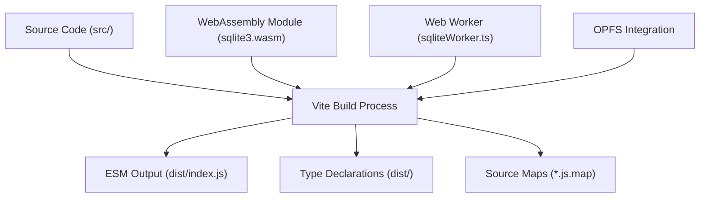
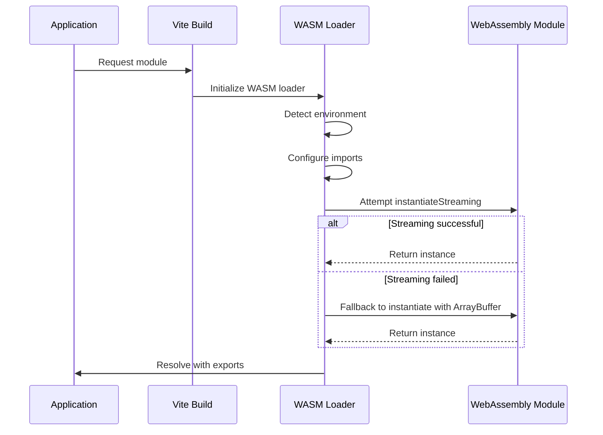

# Build Configuration

<cite>
**Referenced Files in This Document**   
- [vite.config.ts](file://vite.config.ts)
- [package.json](file://package.json)
- [tsconfig.json](file://tsconfig.json)
- [src/index.ts](file://src/index.ts)
- [src/sqliteWorker.ts](file://src/sqliteWorker.ts)
- [src/jswasm/sqlite3.mjs](file://src/jswasm/sqlite3.mjs)
- [src/jswasm/utils/wasm-loader/wasm-loader.ts](file://src/jswasm/utils/wasm-loader/wasm-loader.ts)
- [src/jswasm/runtime/environment-detector.mjs](file://src/jswasm/runtime/environment-detector.mjs)
- [src/jswasm/vfs/opfs/installer/wrappers/vfs-integration.mjs](file://src/jswasm/vfs/opfs/installer/wrappers/vfs-integration.mjs)
- [vitest.e2e.config.ts](file://vitest.e2e.config.ts)
- [vitest.unit.config.ts](file://vitest.unit.config.ts)
- [src/sqliteWorker.d.ts](file://src/sqliteWorker.d.ts)
</cite>

## Table of Contents

1. [Introduction](#introduction)
2. [Vite Build Configuration](#vite-build-configuration)
3. [TypeScript Configuration](#typescript-configuration)
4. [WebAssembly Module Integration](#webassembly-module-integration)
5. [Web Workers and OPFS Integration](#web-workers-and-opfs-integration)
6. [Type Declaration Generation](#type-declaration-generation)
7. [Testing Configuration](#testing-configuration)
8. [Build Customization and Optimization](#build-customization-and-optimization)
9. [Common Build Issues and Solutions](#common-build-issues-and-solutions)
10. [Performance Optimization](#performance-optimization)

## Introduction

The web-sqlite-v2 library is a SQLite3 WebAssembly implementation with OPFS (Origin Private File System) support, built using Vite as the build tool. This documentation provides comprehensive details about the build configuration, focusing on TypeScript compilation, WebAssembly module bundling, type declaration generation, Web Workers integration, and OPFS functionality. The build system is designed to create an efficient, tree-shakeable ESM (ECMAScript Module) output while properly handling the complex requirements of WebAssembly and Web Workers.

**Section sources**

- [vite.config.ts](file://vite.config.ts)
- [package.json](file://package.json)

## Vite Build Configuration

The Vite build configuration is defined in `vite.config.ts` and is specifically tailored for library development. The configuration creates an ESM (ECMAScript Module) build with the following key settings:

- **Library Mode**: The build is configured in library mode with `build.lib`, specifying `src/index.ts` as the entry point.
- **Output Format**: Only ES modules format is generated (`formats: ["es"]`), producing `dist/index.js` as the output file.
- **Source Maps**: Source maps are enabled (`sourcemap: true`) for debugging purposes.
- **Output Directory**: The build output is directed to the `dist` directory with `outDir: "dist"`.
- **Clean Output**: The output directory is emptied before each build with `emptyOutDir: true`.
- **Minification**: Minification is disabled (`minify: false`) to maintain readability and debugging capabilities in the development build.

The configuration also includes specific Rollup options to ensure the entry file is named exactly `index.js` in the output directory.



**Diagram sources **

- [vite.config.ts](file://vite.config.ts#L5-L35)
- [package.json](file://package.json#L1-L62)

**Section sources**

- [vite.config.ts](file://vite.config.ts#L1-L36)
- [package.json](file://package.json#L1-L62)

## TypeScript Configuration

The TypeScript configuration is managed through `tsconfig.json` and is optimized for modern JavaScript development with ESM support. Key configuration options include:

- **Target**: ES2022, ensuring compatibility with modern JavaScript features.
- **Module**: ESNext, aligning with the ESM output format.
- **Lib**: Includes ES2022, DOM, DOM.Iterable, and WebWorker libraries to support the full range of APIs used in the project.
- **Module Resolution**: Uses "bundler" mode, which is ideal for modern build tools like Vite.
- **Strict Mode**: Enabled with `strict: true` and additional strictness options like `noUnusedLocals` and `noUnusedParameters`.
- **Emit**: No emit is configured (`noEmit: true`) since Vite handles the compilation process.
- **Include**: Specifies the source directories and test configurations to include in the TypeScript compilation.

The configuration also extends `tsconfig.eslint.json` for linting purposes and `tsconfig.migration.json` for migration tasks, ensuring consistent type checking across different contexts.

**Section sources**

- [tsconfig.json](file://tsconfig.json#L1-L37)
- [tsconfig.eslint.json](file://tsconfig.eslint.json#L1-L12)
- [tsconfig.migration.json](file://tsconfig.migration.json#L33-L52)

## WebAssembly Module Integration

The integration of the WebAssembly module is a critical aspect of the build configuration. The library includes a WebAssembly binary (`sqlite3.wasm`) that is loaded and instantiated at runtime. The build process handles this through several mechanisms:

- **WASM Loader**: The `wasm-loader.ts` utility provides a comprehensive loader for the WebAssembly module, handling both streaming and ArrayBuffer instantiation with appropriate fallbacks.
- **Environment Detection**: The `environment-detector.mjs` module detects whether the code is running in a web browser, web worker, or Node.js environment, and adjusts the loading strategy accordingly.
- **Memory Management**: The `memory-manager.mjs` module initializes and manages the WebAssembly memory, ensuring proper allocation and access.
- **Import Configuration**: The build configuration sets up the necessary imports for the WebAssembly module, including system calls, file system operations, and memory management functions.

The WASM loader implements a sophisticated instantiation strategy that first attempts to use `WebAssembly.instantiateStreaming` for optimal performance, falling back to `WebAssembly.instantiate` with ArrayBuffer when streaming is not available or fails. This ensures broad compatibility across different browsers and environments.



**Diagram sources **

- [src/jswasm/utils/wasm-loader/wasm-loader.ts](file://src/jswasm/utils/wasm-loader/wasm-loader.ts#L1-L210)
- [src/jswasm/runtime/environment-detector.mjs](file://src/jswasm/runtime/environment-detector.mjs#L1-L82)
- [src/jswasm/sqlite3.mjs](file://src/jswasm/sqlite3.mjs#L1-L474)

**Section sources**

- [src/jswasm/utils/wasm-loader/wasm-loader.ts](file://src/jswasm/utils/wasm-loader/wasm-loader.ts#L1-L210)
- [src/jswasm/runtime/environment-detector.mjs](file://src/jswasm/runtime/environment-detector.mjs#L1-L82)
- [src/jswasm/sqlite3.mjs](file://src/jswasm/sqlite3.mjs#L1-L474)

## Web Workers and OPFS Integration

The build configuration includes specialized handling for Web Workers and OPFS (Origin Private File System) integration, which are essential for the library's functionality:

- **Web Worker**: The `sqliteWorker.ts` file is configured as a Web Worker using Vite's worker import syntax (`?worker&inline`). This allows the SQLite operations to run in a separate thread, preventing blocking of the main UI thread.
- **OPFS Support**: The library includes comprehensive OPFS integration through the `opfs/installer` modules, enabling persistent storage of SQLite databases in the browser's private file system.
- **Message Protocol**: The worker communication follows a structured message protocol defined in `sqliteWorker.d.ts`, with actions for opening, closing, and executing SQL queries.
- **Environment-Specific Handling**: The build configuration ensures that the worker code is properly bundled and that the necessary environment-specific code paths are included.

The OPFS integration is particularly important as it allows the SQLite database to be stored persistently in the browser's private file system, providing a robust storage solution that survives page reloads and browser restarts.

```mermaid
classDiagram
class SqliteWorkerI {
+id : string
+sql<T>(query : string) : Promise<T[]>
+transaction<T>(fn : (db : SqliteWorkerI) => Promise<T> | T) : Promise<T>
+export() : Promise<Uint8Array>
+import(bytes : ArrayBufferView | ArrayBuffer) : Promise<void>
+close(options? : { unlink? : boolean }) : Promise<void>
+on(event : string, handler : (...args : unknown[]) => void) : void
}
class RequestMessage {
+action : ActionCode
+messageId : number
+payload : T
}
class ResponseMessage {
+action : ActionCode
+messageId : number
+success : boolean
+payload : T
+error? : string
+errorStack? : string[]
}
class Actions {
+Open : 0
+Close : 1
+Sql : 2
}
SqliteWorkerI <|-- SqliteWorkerImpl
RequestMessage <|-- OpenRequest
RequestMessage <|-- CloseRequest
RequestMessage <|-- SqlRequest
ResponseMessage <|-- OpenResponse
ResponseMessage <|-- CloseResponse
ResponseMessage <|-- SqlResponse
SqliteWorkerImpl --> RequestMessage : sends
SqliteWorkerImpl --> ResponseMessage : receives
```

**Diagram sources **

- [src/index.ts](file://src/index.ts#L1-L92)
- [src/sqliteWorker.ts](file://src/sqliteWorker.ts#L1-L243)
- [src/sqliteWorker.d.ts](file://src/sqliteWorker.d.ts#L1-L115)
- [src/jswasm/vfs/opfs/installer/wrappers/vfs-integration.mjs](file://src/jswasm/vfs/opfs/installer/wrappers/vfs-integration.mjs#L1-L74)

**Section sources**

- [src/index.ts](file://src/index.ts#L1-L92)
- [src/sqliteWorker.ts](file://src/sqliteWorker.ts#L1-L243)
- [src/sqliteWorker.d.ts](file://src/sqliteWorker.d.ts#L1-L115)

## Type Declaration Generation

The build configuration includes robust type declaration generation to provide TypeScript support for library consumers:

- **vite-plugin-dts**: The build uses the `vite-plugin-dts` plugin to generate type declaration files (.d.ts) from the TypeScript source code.
- **Configuration**: The plugin is configured to:
    - Use `src` as the entry root (`entryRoot: "src"`)
    - Output declarations to the `dist` directory (`outDir: "dist"`)
    - Include only the main entry point (`include: ["src/index.ts"]`)
    - Insert a types entry in package.json (`insertTypesEntry: true`)
    - Copy .d.ts files alongside the bundle (`copyDtsFiles: true`)
- **Multiple Declaration Files**: The configuration keeps multiple .d.ts files rather than rolling them up into a single index.d.ts file, preserving the module structure.

This approach ensures that consumers of the library get accurate type information and IntelliSense support in their IDEs, improving developer experience and reducing errors.

**Section sources**

- [vite.config.ts](file://vite.config.ts#L23-L34)
- [package.json](file://package.json#L7-L12)

## Testing Configuration

The testing configuration is managed through Vitest, with separate configurations for unit and E2E (end-to-end) tests:

- **E2E Configuration**: The `vitest.e2e.config.ts` file configures browser-based E2E tests using Playwright, with support for Chromium and appropriate headers for OPFS and SharedArrayBuffer functionality.
- **Unit Configuration**: The `vitest.unit.config.ts` file configures unit tests with support for browser environments and appropriate headers for cross-origin policies.
- **Headers**: Both configurations include the necessary headers for OPFS functionality:
    - `Cross-Origin-Opener-Policy: same-origin`
    - `Cross-Origin-Embedder-Policy: require-corp`
- **Test Inclusion**: The configurations specify which test files to include, with E2E tests focusing on `.e2e.test.ts` files and unit tests on `.unit.test.ts` files.

The testing setup ensures that both the core functionality and browser-specific features like OPFS are thoroughly tested across different environments.

**Section sources**

- [vitest.e2e.config.ts](file://vitest.e2e.config.ts#L1-L67)
- [vitest.unit.config.ts](file://vitest.unit.config.ts#L1-L36)

## Build Customization and Optimization

The build configuration provides several options for customization and optimization:

- **Environment Variables**: The build can be customized through environment variables and configuration options passed to the build process.
- **Target Optimization**: The build targets ES2022, balancing modern JavaScript features with broad browser compatibility.
- **Tree Shaking**: The ESM output format enables effective tree shaking, allowing bundlers to eliminate unused code from the final bundle.
- **Source Maps**: Comprehensive source maps are generated to facilitate debugging in both development and production environments.
- **Watch Mode**: The build script includes a watch mode (`npm run build --watch`) for development, automatically rebuilding when source files change.

For production builds, additional optimization can be achieved by enabling minification and other production-specific optimizations, though these are disabled in the default configuration to prioritize development experience.

**Section sources**

- [vite.config.ts](file://vite.config.ts#L1-L36)
- [package.json](file://package.json#L15-L30)

## Common Build Issues and Solutions

Several common build issues may arise when working with this configuration, along with their solutions:

- **WASM Loading Failures**: These can occur due to incorrect paths or CORS issues. Ensure the WASM file is properly referenced and served with appropriate headers.
- **Worker Bundling Problems**: These may occur if the worker import syntax is not properly recognized. Verify that Vite is configured to handle worker imports and that the worker file is included in the build.
- **Tree Shaking Configuration**: Ensure that the library is properly marked as side-effect-free in package.json to enable effective tree shaking.
- **OPFS Permissions**: OPFS functionality requires specific headers (`Cross-Origin-Opener-Policy` and `Cross-Origin-Embedder-Policy`). Ensure these are set in the server configuration.
- **Type Declaration Issues**: If type declarations are not generated correctly, verify the `vite-plugin-dts` configuration and ensure all necessary files are included.

Addressing these issues typically involves verifying the build configuration, ensuring proper file references, and checking server headers for browser-specific features.

**Section sources**

- [vite.config.ts](file://vite.config.ts#L1-L36)
- [vitest.e2e.config.ts](file://vitest.e2e.config.ts#L40-L48)
- [src/jswasm/utils/wasm-loader/wasm-loader.ts](file://src/jswasm/utils/wasm-loader/wasm-loader.ts#L1-L210)

## Performance Optimization

The build configuration includes several performance optimization strategies:

- **Code Splitting**: The ESM output format enables effective code splitting, reducing initial load times.
- **Tree Shaking**: Unused code is eliminated from the final bundle, reducing bundle size.
- **WASM Streaming**: The WASM loader prioritizes `WebAssembly.instantiateStreaming` for faster instantiation.
- **Efficient Imports**: The module resolution is optimized for bundler mode, reducing import overhead.
- **Development Build**: The development build prioritizes fast rebuild times and comprehensive source maps for debugging.
- **Production Optimization**: For production, additional minification and optimization can be applied to further reduce bundle size and improve performance.

These optimizations ensure that the library performs efficiently in both development and production environments, providing a smooth experience for both developers and end users.

**Section sources**

- [vite.config.ts](file://vite.config.ts#L1-L36)
- [src/jswasm/utils/wasm-loader/wasm-loader.ts](file://src/jswasm/utils/wasm-loader/wasm-loader.ts#L1-L210)
- [src/jswasm/sqlite3.mjs](file://src/jswasm/sqlite3.mjs#L1-L474)
