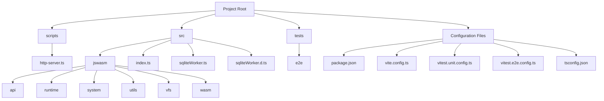
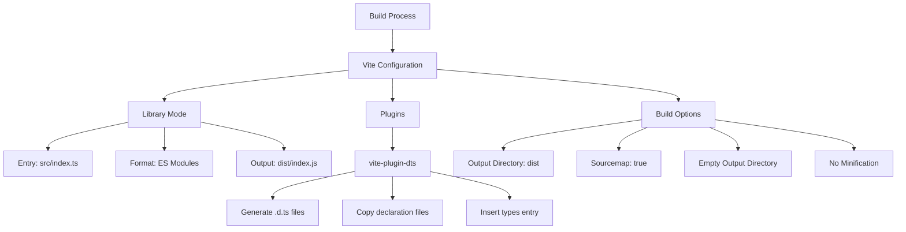
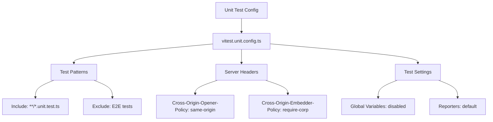
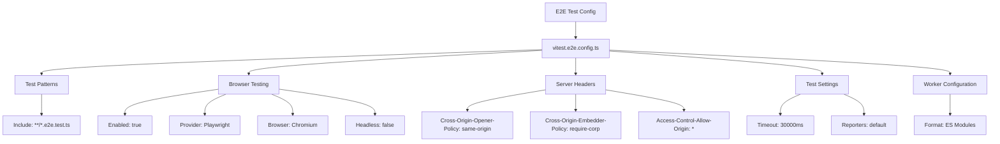
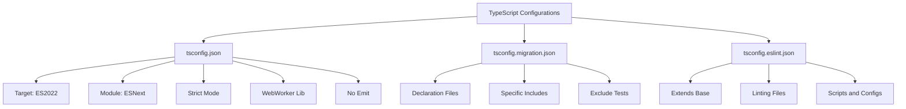
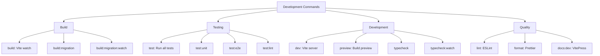
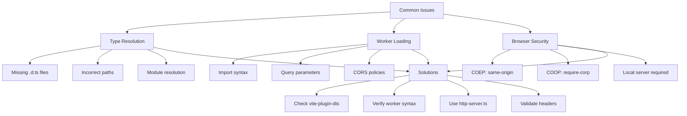
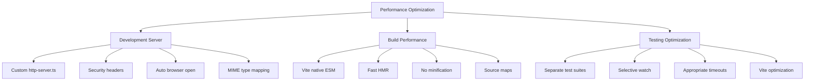
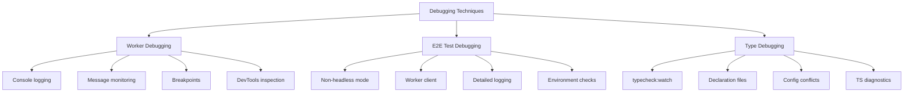

# Development Setup

<cite>
**Referenced Files in This Document**   
- [package.json](file://package.json)
- [vite.config.ts](file://vite.config.ts)
- [vitest.unit.config.ts](file://vitest.unit.config.ts)
- [vitest.e2e.config.ts](file://vitest.e2e.config.ts)
- [tsconfig.json](file://tsconfig.json)
- [tsconfig.migration.json](file://tsconfig.migration.json)
- [tsconfig.eslint.json](file://tsconfig.eslint.json)
- [src/index.ts](file://src/index.ts)
- [src/sqliteWorker.ts](file://src/sqliteWorker.ts)
- [src/sqliteWorker.d.ts](file://src/sqliteWorker.d.ts)
- [tests/e2e/test-worker.ts](file://tests/e2e/test-worker.ts)
- [tests/e2e/worker-client.ts](file://tests/e2e/worker-client.ts)
- [scripts/http-server.ts](file://scripts/http-server.ts)
</cite>

## Table of Contents
1. [Introduction](#introduction)
2. [Project Structure](#project-structure)
3. [Build Configuration with Vite](#build-configuration-with-vite)
4. [Testing Configuration with Vitest](#testing-configuration-with-vitest)
5. [TypeScript Configuration](#typescript-configuration)
6. [Development Commands](#development-commands)
7. [Common Development Issues](#common-development-issues)
8. [Performance Optimization](#performance-optimization)
9. [Debugging Techniques](#debugging-techniques)

## Introduction
This document provides comprehensive guidance for setting up a development environment for web-sqlite-v2, a SQLite3 WebAssembly implementation with OPFS support. The documentation covers build configuration using Vite, testing setup with Vitest for both unit and end-to-end tests, TypeScript configuration requirements, and practical instructions for running development servers, executing tests, and building production artifacts. It also addresses common development challenges and provides optimization and debugging strategies.

## Project Structure
The web-sqlite-v2 project follows a modular structure organized around core functionality areas. The source code is located in the `src` directory with a clear separation of concerns through dedicated subdirectories for different components.

**Diagram sources**
- [package.json](file://package.json)
- [src/index.ts](file://src/index.ts)
- [tests/e2e/test-worker.ts](file://tests/e2e/test-worker.ts)

**Section sources**
- [package.json](file://package.json)
- [src/index.ts](file://src/index.ts)
- [tests/e2e/test-worker.ts](file://tests/e2e/test-worker.ts)

## Build Configuration with Vite
The project uses Vite as its build tool with specific configuration for library compilation and type generation. The Vite configuration is optimized for creating a JavaScript library with proper module formatting and type declaration files.

The build process is configured to:
- Target ESM (ECMAScript Module) output format
- Generate a single entry point at `dist/index.js`
- Create corresponding TypeScript declaration files
- Preserve source maps for debugging
- Avoid minification during development builds

**Diagram sources**
- [vite.config.ts](file://vite.config.ts)
- [package.json](file://package.json)

**Section sources**
- [vite.config.ts](file://vite.config.ts)
- [package.json](file://package.json)

## Testing Configuration with Vitest
The project implements a comprehensive testing strategy using Vitest for both unit and end-to-end tests. Two separate configuration files handle different testing scenarios with appropriate settings for each environment.

### Unit Testing Configuration
The unit test configuration focuses on testing individual components and utility functions in isolation. It includes specific patterns for unit test files and can be extended to support browser-based testing when needed.

### End-to-End Testing Configuration
The end-to-end test configuration supports comprehensive testing of the complete system, including browser environments and OPFS functionality. It enables browser testing with Playwright and configures necessary headers for SharedArrayBuffer and OPFS support.

**Diagram sources**
- [vitest.unit.config.ts](file://vitest.unit.config.ts)
- [vitest.e2e.config.ts](file://vitest.e2e.config.ts)

**Section sources**
- [vitest.unit.config.ts](file://vitest.unit.config.ts)
- [vitest.e2e.config.ts](file://vitest.e2e.config.ts)
- [tests/e2e/test-worker.ts](file://tests/e2e/test-worker.ts)
- [tests/e2e/worker-client.ts](file://tests/e2e/worker-client.ts)

## TypeScript Configuration
The project utilizes multiple TypeScript configuration files to support different development and build scenarios. This approach allows for flexible type checking and compilation settings across various contexts.

### Primary Configuration (tsconfig.json)
The main TypeScript configuration provides strict type checking for development with the following key settings:
- Target: ES2022
- Module: ESNext
- Module Resolution: bundler
- Strict mode enabled
- WebWorker library support
- No emit during development

### Migration Configuration (tsconfig.migration.json)
This configuration is specifically designed for migration scenarios with different settings:
- Emit declaration files
- No emit during compilation
- Different include patterns for specific source files
- Exclusion of test files

### ESLint Configuration (tsconfig.eslint.json)
This configuration extends the base settings and includes additional files needed for linting:
- Extends tsconfig.json
- Includes script files and configuration files
- Supports linting of TypeScript, JavaScript, and MJS files

**Diagram sources**
- [tsconfig.json](file://tsconfig.json)
- [tsconfig.migration.json](file://tsconfig.migration.json)
- [tsconfig.eslint.json](file://tsconfig.eslint.json)

**Section sources**
- [tsconfig.json](file://tsconfig.json)
- [tsconfig.migration.json](file://tsconfig.migration.json)
- [tsconfig.eslint.json](file://tsconfig.eslint.json)

## Development Commands
The project provides a comprehensive set of npm scripts for various development tasks, accessible through the package.json file.

### Build Commands
- `build`: Run Vite build in watch mode
- `build:migration`: Compile TypeScript with migration configuration
- `build:migration:watch`: Watch mode for migration compilation

### Testing Commands
- `test`: Run both unit and end-to-end tests
- `test:unit`: Execute unit tests only
- `test:e2e`: Execute end-to-end tests only
- `test:lint`: Run linting on test files

### Development Commands
- `dev`: Start Vite development server
- `preview`: Preview production build
- `typecheck`: Perform type checking without emitting files
- `typecheck:watch`: Watch mode for type checking

### Quality Assurance Commands
- `lint`: Run ESLint with auto-fixing
- `format`: Format code with Prettier
- `docs:dev`: Start VitePress documentation server

**Section sources**
- [package.json](file://package.json)

## Common Development Issues
Developers working with web-sqlite-v2 may encounter several common issues related to type resolution, worker loading, and browser security policies.

### Type Resolution Errors
Type resolution issues typically occur when:
- Declaration files are not properly generated
- TypeScript configuration paths are incorrect
- Module resolution settings conflict with bundler expectations

Solutions include:
- Ensuring `vite-plugin-dts` is properly configured
- Verifying TypeScript include/exclude patterns
- Checking module resolution settings in tsconfig.json

### Worker Loading Problems
Worker-related issues often stem from:
- Incorrect worker import syntax
- Missing or incorrect worker query parameters
- CORS and security policy violations

The project uses inline workers with the syntax `import SqliteWorker from "./sqliteWorker?worker&inline"` which requires proper Vite configuration.

### Browser Security Policies
OPFS and SharedArrayBuffer functionality require specific HTTP headers:
- Cross-Origin-Embedder-Policy: require-corp
- Cross-Origin-Opener-Policy: same-origin

These headers are configured in both Vite and the custom HTTP server to ensure proper functionality.

**Section sources**
- [vite.config.ts](file://vite.config.ts)
- [vitest.e2e.config.ts](file://vitest.e2e.config.ts)
- [scripts/http-server.ts](file://scripts/http-server.ts)
- [src/index.ts](file://src/index.ts)

## Performance Optimization
Several strategies can be employed to optimize the development experience and improve performance.

### Development Server Optimization
The custom HTTP server script (`http-server.ts`) provides optimized serving with:
- Proper security headers for OPFS and SharedArrayBuffer
- Automatic browser opening
- Directory listing and index.html fallback
- MIME type mapping for various file types

### Build Performance
Vite's native ES module serving provides fast development server startup and hot module replacement. The configuration avoids unnecessary minification during development to improve build speed.

### Testing Optimization
Strategies for faster testing include:
- Running unit and end-to-end tests separately
- Using watch mode selectively
- Configuring appropriate test timeouts
- Leveraging Vite's optimization features

**Section sources**
- [scripts/http-server.ts](file://scripts/http-server.ts)
- [vite.config.ts](file://vite.config.ts)
- [vitest.e2e.config.ts](file://vitest.e2e.config.ts)

## Debugging Techniques
Effective debugging strategies are essential for resolving issues in the web-sqlite-v2 development environment.

### Worker Debugging
Since the SQLite operations run in a Web Worker, debugging requires specific approaches:
- Using console.log statements in worker code
- Monitoring message passing between main thread and worker
- Setting breakpoints in worker scripts
- Using browser developer tools' worker inspection

### End-to-End Test Debugging
The end-to-end tests can be debugged by:
- Running tests in non-headless mode
- Using the worker client pattern to isolate test execution
- Adding detailed logging in test workers
- Verifying environment setup before test execution

### Type System Debugging
When encountering type issues:
- Use `typecheck:watch` to get continuous feedback
- Verify declaration file generation
- Check for conflicts between different tsconfig files
- Use TypeScript's built-in diagnostic tools

**Section sources**
- [src/sqliteWorker.ts](file://src/sqliteWorker.ts)
- [tests/e2e/test-worker.ts](file://tests/e2e/test-worker.ts)
- [tests/e2e/worker-client.ts](file://tests/e2e/worker-client.ts)
- [tsconfig.json](file://tsconfig.json)