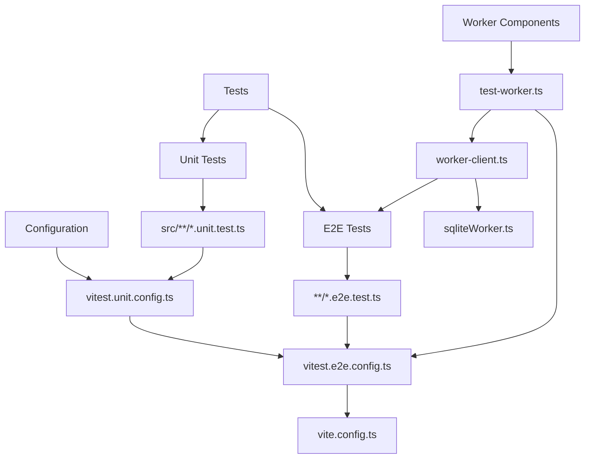
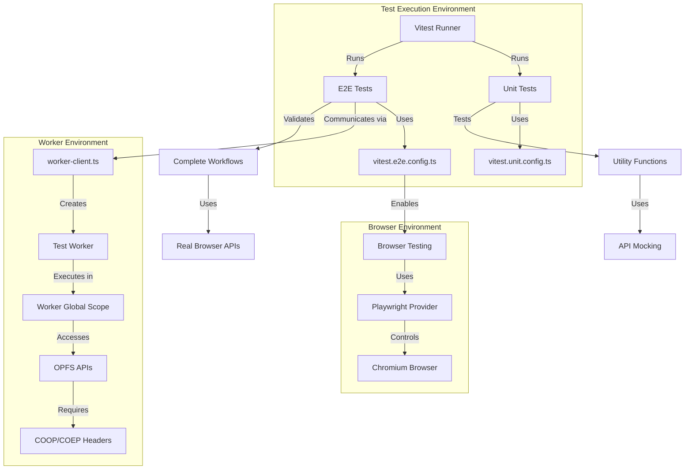
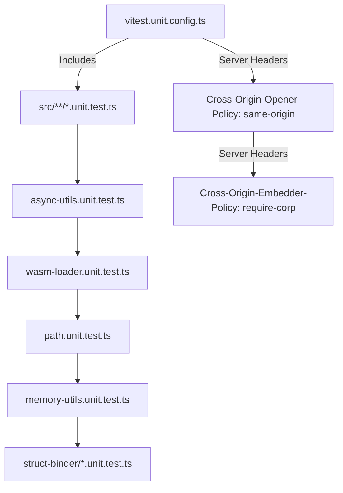
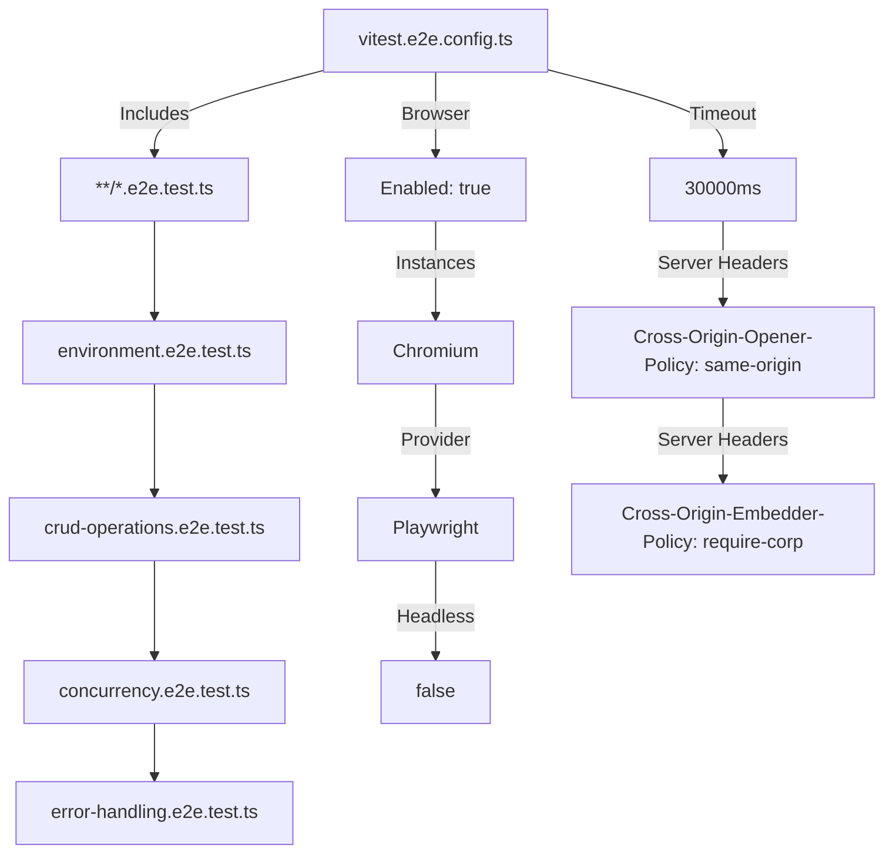
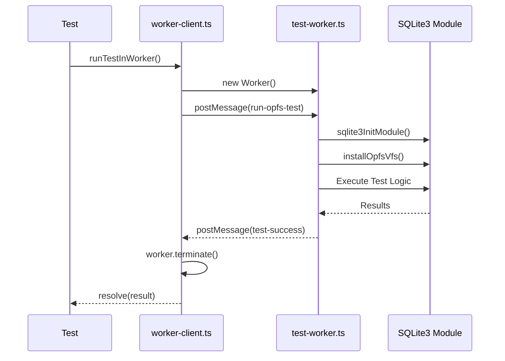
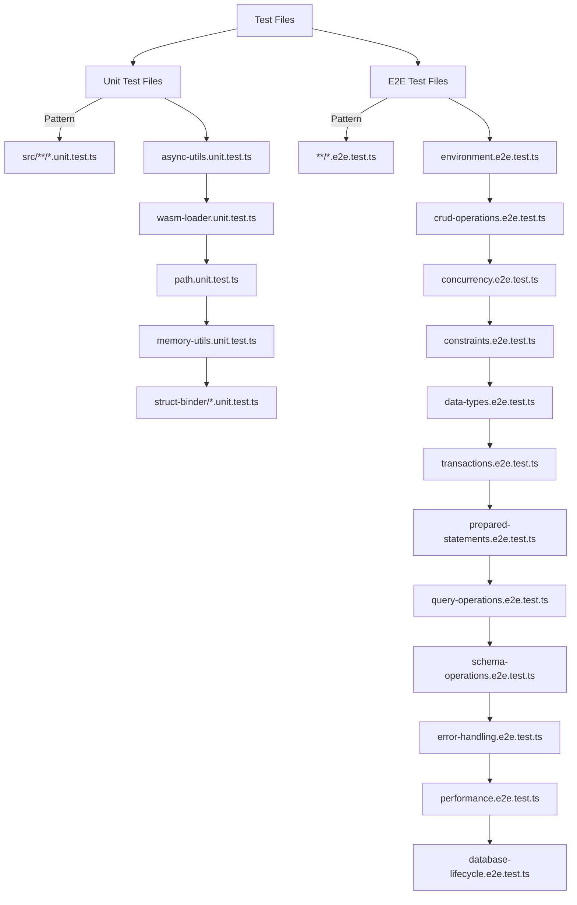

# Testing Configuration

<cite>
**Referenced Files in This Document**   
- [vitest.unit.config.ts](file://vitest.unit.config.ts)
- [vitest.e2e.config.ts](file://vitest.e2e.config.ts)
- [package.json](file://package.json)
- [vite.config.ts](file://vite.config.ts)
- [environment.e2e.test.ts](file://tests/e2e/environment.e2e.test.ts)
- [test-worker.ts](file://tests/e2e/test-worker.ts)
- [worker-client.ts](file://tests/e2e/worker-client.ts)
- [async-utils.unit.test.ts](file://src/jswasm/utils/async-utils/async-utils.unit.test.ts)
- [wasm-loader.unit.test.ts](file://src/jswasm/utils/wasm-loader/wasm-loader.unit.test.ts)
- [environment-validation.mjs](file://src/jswasm/vfs/opfs/installer/core/environment-validation.mjs)
- [sanity-check.mjs](file://src/jswasm/vfs/opfs/installer/utils/sanity-check.mjs)
- [crud-operations.e2e.test.ts](file://tests/e2e/crud-operations.e2e.test.ts)
- [sqliteWorker.ts](file://src/sqliteWorker.ts)
</cite>

## Table of Contents

1. [Introduction](#introduction)
2. [Project Structure](#project-structure)
3. [Core Components](#core-components)
4. [Architecture Overview](#architecture-overview)
5. [Detailed Component Analysis](#detailed-component-analysis)
6. [Dependency Analysis](#dependency-analysis)
7. [Performance Considerations](#performance-considerations)
8. [Troubleshooting Guide](#troubleshooting-guide)
9. [Conclusion](#conclusion)

## Introduction

This document provides comprehensive guidance on the testing configuration for web-sqlite-v2 using Vitest. It covers the distinct configurations for unit and end-to-end tests, environment setup for browser-like testing, handling of Web Workers and OPFS APIs in test environments, coverage reporting, test file inclusion patterns, and best practices for writing effective tests. The documentation also addresses common testing issues and performance optimization strategies for efficient test execution during development.

## Project Structure



**Diagram sources**

- [vitest.unit.config.ts](file://vitest.unit.config.ts#L23)
- [vitest.e2e.config.ts](file://vitest.e2e.config.ts#L17)
- [tests/e2e/test-worker.ts](file://tests/e2e/test-worker.ts)
- [tests/e2e/worker-client.ts](file://tests/e2e/worker-client.ts)

**Section sources**

- [vitest.unit.config.ts](file://vitest.unit.config.ts)
- [vitest.e2e.config.ts](file://vitest.e2e.config.ts)
- [package.json](file://package.json)

## Core Components

The web-sqlite-v2 testing framework is built around two primary configuration files: `vitest.unit.config.ts` for unit testing and `vitest.e2e.config.ts` for end-to-end testing. These configurations support different testing strategies and environments, with unit tests focusing on isolated component verification and E2E tests validating complete workflows in browser-like environments.

The testing architecture leverages Web Workers to simulate the actual runtime environment where OPFS (Origin Private File System) APIs are available, as these APIs require worker contexts. The `test-worker.ts` and `worker-client.ts` files form a critical communication layer that enables tests to execute within worker contexts while maintaining a clean interface for test authors.

**Section sources**

- [vitest.unit.config.ts](file://vitest.unit.config.ts)
- [vitest.e2e.config.ts](file://vitest.e2e.config.ts)
- [tests/e2e/test-worker.ts](file://tests/e2e/test-worker.ts)
- [tests/e2e/worker-client.ts](file://tests/e2e/worker-client.ts)

## Architecture Overview



**Diagram sources**

- [vitest.unit.config.ts](file://vitest.unit.config.ts)
- [vitest.e2e.config.ts](file://vitest.e2e.config.ts#L22-L31)
- [tests/e2e/worker-client.ts](file://tests/e2e/worker-client.ts)
- [tests/e2e/test-worker.ts](file://tests/e2e/test-worker.ts)

## Detailed Component Analysis

### Unit Testing Configuration

The unit testing configuration in `vitest.unit.config.ts` is designed for isolated testing of individual components and utility functions. It includes all files matching the pattern `src/**/*.unit.test.ts`, ensuring comprehensive coverage of utility modules, helper functions, and isolated components.

The configuration currently does not enable browser testing, focusing instead on fast, isolated unit tests that can run without the overhead of browser environments. This separation allows developers to quickly verify the correctness of individual functions and modules during development.



**Diagram sources**

- [vitest.unit.config.ts](file://vitest.unit.config.ts#L23)
- [src/jswasm/utils/async-utils/async-utils.unit.test.ts](file://src/jswasm/utils/async-utils/async-utils.unit.test.ts)
- [src/jswasm/utils/wasm-loader/wasm-loader.unit.test.ts](file://src/jswasm/utils/wasm-loader/wasm-loader.unit.test.ts)

**Section sources**

- [vitest.unit.config.ts](file://vitest.unit.config.ts)
- [src/jswasm/utils/async-utils/async-utils.unit.test.ts](file://src/jswasm/utils/async-utils/async-utils.unit.test.ts)
- [src/jswasm/utils/wasm-loader/wasm-loader.unit.test.ts](file://src/jswasm/utils/wasm-loader/wasm-loader.unit.test.ts)

### End-to-End Testing Configuration

The end-to-end testing configuration in `vitest.e2e.config.ts` is designed to validate complete workflows in browser-like environments. It includes all files matching the pattern `**/*.e2e.test.ts`, capturing both OPFS-specific tests and broader browser integration tests.

This configuration enables browser testing through the Playwright provider, specifically targeting Chromium in non-headless mode to allow for visual debugging. The extended test timeout of 30 seconds accommodates the asynchronous nature of OPFS operations and database interactions.



**Diagram sources**

- [vitest.e2e.config.ts](file://vitest.e2e.config.ts#L17)
- [tests/e2e/environment.e2e.test.ts](file://tests/e2e/environment.e2e.test.ts)
- [tests/e2e/crud-operations.e2e.test.ts](file://tests/e2e/crud-operations.e2e.test.ts)

**Section sources**

- [vitest.e2e.config.ts](file://vitest.e2e.config.ts)
- [tests/e2e/environment.e2e.test.ts](file://tests/e2e/environment.e2e.test.ts)
- [tests/e2e/crud-operations.e2e.test.ts](file://tests/e2e/crud-operations.e2e.test.ts)

### Web Worker and OPFS Testing Environment

The testing framework handles Web Workers and OPFS APIs through a sophisticated worker-based testing architecture. Since OPFS APIs are only available in worker contexts and require specific security headers, the framework uses dedicated worker scripts to execute tests in the appropriate environment.

The `environment-validation.mjs` module validates that the current environment supports OPFS by checking for SharedArrayBuffer, Atomics, and the necessary OPFS APIs. This validation ensures that tests only proceed when the required capabilities are available.

```mermaid
flowchart TD
TestExecution[Test Execution]
--> |Initiated from| MainThread[Main Thread]
--> |Creates| Worker[Web Worker]
--> |Executes in| WorkerGlobalScope[WorkerGlobalScope]
WorkerGlobalScope
--> |Requires| SharedArrayBuffer[SharedArrayBuffer]
--> |Requires| Atomics[Atomics]
--> |Requires| OPFSAPIs[OPFS APIs]
OPFSAPIs
--> FileSystemHandle[FileSystemHandle]
--> FileSystemDirectoryHandle[FileSystemDirectoryHandle]
--> FileSystemFileHandle[FileSystemFileHandle]
--> CreateSyncAccessHandle[createSyncAccessHandle]
--> GetDirectory[getDirectory]
Validation[Environment Validation]
--> |Checks| COOPCOEPHeaders[COOP/COEP Headers]
--> |Validates| OPFSSupport[thisThreadHasOPFS()]
--> |Ensures| WorkerContext[Worker Context]
```

**Diagram sources**

- [src/jswasm/vfs/opfs/installer/core/environment-validation.mjs](file://src/jswasm/vfs/opfs/installer/core/environment-validation.mjs)
- [tests/e2e/test-worker.ts](file://tests/e2e/test-worker.ts)
- [tests/e2e/worker-client.ts](file://tests/e2e/worker-client.ts)

**Section sources**

- [src/jswasm/vfs/opfs/installer/core/environment-validation.mjs](file://src/jswasm/vfs/opfs/installer/core/environment-validation.mjs)
- [tests/e2e/test-worker.ts](file://tests/e2e/test-worker.ts)

### Test Communication Architecture

The framework employs a robust message-passing architecture between the test runner and worker environments. The `worker-client.ts` file provides a clean interface for tests to communicate with workers, abstracting away the complexity of worker management and message passing.

This architecture uses a promise-based approach to handle asynchronous communication, ensuring that tests can await the results of operations executed in worker contexts. The client automatically terminates workers after test completion to prevent resource leaks.



**Diagram sources**

- [tests/e2e/worker-client.ts](file://tests/e2e/worker-client.ts#L1)
- [tests/e2e/test-worker.ts](file://tests/e2e/test-worker.ts#L6)
- [src/sqliteWorker.ts](file://src/sqliteWorker.ts)

**Section sources**

- [tests/e2e/worker-client.ts](file://tests/e2e/worker-client.ts)
- [tests/e2e/test-worker.ts](file://tests/e2e/test-worker.ts)
- [src/sqliteWorker.ts](file://src/sqliteWorker.ts)

### Coverage and Test Patterns

The testing framework follows a clear pattern for test file organization and inclusion. Unit tests are colocated with their corresponding source files using the `.unit.test.ts` suffix, while end-to-end tests are organized in the `tests/e2e/` directory with the `.e2e.test.ts` suffix.

This separation allows for targeted test execution and reporting. The configuration files explicitly define the inclusion patterns, ensuring that the appropriate tests are run for each testing scenario.



**Diagram sources**

- [vitest.unit.config.ts](file://vitest.unit.config.ts#L23)
- [vitest.e2e.config.ts](file://vitest.e2e.config.ts#L17)
- [src/jswasm/utils/async-utils/async-utils.unit.test.ts](file://src/jswasm/utils/async-utils/async-utils.unit.test.ts)
- [tests/e2e/crud-operations.e2e.test.ts](file://tests/e2e/crud-operations.e2e.test.ts)

**Section sources**

- [vitest.unit.config.ts](file://vitest.unit.config.ts)
- [vitest.e2e.config.ts](file://vitest.e2e.config.ts)
- [src/jswasm/utils/async-utils/async-utils.unit.test.ts](file://src/jswasm/utils/async-utils/async-utils.unit.test.ts)
- [tests/e2e/crud-operations.e2e.test.ts](file://tests/e2e/crud-operations.e2e.test.ts)

## Dependency Analysis

```mermaid
graph TD
UnitConfig --> Vitest
E2EConfig --> Vitest
E2EConfig --> Playwright
E2EConfig --> BrowserProvider[@vitest/browser-playwright]
TestWorker --> SQLite3Module[@wuchuheng/web-sqlite]
TestWorker --> OPFSInstaller[createInstallOpfsVfsContext]
WorkerClient --> TestWorker
package.json --> Scripts
Scripts --> test:unit
Scripts --> test:e2e
Scripts --> test
test:unit --> vitest run --config vitest.unit.config.ts
test:e2e --> vitest run --config vitest.e2e.config.ts
test --> test:unit ; test:e2e
```

**Diagram sources**

- [vitest.unit.config.ts](file://vitest.unit.config.ts)
- [vitest.e2e.config.ts](file://vitest.e2e.config.ts)
- [package.json](file://package.json#L17-L18)
- [tests/e2e/test-worker.ts](file://tests/e2e/test-worker.ts)
- [tests/e2e/worker-client.ts](file://tests/e2e/worker-client.ts)

**Section sources**

- [vitest.unit.config.ts](file://vitest.unit.config.ts)
- [vitest.e2e.config.ts](file://vitest.e2e.config.ts)
- [package.json](file://package.json)
- [tests/e2e/test-worker.ts](file://tests/e2e/test-worker.ts)
- [tests/e2e/worker-client.ts](file://tests/e2e/worker-client.ts)

## Performance Considerations

The testing configuration includes several performance optimizations to ensure efficient test execution during development. The unit tests are designed to run quickly in isolated environments without the overhead of browser contexts, enabling rapid feedback during development.

For end-to-end tests, the configuration balances thoroughness with practical execution time by using a 30-second timeout that accommodates most OPFS operations while preventing tests from hanging indefinitely. The use of non-headless Chromium allows for visual debugging but can be modified for CI/CD environments where headless execution is preferred.

The framework's modular design allows developers to run specific test suites based on their needs, reducing overall execution time. Unit tests can be run independently for quick verification of isolated components, while E2E tests can be executed for comprehensive validation of complete workflows.

**Section sources**

- [vitest.unit.config.ts](file://vitest.unit.config.ts)
- [vitest.e2e.config.ts](file://vitest.e2e.config.ts)

## Troubleshooting Guide

Common testing issues in the web-sqlite-v2 framework typically relate to environment setup, particularly around OPFS API availability and security headers. The most frequent issues include:

1. **Missing COOP/COEP headers**: The server must emit Cross-Origin-Opener-Policy and Cross-Origin-Embedder-Policy headers to enable SharedArrayBuffer and OPFS functionality.

2. **Worker context requirements**: OPFS APIs are only available in worker contexts, so tests must be executed within Web Workers.

3. **Race conditions in worker tests**: Proper cleanup and termination of workers is essential to prevent race conditions between tests.

4. **Memory leaks**: Ensure workers are properly terminated after test completion to prevent memory accumulation.

5. **Timeout issues**: OPFS operations can be slow, so appropriate timeout values must be set to accommodate these operations.

The framework addresses these issues through its configuration and architecture, with explicit header settings in both configuration files and proper worker management in the test client.

**Section sources**

- [vitest.unit.config.ts](file://vitest.unit.config.ts#L16-L19)
- [vitest.e2e.config.ts](file://vitest.e2e.config.ts#L42-L48)
- [src/jswasm/vfs/opfs/installer/core/environment-validation.mjs](file://src/jswasm/vfs/opfs/installer/core/environment-validation.mjs)
- [tests/e2e/worker-client.ts](file://tests/e2e/worker-client.ts#L14)

## Conclusion

The web-sqlite-v2 testing framework provides a comprehensive and well-structured approach to testing SQLite3 WebAssembly functionality with OPFS support. By separating unit and end-to-end tests, the framework enables both rapid isolated testing and thorough integration validation.

The architecture effectively handles the complexities of Web Workers and OPFS APIs through a dedicated worker-based testing environment with proper message passing and resource management. The configuration files are thoughtfully designed to support both development and CI/CD workflows, with appropriate timeouts, headers, and test inclusion patterns.

Developers can leverage this framework to write effective tests for WASM interop, worker communication, and database operations, with clear patterns for mocking browser APIs and setting up test databases. The troubleshooting guidance and performance considerations ensure that tests are reliable and efficient throughout the development lifecycle.
