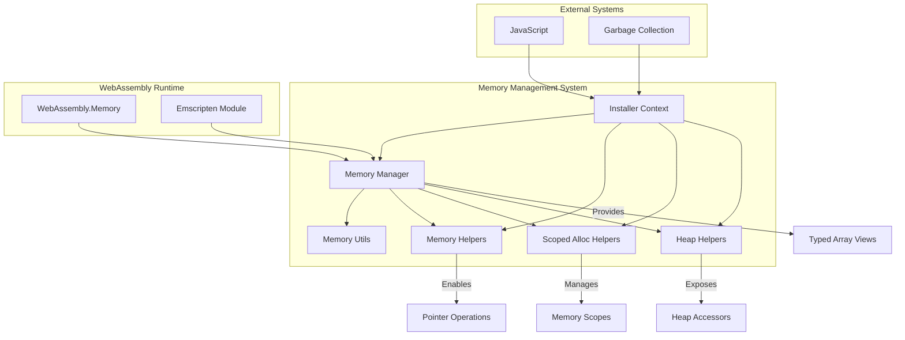
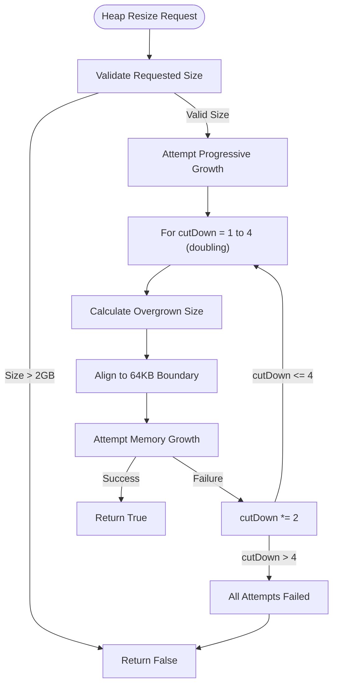
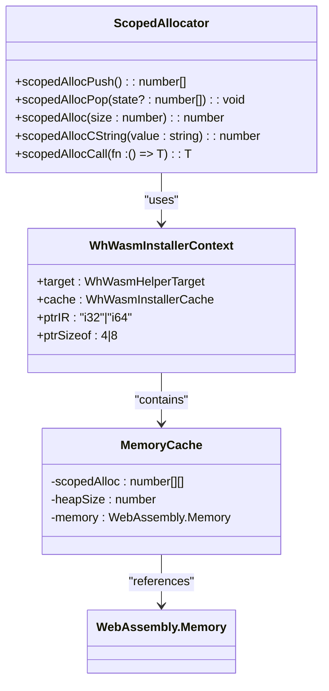
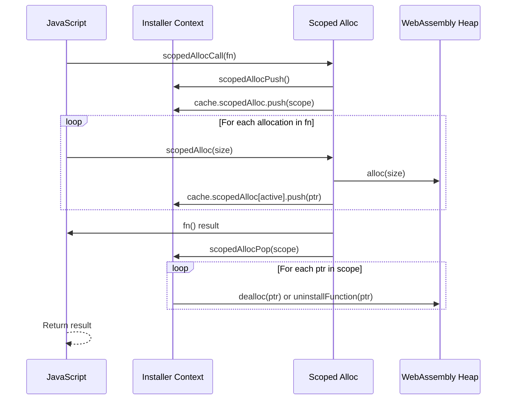
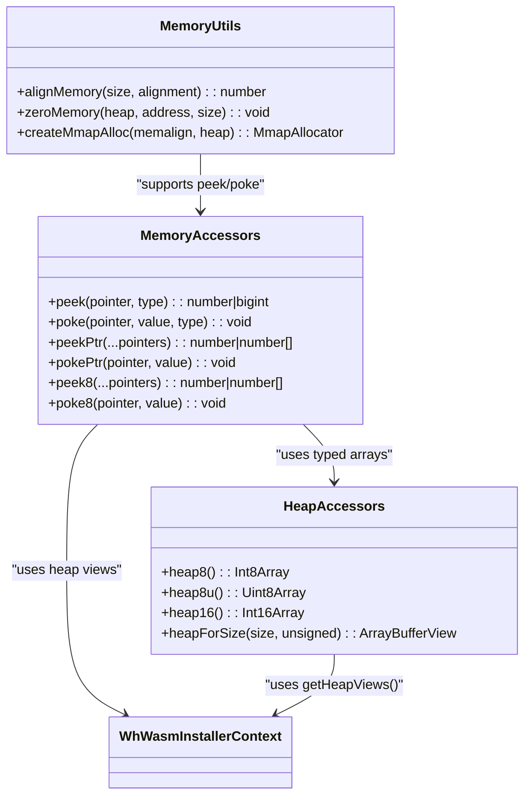
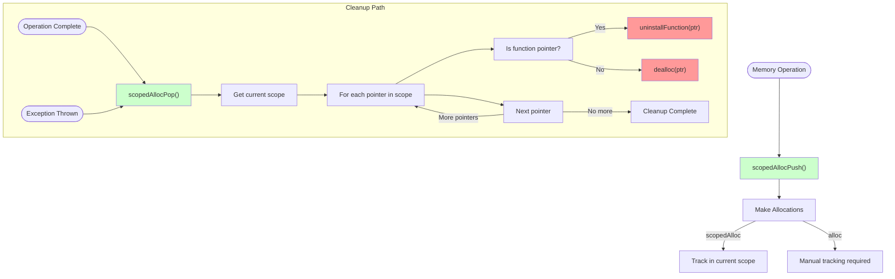
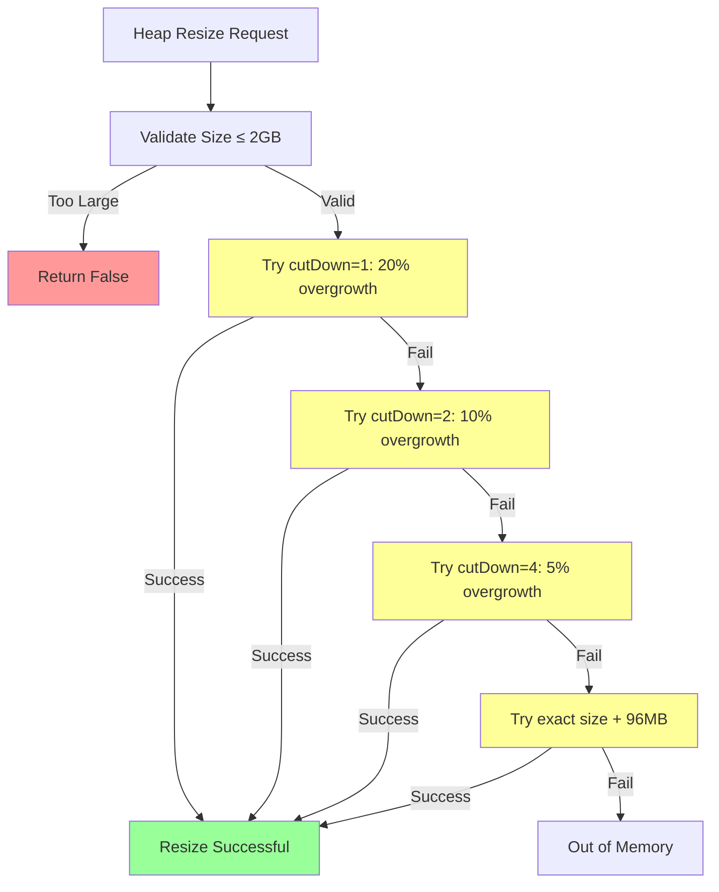
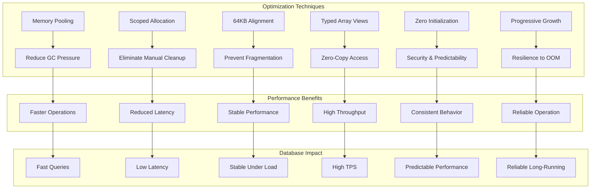

# Memory Management

<cite>
**Referenced Files in This Document**   
- [memory-manager.mjs](file://src/jswasm/runtime/memory-manager.mjs)
- [memory-utils.ts](file://src/jswasm/utils/memory-utils/memory-utils.ts)
- [memory-helpers.ts](file://src/jswasm/utils/whwasm/memory-helpers/memory-helpers.ts)
- [scoped-alloc-helpers.ts](file://src/jswasm/utils/whwasm/scoped-alloc-helpers/scoped-alloc-helpers.ts)
- [heap-helpers.ts](file://src/jswasm/utils/whwasm/heap-helpers/heap-helpers.ts)
- [installer-context.ts](file://src/jswasm/utils/whwasm/installer-context/installer-context.ts)
</cite>

## Table of Contents
1. [Introduction](#introduction)
2. [Memory Manager Architecture](#memory-manager-architecture)
3. [Heap Allocation Strategies](#heap-allocation-strategies)
4. [Memory Pooling and Reuse](#memory-pooling-and-reuse)
5. [Garbage Collection Integration](#garbage-collection-integration)
6. [Low-Level Memory Operations](#low-level-memory-operations)
7. [WASM-JavaScript Memory Relationship](#wasm-javascript-memory-relationship)
8. [Memory Leak Prevention](#memory-leak-prevention)
9. [Memory Fragmentation and OOM Handling](#memory-fragmentation-and-oom-handling)
10. [Performance Optimization](#performance-optimization)

## Introduction
The web-sqlite-v2 project implements a sophisticated memory management system designed to optimize WebAssembly heap operations for database workloads. This documentation details the architecture and implementation of the memory management subsystem, focusing on the coordination between the memory-manager module, memory-utils, and memory-helpers components. The system provides deterministic memory cleanup, efficient buffer handling, and robust protection against memory leaks and fragmentation in long-running applications. By leveraging WebAssembly's linear memory model and implementing advanced allocation strategies, the system ensures optimal performance for high-throughput database operations while maintaining compatibility with JavaScript's garbage collection.

## Memory Manager Architecture

The memory management system in web-sqlite-v2 is built around a modular architecture that separates concerns between memory initialization, heap management, and low-level operations. The core component is the memory-manager module, which coordinates WebAssembly memory operations and provides the foundation for all memory-related functionality.



**Diagram sources**
- [memory-manager.mjs](file://src/jswasm/runtime/memory-manager.mjs#L1-L150)
- [installer-context.ts](file://src/jswasm/utils/whwasm/installer-context/installer-context.ts#L1-L237)

**Section sources**
- [memory-manager.mjs](file://src/jswasm/runtime/memory-manager.mjs#L1-L173)
- [installer-context.ts](file://src/jswasm/utils/whwasm/installer-context/installer-context.ts#L1-L237)

## Heap Allocation Strategies

The heap allocation system in web-sqlite-v2 implements a multi-layered approach to memory management, combining Emscripten's standard allocation with custom strategies optimized for database operations. The system uses a progressive growth algorithm that attempts multiple strategies before failing, ensuring maximum resilience in memory-constrained environments.



The `createResizeHeapFunction` implements Emscripten's heap growth strategy with multiple attempts, starting with a conservative overgrowth factor and progressively increasing it. This approach balances memory efficiency with the need for rapid allocation in high-throughput scenarios. The system aligns all allocations to 64KB page boundaries, which is optimal for WebAssembly's memory management and helps prevent fragmentation.

**Section sources**
- [memory-manager.mjs](file://src/jswasm/runtime/memory-manager.mjs#L76-L121)
- [memory-utils.ts](file://src/jswasm/utils/memory-utils/memory-utils.ts#L63-L68)

## Memory Pooling and Reuse

The memory pooling system in web-sqlite-v2 leverages scoped allocation patterns to enable efficient memory reuse and minimize allocation overhead. The scoped-alloc-helpers module provides a stack-based memory management system that automatically cleans up allocations when they go out of scope, preventing memory leaks and reducing garbage collection pressure.



The scoped allocation system maintains a stack of memory scopes in the installer context's cache. When `scopedAllocPush` is called, a new scope is created and added to the stack. All subsequent allocations made with `scopedAlloc` are tracked in the current scope. When `scopedAllocPop` is called, all allocations in the scope are automatically freed, with special handling for function pointers that require uninstallation. This pattern enables RAII-style memory management in JavaScript, providing deterministic cleanup without relying on garbage collection.

**Diagram sources**
- [scoped-alloc-helpers.ts](file://src/jswasm/utils/whwasm/scoped-alloc-helpers/scoped-alloc-helpers.ts#L102-L147)
- [installer-context.ts](file://src/jswasm/utils/whwasm/installer-context/installer-context.ts#L58-L66)

**Section sources**
- [scoped-alloc-helpers.ts](file://src/jswasm/utils/whwasm/scoped-alloc-helpers/scoped-alloc-helpers.ts#L1-L207)
- [memory-utils.ts](file://src/jswasm/utils/memory-utils/memory-utils.ts#L76-L91)

## Garbage Collection Integration

The garbage collection integration in web-sqlite-v2 is designed to work seamlessly with JavaScript's garbage collector while maintaining deterministic memory management for WebAssembly allocations. The system uses a hybrid approach that combines manual memory management for WASM heap operations with automatic cleanup through scoped allocation patterns.



The integration is achieved through the `scopedAllocCall` function, which wraps any function call with automatic memory management. When a function is executed within a `scopedAllocCall`, all memory allocations made during its execution are automatically cleaned up when the function completes, regardless of whether it returns normally or throws an exception. This try-finally pattern ensures that memory is always freed, even in error conditions, preventing leaks in long-running applications.

**Diagram sources**
- [scoped-alloc-helpers.ts](file://src/jswasm/utils/whwasm/scoped-alloc-helpers/scoped-alloc-helpers.ts#L170-L177)
- [memory-manager.mjs](file://src/jswasm/runtime/memory-manager.mjs#L24-L39)

**Section sources**
- [scoped-alloc-helpers.ts](file://src/jswasm/utils/whwasm/scoped-alloc-helpers/scoped-alloc-helpers.ts#L170-L177)
- [memory-manager.mjs](file://src/jswasm/runtime/memory-manager.mjs#L24-L39)

## Low-Level Memory Operations

The low-level memory operations in web-sqlite-v2 are facilitated by the memory-helpers and heap-helpers modules, which provide a comprehensive set of utilities for pointer arithmetic, buffer allocation, and memory access. These helpers abstract the complexity of direct memory manipulation while maintaining high performance.



The memory-helpers module provides type-safe peek and poke operations for reading and writing memory at specific addresses with various data types (i8, i16, i32, i64, f32, f64). These operations are optimized for performance and include bounds checking through the WebAssembly memory model. The heap-helpers module provides convenient accessors for the various typed array views of the WASM heap, eliminating the need to repeatedly create these views.

**Diagram sources**
- [memory-helpers.ts](file://src/jswasm/utils/whwasm/memory-helpers/memory-helpers.ts#L200-L306)
- [heap-helpers.ts](file://src/jswasm/utils/whwasm/heap-helpers/heap-helpers.ts#L72-L124)
- [memory-utils.ts](file://src/jswasm/utils/memory-utils/memory-utils.ts#L47-L56)

**Section sources**
- [memory-helpers.ts](file://src/jswasm/utils/whwasm/memory-helpers/memory-helpers.ts#L1-L307)
- [heap-helpers.ts](file://src/jswasm/utils/whwasm/heap-helpers/heap-helpers.ts#L1-L125)
- [memory-utils.ts](file://src/jswasm/utils/memory-utils/memory-utils.ts#L1-L92)

## WASM-JavaScript Memory Relationship

The relationship between WASM and JavaScript memory in web-sqlite-v2 is carefully managed to ensure efficient data exchange while maintaining memory safety. The system uses shared memory views to enable zero-copy data transfer between the two environments, minimizing serialization overhead.

```mermaid
graph LR
subgraph "JavaScript Environment"
JSHeap[JavaScript Heap]
JSObjects[JavaScript Objects]
end
subgraph "WebAssembly Environment"
WasmMemory[WebAssembly.Memory]
WasmHeap[WASM Linear Memory]
TypedArrays[Typed Arrays]
end
WasmMemory < --> |Shared Buffer| TypedArrays
TypedArrays --> |Views| WasmHeap
JSObjects --> |Conversion| TypedArrays
TypedArrays --> |Conversion| JSObjects
JSHeap --> |References| TypedArrays
style WasmMemory fill:#f9f,stroke:#333
style TypedArrays fill:#bbf,stroke:#333
style JSHeap fill:#9f9,stroke:#333
```

The system maintains a single WebAssembly.Memory instance that is shared between the WASM module and JavaScript. This memory is exposed through multiple typed array views (Int8Array, Uint8Array, Int16Array, etc.) that provide different interpretations of the same underlying buffer. When data needs to be transferred between JavaScript and WASM, it is copied through these views rather than being serialized, which significantly improves performance for large data operations.

**Diagram sources**
- [memory-manager.mjs](file://src/jswasm/runtime/memory-manager.mjs#L24-L39)
- [installer-context.ts](file://src/jswasm/utils/whwasm/installer-context/installer-context.ts#L206-L234)

**Section sources**
- [memory-manager.mjs](file://src/jswasm/runtime/memory-manager.mjs#L24-L39)
- [installer-context.ts](file://src/jswasm/utils/whwasm/installer-context/installer-context.ts#L206-L234)

## Memory Leak Prevention

The memory leak prevention system in web-sqlite-v2 is built on several complementary mechanisms that work together to ensure deterministic cleanup of all allocated memory. The primary defense is the scoped allocation system, which automatically frees memory when it goes out of scope.



The system prevents memory leaks through several mechanisms:
1. **Scoped allocation**: All memory allocated within a scope is automatically freed when the scope is popped
2. **Deterministic cleanup**: The try-finally pattern in `scopedAllocCall` ensures cleanup even on exceptions
3. **Function pointer management**: Special handling for function pointers that require uninstallation
4. **Zero initialization**: All allocated memory is zeroed to prevent information leaks
5. **Reference tracking**: The installer context maintains references to all active allocations

**Section sources**
- [scoped-alloc-helpers.ts](file://src/jswasm/utils/whwasm/scoped-alloc-helpers/scoped-alloc-helpers.ts#L113-L127)
- [memory-utils.ts](file://src/jswasm/utils/memory-utils/memory-utils.ts#L47-L56)

## Memory Fragmentation and OOM Handling

The system addresses memory fragmentation and out-of-memory (OOM) conditions through a combination of allocation strategies, memory alignment, and graceful degradation. The memory-manager implements a sophisticated heap resizing algorithm that attempts multiple growth strategies before failing.



The system handles fragmentation by aligning all allocations to 64KB boundaries, which matches WebAssembly's page size and reduces internal fragmentation. The progressive growth strategy helps mitigate external fragmentation by attempting different overgrowth factors. When OOM conditions occur, the system fails gracefully rather than crashing, allowing the application to handle the error and potentially free up memory.

**Section sources**
- [memory-manager.mjs](file://src/jswasm/runtime/memory-manager.mjs#L95-L120)
- [memory-utils.ts](file://src/jswasm/utils/memory-utils/memory-utils.ts#L7-L7)

## Performance Optimization

The performance optimization strategies in web-sqlite-v2 focus on minimizing memory allocation overhead and maximizing data access speed for database operations. The system employs several techniques to achieve high throughput:



Key optimization techniques include:
- **Memory pooling**: Reusing allocations through scoped patterns reduces allocation frequency
- **Zero-copy data access**: Direct access to typed array views eliminates serialization overhead
- **Predictable allocation patterns**: 64KB alignment creates consistent memory layouts
- **Batched operations**: Multiple allocations are handled in a single scope
- **Lazy initialization**: Memory views are created on-demand and cached
- **Efficient growth strategy**: Progressive growth attempts balance memory usage with success rate

These optimizations are particularly beneficial for database operations, where high-throughput queries and transactions require rapid memory allocation and deallocation. The system is designed to maintain consistent performance even under heavy load, making it suitable for production database applications.

**Section sources**
- [memory-manager.mjs](file://src/jswasm/runtime/memory-manager.mjs#L1-L173)
- [memory-utils.ts](file://src/jswasm/utils/memory-utils/memory-utils.ts#L1-L92)
- [scoped-alloc-helpers.ts](file://src/jswasm/utils/whwasm/scoped-alloc-helpers/scoped-alloc-helpers.ts#L1-L207)