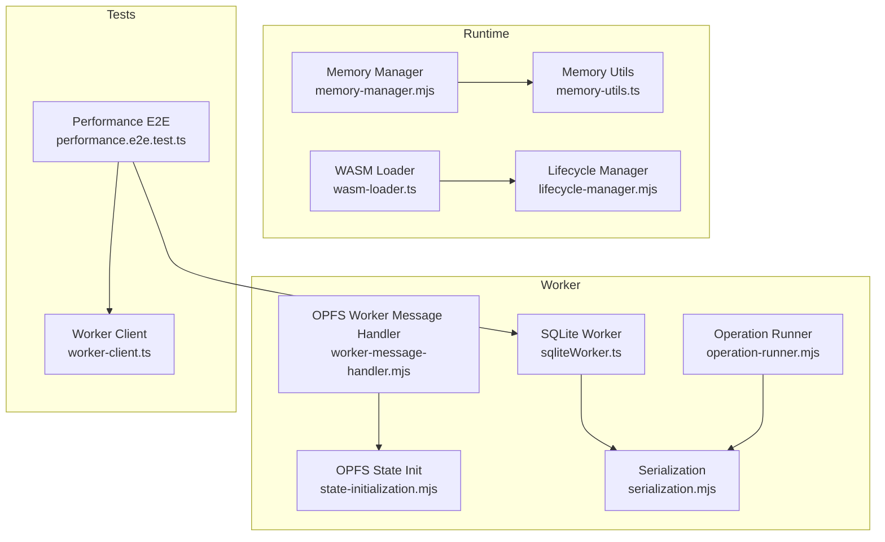
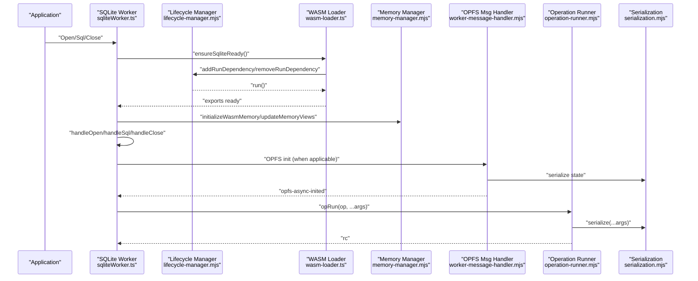
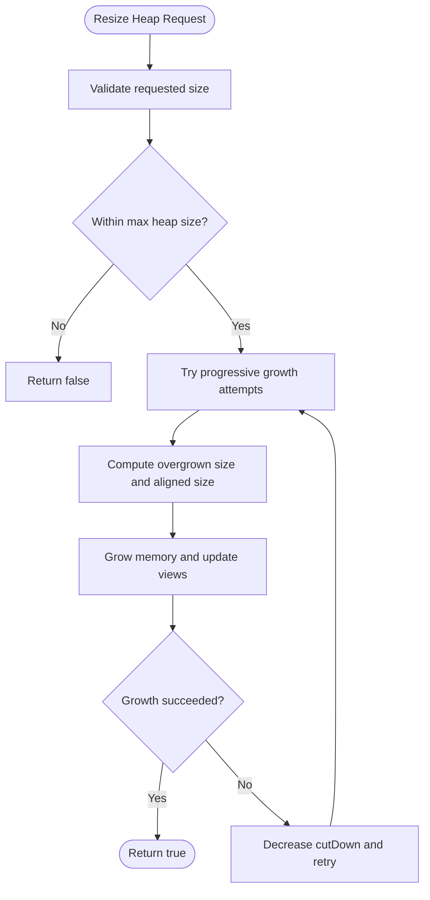
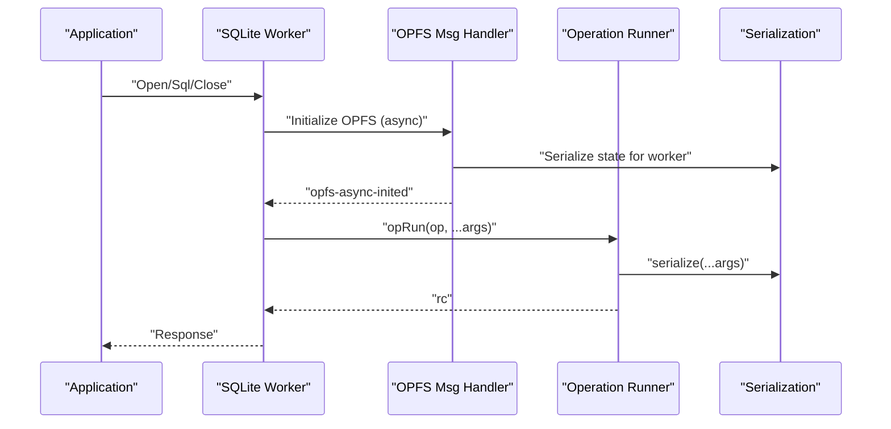
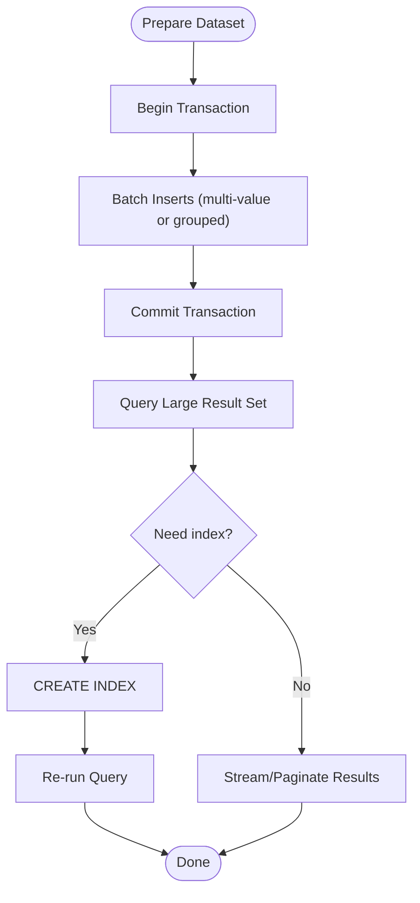
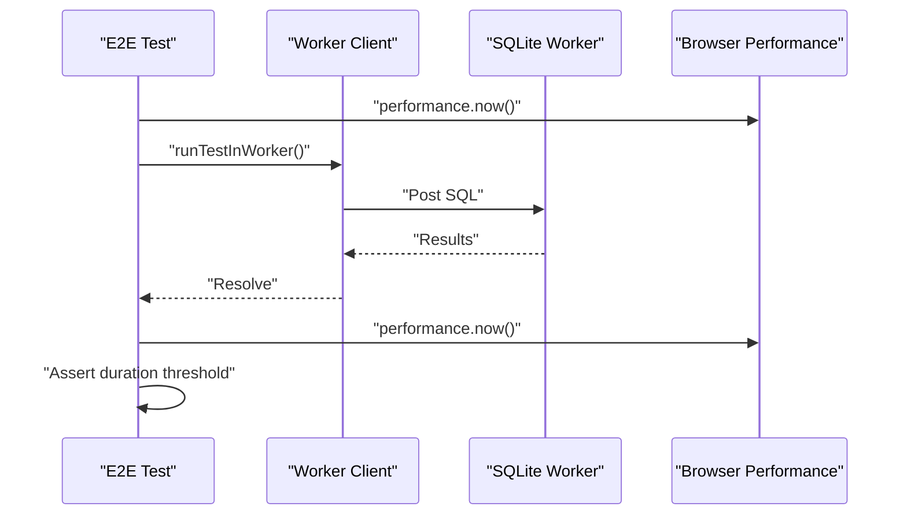
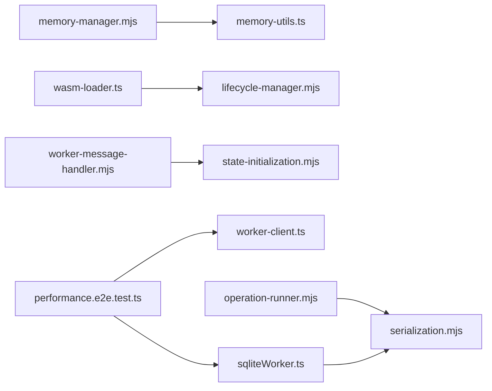

# Performance Optimization

<cite>
**Referenced Files in This Document**
- [memory-manager.mjs](file://src/jswasm/runtime/memory-manager.mjs)
- [memory-utils.ts](file://src/jswasm/utils/memory-utils/memory-utils.ts)
- [sqliteWorker.ts](file://src/sqliteWorker.ts)
- [lifecycle-manager.mjs](file://src/jswasm/runtime/lifecycle-manager.mjs)
- [wasm-loader.ts](file://src/jswasm/utils/wasm-loader/wasm-loader.ts)
- [state-initialization.mjs](file://src/jswasm/vfs/opfs/installer/core/state-initialization.mjs)
- [serialization.mjs](file://src/jswasm/vfs/opfs/installer/core/serialization.mjs)
- [worker-message-handler.mjs](file://src/jswasm/vfs/opfs/installer/utils/worker-message-handler.mjs)
- [operation-runner.mjs](file://src/jswasm/vfs/opfs/installer/core/operation-runner.mjs)
- [performance.e2e.test.ts](file://tests/e2e/performance.e2e.test.ts)
- [worker-client.ts](file://tests/e2e/worker-client.ts)
- [execution.mjs](file://src/jswasm/api/oo1-db/db-statement/execution.mjs)
</cite>

## Table of Contents

1. [Introduction](#introduction)
2. [Project Structure](#project-structure)
3. [Core Components](#core-components)
4. [Architecture Overview](#architecture-overview)
5. [Detailed Component Analysis](#detailed-component-analysis)
6. [Dependency Analysis](#dependency-analysis)
7. [Performance Considerations](#performance-considerations)
8. [Troubleshooting Guide](#troubleshooting-guide)
9. [Conclusion](#conclusion)
10. [Appendices](#appendices)

## Introduction

This document focuses on performance optimization in web-sqlite-v2, covering memory management strategies for WebAssembly (WASM) heaps, worker optimization techniques for asynchronous operations, and guidance for optimizing database operations on large datasets. It also provides practical monitoring approaches and concrete examples of performance improvements drawn from the repository’s tests and implementation.

## Project Structure

The performance-critical parts of the codebase are organized around:

- Runtime memory management for WASM heap operations
- Worker orchestration for database operations
- OPFS async worker and shared buffer communication
- WASM loader and lifecycle management
- End-to-end performance tests validating bulk operations and large result sets

**Diagram sources**

- [memory-manager.mjs](file://src/jswasm/runtime/memory-manager.mjs#L1-L173)
- [memory-utils.ts](file://src/jswasm/utils/memory-utils/memory-utils.ts#L1-L92)
- [lifecycle-manager.mjs](file://src/jswasm/runtime/lifecycle-manager.mjs#L1-L268)
- [wasm-loader.ts](file://src/jswasm/utils/wasm-loader/wasm-loader.ts#L1-L210)
- [sqliteWorker.ts](file://src/sqliteWorker.ts#L1-L243)
- [worker-message-handler.mjs](file://src/jswasm/vfs/opfs/installer/utils/worker-message-handler.mjs#L1-L126)
- [state-initialization.mjs](file://src/jswasm/vfs/opfs/installer/core/state-initialization.mjs#L1-L127)
- [serialization.mjs](file://src/jswasm/vfs/opfs/installer/core/serialization.mjs#L1-L88)
- [operation-runner.mjs](file://src/jswasm/vfs/opfs/installer/core/operation-runner.mjs#L1-L84)
- [performance.e2e.test.ts](file://tests/e2e/performance.e2e.test.ts#L1-L119)
- [worker-client.ts](file://tests/e2e/worker-client.ts#L1-L34)

**Section sources**

- [memory-manager.mjs](file://src/jswasm/runtime/memory-manager.mjs#L1-L173)
- [sqliteWorker.ts](file://src/sqliteWorker.ts#L1-L243)
- [state-initialization.mjs](file://src/jswasm/vfs/opfs/installer/core/state-initialization.mjs#L1-L127)

## Core Components

- Memory Manager: Manages typed array heap views, heap growth, and Emscripten-compatible resize behavior.
- Memory Utils: Provides alignment, zeroing, and mmap-like allocation helpers.
- WASM Loader: Handles instantiation, streaming fallback, and run dependency tracking.
- Lifecycle Manager: Coordinates preRun/initRuntime/postRun phases and dependency counting.
- OPFS Async Worker: Uses SharedArrayBuffer and atomics for efficient async I/O with serialization.
- SQLite Worker: Central worker handling Open/Sql/Close actions with minimal serialization overhead.

**Section sources**

- [memory-manager.mjs](file://src/jswasm/runtime/memory-manager.mjs#L1-L173)
- [memory-utils.ts](file://src/jswasm/utils/memory-utils/memory-utils.ts#L1-L92)
- [wasm-loader.ts](file://src/jswasm/utils/wasm-loader/wasm-loader.ts#L1-L210)
- [lifecycle-manager.mjs](file://src/jswasm/runtime/lifecycle-manager.mjs#L1-L268)
- [worker-message-handler.mjs](file://src/jswasm/vfs/opfs/installer/utils/worker-message-handler.mjs#L1-L126)
- [sqliteWorker.ts](file://src/sqliteWorker.ts#L1-L243)

## Architecture Overview

The system separates concerns across layers:

- Application layer posts lightweight messages to the SQLite worker.
- SQLite worker initializes the WASM module on demand and executes SQL.
- For OPFS-backed databases, the OPFS async worker communicates via SharedArrayBuffer and atomics, with serialization/deserialization of arguments/results.

**Diagram sources**

- [sqliteWorker.ts](file://src/sqliteWorker.ts#L1-L243)
- [lifecycle-manager.mjs](file://src/jswasm/runtime/lifecycle-manager.mjs#L1-L268)
- [wasm-loader.ts](file://src/jswasm/utils/wasm-loader/wasm-loader.ts#L1-L210)
- [memory-manager.mjs](file://src/jswasm/runtime/memory-manager.mjs#L1-L173)
- [worker-message-handler.mjs](file://src/jswasm/vfs/opfs/installer/utils/worker-message-handler.mjs#L1-L126)
- [operation-runner.mjs](file://src/jswasm/vfs/opfs/installer/core/operation-runner.mjs#L1-L84)
- [serialization.mjs](file://src/jswasm/vfs/opfs/installer/core/serialization.mjs#L1-L88)

## Detailed Component Analysis

### Memory Management and WASM Heap Optimization

Key responsibilities:

- Typed array heap view management and updates after memory growth
- Progressive heap growth with multiple attempts and alignment to 64KB pages
- Initialization of WASM memory with configurable initial size and maximum

**Diagram sources**

- [memory-manager.mjs](file://src/jswasm/runtime/memory-manager.mjs#L84-L121)

Implementation highlights:

- Heap growth uses a progressive strategy with multiple attempts to reduce fragmentation and improve success rate.
- Memory views are updated immediately after growth to ensure typed arrays remain valid.
- Alignment to 64KB boundaries ensures efficient memory mapping and reduces overhead.

Best practices:

- Pre-size WASM memory appropriately for large workloads to minimize growth operations.
- Reuse buffers and avoid frequent reallocation; leverage alignment helpers for mmap-like allocations.
- Monitor heap growth events and tune initial memory to avoid repeated growth.

**Section sources**

- [memory-manager.mjs](file://src/jswasm/runtime/memory-manager.mjs#L1-L173)
- [memory-utils.ts](file://src/jswasm/utils/memory-utils/memory-utils.ts#L1-L92)

### Worker Optimization: Message Batching, Efficient Serialization, and CPU Utilization

Key responsibilities:

- SQLite worker dispatches actions and responds asynchronously
- OPFS async worker uses SharedArrayBuffer and atomics for low-latency communication
- Serialization minimizes payload sizes and avoids cloning functions

**Diagram sources**

- [sqliteWorker.ts](file://src/sqliteWorker.ts#L1-L243)
- [worker-message-handler.mjs](file://src/jswasm/vfs/opfs/installer/utils/worker-message-handler.mjs#L1-L126)
- [operation-runner.mjs](file://src/jswasm/vfs/opfs/installer/core/operation-runner.mjs#L1-L84)
- [serialization.mjs](file://src/jswasm/vfs/opfs/installer/core/serialization.mjs#L1-L88)

Guidance:

- Batch related SQL operations into a single message to reduce round-trips and serialization overhead.
- Prefer compact payloads and avoid sending large strings; consider chunking or streaming where appropriate.
- Use SharedArrayBuffer and atomics for high-frequency operations; ensure proper synchronization and minimal contention.
- Avoid synchronous operations in the worker thread; keep message handlers non-blocking.

**Section sources**

- [sqliteWorker.ts](file://src/sqliteWorker.ts#L1-L243)
- [worker-message-handler.mjs](file://src/jswasm/vfs/opfs/installer/utils/worker-message-handler.mjs#L1-L126)
- [operation-runner.mjs](file://src/jswasm/vfs/opfs/installer/core/operation-runner.mjs#L1-L84)
- [serialization.mjs](file://src/jswasm/vfs/opfs/installer/core/serialization.mjs#L1-L88)

### Optimizing Database Operations for Large Datasets

Key responsibilities:

- Bulk insertions benefit from transactions and multi-value INSERTs
- Index creation can significantly improve query performance
- Large result sets should be streamed or paginated when possible

**Diagram sources**

- [performance.e2e.test.ts](file://tests/e2e/performance.e2e.test.ts#L1-L119)

Practical tips:

- Use transactions for bulk inserts to reduce overhead and improve throughput.
- Create indexes on frequently filtered columns to speed up queries.
- For large result sets, consider limiting result size or using pagination to reduce memory pressure.

**Section sources**

- [performance.e2e.test.ts](file://tests/e2e/performance.e2e.test.ts#L1-L119)
- [execution.mjs](file://src/jswasm/api/oo1-db/db-statement/execution.mjs#L80-L222)

### Performance Monitoring Approaches

Approaches demonstrated in the repository:

- End-to-end performance tests measure bulk insert durations and large result set handling
- OPFS metrics track counts, wait times, and serialization performance
- Worker client measures total test execution time

**Diagram sources**

- [performance.e2e.test.ts](file://tests/e2e/performance.e2e.test.ts#L1-L119)
- [worker-client.ts](file://tests/e2e/worker-client.ts#L1-L34)

Monitoring guidance:

- Use browser DevTools performance panel to profile worker threads and identify hotspots.
- Track OPFS metrics for serialization and operation wait times to detect bottlenecks.
- Measure end-to-end latency including message serialization and worker scheduling overhead.

**Section sources**

- [performance.e2e.test.ts](file://tests/e2e/performance.e2e.test.ts#L1-L119)
- [worker-client.ts](file://tests/e2e/worker-client.ts#L1-L34)
- [state-initialization.mjs](file://src/jswasm/vfs/opfs/installer/core/state-initialization.mjs#L103-L127)
- [operation-runner.mjs](file://src/jswasm/vfs/opfs/installer/core/operation-runner.mjs#L30-L84)

### Common Bottlenecks and Mitigation Strategies

Common issues and mitigations:

- Synchronous operations blocking the worker thread
    - Mitigation: Keep worker message handlers asynchronous and non-blocking; offload heavy work to background tasks.
- Excessive message serialization overhead
    - Mitigation: Batch operations, minimize payload size, and avoid cloning non-transferable objects.
- Frequent heap growth causing pauses
    - Mitigation: Pre-size WASM memory and reuse buffers; avoid unnecessary reallocations.
- Inefficient query plans
    - Mitigation: Use transactions for bulk inserts and create appropriate indexes.

Concrete examples from tests:

- Bulk insert with transaction completes under a threshold, demonstrating effective batching and transaction usage.
- Large result set handling validates correctness and scalability for substantial data volumes.

**Section sources**

- [sqliteWorker.ts](file://src/sqliteWorker.ts#L1-L243)
- [memory-manager.mjs](file://src/jswasm/runtime/memory-manager.mjs#L1-L173)
- [performance.e2e.test.ts](file://tests/e2e/performance.e2e.test.ts#L1-L119)

## Dependency Analysis

The following diagram shows key dependencies among performance-critical components:

**Diagram sources**

- [memory-manager.mjs](file://src/jswasm/runtime/memory-manager.mjs#L1-L173)
- [memory-utils.ts](file://src/jswasm/utils/memory-utils/memory-utils.ts#L1-L92)
- [wasm-loader.ts](file://src/jswasm/utils/wasm-loader/wasm-loader.ts#L1-L210)
- [lifecycle-manager.mjs](file://src/jswasm/runtime/lifecycle-manager.mjs#L1-L268)
- [sqliteWorker.ts](file://src/sqliteWorker.ts#L1-L243)
- [worker-message-handler.mjs](file://src/jswasm/vfs/opfs/installer/utils/worker-message-handler.mjs#L1-L126)
- [state-initialization.mjs](file://src/jswasm/vfs/opfs/installer/core/state-initialization.mjs#L1-L127)
- [serialization.mjs](file://src/jswasm/vfs/opfs/installer/core/serialization.mjs#L1-L88)
- [operation-runner.mjs](file://src/jswasm/vfs/opfs/installer/core/operation-runner.mjs#L1-L84)
- [performance.e2e.test.ts](file://tests/e2e/performance.e2e.test.ts#L1-L119)
- [worker-client.ts](file://tests/e2e/worker-client.ts#L1-L34)

**Section sources**

- [sqliteWorker.ts](file://src/sqliteWorker.ts#L1-L243)
- [worker-message-handler.mjs](file://src/jswasm/vfs/opfs/installer/utils/worker-message-handler.mjs#L1-L126)
- [operation-runner.mjs](file://src/jswasm/vfs/opfs/installer/core/operation-runner.mjs#L1-L84)
- [serialization.mjs](file://src/jswasm/vfs/opfs/installer/core/serialization.mjs#L1-L88)
- [state-initialization.mjs](file://src/jswasm/vfs/opfs/installer/core/state-initialization.mjs#L1-L127)
- [memory-manager.mjs](file://src/jswasm/runtime/memory-manager.mjs#L1-L173)
- [memory-utils.ts](file://src/jswasm/utils/memory-utils/memory-utils.ts#L1-L92)
- [wasm-loader.ts](file://src/jswasm/utils/wasm-loader/wasm-loader.ts#L1-L210)
- [lifecycle-manager.mjs](file://src/jswasm/runtime/lifecycle-manager.mjs#L1-L268)
- [performance.e2e.test.ts](file://tests/e2e/performance.e2e.test.ts#L1-L119)
- [worker-client.ts](file://tests/e2e/worker-client.ts#L1-L34)

## Performance Considerations

- Memory management
    - Prefer pre-sizing WASM memory to avoid growth pauses; use alignment helpers for efficient allocation.
    - Update heap views after growth and avoid stale references.
- Worker optimization
    - Batch messages and minimize serialization; avoid synchronous blocking operations.
    - Use SharedArrayBuffer and atomics for high-frequency operations; ensure proper synchronization.
- Database operations
    - Use transactions for bulk inserts; create indexes for frequent filters.
    - Stream or paginate large result sets to reduce memory pressure.
- Monitoring
    - Use browser DevTools to profile worker threads and identify hotspots.
    - Track OPFS metrics for serialization and operation wait times.

[No sources needed since this section provides general guidance]

## Troubleshooting Guide

- Heap growth failures
    - Symptom: Resize attempts fail or return false.
    - Actions: Increase initial WASM memory, reduce workload fragmentation, and avoid excessive growth.
- Serialization errors
    - Symptom: OPFS async worker fails to initialize or throws unexpected messages.
    - Actions: Validate state serialization and ensure only serializable data is sent; avoid cloning functions.
- Long-running queries
    - Symptom: Queries block the worker or cause timeouts.
    - Actions: Use transactions for bulk operations, create indexes, and consider pagination.

**Section sources**

- [memory-manager.mjs](file://src/jswasm/runtime/memory-manager.mjs#L84-L121)
- [worker-message-handler.mjs](file://src/jswasm/vfs/opfs/installer/utils/worker-message-handler.mjs#L1-L126)
- [operation-runner.mjs](file://src/jswasm/vfs/opfs/installer/core/operation-runner.mjs#L1-L84)

## Conclusion

web-sqlite-v2 provides robust mechanisms for performance optimization across memory management, worker communication, and database operations. By leveraging pre-sized WASM memory, efficient serialization, and transactional bulk operations, applications can achieve significant performance gains. Monitoring with browser DevTools and OPFS metrics enables targeted tuning and identification of bottlenecks.

[No sources needed since this section summarizes without analyzing specific files]

## Appendices

- Example improvement scenarios
    - Bulk insert with transaction: Demonstrates reduced overhead through batching and transaction usage.
    - Index creation: Improves query performance for filtered access patterns.
    - Large result set handling: Validates scalability for substantial data volumes.

**Section sources**

- [performance.e2e.test.ts](file://tests/e2e/performance.e2e.test.ts#L1-L119)
