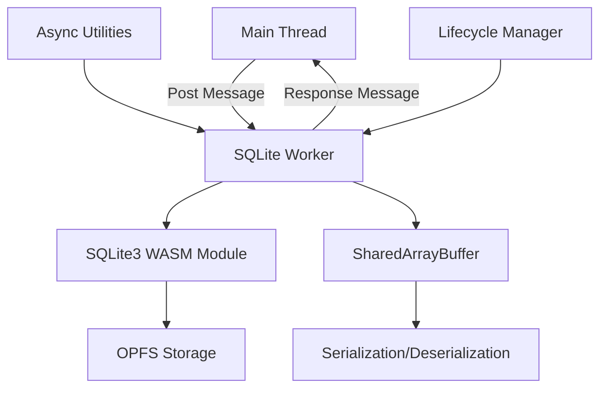
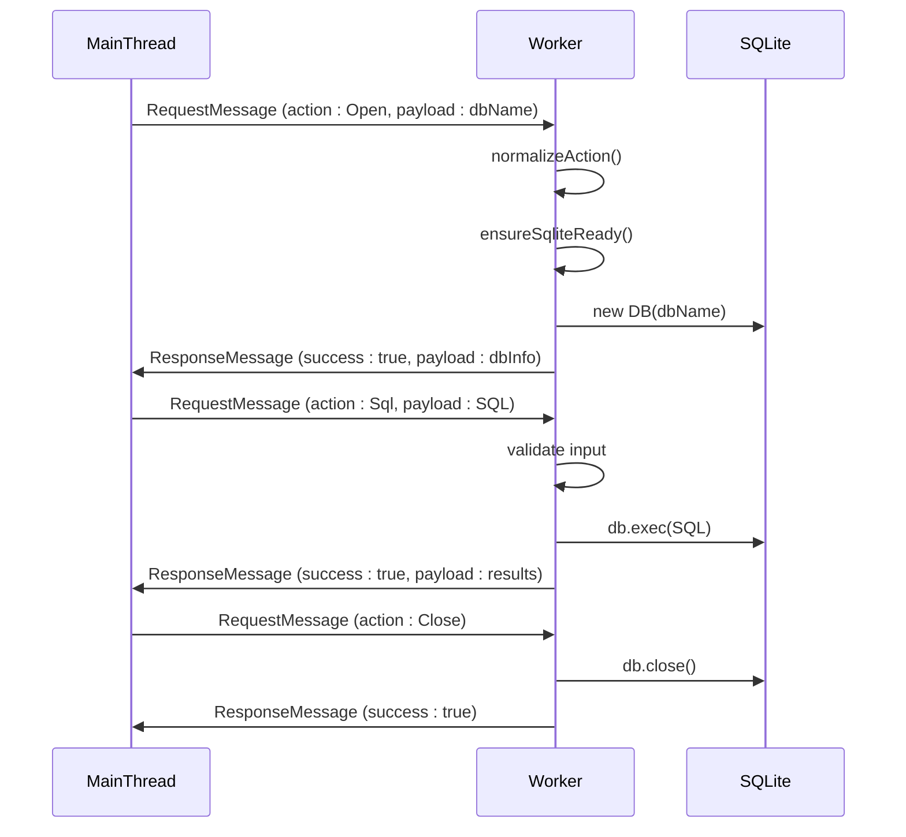
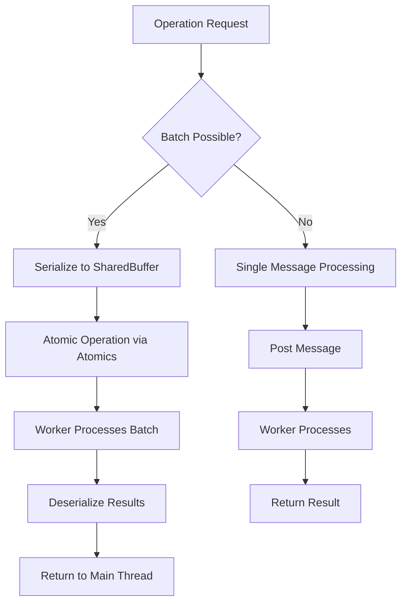
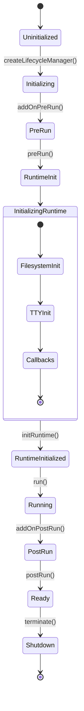
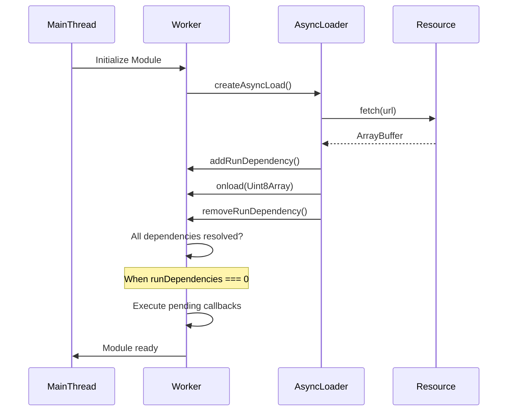
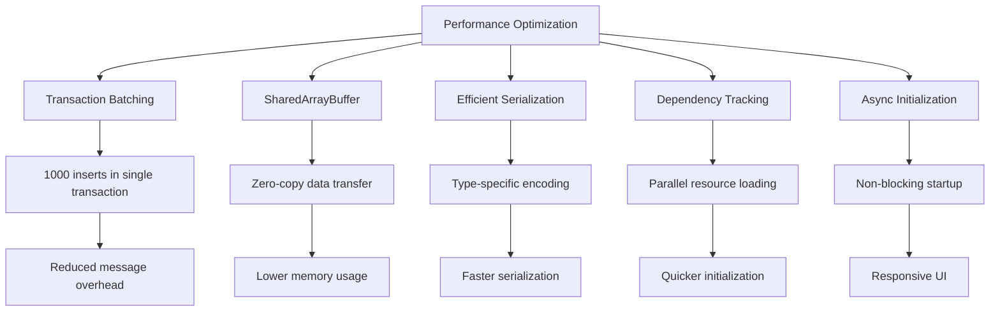
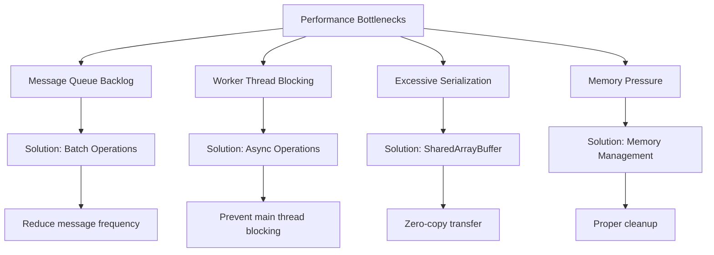
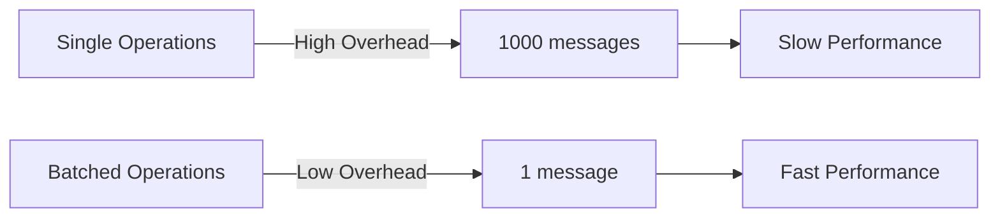

# Worker Optimization

<cite>
**Referenced Files in This Document**   
- [sqliteWorker.ts](file://src/sqliteWorker.ts)
- [async-utils.ts](file://src/jswasm/utils/async-utils/async-utils.ts)
- [lifecycle-manager.mjs](file://src/jswasm/runtime/lifecycle-manager.mjs)
- [worker-message-handler.mjs](file://src/jswasm/vfs/opfs/installer/utils/worker-message-handler.mjs)
- [serialization.mjs](file://src/jswasm/vfs/opfs/installer/core/serialization.mjs)
- [state-initialization.mjs](file://src/jswasm/vfs/opfs/installer/core/state-initialization.mjs)
- [performance.e2e.test.ts](file://tests/e2e/performance.e2e.test.ts)
- [worker-client.ts](file://tests/e2e/worker-client.ts)
- [test-worker.ts](file://tests/e2e/test-worker.ts)
</cite>

## Table of Contents
1. [Introduction](#introduction)
2. [Worker Architecture Overview](#worker-architecture-overview)
3. [Message Passing Efficiency](#message-passing-efficiency)
4. [Task Batching and Serialization](#task-batching-and-serialization)
5. [Thread Lifecycle Management](#thread-lifecycle-management)
6. [Async Utilities and Promise Handling](#async-utilities-and-promise-handling)
7. [Performance Optimization Strategies](#performance-optimization-strategies)
8. [Common Performance Bottlenecks](#common-performance-bottlenecks)
9. [Best Practices for Database Operations](#best-practices-for-database-operations)
10. [Conclusion](#conclusion)

## Introduction
This document provides a comprehensive analysis of worker optimization in the web-sqlite-v2 project, focusing on the architecture and performance characteristics of the SQLite Web Worker implementation. The system leverages Web Workers to execute SQLite operations off the main thread, preventing UI blocking during database operations. The optimization strategy centers around efficient message passing, task batching, lifecycle management, and non-blocking operations to maximize throughput and minimize latency in database interactions.

**Section sources**
- [sqliteWorker.ts](file://src/sqliteWorker.ts#L1-L243)

## Worker Architecture Overview

**Diagram sources**
- [sqliteWorker.ts](file://src/sqliteWorker.ts#L1-L243)
- [lifecycle-manager.mjs](file://src/jswasm/runtime/lifecycle-manager.mjs#L1-L268)
- [worker-message-handler.mjs](file://src/jswasm/vfs/opfs/installer/utils/worker-message-handler.mjs#L1-L126)

**Section sources**
- [sqliteWorker.ts](file://src/sqliteWorker.ts#L1-L243)
- [lifecycle-manager.mjs](file://src/jswasm/runtime/lifecycle-manager.mjs#L1-L268)

## Message Passing Efficiency

The worker architecture implements an efficient message passing system between the main thread and the worker thread. The system uses a structured message format with action codes, message IDs, and payloads to coordinate operations. The message protocol is designed to minimize serialization overhead and maximize throughput.

The message passing system in sqliteWorker.ts defines three primary action types: Open (0), Close (1), and Sql (2). Each message includes a messageId for response correlation and a payload containing the operation-specific data. The worker listens for messages via the addEventListener("message") API and dispatches to appropriate handlers based on the action code.

**Diagram sources**
- [sqliteWorker.ts](file://src/sqliteWorker.ts#L7-L243)
- [index.ts](file://src/index.ts#L6-L10)

**Section sources**
- [sqliteWorker.ts](file://src/sqliteWorker.ts#L7-L243)

## Task Batching and Serialization

The system implements sophisticated task batching and serialization mechanisms to optimize performance when handling multiple database operations. The architecture uses SharedArrayBuffer instances for efficient data transfer between threads without copying, significantly reducing memory overhead and improving performance.

The state-initialization.mjs module initializes two key SharedArrayBuffers: sabIO for I/O operations and sabOP for operation coordination. The sabIO buffer is divided into regions for file buffering and serialization, while sabOP contains operation-specific data. This design enables efficient batch processing of database operations by minimizing the number of postMessage calls required.

The serialization.mjs module implements a custom serialization protocol that supports numbers, bigints, booleans, and strings. The protocol uses type identifiers and efficient encoding to minimize the size of serialized data. For strings, it uses TextEncoder/TextDecoder for UTF-8 encoding, while numeric types are written directly to the DataView for maximum performance.

**Diagram sources**
- [serialization.mjs](file://src/jswasm/vfs/opfs/installer/core/serialization.mjs#L1-L150)
- [state-initialization.mjs](file://src/jswasm/vfs/opfs/installer/core/state-initialization.mjs#L1-L127)

**Section sources**
- [serialization.mjs](file://src/jswasm/vfs/opfs/installer/core/serialization.mjs#L1-L150)
- [state-initialization.mjs](file://src/jswasm/vfs/opfs/installer/core/state-initialization.mjs#L1-L127)

## Thread Lifecycle Management

The lifecycle-manager.mjs module provides comprehensive control over the worker thread's lifecycle, ensuring optimal resource utilization and efficient startup and shutdown sequences. The lifecycle manager coordinates the initialization phases of the WebAssembly module, handling preRun, initRuntime, and postRun phases in a controlled manner.

The lifecycle manager maintains several key state variables: runtimeInitialized, runDependencies, and calledRun. The runDependencies counter tracks asynchronous operations that must complete before the module is considered ready. This dependency tracking system ensures that all required resources are available before database operations commence, preventing race conditions and initialization errors.

The manager implements a robust dependency tracking system with addRunDependency and removeRunDependency functions. When the dependency count reaches zero, any pending callbacks are executed, allowing for proper sequencing of initialization tasks. This system is critical for ensuring that the SQLite WASM module is fully initialized before any database operations are attempted.

**Diagram sources**
- [lifecycle-manager.mjs](file://src/jswasm/runtime/lifecycle-manager.mjs#L1-L268)

**Section sources**
- [lifecycle-manager.mjs](file://src/jswasm/runtime/lifecycle-manager.mjs#L1-L268)

## Async Utilities and Promise Handling

The async-utils.ts module provides essential utilities for managing asynchronous operations in the worker environment. The createAsyncLoad function creates an async loader that integrates with Emscripten's run dependency system, ensuring that asynchronous resource loading is properly coordinated with module initialization.

The async utilities implement a dependency tracking pattern where each asynchronous operation is assigned a unique identifier. The system tracks these dependencies and only proceeds with module initialization when all dependencies are resolved. This approach prevents race conditions and ensures that all required resources are available before the database engine becomes operational.

The async utilities also provide proper error handling for failed resource loading operations. If a resource fails to load, the system either calls the provided onerror callback or throws an error, ensuring that initialization failures are properly reported and handled.

**Diagram sources**
- [async-utils.ts](file://src/jswasm/utils/async-utils/async-utils.ts#L1-L66)

**Section sources**
- [async-utils.ts](file://src/jswasm/utils/async-utils/async-utils.ts#L1-L66)

## Performance Optimization Strategies

The system implements several performance optimization strategies to maximize worker throughput and minimize latency. These strategies include efficient message serialization, reduced worker thread contention, and optimized CPU utilization patterns.

The performance.e2e.test.ts file contains benchmarks that validate the effectiveness of these optimizations. The bulk insert test demonstrates the performance benefits of using transactions to group multiple insert operations, significantly reducing the overhead associated with individual SQL statements.

The architecture optimizes CPU utilization by ensuring that the worker thread is only active when processing database operations. During idle periods, the worker thread waits for messages without consuming CPU resources. This design pattern maximizes efficiency and prevents unnecessary resource consumption.

**Diagram sources**
- [performance.e2e.test.ts](file://tests/e2e/performance.e2e.test.ts#L1-L119)
- [sqliteWorker.ts](file://src/sqliteWorker.ts#L1-L243)

**Section sources**
- [performance.e2e.test.ts](file://tests/e2e/performance.e2e.test.ts#L1-L119)

## Common Performance Bottlenecks

Despite the optimized architecture, several potential performance bottlenecks can occur in the worker system. Understanding these bottlenecks and their mitigation strategies is essential for maintaining optimal performance.

Message queue backlogs can occur when the main thread sends messages to the worker faster than the worker can process them. This can lead to increased memory usage and latency. The system mitigates this through efficient message processing and proper batching of operations.

Worker thread blocking can occur when synchronous operations are performed in the worker, preventing it from processing additional messages. The architecture minimizes this risk by ensuring that all I/O operations are handled asynchronously through the OPFS VFS layer.

Excessive serialization overhead can occur when large amounts of data are transferred between threads. The system addresses this through the use of SharedArrayBuffer and efficient binary serialization formats, minimizing the overhead associated with data transfer.

Memory pressure can build up when large result sets are returned from database queries. The architecture mitigates this by streaming results when possible and encouraging applications to use pagination for large datasets.

**Diagram sources**
- [sqliteWorker.ts](file://src/sqliteWorker.ts#L1-L243)
- [serialization.mjs](file://src/jswasm/vfs/opfs/installer/core/serialization.mjs#L1-L150)

**Section sources**
- [sqliteWorker.ts](file://src/sqliteWorker.ts#L1-L243)
- [performance.e2e.test.ts](file://tests/e2e/performance.e2e.test.ts#L1-L119)

## Best Practices for Database Operations

To maximize worker throughput and minimize latency, several best practices should be followed when structuring database operations in the web-sqlite-v2 system.

Use transactions to batch multiple operations together, reducing the overhead associated with individual SQL statements. This is particularly important for insert and update operations, where grouping multiple changes into a single transaction can provide significant performance benefits.

Structure queries to return only the data that is needed, avoiding SELECT * statements when specific columns are required. This reduces the amount of data that must be serialized and transferred between threads.

For large datasets, implement pagination rather than retrieving all results at once. This prevents memory pressure and keeps the UI responsive. Use LIMIT and OFFSET clauses or cursor-based pagination to retrieve data in manageable chunks.

Minimize the frequency of worker communication by batching related operations together. Instead of making multiple round trips to the worker, combine related database operations into a single request when possible.

**Section sources**
- [sqliteWorker.ts](file://src/sqliteWorker.ts#L1-L243)
- [performance.e2e.test.ts](file://tests/e2e/performance.e2e.test.ts#L1-L119)

## Conclusion
The worker optimization architecture in web-sqlite-v2 demonstrates a sophisticated approach to database operations in web applications. By leveraging Web Workers, SharedArrayBuffer, and efficient serialization techniques, the system achieves high performance while maintaining a responsive user interface.

The key optimization strategies—efficient message passing, task batching, lifecycle management, and non-blocking operations—work together to create a robust and performant database solution. The architecture effectively addresses common performance bottlenecks and provides a solid foundation for building data-intensive web applications.

By following the best practices outlined in this document, developers can maximize the performance of their database operations and deliver a smooth user experience. The combination of technical optimizations and recommended usage patterns ensures that the web-sqlite-v2 system can handle demanding database workloads efficiently.