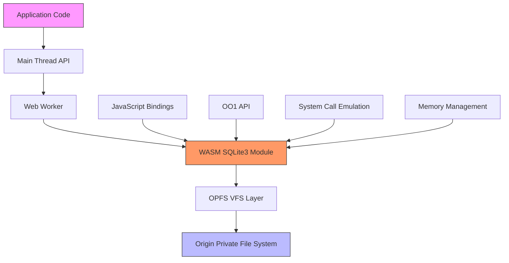
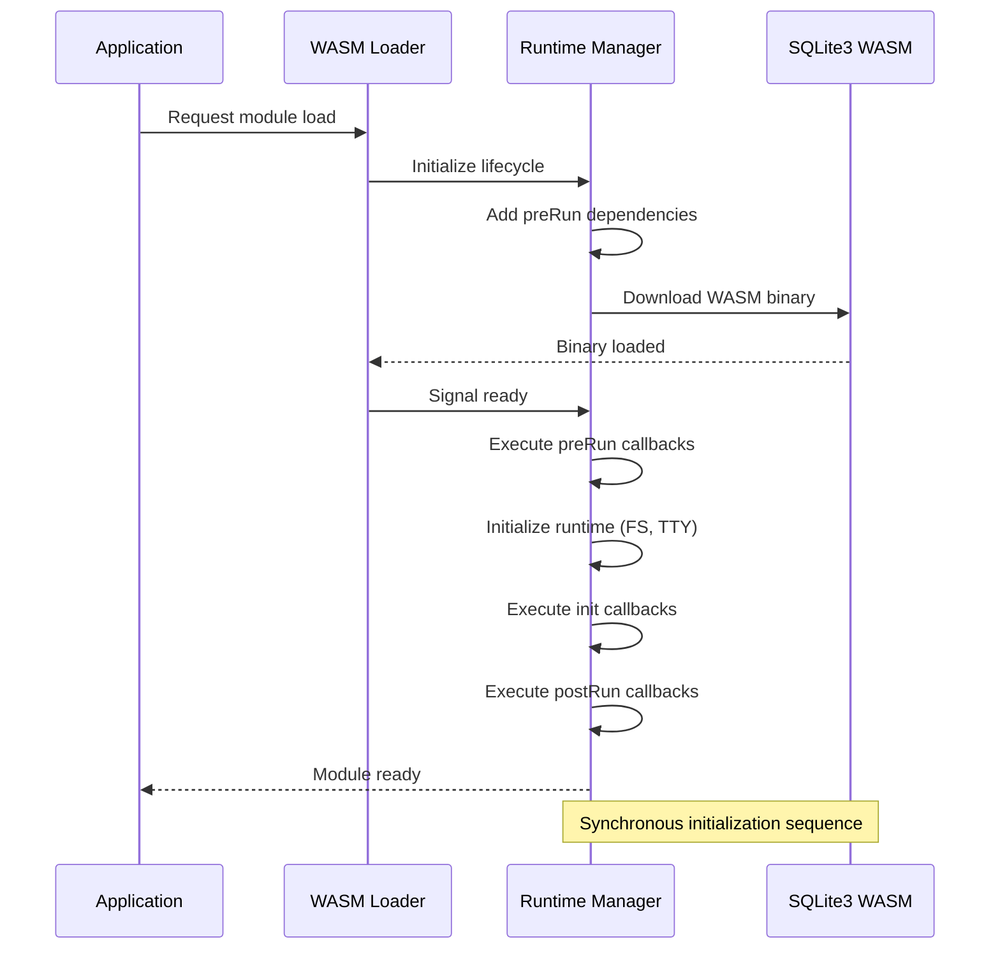
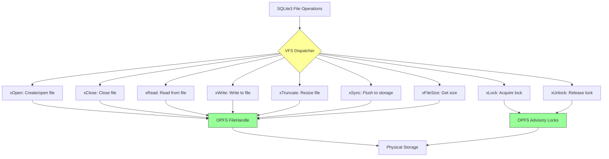
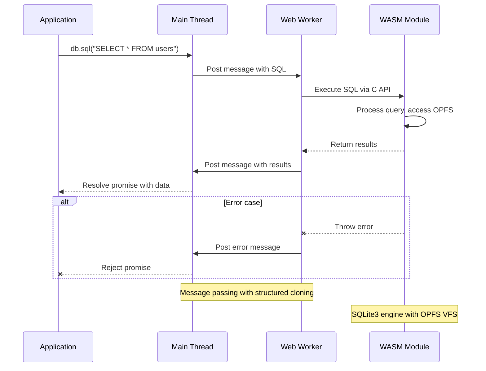
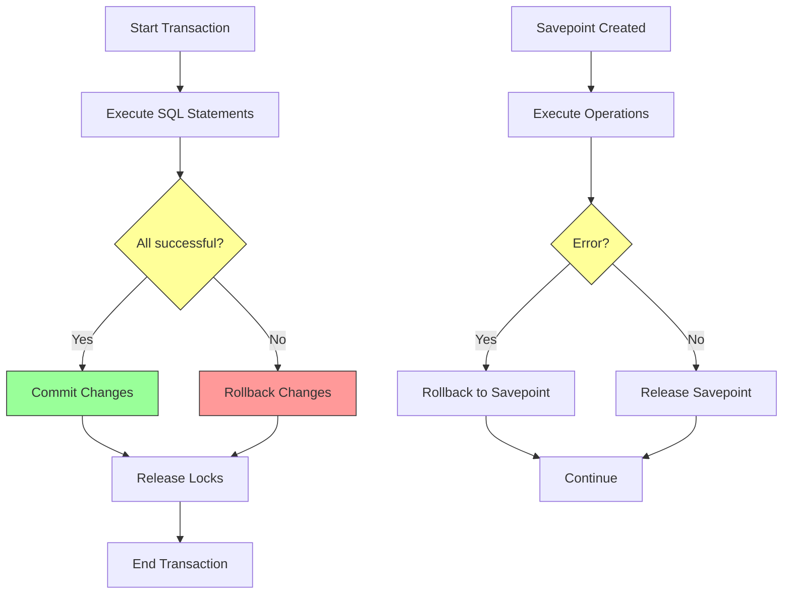
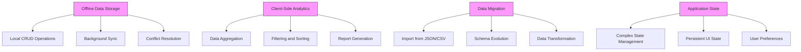

# Project Overview

<cite>
**Referenced Files in This Document**   
- [index.ts](file://src/index.ts)
- [sqliteWorker.ts](file://src/sqliteWorker.ts)
- [package.json](file://package.json)
- [install-oo1-db-api.mjs](file://src/jswasm/api/install-oo1-db-api.mjs)
- [default-bootstrap-state.mjs](file://src/jswasm/wasm/bootstrap/default-bootstrap-state.mjs)
- [vfs-integration.mjs](file://src/jswasm/vfs/opfs/installer/wrappers/vfs-integration.mjs)
- [lifecycle-manager.mjs](file://src/jswasm/runtime/lifecycle-manager.mjs)
- [syscalls.mjs](file://src/jswasm/system/syscalls.mjs)
- [index.mjs](file://src/jswasm/api/oo1-db/db-statement/index.mjs)
- [context.mjs](file://src/jswasm/api/oo1-db/context.mjs)
- [crud-operations.e2e.test.ts](file://tests/e2e/crud-operations.e2e.test.ts)
- [transactions.e2e.test.ts](file://tests/e2e/transactions.e2e.test.ts)
- [sqlite3.d.ts](file://src/jswasm/sqlite3.d.ts)
</cite>

## Table of Contents
1. [Introduction](#introduction)
2. [Architecture Overview](#architecture-overview)
3. [Core Components](#core-components)
4. [WASM Bootstrap and Initialization](#wasm-bootstrap-and-initialization)
5. [VFS Integration and OPFS Persistence](#vfs-integration-and-opfs-persistence)
6. [OO1 API Implementation](#oo1-api-implementation)
7. [Data Flow and Execution Model](#data-flow-and-execution-model)
8. [Key Features and Functionality](#key-features-and-functionality)
9. [Practical Use Cases](#practical-use-cases)

## Introduction

The web-sqlite-v2 library provides a WebAssembly-powered SQLite3 implementation for web browsers with OPFS (Origin Private File System) persistence. This document explains the architecture, components, and implementation details of this library, focusing on its use of Web Workers, WASM module loading, and VFS integration to provide a robust client-side database solution.

The library enables developers to use SQLite3 in web applications with full ACID compliance, transaction support, and persistent storage through OPFS. It uses Emscripten to compile SQLite3 to WebAssembly, providing near-native performance while maintaining compatibility with the full SQLite3 feature set.

**Section sources**
- [package.json](file://package.json#L1-L62)

## Architecture Overview

The web-sqlite-v2 architecture follows a multi-layered approach with clear separation of concerns between the main thread, Web Worker, WASM module, and OPFS storage. The system is designed to keep heavy database operations off the main thread while providing a clean JavaScript/TypeScript API for application developers.



**Diagram sources**
- [index.ts](file://src/index.ts#L1-L92)
- [sqliteWorker.ts](file://src/sqliteWorker.ts#L1-L243)

**Section sources**
- [index.ts](file://src/index.ts#L1-L92)
- [sqliteWorker.ts](file://src/sqliteWorker.ts#L1-L243)

## Core Components

The web-sqlite-v2 library consists of several core components that work together to provide a complete SQLite3 implementation in the browser. The main components include the API layer, Web Worker interface, WASM module, VFS integration, and runtime utilities.

The API layer provides the high-level interface that application developers use to interact with the database. This includes the `open` function that returns a database connection object with methods for executing SQL statements, managing transactions, and handling prepared statements.

The Web Worker component runs the actual SQLite3 engine in a separate thread to prevent blocking the main UI thread. Communication between the main thread and worker occurs through message passing, with a defined protocol for database operations.

**Section sources**
- [index.ts](file://src/index.ts#L1-L92)
- [sqliteWorker.ts](file://src/sqliteWorker.ts#L1-L243)

## WASM Bootstrap and Initialization

The WASM bootstrap process is responsible for loading and initializing the SQLite3 WebAssembly module. This process involves several key steps: downloading the WASM binary, setting up the runtime environment, initializing system calls, and configuring the VFS layer.

The bootstrap process uses Emscripten's module pattern with lifecycle hooks to ensure proper initialization order. The `lifecycle-manager.mjs` component coordinates the initialization phases, including preRun, initRuntime, and postRun stages. During initialization, the system sets up file system interfaces, memory management, and error handling before making the SQLite3 API available.



**Diagram sources**
- [lifecycle-manager.mjs](file://src/jswasm/runtime/lifecycle-manager.mjs#L1-L268)
- [default-bootstrap-state.mjs](file://src/jswasm/wasm/bootstrap/default-bootstrap-state.mjs#L1-L78)

**Section sources**
- [lifecycle-manager.mjs](file://src/jswasm/runtime/lifecycle-manager.mjs#L1-L268)
- [util-factory.mjs](file://src/jswasm/wasm/bootstrap/util-factory.mjs#L1-L146)

## VFS Integration and OPFS Persistence

The VFS (Virtual File System) layer provides the critical bridge between SQLite3's file operations and the browser's OPFS storage. This integration enables persistent database storage that survives page reloads while maintaining the security boundaries of the web platform.

The OPFS VFS implementation translates SQLite3's file system calls into OPFS operations, allowing the database engine to read and write database files directly to the user's device. The VFS layer handles all file operations including opening, reading, writing, and locking, while abstracting the complexities of the OPFS API from the SQLite3 engine.



**Diagram sources**
- [vfs-integration.mjs](file://src/jswasm/vfs/opfs/installer/wrappers/vfs-integration.mjs#L1-L74)
- [syscalls.mjs](file://src/jswasm/system/syscalls.mjs#L1-L155)

**Section sources**
- [vfs-integration.mjs](file://src/jswasm/vfs/opfs/installer/wrappers/vfs-integration.mjs#L1-L74)
- [syscalls.mjs](file://src/jswasm/system/syscalls.mjs#L1-L155)

## OO1 API Implementation

The OO1 API provides a high-level, object-oriented interface to SQLite3 functionality. This API layer abstracts the lower-level C-style SQLite3 interface into JavaScript classes and methods that are more natural for web developers.

The implementation uses a modular approach with separate components for database connections, prepared statements, and utility functions. The `install-oo1-db-api.mjs` file orchestrates the installation of the OO1 API by composing various helper modules that handle different aspects of the database functionality.

```mermaid
classDiagram
class Database {
+string filename
+pointer
+exec(sql, options)
+prepare(sql)
+close()
+transaction(callback)
}
class Statement {
+pointer
+bind(values)
+step()
+reset()
+finalize()
+get()
+getAsObject()
}
class OO1Context {
+sqlite3
+capi
+wasm
+ptrMap
+stmtMap
+toss()
+checkRc()
}
class DbCtorHelper {
+normalizeArgs()
+call()
+setVfsPostOpenCallback()
}
Database --> OO1Context : "uses"
Statement --> OO1Context : "uses"
Database --> DbCtorHelper : "uses"
OO1Context --> sqlite3 : "wraps"
note right of Database
Main database connection class
Provides high-level SQL execution
Manages transactions
end
note right of Statement
Prepared statement wrapper
Supports parameter binding
Iterative result retrieval
end
```

**Diagram sources**
- [install-oo1-db-api.mjs](file://src/jswasm/api/install-oo1-db-api.mjs#L1-L40)
- [index.mjs](file://src/jswasm/api/oo1-db/db-statement/index.mjs#L1-L72)
- [context.mjs](file://src/jswasm/api/oo1-db/context.mjs#L1-L48)

**Section sources**
- [install-oo1-db-api.mjs](file://src/jswasm/api/install-oo1-db-api.mjs#L1-L40)
- [index.mjs](file://src/jswasm/api/oo1-db/db-statement/index.mjs#L1-L72)

## Data Flow and Execution Model

The data flow in web-sqlite-v2 follows a message-passing pattern between the main thread and Web Worker. When an application executes a SQL statement, the request is serialized and sent to the worker, where it is processed by the WASM SQLite3 engine, and the results are sent back to the main thread.

This execution model ensures that database operations do not block the main UI thread, providing a responsive user experience even with complex queries or large data sets. The message protocol includes error handling and supports both single statements and batch operations.



**Diagram sources**
- [index.ts](file://src/index.ts#L1-L92)
- [sqliteWorker.ts](file://src/sqliteWorker.ts#L1-L243)

**Section sources**
- [index.ts](file://src/index.ts#L1-L92)
- [sqliteWorker.ts](file://src/sqliteWorker.ts#L1-L243)

## Key Features and Functionality

The web-sqlite-v2 library provides several key features that make it suitable for demanding client-side applications. These include transaction support, prepared statements, type-safe TypeScript interfaces, and comprehensive error handling.

Transaction support allows multiple SQL operations to be grouped together with ACID properties, ensuring data consistency. The library supports both explicit transactions with BEGIN/COMMIT/ROLLBACK and automatic transaction management through higher-level APIs.



**Diagram sources**
- [transactions.e2e.test.ts](file://tests/e2e/transactions.e2e.test.ts#L1-L130)
- [sqliteWorker.ts](file://src/sqliteWorker.ts#L112-L166)

**Section sources**
- [transactions.e2e.test.ts](file://tests/e2e/transactions.e2e.test.ts#L1-L130)
- [crud-operations.e2e.test.ts](file://tests/e2e/crud-operations.e2e.test.ts#L1-L143)

## Practical Use Cases

The web-sqlite-v2 library is well-suited for various practical use cases in modern web applications. These include offline data storage, client-side analytics, and complex data manipulation that would otherwise require server round-trips.

For offline applications, the library enables data to be stored locally and synchronized when connectivity is restored. This is particularly valuable for mobile applications or applications used in environments with unreliable network connections.

Client-side analytics can leverage the full power of SQL to process large datasets without sending sensitive information to servers. This approach improves privacy and reduces bandwidth usage while providing fast query performance.



**Diagram sources**
- [crud-operations.e2e.test.ts](file://tests/e2e/crud-operations.e2e.test.ts#L1-L143)
- [transactions.e2e.test.ts](file://tests/e2e/transactions.e2e.test.ts#L1-L130)

**Section sources**
- [crud-operations.e2e.test.ts](file://tests/e2e/crud-operations.e2e.test.ts#L1-L143)
- [transactions.e2e.test.ts](file://tests/e2e/transactions.e2e.test.ts#L1-L130)