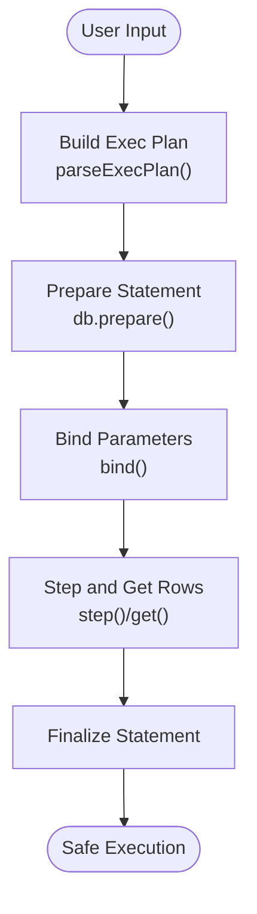

# Security Considerations

<cite>
**Referenced Files in This Document**
- [package.json](file://package.json)
- [http-server.ts](file://scripts/http-server.ts)
- [index.ts](file://src/index.ts)
- [sqliteWorker.ts](file://src/sqliteWorker.ts)
- [environment-validation.mjs](file://src/jswasm/vfs/opfs/installer/core/environment-validation.mjs)
- [state-initialization.mjs](file://src/jswasm/vfs/opfs/installer/core/state-initialization.mjs)
- [sanity-check.mjs](file://src/jswasm/vfs/opfs/installer/utils/sanity-check.mjs)
- [io-sync-wrappers.mjs](file://src/jswasm/vfs/opfs/installer/wrappers/io-sync-wrappers.mjs)
- [execution.mjs](file://src/jswasm/api/oo1-db/db-statement/execution.mjs)
- [validation.mjs](file://src/jswasm/api/oo1-db/db-statement/validation.mjs)
- [binding.mjs](file://src/jswasm/api/oo1-db/db-statement/binding.mjs)
- [memory-manager.mjs](file://src/jswasm/runtime/memory-manager.mjs)
- [memory-helpers.ts](file://src/jswasm/utils/whwasm/memory-helpers/memory-helpers.ts)
- [memory-utils.ts](file://src/jswasm/utils/memory-utils/memory-utils.ts)
- [default-bootstrap-state.mjs](file://src/jswasm/wasm/bootstrap/default-bootstrap-state.mjs)
- [error-handling.e2e.test.ts](file://tests/e2e/error-handling.e2e.test.ts)
- [prepared-statements.e2e.test.ts](file://tests/e2e/prepared-statements.e2e.test.ts)
</cite>

## Table of Contents

1. [Introduction](#introduction)
2. [Project Structure](#project-structure)
3. [Core Components](#core-components)
4. [Architecture Overview](#architecture-overview)
5. [Detailed Component Analysis](#detailed-component-analysis)
6. [Dependency Analysis](#dependency-analysis)
7. [Performance Considerations](#performance-considerations)
8. [Troubleshooting Guide](#troubleshooting-guide)
9. [Conclusion](#conclusion)
10. [Appendices](#appendices)

## Introduction

This document provides comprehensive security documentation for web-sqlite-v2. It focuses on:

- The security model of OPFS and origin-based isolation guarantees
- Attack vectors such as SQL injection and mitigation strategies using prepared statements
- Security requirements for SharedArrayBuffer and cross-origin isolation
- Risks associated with WASM execution and memory access patterns
- Limitations of the development HTTP server and secure deployment recommendations
- Dependency security through package.json configuration and update policies
- Guidelines for input validation and error handling to prevent information leakage

## Project Structure

The project is organized around a WebAssembly-backed SQLite implementation with OPFS persistence and a dedicated worker for database operations. Key security-relevant areas include:

- Development HTTP server for local testing with SharedArrayBuffer headers
- Worker-based database operations with explicit message validation and error handling
- OPFS installation and environment validation for SharedArrayBuffer and Atomics
- WASM memory management and structured access to memory
- Prepared statement support and parameter binding utilities

**Diagram sources**

- [http-server.ts](file://scripts/http-server.ts#L132-L254)
- [sqliteWorker.ts](file://src/sqliteWorker.ts#L208-L242)
- [environment-validation.mjs](file://src/jswasm/vfs/opfs/installer/core/environment-validation.mjs#L1-L38)
- [state-initialization.mjs](file://src/jswasm/vfs/opfs/installer/core/state-initialization.mjs#L1-L127)
- [io-sync-wrappers.mjs](file://src/jswasm/vfs/opfs/installer/wrappers/io-sync-wrappers.mjs#L1-L236)
- [execution.mjs](file://src/jswasm/api/oo1-db/db-statement/execution.mjs#L1-L223)
- [validation.mjs](file://src/jswasm/api/oo1-db/db-statement/validation.mjs#L1-L102)
- [binding.mjs](file://src/jswasm/api/oo1-db/db-statement/binding.mjs#L1-L32)
- [memory-manager.mjs](file://src/jswasm/runtime/memory-manager.mjs#L28-L69)

**Section sources**

- [http-server.ts](file://scripts/http-server.ts#L132-L254)
- [sqliteWorker.ts](file://src/sqliteWorker.ts#L208-L242)
- [environment-validation.mjs](file://src/jswasm/vfs/opfs/installer/core/environment-validation.mjs#L1-L38)
- [state-initialization.mjs](file://src/jswasm/vfs/opfs/installer/core/state-initialization.mjs#L1-L127)
- [io-sync-wrappers.mjs](file://src/jswasm/vfs/opfs/installer/wrappers/io-sync-wrappers.mjs#L1-L236)
- [execution.mjs](file://src/jswasm/api/oo1-db/db-statement/execution.mjs#L1-L223)
- [validation.mjs](file://src/jswasm/api/oo1-db/db-statement/validation.mjs#L1-L102)
- [binding.mjs](file://src/jswasm/api/oo1-db/db-statement/binding.mjs#L1-L32)
- [memory-manager.mjs](file://src/jswasm/runtime/memory-manager.mjs#L28-L69)

## Core Components

- Development HTTP server: Serves static assets locally with SharedArrayBuffer-ready headers and mitigates directory traversal.
- SQLite worker: Enforces message validation, handles Open/Sql/Close actions, and responds with structured messages.
- OPFS installer: Validates environment support for SharedArrayBuffer, Atomics, and OPFS APIs; initializes SharedArrayBuffer-backed state and operation IDs.
- WASM runtime: Manages memory views and growth; provides memory accessors and utilities.
- OO1 API: Provides prepared statements, parameter binding, and execution helpers with validation.

**Section sources**

- [http-server.ts](file://scripts/http-server.ts#L132-L254)
- [sqliteWorker.ts](file://src/sqliteWorker.ts#L208-L242)
- [environment-validation.mjs](file://src/jswasm/vfs/opfs/installer/core/environment-validation.mjs#L1-L38)
- [state-initialization.mjs](file://src/jswasm/vfs/opfs/installer/core/state-initialization.mjs#L1-L127)
- [memory-manager.mjs](file://src/jswasm/runtime/memory-manager.mjs#L28-L69)
- [execution.mjs](file://src/jswasm/api/oo1-db/db-statement/execution.mjs#L1-L223)
- [validation.mjs](file://src/jswasm/api/oo1-db/db-statement/validation.mjs#L1-L102)
- [binding.mjs](file://src/jswasm/api/oo1-db/db-statement/binding.mjs#L1-L32)

## Architecture Overview

The security architecture centers on:

- Origin-based isolation via OPFS and cross-origin isolation headers
- Strict message validation and error containment in the worker
- Controlled memory access and growth in the WASM runtime
- Prepared statements and parameter binding to mitigate SQL injection

**Diagram sources**

- [http-server.ts](file://scripts/http-server.ts#L132-L254)
- [sqliteWorker.ts](file://src/sqliteWorker.ts#L208-L242)
- [environment-validation.mjs](file://src/jswasm/vfs/opfs/installer/core/environment-validation.mjs#L1-L38)
- [io-sync-wrappers.mjs](file://src/jswasm/vfs/opfs/installer/wrappers/io-sync-wrappers.mjs#L1-L236)
- [state-initialization.mjs](file://src/jswasm/vfs/opfs/installer/core/state-initialization.mjs#L1-L127)
- [memory-manager.mjs](file://src/jswasm/runtime/memory-manager.mjs#L28-L69)

## Detailed Component Analysis

### OPFS Security Model and Origin-Based Isolation

- Environment validation ensures SharedArrayBuffer and Atomics are present and that OPFS APIs are available. Without these, OPFS cannot be installed.
- Cross-origin isolation headers (COOP/COEP) are required for SharedArrayBuffer to be usable in the browser, enabling OPFS-backed persistence.
- OPFS provides origin-scoped storage; files are isolated by origin and site context.

Security implications:

- Origin-based isolation prevents cross-origin access to OPFS-backed databases.
- Missing COEP/COOP headers will disable SharedArrayBuffer and OPFS installation.
- Worker-only execution is enforced by environment validation.

**Section sources**

- [environment-validation.mjs](file://src/jswasm/vfs/opfs/installer/core/environment-validation.mjs#L1-L38)
- [state-initialization.mjs](file://src/jswasm/vfs/opfs/installer/core/state-initialization.mjs#L1-L127)
- [http-server.ts](file://scripts/http-server.ts#L143-L154)

### SharedArrayBuffer and Cross-Origin Isolation Requirements

- The development server sets COEP and COOP headers to enable SharedArrayBuffer.
- CORS headers are configured for broad access in development; in production, restrict origins appropriately.
- Directory traversal protection is enforced via path resolution and base path checks.

Operational guidance:

- Always deploy with COEP/COOP headers in production.
- Restrict Access-Control-Allow-Origin to trusted origins.
- Ensure the server serves the WASM and HTML assets with appropriate caching and security headers.

**Section sources**

- [http-server.ts](file://scripts/http-server.ts#L143-L154)
- [http-server.ts](file://scripts/http-server.ts#L168-L174)

### SQL Injection Mitigation Using Prepared Statements

- The OO1 API supports prepared statements and parameter binding. Validation resolves parameter indices and enforces bounds.
- Execution helpers accept bind specifications and return rows safely.
- Tests demonstrate parameterized insert/select patterns conceptually; ensure applications use prepared statements with bound parameters.

Mitigation strategies:

- Prefer db.prepare + bind + step/get/finalize over dynamic SQL concatenation.
- Validate and sanitize inputs at the application boundary; pass validated values as parameters.
- Avoid constructing SQL strings from user input; use placeholders and bind helpers.

**Diagram sources**

- [execution.mjs](file://src/jswasm/api/oo1-db/db-statement/execution.mjs#L1-L223)
- [validation.mjs](file://src/jswasm/api/oo1-db/db-statement/validation.mjs#L72-L102)
- [binding.mjs](file://src/jswasm/api/oo1-db/db-statement/binding.mjs#L1-L32)

**Section sources**

- [execution.mjs](file://src/jswasm/api/oo1-db/db-statement/execution.mjs#L1-L223)
- [validation.mjs](file://src/jswasm/api/oo1-db/db-statement/validation.mjs#L72-L102)
- [binding.mjs](file://src/jswasm/api/oo1-db/db-statement/binding.mjs#L1-L32)
- [prepared-statements.e2e.test.ts](file://tests/e2e/prepared-statements.e2e.test.ts#L1-L109)

### WASM Execution and Memory Access Patterns

- The runtime manages typed arrays for WASM memory and supports growing memory with bounds checks.
- Memory accessors provide peek/poke operations with type resolution and pointer validation.
- Memory utilities include zeroing regions and alignment helpers.

Security considerations:

- Memory growth failures are handled gracefully; ensure callers do not assume growth succeeds.
- Use memory accessors consistently to avoid out-of-bounds reads/writes.
- Clear sensitive data in WASM memory using zeroMemory after use.

**Diagram sources**

- [memory-manager.mjs](file://src/jswasm/runtime/memory-manager.mjs#L28-L69)
- [memory-helpers.ts](file://src/jswasm/utils/whwasm/memory-helpers/memory-helpers.ts#L190-L306)
- [memory-utils.ts](file://src/jswasm/utils/memory-utils/memory-utils.ts#L28-L69)

**Section sources**

- [memory-manager.mjs](file://src/jswasm/runtime/memory-manager.mjs#L28-L69)
- [memory-helpers.ts](file://src/jswasm/utils/whwasm/memory-helpers/memory-helpers.ts#L190-L306)
- [memory-utils.ts](file://src/jswasm/utils/memory-utils/memory-utils.ts#L28-L69)

### Worker Security: Message Validation and Error Handling

- The worker validates action codes and payload shapes before dispatching to handlers.
- Open/Sql/Close handlers enforce preconditions (e.g., database must be open for Sql).
- Errors are captured and returned with structured payloads; stack traces are included.

Security implications:

- Unknown actions are rejected early.
- Missing or malformed payloads are rejected with explicit errors.
- Error responses prevent leaking internal implementation details beyond controlled messages.

**Diagram sources**

- [sqliteWorker.ts](file://src/sqliteWorker.ts#L208-L242)
- [sqliteWorker.ts](file://src/sqliteWorker.ts#L112-L166)

**Section sources**

- [sqliteWorker.ts](file://src/sqliteWorker.ts#L208-L242)
- [sqliteWorker.ts](file://src/sqliteWorker.ts#L112-L166)

### OPFS I/O and Serialization Security

- OPFS I/O wrappers operate over SharedArrayBuffer-backed views and use serialization/deserialization for cross-thread communication.
- Sanity checks validate read/write, truncate, sync, and file existence operations.
- Operation IDs and state are initialized with SharedArrayBuffer allocations.

Security considerations:

- Ensure serialization boundaries are respected; avoid writing beyond allocated regions.
- Validate operation results and handle errors consistently.
- Keep OPFS state initialization and sanity checks enabled in development to catch regressions.

**Section sources**

- [io-sync-wrappers.mjs](file://src/jswasm/vfs/opfs/installer/wrappers/io-sync-wrappers.mjs#L1-L236)
- [sanity-check.mjs](file://src/jswasm/vfs/opfs/installer/utils/sanity-check.mjs#L1-L123)
- [state-initialization.mjs](file://src/jswasm/vfs/opfs/installer/core/state-initialization.mjs#L1-L127)

### Development HTTP Server Security Limitations

- The development server enables SharedArrayBuffer by setting COOP/COEP headers and broad CORS.
- Directory traversal is prevented via path resolution and base path checks.
- Directory listings are served when index.html is absent.

Security limitations:

- Broad Access-Control-Allow-Origin is suitable for development but must be restricted in production.
- The server is intended for local development and should not be exposed publicly.

**Section sources**

- [http-server.ts](file://scripts/http-server.ts#L143-L154)
- [http-server.ts](file://scripts/http-server.ts#L168-L174)
- [http-server.ts](file://scripts/http-server.ts#L186-L220)

## Dependency Analysis

- Package configuration defines build/test scripts and devDependencies. Dependency updates should be managed carefully to avoid breaking WASM or OPFS functionality.
- The bootstrap state wires default initializers, including OPFS VFS installation, which affects runtime security posture.

Recommendations:

- Pin versions of devDependencies and periodically audit for security advisories.
- Use a lockfile and automated dependency updates with manual verification.
- Ensure OPFS-related initializers are loaded only when needed.

**Section sources**

- [package.json](file://package.json#L1-L62)
- [default-bootstrap-state.mjs](file://src/jswasm/wasm/bootstrap/default-bootstrap-state.mjs#L1-L77)

## Performance Considerations

- OPFS I/O throughput depends on SharedArrayBuffer-backed serialization and operation IDs; keep payloads reasonable.
- WASM memory growth is bounded; avoid excessive growth by batching operations.
- Prepared statements reduce parsing overhead and improve performance while enhancing security.

[No sources needed since this section provides general guidance]

## Troubleshooting Guide

Common security-related issues and resolutions:

- OPFS not available: Verify COEP/COOP headers and SharedArrayBuffer/Atomics presence. Confirm OPFS APIs are available in the environment.
- Worker rejects messages: Ensure action codes and payload types match expectations.
- SQL errors: Use prepared statements and parameter binding; validate inputs before binding.
- Memory access errors: Use memory accessors and ensure pointers are valid; clear sensitive data after use.

**Section sources**

- [environment-validation.mjs](file://src/jswasm/vfs/opfs/installer/core/environment-validation.mjs#L1-L38)
- [sqliteWorker.ts](file://src/sqliteWorker.ts#L208-L242)
- [execution.mjs](file://src/jswasm/api/oo1-db/db-statement/execution.mjs#L1-L223)
- [memory-helpers.ts](file://src/jswasm/utils/whwasm/memory-helpers/memory-helpers.ts#L190-L306)
- [error-handling.e2e.test.ts](file://tests/e2e/error-handling.e2e.test.ts#L1-L51)

## Conclusion

web-sqlite-v2 implements a robust security model centered on:

- Origin-based isolation via OPFS and cross-origin isolation headers
- Strict message validation and error containment in the worker
- Prepared statements and parameter binding to mitigate SQL injection
- Controlled memory access and growth in the WASM runtime
- Environment validation for SharedArrayBuffer and OPFS prerequisites

Adhering to the deployment and operational recommendations below will strengthen security in production.

## Appendices

### Secure Deployment Checklist

- Enable COEP/COOP headers in production
- Restrict Access-Control-Allow-Origin to trusted origins
- Serve WASM and HTML with appropriate caching and security headers
- Use prepared statements and parameter binding exclusively
- Validate and sanitize inputs at the application boundary
- Monitor for SQL errors and unusual patterns
- Keep dependencies updated and audited

[No sources needed since this section provides general guidance]
