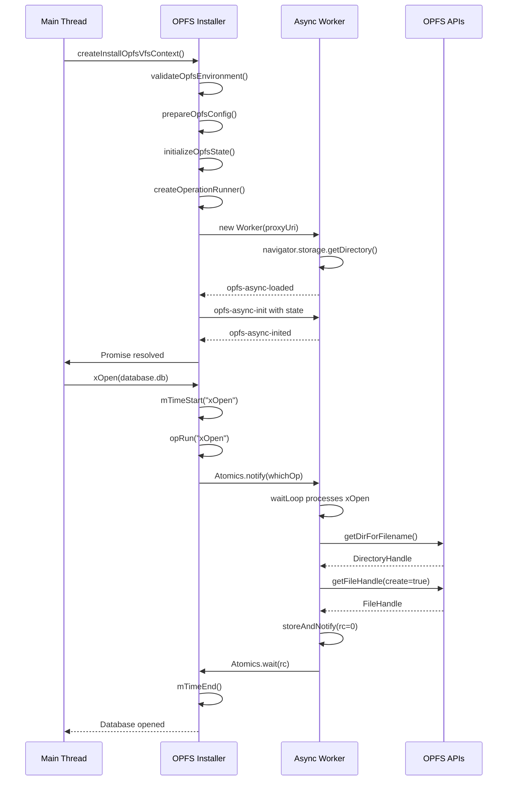

# Core Initialization

<cite>
**Referenced Files in This Document**   
- [config-setup.mjs](file://src/jswasm/vfs/opfs/installer/core/config-setup.mjs)
- [environment-validation.mjs](file://src/jswasm/vfs/opfs/installer/core/environment-validation.mjs)
- [state-initialization.mjs](file://src/jswasm/vfs/opfs/installer/core/state-initialization.mjs)
- [operation-runner.mjs](file://src/jswasm/vfs/opfs/installer/core/operation-runner.mjs)
- [vfs-sync-wrappers.mjs](file://src/jswasm/vfs/opfs/installer/wrappers/vfs-sync-wrappers.mjs)
- [index.mjs](file://src/jswasm/vfs/opfs/installer/index.mjs)
- [sqlite3-opfs-async-proxy.js](file://src/jswasm/vfs/opfs/sqlite3-opfs-async-proxy.js)
</cite>

## Table of Contents
1. [Configuration Setup](#configuration-setup)
2. [Environment Validation](#environment-validation)
3. [State Initialization](#state-initialization)
4. [Initialization Workflow](#initialization-workflow)
5. [Error Handling](#error-handling)
6. [Performance Considerations](#performance-considerations)

## Configuration Setup

The `config-setup.mjs` module handles configuration parsing and default settings for OPFS integration. It normalizes user-provided options and applies default values when necessary. The module processes URL parameters to allow runtime configuration through query strings, such as `opfs-verbose` for setting verbosity levels and `opfs-sanity-check` for enabling sanity checks. When no options are provided, it creates an empty configuration object. The proxy worker URI is resolved either from user options or a default value, supporting both string and function-based URI providers. The configuration system also supports a disable flag via the `opfs-disable` URL parameter, allowing complete bypass of OPFS initialization when needed.

**Section sources**
- [config-setup.mjs](file://src/jswasm/vfs/opfs/installer/core/config-setup.mjs#L1-L45)

## Environment Validation

The `environment-validation.mjs` module ensures the current browser environment supports OPFS by validating three critical requirements. First, it checks for the presence of `SharedArrayBuffer` and `Atomics`, which are essential for cross-thread communication and require COOP/COEP headers to be enabled by the server. Second, it verifies that the code is running in a worker context, as OPFS requires `Atomics.wait()` which is only available in workers. Third, it confirms the availability of OPFS APIs including `FileSystemHandle`, `FileSystemDirectoryHandle`, `FileSystemFileHandle`, and the `createSyncAccessHandle` method. The module provides two complementary functions: `validateOpfsEnvironment` returns an error if OPFS is unsupported, while `thisThreadHasOPFS` returns a boolean indicating OPFS availability, allowing different use cases for environment checking.

**Section sources**
- [environment-validation.mjs](file://src/jswasm/vfs/opfs/installer/core/environment-validation.mjs#L1-L53)

## State Initialization

The `state-initialization.mjs` module bootstraps the initial VFS state with several critical components. It begins by detecting system endianness using a buffer test, which is essential for proper data serialization. The module then configures shared buffers, including a 64KB file buffer (`fileBufferSize`) and a serialization buffer (`sabS11nSize`) sized based on the maximum pathname length. These buffers are combined into a single `SharedArrayBuffer` (`sabIO`) for efficient memory management. The module defines operation IDs for all supported VFS operations, mapping string names to numeric indices for fast lookup. It also initializes metrics tracking for performance monitoring and maps SQLite constants to JavaScript properties for consistent error handling. Thread safety is ensured through the use of `SharedArrayBuffer` and atomic operations.

**Section sources**
- [state-initialization.mjs](file://src/jswasm/vfs/opfs/installer/core/state-initialization.mjs#L1-L127)

## Initialization Workflow

The OPFS initialization process follows a coordinated sequence across multiple modules. The entry point is `createInstallOpfsVfsContext` in `index.mjs`, which orchestrates the entire setup. The workflow begins with environment validation, followed by configuration normalization. The system then creates VFS structures and initializes a worker for async operations. Key state components are initialized in sequence: shared buffers, operation runner, metrics, and serialization utilities. The `operation-runner.mjs` module creates a function that executes OPFS operations through the async worker using atomic notifications. The `vfs-sync-wrappers.mjs` module provides synchronous wrappers for VFS operations like `xOpen`, `xAccess`, and `xDelete`, which serialize arguments and wait for completion via atomic operations. During database open operations, these modules coordinate: configuration determines proxy URI, environment validation ensures compatibility, state initialization sets up shared memory, and operation runners execute the actual filesystem calls.

**Diagram sources**
- [index.mjs](file://src/jswasm/vfs/opfs/installer/index.mjs#L100-L363)
- [state-initialization.mjs](file://src/jswasm/vfs/opfs/installer/core/state-initialization.mjs#L1-L127)
- [operation-runner.mjs](file://src/jswasm/vfs/opfs/installer/core/operation-runner.mjs#L1-L85)
- [sqlite3-opfs-async-proxy.js](file://src/jswasm/vfs/opfs/sqlite3-opfs-async-proxy.js#L1-L692)

## Error Handling

Error conditions are systematically handled throughout the initialization process. Missing OPFS permissions result in specific error messages that guide developers to implement COOP/COEP headers. The `validateOpfsEnvironment` function returns descriptive errors for each failure case, such as missing `SharedArrayBuffer` or `Atomics`. During worker initialization, timeout and error handlers provide feedback on proxy loading failures. In the async worker, operations wrap their logic in try-catch blocks and use `storeAndNotify` to communicate error codes back to the main thread. The `GetSyncHandleError` class in the async proxy converts DOM exceptions to SQLite error codes, such as mapping `NotFoundError` to `SQLITE_CANTOPEN`. Errors are serialized and propagated through the shared buffer, ensuring consistent error reporting across the thread boundary. The main thread's `opRun` function handles these error codes and can log or throw them as appropriate.

**Section sources**
- [environment-validation.mjs](file://src/jswasm/vfs/opfs/installer/core/environment-validation.mjs#L1-L53)
- [sqlite3-opfs-async-proxy.js](file://src/jswasm/vfs/opfs/sqlite3-opfs-async-proxy.js#L139-L166)

## Performance Considerations

Initialization latency is optimized through several strategies. The system uses pre-allocated `SharedArrayBuffer` instances to avoid runtime memory allocation overhead. Operation IDs are pre-computed during initialization, enabling O(1) lookup during execution. The async worker employs a wait loop with configurable idle time (150ms by default) to balance responsiveness and CPU usage. Metrics tracking is built into the initialization process, with `initializeMetrics` creating counters for each operation to monitor performance. The `createOperationTimer` function provides precise timing for VFS operations, recording both execution time and wait time. Cold-start times are minimized by deferring expensive operations like sanity checks until after the basic VFS is installed, and only running them when explicitly requested via configuration. The use of atomic operations and shared memory eliminates the need for JSON serialization between threads, significantly reducing overhead compared to message-based communication.

**Section sources**
- [state-initialization.mjs](file://src/jswasm/vfs/opfs/installer/core/state-initialization.mjs#L1-L127)
- [operation-runner.mjs](file://src/jswasm/vfs/opfs/installer/core/operation-runner.mjs#L59-L85)
- [index.mjs](file://src/jswasm/vfs/opfs/installer/index.mjs#L207-L213)