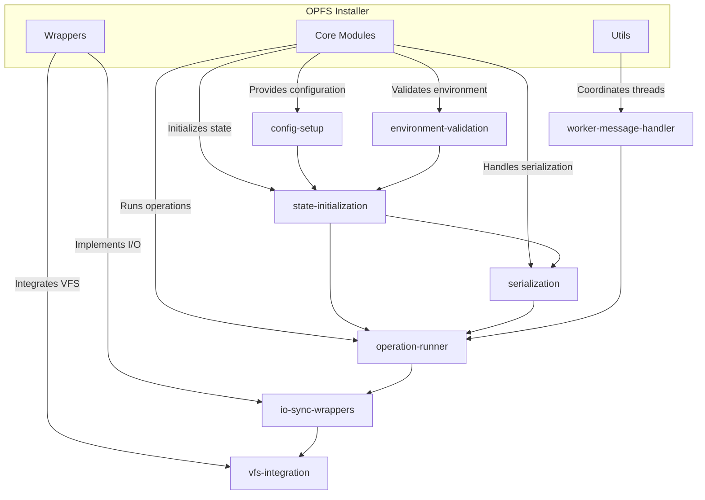
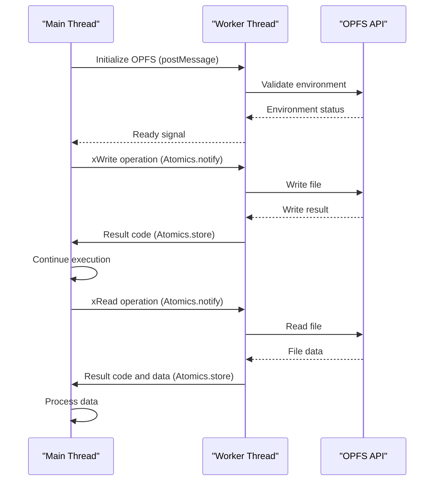
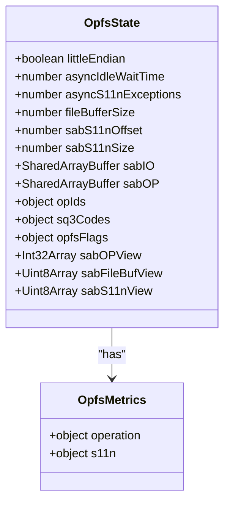
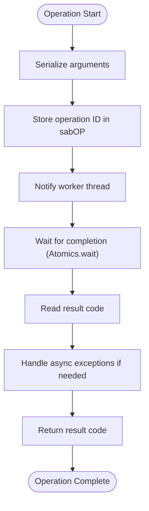
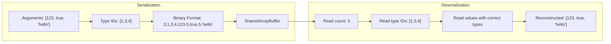
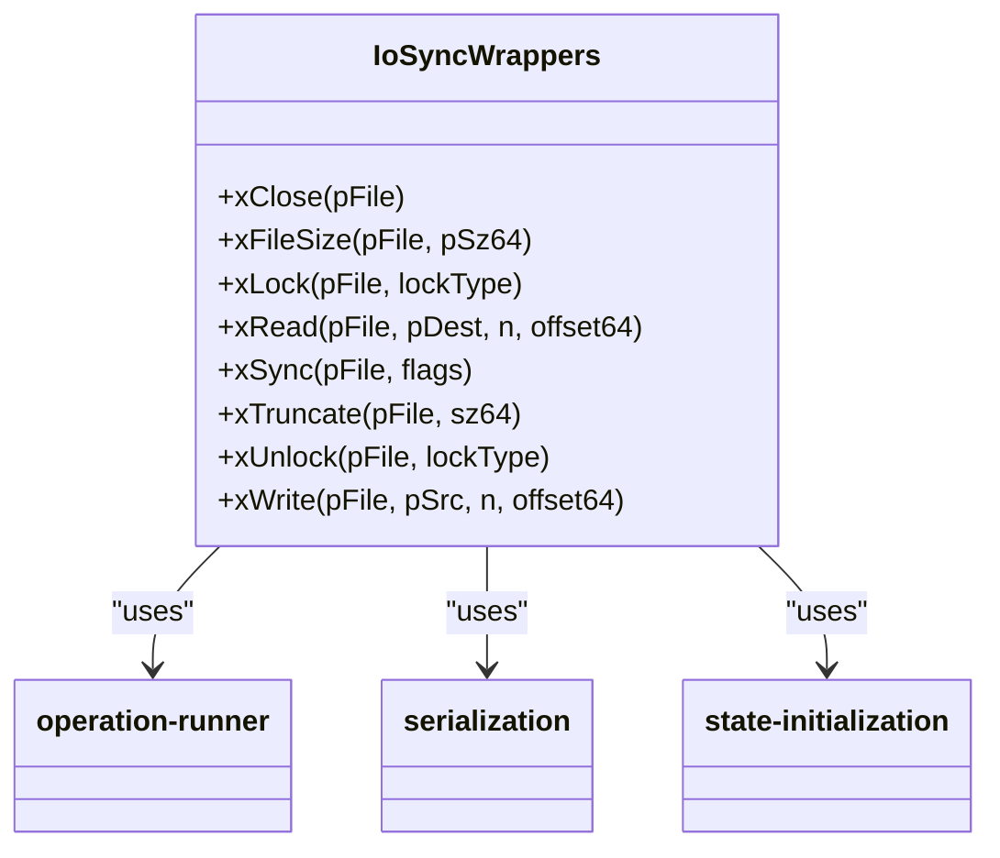
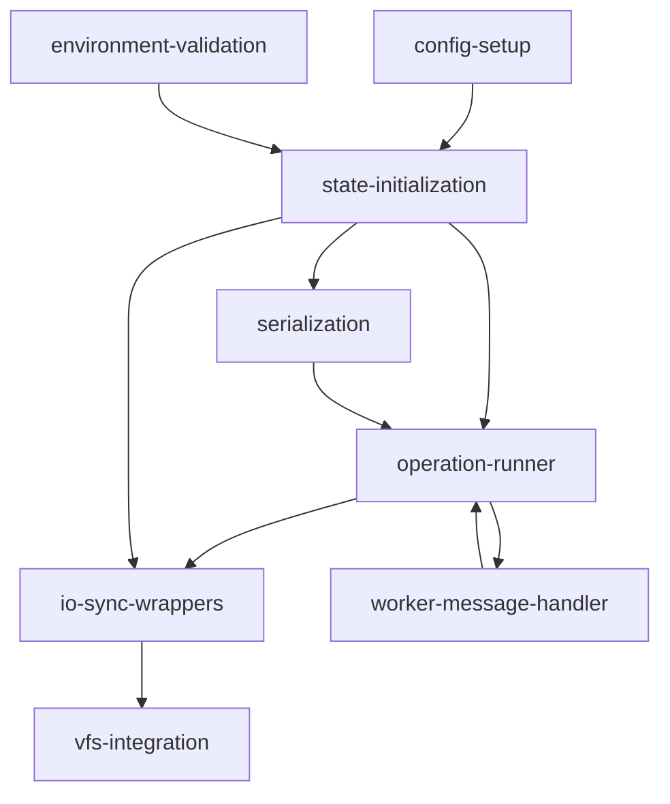

# OPFS Integration

<cite>
**Referenced Files in This Document**   
- [config-setup.mjs](file://src/jswasm/vfs/opfs/installer/core/config-setup.mjs)
- [environment-validation.mjs](file://src/jswasm/vfs/opfs/installer/core/environment-validation.mjs)
- [state-initialization.mjs](file://src/jswasm/vfs/opfs/installer/core/state-initialization.mjs)
- [operation-runner.mjs](file://src/jswasm/vfs/opfs/installer/core/operation-runner.mjs)
- [serialization.mjs](file://src/jswasm/vfs/opfs/installer/core/serialization.mjs)
- [worker-message-handler.mjs](file://src/jswasm/vfs/opfs/installer/utils/worker-message-handler.mjs)
- [io-sync-wrappers.mjs](file://src/jswasm/vfs/opfs/installer/wrappers/io-sync-wrappers.mjs)
- [vfs-integration.mjs](file://src/jswasm/vfs/opfs/installer/wrappers/vfs-integration.mjs)
</cite>

## Table of Contents

1. [Introduction](#introduction)
2. [Project Structure](#project-structure)
3. [Core Components](#core-components)
4. [Architecture Overview](#architecture-overview)
5. [Detailed Component Analysis](#detailed-component-analysis)
6. [Dependency Analysis](#dependency-analysis)
7. [Performance Considerations](#performance-considerations)
8. [Troubleshooting Guide](#troubleshooting-guide)
9. [Conclusion](#conclusion)

## Introduction

The OPFS (Origin Private File System) integration layer in web-sqlite-v2 enables persistent SQLite database storage in the browser by bridging the WASM SQLite engine with the OPFS API. This documentation explains how the OPFS installer facilitates this integration through a modular architecture that handles initialization, environment validation, state management, and synchronous I/O operations over the inherently asynchronous OPFS API. The system leverages SharedArrayBuffer and Atomics to coordinate between the main thread and a dedicated worker thread, enabling synchronous semantics required by SQLite while maintaining data persistence through OPFS.

## Project Structure

The OPFS integration layer is organized within the `src/jswasm/vfs/opfs/installer` directory, which contains three main subdirectories: `core`, `utils`, and `wrappers`. The `core` directory houses the fundamental modules for configuration setup, environment validation, state initialization, operation execution, and serialization. The `utils` directory contains utilities for worker communication and sanity checks, while the `wrappers` directory implements the VFS (Virtual File System) interface required by SQLite. This modular structure separates concerns and enables maintainable, testable code.

**Diagram sources**

- [config-setup.mjs](file://src/jswasm/vfs/opfs/installer/core/config-setup.mjs)
- [environment-validation.mjs](file://src/jswasm/vfs/opfs/installer/core/environment-validation.mjs)
- [state-initialization.mjs](file://src/jswasm/vfs/opfs/installer/core/state-initialization.mjs)
- [operation-runner.mjs](file://src/jswasm/vfs/opfs/installer/core/operation-runner.mjs)
- [serialization.mjs](file://src/jswasm/vfs/opfs/installer/core/serialization.mjs)
- [worker-message-handler.mjs](file://src/jswasm/vfs/opfs/installer/utils/worker-message-handler.mjs)
- [io-sync-wrappers.mjs](file://src/jswasm/vfs/opfs/installer/wrappers/io-sync-wrappers.mjs)
- [vfs-integration.mjs](file://src/jswasm/vfs/opfs/installer/wrappers/vfs-integration.mjs)

**Section sources**

- [config-setup.mjs](file://src/jswasm/vfs/opfs/installer/core/config-setup.mjs)
- [environment-validation.mjs](file://src/jswasm/vfs/opfs/installer/core/environment-validation.mjs)
- [state-initialization.mjs](file://src/jswasm/vfs/opfs/installer/core/state-initialization.mjs)
- [operation-runner.mjs](file://src/jswasm/vfs/opfs/installer/core/operation-runner.mjs)
- [serialization.mjs](file://src/jswasm/vfs/opfs/installer/core/serialization.mjs)
- [worker-message-handler.mjs](file://src/jswasm/vfs/opfs/installer/utils/worker-message-handler.mjs)
- [io-sync-wrappers.mjs](file://src/jswasm/vfs/opfs/installer/wrappers/io-sync-wrappers.mjs)
- [vfs-integration.mjs](file://src/jswasm/vfs/opfs/installer/wrappers/vfs-integration.mjs)

## Core Components

The OPFS integration layer consists of several core modules that work together to enable persistent SQLite storage in the browser. The `config-setup` module normalizes and prepares configuration options, including verbose logging and sanity checks. The `environment-validation` module ensures the browser environment supports OPFS by checking for SharedArrayBuffer, Atomics, and OPFS APIs. The `state-initialization` module creates the shared state object containing SharedArrayBuffers for communication between threads. The `operation-runner` executes OPFS operations through the async worker, while the `serialization` module handles encoding and decoding of data for SharedArrayBuffer communication.

**Section sources**

- [config-setup.mjs](file://src/jswasm/vfs/opfs/installer/core/config-setup.mjs)
- [environment-validation.mjs](file://src/jswasm/vfs/opfs/installer/core/environment-validation.mjs)
- [state-initialization.mjs](file://src/jswasm/vfs/opfs/installer/core/state-initialization.mjs)
- [operation-runner.mjs](file://src/jswasm/vfs/opfs/installer/core/operation-runner.mjs)
- [serialization.mjs](file://src/jswasm/vfs/opfs/installer/core/serialization.mjs)

## Architecture Overview

The OPFS integration architecture follows a worker-based model where the main thread communicates with a dedicated worker thread through SharedArrayBuffer and Atomics. The worker thread has direct access to OPFS APIs and performs all file operations, while the main thread uses synchronous wrappers to interact with the worker. This design enables the WASM SQLite engine to use synchronous I/O calls while maintaining data persistence through OPFS. The architecture includes a VFS layer that registers with SQLite and translates SQLite's I/O operations into messages sent to the worker thread.

**Diagram sources**

- [worker-message-handler.mjs](file://src/jswasm/vfs/opfs/installer/utils/worker-message-handler.mjs)
- [io-sync-wrappers.mjs](file://src/jswasm/vfs/opfs/installer/wrappers/io-sync-wrappers.mjs)

## Detailed Component Analysis

### Configuration Setup Analysis

The `config-setup` module normalizes and prepares OPFS configuration options before initialization. It handles user-provided options and URL parameters to determine verbose logging levels, sanity check activation, and proxy worker URI. The module also checks for a disable flag in URL parameters, allowing developers to disable OPFS for testing purposes. Configuration normalization ensures consistent behavior across different deployment scenarios.

**Section sources**

- [config-setup.mjs](file://src/jswasm/vfs/opfs/installer/core/config-setup.mjs)

### Environment Validation Analysis

The `environment-validation` module ensures the browser environment supports OPFS by checking for critical APIs and features. It verifies the presence of SharedArrayBuffer and Atomics, which are required for cross-thread communication. The module also confirms that the code is running in a worker context, as OPFS requires Atomics.wait(). Finally, it checks for OPFS-specific APIs like FileSystemHandle and createSyncAccessHandle. If any requirement is missing, the module returns an appropriate error explaining the missing feature and potential solutions.

**Section sources**

- [environment-validation.mjs](file://src/jswasm/vfs/opfs/installer/core/environment-validation.mjs)

### State Initialization Analysis

The `state-initialization` module creates the shared state object that coordinates communication between the main thread and worker thread. This state includes SharedArrayBuffers for I/O operations and operation serialization, as well as configuration parameters like buffer sizes and endianness detection. The module also defines operation IDs for different SQLite VFS operations, maps SQLite constants to JavaScript values, and sets up OPFS-specific flags. Metrics initialization enables performance monitoring of OPFS operations.

**Diagram sources**

- [state-initialization.mjs](file://src/jswasm/vfs/opfs/installer/core/state-initialization.mjs)

### Operation Runner Analysis

The `operation-runner` module creates a function that executes OPFS operations through the async worker. It uses Atomics to signal operations to the worker thread and wait for completion. The runner serializes operation arguments, stores the operation ID in the shared buffer, notifies the worker thread, and then busy-waits for the result. This synchronous waiting pattern enables the SQLite engine to use blocking I/O calls while the actual file operations occur asynchronously in the worker thread. The module also includes timing utilities for performance metrics.

**Diagram sources**

- [operation-runner.mjs](file://src/jswasm/vfs/opfs/installer/core/operation-runner.mjs)

### Serialization Analysis

The `serialization` module handles encoding and decoding of data for communication between threads via SharedArrayBuffer. It supports primitive types (number, bigint, boolean) and strings, using type identifiers to determine how to serialize each value. For numbers and bigints, it uses DataView methods with proper endianness handling. For strings, it uses TextEncoder and TextDecoder to convert between JavaScript strings and UTF-8 byte arrays. The serialization format includes a count of arguments followed by type IDs and the actual values, enabling efficient deserialization.

**Diagram sources**

- [serialization.mjs](file://src/jswasm/vfs/opfs/installer/core/serialization.mjs)

### Worker Message Handler Analysis

The `worker-message-handler` module coordinates communication between the main thread and worker context. It processes messages from the worker, including initialization signals, error notifications, and completion events. During initialization, it sends the shared state to the worker and installs the VFS with SQLite once the worker is ready. The handler also sets up shared array buffer views for efficient data access and runs sanity checks if requested. This component acts as the bridge between the synchronous SQLite API and the asynchronous worker-based implementation.

**Section sources**

- [worker-message-handler.mjs](file://src/jswasm/vfs/opfs/installer/utils/worker-message-handler.mjs)

### I/O Sync Wrappers Analysis

The `io-sync-wrappers` module implements SQLite's I/O interface methods (xRead, xWrite, xSync, etc.) using synchronous semantics over asynchronous OPFS. Each method calls the operation runner to execute the corresponding file operation in the worker thread. The wrappers manage file handles, lock states, and error conditions according to SQLite's requirements. For read and write operations, they coordinate data transfer between WASM memory and the shared buffer. These wrappers enable SQLite to perform file operations as if they were synchronous, while the actual I/O occurs asynchronously in the worker thread.

**Diagram sources**

- [io-sync-wrappers.mjs](file://src/jswasm/vfs/opfs/installer/wrappers/io-sync-wrappers.mjs)

### VFS Integration Analysis

The `vfs-integration` module registers the OPFS VFS with SQLite and provides optional methods like xRandomness and xSleep. It sets up post-open callbacks to configure database settings like busy timeout. The module also integrates with the OO1 API if available, creating an OpfsDb class that automatically uses the OPFS VFS. This integration enables higher-level database operations while maintaining the persistence benefits of OPFS. The VFS registration process ensures SQLite routes all file operations through the OPFS implementation.

**Section sources**

- [vfs-integration.mjs](file://src/jswasm/vfs/opfs/installer/wrappers/vfs-integration.mjs)

## Dependency Analysis

The OPFS integration layer follows a clear dependency hierarchy where core modules depend on minimal external interfaces, and higher-level components build upon the core functionality. The configuration, validation, and state initialization modules have no internal dependencies and can be used independently. The operation runner depends on the state object and serialization module. The I/O sync wrappers depend on the operation runner, state, and serialization. The worker message handler coordinates all components during initialization. This dependency structure enables modular testing and maintenance.

**Diagram sources**

- [config-setup.mjs](file://src/jswasm/vfs/opfs/installer/core/config-setup.mjs)
- [environment-validation.mjs](file://src/jswasm/vfs/opfs/installer/core/environment-validation.mjs)
- [state-initialization.mjs](file://src/jswasm/vfs/opfs/installer/core/state-initialization.mjs)
- [operation-runner.mjs](file://src/jswasm/vfs/opfs/installer/core/operation-runner.mjs)
- [serialization.mjs](file://src/jswasm/vfs/opfs/installer/core/serialization.mjs)
- [io-sync-wrappers.mjs](file://src/jswasm/vfs/opfs/installer/wrappers/io-sync-wrappers.mjs)
- [worker-message-handler.mjs](file://src/jswasm/vfs/opfs/installer/utils/worker-message-handler.mjs)
- [vfs-integration.mjs](file://src/jswasm/vfs/opfs/installer/wrappers/vfs-integration.mjs)

**Section sources**

- [config-setup.mjs](file://src/jswasm/vfs/opfs/installer/core/config-setup.mjs)
- [environment-validation.mjs](file://src/jswasm/vfs/opfs/installer/core/environment-validation.mjs)
- [state-initialization.mjs](file://src/jswasm/vfs/opfs/installer/core/state-initialization.mjs)
- [operation-runner.mjs](file://src/jswasm/vfs/opfs/installer/core/operation-runner.mjs)
- [serialization.mjs](file://src/jswasm/vfs/opfs/installer/core/serialization.mjs)
- [io-sync-wrappers.mjs](file://src/jswasm/vfs/opfs/installer/wrappers/io-sync-wrappers.mjs)
- [worker-message-handler.mjs](file://src/jswasm/vfs/opfs/installer/utils/worker-message-handler.mjs)
- [vfs-integration.mjs](file://src/jswasm/vfs/opfs/installer/wrappers/vfs-integration.mjs)

## Performance Considerations

The OPFS integration layer introduces performance implications due to the synchronous semantics imposed on asynchronous operations. The operation runner uses busy-waiting with Atomics.wait(), which blocks the worker thread until completion. This design choice enables compatibility with SQLite's synchronous I/O model but can impact performance under high load. The shared buffer sizes (64KB for file operations) represent a trade-off between memory usage and I/O efficiency. Serialization overhead is minimized by using binary formats and avoiding JSON. Error recovery is handled through the serialization layer, which can capture and propagate exceptions from the worker thread. For optimal performance, applications should batch database operations to reduce the number of cross-thread calls.

**Section sources**

- [operation-runner.mjs](file://src/jswasm/vfs/opfs/installer/core/operation-runner.mjs)
- [serialization.mjs](file://src/jswasm/vfs/opfs/installer/core/serialization.mjs)
- [state-initialization.mjs](file://src/jswasm/vfs/opfs/installer/core/state-initialization.mjs)

## Troubleshooting Guide

Common issues with OPFS integration typically relate to environment requirements and configuration. If OPFS is unavailable, check that the server emits COOP/COEP headers to enable SharedArrayBuffer. Verify that the code runs in a worker context, as OPFS requires Atomics.wait(). Ensure the browser supports OPFS APIs by checking for FileSystemHandle and createSyncAccessHandle. Configuration issues can be diagnosed using the verbose logging option. For serialization errors, verify that only supported data types are passed between threads. Performance issues may indicate excessive cross-thread calls, suggesting a need for operation batching.

**Section sources**

- [environment-validation.mjs](file://src/jswasm/vfs/opfs/installer/core/environment-validation.mjs)
- [config-setup.mjs](file://src/jswasm/vfs/opfs/installer/core/config-setup.mjs)
- [serialization.mjs](file://src/jswasm/vfs/opfs/installer/core/serialization.mjs)

## Conclusion

The OPFS integration layer in web-sqlite-v2 successfully bridges the WASM SQLite engine with the OPFS API, enabling persistent database storage in the browser. By using a worker-based architecture with SharedArrayBuffer and Atomics, it provides synchronous I/O semantics required by SQLite while maintaining data persistence through OPFS. The modular design separates concerns into configuration, validation, state management, operation execution, and serialization components. This architecture enables reliable, performant database operations in the browser environment, with proper error handling and performance monitoring capabilities.
