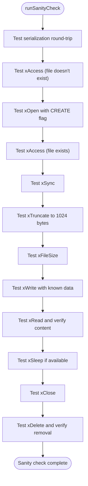

# Runtime Operations

<cite>
**Referenced Files in This Document**   
- [operation-runner.mjs](file://src/jswasm/vfs/opfs/installer/core/operation-runner.mjs)
- [serialization.mjs](file://src/jswasm/vfs/opfs/installer/core/serialization.mjs)
- [sanity-check.mjs](file://src/jswasm/vfs/opfs/installer/utils/sanity-check.mjs)
- [worker-message-handler.mjs](file://src/jswasm/vfs/opfs/installer/utils/worker-message-handler.mjs)
- [state-initialization.mjs](file://src/jswasm/vfs/opfs/installer/core/state-initialization.mjs)
- [io-sync-wrappers.mjs](file://src/jswasm/vfs/opfs/installer/wrappers/io-sync-wrappers.mjs)
- [vfs-sync-wrappers.mjs](file://src/jswasm/vfs/opfs/installer/wrappers/vfs-sync-wrappers.mjs)
- [opfs-vfs-installer.d.ts](file://src/jswasm/shared/opfs-vfs-installer.d.ts)
- [sqliteWorker.ts](file://src/sqliteWorker.ts)
</cite>

## Table of Contents

1. [Introduction](#introduction)
2. [Operation Runner](#operation-runner)
3. [Serialization Layer](#serialization-layer)
4. [Sanity Checking](#sanity-checking)
5. [Worker Message Handling](#worker-message-handling)
6. [Database Write Transaction Flow](#database-write-transaction-flow)
7. [Performance Considerations](#performance-considerations)
8. [Error Recovery](#error-recovery)

## Introduction

The OPFS runtime operations layer in web-sqlite-v2 provides a sophisticated mechanism for managing asynchronous file operations through the Origin Private File System (OPFS) while maintaining synchronous-looking APIs for SQLite operations. This architecture leverages SharedArrayBuffer for zero-copy data transfer and Atomics for thread coordination between the main thread and a dedicated worker thread. The system orchestrates file operations (read, write, truncate) through a carefully designed coordination layer that manages promises, serializes data, validates integrity, and handles bidirectional messaging.

**Section sources**

- [operation-runner.mjs](file://src/jswasm/vfs/opfs/installer/core/operation-runner.mjs#L1-L85)
- [serialization.mjs](file://src/jswasm/vfs/opfs/installer/core/serialization.mjs#L1-L150)

## Operation Runner

The operation-runner.mjs module orchestrates asynchronous OPFS file operations by managing promises and coordinating with the WASM heap through atomic operations. The `createOperationRunner` function returns a closure that executes operations atomically using SharedArrayBuffer views.

The operation runner follows a four-phase process:

1. **Input handling**: Validates the operation ID against the state's opIds mapping
2. **Core processing**: Serializes arguments, sets up atomic operation state, and notifies the worker
3. **Synchronization**: Busy-waits using Atomics.wait() until the operation completes
4. **Output handling**: Reads the result code and handles any async exceptions

The runner uses two SharedArrayBuffers: sabOP for operation control and sabIO for data transfer. Operation codes are stored in sabOPView at predefined offsets (whichOp, rc), enabling the worker to determine what operation to perform and where to write the result.


**Diagram sources**

- [operation-runner.mjs](file://src/jswasm/vfs/opfs/installer/core/operation-runner.mjs#L17-L51)

**Section sources**

- [operation-runner.mjs](file://src/jswasm/vfs/opfs/installer/core/operation-runner.mjs#L9-L51)

## Serialization Layer

The serialization.mjs module implements structured cloning for transferring file data between the main thread and worker, preserving metadata and supporting various data types. The `createSerializer` function creates a serializer interface with serialize and deserialize methods that use a dedicated region of the sabIO buffer.

The serialization format uses a simple but effective scheme:

- Byte 0: Argument count (argc)
- Bytes 1-n: Type IDs for each argument
- Subsequent bytes: Serialized values with type-specific encoding

Supported types include:

- **Number**: 8-byte float64 with getFloat64/setFloat64
- **BigInt**: 8-byte bigInt64 with getBigInt64/setBigInt64
- **Boolean**: 4-byte int32 with getInt32/setInt32
- **String**: Length-prefixed UTF-8 encoded text

During serialization, the serializer writes the argument count followed by type IDs, then the actual values with appropriate encoding. For strings, it writes the byte length as int32 followed by the UTF-8 encoded text. Deserialization reverses this process, reading the type IDs first to determine how to interpret the subsequent data.

```mermaid
flowchart TD
Start([serialize(...args)]) --> CheckArgs["Check if args.length > 0"]
CheckArgs --> |No| SetCount["Set viewU8[0] = 0"]
CheckArgs --> |Yes| WriteCount["Set viewU8[0] = args.length"]
WriteCount --> WriteTypeIds["Write type IDs to buffer"]
WriteTypeIds --> ProcessValues["For each argument"]
ProcessValues --> IsPrimitive{"Is primitive type?"}
IsPrimitive --> |Yes| WriteValue["Write value with appropriate setter"]
IsPrimitive --> |No| HandleString["Encode string with TextEncoder"]
HandleString --> WriteLength["Write length as int32"]
HandleString --> WriteData["Write UTF-8 bytes"]
WriteValue --> NextArg
WriteData --> NextArg
NextArg --> MoreArgs{"More arguments?"}
MoreArgs --> |Yes| ProcessValues
MoreArgs --> |No| End([Complete])
```

**Diagram sources**

- [serialization.mjs](file://src/jswasm/vfs/opfs/installer/core/serialization.mjs#L116-L147)

**Section sources**

- [serialization.mjs](file://src/jswasm/vfs/opfs/installer/core/serialization.mjs#L7-L149)

## Sanity Checking

The sanity-check.mjs module provides validation routines that ensure file integrity and consistency before and after operations. The `runSanityCheck` function performs a comprehensive suite of tests to verify the OPFS VFS implementation is functioning correctly.

The sanity check process includes:

1. **Serialization validation**: Tests that string serialization/deserialization preserves data integrity
2. **File existence checks**: Uses xAccess to verify file presence before and after operations
3. **File operations**: Tests xOpen, xClose, xRead, xWrite, xTruncate, xFileSize, and xSync
4. **Data integrity verification**: Writes known data and reads it back to confirm accuracy

The check creates a temporary file in the "/sanity/check/" directory and performs a sequence of operations, validating each step with appropriate assertions. For example, after writing data with xWrite, it reads it back with xRead and compares the result to the expected value ("sanity"). If any test fails, the `toss` utility throws an error, aborting the sanity check.



**Diagram sources**

- [sanity-check.mjs](file://src/jswasm/vfs/opfs/installer/utils/sanity-check.mjs#L5-L115)

**Section sources**

- [sanity-check.mjs](file://src/jswasm/vfs/opfs/installer/utils/sanity-check.mjs#L5-L123)

## Worker Message Handling

The worker-message-handler.mjs module implements a bidirectional message protocol that enables synchronous-looking calls over asynchronous channels using SharedArrayBuffer signaling. The `createWorkerMessageHandler` function returns a handler for messages from the OPFS async worker.

The message handler processes three primary message types:

- **opfs-unavailable**: Rejects the installation promise when OPFS is not available
- **opfs-async-loaded**: Sends initialization data to the worker when it's ready
- **opfs-async-inited**: Completes the installation process when the worker is initialized

When the worker signals "opfs-async-loaded", the handler sends the state configuration (excluding functions) via postMessage. This includes buffer offsets, operation IDs, and other configuration parameters needed by the worker. Once the worker responds with "opfs-async-inited", the handler installs the VFS, sets up SharedArrayBuffer views, runs sanity checks if requested, and resolves the installation promise.


**Diagram sources**

- [worker-message-handler.mjs](file://src/jswasm/vfs/opfs/installer/utils/worker-message-handler.mjs#L26-L111)

**Section sources**

- [worker-message-handler.mjs](file://src/jswasm/vfs/opfs/installer/utils/worker-message-handler.mjs#L6-L126)

## Database Write Transaction Flow

A database write transaction flows through multiple components in the OPFS runtime operations layer. When a write operation is initiated, it follows this path:

1. **SQLite API call**: The application calls a SQLite API that requires file writing
2. **VFS wrapper invocation**: The VFS sync wrapper (xWrite) is called with the file pointer, source buffer, byte count, and offset
3. **Operation runner invocation**: The wrapper calls opRun("xWrite", ...) with the necessary parameters
4. **Serialization**: The operation runner serializes the arguments (file pointer, byte count, offset) into the sabIO buffer
5. **Atomic signaling**: The runner sets the operation code in sabOPView and notifies the worker
6. **Worker processing**: The worker receives the operation, deserializes the arguments, and performs the actual OPFS write
7. **Result signaling**: The worker writes the result code to sabOPView and notifies the main thread
8. **Completion**: The operation runner reads the result code and returns it to the VFS wrapper

The io-sync-wrappers.mjs module's xWrite function demonstrates this flow, where it sets up timing metrics, calls opRun with the write parameters, and handles any errors that occur during the operation.

**Section sources**

- [io-sync-wrappers.mjs](file://src/jswasm/vfs/opfs/installer/wrappers/io-sync-wrappers.mjs#L215-L232)
- [operation-runner.mjs](file://src/jswasm/vfs/opfs/installer/core/operation-runner.mjs#L17-L51)
- [serialization.mjs](file://src/jswasm/vfs/opfs/installer/core/serialization.mjs#L116-L147)

## Performance Considerations

The structured cloning implementation in serialization.mjs introduces overhead that impacts performance, particularly for large data transfers. The serialization process involves multiple steps that contribute to this overhead:

- **Type checking and ID assignment**: Each argument must be checked for its type and assigned a type ID
- **Buffer management**: The serializer must manage offsets and ensure proper alignment
- **String encoding/decoding**: UTF-8 encoding and decoding of strings adds computational cost
- **Memory copying**: Data is copied between different buffer views during serialization

To mitigate these performance implications, the system employs several strategies:

1. **Batching operations**: Multiple operations can be batched to reduce the overhead of atomic signaling
2. **Buffer reuse**: SharedArrayBuffers are reused across operations to avoid allocation overhead
3. **Zero-copy transfers**: For large data, the system uses the file buffer (sabFileBufView) directly, avoiding serialization of the actual file data
4. **Asynchronous processing**: Operations are handled in a separate worker thread, preventing main thread blocking

The metrics system tracks performance with three key measurements for each operation:

- **count**: Number of times the operation was called
- **time**: Total time spent in the operation (excluding wait time)
- **wait**: Total time spent waiting for the worker to complete

These metrics help identify performance bottlenecks and optimize the system accordingly.

**Section sources**

- [serialization.mjs](file://src/jswasm/vfs/opfs/installer/core/serialization.mjs#L68-L149)
- [operation-runner.mjs](file://src/jswasm/vfs/opfs/installer/core/operation-runner.mjs#L31-L37)
- [state-initialization.mjs](file://src/jswasm/vfs/opfs/installer/core/state-initialization.mjs#L108-L126)

## Error Recovery

Error recovery in the OPFS runtime operations layer is handled through a combination of serialization validation, exception handling, and transaction rollback mechanisms. When serialization fails, the system follows a specific recovery process:

1. **Serialization failure detection**: If an error occurs during serialization or deserialization, it is caught and logged
2. **Async exception handling**: The operation runner checks for async exceptions by examining the asyncS11nExceptions flag and attempting to deserialize an error object
3. **Error propagation**: Deserialized errors are logged and propagated back through the call stack
4. **Transaction rollback**: SQLite's transaction system automatically rolls back changes when an error is detected

The operation runner specifically handles serialization failures in its error handling section (lines 43-47), where it checks if the result code indicates an error and async exceptions are enabled. If so, it attempts to deserialize the error object and logs it using the error utility function.

The system also employs defensive programming practices, such as validating operation IDs and ensuring proper cleanup of resources in finally blocks, to prevent cascading failures and resource leaks.

**Section sources**

- [operation-runner.mjs](file://src/jswasm/vfs/opfs/installer/core/operation-runner.mjs#L43-L47)
- [serialization.mjs](file://src/jswasm/vfs/opfs/installer/core/serialization.mjs#L73-L109)
- [io-sync-wrappers.mjs](file://src/jswasm/vfs/opfs/installer/wrappers/io-sync-wrappers.mjs#L148-L151)
