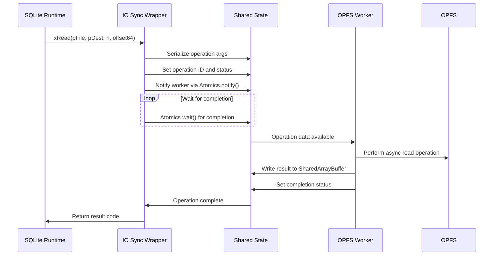
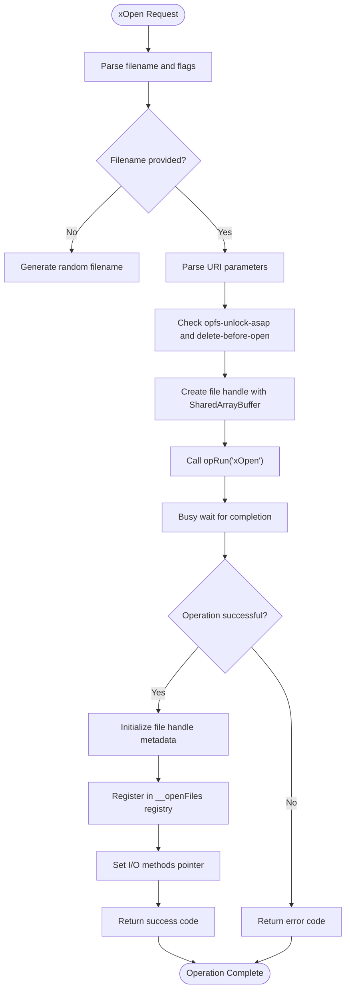
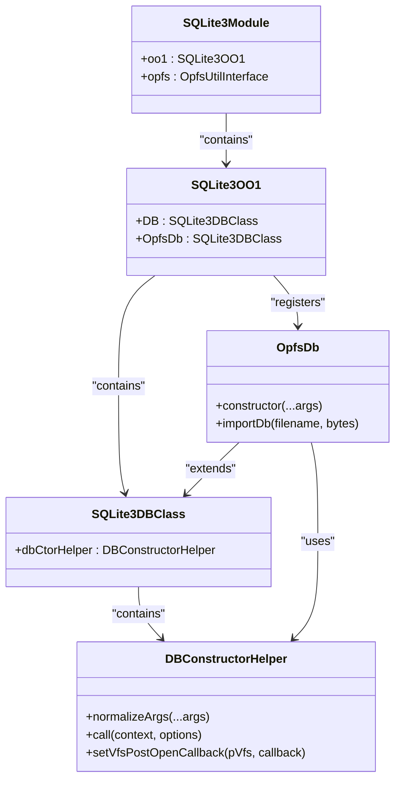
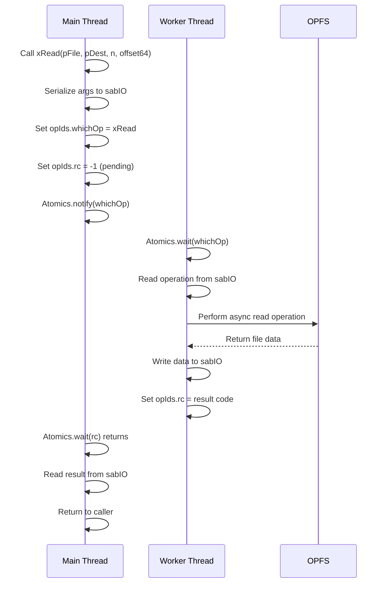
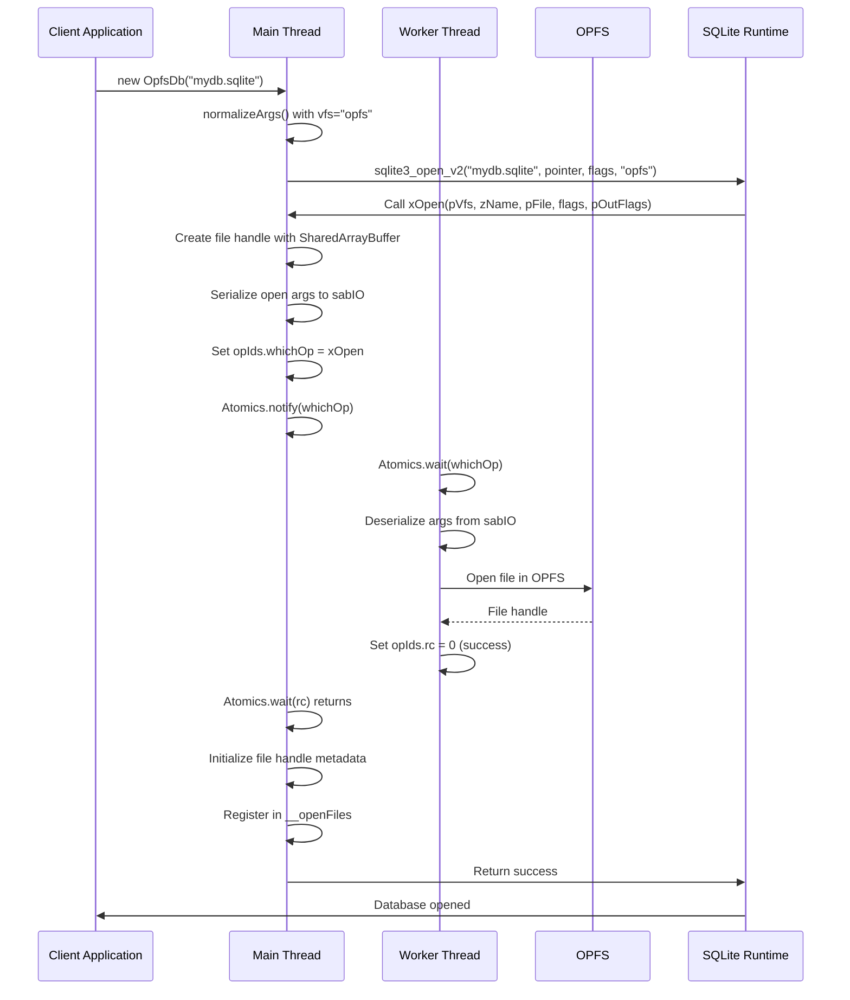
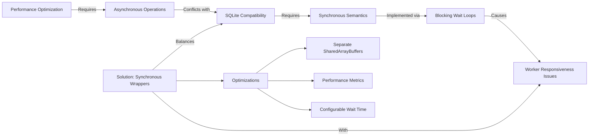

# Wrapper Interfaces

<cite>
**Referenced Files in This Document**   
- [io-sync-wrappers.mjs](file://src/jswasm/vfs/opfs/installer/wrappers/io-sync-wrappers.mjs)
- [vfs-sync-wrappers.mjs](file://src/jswasm/vfs/opfs/installer/wrappers/vfs-sync-wrappers.mjs)
- [vfs-integration.mjs](file://src/jswasm/vfs/opfs/installer/wrappers/vfs-integration.mjs)
- [operation-runner.mjs](file://src/jswasm/vfs/opfs/installer/core/operation-runner.mjs)
- [worker-message-handler.mjs](file://src/jswasm/vfs/opfs/installer/utils/worker-message-handler.mjs)
- [state-initialization.mjs](file://src/jswasm/vfs/opfs/installer/core/state-initialization.mjs)
- [config-setup.mjs](file://src/jswasm/vfs/opfs/installer/core/config-setup.mjs)
- [db-ctor-helper.mjs](file://src/jswasm/api/oo1-db/db-ctor-helper.mjs)
</cite>

## Table of Contents
1. [Introduction](#introduction)
2. [IO Synchronization Wrappers](#io-synchronization-wrappers)
3. [VFS Synchronization Wrappers](#vfs-synchronization-wrappers)
4. [VFS Integration and Lifecycle Management](#vfs-integration-and-lifecycle-management)
5. [Synchronous Wrapper Implementation](#synchronous-wrapper-implementation)
6. [Database Open Sequence](#database-open-sequence)
7. [Performance and Responsiveness Trade-offs](#performance-and-responsiveness-trade-offs)
8. [Common Issues and Error Handling](#common-issues-and-error-handling)
9. [Conclusion](#conclusion)

## Introduction
The web-sqlite-v2 project implements a SQLite virtual file system (VFS) that enables SQLite to operate on the Origin Private File System (OPFS) through synchronous wrapper interfaces. This documentation details how the wrapper interfaces bridge SQLite's expectation of synchronous file operations with OPFS's inherently asynchronous nature using SharedArrayBuffer and Atomics for cross-thread communication. The implementation allows SQLite to perform file operations on OPFS while maintaining compatibility with SQLite's C-style API expectations.

**Section sources**
- [io-sync-wrappers.mjs](file://src/jswasm/vfs/opfs/installer/wrappers/io-sync-wrappers.mjs#L1-L236)
- [vfs-sync-wrappers.mjs](file://src/jswasm/vfs/opfs/installer/wrappers/vfs-sync-wrappers.mjs#L1-L160)
- [vfs-integration.mjs](file://src/jswasm/vfs/opfs/installer/wrappers/vfs-integration.mjs#L1-L74)

## IO Synchronization Wrappers
The `io-sync-wrappers.mjs` module implements SQLite's `sqlite3_io_methods` interface using synchronous semantics over asynchronous OPFS APIs. Each I/O method in this wrapper translates SQLite's synchronous file operation requests into asynchronous operations on a worker thread, using blocking wait loops to maintain synchronous semantics from SQLite's perspective.

The wrapper implements key I/O methods including `xRead`, `xWrite`, `xFileSize`, `xTruncate`, `xSync`, `xLock`, and `xUnlock`. Each method follows a consistent pattern: input handling, core processing through the operation runner, and output handling. The implementation uses a shared state object that contains a SharedArrayBuffer for communication between the main thread and worker thread.

For file operations, the wrapper maintains an `__openFiles` registry that tracks open file handles, their SharedArrayBuffers, and metadata like lock status. When reading or writing data, the wrapper copies data between SQLite's memory space and the SharedArrayBuffer, which is then processed by the worker thread for actual OPFS operations.

**Diagram sources**
- [io-sync-wrappers.mjs](file://src/jswasm/vfs/opfs/installer/wrappers/io-sync-wrappers.mjs#L136-L156)
- [operation-runner.mjs](file://src/jswasm/vfs/opfs/installer/core/operation-runner.mjs#L17-L51)

**Section sources**
- [io-sync-wrappers.mjs](file://src/jswasm/vfs/opfs/installer/wrappers/io-sync-wrappers.mjs#L1-L236)

## VFS Synchronization Wrappers
The `vfs-sync-wrappers.mjs` module implements SQLite's `sqlite3_vfs` methods including `xOpen`, `xDelete`, and `xAccess`, translating SQLite's C-style file operations into OPFS operations. These wrappers provide the filesystem-level interface that SQLite uses to manage files and directories.

The `xOpen` method is particularly important as it handles database file opening. When SQLite requests to open a file, the wrapper generates or parses the filename, creates a file handle with a SharedArrayBuffer, and initiates the asynchronous open operation through the worker thread. The wrapper supports URI parameters like "opfs-unlock-asap" and "delete-before-open" that modify the behavior of file operations.

The `xAccess` method checks file accessibility by delegating to the worker thread, while `xDelete` removes files from OPFS. The wrapper also implements utility methods like `xFullPathname` for path resolution and `xCurrentTime` for timestamp operations. All methods use the same synchronous pattern of communicating with the worker thread via SharedArrayBuffer and Atomics.

**Diagram sources**
- [vfs-sync-wrappers.mjs](file://src/jswasm/vfs/opfs/installer/wrappers/vfs-sync-wrappers.mjs#L110-L157)
- [io-sync-wrappers.mjs](file://src/jswasm/vfs/opfs/installer/wrappers/io-sync-wrappers.mjs#L35-L54)

**Section sources**
- [vfs-sync-wrappers.mjs](file://src/jswasm/vfs/opfs/installer/wrappers/vfs-sync-wrappers.mjs#L1-L160)

## VFS Integration and Lifecycle Management
The `vfs-integration.mjs` module handles the registration of the custom VFS with the SQLite runtime via `sqlite3_vfs_register` and manages the VFS lifecycle. This module contains two key functions: `setupOptionalVfsMethods` and `integrateWithOo1`.

The `setupOptionalVfsMethods` function configures optional VFS methods like `xRandomness` and `xSleep`. If the default VFS provides these methods, they are inherited; otherwise, fallback implementations are provided. The `xSleep` implementation uses `Atomics.wait()` on the shared OPFS view, allowing SQLite to pause execution for a specified duration.

The `integrateWithOo1` function integrates the OPFS VFS with SQLite's OO1 API by creating an `OpfsDb` class that automatically uses the OPFS VFS. It also sets a post-open callback that configures a 10-second busy timeout on newly opened databases, improving reliability in concurrent environments.

**Diagram sources**
- [vfs-integration.mjs](file://src/jswasm/vfs/opfs/installer/wrappers/vfs-integration.mjs#L55-L65)
- [db-ctor-helper.mjs](file://src/jswasm/api/oo1-db/db-ctor-helper.mjs#L159-L162)

**Section sources**
- [vfs-integration.mjs](file://src/jswasm/vfs/opfs/installer/wrappers/vfs-integration.mjs#L1-L74)

## Synchronous Wrapper Implementation
The synchronous wrapper implementation uses a sophisticated communication mechanism between the main thread and a worker thread to translate asynchronous OPFS operations into synchronous SQLite calls. This is achieved through three key components: SharedArrayBuffer for shared memory, Atomics for thread synchronization, and a message passing protocol.

The implementation creates two SharedArrayBuffers: `sabIO` for data transfer and `sabOP` for operation control. The `sabOP` buffer contains operation IDs and status flags that coordinate communication between threads. When a synchronous wrapper method is called, it serializes the operation parameters into the shared buffer, sets the operation ID, and uses `Atomics.notify()` to signal the worker thread.

The worker thread waits for operations using `Atomics.wait()`, processes the requested OPFS operation asynchronously, and writes the result back to the shared buffer. The main thread uses a busy-wait loop with `Atomics.wait()` to block until the operation completes, maintaining synchronous semantics for SQLite.

**Diagram sources**
- [operation-runner.mjs](file://src/jswasm/vfs/opfs/installer/core/operation-runner.mjs#L17-L51)
- [worker-message-handler.mjs](file://src/jswasm/vfs/opfs/installer/utils/worker-message-handler.mjs#L57-L106)

**Section sources**
- [operation-runner.mjs](file://src/jswasm/vfs/opfs/installer/core/operation-runner.mjs#L1-L85)
- [state-initialization.mjs](file://src/jswasm/vfs/opfs/installer/core/state-initialization.mjs#L8-L101)

## Database Open Sequence
The database open sequence begins when a client requests to open a database using the OPFS VFS. This triggers a series of operations that register the VFS, initialize the worker thread, and open the database file. The sequence involves coordination between the main thread, the worker thread, and SQLite's internal mechanisms.

When the VFS is first installed, the system sets up the SharedArrayBuffers, initializes the operation IDs, and starts the worker thread. The worker thread loads and initializes, then sends a message back to the main thread indicating readiness. The main thread then installs the VFS with SQLite and sets up the necessary views on the shared buffers.

For a database open request, the `xOpen` method in the VFS wrapper creates a file handle with a SharedArrayBuffer, sends the open request to the worker thread, and waits for completion. The worker thread accesses OPFS, creates or opens the file, and returns a success or error code.

**Diagram sources**
- [vfs-sync-wrappers.mjs](file://src/jswasm/vfs/opfs/installer/wrappers/vfs-sync-wrappers.mjs#L110-L157)
- [worker-message-handler.mjs](file://src/jswasm/vfs/opfs/installer/utils/worker-message-handler.mjs#L66-L70)
- [db-ctor-helper.mjs](file://src/jswasm/api/oo1-db/db-ctor-helper.mjs#L108-L113)

**Section sources**
- [vfs-sync-wrappers.mjs](file://src/jswasm/vfs/opfs/installer/wrappers/vfs-sync-wrappers.mjs#L110-L157)
- [worker-message-handler.mjs](file://src/jswasm/vfs/opfs/installer/utils/worker-message-handler.mjs#L57-L106)

## Performance and Responsiveness Trade-offs
The synchronous wrapper implementation involves significant trade-offs between compatibility and worker thread responsiveness. By using blocking wait loops, the implementation maintains compatibility with SQLite's expectation of synchronous file operations, but this comes at the cost of potentially blocking the worker thread during I/O operations.

The implementation uses a busy-wait loop with `Atomics.wait()` to block the main thread until the worker completes an operation. While this provides true synchronous semantics, it can impact performance, especially for operations that take longer to complete. The system includes metrics tracking to monitor operation times and wait times, helping identify performance bottlenecks.

To mitigate responsiveness issues, the implementation includes several optimizations. The `asyncIdleWaitTime` parameter controls how long the worker thread waits between operations, balancing responsiveness with CPU usage. The system also uses separate SharedArrayBuffers for data (`sabIO`) and control operations (`sabOP`), reducing contention.

The trade-off is necessary because SQLite's architecture assumes synchronous file operations, and modifying SQLite to support asynchronous I/O would be significantly more complex than implementing synchronous wrappers around asynchronous APIs.

**Diagram sources**
- [operation-runner.mjs](file://src/jswasm/vfs/opfs/installer/core/operation-runner.mjs#L32-L37)
- [state-initialization.mjs](file://src/jswasm/vfs/opfs/installer/core/state-initialization.mjs#L21-L23)

**Section sources**
- [operation-runner.mjs](file://src/jswasm/vfs/opfs/installer/core/operation-runner.mjs#L17-L51)
- [state-initialization.mjs](file://src/jswasm/vfs/opfs/installer/core/state-initialization.mjs#L108-L126)

## Common Issues and Error Handling
The wrapper implementation addresses several common issues that arise when bridging synchronous and asynchronous APIs. Deadlocks during I/O operations are prevented through careful coordination of the SharedArrayBuffer and Atomics operations. The system uses a well-defined protocol where each operation follows a strict sequence: serialize arguments, set operation ID, notify worker, wait for completion.

Timeout handling is implemented through the worker thread's operation processing. If an operation takes too long, the system can detect this through the metrics tracking and potentially terminate the operation. The `asyncS11nExceptions` flag controls whether exceptions from the worker thread are propagated back to the main thread.

Error handling is comprehensive, with each wrapper method catching exceptions and returning appropriate SQLite error codes. For example, `xRead` and `xWrite` methods catch errors and return `SQLITE_IOERR_READ` or `SQLITE_IOERR_WRITE` as appropriate. The system also includes sanity checks that can be enabled via URL parameters for debugging purposes.

Resource management is handled through proper cleanup of SharedArrayBuffers and file handles. The `xClose` method removes file handles from the `__openFiles` registry and disposes of associated resources, preventing memory leaks.

**Section sources**
- [io-sync-wrappers.mjs](file://src/jswasm/vfs/opfs/installer/wrappers/io-sync-wrappers.mjs#L148-L151)
- [io-sync-wrappers.mjs](file://src/jswasm/vfs/opfs/installer/wrappers/io-sync-wrappers.mjs#L225-L228)
- [state-initialization.mjs](file://src/jswasm/vfs/opfs/installer/core/state-initialization.mjs#L22-L23)
- [config-setup.mjs](file://src/jswasm/vfs/opfs/installer/core/config-setup.mjs#L17-L19)

## Conclusion
The OPFS wrapper interfaces in web-sqlite-v2 provide a sophisticated solution for enabling SQLite to operate on the Origin Private File System while maintaining compatibility with SQLite's synchronous file operation expectations. By using SharedArrayBuffer and Atomics for cross-thread communication, the implementation successfully bridges the gap between SQLite's synchronous API and OPFS's asynchronous nature.

The three main components—IO synchronization wrappers, VFS synchronization wrappers, and VFS integration—work together to provide a complete virtual file system implementation. The synchronous wrapper pattern, while introducing some performance overhead, ensures compatibility with SQLite's architecture and enables reliable database operations on OPFS.

The implementation demonstrates a thoughtful approach to the challenges of integrating synchronous and asynchronous systems, with careful attention to error handling, resource management, and performance optimization. This solution enables web applications to leverage the security and performance benefits of OPFS while maintaining full compatibility with SQLite's extensive feature set.