# Storage System

<cite>
**Referenced Files in This Document**   
- [filesystem.mjs](file://src/jswasm/vfs/filesystem.mjs)
- [vfs-integration.mjs](file://src/jswasm/vfs/opfs/installer/wrappers/vfs-integration.mjs)
- [io-sync-wrappers.mjs](file://src/jswasm/vfs/opfs/installer/wrappers/io-sync-wrappers.mjs)
- [vfs-sync-wrappers.mjs](file://src/jswasm/vfs/opfs/installer/wrappers/vfs-sync-wrappers.mjs)
- [syscalls.mjs](file://src/jswasm/system/syscalls.mjs)
- [mount-operations.ts](file://src/jswasm/vfs/filesystem/mount-operations/mount-operations.ts)
- [node-actions.ts](file://src/jswasm/vfs/filesystem/node-actions/node-actions.ts)
- [stream-operations.ts](file://src/jswasm/vfs/filesystem/stream-operations/stream-operations.ts)
- [state-initialization.mjs](file://src/jswasm/vfs/opfs/installer/core/state-initialization.mjs)
- [config-setup.mjs](file://src/jswasm/vfs/opfs/installer/core/config-setup.mjs)
- [environment-validation.mjs](file://src/jswasm/vfs/opfs/installer/core/environment-validation.mjs)
- [sanity-check.mjs](file://src/jswasm/vfs/opfs/installer/utils/sanity-check.mjs)
- [stat-syscalls.mjs](file://src/jswasm/system/stat-syscalls.mjs)
- [ioctl-syscalls.mjs](file://src/jswasm/system/ioctl-syscalls.mjs)
</cite>

## Table of Contents
1. [Introduction](#introduction)
2. [VFS Architecture Overview](#vfs-architecture-overview)
3. [OPFS Integration Architecture](#opfs-integration-architecture)
4. [Filesystem Module Components](#filesystem-module-components)
5. [System Call Emulation](#system-call-emulation)
6. [Data Flow from SQLite to OPFS](#data-flow-from-sqlite-to-opfs)
7. [Performance Considerations](#performance-considerations)
8. [Security Aspects](#security-aspects)
9. [Configuration and Error Recovery](#configuration-and-error-recovery)

## Introduction
The web-sqlite-v2 storage system implements a Virtual File System (VFS) layer that enables SQLite to operate with the Origin Private File System (OPFS) in web browsers. This architecture bridges the gap between SQLite's traditional file I/O operations and the asynchronous, isolated storage environment provided by OPFS. The system is designed to maintain SQLite's ACID properties while adapting to the constraints and capabilities of web storage APIs. The VFS implementation provides a comprehensive filesystem interface that handles file operations, directory management, and persistence mechanisms through a sophisticated integration with OPFS.

## VFS Architecture Overview
The VFS architecture in web-sqlite-v2 is structured as a modular system that composes various components to provide a complete filesystem interface for SQLite. The core of this architecture is the filesystem facade assembled in the `createFS` function, which combines multiple helper modules into a unified interface. This facade includes path operations, mode operations, stream operations, mount operations, node actions, and initialization helpers, all of which work together to emulate a traditional filesystem environment.

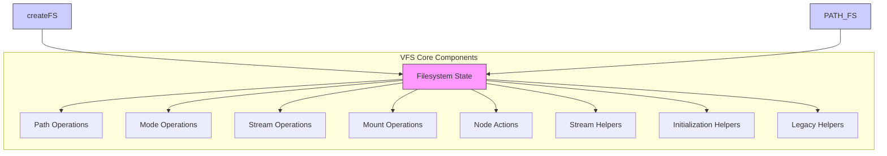

**Diagram sources**
- [filesystem.mjs](file://src/jswasm/vfs/filesystem.mjs#L1-L57)

**Section sources**
- [filesystem.mjs](file://src/jswasm/vfs/filesystem.mjs#L1-L57)

## OPFS Integration Architecture
The OPFS integration architecture is designed to enable SQLite's synchronous file operations to work with OPFS's asynchronous APIs through a worker-based communication model. This integration uses SharedArrayBuffer and Atomics to coordinate between the main thread and worker thread, allowing synchronous VFS calls to be processed asynchronously in the worker. The architecture includes VFS method wrappers, I/O method wrappers, and a comprehensive state management system that handles the serialization and deserialization of data between threads.

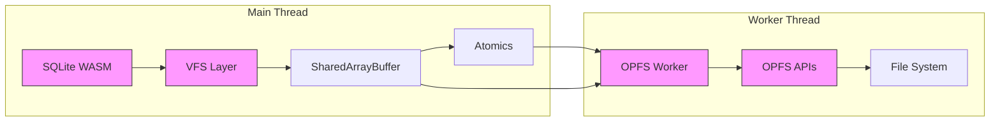

**Diagram sources**
- [io-sync-wrappers.mjs](file://src/jswasm/vfs/opfs/installer/wrappers/io-sync-wrappers.mjs#L1-L236)
- [vfs-sync-wrappers.mjs](file://src/jswasm/vfs/opfs/installer/wrappers/vfs-sync-wrappers.mjs#L1-L160)

**Section sources**
- [io-sync-wrappers.mjs](file://src/jswasm/vfs/opfs/installer/wrappers/io-sync-wrappers.mjs#L1-L236)
- [vfs-sync-wrappers.mjs](file://src/jswasm/vfs/opfs/installer/wrappers/vfs-sync-wrappers.mjs#L1-L160)

## Filesystem Module Components
The filesystem module in web-sqlite-v2 is composed of several key components that handle different aspects of filesystem operations. These components include mount operations, node actions, and stream operations, each providing specific functionality for managing the virtual filesystem.

### Mount Operations
The mount operations component manages the mounting and unmounting of filesystems within the virtual filesystem tree. It provides methods for mounting filesystem implementations at specific paths, unmounting them, and synchronizing mounted filesystems. The mount operations also handle the creation of special nodes and the lookup of nodes within the filesystem hierarchy.

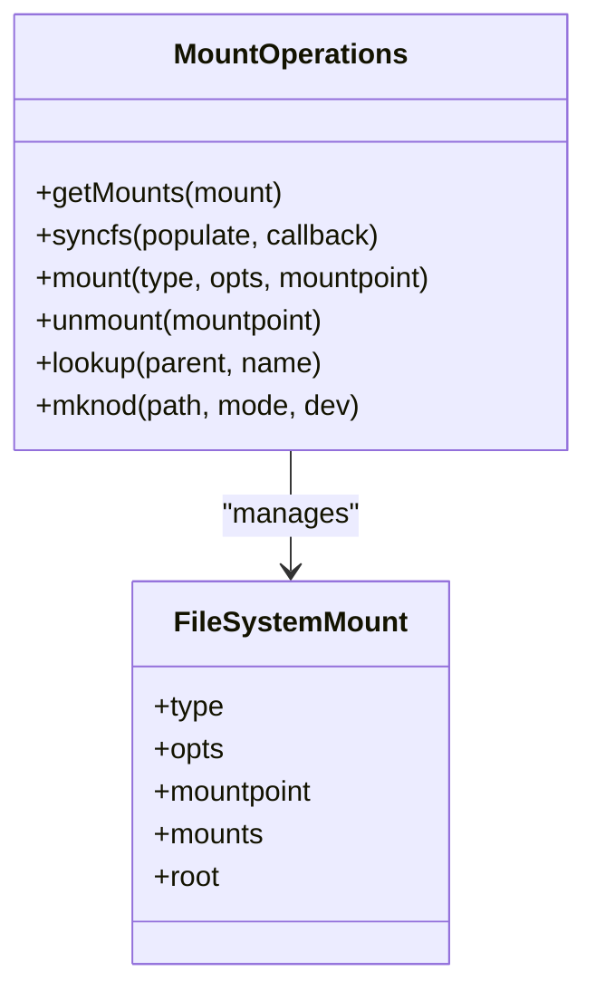

**Diagram sources**
- [mount-operations.ts](file://src/jswasm/vfs/filesystem/mount-operations/mount-operations.ts#L1-L310)

**Section sources**
- [mount-operations.ts](file://src/jswasm/vfs/filesystem/mount-operations/mount-operations.ts#L1-L310)

### Node Actions
The node actions component provides high-level operations for manipulating filesystem nodes, including creating, renaming, opening, and removing files and directories. These operations mirror POSIX semantics and are built on top of lower-level core and metadata operations. The node actions interface combines core file/directory operations with file status and metadata operations to provide a comprehensive API for node manipulation.

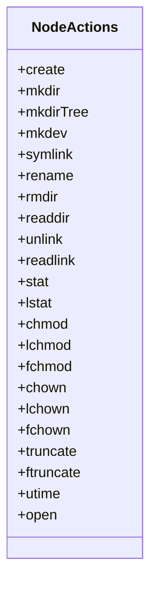

**Diagram sources**
- [node-actions.ts](file://src/jswasm/vfs/filesystem/node-actions/node-actions.ts#L1-L79)

**Section sources**
- [node-actions.ts](file://src/jswasm/vfs/filesystem/node-actions/node-actions.ts#L1-L79)

### Stream Operations
The stream operations component manages file descriptors and stream bookkeeping for the virtual filesystem. It provides methods for creating, duplicating, and closing streams, as well as managing character devices and device numbers. The stream operations also include utilities for extracting major and minor device numbers from device IDs and registering character devices with the filesystem.

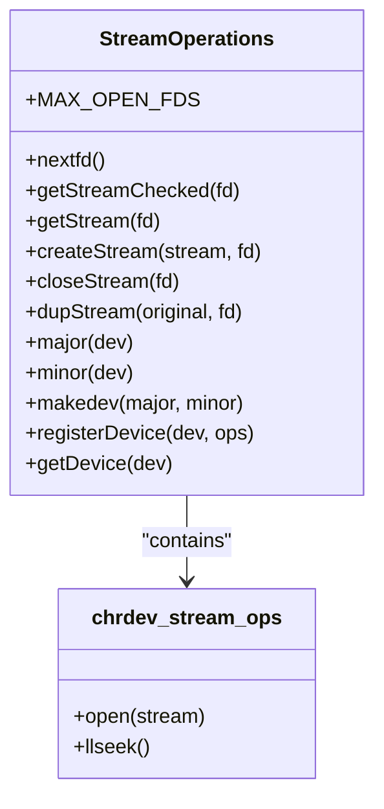

**Diagram sources**
- [stream-operations.ts](file://src/jswasm/vfs/filesystem/stream-operations/stream-operations.ts#L1-L265)

**Section sources**
- [stream-operations.ts](file://src/jswasm/vfs/filesystem/stream-operations/stream-operations.ts#L1-L265)

## System Call Emulation
The system call emulation layer in web-sqlite-v2 provides implementations of POSIX system calls that SQLite expects to be available. This layer includes syscalls for file status operations, file operations, and terminal control operations, all of which are adapted to work with the virtual filesystem.

### Stat System Calls
The stat system calls component implements syscalls for retrieving file and directory status information, including `stat64`, `lstat64`, `fstat64`, and `newfstatat`. These syscalls return file metadata such as permissions, timestamps, size, and ownership, following POSIX standards. The implementation uses helper utilities to convert path pointers to strings and execute the appropriate filesystem operations.

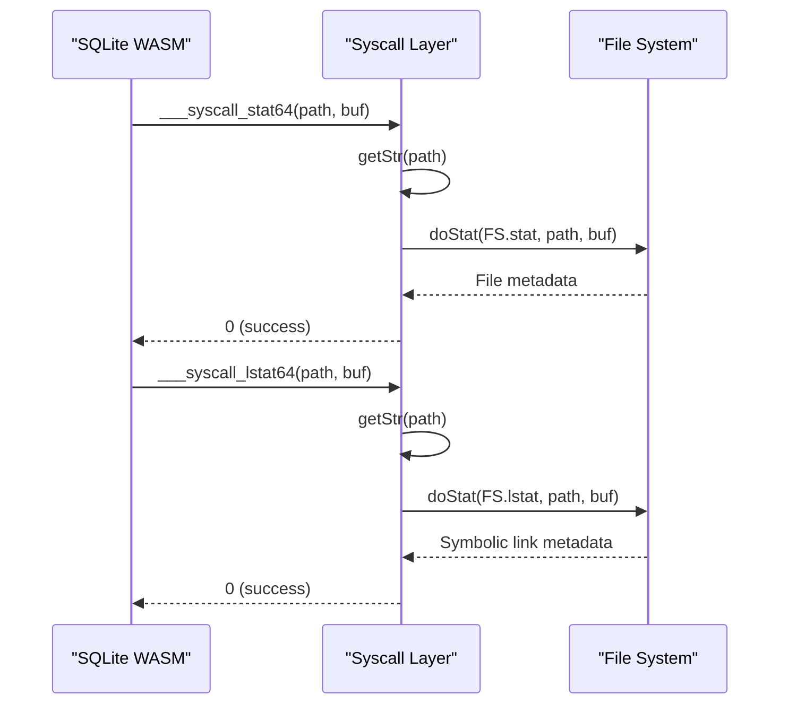

**Diagram sources**
- [stat-syscalls.mjs](file://src/jswasm/system/stat-syscalls.mjs#L1-L166)

**Section sources**
- [stat-syscalls.mjs](file://src/jswasm/system/stat-syscalls.mjs#L1-L166)

### IOCTL System Calls
The IOCTL system calls component implements device-specific control operations, primarily for terminal (TTY) control. These operations include getting and setting terminal attributes, controlling flow, flushing, and managing window size. The implementation supports various operation codes such as `TCSBRK`, `TCGETS`, `TCSETS`, `TIOCGWINSZ`, and `FIONBIO`, with appropriate error handling for unsupported operations.

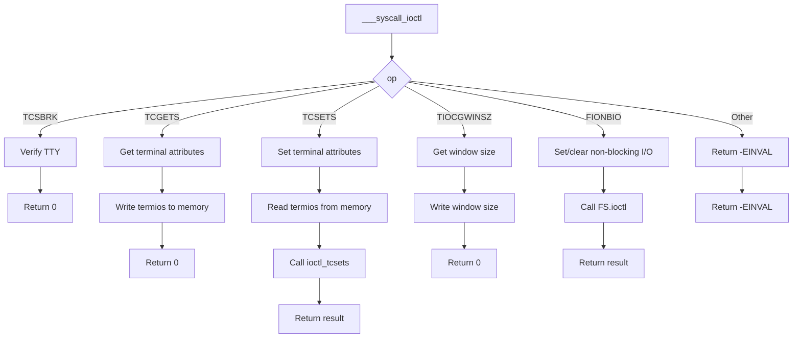

**Diagram sources**
- [ioctl-syscalls.mjs](file://src/jswasm/system/ioctl-syscalls.mjs#L1-L225)

**Section sources**
- [ioctl-syscalls.mjs](file://src/jswasm/system/ioctl-syscalls.mjs#L1-L225)

## Data Flow from SQLite to OPFS
The data flow from SQLite's file operations to OPFS storage is orchestrated through a series of coordinated steps that ensure data integrity and consistency. When SQLite performs a file operation, the VFS layer translates this into a corresponding OPFS operation through the worker thread, using SharedArrayBuffer for data transfer and Atomics for synchronization.

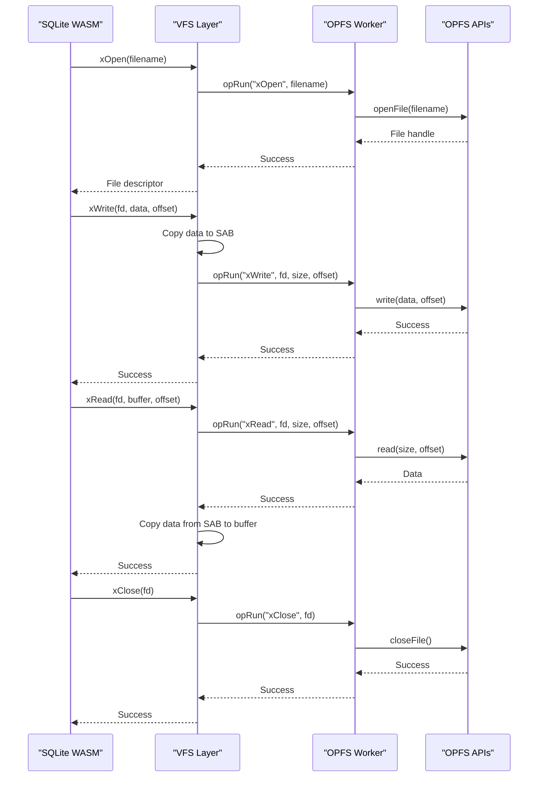

**Diagram sources**
- [io-sync-wrappers.mjs](file://src/jswasm/vfs/opfs/installer/wrappers/io-sync-wrappers.mjs#L1-L236)
- [vfs-sync-wrappers.mjs](file://src/jswasm/vfs/opfs/installer/wrappers/vfs-sync-wrappers.mjs#L1-L160)

**Section sources**
- [io-sync-wrappers.mjs](file://src/jswasm/vfs/opfs/installer/wrappers/io-sync-wrappers.mjs#L1-L236)
- [vfs-sync-wrappers.mjs](file://src/jswasm/vfs/opfs/installer/wrappers/vfs-sync-wrappers.mjs#L1-L160)

## Performance Considerations
The performance of the web-sqlite-v2 storage system is influenced by several factors related to the synchronous vs asynchronous nature of operations and caching strategies. The architecture employs various techniques to optimize performance while maintaining data consistency.

### Synchronous vs Asynchronous Operations
The VFS layer bridges SQLite's synchronous file operations with OPFS's asynchronous APIs through a worker-based model. This introduces some overhead due to the need for thread coordination via SharedArrayBuffer and Atomics. The system uses a shared operation buffer (sabOP) to communicate operation requests and results between threads, minimizing the overhead of cross-thread communication.

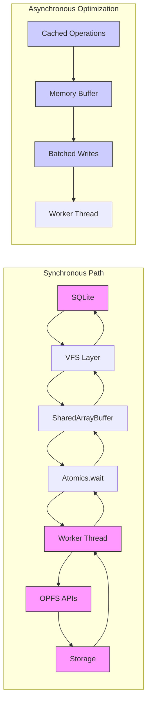

**Diagram sources**
- [state-initialization.mjs](file://src/jswasm/vfs/opfs/installer/core/state-initialization.mjs#L1-L127)
- [io-sync-wrappers.mjs](file://src/jswasm/vfs/opfs/installer/wrappers/io-sync-wrappers.mjs#L1-L236)

**Section sources**
- [state-initialization.mjs](file://src/jswasm/vfs/opfs/installer/core/state-initialization.mjs#L1-L127)
- [io-sync-wrappers.mjs](file://src/jswasm/vfs/opfs/installer/wrappers/io-sync-wrappers.mjs#L1-L236)

### Caching Strategies
The system employs several caching strategies to improve performance. The file buffer (fileBufferSize) is set to 64KB, providing a reasonable balance between memory usage and I/O efficiency. The architecture also includes metrics tracking for OPFS operations, allowing for performance monitoring and optimization. The shared array buffer (sabIO) is used to transfer data between threads, reducing the need for data serialization and deserialization.

## Security Aspects
The security model of the web-sqlite-v2 storage system is built on the inherent isolation properties of OPFS and the origin-based storage model of web browsers.

### OPFS Isolation
OPFS provides strong isolation between different origins, ensuring that data stored by one origin cannot be accessed by another. This isolation is enforced by the browser's security model and is a fundamental aspect of the storage system's security. The VFS implementation respects these boundaries by operating within the context of the current origin and not attempting to access data from other origins.

### Origin-Based Storage
All data stored through the VFS layer is confined to the origin of the web application. This means that data persistence is tied to the origin, and users can manage storage permissions on a per-origin basis. The system does not attempt to bypass these restrictions, maintaining the security model expected by users and browsers.

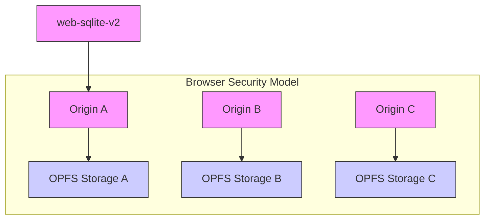

**Diagram sources**
- [environment-validation.mjs](file://src/jswasm/vfs/opfs/installer/core/environment-validation.mjs#L1-L53)

**Section sources**
- [environment-validation.mjs](file://src/jswasm/vfs/opfs/installer/core/environment-validation.mjs#L1-L53)

## Configuration and Error Recovery
The web-sqlite-v2 storage system provides configurable options for storage initialization and robust error recovery mechanisms to ensure data integrity.

### Configuration Options
The system offers several configuration options for storage initialization, including verbose logging, sanity checks, and proxy URI settings. These options can be specified programmatically or through URL parameters, allowing for flexible configuration in different environments. The configuration is normalized and validated during initialization to ensure consistent behavior.

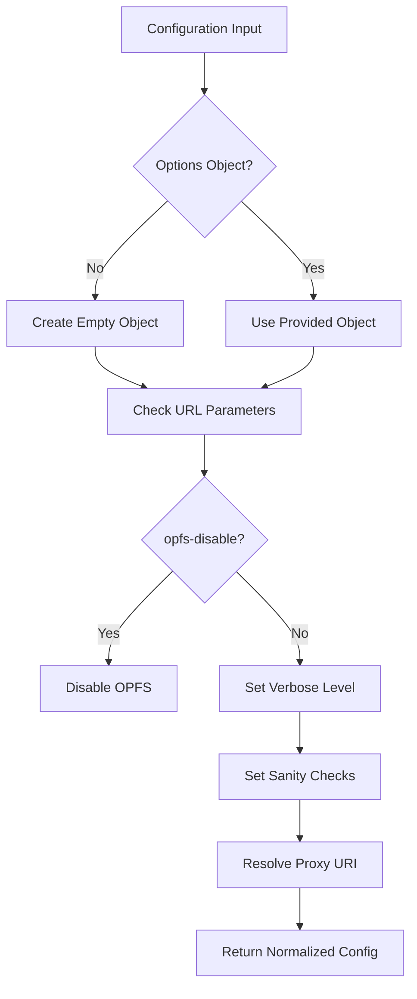

**Diagram sources**
- [config-setup.mjs](file://src/jswasm/vfs/opfs/installer/core/config-setup.mjs#L1-L45)

**Section sources**
- [config-setup.mjs](file://src/jswasm/vfs/opfs/installer/core/config-setup.mjs#L1-L45)

### Error Recovery Scenarios
The system includes comprehensive error recovery mechanisms to handle various failure scenarios. The sanity check module verifies the integrity of the VFS implementation by testing key operations such as file access, opening, reading, writing, and deletion. Error codes are propagated through the system using standard errno values, allowing for consistent error handling across different components.

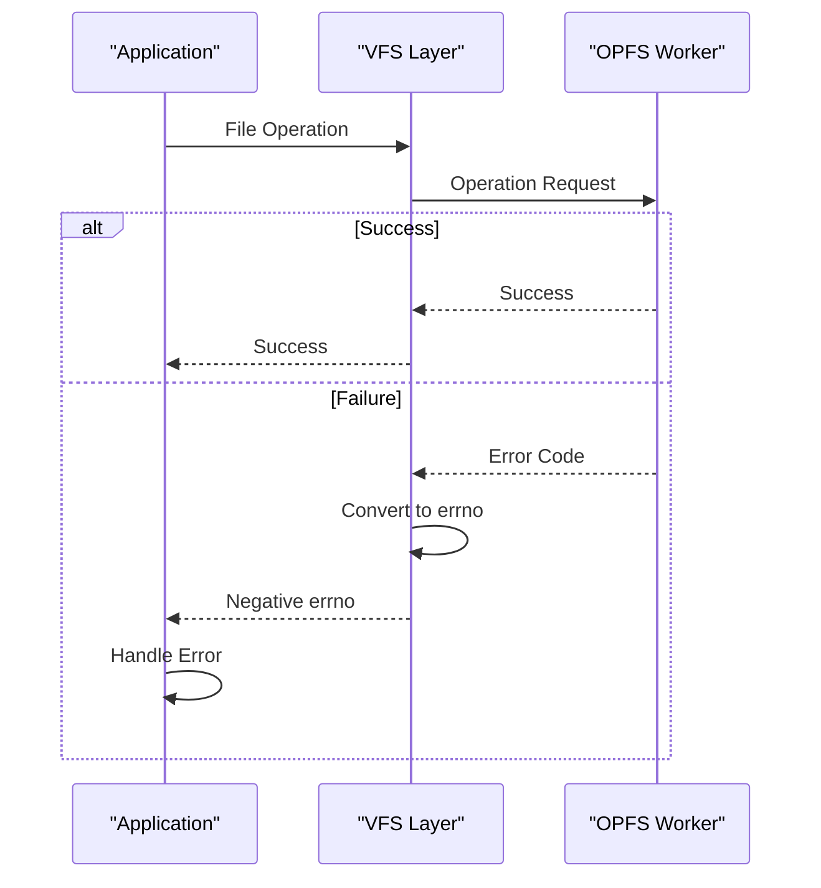

**Diagram sources**
- [sanity-check.mjs](file://src/jswasm/vfs/opfs/installer/utils/sanity-check.mjs#L1-L123)

**Section sources**
- [sanity-check.mjs](file://src/jswasm/vfs/opfs/installer/utils/sanity-check.mjs#L1-L123)