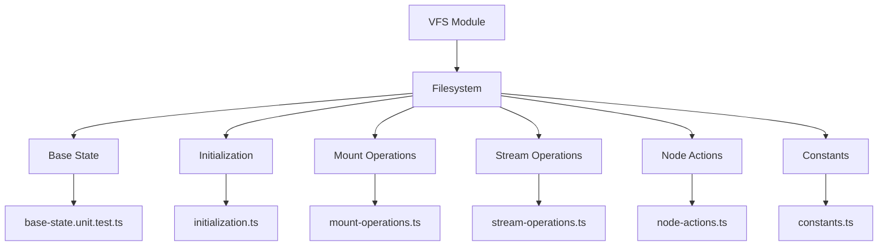
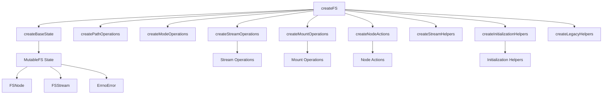
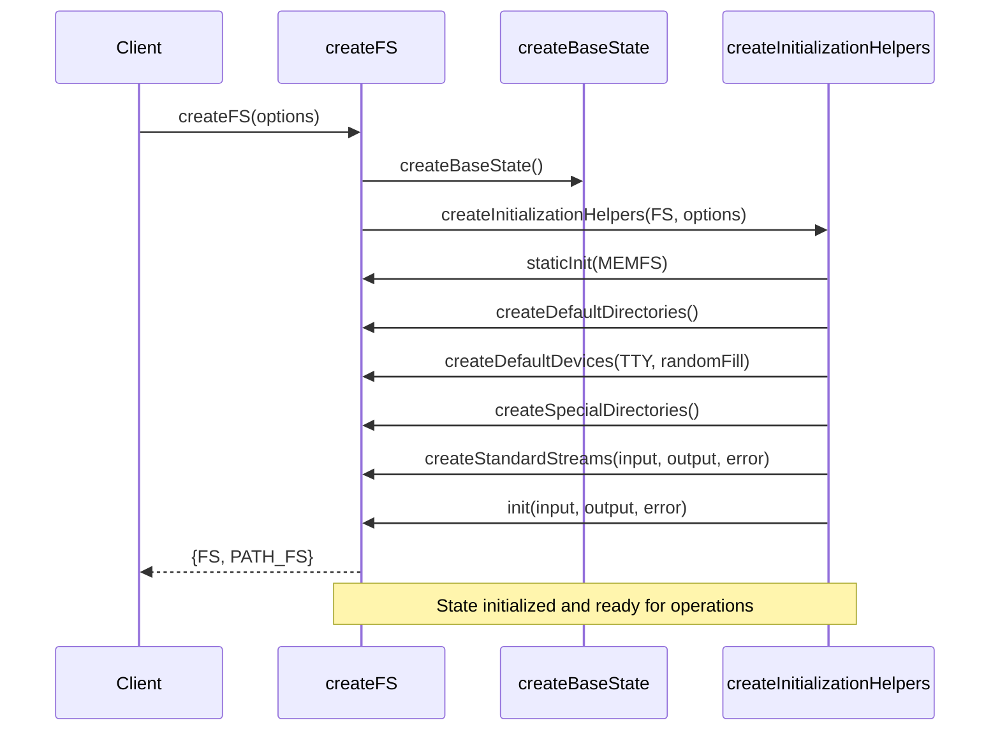
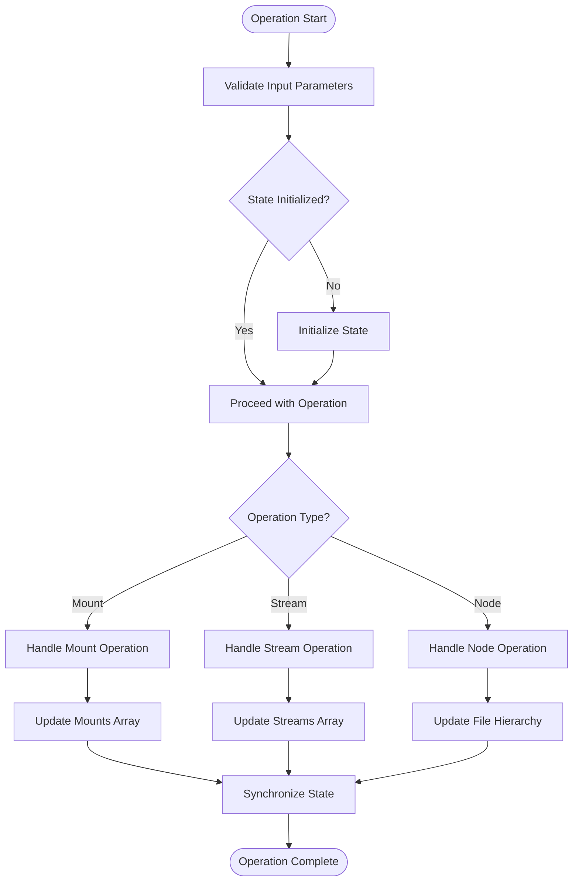
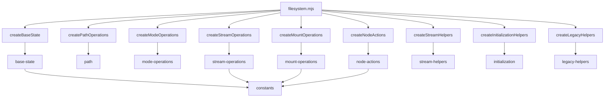

# Base State

<cite>
**Referenced Files in This Document**   
- [base-state.unit.test.ts](file://src/jswasm/vfs/filesystem/base-state/base-state.unit.test.ts)
- [initialization.ts](file://src/jswasm/vfs/filesystem/initialization/initialization.ts)
- [filesystem.mjs](file://src/jswasm/vfs/filesystem.mjs)
- [constants.ts](file://src/jswasm/vfs/filesystem/constants/constants.ts)
- [mount-operations.ts](file://src/jswasm/vfs/filesystem/mount-operations/mount-operations.ts)
- [stream-operations.ts](file://src/jswasm/vfs/filesystem/stream-operations/stream-operations.ts)
- [node-actions.ts](file://src/jswasm/vfs/filesystem/node-actions/node-actions.ts)
</cite>

## Table of Contents
1. [Introduction](#introduction)
2. [Project Structure](#project-structure)
3. [Core Components](#core-components)
4. [Architecture Overview](#architecture-overview)
5. [Detailed Component Analysis](#detailed-component-analysis)
6. [Dependency Analysis](#dependency-analysis)
7. [Performance Considerations](#performance-considerations)
8. [Troubleshooting Guide](#troubleshooting-guide)
9. [Conclusion](#conclusion)

## Introduction
The Base State in web-sqlite-v2's VFS (Virtual File System) provides the foundational data structure for managing filesystem state within a Web Worker environment. This documentation explains how global filesystem state is maintained across operations, including active file handles, mount tables, and directory caches. The state object serves as the central repository for all filesystem operations, ensuring consistency and persistence throughout the worker lifecycle.

## Project Structure
The base state management is organized within the VFS module of the web-sqlite-v2 project, specifically in the filesystem directory. The core state implementation is located in the base-state directory, with supporting functionality distributed across related modules for initialization, mount operations, stream operations, and node actions.



**Diagram sources**
- [filesystem.mjs](file://src/jswasm/vfs/filesystem.mjs)
- [base-state.unit.test.ts](file://src/jswasm/vfs/filesystem/base-state/base-state.unit.test.ts)

**Section sources**
- [filesystem.mjs](file://src/jswasm/vfs/filesystem.mjs)
- [base-state.unit.test.ts](file://src/jswasm/vfs/filesystem/base-state/base-state.unit.test.ts)

## Core Components
The base state system consists of several key components that work together to maintain filesystem state. The core is the MutableFS interface which defines the structure of the state object, including properties for tracking the filesystem hierarchy, active streams, and mount points. Supporting classes like FSNode and FSStream provide the data structures for representing filesystem entities and active file handles.

**Section sources**
- [base-state.unit.test.ts](file://src/jswasm/vfs/filesystem/base-state/base-state.unit.test.ts)
- [constants.ts](file://src/jswasm/vfs/filesystem/constants/constants.ts)

## Architecture Overview
The base state architecture follows a modular design pattern where the core state object is extended with functionality from specialized modules. The filesystem.mjs file serves as the composition root, assembling the complete filesystem facade by combining the base state with operation modules for paths, modes, streams, mounts, nodes, and initialization.



**Diagram sources**
- [filesystem.mjs](file://src/jswasm/vfs/filesystem.mjs)
- [base-state.unit.test.ts](file://src/jswasm/vfs/filesystem/base-state/base-state.unit.test.ts)

## Detailed Component Analysis

### Base State Structure
The base state structure defines the core properties and constructors for the virtual filesystem. It maintains the filesystem hierarchy through references to the root node and mount points, tracks active file handles in the streams array, and manages inode allocation through the nextInode counter.

```mermaid
classDiagram
class MutableFS {
+root : FSNode | null
+mounts : FileSystemMount[]
+devices : { [dev : number] : DeviceDefinition }
+streams : (FSStream | null)[]
+nextInode : number
+nameTable : (FSNode | null)[] | null
+currentPath : string
+initialized : boolean
+ignorePermissions : boolean
+genericErrors : { [code : number] : ErrnoError }
+filesystems : { [type : string] : FileSystemMountType } | null
+syncFSRequests : number
+readFiles : { [path : string] : boolean }
+ErrnoError : ErrnoErrorConstructor
+FSStream : FSStreamConstructor
+FSNode : FSNodeConstructor
}
class ErrnoError {
+name : string
+errno : number
+message : string
}
class FSStream {
+shared : { flags? : number; position? : number }
+node : FSNode | undefined
+object : FSNode | undefined
+flags : number
+position : number
+isRead : boolean
+isWrite : boolean
+isAppend : boolean
}
class FSNode {
+parent : FSNode
+mount : FileSystemMount
+name : string
+mode : number
+rdev : number
+id : number | null
+read : boolean
+write : boolean
+isFolder : boolean
+isDevice : boolean
+readMode : number
+writeMode : number
}
MutableFS --> FSNode : "contains"
MutableFS --> FSStream : "contains"
MutableFS --> ErrnoError : "contains"
FSStream --> FSNode : "references"
```

**Diagram sources**
- [base-state.unit.test.ts](file://src/jswasm/vfs/filesystem/base-state/base-state.unit.test.ts)
- [constants.ts](file://src/jswasm/vfs/filesystem/constants/constants.ts)

**Section sources**
- [base-state.unit.test.ts](file://src/jswasm/vfs/filesystem/base-state/base-state.unit.test.ts)
- [constants.ts](file://src/jswasm/vfs/filesystem/constants/constants.ts)

### State Initialization and Lifecycle
The initialization process sets up the base state with default values and prepares the filesystem for operation. The createInitializationHelpers function provides methods for creating default directories, devices, and standard streams, while the staticInit and init methods handle the overall initialization sequence.



**Diagram sources**
- [filesystem.mjs](file://src/jswasm/vfs/filesystem.mjs)
- [initialization.ts](file://src/jswasm/vfs/filesystem/initialization/initialization.ts)

**Section sources**
- [initialization.ts](file://src/jswasm/vfs/filesystem/initialization/initialization.ts)
- [filesystem.mjs](file://src/jswasm/vfs/filesystem.mjs)

### State Management During Operations
The base state maintains consistency during filesystem operations by coordinating between different modules. Mount operations modify the mount table and update the filesystem hierarchy, while stream operations manage active file handles and their associated state.



**Diagram sources**
- [mount-operations.ts](file://src/jswasm/vfs/filesystem/mount-operations/mount-operations.ts)
- [stream-operations.ts](file://src/jswasm/vfs/filesystem/stream-operations/stream-operations.ts)
- [node-actions.ts](file://src/jswasm/vfs/filesystem/node-actions/node-actions.ts)

**Section sources**
- [mount-operations.ts](file://src/jswasm/vfs/filesystem/mount-operations/mount-operations.ts)
- [stream-operations.ts](file://src/jswasm/vfs/filesystem/stream-operations/stream-operations.ts)

## Dependency Analysis
The base state system has a clear dependency hierarchy where the core state object is extended with functionality from specialized modules. The filesystem.mjs file serves as the composition root, importing and combining the various components to create the complete filesystem facade.



**Diagram sources**
- [filesystem.mjs](file://src/jswasm/vfs/filesystem.mjs)
- [base-state.unit.test.ts](file://src/jswasm/vfs/filesystem/base-state/base-state.unit.test.ts)

**Section sources**
- [filesystem.mjs](file://src/jswasm/vfs/filesystem.mjs)
- [base-state.unit.test.ts](file://src/jswasm/vfs/filesystem/base-state/base-state.unit.test.ts)

## Performance Considerations
The base state implementation is designed for efficient operation within a Web Worker environment. The use of arrays for tracking streams and name table entries allows for O(1) access by file descriptor, while the inode allocation system ensures unique identifiers are generated efficiently. Memory usage is optimized by using null values for unused file descriptors rather than maintaining sparse arrays.

## Troubleshooting Guide
Common issues with the base state system typically involve improper initialization or state corruption. The unit tests in base-state.unit.test.ts provide examples of expected state values and can be used as a reference for debugging. When encountering state-related issues, verify that the filesystem has been properly initialized and that all operations are being performed on valid file descriptors.

**Section sources**
- [base-state.unit.test.ts](file://src/jswasm/vfs/filesystem/base-state/base-state.unit.test.ts)
- [initialization.ts](file://src/jswasm/vfs/filesystem/initialization/initialization.ts)

## Conclusion
The base state management in web-sqlite-v2's VFS provides a robust foundation for filesystem operations within a Web Worker environment. By maintaining a comprehensive state object that tracks the filesystem hierarchy, active file handles, and mount points, the system ensures consistency and reliability across operations. The modular design allows for easy extension and maintenance, while the careful consideration of performance and memory usage makes it well-suited for long-running database connections.