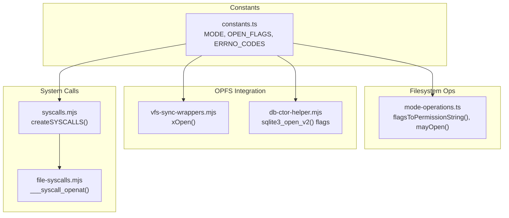
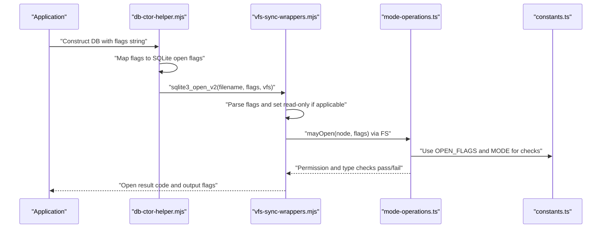
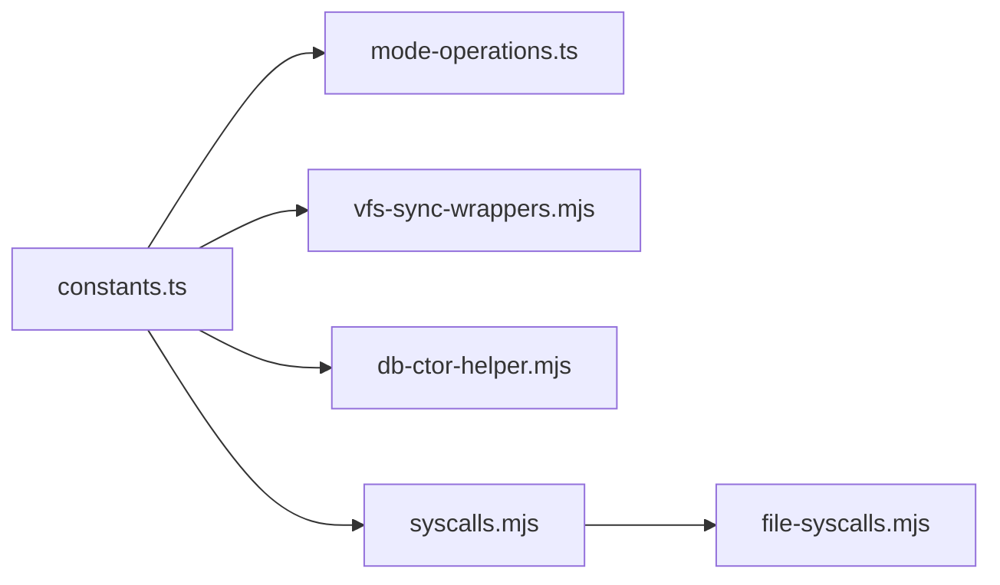

# Constants

<cite>
**Referenced Files in This Document**
- [constants.ts](file://src/jswasm/vfs/filesystem/constants/constants.ts)
- [constants.test.ts](file://src/jswasm/vfs/filesystem/constants/constants.test.ts)
- [mode-operations.ts](file://src/jswasm/vfs/filesystem/mode-operations/mode-operations.ts)
- [vfs-sync-wrappers.mjs](file://src/jswasm/vfs/opfs/installer/wrappers/vfs-sync-wrappers.mjs)
- [db-ctor-helper.mjs](file://src/jswasm/api/oo1-db/db-ctor-helper.mjs)
- [syscalls.mjs](file://src/jswasm/system/syscalls.mjs)
- [file-syscalls.mjs](file://src/jswasm/system/file-syscalls.mjs)
</cite>

## Table of Contents
1. [Introduction](#introduction)
2. [Project Structure](#project-structure)
3. [Core Components](#core-components)
4. [Architecture Overview](#architecture-overview)
5. [Detailed Component Analysis](#detailed-component-analysis)
6. [Dependency Analysis](#dependency-analysis)
7. [Performance Considerations](#performance-considerations)
8. [Troubleshooting Guide](#troubleshooting-guide)
9. [Conclusion](#conclusion)

## Introduction
This document explains the VFS constants module used by the web-sqlite-v2 virtual filesystem. It focuses on:
- File mode constants (e.g., file type masks and permission bits)
- Open flags (e.g., access modes and file creation/truncation flags)
- POSIX semantics alignment for SQLite’s VFS interface
- How these constants are used across the filesystem and OPFS integration
- Numeric values and bitmask patterns for flag combinations
- Compatibility between SQLite expectations and OPFS capabilities

## Project Structure
The constants are defined in a dedicated module and consumed by filesystem operations and OPFS wrappers. The following diagram shows the primary files involved in constant usage.

**Diagram sources**
- [constants.ts](file://src/jswasm/vfs/filesystem/constants/constants.ts#L1-L248)
- [mode-operations.ts](file://src/jswasm/vfs/filesystem/mode-operations/mode-operations.ts#L1-L305)
- [vfs-sync-wrappers.mjs](file://src/jswasm/vfs/opfs/installer/wrappers/vfs-sync-wrappers.mjs#L101-L157)
- [db-ctor-helper.mjs](file://src/jswasm/api/oo1-db/db-ctor-helper.mjs#L95-L116)
- [syscalls.mjs](file://src/jswasm/system/syscalls.mjs#L1-L155)
- [file-syscalls.mjs](file://src/jswasm/system/file-syscalls.mjs#L1-L200)

**Section sources**
- [constants.ts](file://src/jswasm/vfs/filesystem/constants/constants.ts#L1-L248)
- [mode-operations.ts](file://src/jswasm/vfs/filesystem/mode-operations/mode-operations.ts#L1-L305)
- [vfs-sync-wrappers.mjs](file://src/jswasm/vfs/opfs/installer/wrappers/vfs-sync-wrappers.mjs#L101-L157)
- [db-ctor-helper.mjs](file://src/jswasm/api/oo1-db/db-ctor-helper.mjs#L95-L116)
- [syscalls.mjs](file://src/jswasm/system/syscalls.mjs#L1-L155)
- [file-syscalls.mjs](file://src/jswasm/system/file-syscalls.mjs#L1-L200)

## Core Components
This section summarizes the key constants and their roles.

- File mode constants (MODE):
  - Type mask and file type bits: TYPE_MASK, FILE, DIRECTORY, SYMLINK, CHARACTER_DEVICE, BLOCK_DEVICE, FIFO, SOCKET
  - Permission bits: PERMISSION_READ, PERMISSION_WRITE, PERMISSION_EXECUTE
  - Permission masks: PERMISSION_MASK, DIR_PERMISSION_MASK, DIR_PERMISSION_WITH_STICKY
  - Defaults: DEFAULT_FILE_PERMISSIONS, DEFAULT_DIRECTORY_PERMISSIONS

- Open flags (OPEN_FLAGS):
  - Access modes: O_ACCMODE, O_RDONLY, O_WRONLY, O_RDWR
  - Creation/truncation: O_CREAT, O_EXCL, O_TRUNC
  - Additional flags: O_APPEND, O_DIRECTORY, O_NOFOLLOW, O_PATH

- Stream state mask (STREAM_STATE_MASK):
  - Combination of O_PATH and O_ACCMODE for readable/writeable checks

- Permission helper (PERMISSION):
  - READ_EXECUTE: combined read + execute bits for directory traversal checks

- Single-value constants:
  - MAX_OPEN_FDS: default maximum open file descriptors
  - DEVICE_MAJOR_BASE: initial major number for auto-assigned character devices

These constants are exported as immutable objects and used pervasively across filesystem operations and OPFS integration.

**Section sources**
- [constants.ts](file://src/jswasm/vfs/filesystem/constants/constants.ts#L1-L248)
- [constants.test.ts](file://src/jswasm/vfs/filesystem/constants/constants.test.ts#L1-L187)

## Architecture Overview
The constants serve as the bridge between SQLite’s VFS expectations and the underlying OPFS-backed filesystem. The flow below illustrates how flags and modes are used during database open operations and permission checks.

**Diagram sources**
- [db-ctor-helper.mjs](file://src/jswasm/api/oo1-db/db-ctor-helper.mjs#L95-L116)
- [vfs-sync-wrappers.mjs](file://src/jswasm/vfs/opfs/installer/wrappers/vfs-sync-wrappers.mjs#L101-L157)
- [mode-operations.ts](file://src/jswasm/vfs/filesystem/mode-operations/mode-operations.ts#L272-L305)
- [constants.ts](file://src/jswasm/vfs/filesystem/constants/constants.ts#L125-L195)

## Detailed Component Analysis

### File Mode Constants (TYPE_MASK, FILE, DIRECTORY, SYMLINK, etc.)
- Purpose:
  - Distinguish file types via bitwise masking
  - Encode and interpret permission bits for read, write, execute
  - Provide masks for preserving or combining permission bits
- Usage:
  - Type detection in mode-operations.ts uses TYPE_MASK and individual type bits
  - Permission checks rely on PERMISSION_READ, PERMISSION_WRITE, PERMISSION_EXECUTE
  - Default permissions are applied when creating files/directories

Key numeric values (octal):
- TYPE_MASK: 0o170000
- FILE: 0o100000
- DIRECTORY: 0o040000
- SYMLINK: 0o120000
- CHARACTER_DEVICE: 0o020000
- BLOCK_DEVICE: 0o060000
- FIFO: 0o010000
- SOCKET: 0o140000
- PERMISSION_READ: 0o444
- PERMISSION_WRITE: 0o222
- PERMISSION_EXECUTE: 0o111
- PERMISSION_MASK: 0o7777
- DIR_PERMISSION_MASK: 0o777
- DIR_PERMISSION_WITH_STICKY: 0o1777
- DEFAULT_FILE_PERMISSIONS: 0o666
- DEFAULT_DIRECTORY_PERMISSIONS: 0o777

Bitmask patterns:
- Type extraction: (mode & MODE.TYPE_MASK) selects the file type portion
- Permission extraction: (mode & MODE.PERMISSION_MASK) preserves permission bits
- Directory permission mask allows sticky bit in addition to standard permission bits

**Section sources**
- [constants.ts](file://src/jswasm/vfs/filesystem/constants/constants.ts#L125-L195)
- [mode-operations.ts](file://src/jswasm/vfs/filesystem/mode-operations/mode-operations.ts#L60-L129)

### Open Flags (O_RDONLY, O_WRONLY, O_RDWR, O_CREAT, O_EXCL, O_TRUNC, O_APPEND, O_DIRECTORY, O_NOFOLLOW, O_PATH)
- Purpose:
  - Control file access mode and creation/truncation behavior
  - Enforce directory and symlink constraints
  - Provide path-only opens without actual file access
- Usage:
  - DB constructor maps flags string to SQLite open flags and passes them to sqlite3_open_v2
  - OPFS wrapper reads flags to determine read-only behavior and to configure internal flags
  - Mode operations translate flags into permission strings and enforce directory/file constraints

Key numeric values (octal):
- O_ACCMODE: 0o3
- O_RDONLY: 0
- O_WRONLY: 1
- O_RDWR: 2
- O_CREAT: 0o100
- O_EXCL: 0o200
- O_TRUNC: 0o1000
- O_APPEND: 0o2000
- O_DIRECTORY: 0o200000
- O_NOFOLLOW: 0o400000
- O_PATH: 0o10000000

Bitmask patterns:
- Access mode selection: flags & O_ACCMODE yields one of {0, 1, 2}
- Combination examples:
  - Read-write create: O_RDWR | O_CREAT
  - Exclusive create: O_RDWR | O_CREAT | O_EXCL
  - Truncate-on-open: O_RDWR | O_CREAT | O_TRUNC
  - Directory-only open: O_RDONLY | O_DIRECTORY
  - Path-only open: O_RDONLY | O_PATH

**Section sources**
- [constants.ts](file://src/jswasm/vfs/filesystem/constants/constants.ts#L161-L185)
- [db-ctor-helper.mjs](file://src/jswasm/api/oo1-db/db-ctor-helper.mjs#L95-L116)
- [vfs-sync-wrappers.mjs](file://src/jswasm/vfs/opfs/installer/wrappers/vfs-sync-wrappers.mjs#L130-L150)
- [mode-operations.ts](file://src/jswasm/vfs/filesystem/mode-operations/mode-operations.ts#L131-L148)

### Permission Helper Constants (READ_EXECUTE)
- Purpose:
  - Provide a combined permission bit used for directory traversal checks
- Usage:
  - Computed as MODE.PERMISSION_READ | MODE.PERMISSION_EXECUTE
  - Used by permission helpers to validate directory traversal prerequisites

**Section sources**
- [constants.ts](file://src/jswasm/vfs/filesystem/constants/constants.ts#L243-L248)
- [mode-operations.ts](file://src/jswasm/vfs/filesystem/mode-operations/mode-operations.ts#L182-L207)

### Stream State Mask (STREAM_STATE_MASK)
- Purpose:
  - Determine readable/writable state of streams based on flags
- Definition:
  - STREAM_STATE_MASK = O_PATH | O_ACCMODE
- Usage:
  - Ensures correct interpretation of access mode and path-only flags

**Section sources**
- [constants.ts](file://src/jswasm/vfs/filesystem/constants/constants.ts#L187-L190)

### Single-Value Constants (MAX_OPEN_FDS, DEVICE_MAJOR_BASE)
- MAX_OPEN_FDS: default maximum number of simultaneously open file descriptors
- DEVICE_MAJOR_BASE: initial major number used when auto-assigning character devices

**Section sources**
- [constants.ts](file://src/jswasm/vfs/filesystem/constants/constants.ts#L191-L196)

### POSIX Semantics Alignment and SQLite VFS Compatibility
- SQLite open flags:
  - The DB constructor maps flags string to SQLite open flags and passes them to sqlite3_open_v2
  - OPFS wrapper interprets flags to decide read-only behavior and to configure internal flags
- File type and permission checks:
  - Mode operations enforce POSIX-like semantics for file types and permissions
  - Directory traversal requires execute permission; opening directories enforces read-only unless special conditions
- OPFS capabilities:
  - The wrapper translates SQLite flags into OPFS-compatible behaviors
  - Path-only opens (O_PATH) and directory-only opens (O_DIRECTORY) are supported via flags
  - Truncation semantics align with O_TRUNC behavior

**Section sources**
- [db-ctor-helper.mjs](file://src/jswasm/api/oo1-db/db-ctor-helper.mjs#L95-L116)
- [vfs-sync-wrappers.mjs](file://src/jswasm/vfs/opfs/installer/wrappers/vfs-sync-wrappers.mjs#L130-L150)
- [mode-operations.ts](file://src/jswasm/vfs/filesystem/mode-operations/mode-operations.ts#L272-L305)

### Usage Examples from the Codebase
- Open flags mapping in DB constructor:
  - The constructor builds SQLite open flags from a flags string and calls sqlite3_open_v2 with those flags
  - Example path: [db-ctor-helper.mjs](file://src/jswasm/api/oo1-db/db-ctor-helper.mjs#L95-L116)

- OPFS xOpen wrapper:
  - Parses flags to determine read-only behavior and sets internal flags
  - Example path: [vfs-sync-wrappers.mjs](file://src/jswasm/vfs/opfs/installer/wrappers/vfs-sync-wrappers.mjs#L130-L150)

- Permission string derivation:
  - flagsToPermissionString converts O_ACCMODE and O_TRUNC into a permission string
  - Example path: [mode-operations.ts](file://src/jswasm/vfs/filesystem/mode-operations/mode-operations.ts#L131-L148)

- Directory/file type checks:
  - isDir, isFile, and other type checks use MODE.TYPE_MASK and individual type bits
  - Example path: [mode-operations.ts](file://src/jswasm/vfs/filesystem/mode-operations/mode-operations.ts#L60-L129)

- Permission enforcement:
  - nodePermissions validates read/write/execute permissions against MODE bits
  - Example path: [mode-operations.ts](file://src/jswasm/vfs/filesystem/mode-operations/mode-operations.ts#L150-L180)

**Section sources**
- [db-ctor-helper.mjs](file://src/jswasm/api/oo1-db/db-ctor-helper.mjs#L95-L116)
- [vfs-sync-wrappers.mjs](file://src/jswasm/vfs/opfs/installer/wrappers/vfs-sync-wrappers.mjs#L130-L150)
- [mode-operations.ts](file://src/jswasm/vfs/filesystem/mode-operations/mode-operations.ts#L131-L180)

### Numeric Values and Bitmask Patterns
- File mode constants:
  - TYPE_MASK: 0o170000
  - FILE: 0o100000
  - DIRECTORY: 0o040000
  - SYMLINK: 0o120000
  - CHARACTER_DEVICE: 0o020000
  - BLOCK_DEVICE: 0o060000
  - FIFO: 0o010000
  - SOCKET: 0o140000
  - PERMISSION_READ: 0o444
  - PERMISSION_WRITE: 0o222
  - PERMISSION_EXECUTE: 0o111
  - PERMISSION_MASK: 0o7777
  - DIR_PERMISSION_MASK: 0o777
  - DIR_PERMISSION_WITH_STICKY: 0o1777
  - DEFAULT_FILE_PERMISSIONS: 0o666
  - DEFAULT_DIRECTORY_PERMISSIONS: 0o777

- Open flags:
  - O_ACCMODE: 0o3
  - O_RDONLY: 0
  - O_WRONLY: 1
  - O_RDWR: 2
  - O_CREAT: 0o100
  - O_EXCL: 0o200
  - O_TRUNC: 0o1000
  - O_APPEND: 0o2000
  - O_DIRECTORY: 0o200000
  - O_NOFOLLOW: 0o400000
  - O_PATH: 0o10000000

- Stream state mask:
  - STREAM_STATE_MASK: O_PATH | O_ACCMODE

- Permission helper:
  - READ_EXECUTE: MODE.PERMISSION_READ | MODE.PERMISSION_EXECUTE

**Section sources**
- [constants.ts](file://src/jswasm/vfs/filesystem/constants/constants.ts#L125-L195)
- [constants.ts](file://src/jswasm/vfs/filesystem/constants/constants.ts#L187-L190)
- [constants.ts](file://src/jswasm/vfs/filesystem/constants/constants.ts#L243-L248)

## Dependency Analysis
The constants module is a foundational dependency for:
- Mode operations: type detection and permission checks
- OPFS wrappers: interpreting SQLite open flags
- System calls: translating POSIX semantics into SQLite-compatible behaviors

**Diagram sources**
- [constants.ts](file://src/jswasm/vfs/filesystem/constants/constants.ts#L1-L248)
- [mode-operations.ts](file://src/jswasm/vfs/filesystem/mode-operations/mode-operations.ts#L1-L305)
- [vfs-sync-wrappers.mjs](file://src/jswasm/vfs/opfs/installer/wrappers/vfs-sync-wrappers.mjs#L101-L157)
- [db-ctor-helper.mjs](file://src/jswasm/api/oo1-db/db-ctor-helper.mjs#L95-L116)
- [syscalls.mjs](file://src/jswasm/system/syscalls.mjs#L1-L155)
- [file-syscalls.mjs](file://src/jswasm/system/file-syscalls.mjs#L1-L200)

**Section sources**
- [constants.ts](file://src/jswasm/vfs/filesystem/constants/constants.ts#L1-L248)
- [mode-operations.ts](file://src/jswasm/vfs/filesystem/mode-operations/mode-operations.ts#L1-L305)
- [vfs-sync-wrappers.mjs](file://src/jswasm/vfs/opfs/installer/wrappers/vfs-sync-wrappers.mjs#L101-L157)
- [db-ctor-helper.mjs](file://src/jswasm/api/oo1-db/db-ctor-helper.mjs#L95-L116)
- [syscalls.mjs](file://src/jswasm/system/syscalls.mjs#L1-L155)
- [file-syscalls.mjs](file://src/jswasm/system/file-syscalls.mjs#L1-L200)

## Performance Considerations
- Bitwise operations are constant-time and used extensively for type and permission checks
- Using predefined masks avoids repeated calculations and reduces overhead
- Stream state mask simplifies readable/writable determination without branching

[No sources needed since this section provides general guidance]

## Troubleshooting Guide
Common issues and how constants help diagnose them:
- Unexpected permission errors:
  - Verify that MODE.PERMISSION_READ/WRITE/EXECUTE bits match expectations
  - Check directory permissions for execute when traversing
  - Reference: [mode-operations.ts](file://src/jswasm/vfs/filesystem/mode-operations/mode-operations.ts#L150-L180)

- Opening directories incorrectly:
  - Ensure flags do not include write permissions for directories unless allowed
  - Reference: [mode-operations.ts](file://src/jswasm/vfs/filesystem/mode-operations/mode-operations.ts#L272-L305)

- OPFS open failures:
  - Confirm flags mapping from SQLite flags to OPFS flags
  - Reference: [vfs-sync-wrappers.mjs](file://src/jswasm/vfs/opfs/installer/wrappers/vfs-sync-wrappers.mjs#L130-L150)

- Flag combination pitfalls:
  - Validate O_TRUNC behavior and its effect on permission string derivation
  - Reference: [mode-operations.ts](file://src/jswasm/vfs/filesystem/mode-operations/mode-operations.ts#L131-L148)

**Section sources**
- [mode-operations.ts](file://src/jswasm/vfs/filesystem/mode-operations/mode-operations.ts#L131-L180)
- [mode-operations.ts](file://src/jswasm/vfs/filesystem/mode-operations/mode-operations.ts#L272-L305)
- [vfs-sync-wrappers.mjs](file://src/jswasm/vfs/opfs/installer/wrappers/vfs-sync-wrappers.mjs#L130-L150)

## Conclusion
The constants module provides a robust, POSIX-aligned foundation for SQLite’s VFS interface in web-sqlite-v2. By defining clear numeric values and bitmask patterns for file modes and open flags, it ensures consistent behavior across filesystem operations, OPFS integration, and permission checks. The module’s immutability and comprehensive coverage enable predictable compatibility with SQLite’s expectations while leveraging OPFS capabilities.