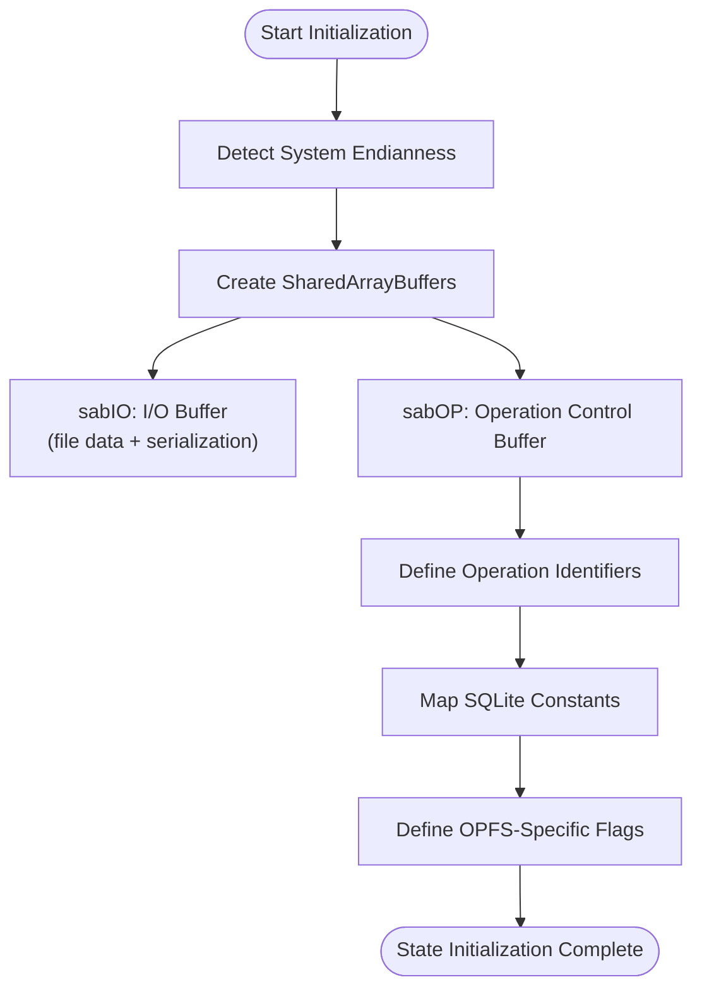
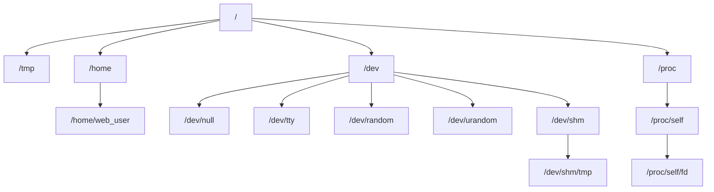
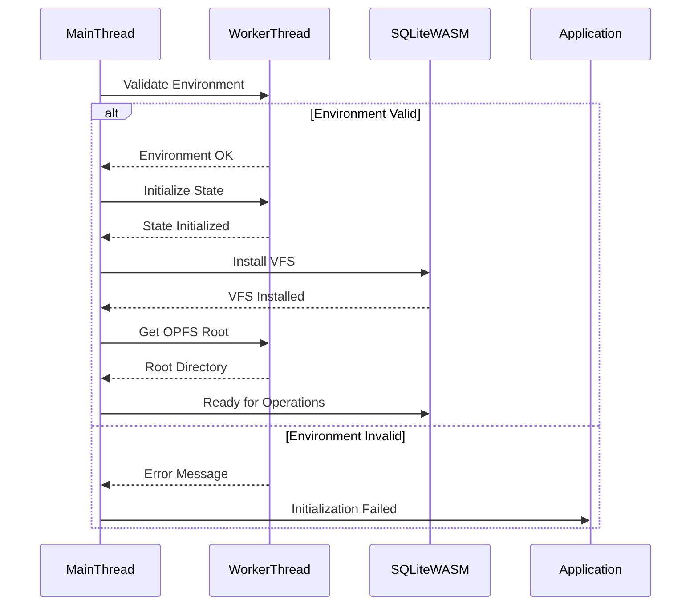
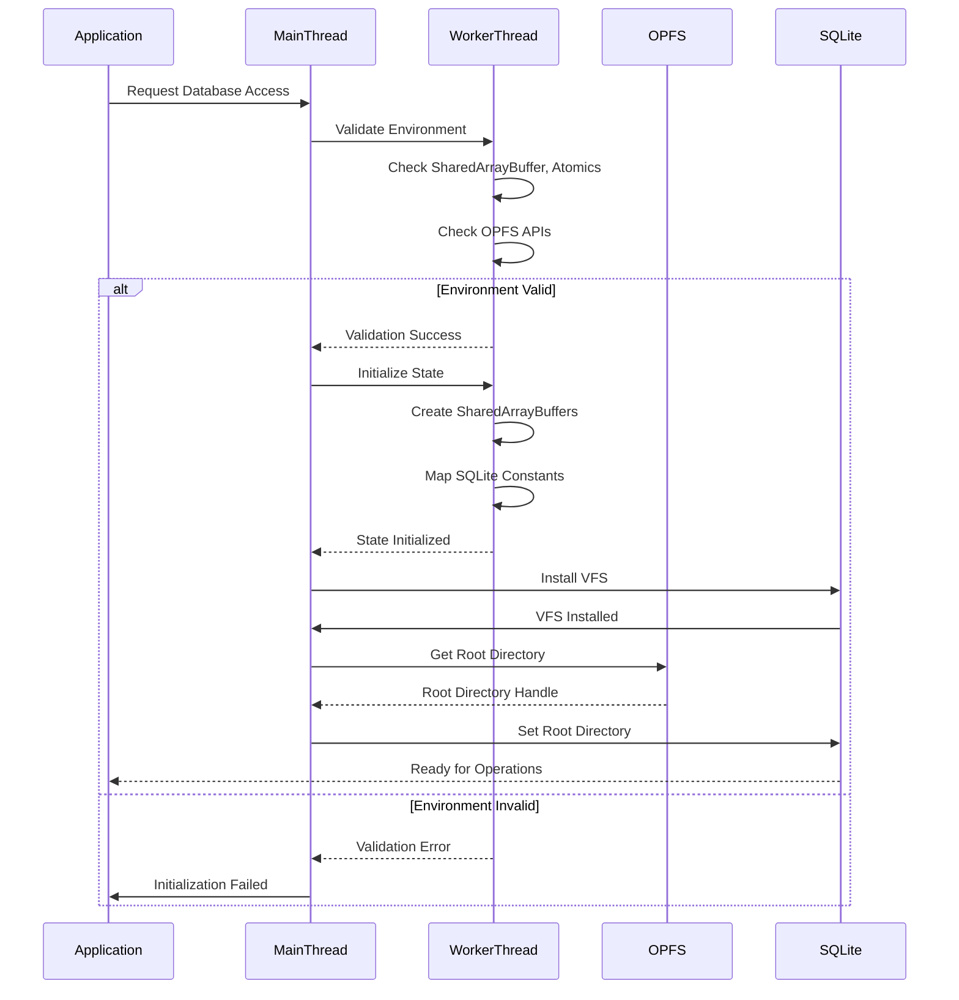

# Initialization

<cite>
**Referenced Files in This Document**   
- [initialization.ts](file://src/jswasm/vfs/filesystem/initialization/initialization.ts)
- [state-initialization.mjs](file://src/jswasm/vfs/opfs/installer/core/state-initialization.mjs)
- [environment-validation.mjs](file://src/jswasm/vfs/opfs/installer/core/environment-validation.mjs)
- [filesystem.mjs](file://src/jswasm/vfs/filesystem.mjs)
- [constants.ts](file://src/jswasm/vfs/filesystem/constants/constants.ts)
- [base-state.unit.test.ts](file://src/jswasm/vfs/filesystem/base-state/base-state.unit.test.ts)
- [worker-message-handler.mjs](file://src/jswasm/vfs/opfs/installer/utils/worker-message-handler.mjs)
</cite>

## Table of Contents

1. [Introduction](#introduction)
2. [VFS Initialization Process](#vfs-initialization-process)
3. [OPFS State Initialization](#opfs-state-initialization)
4. [Filesystem Structure Setup](#filesystem-structure-setup)
5. [Error Handling and Recovery](#error-handling-and-recovery)
6. [Integration with WASM Runtime](#integration-with-wasm-runtime)
7. [Persistence and Recovery Mechanisms](#persistence-and-recovery-mechanisms)
8. [Initialization Sequence Diagram](#initialization-sequence-diagram)

## Introduction

The VFS (Virtual File System) initialization process in web-sqlite-v2 establishes the foundational filesystem state when SQLite first accesses the database via OPFS (Origin Private File System). This documentation details the comprehensive bootstrapping mechanism that prepares the environment for database operations, including root directory creation, metadata structures, inode allocation, and integration with the WASM runtime. The initialization process ensures that SQLite can reliably store and retrieve data in the browser environment while maintaining compatibility with the underlying OPFS persistence model.

## VFS Initialization Process

The VFS initialization process begins when SQLite attempts to access the database through OPFS, triggering a series of coordinated operations that establish the filesystem state. The process starts with environment validation to ensure that the necessary OPFS APIs are available, followed by the creation of shared memory structures that facilitate communication between the main thread and worker threads.

The initialization sequence begins with the validation of the execution environment through the `validateOpfsEnvironment` function, which checks for the presence of critical browser APIs including SharedArrayBuffer, Atomics, and OPFS file handles. This validation ensures that the VFS can operate correctly within the constraints of the browser's security model, particularly the COOP/COEP (Cross-Origin Opener Policy/Cross-Origin Embedder Policy) requirements that enable shared memory operations.

Following successful environment validation, the initialization process creates the core state object that will manage OPFS operations. This state object contains shared buffers for inter-thread communication, operation identifiers for different VFS methods, and configuration parameters that control the behavior of the filesystem. The state initialization also maps SQLite's C API constants to JavaScript-accessible values, enabling proper error handling and operation control.

**Section sources**

- [environment-validation.mjs](file://src/jswasm/vfs/opfs/installer/core/environment-validation.mjs#L6-L37)
- [state-initialization.mjs](file://src/jswasm/vfs/opfs/installer/core/state-initialization.mjs#L8-L100)

## OPFS State Initialization

The OPFS state initialization creates the foundational data structures that enable asynchronous file operations through shared memory. The process begins by detecting the system's endianness, which is critical for proper data serialization between threads. This is accomplished through a simple test that writes a 16-bit integer in little-endian format and checks whether it is interpreted correctly.

The initialization then creates two SharedArrayBuffer instances: one for I/O operations (`sabIO`) and another for operation control (`sabOP`). The I/O buffer is divided into two regions: a file buffer region for data transfer and a serialization region for passing structured data between threads. The operation control buffer contains atomic integers that coordinate the execution of VFS methods, with each operation type assigned a specific index in the buffer.

Operation identifiers are established for all VFS methods, including file access, locking, reading, writing, and synchronization operations. These identifiers enable the worker thread to determine which operation to execute when notified via Atomics. The state initialization also maps SQLite's error codes and constants to JavaScript-accessible values, ensuring proper error handling and operation control.

The process concludes by defining OPFS-specific flags that control behavior such as automatic unlocking of file handles and handling of file deletion operations. These flags provide configuration options that can be adjusted based on the specific requirements of the application and the characteristics of the underlying storage system.

**Diagram sources **

- [state-initialization.mjs](file://src/jswasm/vfs/opfs/installer/core/state-initialization.mjs#L8-L100)

**Section sources**

- [state-initialization.mjs](file://src/jswasm/vfs/opfs/installer/core/state-initialization.mjs#L8-L100)

## Filesystem Structure Setup

The filesystem structure setup process creates the hierarchical directory structure and special filesystem nodes required for proper SQLite operation. This process begins with the creation of standard directories such as `/tmp`, `/home`, and `/home/web_user`, which provide conventional locations for temporary files and user data.

The initialization then creates device nodes in the `/dev` directory, including `/dev/null` for discarding output, `/dev/tty` for terminal input/output, and random number generators `/dev/random` and `/dev/urandom`. These device nodes are implemented using the filesystem's device registration system, which associates special operations with specific file paths.

A critical component of the filesystem setup is the creation of the `/proc` filesystem structure, particularly the `/proc/self/fd` directory that provides symbolic links to currently open file descriptors. This synthetic filesystem is implemented using a custom mount operation that dynamically generates directory entries based on the current state of open file descriptors. When a process accesses `/proc/self/fd/N`, the filesystem looks up the Nth file descriptor and returns a symbolic link to the corresponding file path.

The initialization process also sets up standard input, output, and error streams by creating device nodes or symbolic links to the appropriate TTY devices. These streams are opened with the correct access modes and made available to the application through standard file descriptors (0, 1, and 2).

**Diagram sources **

- [initialization.ts](file://src/jswasm/vfs/filesystem/initialization/initialization.ts#L97-L213)

**Section sources**

- [initialization.ts](file://src/jswasm/vfs/filesystem/initialization/initialization.ts#L97-L213)

## Error Handling and Recovery

The initialization process incorporates comprehensive error handling mechanisms to ensure robust operation in the face of failures. When environment validation fails, the system provides detailed error messages that explain the missing capabilities and reference documentation for resolving the issues. For example, if SharedArrayBuffer or Atomics are unavailable, the error message directs developers to implement the necessary COOP/COEP response headers on their server.

During state initialization, the process validates the presence of required SQLite constants and throws descriptive errors if any are missing. This maintenance-oriented check ensures that the VFS implementation remains compatible with the SQLite C API bindings and alerts developers to version mismatches or incomplete builds.

The filesystem initialization includes generic error objects for common errno codes, which are pre-created during static initialization to avoid allocation overhead during normal operation. These error objects include stack trace information that aids in debugging, with a special marker indicating that they are generic errors without a specific call stack.

For recovery from corrupted state, the initialization process relies on OPFS's inherent persistence guarantees. Since OPFS provides atomic file operations and crash-safe writes, the filesystem state is automatically recovered to a consistent state after browser restarts or crashes. The VFS implementation does not maintain additional metadata that could become corrupted, instead relying on the underlying OPFS implementation to ensure data integrity.

**Section sources**

- [environment-validation.mjs](file://src/jswasm/vfs/opfs/installer/core/environment-validation.mjs#L6-L37)
- [state-initialization.mjs](file://src/jswasm/vfs/opfs/installer/core/state-initialization.mjs#L87-L89)
- [initialization.ts](file://src/jswasm/vfs/filesystem/initialization/initialization.ts#L255-L258)

## Integration with WASM Runtime

The VFS initialization integrates closely with the WASM runtime startup sequence to ensure proper coordination between the JavaScript and WebAssembly components. The process begins with the creation of the filesystem facade through the `createFS` function, which composes various helper modules to create a complete filesystem implementation.

The integration occurs through a worker-based architecture where the main thread communicates with a dedicated OPFS worker thread via SharedArrayBuffer and Atomics. When the initialization completes successfully, the worker thread sends an "opfs-async-inited" message to the main thread, which then installs the VFS into the SQLite runtime using the `installVfs` method.

The integration process sets up shared memory views that allow efficient data transfer between threads, including an Int32Array view of the operation control buffer and Uint8Array views of the I/O buffer regions. These views enable atomic operations on the control buffer and efficient byte-level access to the data buffers.

Optional VFS methods such as `xRandomness` and `xSleep` are integrated by checking for their presence in the default VFS and providing fallback implementations if necessary. The `xRandomness` fallback uses Math.random() to generate pseudo-random bytes, while the `xSleep` implementation uses Atomics.wait() to pause execution for the specified duration.

**Diagram sources **

- [worker-message-handler.mjs](file://src/jswasm/vfs/opfs/installer/utils/worker-message-handler.mjs#L66-L70)
- [vfs-integration.mjs](file://src/jswasm/vfs/opfs/installer/wrappers/vfs-integration.mjs#L6-L38)

**Section sources**

- [worker-message-handler.mjs](file://src/jswasm/vfs/opfs/installer/utils/worker-message-handler.mjs#L66-L102)
- [vfs-integration.mjs](file://src/jswasm/vfs/opfs/installer/wrappers/vfs-integration.mjs#L6-L38)
- [filesystem.mjs](file://src/jswasm/vfs/filesystem.mjs#L29-L55)

## Persistence and Recovery Mechanisms

The initialization process leverages OPFS's built-in persistence guarantees to ensure data durability and recovery from failures. OPFS provides atomic file operations and crash-safe writes, meaning that file modifications are either fully completed or not applied at all, preventing partial writes that could corrupt data.

The VFS implementation does not maintain additional metadata that could become corrupted, instead relying on the underlying OPFS implementation to ensure data integrity. File operations are designed to be idempotent where possible, reducing the risk of state corruption during retries after failures.

For recovery from initialization failures, the system follows a fail-fast approach, terminating the initialization process and reporting the error to the application. This prevents the system from operating with a partially initialized state that could lead to unpredictable behavior. Applications can then decide whether to retry initialization, fall back to alternative storage mechanisms, or report the error to the user.

The shared memory architecture used by the VFS ensures that operation coordination is resilient to transient failures. The use of Atomics for operation signaling and result retrieval provides memory consistency guarantees across threads, preventing race conditions that could lead to data corruption.

**Section sources**

- [state-initialization.mjs](file://src/jswasm/vfs/opfs/installer/core/state-initialization.mjs#L26-L28)
- [worker-message-handler.mjs](file://src/jswasm/vfs/opfs/installer/utils/worker-message-handler.mjs#L93-L103)

## Initialization Sequence Diagram

The following diagram illustrates the complete sequence of operations during VFS initialization, from environment validation through final setup and integration with the SQLite runtime.

**Diagram sources **

- [environment-validation.mjs](file://src/jswasm/vfs/opfs/installer/core/environment-validation.mjs#L6-L37)
- [state-initialization.mjs](file://src/jswasm/vfs/opfs/installer/core/state-initialization.mjs#L8-L100)
- [worker-message-handler.mjs](file://src/jswasm/vfs/opfs/installer/utils/worker-message-handler.mjs#L66-L102)

**Section sources**

- [environment-validation.mjs](file://src/jswasm/vfs/opfs/installer/core/environment-validation.mjs#L6-L37)
- [state-initialization.mjs](file://src/jswasm/vfs/opfs/installer/core/state-initialization.mjs#L8-L100)
- [worker-message-handler.mjs](file://src/jswasm/vfs/opfs/installer/utils/worker-message-handler.mjs#L66-L102)
