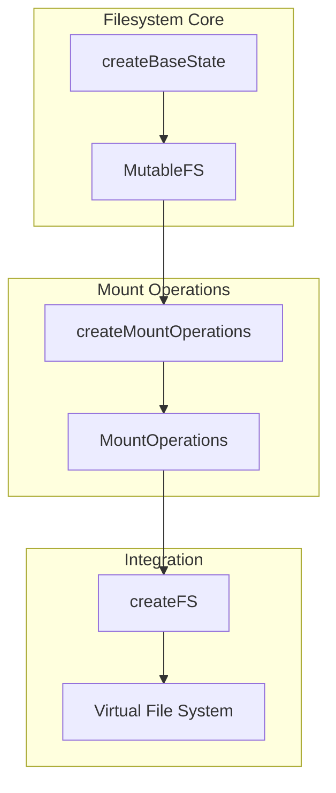
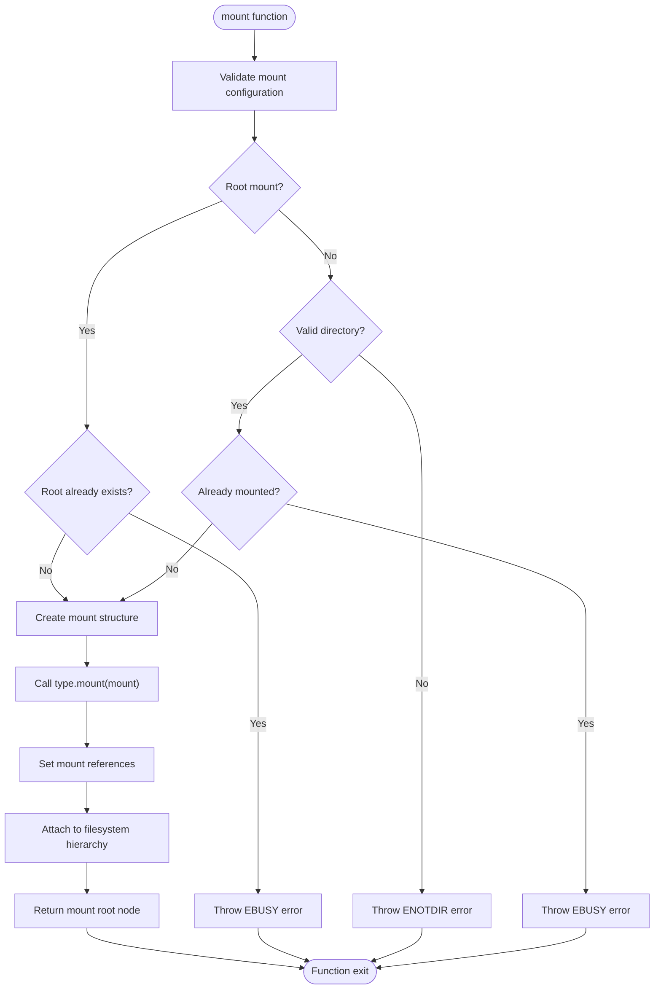
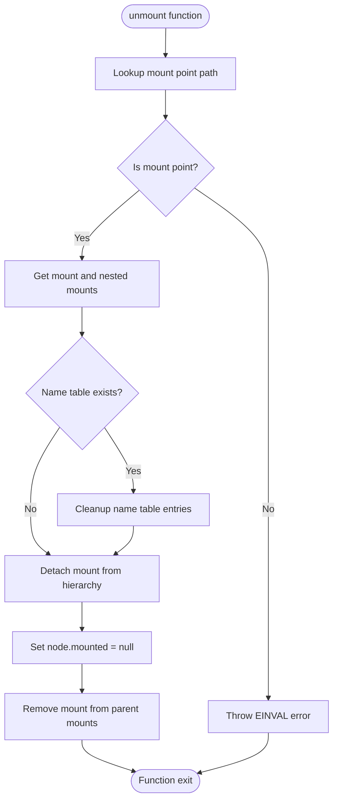
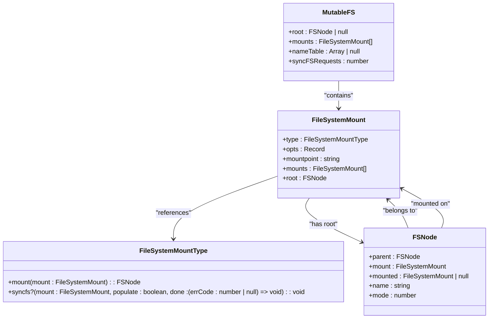
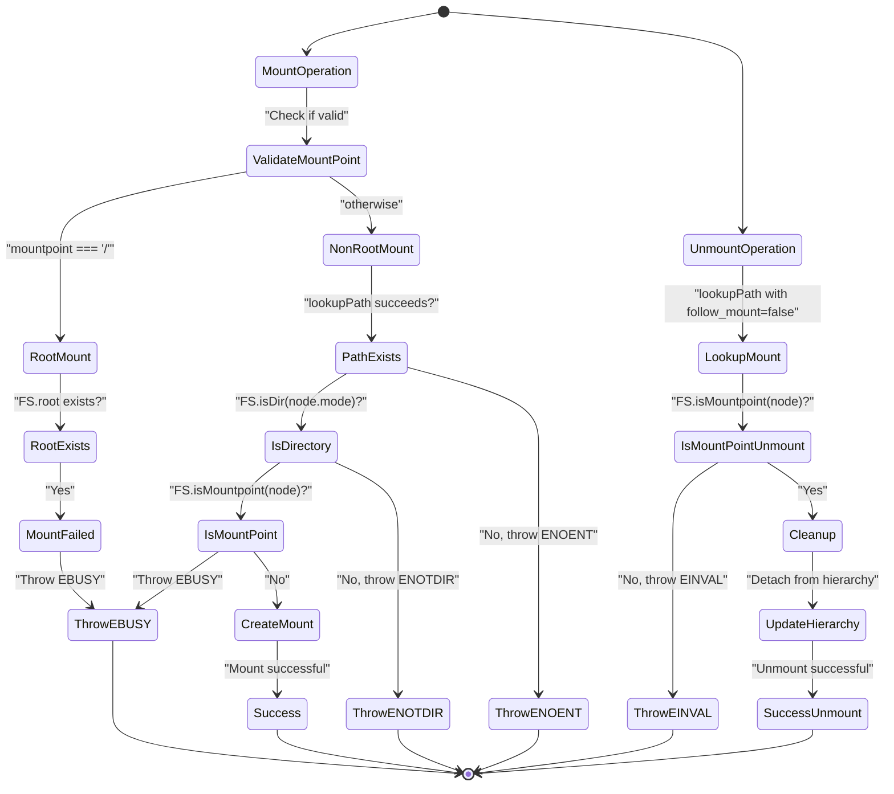
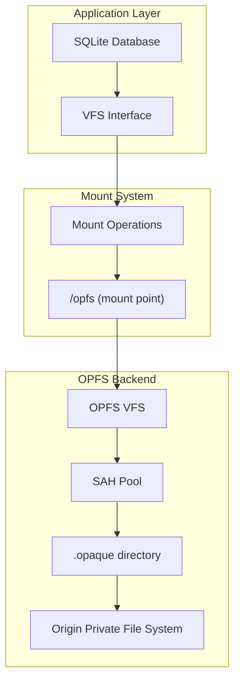
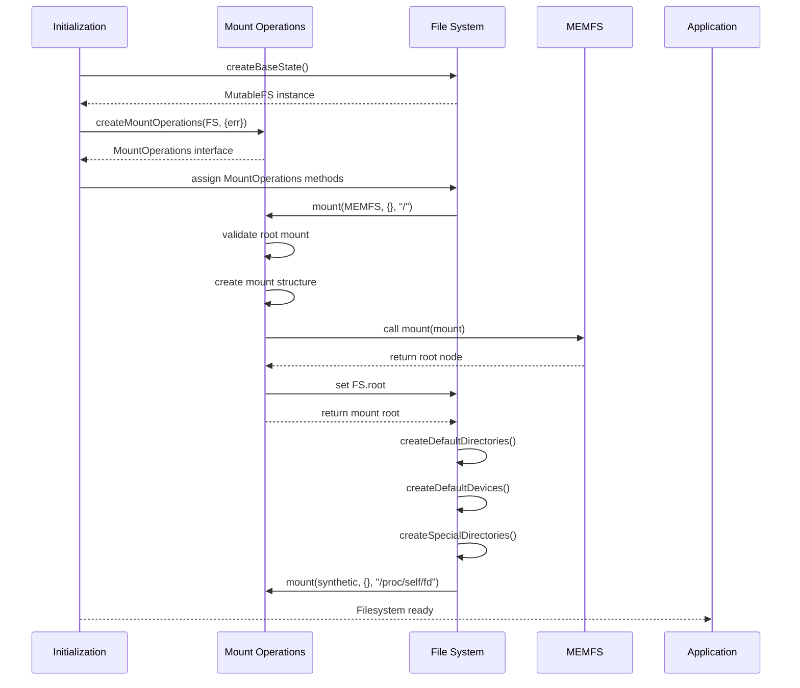

# Mount Operations

<cite>
**Referenced Files in This Document**   
- [mount-operations.ts](file://src/jswasm/vfs/filesystem/mount-operations/mount-operations.ts)
- [base-state.ts](file://src/jswasm/vfs/filesystem/base-state/base-state.ts)
- [constants.ts](file://src/jswasm/vfs/filesystem/constants/constants.ts)
- [filesystem.mjs](file://src/jswasm/vfs/filesystem.mjs)
- [initialization.ts](file://src/jswasm/vfs/filesystem/initialization/initialization.ts)
- [opfs-sahpool-vfs.mjs](file://src/jswasm/vfs/opfs/opfs-sahpool-vfs.mjs)
- [vfs-integration.mjs](file://src/jswasm/vfs/opfs/installer/wrappers/vfs-integration.mjs)
</cite>

## Table of Contents
1. [Introduction](#introduction)
2. [Mount Operations Overview](#mount-operations-overview)
3. [Mount Function](#mount-function)
4. [Unmount Function](#unmount-function)
5. [Mount State Management](#mount-state-management)
6. [Error Handling](#error-handling)
7. [OPFS Integration](#opfs-integration)
8. [Initialization and Setup](#initialization-and-setup)
9. [Security Considerations](#security-considerations)

## Introduction
The mount operations in web-sqlite-v2's VFS implementation provide a mechanism for attaching storage backends to the virtual filesystem using mount points. This enables SQLite to access different OPFS directories or storage strategies through a unified interface. The mount system allows for flexible storage configuration, enabling database files to be stored in specific OPFS locations while maintaining isolation and security. This documentation details the mount and unmount functions, their parameters, internal state updates, and integration with the OPFS backend.

## Mount Operations Overview
The mount operations system in web-sqlite-v2 provides a virtual filesystem layer that enables mounting different storage backends at specific paths. The system is implemented through the `createMountOperations` function, which returns an interface for managing mount points and device nodes within the virtual filesystem tree. The mount operations are integrated into the overall filesystem facade through the `createFS` function, which composes various helper modules including mount operations.

**Diagram sources**
- [mount-operations.ts](file://src/jswasm/vfs/filesystem/mount-operations/mount-operations.ts#L75-L309)
- [filesystem.mjs](file://src/jswasm/vfs/filesystem.mjs#L20-L56)
- [base-state.ts](file://src/jswasm/vfs/filesystem/base-state/base-state.ts#L299-L479)

**Section sources**
- [mount-operations.ts](file://src/jswasm/vfs/filesystem/mount-operations/mount-operations.ts#L75-L309)
- [filesystem.mjs](file://src/jswasm/vfs/filesystem.mjs#L20-L56)

## Mount Function
The `mount` function attaches a filesystem implementation to a specified path in the virtual filesystem. It takes three parameters: the filesystem type implementation, mount options, and the mount point path. The function validates the mount configuration, creates the mount structure, and attaches it to the filesystem hierarchy.

When mounting at the root path ("/"), the function checks if a root already exists to prevent multiple root mounts. For non-root mounts, it validates that the mount point exists, is a directory, and is not already a mount point. The function then creates a mount descriptor containing the filesystem type, options, mount point path, and an empty array for nested mounts.

**Diagram sources**
- [mount-operations.ts](file://src/jswasm/vfs/filesystem/mount-operations/mount-operations.ts#L168-L219)

**Section sources**
- [mount-operations.ts](file://src/jswasm/vfs/filesystem/mount-operations/mount-operations.ts#L168-L219)

## Unmount Function
The `unmount` function removes a previously mounted filesystem and cleans up associated nodes. It takes a single parameter: the mount point path. The function first validates that the specified path is a mount point by looking up the path and checking if the node represents a mount point.

If the path is not a mount point, the function throws an `EINVAL` error. Otherwise, it retrieves the mount and all nested mounts, cleans up name table entries associated with the mount, and detaches the mount from the filesystem hierarchy by setting the mounted property to null and removing it from the parent mount's mounts array.

**Diagram sources**
- [mount-operations.ts](file://src/jswasm/vfs/filesystem/mount-operations/mount-operations.ts#L226-L255)

**Section sources**
- [mount-operations.ts](file://src/jswasm/vfs/filesystem/mount-operations/mount-operations.ts#L226-L255)

## Mount State Management
The mount operations system maintains internal state through the `MutableFS` interface, which includes properties for tracking mounts, the root node, and the name table. The `FileSystemMount` interface defines the structure of a mount, including the filesystem type, options, mount point path, nested mounts array, and root node.

The system uses a hierarchical structure where mounts can have nested mounts, allowing for complex filesystem configurations. The `getMounts` function recursively collects all mounts reachable from a provided mount, enabling operations to be performed on entire mount hierarchies. The `syncfs` function synchronizes all mounted filesystems, handling parameter overloading for backward compatibility.

**Diagram sources**
- [base-state.ts](file://src/jswasm/vfs/filesystem/base-state/base-state.ts#L123-L148)
- [mount-operations.ts](file://src/jswasm/vfs/filesystem/mount-operations/mount-operations.ts#L14-L33)

**Section sources**
- [base-state.ts](file://src/jswasm/vfs/filesystem/base-state/base-state.ts#L123-L148)

## Error Handling
The mount operations system implements comprehensive error handling using errno codes defined in the `ERRNO_CODES` constants. The system throws specific errors for different failure conditions, providing clear feedback about the nature of the problem.

When attempting to mount at the root path when a root already exists, the system throws an `EBUSY` error. When attempting to mount at a path that is not a directory, it throws an `ENOTDIR` error. When attempting to mount at a path that is already a mount point, it also throws an `EBUSY` error. When attempting to unmount a path that is not a mount point, the system throws an `EINVAL` error.

**Diagram sources**
- [mount-operations.ts](file://src/jswasm/vfs/filesystem/mount-operations/mount-operations.ts#L178-L192)
- [mount-operations.ts](file://src/jswasm/vfs/filesystem/mount-operations/mount-operations.ts#L228-L230)
- [constants.ts](file://src/jswasm/vfs/filesystem/constants/constants.ts#L202-L241)

**Section sources**
- [mount-operations.ts](file://src/jswasm/vfs/filesystem/mount-operations/mount-operations.ts#L178-L192)
- [mount-operations.ts](file://src/jswasm/vfs/filesystem/mount-operations/mount-operations.ts#L228-L230)

## OPFS Integration
The mount operations system integrates with OPFS (Origin Private File System) through the OPFS SAH (Sync Access Handle) pool VFS implementation. The OPFS VFS creates a virtual filesystem that maps to OPFS directories, allowing SQLite databases to be stored in specific OPFS locations.

The OPFS VFS implementation uses a pool of Sync Access Handles to manage file operations, with each handle representing a file in the OPFS directory. The VFS methods handle operations like file access, reading, writing, and synchronization, translating them to OPFS operations. The mount system enables attaching this OPFS VFS to specific paths in the virtual filesystem, making OPFS storage accessible through the standard filesystem interface.

**Diagram sources**
- [opfs-sahpool-vfs.mjs](file://src/jswasm/vfs/opfs/opfs-sahpool-vfs.mjs#L6-L800)
- [vfs-integration.mjs](file://src/jswasm/vfs/opfs/installer/wrappers/vfs-integration.mjs#L45-L73)

**Section sources**
- [opfs-sahpool-vfs.mjs](file://src/jswasm/vfs/opfs/opfs-sahpool-vfs.mjs#L6-L800)

## Initialization and Setup
The mount operations system is initialized as part of the overall filesystem setup process. During initialization, the system creates default directories, devices, and streams, and mounts the initial filesystem at the root path. The initialization process sets up the basic filesystem structure that subsequent mount operations build upon.

The `staticInit` function in the initialization helpers mounts the MEMFS (Memory File System) at the root path, creating the foundation for the virtual filesystem. It also creates standard directories like /tmp, /home, and /proc, and sets up device nodes for standard input/output/error. The `/proc/self/fd` directory is mounted with a synthetic filesystem that provides symbolic links to open file descriptors.

**Diagram sources**
- [initialization.ts](file://src/jswasm/vfs/filesystem/initialization/initialization.ts#L248-L267)
- [initialization.ts](file://src/jswasm/vfs/filesystem/initialization/initialization.ts#L161-L213)

**Section sources**
- [initialization.ts](file://src/jswasm/vfs/filesystem/initialization/initialization.ts#L248-L267)

## Security Considerations
The mount operations system includes several security considerations to ensure isolation and prevent unauthorized access. The system validates mount points to prevent mounting over existing files or directories, ensuring that mount operations do not inadvertently overwrite data.

The system also prevents multiple mounts at the same location by checking if a node is already a mount point before allowing a new mount. This prevents conflicts and ensures that each mount point has a single, well-defined filesystem. The use of absolute paths for mount points and the validation of directory types help prevent path traversal attacks and ensure that mounts are only created at valid locations.

Additionally, the integration with OPFS provides inherent security benefits, as OPFS storage is isolated to the origin and cannot be accessed by other websites. The mount system leverages this isolation by mapping OPFS directories to specific mount points, ensuring that database files stored in OPFS are protected by the browser's security model.

**Section sources**
- [mount-operations.ts](file://src/jswasm/vfs/filesystem/mount-operations/mount-operations.ts#L178-L192)
- [mount-operations.ts](file://src/jswasm/vfs/filesystem/mount-operations/mount-operations.ts#L228-L230)
- [opfs-sahpool-vfs.mjs](file://src/jswasm/vfs/opfs/opfs-sahpool-vfs.mjs#L6-L800)