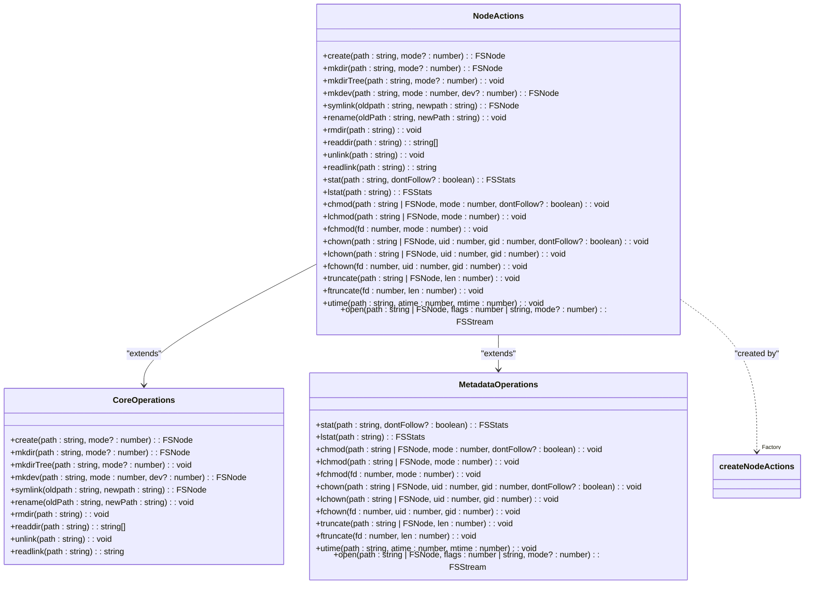
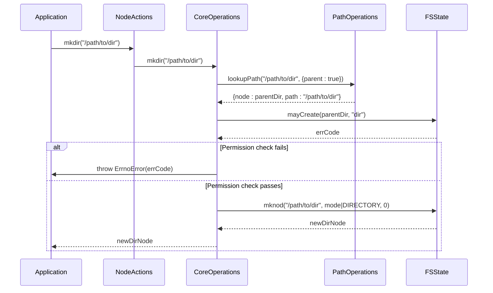
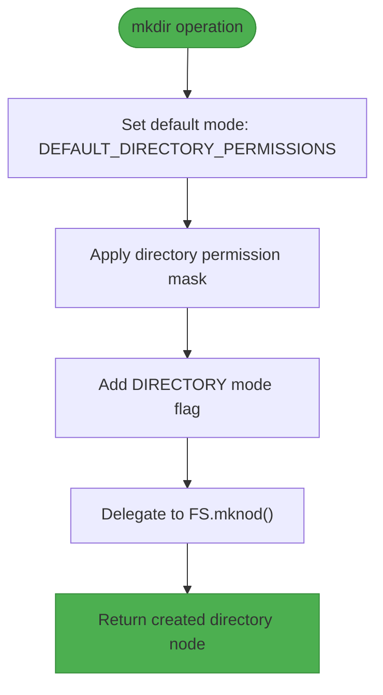
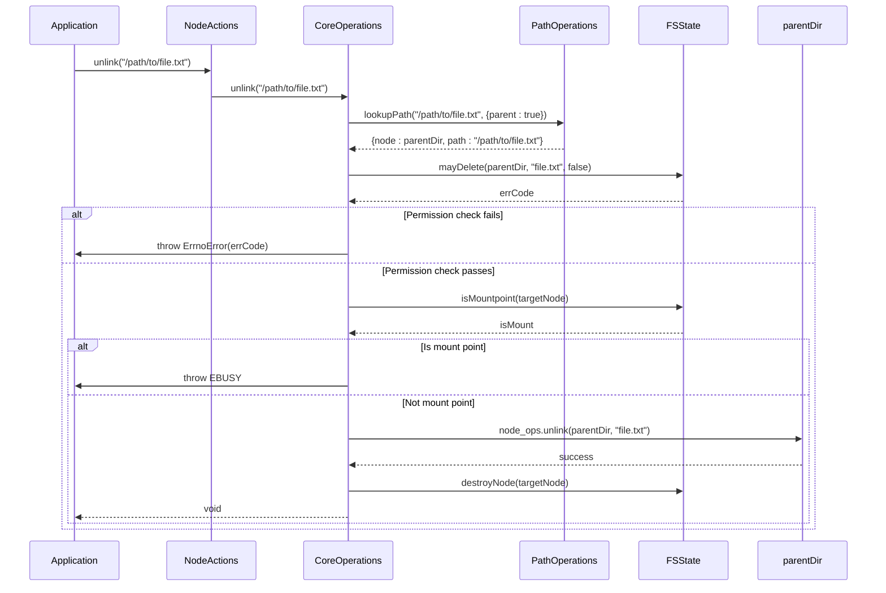
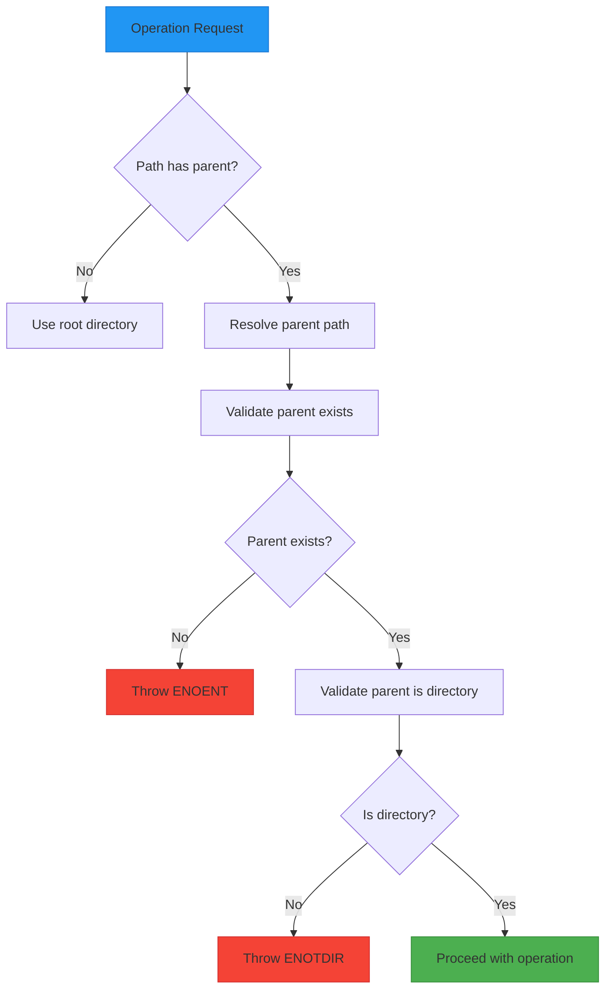
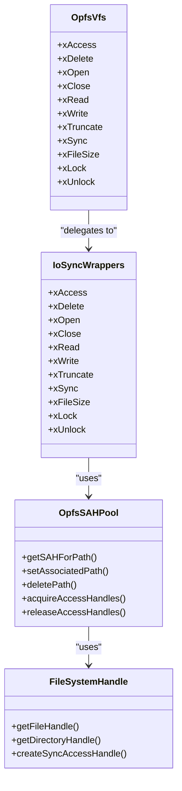
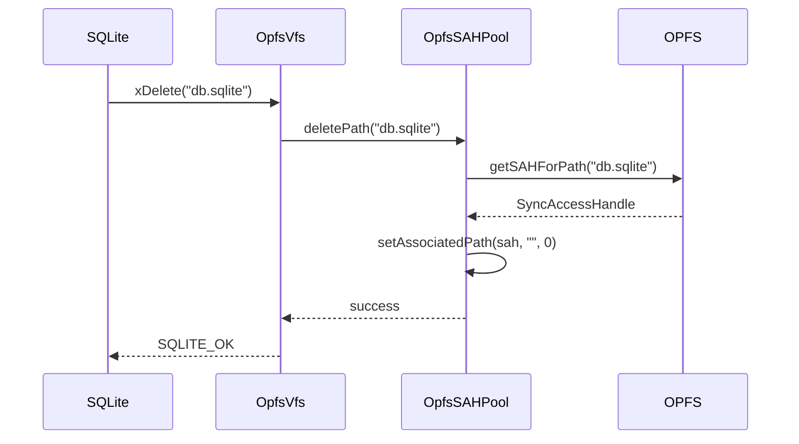
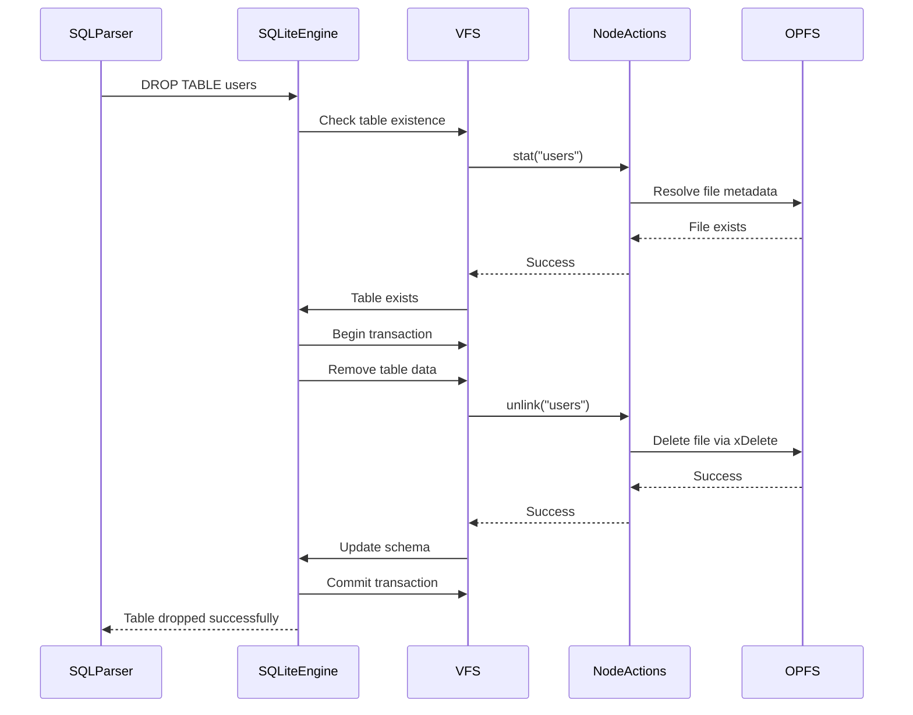
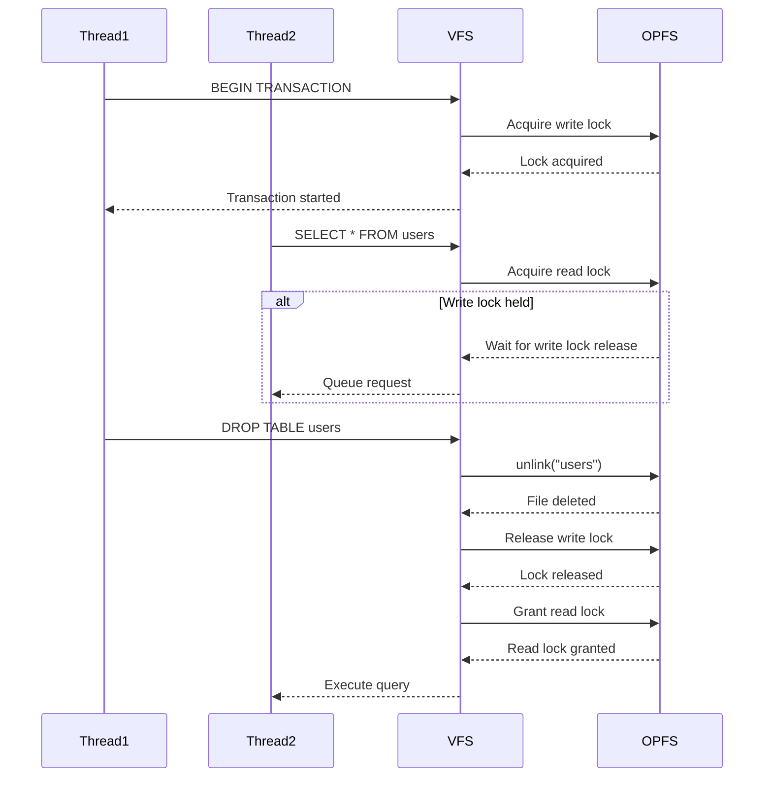
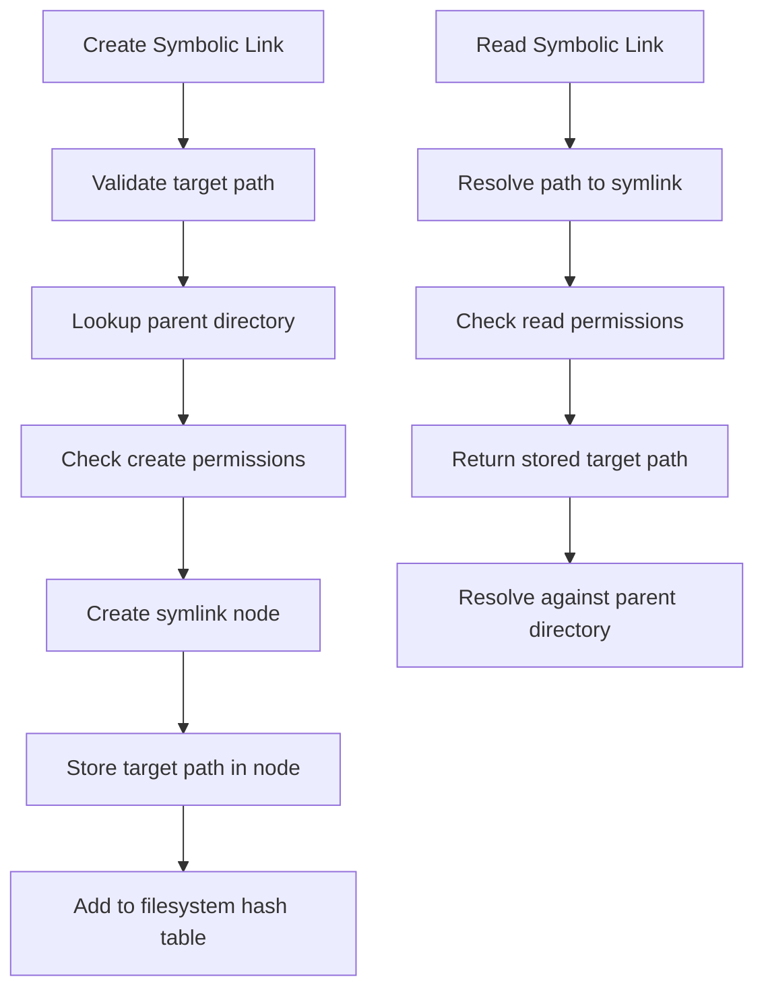

# Node Actions

<cite>
**Referenced Files in This Document**   
- [node-actions.ts](file://src/jswasm/vfs/filesystem/node-actions/node-actions.ts)
- [node-core-operations.ts](file://src/jswasm/vfs/filesystem/node-core-operations/node-core-operations.ts)
- [path-operations.ts](file://src/jswasm/vfs/filesystem/path-operations/path-operations.ts)
- [mount-operations.ts](file://src/jswasm/vfs/filesystem/mount-operations/mount-operations.ts)
- [opfs-sahpool-vfs.mjs](file://src/jswasm/vfs/opfs/opfs-sahpool-vfs.mjs)
- [io-sync-wrappers.mjs](file://src/jswasm/vfs/opfs/installer/wrappers/io-sync-wrappers.mjs)
- [constants.ts](file://src/jswasm/vfs/filesystem/constants/constants.ts)
</cite>

## Table of Contents

1. [Introduction](#introduction)
2. [Core Node Operations](#core-node-operations)
3. [Directory Operations](#directory-operations)
4. [File Deletion and Unlinking](#file-deletion-and-unlinking)
5. [Validation and Error Handling](#validation-and-error-handling)
6. [OPFS Integration](#opfs-integration)
7. [SQL Command Translation](#sql-command-translation)
8. [Atomicity and Concurrency](#atomicity-and-concurrency)
9. [Link Support](#link-support)
10. [Conclusion](#conclusion)

## Introduction

The Virtual File System (VFS) layer in web-sqlite-v2 provides a POSIX-like filesystem interface that abstracts the underlying Origin Private File System (OPFS) storage. This documentation details the node actions that enable SQLite operations on web platforms, focusing on directory creation (mkdir), directory removal (rmdir), and file unlinking operations. These operations are implemented through a layered architecture that maintains compatibility with SQLite's expectations while adapting to the constraints of web storage APIs.

The VFS implementation follows a modular design where node actions are composed from core operations and metadata operations, providing a comprehensive filesystem interface. The system handles path resolution, permission checks, and error propagation in a manner consistent with POSIX standards, while translating these operations to OPFS-compatible calls through synchronous access handles.

**Section sources**

- [node-actions.ts](file://src/jswasm/vfs/filesystem/node-actions/node-actions.ts#L23-L78)
- [node-core-operations.ts](file://src/jswasm/vfs/filesystem/node-core-operations/node-core-operations.ts#L49-L78)

## Core Node Operations

The node actions system is built on a foundation of core operations that provide fundamental filesystem manipulation capabilities. These operations are exposed through the `NodeActions` interface, which combines both core operations (file/directory creation, renaming) and metadata operations (stat, chmod, open).

The `createNodeActions` function serves as the factory for the node actions API, combining core operations from `createCoreOperations` and metadata operations from `createMetadataOperations`. This composition pattern allows for separation of concerns while providing a unified interface for filesystem manipulation.

**Diagram sources **

- [node-actions.ts](file://src/jswasm/vfs/filesystem/node-actions/node-actions.ts#L21-L78)
- [node-core-operations.ts](file://src/jswasm/vfs/filesystem/node-core-operations/node-core-operations.ts#L49-L78)
- [node-metadata-operations.ts](file://src/jswasm/vfs/filesystem/node-metadata-operations/node-metadata-operations.ts#L76-L117)

**Section sources**

- [node-actions.ts](file://src/jswasm/vfs/filesystem/node-actions/node-actions.ts#L21-L78)
- [node-core-operations.ts](file://src/jswasm/vfs/filesystem/node-core-operations/node-core-operations.ts#L49-L78)

## Directory Operations

### mkdir Implementation

The `mkdir` operation creates a new directory with specified permissions. The implementation follows a standardized pattern of input handling, core processing, and output handling. When creating a directory, the system sets default directory permissions and applies the directory mode flag before delegating to the `mknod` operation.

The `mkdirTree` function extends this capability by creating directory trees recursively, similar to the POSIX `mkdir -p` command. It processes each path component sequentially, ignoring EEXIST errors to handle cases where intermediate directories already exist.

**Diagram sources **

- [node-core-operations.ts](file://src/jswasm/vfs/filesystem/node-core-operations/node-core-operations.ts#L104-L112)
- [path-operations.ts](file://src/jswasm/vfs/filesystem/path-operations/path-operations.ts#L125-L183)

### rmdir Implementation

The `rmdir` operation removes an empty directory after performing several validation checks. The process begins with path lookup to resolve the parent directory and target directory name, followed by permission validation through the `mayDelete` function.

Critical validation steps include:

- Ensuring the target is a directory (not a file)
- Verifying the directory is empty
- Checking that the directory is not a mount point
- Validating write permissions on the parent directory

**Diagram sources **

- [node-core-operations.ts](file://src/jswasm/vfs/filesystem/node-core-operations/node-core-operations.ts#L259-L283)

**Section sources**

- [node-core-operations.ts](file://src/jswasm/vfs/filesystem/node-core-operations/node-core-operations.ts#L104-L139)
- [node-core-operations.ts](file://src/jswasm/vfs/filesystem/node-core-operations/node-core-operations.ts#L259-L283)

## File Deletion and Unlinking

The `unlink` operation removes a file or symbolic link from the filesystem. This operation follows a similar pattern to `rmdir` but is designed for non-directory entries. The implementation includes comprehensive validation to ensure the operation is performed safely and consistently with POSIX semantics.

The unlink process involves:

1. Path resolution to locate the parent directory and target filename
2. Permission validation to ensure the caller can delete from the parent directory
3. Verification that the target is not a mount point
4. Delegation to the parent directory's `unlink` operation
5. Cleanup of the filesystem node through `destroyNode`

**Diagram sources **

- [node-core-operations.ts](file://src/jswasm/vfs/filesystem/node-core-operations/node-core-operations.ts#L299-L326)

**Section sources**

- [node-core-operations.ts](file://src/jswasm/vfs/filesystem/node-core-operations/node-core-operations.ts#L299-L326)

## Validation and Error Handling

The VFS layer implements comprehensive validation checks to ensure filesystem operations are performed safely and consistently with POSIX semantics. These validations occur at multiple levels and cover various aspects of filesystem integrity.

### Parent Directory Existence

Before any file or directory operation, the system verifies that the parent directory exists and is accessible. This is accomplished through the `lookupPath` function with the `parent: true` option, which resolves the path to its parent component.

**Diagram sources **

- [path-operations.ts](file://src/jswasm/vfs/filesystem/path-operations/path-operations.ts#L125-L183)
- [node-core-operations.ts](file://src/jswasm/vfs/filesystem/node-core-operations/node-core-operations.ts#L180-L189)

### Permission Checks

The system implements a robust permission checking mechanism through the `mayCreate` and `mayDelete` functions. These functions validate that the calling process has appropriate permissions to perform the requested operation on a directory.

Common error codes returned by validation checks include:

- **EACCES**: Permission denied
- **ENOENT**: No such file or directory
- **ENOTDIR**: Not a directory
- **EISDIR**: Is a directory (when expecting a file)
- **EBUSY**: Resource busy (e.g., mount point)
- **EEXIST**: File already exists
- **ENOTEMPTY**: Directory not empty

**Section sources**

- [node-core-operations.ts](file://src/jswasm/vfs/filesystem/node-core-operations/node-core-operations.ts#L28-L30)
- [node-core-operations.ts](file://src/jswasm/vfs/filesystem/node-core-operations/node-core-operations.ts#L29-L30)
- [constants.ts](file://src/jswasm/vfs/filesystem/constants/constants.ts)

## OPFS Integration

The VFS layer integrates with the Origin Private File System (OPFS) through a series of wrapper functions that translate POSIX-style operations to OPFS-compatible calls. This integration is critical for enabling persistent storage in web environments while maintaining compatibility with SQLite's expectations.

### Synchronous Access Handles

The implementation leverages OPFS's `createSyncAccessHandle` API to provide synchronous file operations, which are required by SQLite's VFS interface. The `io-sync-wrappers.mjs` file contains the wrappers that bridge the asynchronous nature of web APIs with the synchronous requirements of SQLite.

**Diagram sources **

- [io-sync-wrappers.mjs](file://src/jswasm/vfs/opfs/installer/wrappers/io-sync-wrappers.mjs)
- [opfs-sahpool-vfs.mjs](file://src/jswasm/vfs/opfs/opfs-sahpool-vfs.mjs)

The `xDelete` operation in the OPFS VFS implementation directly maps to filesystem removal:

**Diagram sources **

- [opfs-sahpool-vfs.mjs](file://src/jswasm/vfs/opfs/opfs-sahpool-vfs.mjs#L224-L234)

**Section sources**

- [opfs-sahpool-vfs.mjs](file://src/jswasm/vfs/opfs/opfs-sahpool-vfs.mjs#L224-L234)
- [io-sync-wrappers.mjs](file://src/jswasm/vfs/opfs/installer/wrappers/io-sync-wrappers.mjs#L224-L235)

## SQL Command Translation

The VFS layer enables SQLite to perform filesystem operations through standard SQL commands. When a `DROP TABLE` command is executed, it translates into a series of node actions that manage the underlying database files.

### DROP TABLE Command Flow

When SQLite processes a `DROP TABLE` command, it follows a specific sequence of operations that interact with the VFS layer:

The translation process involves:

1. Schema validation to confirm the table exists
2. Transaction initiation to ensure atomicity
3. File deletion through the `unlink` operation
4. Schema update to remove table metadata
5. Transaction commit to finalize changes

This process ensures that the `DROP TABLE` command adheres to ACID properties, with the VFS layer providing the necessary filesystem operations to support these guarantees.

**Section sources**

- [node-core-operations.ts](file://src/jswasm/vfs/filesystem/node-core-operations/node-core-operations.ts#L299-L326)
- [opfs-sahpool-vfs.mjs](file://src/jswasm/vfs/opfs/opfs-sahpool-vfs.mjs#L224-L234)

## Atomicity and Concurrency

The VFS implementation provides atomicity guarantees for filesystem operations, which are essential for maintaining database integrity. These guarantees are implemented through a combination of transactional patterns and synchronization mechanisms.

### Atomic Operations

Filesystem operations in the VFS layer are designed to be atomic at the operation level. For example, the `unlink` operation either completely removes a file or fails without partial effects. This is achieved through the use of OPFS's synchronous access handles, which ensure that file operations are completed before returning control.

The system handles race conditions in concurrent environments through several mechanisms:

1. **File Locking**: The VFS implements SQLite's locking protocol using OPFS synchronization primitives
2. **Transaction Isolation**: Database transactions provide isolation between concurrent operations
3. **Atomic Renames**: The `rename` operation is implemented atomically to prevent race conditions

The implementation also includes protection against common race conditions, such as:

- **TOCTOU (Time-of-Check to Time-of-Use)**: Path resolution and validation are performed atomically
- **Concurrent Deletes**: The `unlink` operation checks file existence and permissions in a single atomic operation
- **Directory Modification**: Directory operations use hash table management to prevent corruption during concurrent access

**Section sources**

- [node-core-operations.ts](file://src/jswasm/vfs/filesystem/node-core-operations/node-core-operations.ts#L249-L256)
- [opfs-sahpool-vfs.mjs](file://src/jswasm/vfs/opfs/opfs-sahpool-vfs.mjs#L77-L93)

## Link Support

The VFS implementation provides support for symbolic links while restricting hard links, which is consistent with the limitations of the underlying OPFS storage system.

### Symbolic Links

Symbolic links are fully supported through the `symlink` and `readlink` operations. The implementation follows POSIX semantics for symbolic link handling:

The `symlink` operation validates that the target path is valid and that the caller has permission to create an entry in the parent directory. The target path is stored in the node's data structure and resolved relative to the parent directory when read.

### Hard Link Restrictions

Hard links are not supported in this OPFS-based implementation due to the following constraints:

1. **OPFS Limitations**: The Origin Private File System does not provide native support for hard links
2. **Storage Model**: OPFS uses a handle-based storage model that doesn't support multiple directory entries pointing to the same file data
3. **Security Considerations**: Hard links could potentially create security vulnerabilities in the sandboxed environment

The system explicitly prevents hard link creation by not implementing the necessary operations and returning appropriate error codes when such operations are attempted.

**Section sources**

- [node-core-operations.ts](file://src/jswasm/vfs/filesystem/node-core-operations/node-core-operations.ts#L153-L177)
- [node-core-operations.ts](file://src/jswasm/vfs/filesystem/node-core-operations/node-core-operations.ts#L328-L347)

## Conclusion

The node actions implementation in web-sqlite-v2's VFS layer provides a robust and POSIX-compliant interface for filesystem operations on top of the Origin Private File System. By combining core operations, metadata operations, and path operations, the system delivers the functionality required by SQLite while adapting to the constraints of web storage APIs.

Key aspects of the implementation include:

- Comprehensive validation checks for parent directory existence and permissions
- Proper error propagation following POSIX error code conventions
- Atomic operations through OPFS synchronous access handles
- Support for symbolic links while restricting hard links
- Efficient translation of SQL commands to filesystem operations

The architecture demonstrates a thoughtful balance between maintaining SQLite compatibility and leveraging modern web platform capabilities, enabling persistent database storage in browser environments while preserving the reliability and consistency expected from SQLite applications.
