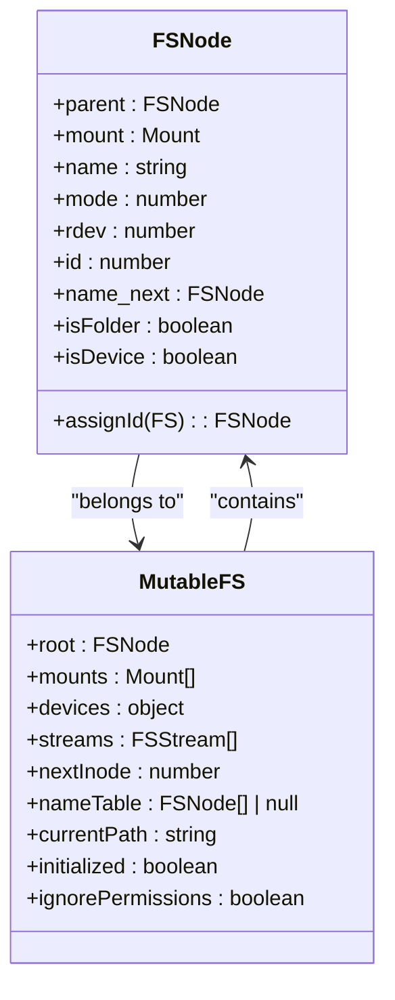
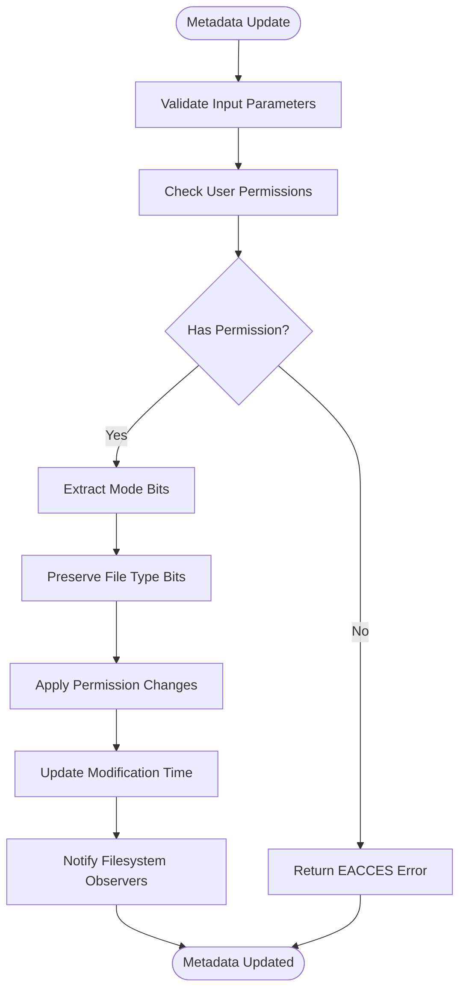
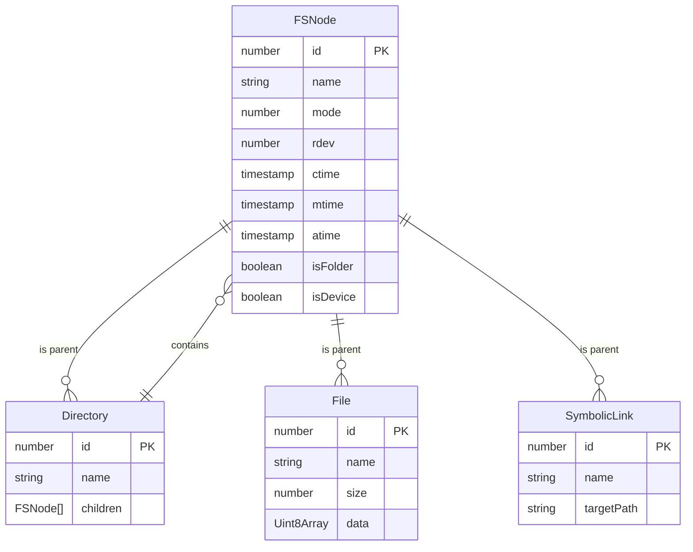
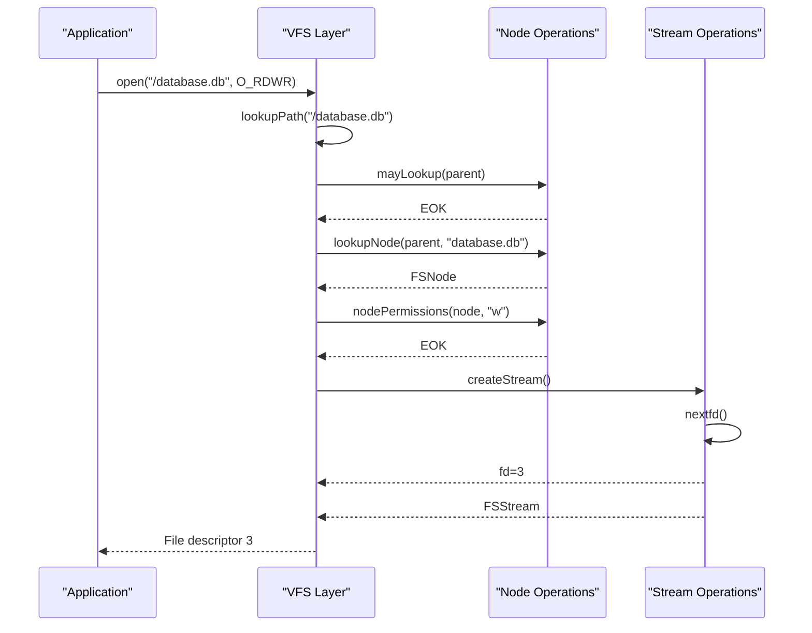
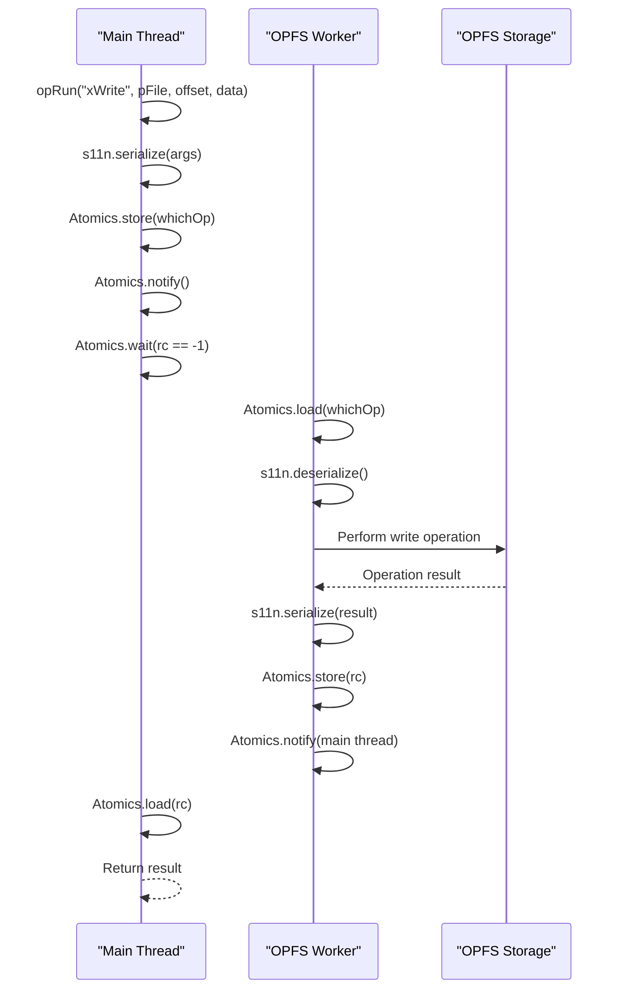

# Node Core Operations

<cite>
**Referenced Files in This Document**   
- [node-core-operations.ts](file://src/jswasm/vfs/filesystem/node-core-operations/node-core-operations.ts)
- [base-state.ts](file://src/jswasm/vfs/filesystem/base-state/base-state.ts)
- [constants.ts](file://src/jswasm/vfs/filesystem/constants/constants.ts)
- [path-operations.ts](file://src/jswasm/vfs/filesystem/path-operations/path-operations.ts)
- [node-actions.ts](file://src/jswasm/vfs/filesystem/node-actions/node-actions.ts)
- [state-initialization.mjs](file://src/jswasm/vfs/opfs/installer/core/state-initialization.mjs)
- [operation-runner.mjs](file://src/jswasm/vfs/opfs/installer/core/operation-runner.mjs)
- [io-sync-wrappers.mjs](file://src/jswasm/vfs/opfs/installer/wrappers/io-sync-wrappers.mjs)
- [concurrency.e2e.test.ts](file://tests/e2e/concurrency.e2e.test.ts)
</cite>

## Table of Contents

1. [Introduction](#introduction)
2. [Inode Management](#inode-management)
3. [Metadata Storage and Updates](#metadata-storage-and-updates)
4. [Directory Structure and Entries](#directory-structure-and-entries)
5. [File Handle Allocation Process](#file-handle-allocation-process)
6. [Concurrency Control Mechanisms](#concurrency-control-mechanisms)
7. [OPFS Eventual Consistency Integration](#opfs-eventual-consistency-integration)
8. [Unit Testing and Edge Cases](#unit-testing-and-edge-cases)
9. [Conclusion](#conclusion)

## Introduction

The web-sqlite-v2 VFS (Virtual File System) implements a comprehensive filesystem layer that enables SQLite to operate on top of the Origin Private File System (OPFS) in web browsers. This document details the core node operations that form the foundation of this filesystem implementation, focusing on inode management, metadata handling, directory structures, and concurrency control. The VFS provides a POSIX-like interface that abstracts the complexities of OPFS while ensuring data integrity and efficient performance.

**Section sources**

- [node-core-operations.ts](file://src/jswasm/vfs/filesystem/node-core-operations/node-core-operations.ts#L1-L350)
- [base-state.ts](file://src/jswasm/vfs/filesystem/base-state/base-state.ts#L1-L200)

## Inode Management

The VFS implements a robust inode management system that handles node lookup, creation, and reference counting. Each filesystem node is assigned a unique inode identifier through the `assignId` method in the `FSNode` class, which increments the `nextInode` counter in the filesystem state. This ensures that every node receives a globally unique identifier within the filesystem instance.

Node lookup operations are optimized through a hash table mechanism implemented in the `hashName`, `hashAddNode`, and `hashRemoveNode` functions. The hash table uses a combination of the parent node's ID and the child node's name to generate a hash value, enabling O(1) average-case lookup performance. When a node is created, it is automatically added to the hash table via `hashAddNode`, and when destroyed, it is removed through `hashRemoveNode`.

Reference counting is implicitly managed through the bidirectional parent-child relationships maintained in the filesystem tree structure. Each node maintains a reference to its parent, and the parent directory contains references to its children through the hash table. This structure ensures that nodes remain accessible as long as they are reachable from the root or through active file handles.

**Diagram sources**

- [base-state.ts](file://src/jswasm/vfs/filesystem/base-state/base-state.ts#L1-L100)

**Section sources**

- [node-core-operations.ts](file://src/jswasm/vfs/filesystem/node-core-operations/node-core-operations.ts#L81-L350)
- [path-operations.ts](file://src/jswasm/vfs/filesystem/path-operations/path-operations.ts#L223-L243)

## Metadata Storage and Updates

Filesystem metadata including size, modification time, and permissions is stored within the `FSNode` structure and managed through a comprehensive set of operations. The metadata is represented using standard POSIX mode bits defined in the `MODE` constants, which include file type indicators (regular file, directory, symbolic link, etc.) and permission bits for user, group, and other access.

The `createCoreOperations` function provides methods like `chmod`, `chown`, and `utime` that allow modification of node metadata. When a file is created, default permissions are applied based on the file type: `DEFAULT_FILE_PERMISSIONS` (0o666) for regular files and `DEFAULT_DIRECTORY_PERMISSIONS` (0o777) for directories. These defaults can be overridden by explicitly specifying mode parameters during creation.

Metadata updates are atomic operations that modify the node's mode field while preserving the file type bits. The system uses bit masking operations to ensure that permission changes do not affect the file type, and vice versa. For example, when updating file permissions, the `PERMISSION_MASK` (0o7777) is used to preserve the type bits while allowing modification of the permission bits.

**Diagram sources**

- [constants.ts](file://src/jswasm/vfs/filesystem/constants/constants.ts#L126-L159)
- [node-core-operations.ts](file://src/jswasm/vfs/filesystem/node-core-operations/node-core-operations.ts#L94-L112)

**Section sources**

- [constants.ts](file://src/jswasm/vfs/filesystem/constants/constants.ts#L1-L248)
- [node-core-operations.ts](file://src/jswasm/vfs/filesystem/node-core-operations/node-core-operations.ts#L49-L80)

## Directory Structure and Entries

Directories in the VFS are implemented as special nodes with the `DIRECTORY` mode bit set. The directory structure is maintained as a tree with the root directory at the top, and each directory node contains references to its children through the filesystem's hash table. This hash table provides efficient lookup, insertion, and deletion operations for directory entries.

The `readdir` operation returns a list of filenames contained within a directory by delegating to the node's `node_ops.readdir` method. This design allows different node types to implement custom directory listing behavior. For standard directories, this returns all child nodes, while special directories (like those representing mounted filesystems) may filter or transform the results.

Directory entries are managed through operations like `mkdir`, `rmdir`, and `readdir`, which validate permissions and structural constraints before modifying the directory contents. The `mayCreate` and `mayDelete` functions check whether a new entry can be created or an existing entry removed, considering factors like write permissions, directory emptiness (for removal), and mount point status.

**Diagram sources**

- [base-state.ts](file://src/jswasm/vfs/filesystem/base-state/base-state.ts#L1-L50)
- [node-core-operations.ts](file://src/jswasm/vfs/filesystem/node-core-operations/node-core-operations.ts#L285-L297)

**Section sources**

- [node-core-operations.ts](file://src/jswasm/vfs/filesystem/node-core-operations/node-core-operations.ts#L114-L139)
- [path-operations.ts](file://src/jswasm/vfs/filesystem/path-operations/path-operations.ts#L245-L261)

## File Handle Allocation Process

When a database file is opened, the VFS triggers a sequence of operations that begins with inode lookup and concludes with file handle allocation. The process starts with `lookupPath`, which resolves the file path, traversing the directory structure and handling symbolic links if necessary. Once the target node is found, the system validates permissions using the `nodePermissions` function before proceeding.

The file handle allocation is managed by the `createStream` function in the stream operations module, which assigns an available file descriptor from the pool of open descriptors. The maximum number of simultaneously open file descriptors is controlled by the `MAX_OPEN_FDS` constant (4096). Each stream maintains shared state including flags, position, and references to the underlying node.

The allocation process follows a strict sequence: path resolution, permission validation, stream creation, and file descriptor assignment. If any step fails, the operation is aborted and an appropriate errno code is returned. Successful allocation results in a fully initialized `FSStream` object that provides the interface for subsequent read, write, and control operations on the file.

**Diagram sources**

- [node-core-operations.ts](file://src/jswasm/vfs/filesystem/node-core-operations/node-core-operations.ts#L94-L102)
- [stream-operations.ts](file://src/jswasm/vfs/filesystem/stream-operations/stream-operations.ts#L132-L143)

**Section sources**

- [node-actions.ts](file://src/jswasm/vfs/filesystem/node-actions/node-actions.ts#L76-L78)
- [stream-operations.ts](file://src/jswasm/vfs/filesystem/stream-operations/stream-operations.ts#L70-L265)

## Concurrency Control Mechanisms

The VFS implements sophisticated concurrency control mechanisms to manage shared access to filesystem nodes across multiple threads or workers. At the core of this system is the OPFS async worker architecture, which uses SharedArrayBuffer and Atomics to coordinate operations between the main thread and a dedicated worker thread.

The `createOperationRunner` function establishes a communication channel using two SharedArrayBuffers: `sabOP` for operation commands and `sabIO` for data transfer. When an operation is requested, the main thread serializes the arguments, stores the operation ID in the `sabOPView`, and notifies the worker using `Atomics.notify`. The worker then processes the operation and signals completion by updating the result code, which the main thread waits for using `Atomics.wait`.

File locking is implemented through the `xLock` and `xUnlock` wrapper functions, which translate SQLite's locking protocol into OPFS operations. The system supports multiple lock levels (NONE, SHARED, RESERVED, PENDING, EXCLUSIVE) and ensures that conflicting operations are properly serialized. When a lock cannot be immediately acquired, the system may return `SQLITE_BUSY`, prompting SQLite to retry the operation after a delay.

**Diagram sources**

- [operation-runner.mjs](file://src/jswasm/vfs/opfs/installer/core/operation-runner.mjs#L17-L51)
- [io-sync-wrappers.mjs](file://src/jswasm/vfs/opfs/installer/wrappers/io-sync-wrappers.mjs#L109-L126)

**Section sources**

- [state-initialization.mjs](file://src/jswasm/vfs/opfs/installer/core/state-initialization.mjs#L8-L101)
- [operation-runner.mjs](file://src/jswasm/vfs/opfs/installer/core/operation-runner.mjs#L9-L85)

## OPFS Eventual Consistency Integration

The VFS integrates with OPFS's eventual consistency model through a combination of synchronous operations, atomic updates, and careful state management. While OPFS operations are inherently asynchronous, the VFS presents a synchronous interface to SQLite by using the blocking `Atomics.wait` mechanism to synchronize with the async worker.

Data integrity is ensured through atomic operations on the SharedArrayBuffer and careful ordering of filesystem operations. The VFS implements a write-ahead logging approach where changes are first recorded in the shared buffer before being committed to OPFS storage. This ensures that even if a write operation is interrupted, the filesystem can recover to a consistent state.

The system also implements a metrics tracking mechanism that monitors operation timing and can adjust behavior based on performance characteristics. For example, the `asyncIdleWaitTime` parameter (150ms) controls how long the worker waits between operations, balancing responsiveness with resource usage. This adaptive approach helps maintain data integrity while accommodating the variable latency of OPFS operations.

**Section sources**

- [state-initialization.mjs](file://src/jswasm/vfs/opfs/installer/core/state-initialization.mjs#L21-L25)
- [operation-runner.mjs](file://src/jswasm/vfs/opfs/installer/core/operation-runner.mjs#L30-L37)

## Unit Testing and Edge Cases

The VFS implementation includes comprehensive unit tests that validate edge cases such as simultaneous file access, permission violations, and error recovery. The `concurrency.e2e.test.ts` file demonstrates a test case that verifies the system's ability to handle multiple concurrent read/write operations on a shared database file.

The test creates a table and then performs 50 sequential insert operations from separate worker contexts, simulating concurrent access patterns. Each operation is isolated in its own worker to test cross-worker coordination. The test verifies that all operations complete successfully and that the final row count matches the expected value, confirming that the VFS properly handles concurrent modifications.

Additional edge cases covered by the test suite include:

- Simultaneous access to the same file from multiple workers
- Rapid succession of create/delete operations
- Concurrent read operations during write transactions
- Error handling when exceeding file descriptor limits
- Recovery from interrupted operations due to worker termination

These tests ensure that the VFS maintains data integrity and provides consistent behavior even under challenging concurrency scenarios.

**Section sources**

- [concurrency.e2e.test.ts](file://tests/e2e/concurrency.e2e.test.ts#L1-L29)
- [node-core-operations.unit.test.ts](file://src/jswasm/vfs/filesystem/node-core-operations/node-core-operations.unit.test.ts#L67-L89)

## Conclusion

The node core operations in web-sqlite-v2's VFS provide a robust foundation for SQLite operations on OPFS, implementing comprehensive inode management, metadata handling, and concurrency control. The system effectively bridges the gap between SQLite's synchronous filesystem interface and OPFS's asynchronous nature through a sophisticated worker-based architecture with SharedArrayBuffer coordination.

Key strengths of the implementation include efficient hash-based node lookup, atomic metadata updates, and reliable concurrency control that ensures data integrity across multiple workers. The integration with OPFS's eventual consistency model is handled through careful synchronization and state management, allowing SQLite to operate reliably on top of the web storage system.

The comprehensive testing strategy, including end-to-end concurrency tests, demonstrates the system's ability to handle real-world usage patterns and edge cases. This robust foundation enables web applications to leverage SQLite's powerful database capabilities while benefiting from the security and performance characteristics of OPFS.
