# Path Operations

<cite>
**Referenced Files in This Document**   
- [path-operations.ts](file://src/jswasm/vfs/filesystem/path-operations/path-operations.ts)
- [path.ts](file://src/jswasm/utils/path/path.ts)
- [mount-operations.ts](file://src/jswasm/vfs/filesystem/mount-operations/mount-operations.ts)
- [base-state.ts](file://src/jswasm/vfs/filesystem/base-state/base-state.ts)
- [constants.ts](file://src/jswasm/vfs/filesystem/constants/constants.ts)
- [node-core-operations.ts](file://src/jswasm/vfs/filesystem/node-core-operations/node-core-operations.ts)
- [initialization.ts](file://src/jswasm/vfs/filesystem/initialization/initialization.ts)
- [vfs-integration.mjs](file://src/jswasm/vfs/opfs/installer/wrappers/vfs-integration.mjs)
</cite>

## Table of Contents
1. [Introduction](#introduction)
2. [Path Resolution and Normalization](#path-resolution-and-normalization)
3. [Path Traversal and Lookup](#path-traversal-and-lookup)
4. [Symbolic Link and Mount Point Handling](#symbolic-link-and-mount-point-handling)
5. [Security Considerations and Path Validation](#security-considerations-and-path-validation)
6. [Mount Point Integration](#mount-point-integration)
7. [Performance Optimizations](#performance-optimizations)
8. [Edge Cases and Error Handling](#edge-cases-and-error-handling)
9. [OPFS Integration](#opfs-integration)
10. [Conclusion](#conclusion)

## Introduction
The web-sqlite-v2 Virtual File System (VFS) implements a comprehensive path operations layer that handles the resolution, normalization, and validation of file paths before they are processed by the underlying OPFS (Origin Private File System) storage. This documentation details the implementation of path operations in the VFS layer, focusing on how relative and absolute paths are processed, how directory traversal and symlink resolution are handled, and how security concerns like path traversal attacks are mitigated. The system provides robust path handling capabilities that ensure secure and efficient access to database files stored in the browser's private file system.

**Section sources**
- [path-operations.ts](file://src/jswasm/vfs/filesystem/path-operations/path-operations.ts#L1-L287)
- [path.ts](file://src/jswasm/utils/path/path.ts#L1-L208)

## Path Resolution and Normalization
The path operations system in web-sqlite-v2 begins with comprehensive path resolution and normalization to ensure consistent and secure path handling. The implementation uses a modular approach with dedicated utilities for path manipulation.

The core path utilities are provided by the `PATH` object, which offers functions for common path operations:

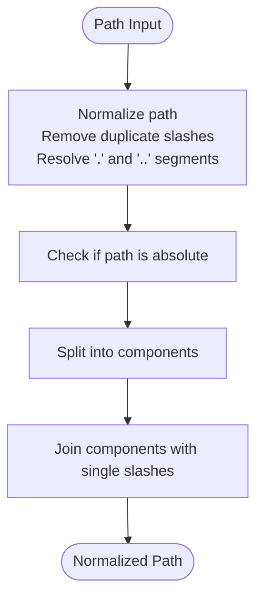

**Diagram sources**
- [path.ts](file://src/jswasm/utils/path/path.ts#L10-L131)

The `PATH.normalize()` function handles the core normalization logic, processing paths by:
1. Determining if the path is absolute (starts with '/')
2. Preserving trailing slashes in the normalized result
3. Splitting the path into components and filtering out empty segments
4. Processing '.' and '..' segments to resolve relative paths
5. Rejoining components with single forward slashes

For path resolution, the system uses `createPathFS()` which combines multiple path utilities into a cohesive interface. The `resolve()` method implements a right-to-left processing approach, starting from the rightmost argument and working backward, using the current working directory as a fallback for undefined segments.

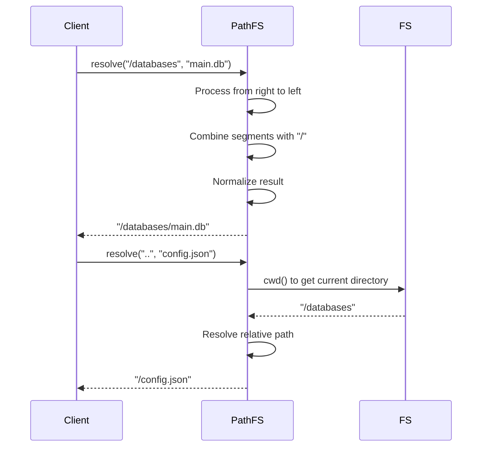

**Diagram sources**
- [path.ts](file://src/jswasm/utils/path/path.ts#L134-L163)
- [base-state.ts](file://src/jswasm/vfs/filesystem/base-state/base-state.ts#L251)

**Section sources**
- [path.ts](file://src/jswasm/utils/path/path.ts#L1-L208)

## Path Traversal and Lookup
The path traversal system in web-sqlite-v2's VFS is implemented through the `lookupPath` function, which resolves paths through the virtual filesystem hierarchy. This function handles the complete path traversal process, from initial resolution to final node lookup.

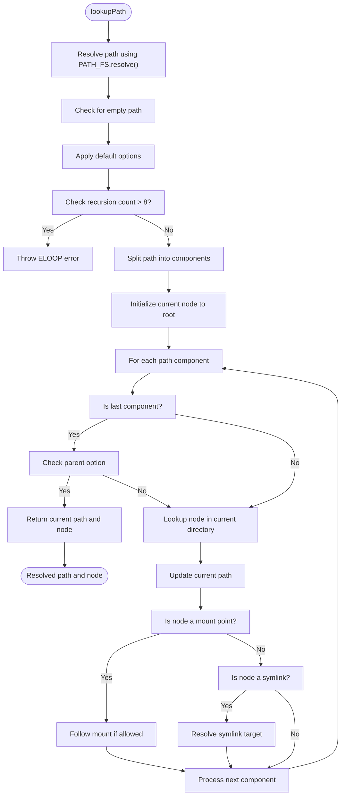

**Diagram sources**
- [path-operations.ts](file://src/jswasm/vfs/filesystem/path-operations/path-operations.ts#L125-L183)

The `lookupPath` function takes several parameters:
- `path`: The path string to look up
- `opts`: Optional flags to control lookup behavior

The function supports various options through the `LookupPathOptions` interface:
- `follow_mount`: Whether to follow mount points during traversal
- `recurse_count`: Guard against excessive symlink recursion
- `parent`: Whether to resolve the parent directory instead of the final entry
- `follow`: Force resolution of symbolic links on the final segment

The traversal process begins by resolving the input path using the `PATH_FS.resolve()` method, which normalizes the path and resolves any relative components. The function then splits the path into components, filtering out empty segments (which handles cases like duplicate slashes).

For each path component, the system:
1. Looks up the node in the current directory using `FS.lookupNode()`
2. Updates the current path by joining it with the current component
3. Handles mount points by transitioning to the mounted filesystem if appropriate
4. Resolves symbolic links by recursively looking up the link target

The implementation includes safeguards against infinite recursion, with a maximum recursion depth of 8 levels for mount traversal and 40 levels for symlink resolution.

**Section sources**
- [path-operations.ts](file://src/jswasm/vfs/filesystem/path-operations/path-operations.ts#L125-L183)
- [constants.ts](file://src/jswasm/vfs/filesystem/constants/constants.ts#L202-L221)

## Symbolic Link and Mount Point Handling
The VFS implementation in web-sqlite-v2 provides sophisticated handling of symbolic links and mount points, enabling complex filesystem hierarchies while maintaining security and performance.

### Symbolic Link Resolution
Symbolic links are handled during the path traversal process in the `lookupPath` function. When a node with the symlink mode bit set is encountered, the system resolves the link target and continues traversal from the resolved path.

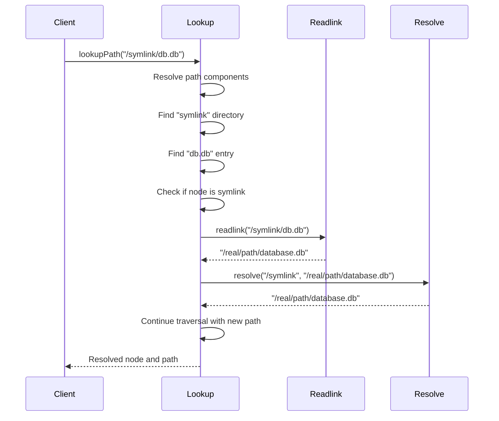

**Diagram sources**
- [path-operations.ts](file://src/jswasm/vfs/filesystem/path-operations/path-operations.ts#L166-L179)
- [node-core-operations.ts](file://src/jswasm/vfs/filesystem/node-core-operations/node-core-operations.ts#L328-L347)

The symlink resolution process:
1. Detects if the current node is a symbolic link using `FS.isLink(mode)`
2. Reads the link target using `FS.readlink(currentPath)`
3. Resolves the target path relative to the link's parent directory
4. Performs a recursive lookup with the resolved path
5. Continues traversal with the resulting node

The system implements recursion limits to prevent infinite loops, throwing an `ELOOP` error if the recursion depth exceeds 40 levels.

### Mount Point Integration
Mount points allow different filesystem implementations to be integrated into the virtual filesystem hierarchy. The system handles mount points during path traversal, seamlessly transitioning between different filesystems.

```mermaid
graph TD
A[/] --> B[databases]
B --> C[main.db]
A --> D[cache]
D --> E[temp.db]
A --> F[mounted-fs]
F --> G[data.db]
F --> H[config.db]
style F fill:#f9f,stroke:#333
note right of F: Mounted filesystem
subgraph "Global VFS"
A
B
D
end
subgraph "Mounted VFS"
F
G
H
end
```

**Diagram sources**
- [path-operations.ts](file://src/jswasm/vfs/filesystem/path-operations/path-operations.ts#L158-L162)
- [mount-operations.ts](file://src/jswasm/vfs/filesystem/mount-operations/mount-operations.ts#L168-L219)

When a mount point is encountered during traversal:
1. The system checks if the current node is a mount point using `FS.isMountpoint()`
2. If `follow_mount` is true or this is not the last component, the traversal continues from the root of the mounted filesystem
3. The current node is updated to the root of the mounted filesystem
4. Path traversal continues with the remaining components

The mount system supports nested mounts, allowing filesystems to be mounted within other mounted filesystems. The `getMounts()` function recursively collects all mounts reachable from a given mount point, enabling operations like synchronization to be applied across the entire mount hierarchy.

**Section sources**
- [path-operations.ts](file://src/jswasm/vfs/filesystem/path-operations/path-operations.ts#L158-L180)
- [mount-operations.ts](file://src/jswasm/vfs/filesystem/mount-operations/mount-operations.ts#L86-L101)

## Security Considerations and Path Validation
The path operations system in web-sqlite-v2 implements multiple security measures to prevent path traversal attacks and ensure secure file access.

### Path Traversal Attack Prevention
The system employs several strategies to prevent directory escaping and unauthorized file access:

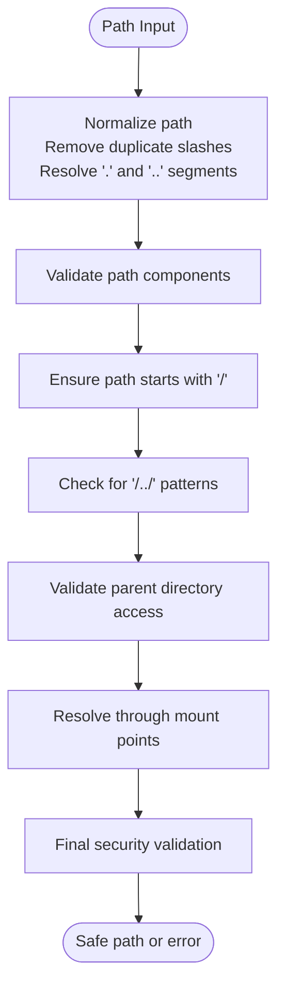

**Diagram sources**
- [path-operations.ts](file://src/jswasm/vfs/filesystem/path-operations/path-operations.ts#L127-L128)
- [constants.ts](file://src/jswasm/vfs/filesystem/constants/constants.ts#L202-L221)

Key security features include:
1. **Path normalization**: All paths are normalized using `PATH_FS.resolve()` which eliminates `.` and `..` segments and duplicate slashes
2. **Recursion limits**: The system limits symlink recursion to 40 levels and mount traversal recursion to 8 levels to prevent infinite loops
3. **Permission checks**: The `mayLookup()` function validates that the calling process has permission to access the parent directory
4. **Mount point validation**: The system verifies that mount points are properly configured and accessible

The implementation prevents directory escaping by ensuring that all paths are resolved relative to the filesystem root. Even if a path contains sequences like `../../../`, the normalization process resolves these to valid paths within the filesystem hierarchy.

### Error Handling and Validation
The system uses a comprehensive errno-based error handling system to report path-related errors:

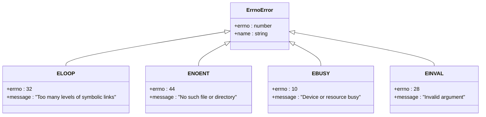

**Diagram sources**
- [base-state.ts](file://src/jswasm/vfs/filesystem/base-state/base-state.ts#L16-L19)
- [constants.ts](file://src/jswasm/vfs/filesystem/constants/constants.ts#L202-L241)

When path validation fails, the system throws `FS.ErrnoError` instances with appropriate error codes:
- `ELOOP` (32): Thrown when symlink or mount recursion limits are exceeded
- `ENOENT` (44): Thrown when a path component does not exist
- `EBUSY` (10): Thrown when attempting to mount over an existing mount point
- `EINVAL` (28): Thrown for invalid path arguments

The error handling is integrated throughout the path operations system, with validation checks at each stage of path traversal.

**Section sources**
- [path-operations.ts](file://src/jswasm/vfs/filesystem/path-operations/path-operations.ts#L138-L140)
- [constants.ts](file://src/jswasm/vfs/filesystem/constants/constants.ts#L202-L241)
- [base-state.ts](file://src/jswasm/vfs/filesystem/base-state/base-state.ts#L16-L19)

## Mount Point Integration
The mount point system in web-sqlite-v2 enables flexible integration of different storage backends through the virtual filesystem. The implementation provides a robust mechanism for mounting filesystems at specific paths and routing operations to the appropriate backend.

### Mount Operations
The `mount` function is responsible for attaching a filesystem implementation to a specific path in the virtual filesystem:

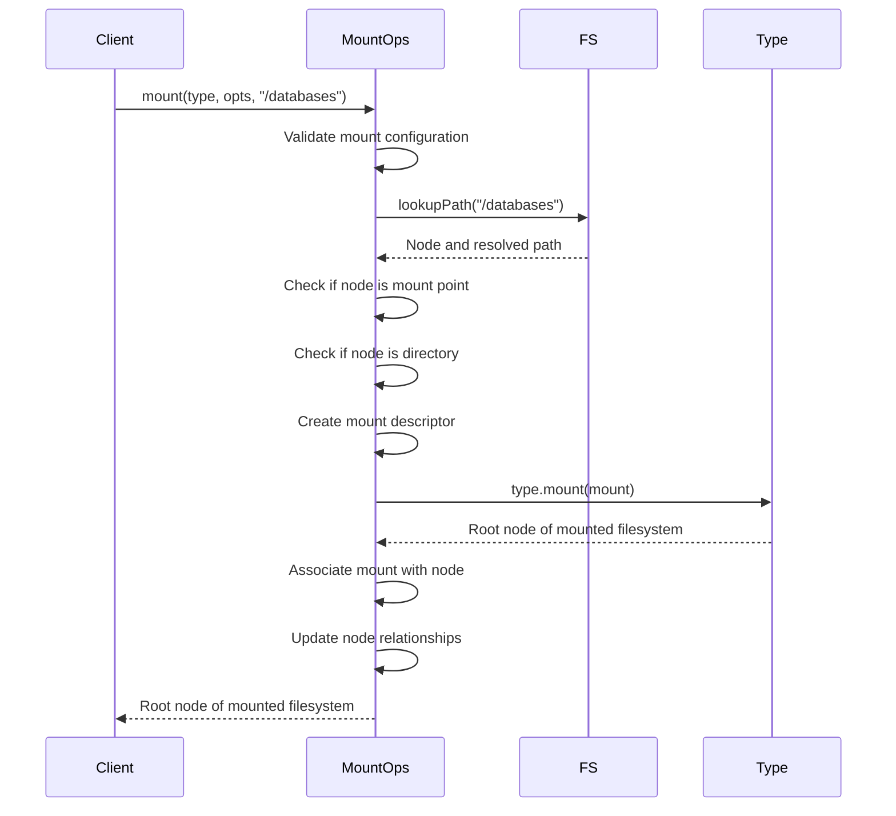

**Diagram sources**
- [mount-operations.ts](file://src/jswasm/vfs/filesystem/mount-operations/mount-operations.ts#L168-L219)

The mount process involves several validation steps:
1. For root mounts (`/`), ensuring no existing root filesystem
2. For non-root mounts, verifying the mount point exists and is a directory
3. Checking that the mount point is not already a mount point
4. Creating a mount descriptor that links the filesystem implementation to the path

### Mount Hierarchy and Synchronization
The system maintains a hierarchical structure of mounts, allowing for nested filesystems. The `getMounts()` function recursively collects all mounts reachable from a given mount point:

```mermaid
graph TD
A[Root Mount] --> B[Mount A]
A --> C[Mount B]
B --> D[Nested Mount]
C --> E[Nested Mount]
D --> F[Deeply Nested]
style A fill:#ff9,stroke:#333
style B fill:#f9f,stroke:#333
style C fill:#f9f,stroke:#333
style D fill:#9ff,stroke:#333
style E fill:#9ff,stroke:#333
style F fill:#9f9,stroke:#333
note right of A: Root filesystem
note right of B,C: Primary mounts
note right of D,E: Nested mounts
note right of F: Deeply nested
```

**Diagram sources**
- [mount-operations.ts](file://src/jswasm/vfs/filesystem/mount-operations/mount-operations.ts#L86-L101)

The `syncfs()` function synchronizes all mounted filesystems, ensuring data consistency across all storage backends:

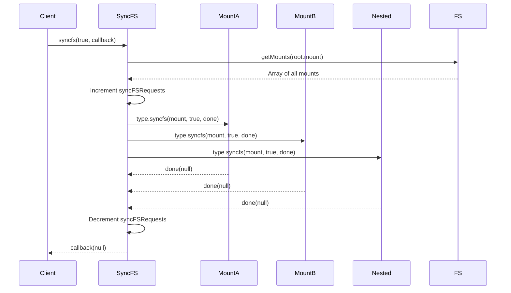

**Diagram sources**
- [mount-operations.ts](file://src/jswasm/vfs/filesystem/mount-operations/mount-operations.ts#L110-L158)

The synchronization process handles multiple concurrent sync operations and ensures that all mounted filesystems are synchronized, either with population from storage (when `populate` is true) or just flushing pending writes.

**Section sources**
- [mount-operations.ts](file://src/jswasm/vfs/filesystem/mount-operations/mount-operations.ts#L168-L219)
- [mount-operations.ts](file://src/jswasm/vfs/filesystem/mount-operations/mount-operations.ts#L110-L158)

## Performance Optimizations
The path operations system in web-sqlite-v2 incorporates several performance optimizations to ensure efficient path resolution and filesystem operations.

### Hash Table-Based Path Resolution
The system uses a hash table to accelerate node lookups, significantly improving performance for frequently accessed paths:

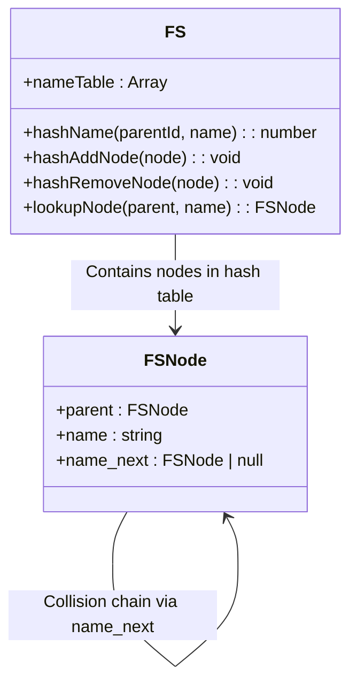

**Diagram sources**
- [path-operations.ts](file://src/jswasm/vfs/filesystem/path-operations/path-operations.ts#L215-L243)
- [base-state.ts](file://src/jswasm/vfs/filesystem/base-state/base-state.ts#L249)

The hash table implementation:
- Uses a simple hash function that combines the parent ID and name characters
- Handles collisions through linked lists (open addressing)
- Provides O(1) average-case lookup time for path components
- Is automatically updated when nodes are created or destroyed

The `hashName()` function computes a hash value using a polynomial rolling hash algorithm:
```typescript
hash = ((hash << 5) - hash + name.charCodeAt(i)) | 0;
return ((parentId + hash) >>> 0) % FS.nameTable!.length;
```

This approach ensures good distribution of hash values while being computationally efficient.

### Path Caching and Canonicalization
The system implements path canonicalization through the `getPath()` function, which reconstructs the full path for a given filesystem node:

```mermaid
flowchart TD
Start([getPath(node)]) --> Initialize["Initialize empty path segments array"]
Initialize --> Traverse["Traverse upward from node to root"]
Traverse --> IsRoot["Is current node the root?"]
IsRoot --> |No| AddName["Add current node name to segments"]
AddName --> UpdateParent["Move to parent node"]
UpdateParent --> Traverse
IsRoot --> |Yes| HandleMount["Check for mount point"]
HandleMount --> HasMountpoint["Does node have mountpoint?"]
HasMountpoint --> |Yes| PrependMount["Prepend mountpoint to path"]
HasMountpoint --> |No| JoinSegments["Join segments with '/'"]
PrependMount --> Result["Return final path"]
JoinSegments --> Result
```

**Diagram sources**
- [path-operations.ts](file://src/jswasm/vfs/filesystem/path-operations/path-operations.ts#L185-L213)

The `getPath()` function works by:
1. Starting from the target node and traversing upward through parent references
2. Collecting node names in reverse order
3. Handling mount points by prepending the mountpoint path
4. Joining the segments to form the canonical path

This approach ensures that the same node always returns the same canonical path, regardless of how it was reached, which is essential for consistent filesystem behavior.

### Operation Batching and Request Management
The system optimizes filesystem operations through batching and request management:

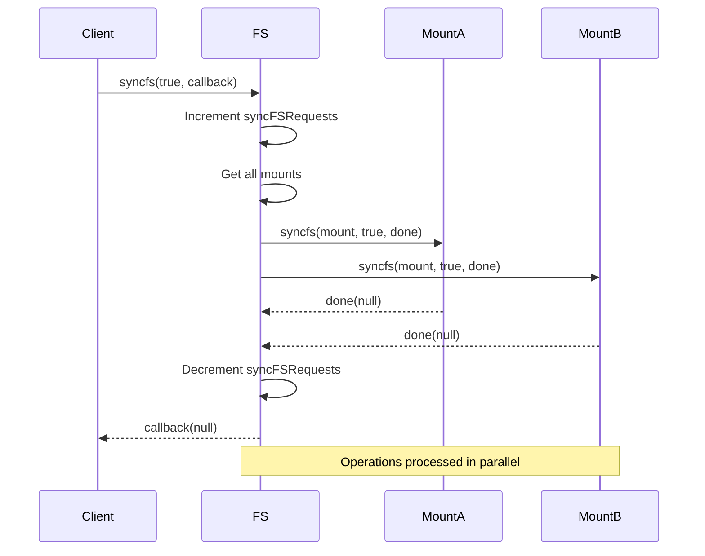

**Diagram sources**
- [mount-operations.ts](file://src/jswasm/vfs/filesystem/mount-operations/mount-operations.ts#L110-L158)

The `syncfs()` function processes all mount synchronizations in parallel, reducing the total time required for filesystem synchronization. The `syncFSRequests` counter tracks concurrent sync operations, allowing the system to detect and warn about potential performance issues from multiple simultaneous sync requests.

**Section sources**
- [path-operations.ts](file://src/jswasm/vfs/filesystem/path-operations/path-operations.ts#L215-L243)
- [mount-operations.ts](file://src/jswasm/vfs/filesystem/mount-operations/mount-operations.ts#L110-L158)

## Edge Cases and Error Handling
The path operations system in web-sqlite-v2 handles various edge cases and provides comprehensive error handling to ensure robust filesystem operations.

### Empty Paths and Special Cases
The system handles several edge cases related to path formatting and special values:

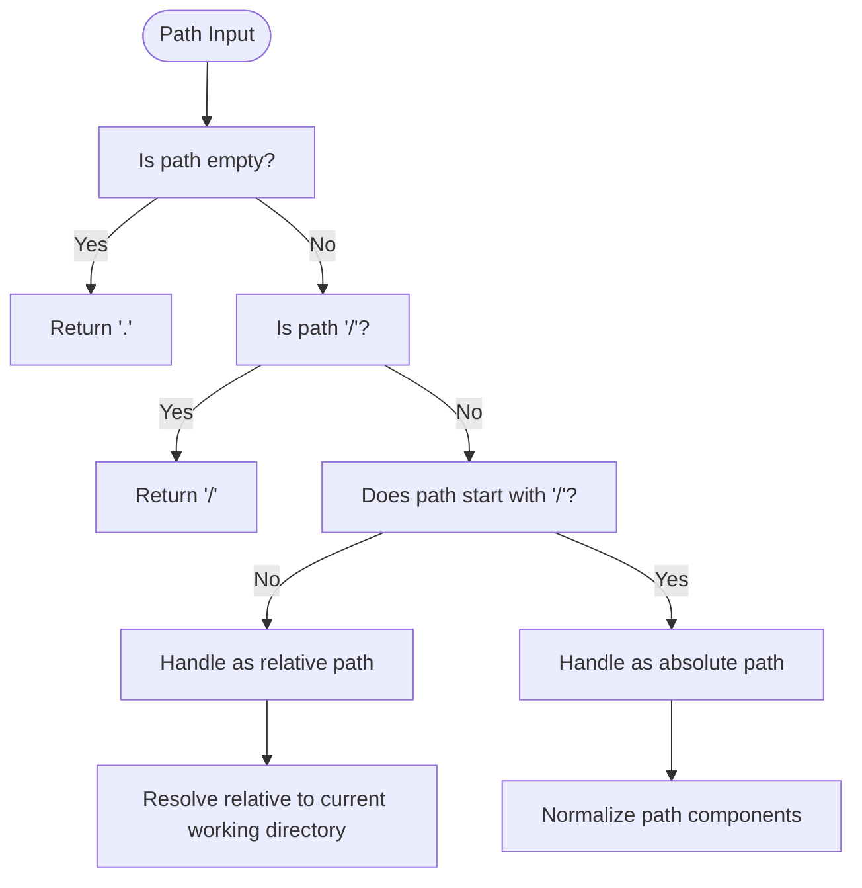

**Diagram sources**
- [path.ts](file://src/jswasm/utils/path/path.ts#L55-L75)
- [path-operations.ts](file://src/jswasm/vfs/filesystem/path-operations/path-operations.ts#L127-L128)

Key edge cases handled:
- **Empty paths**: Return '.' to represent the current directory
- **Root path ('/')**: Return '/' as the canonical root path
- **Relative paths**: Resolve relative to the current working directory
- **Duplicate slashes**: Normalized to single slashes
- **Trailing slashes**: Preserved in the normalized result

The `PATH.normalize()` function specifically handles these cases:
- Paths like `//a//b/` are normalized to `/a/b/`
- Paths with `.` segments like `a/./b` are normalized to `a/b`
- Paths with `..` segments are resolved appropriately, with `allowAboveRoot` parameter controlling behavior when traversing above the root

### Case Sensitivity Considerations
The filesystem implementation treats paths as case-sensitive, consistent with Unix-like filesystem semantics:

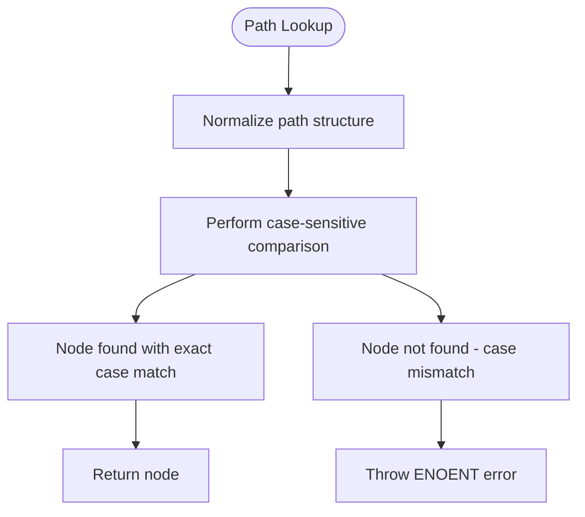

**Diagram sources**
- [path-operations.ts](file://src/jswasm/vfs/filesystem/path-operations/path-operations.ts#L256-L258)
- [constants.ts](file://src/jswasm/vfs/filesystem/constants/constants.ts#L206)

The `lookupNode()` function performs exact string comparison when matching node names:
```typescript
if (node.parent.id === parent.id && node.name === name) {
  return node;
}
```

This ensures that paths like `/Database/Main.db` and `/database/main.db` are treated as distinct, preventing potential security issues from case-based path confusion.

### Comprehensive Error Handling
The system implements a comprehensive error handling framework using errno codes:

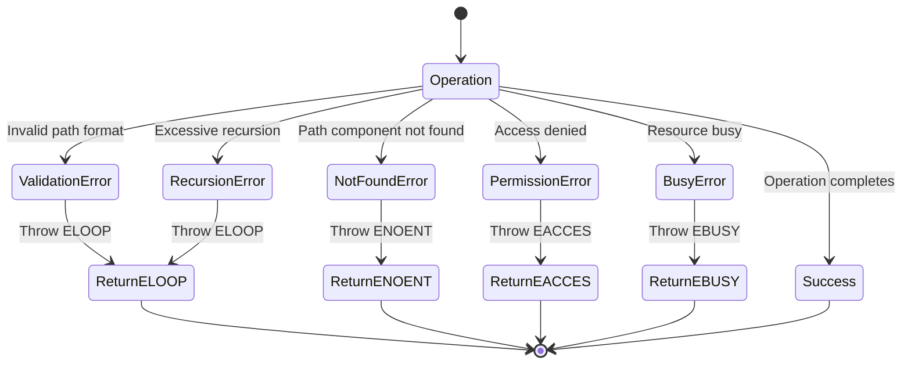

**Diagram sources**
- [path-operations.ts](file://src/jswasm/vfs/filesystem/path-operations/path-operations.ts#L138-L140)
- [constants.ts](file://src/jswasm/vfs/filesystem/constants/constants.ts#L202-L241)

The error handling system ensures that all path operations fail gracefully with appropriate error codes, providing clear feedback to calling code about the nature of any failures.

**Section sources**
- [path.ts](file://src/jswasm/utils/path/path.ts#L55-L75)
- [path-operations.ts](file://src/jswasm/vfs/filesystem/path-operations/path-operations.ts#L125-L183)
- [constants.ts](file://src/jswasm/vfs/filesystem/constants/constants.ts#L202-L241)

## OPFS Integration
The path operations system integrates with the OPFS (Origin Private File System) backend through a series of wrapper functions and initialization routines that bridge the virtual filesystem layer with the underlying storage mechanism.

### VFS Integration Layer
The integration between the VFS layer and OPFS is facilitated by wrapper functions that translate VFS operations to OPFS calls:

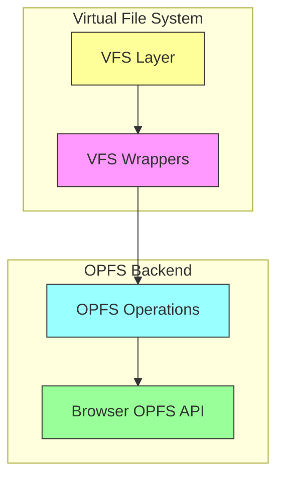

**Diagram sources**
- [vfs-integration.mjs](file://src/jswasm/vfs/opfs/installer/wrappers/vfs-integration.mjs#L6-L39)
- [base-state.ts](file://src/jswasm/vfs/filesystem/base-state/base-state.ts)

The `setupOptionalVfsMethods()` function provides fallback implementations for optional VFS methods:
- `xRandomness`: Generates random bytes using Math.random() if not provided by the default VFS
- `xSleep`: Implements sleep functionality using Atomics.wait() on a shared array buffer

These wrappers ensure that the VFS has all required functionality, even if the underlying OPFS implementation doesn't provide certain optional methods.

### Initialization and Environment Validation
The system performs comprehensive environment validation before initializing the OPFS integration:

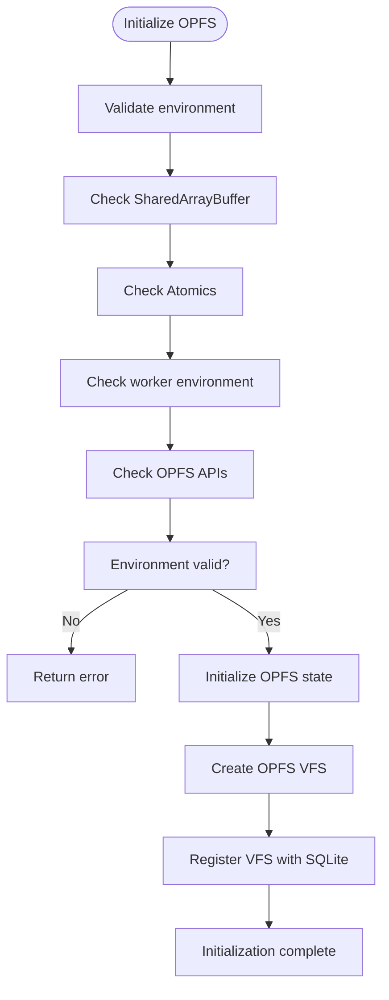

**Diagram sources**
- [environment-validation.mjs](file://src/jswasm/vfs/opfs/installer/core/environment-validation.mjs#L6-L37)
- [state-initialization.mjs](file://src/jswasm/vfs/opfs/installer/core/state-initialization.mjs#L8-L28)

The validation process checks for:
- Presence of SharedArrayBuffer and Atomics (required for thread synchronization)
- Worker environment (OPFS requires Atomics.wait() which is only available in workers)
- OPFS APIs (FileSystemHandle, createSyncAccessHandle, etc.)
- navigator.storage.getDirectory (required for root directory access)

If any of these requirements are not met, the system returns an appropriate error message explaining the missing functionality and how to resolve it.

### OO1 API Integration
The system integrates with the OO1 API to provide a higher-level interface for database operations:

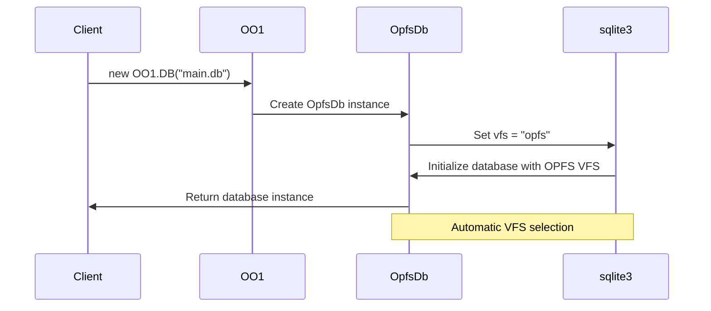

**Diagram sources**
- [vfs-integration.mjs](file://src/jswasm/vfs/opfs/installer/wrappers/vfs-integration.mjs#L45-L73)

The `integrateWithOo1()` function:
1. Creates an `OpfsDb` class that extends the base OO1 DB class
2. Sets the VFS to "opfs" for all database instances
3. Registers utility methods like `importDb`
4. Sets a post-open callback to configure busy timeout

This integration allows developers to use the familiar OO1 API while automatically leveraging the OPFS backend for persistent storage.

**Section sources**
- [vfs-integration.mjs](file://src/jswasm/vfs/opfs/installer/wrappers/vfs-integration.mjs#L6-L73)
- [environment-validation.mjs](file://src/jswasm/vfs/opfs/installer/core/environment-validation.mjs#L6-L37)

## Conclusion
The path operations system in web-sqlite-v2's VFS provides a robust, secure, and efficient mechanism for handling file paths in a browser-based SQLite environment. The implementation combines comprehensive path resolution and normalization with sophisticated mount point and symbolic link handling, all while maintaining strong security guarantees against path traversal attacks.

Key features of the system include:
- Complete path normalization that handles relative paths, duplicate slashes, and special segments
- Efficient hash table-based node lookup for optimal performance
- Secure handling of symbolic links with recursion limits to prevent infinite loops
- Flexible mount point system that enables integration of multiple storage backends
- Comprehensive error handling using standard errno codes
- Performance optimizations including path caching and operation batching
- Robust edge case handling for empty paths, case sensitivity, and special path formats
- Seamless integration with the OPFS backend through wrapper functions and initialization routines

The system's modular design separates concerns between path utilities, filesystem operations, and backend integration, making it both maintainable and extensible. By providing a familiar POSIX-like filesystem interface on top of the browser's OPFS API, it enables developers to work with persistent storage in a way that feels natural and intuitive.

This documentation has detailed the inner workings of the path operations layer, from the initial path resolution through to the final integration with the OPFS storage backend, providing a comprehensive understanding of how database file paths are processed in the web-sqlite-v2 system.

[No sources needed since this section summarizes without analyzing specific files]