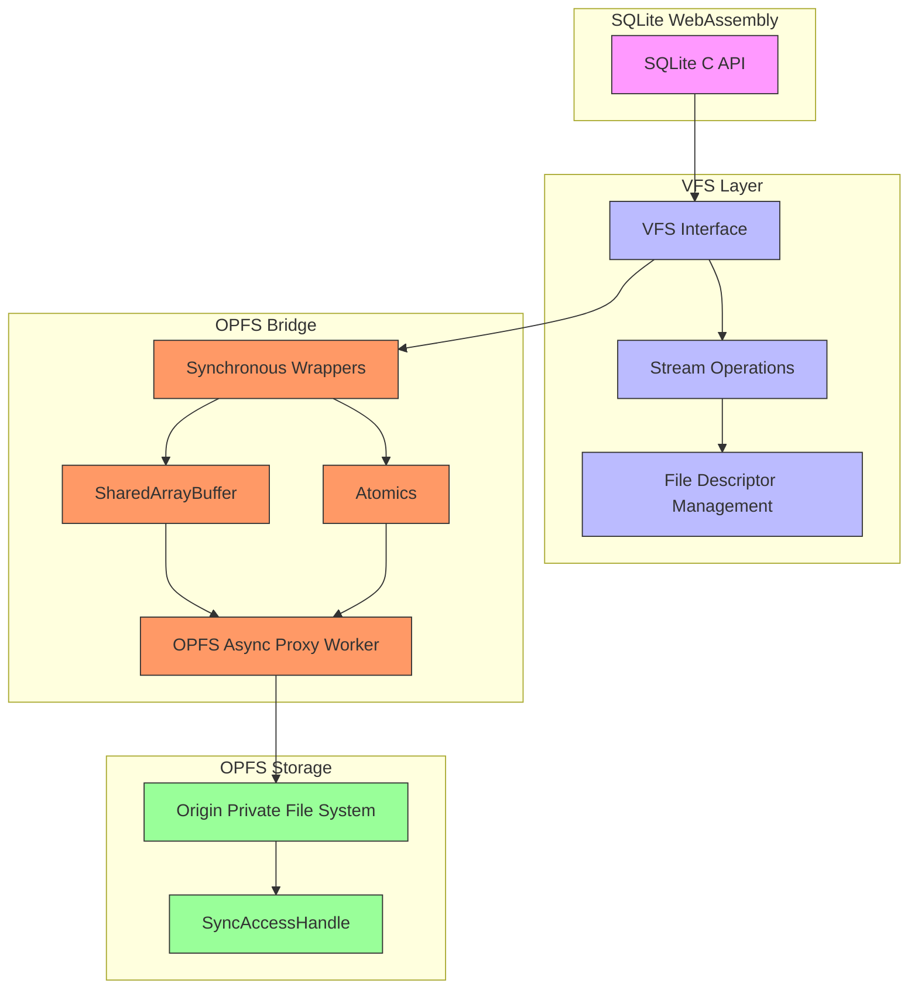
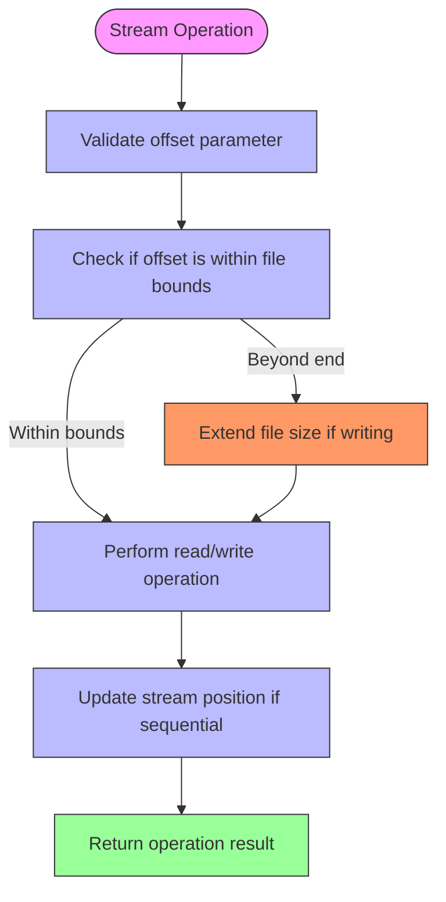
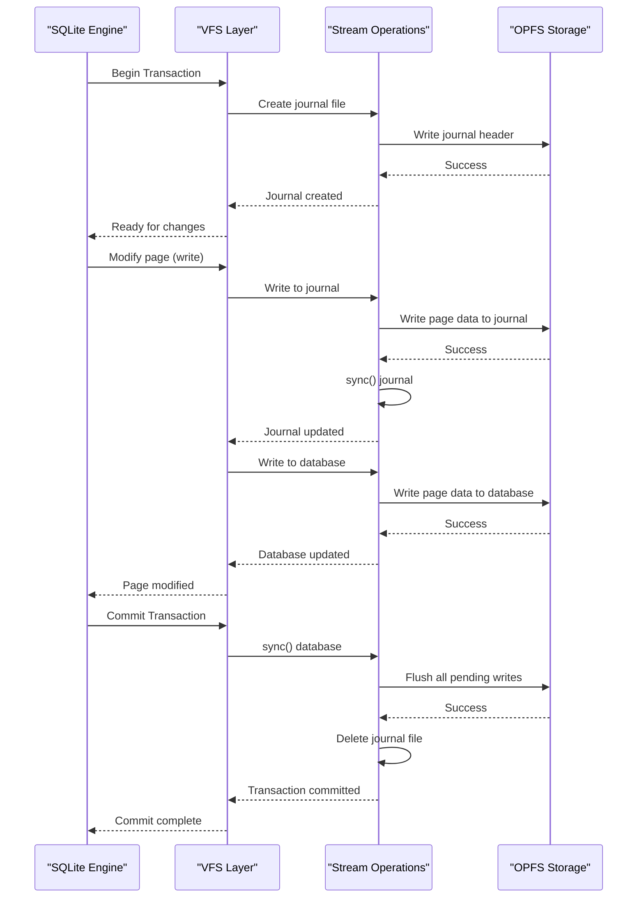
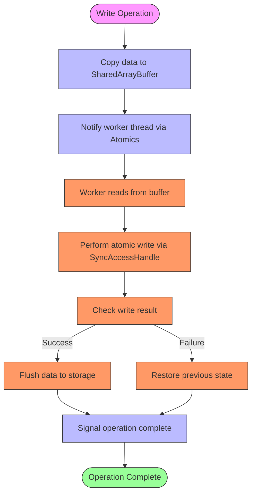
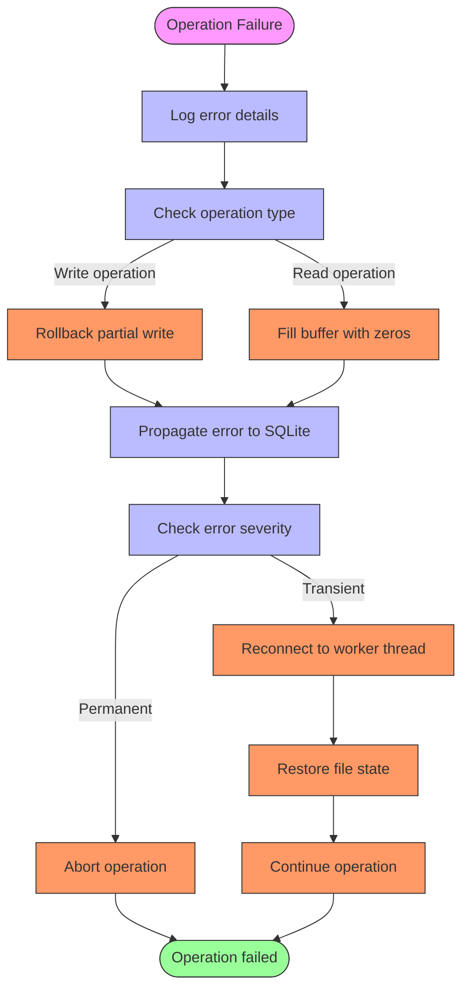
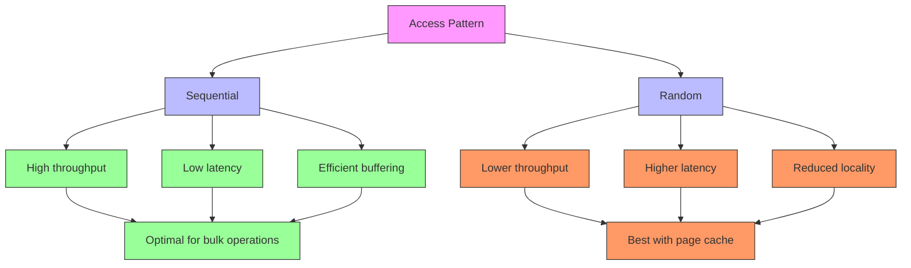
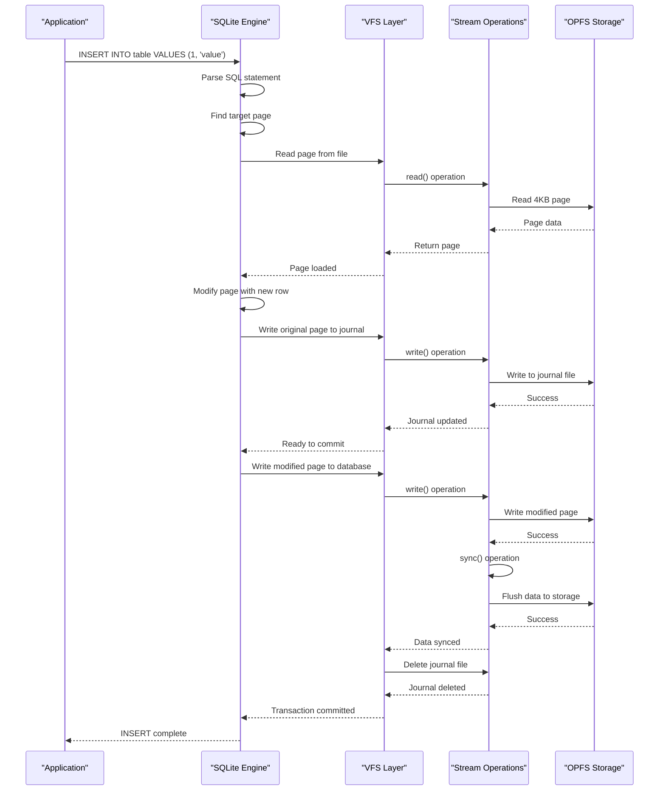

# Stream Operations

<cite>
**Referenced Files in This Document**   
- [stream-operations.ts](file://src/jswasm/vfs/filesystem/stream-operations/stream-operations.ts)
- [base-state.ts](file://src/jswasm/vfs/filesystem/base-state/base-state.ts)
- [io-sync-wrappers.mjs](file://src/jswasm/vfs/opfs/installer/wrappers/io-sync-wrappers.mjs)
- [vfs-sync-wrappers.mjs](file://src/jswasm/vfs/opfs/installer/wrappers/vfs-sync-wrappers.mjs)
- [opfs-sahpool-vfs.mjs](file://src/jswasm/vfs/opfs/opfs-sahpool-vfs.mjs)
- [sqlite3-opfs-async-proxy.js](file://src/jswasm/vfs/opfs/sqlite3-opfs-async-proxy.js)
- [constants.ts](file://src/jswasm/vfs/filesystem/constants/constants.ts)
- [filesystem.mjs](file://src/jswasm/vfs/filesystem.mjs)
</cite>

## Table of Contents
1. [Introduction](#introduction)
2. [Stream Operations Architecture](#stream-operations-architecture)
3. [Core Stream Methods](#core-stream-methods)
4. [Byte-Level Addressing and Offset Management](#byte-level-addressing-and-offset-management)
5. [Consistency with SQLite's Page Cache and Journaling](#consistency-with-sqlites-page-cache-and-journaling)
6. [Buffering Strategies and Atomicity](#buffering-strategies-and-atomicity)
7. [Error Recovery and Partial Writes](#error-recovery-and-partial-writes)
8. [Performance Characteristics](#performance-characteristics)
9. [Example: SQL INSERT to Stream Operations](#example-sql-insert-to-stream-operations)
10. [Conclusion](#conclusion)

## Introduction
This document provides comprehensive documentation for stream operations in the VFS (Virtual File System) implementation of web-sqlite-v2. The VFS layer bridges SQLite's I/O requests with OPFS (Origin Private File System) atomic file operations through a sophisticated stream interface. This documentation details how file read/write operations are handled, focusing on the implementation of key methods like read(), write(), truncate(), and sync(). It explains the byte-level addressing and offset management that enable precise control over database file operations, and how these streaming operations maintain consistency with SQLite's page cache and journaling requirements. The document also covers buffering strategies, atomicity of writes, error recovery mechanisms, and performance characteristics of different access patterns.

**Section sources**
- [stream-operations.ts](file://src/jswasm/vfs/filesystem/stream-operations/stream-operations.ts#L1-L265)
- [base-state.ts](file://src/jswasm/vfs/filesystem/base-state/base-state.ts#L1-L480)

## Stream Operations Architecture
The stream operations in web-sqlite-v2 are implemented through a layered architecture that connects SQLite's C API with the browser's OPFS capabilities. The core of this architecture is the VFS (Virtual File System) layer, which provides an abstraction between SQLite's file I/O operations and the underlying OPFS storage. This architecture uses a combination of synchronous and asynchronous components to handle file operations efficiently while maintaining compatibility with SQLite's expectations.

The architecture consists of several key components: the VFS interface that SQLite interacts with, the stream operations that manage file descriptors and I/O operations, and the OPFS async proxy that handles the actual file system operations in a worker thread. This separation allows SQLite to operate with synchronous file I/O semantics while the actual operations are performed asynchronously on the OPFS, which requires a worker thread for atomic operations.

The stream operations are built on a foundation of file descriptors and stream objects that track the state of open files. Each stream maintains information about its current position, access mode, and associated file node. The architecture uses SharedArrayBuffer and Atomics to coordinate between the main thread and the worker thread, enabling efficient communication without blocking the main thread.



**Diagram sources **
- [stream-operations.ts](file://src/jswasm/vfs/filesystem/stream-operations/stream-operations.ts#L1-L265)
- [io-sync-wrappers.mjs](file://src/jswasm/vfs/opfs/installer/wrappers/io-sync-wrappers.mjs#L1-L236)
- [sqlite3-opfs-async-proxy.js](file://src/jswasm/vfs/opfs/sqlite3-opfs-async-proxy.js#L1-L692)

**Section sources**
- [stream-operations.ts](file://src/jswasm/vfs/filesystem/stream-operations/stream-operations.ts#L1-L265)
- [io-sync-wrappers.mjs](file://src/jswasm/vfs/opfs/installer/wrappers/io-sync-wrappers.mjs#L1-L236)
- [sqlite3-opfs-async-proxy.js](file://src/jswasm/vfs/opfs/sqlite3-opfs-async-proxy.js#L1-L692)

## Core Stream Methods
The VFS implementation in web-sqlite-v2 provides a comprehensive set of stream methods that handle all aspects of file I/O operations. These methods are exposed through the VFS interface and are called by SQLite during database operations. The core methods include read(), write(), truncate(), and sync(), each designed to work with OPFS atomic operations while maintaining SQLite's expectations for file I/O.

The read() method handles reading data from a file at a specified offset. It takes parameters for the file pointer, destination buffer pointer, number of bytes to read, and the file offset. The method uses the SyncAccessHandle from OPFS to perform the read operation, ensuring atomicity. If the read operation returns fewer bytes than requested, it fills the remaining buffer with zeros and returns SQLITE_IOERR_SHORT_READ to indicate a partial read.

The write() method handles writing data to a file at a specified offset. It validates that the file is not read-only before proceeding with the write operation. The method uses the SyncAccessHandle to write data from the source buffer to the file. It ensures atomicity by completing the entire write operation or failing completely, returning appropriate error codes if the operation fails.

The truncate() method adjusts the size of a file to the specified length. It first validates that the file is not read-only, then uses the SyncAccessHandle's truncate method to resize the file. This operation is atomic, ensuring that the file size is either completely changed or remains unchanged in case of failure.

The sync() method ensures that all pending writes are flushed to storage. It calls the flush method on the SyncAccessHandle, which guarantees that all data is written to the underlying file system. This method is critical for maintaining data integrity, especially during transaction commits.

```mermaid
classDiagram
class StreamOperations {
+MAX_OPEN_FDS : number
+nextfd() : number
+getStreamChecked(fd : number) : FSStream
+getStream(fd : number) : FSStream | null
+createStream(stream : Partial~FSStream~, fd? : number) : FSStream
+closeStream(fd : number) : void
+dupStream(original : FSStream, fd? : number) : FSStream
+chrdev_stream_ops : object
+major(dev : number) : number
+minor(dev : number) : number
+makedev(major : number, minor : number) : number
+registerDevice(dev : number, ops : StreamOps) : void
+getDevice(dev : number) : DeviceDefinition | undefined
}
class FSStream {
+shared : FSStreamShared
+node? : FSNode
+flags : number
+position : number
+fd : number | null
+path? : string
+seekable? : boolean
+stream_ops : StreamOps
+ungotten? : number[]
+error? : boolean
+getdents? : null
+object : FSNode
+isRead : boolean
+isWrite : boolean
+isAppend : boolean
}
class FSStreamShared {
+flags? : number
+position? : number
}
class StreamOps {
+open?(stream : FSStream) : void
+close?(stream : FSStream) : void
+llseek?(stream : FSStream, offset : number, whence : number) : number
+read?(stream : FSStream, buffer : Uint8Array, offset : number, length : number, position : number) : number
+write?(stream : FSStream, buffer : Uint8Array | ArrayLike~number~, offset : number, length : number, position : number, canOwn? : boolean) : number
+allocate?(stream : FSStream, offset : number, length : number) : void
+mmap?(stream : FSStream, length : number, position : number, prot : number, flags : number) : { ptr : number; length : number }
+msync?(stream : FSStream, buffer : Uint8Array | ArrayLike~number~, offset : number, length : number, mmapFlags : number) : number
+ioctl?(stream : FSStream, cmd : number, arg : number) : number
+dup?(stream : FSStream) : void
}
StreamOperations --> FSStream : "manages"
FSStream --> FSStreamShared : "delegates"
FSStream --> StreamOps : "uses"
StreamOperations --> StreamOps : "defines"
```

**Diagram sources **
- [stream-operations.ts](file://src/jswasm/vfs/filesystem/stream-operations/stream-operations.ts#L1-L265)
- [base-state.ts](file://src/jswasm/vfs/filesystem/base-state/base-state.ts#L1-L480)

**Section sources**
- [stream-operations.ts](file://src/jswasm/vfs/filesystem/stream-operations/stream-operations.ts#L1-L265)
- [io-sync-wrappers.mjs](file://src/jswasm/vfs/opfs/installer/wrappers/io-sync-wrappers.mjs#L1-L236)

## Byte-Level Addressing and Offset Management
The stream operations in web-sqlite-v2 implement precise byte-level addressing and offset management to support SQLite's page-based storage model. Each stream maintains a current position that is updated with read and write operations, allowing for sequential access to file contents. The offset parameter in read() and write() operations enables random access to any position in the file, which is essential for SQLite's B-tree page navigation.

The offset management is implemented through the FSStream interface, which includes a position property that tracks the current read/write position. When a stream is opened, the position is initialized to zero. Sequential operations automatically update this position, while random access operations use the provided offset parameter without modifying the stream's position. This design supports both sequential and random access patterns required by different SQLite operations.

For read operations, the offset parameter specifies the starting position in the file from which to read data. The method uses this offset to calculate the actual position in the file, adding it to the file's header offset to account for metadata stored at the beginning of OPFS files. Similarly, write operations use the offset to determine where to write data, ensuring that writes to specific database pages are directed to the correct location in the file.

The implementation handles edge cases such as reading beyond the end of the file by returning SQLITE_IOERR_SHORT_READ and filling the remaining buffer with zeros. For write operations beyond the current file size, the file is automatically extended to accommodate the new data, maintaining compatibility with SQLite's expectations for file growth during database operations.



**Diagram sources **
- [io-sync-wrappers.mjs](file://src/jswasm/vfs/opfs/installer/wrappers/io-sync-wrappers.mjs#L1-L236)
- [opfs-sahpool-vfs.mjs](file://src/jswasm/vfs/opfs/opfs-sahpool-vfs.mjs#L1-L974)

**Section sources**
- [io-sync-wrappers.mjs](file://src/jswasm/vfs/opfs/installer/wrappers/io-sync-wrappers.mjs#L1-L236)
- [opfs-sahpool-vfs.mjs](file://src/jswasm/vfs/opfs/opfs-sahpool-vfs.mjs#L1-L974)

## Consistency with SQLite's Page Cache and Journaling
The stream operations in web-sqlite-v2 are designed to maintain strict consistency with SQLite's page cache and journaling requirements. This consistency is achieved through careful coordination between the VFS layer and SQLite's transaction management system. The implementation ensures that all operations on database pages and journal files adhere to SQLite's ACID properties, even when operating on the asynchronous OPFS.

For page cache consistency, the stream operations ensure that reads and writes to database pages are atomic and isolated. When SQLite requests a page from the cache, the read() operation retrieves the complete 4KB page from the file, ensuring that the page contents are consistent and not partially updated. Similarly, write operations to pages are performed atomically, preventing partial writes that could corrupt the database.

The journaling system is supported through specific handling of journal files. When a transaction begins, SQLite creates a journal file to record changes before they are applied to the main database. The stream operations ensure that writes to the journal file are immediately flushed to storage using the sync() method, providing durability for transaction recovery. This is critical for ensuring that in the event of a crash, SQLite can recover the database to a consistent state using the journal.

The implementation also handles the complex interaction between the page cache and journaling during transaction commits. When a transaction is committed, SQLite first writes all dirty pages to the journal file, then updates the main database file, and finally deletes the journal file. The stream operations coordinate these steps by ensuring that each write operation is completed before the next step begins, maintaining the proper ordering required for data integrity.



**Diagram sources **
- [io-sync-wrappers.mjs](file://src/jswasm/vfs/opfs/installer/wrappers/io-sync-wrappers.mjs#L1-L236)
- [opfs-sahpool-vfs.mjs](file://src/jswasm/vfs/opfs/opfs-sahpool-vfs.mjs#L1-L974)

**Section sources**
- [io-sync-wrappers.mjs](file://src/jswasm/vfs/opfs/installer/wrappers/io-sync-wrappers.mjs#L1-L236)
- [opfs-sahpool-vfs.mjs](file://src/jswasm/vfs/opfs/opfs-sahpool-vfs.mjs#L1-L974)

## Buffering Strategies and Atomicity
The stream operations in web-sqlite-v2 employ sophisticated buffering strategies to optimize performance while maintaining atomicity of operations. The implementation uses a combination of in-memory buffers and OPFS's SyncAccessHandle to ensure that file operations are both efficient and reliable. The buffering strategy is designed to minimize the number of round trips between the main thread and the worker thread while ensuring data integrity.

The primary buffering mechanism is implemented through a SharedArrayBuffer that serves as a communication channel between the main thread and the OPFS async proxy worker. When a write operation is requested, data is first copied from SQLite's memory space to this shared buffer. The worker thread then reads from this buffer and writes the data to the OPFS file using the SyncAccessHandle. This approach reduces the overhead of transferring large amounts of data between threads.

For atomicity, the implementation ensures that each file operation is completed as a single atomic unit. Write operations are designed to either complete entirely or fail completely, preventing partial writes that could corrupt the database. This is achieved through OPFS's atomic file operations and careful error handling in the stream methods. If an operation fails, the file state remains unchanged, preserving data integrity.

The sync() method plays a crucial role in the buffering strategy by forcing all pending writes to be flushed to storage. This method is called at critical points in SQLite's operation, such as during transaction commits, to ensure that data is durably stored. The implementation optimizes sync operations by batching multiple writes and flushing them together when possible, reducing the performance impact of frequent sync calls.



**Diagram sources **
- [io-sync-wrappers.mjs](file://src/jswasm/vfs/opfs/installer/wrappers/io-sync-wrappers.mjs#L1-L236)
- [sqlite3-opfs-async-proxy.js](file://src/jswasm/vfs/opfs/sqlite3-opfs-async-proxy.js#L1-L692)

**Section sources**
- [io-sync-wrappers.mjs](file://src/jswasm/vfs/opfs/installer/wrappers/io-sync-wrappers.mjs#L1-L236)
- [sqlite3-opfs-async-proxy.js](file://src/jswasm/vfs/opfs/sqlite3-opfs-async-proxy.js#L1-L692)

## Error Recovery and Partial Writes
The stream operations in web-sqlite-v2 implement robust error recovery mechanisms to handle failures during file operations, particularly partial writes. The implementation is designed to detect and recover from various error conditions, ensuring database integrity even in the face of unexpected failures. This is critical for maintaining reliability in web applications where network conditions and system resources can be unpredictable.

For partial writes, the implementation uses several strategies to detect and handle incomplete operations. When a write operation returns fewer bytes than requested, the method returns SQLITE_IOERR_WRITE to indicate failure. The stream layer also validates the integrity of data after writes by comparing the number of bytes written with the expected count. If a mismatch is detected, the operation is considered failed, and appropriate error recovery procedures are initiated.

The error recovery process involves several steps: first, the failed operation is logged with detailed information about the error condition; second, any partially written data is rolled back to maintain consistency; and third, the error is propagated to SQLite so it can initiate its own recovery procedures. This layered approach ensures that errors are handled at both the VFS level and the SQLite level, providing comprehensive protection against data corruption.

The implementation also includes mechanisms for recovering from more severe failures, such as worker thread termination or OPFS access errors. When such failures occur, the VFS layer can reinitialize the connection to the worker thread and restore the state of open files. This allows the database to continue operating after transient failures, improving overall reliability.



**Diagram sources **
- [io-sync-wrappers.mjs](file://src/jswasm/vfs/opfs/installer/wrappers/io-sync-wrappers.mjs#L1-L236)
- [sqlite3-opfs-async-proxy.js](file://src/jswasm/vfs/opfs/sqlite3-opfs-async-proxy.js#L1-L692)

**Section sources**
- [io-sync-wrappers.mjs](file://src/jswasm/vfs/opfs/installer/wrappers/io-sync-wrappers.mjs#L1-L236)
- [sqlite3-opfs-async-proxy.js](file://src/jswasm/vfs/opfs/sqlite3-opfs-async-proxy.js#L1-L692)

## Performance Characteristics
The stream operations in web-sqlite-v2 exhibit distinct performance characteristics depending on the access pattern used. These characteristics are influenced by the underlying OPFS implementation, the buffering strategy, and the coordination between the main thread and worker thread. Understanding these performance aspects is crucial for optimizing database operations in web applications.

Sequential access patterns generally perform better than random access patterns due to the nature of OPFS operations and the buffering strategy. Sequential reads and writes can take advantage of data locality and reduced seek times, resulting in higher throughput. The implementation optimizes sequential operations by prefetching data and batching writes, which reduces the overhead of thread communication.

Random access patterns, while supported, have higher latency due to the need to seek to specific positions in the file. Each random access operation requires a separate round trip to the worker thread, increasing the overall operation time. However, the performance impact is mitigated by SQLite's page cache, which reduces the frequency of actual file operations by caching frequently accessed pages in memory.

The performance of write operations is affected by the sync() method calls, which force data to be flushed to storage. Frequent sync calls can significantly reduce throughput, while batching multiple writes between sync operations can improve performance. The implementation provides optimal performance when applications use transactions to group multiple operations, as this minimizes the number of sync calls required.



**Diagram sources **
- [io-sync-wrappers.mjs](file://src/jswasm/vfs/opfs/installer/wrappers/io-sync-wrappers.mjs#L1-L236)
- [opfs-sahpool-vfs.mjs](file://src/jswasm/vfs/opfs/opfs-sahpool-vfs.mjs#L1-L974)

**Section sources**
- [io-sync-wrappers.mjs](file://src/jswasm/vfs/opfs/installer/wrappers/io-sync-wrappers.mjs#L1-L236)
- [opfs-sahpool-vfs.mjs](file://src/jswasm/vfs/opfs/opfs-sahpool-vfs.mjs#L1-L974)

## Example: SQL INSERT to Stream Operations
This section illustrates how a SQL INSERT statement triggers write stream operations in the web-sqlite-v2 VFS implementation. The example traces the complete path from the SQL statement execution to the final write operation on the OPFS storage, demonstrating the interaction between SQLite's components and the stream operations.

When a SQL INSERT statement is executed, SQLite first parses the statement and determines which table and columns are affected. It then checks the page cache to find the appropriate database page for the new row. If the page is not in the cache, a read() operation is triggered to load it from the file. This read operation uses the stream interface to retrieve the 4KB page from the OPFS file at the calculated offset.

Once the page is loaded into the cache, SQLite modifies it to insert the new row, potentially splitting the page if it becomes full. The modified page is marked as dirty in the cache. Before the transaction is committed, SQLite writes the original page contents to the journal file using a write() operation. This ensures that the original state can be restored if the transaction fails.

When the transaction is committed, SQLite writes the modified page to the main database file using another write() operation. This operation uses the stream interface to write the 4KB page to the appropriate offset in the file. The write is performed atomically through the OPFS SyncAccessHandle, ensuring that the entire page is written or the operation fails completely.

Finally, SQLite calls the sync() method to ensure that all changes are flushed to storage. This triggers a flush operation on the SyncAccessHandle, guaranteeing that the data is durably stored. The journal file is then deleted, completing the transaction.



**Diagram sources **
- [io-sync-wrappers.mjs](file://src/jswasm/vfs/opfs/installer/wrappers/io-sync-wrappers.mjs#L1-L236)
- [opfs-sahpool-vfs.mjs](file://src/jswasm/vfs/opfs/opfs-sahpool-vfs.mjs#L1-L974)

**Section sources**
- [io-sync-wrappers.mjs](file://src/jswasm/vfs/opfs/installer/wrappers/io-sync-wrappers.mjs#L1-L236)
- [opfs-sahpool-vfs.mjs](file://src/jswasm/vfs/opfs/opfs-sahpool-vfs.mjs#L1-L974)

## Conclusion
The stream operations in the VFS implementation of web-sqlite-v2 provide a robust and efficient bridge between SQLite's I/O requirements and the OPFS atomic file operations. Through a sophisticated architecture that combines synchronous interfaces with asynchronous implementation, the system delivers reliable database operations while maintaining compatibility with SQLite's expectations for file I/O.

The implementation of read(), write(), truncate(), and sync() methods demonstrates careful attention to detail in handling byte-level addressing, offset management, and atomicity. The design ensures consistency with SQLite's page cache and journaling requirements, providing the foundation for ACID-compliant transactions. Buffering strategies optimize performance by minimizing thread communication overhead, while comprehensive error recovery mechanisms protect against data corruption.

The performance characteristics of the stream operations highlight the importance of access patterns, with sequential operations generally outperforming random access due to better data locality and reduced seek times. Applications can optimize database performance by leveraging transactions to batch operations and minimize sync calls.

Overall, the stream operations in web-sqlite-v2 represent a sophisticated solution to the challenges of implementing a relational database on top of modern web storage APIs. The design balances performance, reliability, and compatibility, making it suitable for a wide range of web applications that require local data storage with SQL capabilities.

**Section sources**
- [stream-operations.ts](file://src/jswasm/vfs/filesystem/stream-operations/stream-operations.ts#L1-L265)
- [io-sync-wrappers.mjs](file://src/jswasm/vfs/opfs/installer/wrappers/io-sync-wrappers.mjs#L1-L236)
- [opfs-sahpool-vfs.mjs](file://src/jswasm/vfs/opfs/opfs-sahpool-vfs.mjs#L1-L974)