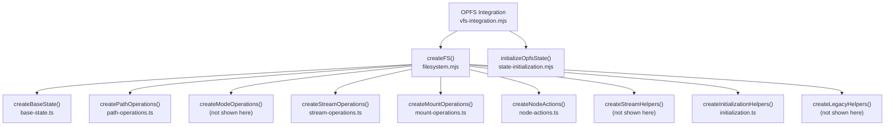
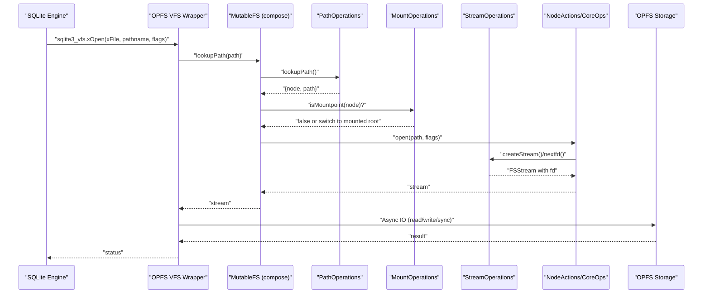
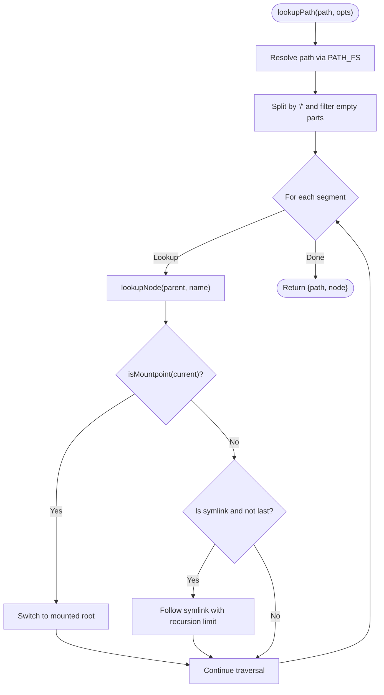
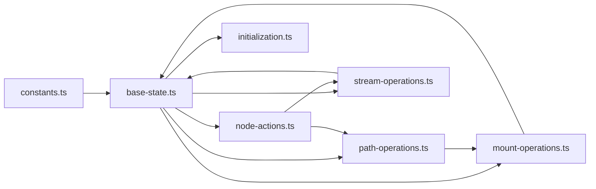
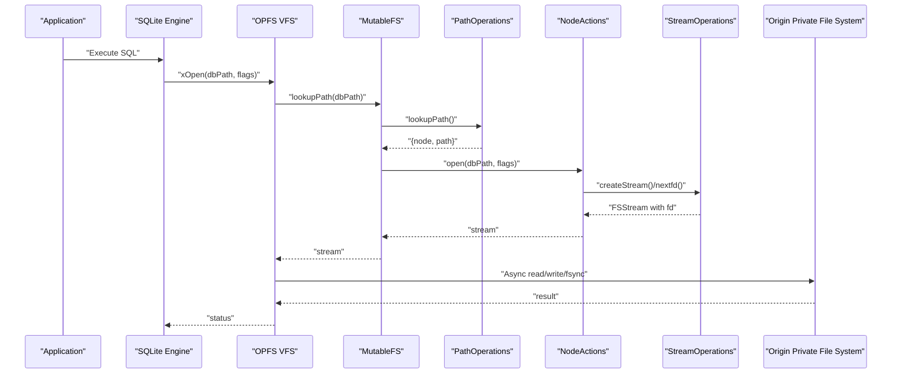

# Virtual File System

<cite>
**Referenced Files in This Document**
- [filesystem.mjs](file://src/jswasm/vfs/filesystem.mjs)
- [filesystem.d.ts](file://src/jswasm/vfs/filesystem.d.ts)
- [constants.ts](file://src/jswasm/vfs/filesystem/constants/constants.ts)
- [initialization.ts](file://src/jswasm/vfs/filesystem/initialization/initialization.ts)
- [mount-operations.ts](file://src/jswasm/vfs/filesystem/mount-operations/mount-operations.ts)
- [node-actions.ts](file://src/jswasm/vfs/filesystem/node-actions/node-actions.ts)
- [path-operations.ts](file://src/jswasm/vfs/filesystem/path-operations/path-operations.ts)
- [stream-operations.ts](file://src/jswasm/vfs/filesystem/stream-operations/stream-operations.ts)
- [base-state.ts](file://src/jswasm/vfs/filesystem/base-state/base-state.ts)
- [node-core-operations.ts](file://src/jswasm/vfs/filesystem/node-core-operations/node-core-operations.ts)
- [vfs-integration.mjs](file://src/jswasm/vfs/opfs/installer/wrappers/vfs-integration.mjs)
- [state-initialization.mjs](file://src/jswasm/vfs/opfs/installer/core/state-initialization.mjs)
- [base-state.unit.test.ts](file://src/jswasm/vfs/filesystem/base-state/base-state.unit.test.ts)
- [constants.test.ts](file://src/jswasm/vfs/filesystem/constants/constants.test.ts)
</cite>

## Table of Contents
1. [Introduction](#introduction)
2. [Project Structure](#project-structure)
3. [Core Components](#core-components)
4. [Architecture Overview](#architecture-overview)
5. [Detailed Component Analysis](#detailed-component-analysis)
6. [Dependency Analysis](#dependency-analysis)
7. [Performance Considerations](#performance-considerations)
8. [Troubleshooting Guide](#troubleshooting-guide)
9. [Conclusion](#conclusion)
10. [Appendices](#appendices)

## Introduction
This document explains the Virtual File System (VFS) implementation used by web-sqlite-v2 to emulate a POSIX-like file system interface required by SQLite. It focuses on how the VFS layer composes modular helpers to provide path resolution, mount/unmount operations, node actions (create/rename/delete), stream operations (open/read/write/close), and inode management. It also describes how the base state maintains metadata such as file handles and directory structures, and how the system integrates with the Origin Private File System (OPFS) via the OPFS VFS wrapper. Finally, it outlines error handling, performance characteristics, and a concrete example of how a SQL query triggers a chain of VFS calls down to OPFS.

## Project Structure
The VFS is organized as a composition of small, focused modules that extend a shared mutable state. The main assembly entry creates the filesystem facade and wires together path, mount, node action, stream, and initialization helpers. OPFS-specific integration is handled separately and attaches to the SQLite C API VFS layer.

**Diagram sources**
- [filesystem.mjs](file://src/jswasm/vfs/filesystem.mjs#L1-L57)
- [base-state.ts](file://src/jswasm/vfs/filesystem/base-state/base-state.ts#L299-L480)
- [path-operations.ts](file://src/jswasm/vfs/filesystem/path-operations/path-operations.ts#L120-L287)
- [stream-operations.ts](file://src/jswasm/vfs/filesystem/stream-operations/stream-operations.ts#L70-L265)
- [mount-operations.ts](file://src/jswasm/vfs/filesystem/mount-operations/mount-operations.ts#L75-L310)
- [node-actions.ts](file://src/jswasm/vfs/filesystem/node-actions/node-actions.ts#L31-L79)
- [initialization.ts](file://src/jswasm/vfs/filesystem/initialization/initialization.ts#L92-L306)
- [vfs-integration.mjs](file://src/jswasm/vfs/opfs/installer/wrappers/vfs-integration.mjs#L1-L74)
- [state-initialization.mjs](file://src/jswasm/vfs/opfs/installer/core/state-initialization.mjs#L1-L127)

**Section sources**
- [filesystem.mjs](file://src/jswasm/vfs/filesystem.mjs#L1-L57)
- [filesystem.d.ts](file://src/jswasm/vfs/filesystem.d.ts#L1-L86)

## Core Components
- Constants module defines POSIX-like modes, open flags, and errno codes used across the VFS.
- Base state initializes the mutable filesystem state and constructs node/stream classes.
- Path operations resolve and validate paths, manage hash tables, and detect mount points and symlinks.
- Stream operations manage file descriptors, device registration, and stream lifecycle.
- Mount operations attach and detach filesystem backends, and synchronize mounted filesystems.
- Node actions compose core and metadata operations for POSIX-like file/directory manipulations.
- Initialization helpers bootstrap default directories/devices, standard streams, and the global mount.

**Section sources**
- [constants.ts](file://src/jswasm/vfs/filesystem/constants/constants.ts#L1-L248)
- [base-state.ts](file://src/jswasm/vfs/filesystem/base-state/base-state.ts#L299-L480)
- [path-operations.ts](file://src/jswasm/vfs/filesystem/path-operations/path-operations.ts#L120-L287)
- [stream-operations.ts](file://src/jswasm/vfs/filesystem/stream-operations/stream-operations.ts#L70-L265)
- [mount-operations.ts](file://src/jswasm/vfs/filesystem/mount-operations/mount-operations.ts#L75-L310)
- [node-actions.ts](file://src/jswasm/vfs/filesystem/node-actions/node-actions.ts#L31-L79)
- [initialization.ts](file://src/jswasm/vfs/filesystem/initialization/initialization.ts#L92-L306)

## Architecture Overview
The VFS composes a set of helper modules around a shared MutableFS state. The assembly function creates the base state, then merges path, stream, mount, node-action, and initialization helpers into a cohesive filesystem facade. OPFS integration plugs into the SQLite C API VFS layer and uses the same underlying state and helpers.

**Diagram sources**
- [filesystem.mjs](file://src/jswasm/vfs/filesystem.mjs#L20-L56)
- [path-operations.ts](file://src/jswasm/vfs/filesystem/path-operations/path-operations.ts#L120-L183)
- [mount-operations.ts](file://src/jswasm/vfs/filesystem/mount-operations/mount-operations.ts#L168-L219)
- [stream-operations.ts](file://src/jswasm/vfs/filesystem/stream-operations/stream-operations.ts#L126-L143)
- [node-core-operations.ts](file://src/jswasm/vfs/filesystem/node-core-operations/node-core-operations.ts#L94-L102)
- [vfs-integration.mjs](file://src/jswasm/vfs/opfs/installer/wrappers/vfs-integration.mjs#L45-L74)

## Detailed Component Analysis

### Constants: Modes, Flags, and Errnos
- POSIX-style mode masks define file types and permission bits.
- Open flags mirror libc fcntl semantics for access modes and creation/truncation/appending.
- Errno codes align with Emscripten’s FS implementation for consistent error reporting.
- Permission helpers group commonly used permission checks.

Key responsibilities:
- Provide immutable constants for mode, flags, errno, and permission masks.
- Ensure bitwise correctness for type vs permission masks and default permissions.

**Section sources**
- [constants.ts](file://src/jswasm/vfs/filesystem/constants/constants.ts#L1-L248)
- [constants.test.ts](file://src/jswasm/vfs/filesystem/constants/constants.test.ts#L1-L188)

### Base State: MutableFS and Constructors
- Initializes core state: root, mounts, devices, streams, name table, current path, initialized flag, and error registry.
- Defines ErrnoError class and FSStream/FSNode constructors with computed properties for permissions, types, and stream flags.
- Exposes methods merged by other helpers (lookupPath, hash operations, node creation/destruction).

Key responsibilities:
- Provide a shared state container for all helpers.
- Construct node/stream instances with consistent behavior and computed properties.

**Section sources**
- [base-state.ts](file://src/jswasm/vfs/filesystem/base-state/base-state.ts#L299-L480)
- [base-state.unit.test.ts](file://src/jswasm/vfs/filesystem/base-state/base-state.unit.test.ts#L1-L289)

### Path Operations: Resolution and Validation
- Implements path lookup with symlink resolution and mount traversal.
- Maintains a hash table for fast node lookup by parent id and name.
- Supports parent-path extraction, mount-point detection, and node creation/destruction.

Key responsibilities:
- Resolve absolute and relative paths, following mounts and symlinks.
- Enforce recursion limits for symlinks and mount traversal.
- Manage name table collisions and fast lookups.

**Diagram sources**
- [path-operations.ts](file://src/jswasm/vfs/filesystem/path-operations/path-operations.ts#L120-L183)

**Section sources**
- [path-operations.ts](file://src/jswasm/vfs/filesystem/path-operations/path-operations.ts#L120-L287)

### Stream Operations: File Descriptors and Devices
- Manages file descriptors with bounds checking and allocation.
- Provides stream creation, duplication, closing, and device registration.
- Character device operations include open and llseek behavior.

Key responsibilities:
- Allocate and track file descriptors up to a configurable maximum.
- Create and manage stream instances with shared flags/position.
- Register and route character device streams to their handlers.

**Section sources**
- [stream-operations.ts](file://src/jswasm/vfs/filesystem/stream-operations/stream-operations.ts#L70-L265)

### Mount Operations: Backends and Sync
- Attaches filesystem backends at mountpoints and detaches them cleanly.
- Synchronizes all mounted filesystems with optional population.
- Creates device nodes and delegates node operations to parent node_ops.

Key responsibilities:
- Validate mount targets (root vs non-root), ensure parent is a directory, and prevent overlapping mounts.
- Traverse and synchronize all mounts, tracking concurrent sync requests.
- Delegate node creation and lookup to parent node operations.

**Section sources**
- [mount-operations.ts](file://src/jswasm/vfs/filesystem/mount-operations/mount-operations.ts#L75-L310)

### Node Actions and Core Operations: POSIX-like Manipulation
- Composes core operations (create, mkdir, symlink, rename, rmdir, readdir, unlink, readlink) and metadata operations (stat, chmod, truncate, open).
- Applies permission checks, mount constraints, and cross-directory validation for rename.

Key responsibilities:
- Create files/directories with correct modes and permissions.
- Rename with mount boundary checks and relative path validations.
- Remove directories and files with mount/busy checks.
- List directory entries and resolve symbolic links.

**Section sources**
- [node-actions.ts](file://src/jswasm/vfs/filesystem/node-actions/node-actions.ts#L31-L79)
- [node-core-operations.ts](file://src/jswasm/vfs/filesystem/node-core-operations/node-core-operations.ts#L94-L349)

### Initialization: Bootstrapping the Filesystem
- Creates default directories (/tmp, /home, /home/web_user).
- Registers default devices (/dev/null, /dev/tty, /dev/tty1), random devices, and shared memory directories.
- Builds /proc/self/fd synthetic mount with dynamic node lookup.
- Sets up standard streams (/dev/stdin, /dev/stdout, /dev/stderr) and opens them with appropriate flags.
- Initializes MEMFS backend, name table, and filesystem registry.

Key responsibilities:
- Bootstrap the global filesystem state with sane defaults.
- Wire up stdio and device nodes for interactive environments.
- Provide a clean initialization and shutdown lifecycle.

**Section sources**
- [initialization.ts](file://src/jswasm/vfs/filesystem/initialization/initialization.ts#L92-L306)

### OPFS Integration: SQLite VFS Bridge
- Provides optional VFS methods (xRandomness, xSleep) and integrates with the OO1 API to expose an OpfsDb class.
- Initializes OPFS state with shared buffers, operation IDs, and SQLite constant mappings.
- Defines OPFS-specific flags and metrics for async operations.

Key responsibilities:
- Attach OPFS-backed VFS to SQLite’s C API.
- Provide fallback randomness and sleep primitives.
- Track metrics and configure shared memory for serialization and IO.

**Section sources**
- [vfs-integration.mjs](file://src/jswasm/vfs/opfs/installer/wrappers/vfs-integration.mjs#L1-L74)
- [state-initialization.mjs](file://src/jswasm/vfs/opfs/installer/core/state-initialization.mjs#L1-L127)

## Dependency Analysis
The VFS assembly composes helpers around a shared MutableFS state. Each helper depends on constants and base state, and some helpers depend on others (e.g., node actions depend on core and metadata operations). Mount operations depend on path operations and base state for node and mount checks. Stream operations depend on constants for flags and device registration.

**Diagram sources**
- [constants.ts](file://src/jswasm/vfs/filesystem/constants/constants.ts#L1-L248)
- [base-state.ts](file://src/jswasm/vfs/filesystem/base-state/base-state.ts#L299-L480)
- [path-operations.ts](file://src/jswasm/vfs/filesystem/path-operations/path-operations.ts#L120-L287)
- [stream-operations.ts](file://src/jswasm/vfs/filesystem/stream-operations/stream-operations.ts#L70-L265)
- [mount-operations.ts](file://src/jswasm/vfs/filesystem/mount-operations/mount-operations.ts#L75-L310)
- [node-actions.ts](file://src/jswasm/vfs/filesystem/node-actions/node-actions.ts#L31-L79)
- [initialization.ts](file://src/jswasm/vfs/filesystem/initialization/initialization.ts#L92-L306)

**Section sources**
- [filesystem.mjs](file://src/jswasm/vfs/filesystem.mjs#L20-L56)
- [filesystem.d.ts](file://src/jswasm/vfs/filesystem.d.ts#L1-L86)

## Performance Considerations
- Name table hashing: Fast O(1) average-case lookups by parent id and name reduce repeated traversal costs. Collision chains are singly linked; ensure reasonable load factor.
- Stream limits: A bounded maximum number of open file descriptors prevents memory pressure and simplifies resource tracking.
- Mount synchronization: Concurrency tracking for syncfs avoids redundant work but can warn when multiple simultaneous syncs occur.
- OPFS buffering: Shared buffers and serialization offsets are configured to balance throughput and memory usage; adjust buffer sizes based on workload.
- Metadata caching: The base state tracks read files and generic errors to minimize repeated lookups and error allocations.

[No sources needed since this section provides general guidance]

## Troubleshooting Guide
Common errors and their likely causes:
- ENOENT: Path not found; verify path resolution and mount points.
- EACCES: Permission denied; check mode bits and permission enforcement flags.
- EBUSY: Mount point busy or node is a mount; ensure unmount or avoid touching mount roots.
- ENOTDIR: Expected directory; confirm path resolves to a directory for directory operations.
- EISDIR: Attempted file operation on directory; ensure correct node type.
- EINVAL: Invalid argument; check flags and rename constraints (e.g., cross-device moves).
- EMFILE: Too many open files; close unused streams or increase limits cautiously.
- ESPIPE: Illegal seek on character devices; avoid seeking on chardev streams.
- ELOOP: Too many levels of symbolic links; check for cycles in symlink chains.

Operational tips:
- Use lookupPath with follow_mount and follow flags to debug path resolution.
- Inspect mount points and parent directories before attempting operations.
- Validate flags passed to open/create to ensure correct behavior.

**Section sources**
- [constants.ts](file://src/jswasm/vfs/filesystem/constants/constants.ts#L202-L241)
- [path-operations.ts](file://src/jswasm/vfs/filesystem/path-operations/path-operations.ts#L120-L183)
- [mount-operations.ts](file://src/jswasm/vfs/filesystem/mount-operations/mount-operations.ts#L168-L219)
- [stream-operations.ts](file://src/jswasm/vfs/filesystem/stream-operations/stream-operations.ts#L177-L214)

## Conclusion
The VFS implementation composes a robust, modular filesystem facade around a shared state, providing POSIX-like semantics for SQLite on the web. It supports path resolution, mount/unmount, node manipulation, stream management, and initialization of default devices and directories. OPFS integration bridges the VFS to persistent storage via the SQLite C API, with careful attention to error handling, performance, and operational safety.

[No sources needed since this section summarizes without analyzing specific files]

## Appendices

### Example: How a SQL Query Triggers VFS Calls to OPFS
- SQLite invokes OPFS VFS xOpen to open a database file.
- The VFS resolves the path via path operations, following mounts and symlinks.
- Node actions open the file with appropriate flags and create a stream with an allocated fd.
- Stream operations manage read/write positions and device routing.
- OPFS performs asynchronous IO operations backed by the Origin Private File System.
- On close, the stream is released and resources cleaned up.

**Diagram sources**
- [vfs-integration.mjs](file://src/jswasm/vfs/opfs/installer/wrappers/vfs-integration.mjs#L45-L74)
- [filesystem.mjs](file://src/jswasm/vfs/filesystem.mjs#L20-L56)
- [path-operations.ts](file://src/jswasm/vfs/filesystem/path-operations/path-operations.ts#L120-L183)
- [node-core-operations.ts](file://src/jswasm/vfs/filesystem/node-core-operations/node-core-operations.ts#L94-L102)
- [stream-operations.ts](file://src/jswasm/vfs/filesystem/stream-operations/stream-operations.ts#L126-L143)
- [state-initialization.mjs](file://src/jswasm/vfs/opfs/installer/core/state-initialization.mjs#L1-L127)