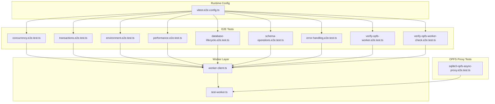
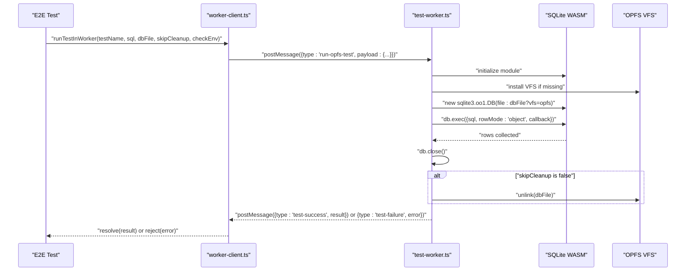
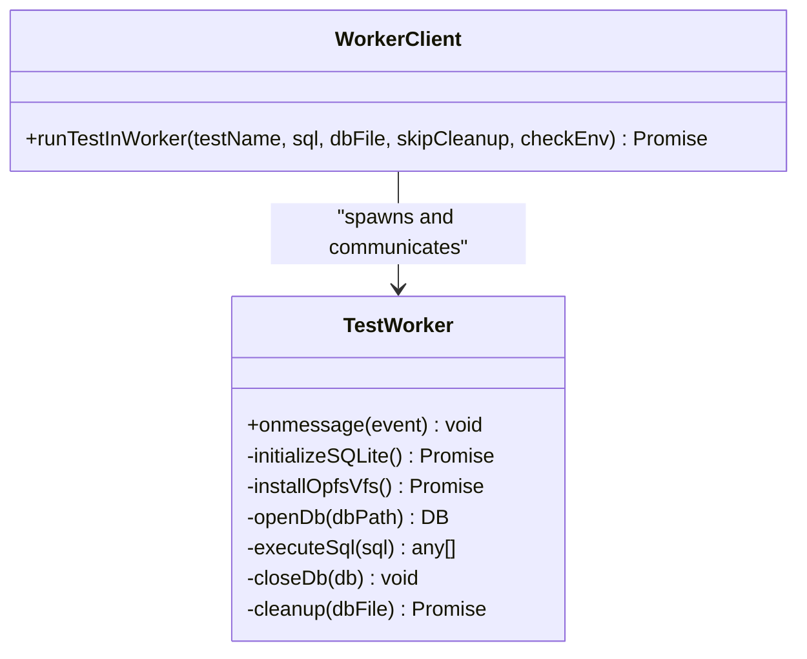
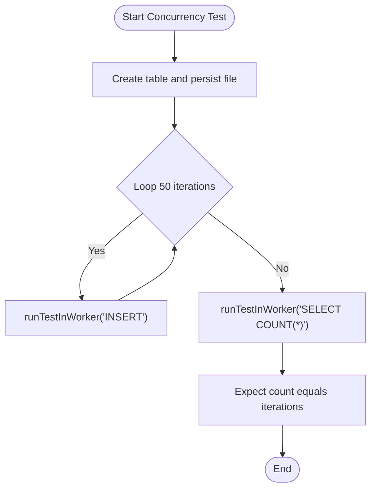
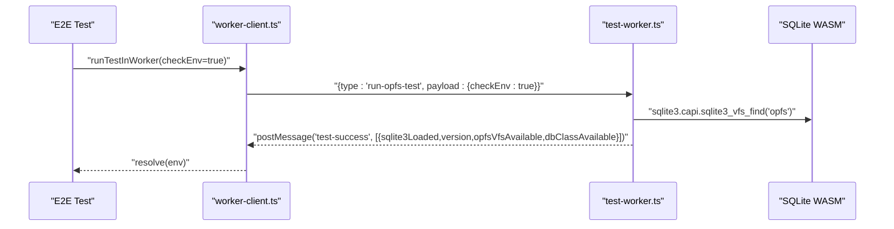
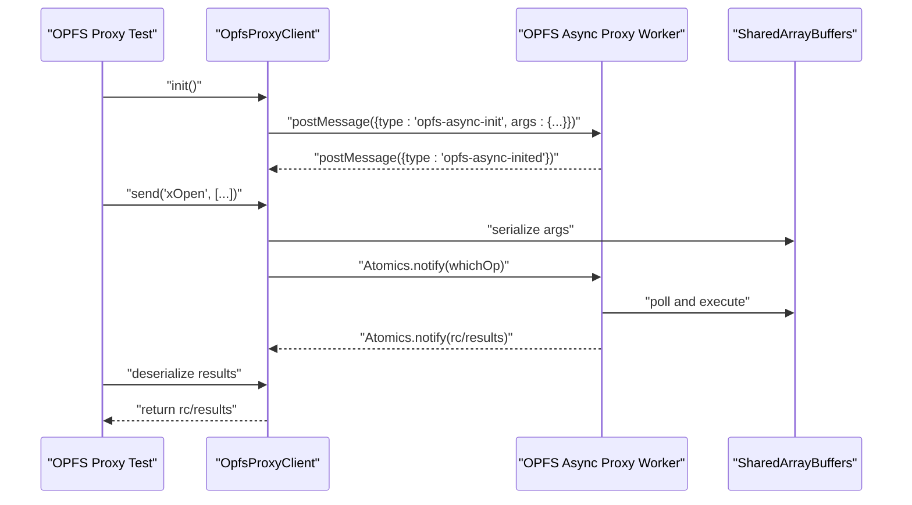
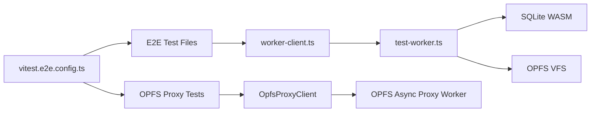

# End-to-End Testing

<cite>
**Referenced Files in This Document**
- [concurrency.e2e.test.ts](file://tests/e2e/concurrency.e2e.test.ts)
- [transactions.e2e.test.ts](file://tests/e2e/transactions.e2e.test.ts)
- [environment.e2e.test.ts](file://tests/e2e/environment.e2e.test.ts)
- [performance.e2e.test.ts](file://tests/e2e/performance.e2e.test.ts)
- [database-lifecycle.e2e.test.ts](file://tests/e2e/database-lifecycle.e2e.test.ts)
- [schema-operations.e2e.test.ts](file://tests/e2e/schema-operations.e2e.test.ts)
- [error-handling.e2e.test.ts](file://tests/e2e/error-handling.e2e.test.ts)
- [test-worker.ts](file://tests/e2e/test-worker.ts)
- [worker-client.ts](file://tests/e2e/worker-client.ts)
- [verify-opfs-worker.e2e.test.ts](file://tests/e2e/verify-opfs-worker.e2e.test.ts)
- [verify-opfs-worker-check.e2e.test.ts](file://tests/e2e/verify-opfs-worker-check.e2e.test.ts)
- [sqlite3-opfs-async-proxy.e2e.test.ts](file://src/jswasm/vfs/opfs/sqlite3-opfs-async-proxy.e2e.test.ts)
- [vitest.e2e.config.ts](file://vitest.e2e.config.ts)
</cite>

## Table of Contents

1. [Introduction](#introduction)
2. [Project Structure](#project-structure)
3. [Core Components](#core-components)
4. [Architecture Overview](#architecture-overview)
5. [Detailed Component Analysis](#detailed-component-analysis)
6. [Dependency Analysis](#dependency-analysis)
7. [Performance Considerations](#performance-considerations)
8. [Troubleshooting Guide](#troubleshooting-guide)
9. [Conclusion](#conclusion)
10. [Appendices](#appendices)

## Introduction

This document explains the end-to-end (E2E) testing framework for web-sqlite-v2. It focuses on how E2E tests validate full database workflows across connection lifecycle, SQL execution, transaction integrity, schema operations, and error recovery. It also documents the use of test-worker and worker-client to simulate realistic Web Worker interactions and OPFS persistence. Examples from concurrency.e2e.test.ts and transactions.e2e.test.ts demonstrate race condition testing and isolation levels. Cross-browser compatibility and feature detection are verified in environment.e2e.test.ts. Storage reliability is ensured by verify-opfs-worker\* tests. Performance.e2e.test.ts benchmarks bulk operations and large result sets. Configuration is centralized in vitest.e2e.config.ts, including browser environments and headers required for OPFS and SharedArrayBuffer. Guidance is provided for extending E2E tests and debugging failures in asynchronous, worker-based execution contexts.

## Project Structure

The E2E tests are organized under tests/e2e and exercise the SQLite WASM engine with OPFS-backed persistence. A dedicated worker script initializes the SQLite module, installs OPFS VFS, and executes SQL commands. A thin client wraps worker creation and message passing to provide a simple API for tests.



**Diagram sources**

- [concurrency.e2e.test.ts](file://tests/e2e/concurrency.e2e.test.ts#L1-L29)
- [transactions.e2e.test.ts](file://tests/e2e/transactions.e2e.test.ts#L1-L130)
- [environment.e2e.test.ts](file://tests/e2e/environment.e2e.test.ts#L1-L44)
- [performance.e2e.test.ts](file://tests/e2e/performance.e2e.test.ts#L1-L119)
- [database-lifecycle.e2e.test.ts](file://tests/e2e/database-lifecycle.e2e.test.ts#L1-L85)
- [schema-operations.e2e.test.ts](file://tests/e2e/schema-operations.e2e.test.ts#L1-L94)
- [error-handling.e2e.test.ts](file://tests/e2e/error-handling.e2e.test.ts#L1-L51)
- [verify-opfs-worker.e2e.test.ts](file://tests/e2e/verify-opfs-worker.e2e.test.ts#L1-L32)
- [verify-opfs-worker-check.e2e.test.ts](file://tests/e2e/verify-opfs-worker-check.e2e.test.ts#L1-L15)
- [worker-client.ts](file://tests/e2e/worker-client.ts#L1-L34)
- [test-worker.ts](file://tests/e2e/test-worker.ts#L1-L74)
- [sqlite3-opfs-async-proxy.e2e.test.ts](file://src/jswasm/vfs/opfs/sqlite3-opfs-async-proxy.e2e.test.ts#L1-L539)
- [vitest.e2e.config.ts](file://vitest.e2e.config.ts#L1-L67)

**Section sources**

- [vitest.e2e.config.ts](file://vitest.e2e.config.ts#L1-L67)

## Core Components

- Worker client: Creates a Web Worker, posts a standardized message to run OPFS tests, and resolves/rejects based on worker messages. It ensures worker termination after each run.
- Test worker: Initializes SQLite WASM, installs OPFS VFS if missing, opens a database with OPFS, executes SQL, collects results, closes the database, optionally unlinks the file, and posts outcomes back to the client.
- Environment checks: Verifies SQLite module load, OPFS VFS availability, SharedArrayBuffer support, and DB class presence.
- Transaction tests: Validates COMMIT/ROLLBACK semantics and nested savepoints.
- Concurrency tests: Demonstrates concurrent read/write operations using sequential worker invocations to avoid busy locks.
- Schema operations: Exercises CREATE TABLE, CREATE INDEX, ALTER TABLE, and DROP TABLE.
- Error handling: Validates error propagation for invalid SQL, missing tables/columns, and message formatting.
- Performance tests: Benchmarks bulk inserts, index benefits, and large result set handling.
- OPFS proxy tests: Validates low-level OPFS operations (xAccess, xOpen/xClose, xWrite/xRead, xFileSize/xTruncate, xLock/xUnlock, xDelete) via a SharedArrayBuffer-based proxy client.

**Section sources**

- [worker-client.ts](file://tests/e2e/worker-client.ts#L1-L34)
- [test-worker.ts](file://tests/e2e/test-worker.ts#L1-L74)
- [environment.e2e.test.ts](file://tests/e2e/environment.e2e.test.ts#L1-L44)
- [transactions.e2e.test.ts](file://tests/e2e/transactions.e2e.test.ts#L1-L130)
- [concurrency.e2e.test.ts](file://tests/e2e/concurrency.e2e.test.ts#L1-L29)
- [schema-operations.e2e.test.ts](file://tests/e2e/schema-operations.e2e.test.ts#L1-L94)
- [error-handling.e2e.test.ts](file://tests/e2e/error-handling.e2e.test.ts#L1-L51)
- [performance.e2e.test.ts](file://tests/e2e/performance.e2e.test.ts#L1-L119)
- [sqlite3-opfs-async-proxy.e2e.test.ts](file://src/jswasm/vfs/opfs/sqlite3-opfs-async-proxy.e2e.test.ts#L1-L539)

## Architecture Overview

The E2E tests run in Vitest’s browser provider. Each test spawns a dedicated Web Worker that initializes SQLite, installs OPFS VFS, and executes SQL against an OPFS-backed database file. Results are serialized back to the test via postMessage. The configuration enforces browser instances, timeouts, and headers required for OPFS and SharedArrayBuffer.



**Diagram sources**

- [worker-client.ts](file://tests/e2e/worker-client.ts#L1-L34)
- [test-worker.ts](file://tests/e2e/test-worker.ts#L1-L74)

**Section sources**

- [vitest.e2e.config.ts](file://vitest.e2e.config.ts#L1-L67)

## Detailed Component Analysis

### Worker Client and Test Worker

- Responsibilities:
    - Worker client: encapsulates worker lifecycle, message handling, and cleanup.
    - Test worker: initializes SQLite, ensures OPFS VFS registration, opens DB with OPFS, executes SQL, collects results, closes DB, optionally removes the file, and posts outcomes.
- Key behaviors:
    - OPFS VFS installation is explicit in the worker to guarantee availability.
    - DB path uses the OPFS VFS parameter.
    - Results are streamed via a callback and aggregated into an array.
    - Cleanup is controlled by a flag to enable persistence across steps.



**Diagram sources**

- [worker-client.ts](file://tests/e2e/worker-client.ts#L1-L34)
- [test-worker.ts](file://tests/e2e/test-worker.ts#L1-L74)

**Section sources**

- [worker-client.ts](file://tests/e2e/worker-client.ts#L1-L34)
- [test-worker.ts](file://tests/e2e/test-worker.ts#L1-L74)

### Concurrency E2E Tests

- Objective: validate concurrent read/write operations using multiple worker invocations against a single OPFS-backed file.
- Approach:
    - Setup phase creates a table and leaves cleanup disabled to persist data across steps.
    - Iterative inserts are executed sequentially to avoid SQLITE_BUSY from simultaneous writes.
    - Final verification counts rows to ensure atomicity and persistence.
- Notes:
    - The worker creates a new connection per invocation; true concurrency is managed by the OPFS VFS, but aggressive parallelism risks busy locks.



**Diagram sources**

- [concurrency.e2e.test.ts](file://tests/e2e/concurrency.e2e.test.ts#L1-L29)

**Section sources**

- [concurrency.e2e.test.ts](file://tests/e2e/concurrency.e2e.test.ts#L1-L29)

### Transactions E2E Tests

- Objective: validate transaction COMMIT/ROLLBACK and nested savepoints.
- Approach:
    - COMMIT test: create table, insert, begin transaction, insert, commit, select to confirm atomicity.
    - ROLLBACK test: create table, insert, begin transaction, insert, rollback, select to confirm rollback.
    - Automatic rollback on error: due to the stateless worker model (open-run-close), strict verification of automatic rollback is simplified or deferred.
    - Nested savepoints: demonstrates nested savepoint semantics and selective rollback within a transaction.
- Notes:
    - The worker closes the DB after execution; error scenarios are surfaced via thrown exceptions captured by the client.

```mermaid
sequenceDiagram
participant Test as "E2E Test"
participant Client as "worker-client.ts"
participant Worker as "test-worker.ts"
participant SQLite as "SQLite Engine"
Test->>Client : "runTestInWorker('Transaction COMMIT')"
Client->>Worker : "{type : 'run-opfs-test', sql : 'BEGIN; INSERT; COMMIT; SELECT;'}"
Worker->>SQLite : "db.exec(...)"
SQLite-->>Worker : "rows"
Worker-->>Client : "postMessage('test-success', result)"
Client-->>Test : "resolve(result)"
```

**Diagram sources**

- [transactions.e2e.test.ts](file://tests/e2e/transactions.e2e.test.ts#L1-L130)
- [worker-client.ts](file://tests/e2e/worker-client.ts#L1-L34)
- [test-worker.ts](file://tests/e2e/test-worker.ts#L1-L74)

**Section sources**

- [transactions.e2e.test.ts](file://tests/e2e/transactions.e2e.test.ts#L1-L130)

### Environment E2E Tests

- Objective: verify runtime environment prerequisites for OPFS and SQLite WASM.
- Checks:
    - SQLite module loads successfully and exposes version info.
    - OPFS VFS is available.
    - SharedArrayBuffer is supported at runtime.
    - DB class is available.
- Method:
    - Uses the worker client with a special environment check flag to query capabilities from the worker.



**Diagram sources**

- [environment.e2e.test.ts](file://tests/e2e/environment.e2e.test.ts#L1-L44)
- [worker-client.ts](file://tests/e2e/worker-client.ts#L1-L34)
- [test-worker.ts](file://tests/e2e/test-worker.ts#L1-L74)

**Section sources**

- [environment.e2e.test.ts](file://tests/e2e/environment.e2e.test.ts#L1-L44)

### Database Lifecycle E2E Tests

- Objective: validate database creation, persistence across connections, and multiple connections.
- Steps:
    - Create OPFS database and verify with a simple SELECT.
    - Use helper to query sqlite_master for empty state.
    - Persist data across connections by skipping cleanup during setup.
    - Verify data in a subsequent connection.
    - Validate multiple connections can open the same file without error.

**Section sources**

- [database-lifecycle.e2e.test.ts](file://tests/e2e/database-lifecycle.e2e.test.ts#L1-L85)

### Schema Operations E2E Tests

- Objective: validate DDL operations end-to-end.
- Coverage:
    - CREATE TABLE with multiple column types and constraints.
    - CREATE INDEX on single/multiple columns.
    - ALTER TABLE add column.
    - DROP TABLE.
- Validation:
    - Query sqlite_master to confirm schema changes.

**Section sources**

- [schema-operations.e2e.test.ts](file://tests/e2e/schema-operations.e2e.test.ts#L1-L94)

### Error Handling E2E Tests

- Objective: validate error propagation and message formatting.
- Scenarios:
    - Invalid SQL syntax triggers a syntax error.
    - Nonexistent table triggers a table-not-found error.
    - Nonexistent column triggers a column-not-found error.
    - Error message is non-empty.
- Behavior:
    - Worker throws on SQL failure; client rejects with the error message.

**Section sources**

- [error-handling.e2e.test.ts](file://tests/e2e/error-handling.e2e.test.ts#L1-L51)

### Performance E2E Tests

- Objective: benchmark bulk operations and large result sets.
- Bulk insert with transaction:
    - Generates a large multi-row INSERT within a transaction and verifies row count.
    - Measures elapsed time to ensure responsiveness despite worker message overhead.
- Index performance logic:
    - Validates that index creation and usage do not break queries.
- Large result set handling:
    - Inserts a large number of rows and verifies retrieval of the full result set.

**Section sources**

- [performance.e2e.test.ts](file://tests/e2e/performance.e2e.test.ts#L1-L119)

### OPFS Worker Verification Tests

- Purpose: ensure OPFS operations can run inside a worker and that the VFS is registered.
- verify-opfs-worker.e2e.test.ts:
    - Spawns a worker, posts a simple SELECT, and asserts the result.
- verify-opfs-worker-check.e2e.test.ts:
    - Uses the worker client helper to run a query and assert a single-row result, implicitly verifying OPFS VFS installation.

**Section sources**

- [verify-opfs-worker.e2e.test.ts](file://tests/e2e/verify-opfs-worker.e2e.test.ts#L1-L32)
- [verify-opfs-worker-check.e2e.test.ts](file://tests/e2e/verify-opfs-worker-check.e2e.test.ts#L1-L15)

### OPFS Async Proxy E2E Tests

- Purpose: validate low-level OPFS operations via a SharedArrayBuffer-based proxy client.
- Operations covered:
    - xAccess (existence), xOpen/xClose, xWrite/xRead, xFileSize/xTruncate, xLock/xUnlock, xDelete.
- Mechanism:
    - Client initializes SABs, serializes arguments into a shared buffer, signals the worker via Atomics, polls for completion, deserializes results, and performs cleanup.



**Diagram sources**

- [sqlite3-opfs-async-proxy.e2e.test.ts](file://src/jswasm/vfs/opfs/sqlite3-opfs-async-proxy.e2e.test.ts#L1-L539)

**Section sources**

- [sqlite3-opfs-async-proxy.e2e.test.ts](file://src/jswasm/vfs/opfs/sqlite3-opfs-async-proxy.e2e.test.ts#L1-L539)

## Dependency Analysis

- Test files depend on worker-client.ts to spawn and communicate with test-worker.ts.
- test-worker.ts depends on the SQLite WASM module and OPFS VFS installer.
- OPFS proxy tests depend on a separate worker and SAB-based communication.
- Configuration ties E2E tests to Playwright browser instances and sets required headers for OPFS and SharedArrayBuffer.



**Diagram sources**

- [worker-client.ts](file://tests/e2e/worker-client.ts#L1-L34)
- [test-worker.ts](file://tests/e2e/test-worker.ts#L1-L74)
- [sqlite3-opfs-async-proxy.e2e.test.ts](file://src/jswasm/vfs/opfs/sqlite3-opfs-async-proxy.e2e.test.ts#L1-L539)
- [vitest.e2e.config.ts](file://vitest.e2e.config.ts#L1-L67)

**Section sources**

- [vitest.e2e.config.ts](file://vitest.e2e.config.ts#L1-L67)

## Performance Considerations

- Message serialization overhead: Passing large SQL strings to the worker adds latency. Prefer batching and minimize unnecessary round-trips.
- Busy locks: Aggressive concurrent writes from separate workers can cause SQLITE_BUSY. Tests mitigate this by sequential execution.
- OPFS I/O: Large result sets and bulk inserts are constrained by OPFS throughput and worker messaging. Use transactions for bulk operations.
- Timeout tuning: The E2E configuration sets a generous test timeout to accommodate browser and worker startup costs.

[No sources needed since this section provides general guidance]

## Troubleshooting Guide

- Worker does not respond:
    - Ensure the worker receives the correct message type and payload keys.
    - Verify the worker terminates after each run to prevent resource leaks.
- OPFS VFS not available:
    - Confirm the worker installs OPFS VFS if not present.
    - Validate environment checks pass before running functional tests.
- SQLITE_BUSY errors:
    - Avoid launching multiple workers that write simultaneously.
    - Use sequential execution for concurrent tests.
- Errors not propagated:
    - The worker throws on SQL failure; the client rejects with the error message. Inspect the error message for SQL syntax or constraint violations.
- OPFS proxy timeouts:
    - The proxy client polls with a timeout; adjust polling intervals or reduce workload size if necessary.

**Section sources**

- [worker-client.ts](file://tests/e2e/worker-client.ts#L1-L34)
- [test-worker.ts](file://tests/e2e/test-worker.ts#L1-L74)
- [sqlite3-opfs-async-proxy.e2e.test.ts](file://src/jswasm/vfs/opfs/sqlite3-opfs-async-proxy.e2e.test.ts#L1-L539)

## Conclusion

The E2E testing framework validates end-to-end database workflows using a Web Worker-based executor that initializes SQLite WASM and installs OPFS VFS. Tests cover connection lifecycle, SQL execution, transactions, schema operations, error handling, and performance. Environment checks ensure cross-browser compatibility and feature availability. The OPFS proxy tests validate low-level file operations. Configuration centralizes browser environments and headers required for OPFS and SharedArrayBuffer. Extending tests follows the established patterns: use the worker client to run SQL in a worker, leverage environment checks for feature detection, and apply sequential execution for concurrency scenarios.

[No sources needed since this section summarizes without analyzing specific files]

## Appendices

### Configuration Reference

- Browser provider and instances: Chromium is configured as the default browser for E2E tests.
- Headless mode: Disabled to observe test execution.
- Test timeout: 30 seconds for E2E scenarios.
- Headers: COOP/COEP and CORS headers are set to enable OPFS and SharedArrayBuffer.
- Worker format: ES modules for worker tests.

**Section sources**

- [vitest.e2e.config.ts](file://vitest.e2e.config.ts#L1-L67)
