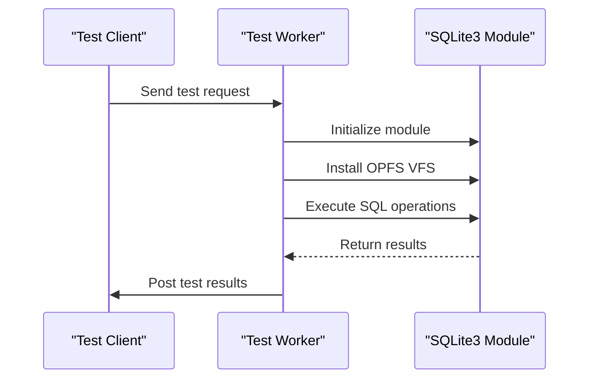
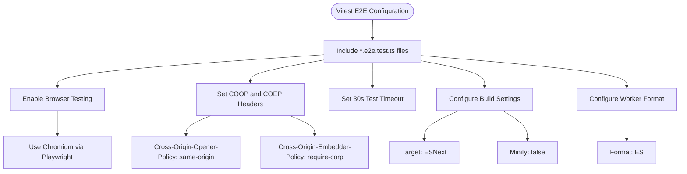

# Testing Strategy

<cite>
**Referenced Files in This Document**   
- [vitest.e2e.config.ts](file://vitest.e2e.config.ts)
- [vitest.unit.config.ts](file://vitest.unit.config.ts)
- [test-worker.ts](file://tests/e2e/test-worker.ts)
- [worker-client.ts](file://tests/e2e/worker-client.ts)
- [async-utils.unit.test.ts](file://src/jswasm/utils/async-utils/async-utils.unit.test.ts)
- [path.unit.test.ts](file://src/jswasm/utils/path/path.unit.test.ts)
- [memory-utils.unit.test.ts](file://src/jswasm/utils/memory-utils/memory-utils.unit.test.ts)
- [create-wh-wasm-util-installer.unit.test.ts](file://src/jswasm/utils/create-wh-wasm-util-installer/create-wh-wasm-util-installer.unit.test.ts)
- [utf8.unit.test.ts](file://src/jswasm/utils/utf8/utf8.unit.test.ts)
- [wasm-loader.unit.test.ts](file://src/jswasm/utils/wasm-loader/wasm-loader.unit.test.ts)
- [base-state.unit.test.ts](file://src/jswasm/vfs/filesystem/base-state/base-state.unit.test.ts)
- [database-lifecycle.e2e.test.ts](file://tests/e2e/database-lifecycle.e2e.test.ts)
- [concurrency.e2e.test.ts](file://tests/e2e/concurrency.e2e.test.ts)
- [error-handling.e2e.test.ts](file://tests/e2e/error-handling.e2e.test.ts)
- [transactions.e2e.test.ts](file://tests/e2e/transactions.e2e.test.ts)
</cite>

## Table of Contents
1. [Introduction](#introduction)
2. [Unit Testing Approach](#unit-testing-approach)
3. [End-to-End Testing Framework](#end-to-end-testing-framework)
4. [Test Worker Infrastructure](#test-worker-infrastructure)
5. [Test Case Examples](#test-case-examples)
6. [Testing Configuration](#testing-configuration)
7. [WASM Interaction Challenges](#wasm-interaction-challenges)
8. [Debugging Techniques](#debugging-techniques)

## Introduction
The web-sqlite-v2 project implements a comprehensive testing strategy to ensure the reliability and correctness of its SQLite3 WebAssembly implementation with OPFS support. The testing framework is built on Vitest and consists of two main components: unit tests for individual utility functions and end-to-end tests that validate the complete database lifecycle, SQL operations, and transaction integrity across different environments. This document details the testing approach, infrastructure, and best practices used in the project.

## Unit Testing Approach

The unit testing strategy focuses on validating individual utility functions in isolation, ensuring that core functionality works correctly before integration into the larger system. The project uses Vitest as the testing framework and employs mocking strategies to isolate dependencies and test edge cases.

### Async Utilities Testing
The async-utils module provides functions for asynchronous operations, particularly for loading data. The unit tests verify that the `createAsyncLoad` function correctly handles successful data loading, error conditions, and dependency tracking. Mocking is used extensively to simulate different scenarios:

- Success case: Mocking `readAsync` to resolve with data and verifying that callbacks are called correctly
- Error handling: Mocking `readAsync` to reject and verifying that error handlers are invoked
- Dependency tracking: Verifying that run dependencies are properly added and removed
- Unhandled rejections: Testing the behavior when no error handler is provided

The tests use Vitest's mocking capabilities to replace external dependencies and verify interactions through expectation assertions.

**Section sources**
- [async-utils.unit.test.ts](file://src/jswasm/utils/async-utils/async-utils.unit.test.ts)

### Path Operations Testing
The path utilities module implements POSIX-compliant path manipulation functions. The unit tests validate various path operations:

- Normalization: Testing that paths are correctly normalized while preserving trailing separators and handling dot segments
- Array normalization: Verifying that parent directory references are properly resolved
- Directory and basename extraction: Ensuring that `dirname` and `basename` functions return correct values according to POSIX semantics
- Path joining: Testing that multiple path segments are joined and normalized correctly
- Path resolution: Validating that relative and absolute paths are resolved correctly, both with and without a filesystem helper
- Relative path computation: Ensuring that the relative path between two locations is calculated correctly

The tests use a combination of direct function calls and mock filesystem contexts to verify behavior in different scenarios.

**Section sources**
- [path.unit.test.ts](file://src/jswasm/utils/path/path.unit.test.ts)

### Memory Management Testing
The memory-utils module handles various memory operations required by the WebAssembly implementation. The unit tests focus on:

- Random fill initialization: Verifying that `initRandomFill` correctly proxies to `crypto.getRandomValues` and throws appropriate errors when the crypto API is unavailable
- Memory zeroing: Testing that `zeroMemory` correctly clears the specified heap slice
- Memory alignment: Ensuring that `alignMemory` rounds sizes up to the specified alignment boundaries
- Memory allocation: Validating that `createMmapAlloc` correctly aligns, allocates, and zeros memory, and handles allocation failures

The tests use a custom test setup that allows manipulation of the global `crypto` object to test both available and unavailable crypto scenarios.

**Section sources**
- [memory-utils.unit.test.ts](file://src/jswasm/utils/memory-utils/memory-utils.unit.test.ts)

## End-to-End Testing Framework

The end-to-end testing framework validates the complete functionality of the SQLite3 WebAssembly implementation, focusing on database lifecycle, SQL operations, and transaction integrity across different environments.

### Database Lifecycle Validation
The database-lifecycle.e2e.test.ts file contains tests that verify the complete lifecycle of an OPFS database:

- Database creation: Testing that a new OPFS database can be created and accessed
- Database persistence: Verifying that data persists across multiple connections to the same database file
- Multiple connections: Ensuring that multiple connections to the same database file can be established without conflicts

The tests use a worker-based approach to simulate separate execution contexts while sharing the same database file, allowing validation of persistence and concurrent access patterns.

**Section sources**
- [database-lifecycle.e2e.test.ts](file://tests/e2e/database-lifecycle.e2e.test.ts)

### SQL Operations and Transaction Integrity
The end-to-end tests validate various SQL operations and transaction behaviors:

- CRUD operations: Testing create, read, update, and delete operations through SQL statements
- Prepared statements: Validating the use of prepared statements for parameterized queries
- Schema operations: Testing database schema modifications like table creation and alteration
- Data types: Ensuring proper handling of different SQLite data types
- Constraints: Validating primary key, foreign key, and other constraints
- Query operations: Testing complex queries, joins, and aggregations

Transaction integrity is tested through:
- Successful transactions with explicit COMMIT
- Rollback behavior with explicit ROLLBACK
- Nested savepoints and partial rollbacks
- Error handling within transactions

**Section sources**
- [transactions.e2e.test.ts](file://tests/e2e/transactions.e2e.test.ts)
- [crud-operations.e2e.test.ts](file://tests/e2e/crud-operations.e2e.test.ts)
- [prepared-statements.e2e.test.ts](file://tests/e2e/prepared-statements.e2e.test.ts)
- [schema-operations.e2e.test.ts](file://tests/e2e/schema-operations.e2e.test.ts)
- [data-types.e2e.test.ts](file://tests/e2e/data-types.e2e.test.ts)
- [constraints.e2e.test.ts](file://tests/e2e/constraints.e2e.test.ts)
- [query-operations.e2e.test.ts](file://tests/e2e/query-operations.e2e.test.ts)

## Test Worker Infrastructure

The test infrastructure uses a worker-based architecture to simulate real-world usage patterns and isolate test execution contexts.

### Worker Architecture
The test-worker.ts file implements a worker that handles test execution requests:

- Message-based interface: The worker listens for messages and executes tests based on the received payload
- SQLite initialization: Each test run initializes the SQLite3 module with appropriate configuration
- OPFS VFS installation: The worker ensures the OPFS VFS is installed before running tests
- Database operations: The worker executes SQL statements against the specified database file
- Result reporting: Test results are sent back to the main thread through postMessage

The worker architecture allows for isolated test execution, preventing interference between tests and enabling better resource management.

**Diagram sources**
- [test-worker.ts](file://tests/e2e/test-worker.ts)

### Worker Client
The worker-client.ts file provides a convenient interface for running tests in the worker:

- Promise-based API: The `runTestInWorker` function returns a Promise that resolves with test results
- Worker lifecycle management: The client creates and terminates workers automatically
- Error handling: Test failures are converted to rejected Promises
- Configuration options: The client supports various test configurations like database file names and cleanup behavior

This abstraction simplifies test writing by hiding the complexity of worker communication.

**Section sources**
- [worker-client.ts](file://tests/e2e/worker-client.ts)

## Test Case Examples

The test suite includes comprehensive examples for various scenarios, including concurrency, error handling, and edge cases.

### Concurrency Testing
The concurrency.e2e.test.ts file tests concurrent read/write operations:

- Sequential execution: Multiple insert operations are performed sequentially to verify data integrity
- Iterative testing: A loop performs multiple insertions to stress-test the database
- Count verification: The final count of inserted records is verified to ensure all operations succeeded

The tests acknowledge the limitations of concurrent access through separate workers, noting that SQLite OPFS may lock with aggressive concurrent connections, and opt for sequential execution to ensure reliability.

**Section sources**
- [concurrency.e2e.test.ts](file://tests/e2e/concurrency.e2e.test.ts)

### Error Handling Testing
The error-handling.e2e.test.ts file validates proper error reporting for various error conditions:

- Invalid SQL syntax: Testing that syntax errors are properly reported
- Nonexistent tables: Verifying that attempts to access nonexistent tables produce appropriate errors
- Missing columns: Ensuring that references to nonexistent columns are correctly handled
- Error message format: Validating that error messages are properly formatted and contain useful information

The tests use try-catch blocks to verify that specific error messages are produced for each error condition.

**Section sources**
- [error-handling.e2e.test.ts](file://tests/e2e/error-handling.e2e.test.ts)

### Edge Case Testing
The test suite includes various edge cases:

- Empty paths: Testing path operations with empty strings
- Root directory: Verifying behavior at the filesystem root
- Special path segments: Handling dot and dot-dot segments correctly
- Permission boundaries: Testing operations at permission boundaries
- Large data operations: Validating handling of large datasets
- Boundary conditions: Testing operations at numeric and memory boundaries

These tests ensure robustness in corner cases that might not be encountered in normal usage.

## Testing Configuration

The project uses two separate Vitest configuration files for unit and end-to-end tests, allowing different settings for each test type.

### E2E Test Configuration
The vitest.e2e.config.ts file configures the end-to-end tests:

- Test inclusion: Includes all files matching the pattern "**/*.e2e.test.ts"
- Browser testing: Enables browser testing with Playwright as the provider, using Chromium in headless mode
- Test timeout: Sets a 30-second timeout for E2E tests
- Server headers: Configures required headers for OPFS and SharedArrayBuffer functionality, including Cross-Origin-Opener-Policy and Cross-Origin-Embedder-Policy
- Build settings: Targets ESNext and disables minification for better debugging
- Worker configuration: Specifies ES module format for workers

The configuration ensures that the testing environment properly supports the OPFS and SAB features required by the application.

**Diagram sources**
- [vitest.e2e.config.ts](file://vitest.e2e.config.ts)

### Unit Test Configuration
The vitest.unit.config.ts file configures the unit tests:

- Test inclusion: Includes all files matching the pattern "src/**/*.unit.test.ts"
- Server headers: Configures the same security headers as the E2E configuration for consistency
- Isolated testing: Focuses on testing individual units in isolation without browser dependencies

The unit test configuration is simpler than the E2E configuration, reflecting the different requirements of unit testing.

**Section sources**
- [vitest.unit.config.ts](file://vitest.unit.config.ts)

## WASM Interaction Challenges

Testing WebAssembly interactions presents several challenges that the project addresses through specific strategies.

### Asynchronous Initialization
WebAssembly modules require asynchronous initialization, which complicates testing. The tests handle this by:

- Using async/await syntax to manage asynchronous operations
- Properly sequencing initialization steps before test execution
- Handling initialization failures gracefully

### Memory Management
WebAssembly operates on a linear memory model, requiring careful memory management:

- Proper alignment of memory allocations
- Zeroing of allocated memory for security
- Efficient memory usage patterns
- Proper cleanup of allocated memory

The tests validate these memory operations through direct inspection and behavior verification.

### OPFS Integration
The integration with the Origin Private File System (OPFS) presents challenges:

- Security requirements: The need for specific HTTP headers (COOP and COEP)
- Asynchronous file operations: All OPFS operations are asynchronous
- Quota limitations: Potential storage limitations in the browser environment
- Error handling: Proper handling of file system errors

The test configuration ensures the required headers are set, and the tests validate proper error handling for file system operations.

## Debugging Techniques

The project employs several techniques for debugging test failures.

### Logging and Error Reporting
Comprehensive logging is used throughout the tests:

- Console output: Using console.log and console.error for debugging information
- Structured error messages: Providing detailed error messages that include context
- Stack traces: Preserving stack traces for easier debugging

### Isolation and Reproduction
When failures occur, the following approach is used:

- Isolating the failing test case
- Reducing the test to the minimal reproduction case
- Verifying the issue in different environments
- Comparing against expected behavior

### Configuration-Based Debugging
The test configurations support debugging through:

- Headful browser testing: The ability to run tests in visible browsers for visual debugging
- Detailed error reporting: Comprehensive error messages and stack traces
- Test timeouts: Appropriate timeouts to prevent hanging tests
- Parallel test execution: The ability to run tests in parallel or sequentially for isolation

These techniques enable efficient identification and resolution of test failures, ensuring the reliability of the testing process.