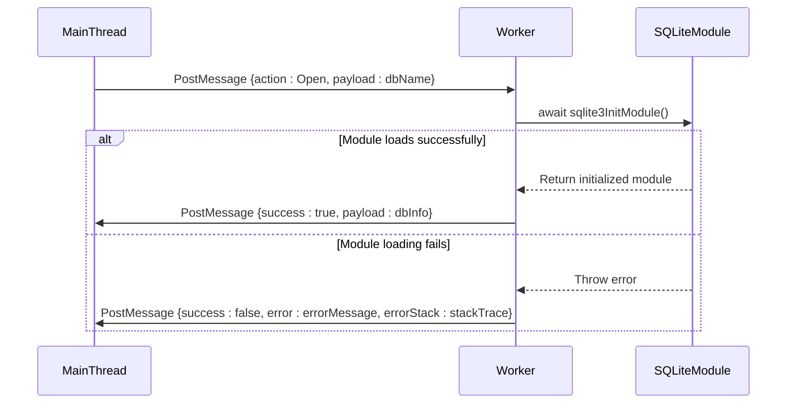
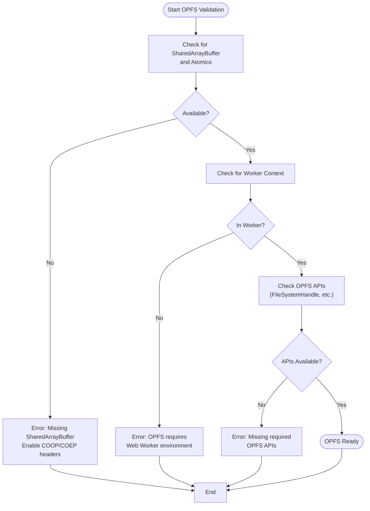
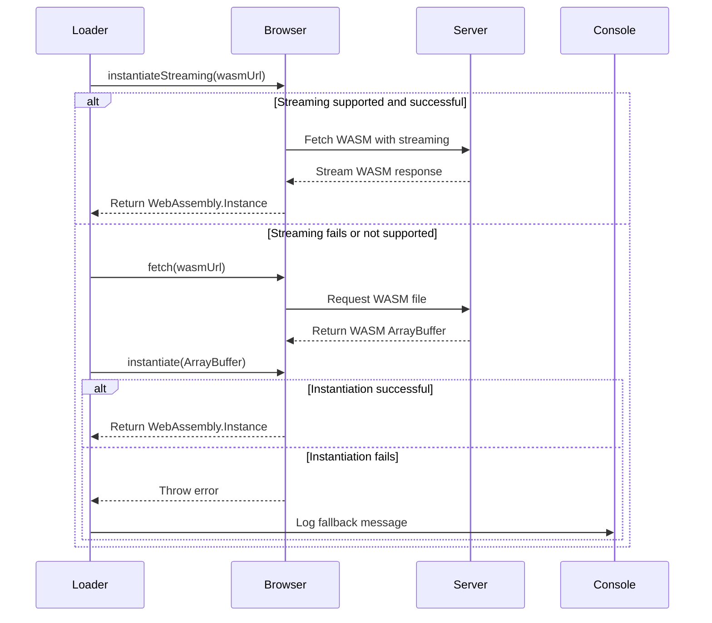
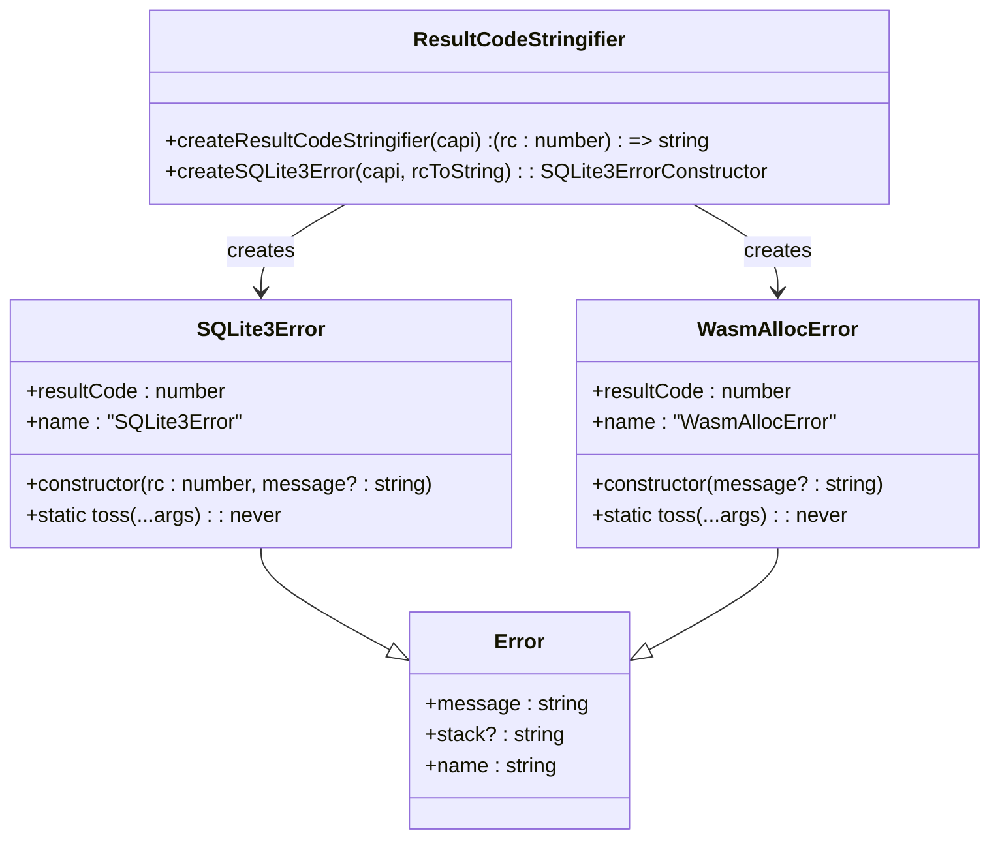
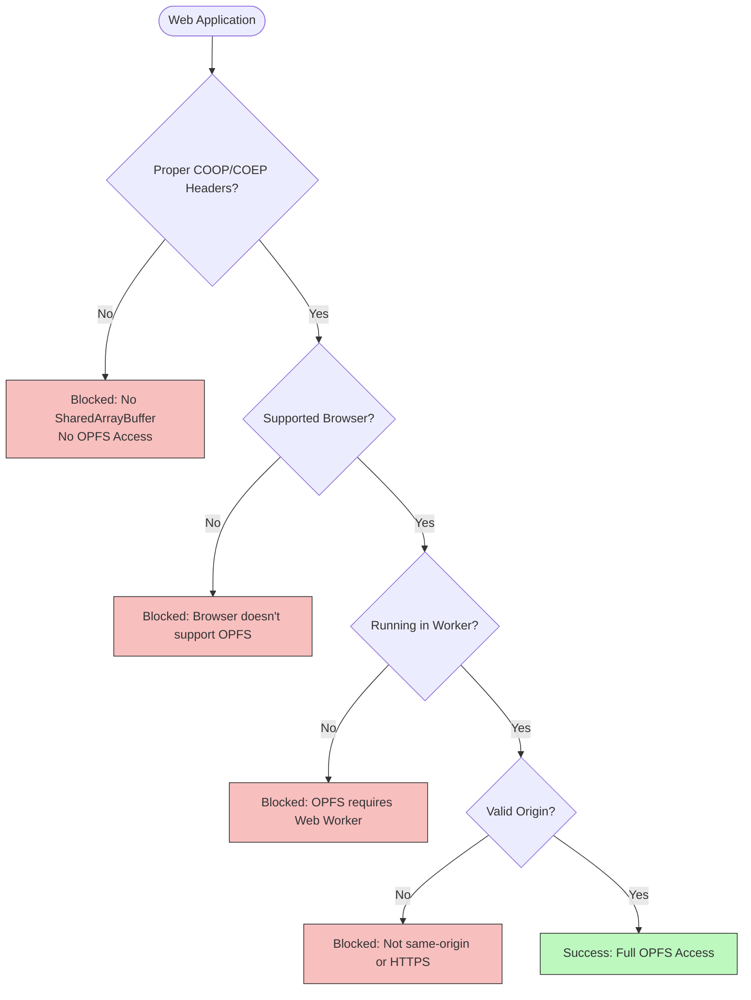
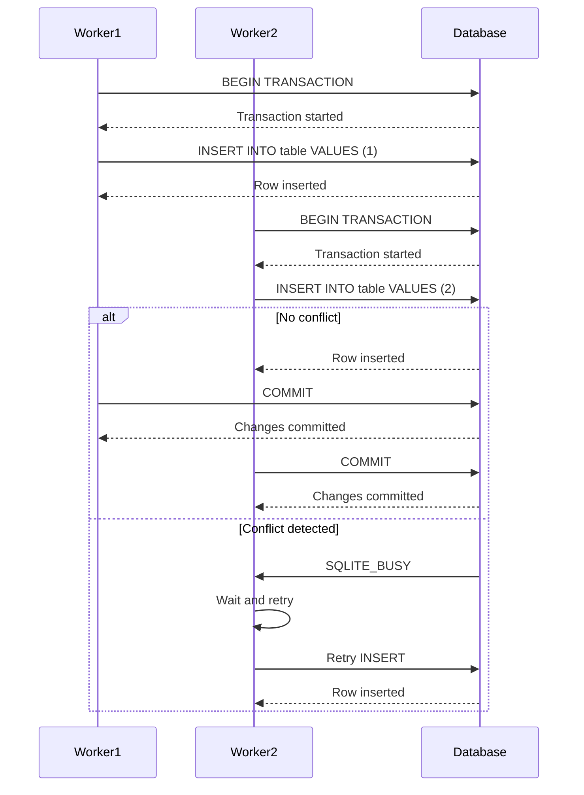
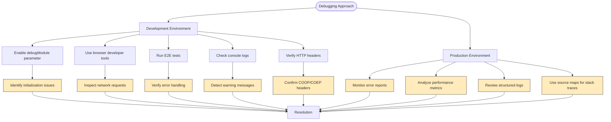

# Troubleshooting

<cite>
**Referenced Files in This Document**   
- [error-utils.mjs](file://src/jswasm/wasm/bootstrap/error-utils.mjs)
- [sqliteWorker.ts](file://src/sqliteWorker.ts)
- [index.ts](file://src/index.ts)
- [worker-client.ts](file://tests/e2e/worker-client.ts)
- [test-worker.ts](file://tests/e2e/test-worker.ts)
- [error-handling.e2e.test.ts](file://tests/e2e/error-handling.e2e.test.ts)
- [wasm-loader.ts](file://src/jswasm/utils/wasm-loader/wasm-loader.ts)
- [environment-validation.mjs](file://src/jswasm/vfs/opfs/installer/core/environment-validation.mjs)
- [worker-message-handler.mjs](file://src/jswasm/vfs/opfs/installer/utils/worker-message-handler.mjs)
- [memory-manager.mjs](file://src/jswasm/runtime/memory-manager.mjs)
- [transactions.e2e.test.ts](file://tests/e2e/transactions.e2e.test.ts)
- [concurrency.e2e.test.ts](file://tests/e2e/concurrency.e2e.test.ts)
- [http-server.ts](file://scripts/http-server.ts)
</cite>

## Table of Contents

1. [Worker Initialization Failures](#worker-initialization-failures)
2. [OPFS Access Errors](#opfs-access-errors)
3. [WASM Loading Problems](#wasm-loading-problems)
4. [Connection Timeouts and Query Execution Errors](#connection-timeouts-and-query-execution-errors)
5. [Memory Allocation Failures](#memory-allocation-failures)
6. [Interpreting Error Messages and Stack Traces](#interpreting-error-messages-and-stack-traces)
7. [Browser Compatibility and CORS Issues](#browser-compatibility-and-cors-issues)
8. [Concurrency Problems and Transaction Deadlocks](#concurrency-problems-and-transaction-deadlocks)
9. [Debugging Tools and Techniques](#debugging-tools-and-techniques)

## Worker Initialization Failures

Worker initialization failures typically occur when the Web Worker environment cannot be properly established or when the SQLite3 module fails to initialize. The `sqliteWorker.ts` file contains the core worker logic that handles initialization, database operations, and message passing between the main thread and worker thread.

The worker initialization process begins with the `ensureSqliteReady()` function, which asynchronously initializes the SQLite3 module when needed. If this initialization fails, the worker will not be able to process any database operations. Common causes include network issues preventing WASM file loading, browser security restrictions, or missing dependencies.

When a worker initialization failure occurs, the error is propagated through the message system with detailed error information including the error message and stack trace. The worker uses a structured message format with action codes (Open: 0, Close: 1, Sql: 2) to coordinate operations between threads.



**Diagram sources**

- [sqliteWorker.ts](file://src/sqliteWorker.ts#L47-L56)
- [test-worker.ts](file://tests/e2e/test-worker.ts#L12-L15)

**Section sources**

- [sqliteWorker.ts](file://src/sqliteWorker.ts#L31-L243)
- [test-worker.ts](file://tests/e2e/test-worker.ts#L1-L74)

## OPFS Access Errors

OPFS (Origin Private File System) access errors occur when the application cannot access the browser's file system APIs required for persistent storage. These errors are primarily governed by the environment validation logic in `environment-validation.mjs`, which checks for the necessary conditions before attempting to use OPFS.

The validation process checks for several critical requirements:

1. Presence of SharedArrayBuffer and Atomics APIs
2. Running in a worker context (not the main thread)
3. Availability of OPFS-specific APIs like FileSystemHandle and createSyncAccessHandle
4. Proper CORS and COOP/COEP headers from the server

If any of these requirements are not met, the system will throw a descriptive error explaining the missing capability. For example, if SharedArrayBuffer is not available, the error will specifically mention that the server must emit COOP/COEP response headers to enable these features.

The `thisThreadHasOPFS()` function provides a simple boolean check for OPFS availability, while `validateOpfsEnvironment()` provides detailed error information when OPFS is unavailable. These functions are called during the VFS installation process to ensure the environment is suitable before attempting to set up the file system interface.



**Diagram sources**

- [environment-validation.mjs](file://src/jswasm/vfs/opfs/installer/core/environment-validation.mjs#L6-L38)
- [worker-message-handler.mjs](file://src/jswasm/vfs/opfs/installer/utils/worker-message-handler.mjs#L26-L31)

**Section sources**

- [environment-validation.mjs](file://src/jswasm/vfs/opfs/installer/core/environment-validation.mjs#L1-L53)
- [worker-message-handler.mjs](file://src/jswasm/vfs/opfs/installer/utils/worker-message-handler.mjs#L1-L31)

## WASM Loading Problems

WASM loading problems can occur at various stages of the WebAssembly module initialization process. The system implements a robust loading mechanism with fallback strategies to handle different browser capabilities and network conditions.

The WASM loading process is managed by the `wasm-loader.ts` module, which attempts to load the SQLite3 WASM binary using the most efficient method available. The loader first attempts to use `WebAssembly.instantiateStreaming()` for optimal performance, but falls back to `WebAssembly.instantiate()` with an ArrayBuffer if streaming compilation fails.

Common WASM loading issues include:

- Network failures preventing the WASM file download
- Browser security policies blocking WASM execution
- Memory allocation failures during instantiation
- Incompatible WASM versions or corrupted binaries

When a loading failure occurs, the system provides detailed error information through the `readyPromiseReject` mechanism, which captures and reports the underlying error. The loader also includes debugging hooks that can be enabled via query parameters to help diagnose loading issues in development environments.



**Diagram sources**

- [wasm-loader.ts](file://src/jswasm/utils/wasm-loader/wasm-loader.ts#L170-L209)
- [wasm-loader.unit.test.ts](file://src/jswasm/utils/wasm-loader/wasm-loader.unit.test.ts#L100-L126)

**Section sources**

- [wasm-loader.ts](file://src/jswasm/utils/wasm-loader/wasm-loader.ts#L1-L209)
- [wasm-loader.unit.test.ts](file://src/jswasm/utils/wasm-loader/wasm-loader.unit.test.ts#L1-L148)

## Connection Timeouts and Query Execution Errors

Connection timeouts and query execution errors are handled through the worker message system with comprehensive error reporting. The `sqliteWorker.ts` file implements robust error handling for database operations, ensuring that all errors are properly captured and communicated back to the main thread.

When a query execution error occurs, the system captures both the error message and the full stack trace, which is then split into an array of strings for transmission back to the main thread. This allows developers to see exactly where the error originated, whether it was during SQL parsing, execution, or result processing.

Common query execution errors include:

- Invalid SQL syntax
- Non-existent tables or columns
- Constraint violations (unique, not null, foreign key)
- Type mismatches in parameter binding
- Database locked errors due to concurrent access

The error handling is demonstrated in the `error-handling.e2e.test.ts` file, which verifies that specific error messages are returned for different types of SQL errors. For example, invalid SQL syntax should return an error message containing "syntax error", while attempts to access non-existent tables should return messages containing "no such table".

```mermaid
flowchart TD
A([Execute SQL Query]) --> B{Database Open?}
B --> |No| C[Return: "No open database.<br/>Call Open first."]
B --> |Yes| D{Valid SQL String?}
D --> |No| E[Return: "Invalid payload for Sql:<br/>expected SQL string"]
D --> |Yes| F[Execute db.exec(sql)]
F --> G{Execution Successful?}
G --> |Yes| H[Return: {success: true, payload: results}]
G --> |No| I[Capture error.message and error.stack]
I --> J[Split stack trace by newlines]
J --> K[Return: {success: false, error: message, errorStack: array}]
```

**Diagram sources**

- [sqliteWorker.ts](file://src/sqliteWorker.ts#L112-L166)
- [error-handling.e2e.test.ts](file://tests/e2e/error-handling.e2e.test.ts#L7-L39)

**Section sources**

- [sqliteWorker.ts](file://src/sqliteWorker.ts#L112-L166)
- [error-handling.e2e.test.ts](file://tests/e2e/error-handling.e2e.test.ts#L1-L51)

## Memory Allocation Failures

Memory allocation failures occur when the WebAssembly runtime cannot allocate the required memory for database operations. These failures are handled by the memory management system in `memory-manager.mjs`, which attempts to grow the WebAssembly memory heap when needed.

The system uses a custom `WasmAllocError` class to represent memory allocation failures, which extends the base Error class and includes the SQLite result code `SQLITE_NOMEM`. This error is thrown when memory allocation operations fail, providing a consistent error type for memory-related issues.

The memory manager implements a growth strategy that calculates the required number of memory pages (64KB each) and attempts to grow the heap using `wasmMemory.grow()`. If this operation fails, the system returns undefined, which is then handled by the calling code as a memory allocation failure.

Key aspects of memory management:

- Initial heap size configuration
- Dynamic memory growth when needed
- 2GB maximum heap size for 32-bit addressing
- SharedArrayBuffer usage for inter-thread communication
- Memory view updates after heap growth

```mermaid
flowchart TD
A([Memory Allocation Request]) --> B[Calculate required pages<br/>(size - currentSize + 65535) / 65536]
B --> C{Can grow memory?}
C --> |Yes| D[Call wasmMemory.grow(pages)]
D --> E[Update memory views<br/>(HEAP8, HEAP16, etc.)]
E --> F[Return success]
C --> |No| G[Throw WasmAllocError]
G --> H[Error: "Allocation failed."]
H --> I[Set resultCode: SQLITE_NOMEM]
```

**Diagram sources**

- [memory-manager.mjs](file://src/jswasm/runtime/memory-manager.mjs#L56-L69)
- [error-utils.mjs](file://src/jswasm/wasm/bootstrap/error-utils.mjs#L72-L92)

**Section sources**

- [memory-manager.mjs](file://src/jswasm/runtime/memory-manager.mjs#L28-L69)
- [error-utils.mjs](file://src/jswasm/wasm/bootstrap/error-utils.mjs#L66-L92)

## Interpreting Error Messages and Stack Traces

Error messages and stack traces are standardized through the error utilities in `error-utils.mjs`, which provide consistent error formatting and result code handling. The system uses specialized error classes like `SQLite3Error` and `WasmAllocError` to ensure that all errors have a consistent structure and include relevant diagnostic information.

The `createSQLite3Error` function creates a custom error class that captures both the result code and a human-readable message. When an error is constructed, it automatically converts the numeric result code to a descriptive string using the `createResultCodeStringifier` function. This ensures that developers see meaningful error messages rather than cryptic numeric codes.

Stack traces are particularly valuable for debugging because they show the complete call path from the point of error occurrence back to the original API call. In the worker environment, stack traces are split into arrays of strings for transmission between threads, preserving the hierarchical structure of the call stack.

Common error patterns to recognize:

- "syntax error" - Invalid SQL syntax
- "no such table" - Table does not exist
- "no such column" - Column does not exist in table
- "constraint failed" - Violation of unique, not null, or foreign key constraint
- "database is locked" - Concurrent access conflict
- "out of memory" - Memory allocation failure



**Diagram sources**

- [error-utils.mjs](file://src/jswasm/wasm/bootstrap/error-utils.mjs#L8-L64)
- [error-handling.e2e.test.ts](file://tests/e2e/error-handling.e2e.test.ts#L13-L37)

**Section sources**

- [error-utils.mjs](file://src/jswasm/wasm/bootstrap/error-utils.mjs#L1-L93)
- [error-handling.e2e.test.ts](file://tests/e2e/error-handling.e2e.test.ts#L1-L51)

## Browser Compatibility and CORS Issues

Browser compatibility and CORS (Cross-Origin Resource Sharing) issues are critical for the proper functioning of the web-sqlite-v2 system, particularly when using OPFS and SharedArrayBuffer. The `http-server.ts` script provides the necessary headers to enable these features in development environments.

The most important headers for proper functionality are:

- `Cross-Origin-Embedder-Policy: require-corp` - Required for SharedArrayBuffer
- `Cross-Origin-Opener-Policy: same-origin` - Required for SharedArrayBuffer
- `Access-Control-Allow-Origin: *` - Enables CORS for development
- `Access-Control-Allow-Headers` - Specifies allowed headers

Without these headers, browsers will block access to SharedArrayBuffer and OPFS APIs due to security restrictions. The server implementation in `http-server.ts` automatically includes these headers to ensure that the application can function properly in development.

Browser compatibility considerations:

- OPFS is only available in Chromium-based browsers (Chrome, Edge, etc.)
- Firefox has limited OPFS support behind flags
- Safari does not currently support OPFS
- SharedArrayBuffer requires HTTPS or localhost with proper headers
- Web Workers are required for OPFS operations



**Diagram sources**

- [http-server.ts](file://scripts/http-server.ts#L144-L154)
- [environment-validation.mjs](file://src/jswasm/vfs/opfs/installer/core/environment-validation.mjs#L9-L14)

**Section sources**

- [http-server.ts](file://scripts/http-server.ts#L103-L285)
- [environment-validation.mjs](file://src/jswasm/vfs/opfs/installer/core/environment-validation.mjs#L1-L53)

## Concurrency Problems and Transaction Deadlocks

Concurrency problems and transaction deadlocks can occur when multiple operations attempt to access the database simultaneously. The system handles concurrency through the OPFS VFS (Virtual File System) layer, which manages file access synchronization between workers.

The `concurrency.e2e.test.ts` file demonstrates how the system handles multiple sequential operations on the same database. While the current implementation uses sequential execution to avoid SQLITE_BUSY errors, the underlying VFS is designed to handle concurrent access through proper locking mechanisms.

Transaction management is implemented according to SQLite's standard behavior:

- BEGIN TRANSACTION starts a transaction
- COMMIT commits all changes
- ROLLBACK rolls back all changes
- Nested transactions are supported through SAVEPOINTs
- Automatic rollback occurs when an error happens during a transaction

The `transactions.e2e.test.ts` file verifies that transactions work correctly, including successful commits, explicit rollbacks, and nested savepoints. When a ROLLBACK TO savepoint is executed, all changes after that savepoint are undone, but changes before it are preserved.

Deadlock prevention strategies:

- Setting appropriate busy timeouts (10 seconds by default)
- Using non-blocking operations when possible
- Implementing retry logic for transient conflicts
- Structuring transactions to minimize lock duration



**Diagram sources**

- [transactions.e2e.test.ts](file://tests/e2e/transactions.e2e.test.ts#L7-L37)
- [concurrency.e2e.test.ts](file://tests/e2e/concurrency.e2e.test.ts#L6-L28)

**Section sources**

- [transactions.e2e.test.ts](file://tests/e2e/transactions.e2e.test.ts#L1-L130)
- [concurrency.e2e.test.ts](file://tests/e2e/concurrency.e2e.test.ts#L1-L29)

## Debugging Tools and Techniques

The web-sqlite-v2 system provides several debugging tools and techniques for both development and production environments. These tools help developers diagnose issues, optimize performance, and understand the internal operation of the system.

Development debugging features:

- Query parameter `?sqlite3.debugModule=1` enables debug logging
- Console warnings for module initialization issues
- Detailed error messages with stack traces
- E2E tests that verify specific error conditions
- HTTP server with COOP/COEP headers for development

Production debugging considerations:

- Minimized error information to prevent information leakage
- Structured error reporting without sensitive details
- Performance monitoring through timing metrics
- Error tracking integration points

The system uses a comprehensive testing framework with end-to-end tests that verify error handling behavior. The `error-handling.e2e.test.ts` file specifically tests that appropriate error messages are returned for various SQL errors, ensuring that the error reporting system functions correctly.

For debugging memory issues, developers can monitor the memory manager's behavior and watch for `WasmAllocError` exceptions. For concurrency issues, analyzing transaction patterns and lock contention can help identify potential deadlocks or performance bottlenecks.



**Diagram sources**

- [sqlite3-init-wrapper.unit.test.ts](file://src/jswasm/utils/sqlite3-init-wrapper/sqlite3-init-wrapper.unit.test.ts#L130-L147)
- [error-handling.e2e.test.ts](file://tests/e2e/error-handling.e2e.test.ts#L7-L51)
- [http-server.ts](file://scripts/http-server.ts#L256-L285)

**Section sources**

- [sqlite3-init-wrapper.unit.test.ts](file://src/jswasm/utils/sqlite3-init-wrapper/sqlite3-init-wrapper.unit.test.ts#L1-L151)
- [error-handling.e2e.test.ts](file://tests/e2e/error-handling.e2e.test.ts#L1-L51)
- [http-server.ts](file://scripts/http-server.ts#L103-L285)
