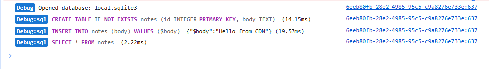

<h1 align="center">web-sqlite-js</h1>

<p align="center">
  <a href="https://web-sqlite-js.wuchuheng.com" target="_blank">
    
  </a>
</p>

<p align="center">
  <a href="https://github.com/wuchuheng/web-sqlite-js/actions/workflows/test.yml" target="_blank">
    
  </a>
  <a href="https://www.npmjs.com/package/web-sqlite-js" target="_blank">
    
  </a>
  <a href="https://github.com/wuchuheng/web-sqlite-js/blob/main/LICENSE" target="_blank">
    
  </a>
  <a href="https://bundlephobia.com/package/web-sqlite-js" target="_blank">
    
  </a>
  <a href="https://github.com/wuchuheng/web-sqlite-js/pulls" target="_blank">
    
  </a>
</p>

`web-sqlite-js` is a friendly, out-of-the-box SQLite database for the web that makes persistent client-side storage simple for every developer.

Designed to be truly effortless, it allows you to get a high-performance relational database running in the browser in seconds. Just install, set your HTTP headers, and start querying—no complex infrastructure required.

## Table of contents

-   [Quick start](#quick-start)
-   [Setup HTTP headers](#setup-http-headers)
-   [Usage](#usage)
-   [Debug mode](#debug-mode)
-   [Transactions](#transactions)

## Features

-   **Persistent Storage**: Uses OPFS for high-performance, persistent file storage.
-   **Non-Blocking**: Runs in a Web Worker, keeping your UI responsive.
-   **Concurrency Safe**: Built-in mutex ensures safe, sequential execution of commands.
-   **Type-Safe**: Written in TypeScript with full type definitions.
-   **Transactions**: Supports atomic transactions with automatic rollback on error.

## Quick start

Pick the path that fits your setup:

#### Option A: npm / bundler

```bash
# npm
npm install web-sqlite-js
```

```typescript
import openDB from "web-sqlite-js";
// ...
```

#### Option B: CDN / script tag (no build step)

For quick demos or plain HTML pages you can load the prebuilt module directly:

```html
<script type="module">
    import openDB from "https://cdn.jsdelivr.net/npm/web-sqlite-js@1.0.6/dist/index.js";
    // ...
</script>
```

See [samples/cdn.html](https://web-sqlite-js.wuchuheng.com/examples/cdn.html) for a copy/paste page you can serve .

> Heads up: `SharedArrayBuffer` requires COOP/COEP headers; see the section below.

## Setup http headers

Pick your stack below to set the headers:

This library depends on `SharedArrayBuffer` for high performance, which requires your server to send the following HTTP headers:

```http
Cross-Origin-Opener-Policy: same-origin
Cross-Origin-Embedder-Policy: require-corp
```

<details>
<summary><strong>Vite</strong></summary>

Update your `vite.config.ts`:

```typescript
import { defineConfig } from "vite";

export default defineConfig({
    server: {
        headers: {
            "Cross-Origin-Opener-Policy": "same-origin",
            "Cross-Origin-Embedder-Policy": "require-corp",
        },
    },
    preview: {
        headers: {
            "Cross-Origin-Opener-Policy": "same-origin",
            "Cross-Origin-Embedder-Policy": "require-corp",
        },
    },
});
```

</details>

<details>
<summary><strong>Next.js</strong></summary>

Update your `next.config.js`:

```javascript
/** @type {import('next').NextConfig} */
const nextConfig = {
    async headers() {
        return [
            {
                source: "/(.*)",
                headers: [
                    {
                        key: "Cross-Origin-Opener-Policy",
                        value: "same-origin",
                    },
                    {
                        key: "Cross-Origin-Embedder-Policy",
                        value: "require-corp",
                    },
                ],
            },
        ];
    },
};

module.exports = nextConfig;
```

</details>

<details>
<summary><strong>Webpack (Dev Server)</strong></summary>

Update your `webpack.config.js`:

```javascript
module.exports = {
    // ...
    devServer: {
        headers: {
            "Cross-Origin-Opener-Policy": "same-origin",
            "Cross-Origin-Embedder-Policy": "require-corp",
        },
    },
};
```

</details>

<details>
<summary><strong>Nginx</strong></summary>

Add the headers to your server block:

```nginx
server {
    # ...
    add_header Cross-Origin-Opener-Policy "same-origin";
    add_header Cross-Origin-Embedder-Policy "require-corp";
    # ...
}
```

</details>

<details>
<summary><strong>Express.js</strong></summary>

Use a middleware:

```javascript
const express = require("express");
const app = express();

app.use((req, res, next) => {
    res.setHeader("Cross-Origin-Opener-Policy", "same-origin");
    res.setHeader("Cross-Origin-Embedder-Policy", "require-corp");
    next();
});

// ...
```

</details>

<details>
<summary><strong>React / Vue (Create React App / Vue CLI)</strong></summary>

Most modern React/Vue setups use **Vite**. Please refer to the **Vite** section above.

If you are using an older webpack-based setup (like CRA `react-scripts`), you technically need to configure the underlying `webpack-dev-server`, but CRA doesn't expose this easily without ejecting or using tools like `craco` or `react-app-rewired` to modify the dev server configuration as shown in the **Webpack** section.

</details>

## Usage

#### Basic Usage

```typescript
// 1. Open the database (creates 'my-database.sqlite3' in OPFS)
const db = await openDB("local.sqlite3");

// 2. Initialize schema
await db.exec(`
  CREATE TABLE IF NOT EXISTS users (
    id INTEGER PRIMARY KEY AUTOINCREMENT,
    name TEXT,
    email TEXT
  );
`);

// 3. Insert data (Parameterized)
await db.exec("INSERT INTO users (name, email) VALUES (?, ?)", [
    "Alice",
    "alice@example.com",
]);
await db.exec("INSERT INTO users (name, email) VALUES ($name, $email)", {
    $name: "Bob",
    $email: "bob@example.com",
});

// 4. Query data

const users = await db.query("SELECT * FROM users");
console.log(users);
// Output: [{ id: 1, name: 'Alice', ... }, { id: 2, name: 'Bob', ... }]

// 5. Close when done
await db.close();
```

## Debug mode

Add `{ debug: true }` when opening the database to stream worker-side SQL logs (including bind values and timings) to your browser's `console.debug`. This is useful for profiling and verifying queries during development.

```typescript
const db = await openDB("local.sqlite3", { debug: true });

await db.exec("CREATE TABLE IF NOT EXISTS notes (body TEXT)");
await db.query("SELECT * FROM notes WHERE id = ?", [1]);
```

The console output highlights SQL keywords and shows how long each statement took (click to preview):

[](docs/assets/debug.png)

#### Transactions

Transactions are atomic. If any command inside the callback fails, the entire transaction is rolled back.

```typescript
await db.transaction(async (tx) => {
    await tx.exec("INSERT INTO users (name) VALUES (?)", ["Charlie"]);

    // You can perform multiple operations safely
    await tx.exec("INSERT INTO logs (action) VALUES (?)", ["User Created"]);

    // If you throw an error here, both INSERTs will be rolled back!
    // throw new Error('Something went wrong');
});
```

## Star History

<p align="left">
    
</p>
