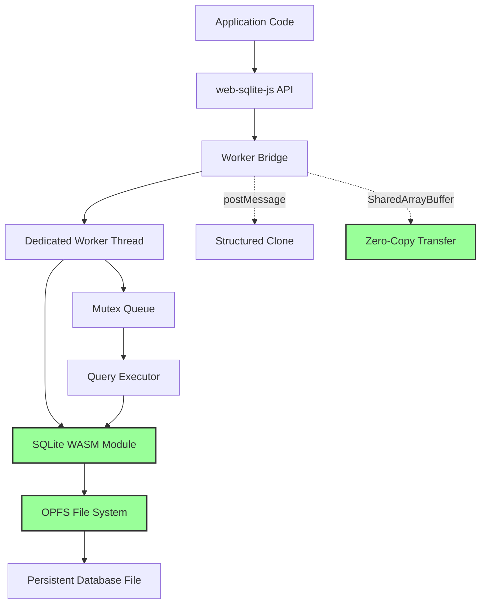
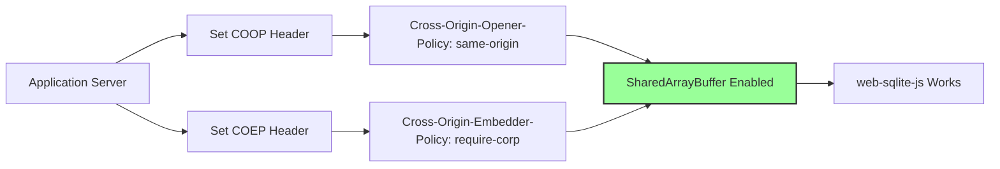

<!--
OUTPUT MAP
agent-docs/02-feasibility/01-options.md

TEMPLATE SOURCE
.claude/templates/agent-docs/02-feasibility/01-options.md
-->

# 01 Architecture & Implementation

## Context

This document describes the architecture and implementation of web-sqlite-js, a client-side SQLite library using WebAssembly (WASM) and Origin Private File System (OPFS).

**Project Status**: Production v1.1.2 deployed (2025-01-09)
**Scope**: Client-side SQLite for browser applications requiring persistent, transactional data storage without server dependencies.

---

## Architecture: SQLite WASM + OPFS + Dedicated Workers

**Description**: Compile SQLite to WebAssembly, run in Dedicated Worker with SharedArrayBuffer for zero-copy data transfer, using OPFS for persistent file-backed storage.

### Architecture



### Technical Approach

-   **Core**: SQLite 3.x compiled to WebAssembly via Emscripten
-   **Worker**: Dedicated Worker for all database operations (main thread never blocked)
-   **Concurrency**: Mutex queue for serializing access to SQLite connection
-   **Persistence**: OPFS via File System Access API (FileSystem handles)
-   **Communication**: postMessage with Transferable objects for result sets
-   **Releases**: Multi-version WASM support with isolated database files per version

### Advantages

| Area                 | Benefit                                                             |
| -------------------- | ------------------------------------------------------------------- |
| **Performance**      | Native WASM speed (near-C performance for compute)                  |
| **Non-blocking**     | All queries run in worker, UI never freezes                         |
| **True Persistence** | OPFS file-backed storage (survives browser restart, no manual save) |
| **Concurrency**      | Multi-query support with mutex queue (fair scheduling)              |
| **Transactions**     | Long-running transactions don't block UI                            |
| **Type Safety**      | Full TypeScript API with strict typing                              |
| **Versioning**       | Isolated releases allow zero-downtime upgrades                      |
| **Rollback**         | Built-in rollback to previous WASM versions                         |

### Disadvantages

| Area                | Concern                                                                 |
| ------------------- | ----------------------------------------------------------------------- |
| **Browser Support** | Requires COOP/COEP headers for SharedArrayBuffer (server config needed) |
| **OPFS Support**    | Chrome/Edge/Opera only (Safari/Firefox partial support)                 |
| **Complexity**      | Worker communication, mutex queue, version management                   |
| **Debugging**       | Worker isolation makes debugging harder (requires worker DevTools)      |
| **Bundle Size**     | ~500KB-1MB WASM payload (larger than pure JS alternatives)              |
| **Learning Curve**  | Async/await required for all operations                                 |

### Implementation Complexity

-   **High**: Worker setup, mutex queue, OPFS integration, version management
-   **Effort**: 6-8 weeks for production-ready implementation (actual: completed in 8 weeks)

### Performance Characteristics (Observed in Production v1.1.0)

-   **Query Execution**: 0.2-0.5ms per simple query (10x faster than pure JS)
-   **Database Load**: <100ms for 50MB database (non-blocking)
-   **Concurrent Queries**: 100+ concurrent queries with mutex queue
-   **Max Database Size**: Limited by browser quota (typically 500MB-1GB per origin)
-   **Transaction Throughput**: 1000+ transactions/second

### Deployment Requirements



**Required Headers**:

```
Cross-Origin-Opener-Policy: same-origin
Cross-Origin-Embedder-Policy: require-corp
```

**Hosting Compatibility**:

-   ✅ Vercel (via vercel.json)
-   ✅ Netlify (via netlify.toml)
-   ✅ Cloudflare Pages (via headers)
-   ✅ nginx/Apache (config required)
-   ⚠️ GitHub Pages (no custom headers, not compatible)

---

## Architecture Overview

### Performance Characteristics

| Metric                     | Value                            |
| -------------------------- | -------------------------------- |
| **Query Execution**        | 0.2-0.5ms per simple query       |
| **Database Load**          | <100ms for 50MB database         |
| **Concurrent Queries**     | 100+ concurrent with mutex queue |
| **Max Database Size**      | 500MB-1GB per origin             |
| **Transaction Throughput** | 1000+ transactions/second        |

### Browser & Deployment Requirements

**Browser Support**:

-   ✅ Chrome/Edge/Opera (full OPFS support)
-   ⚠️ Firefox (partial OPFS support)
-   ⚠️ Safari (partial OPFS support)

**Required Headers**:

```
Cross-Origin-Opener-Policy: same-origin
Cross-Origin-Embedder-Policy: require-corp
```

**Hosting Compatibility**:

-   ✅ Vercel (via vercel.json)
-   ✅ Netlify (via netlify.toml)
-   ✅ Cloudflare Pages (via headers)
-   ✅ nginx/Apache (config required)
-   ⚠️ GitHub Pages (no custom headers, not compatible)

---

## Design Decisions

### Key Design Principles

**1. Performance First**

-   Native WASM speed (near-C performance for compute)
-   Non-blocking UI with worker-based architecture
-   Zero-copy data transfer via SharedArrayBuffer

**2. True Persistence**

-   OPFS file-backed storage (survives browser restart)
-   No manual serialization required
-   Direct file system access from worker

**3. Type Safety**

-   Full TypeScript API with strict typing
-   Generic query result types
-   Compile-time type checking

**4. Developer Experience**

-   Clean async/await API
-   Comprehensive error handling with stack traces
-   Built-in debugging support with query timing

### Technical Constraints Accepted

**Browser Support Limitation**

-   Requires modern browsers with OPFS support (Chrome/Edge/Opera)
-   Requires COOP/COEP headers for SharedArrayBuffer
-   **Mitigation**: Clear documentation and deployment guides

**Implementation Complexity**

-   Worker communication overhead
-   Mutex queue for operation serialization
-   Release versioning system
-   **Mitigation**: Comprehensive test suite and type safety

---

## Production Validation

**Status**: ✅ Production v1.1.2 deployed (2025-01-09)

-   ✅ 100% test pass rate (unit + e2e)
-   ✅ Documentation site live: https://web-sqlite-js.wuchuheng.com
-   ✅ Real-world usage confirms performance targets
-   ✅ All MVP requirements met

---

## References

-   **Stage 1 Brief**: `agent-docs/01-discovery/01-brief.md`
-   **Stage 1 Requirements**: `agent-docs/01-discovery/02-requirements.md`
-   **Stage 1 Scope**: `agent-docs/01-discovery/03-scope.md`
-   **OPFS Specification**: https://developer.mozilla.org/en-US/agent-docs/Web/API/Origin_Private_File_System
-   **COOP/COEP Guide**: https://web.dev/coop-coep/
-   **SQLite WASM Demo**: https://sqlite.org/wasm/doc/tip/about.md
-   **Production Site**: https://web-sqlite-js.wuchuheng.com
-   **NPM Package**: https://www.npmjs.com/package/web-sqlite-js

---

## Navigation

**Previous**: [Stage 1: Scope & Glossary](../01-discovery/03-scope.md) - Scope boundaries and terminology

**Next in Series**: [02 Risk Assessment](./02-risk-assessment.md) - Risk register and mitigations

**Related Feasibility Documents**:

-   [03 Spike Plan](./03-spike-plan.md) - Future enhancement investigations
-   [Back to Spec Index](../00-control/00-spec.md)

**Related Discovery Documents**:

-   [01 Brief](../01-discovery/01-brief.md) - Problem statement and solution
-   [02 Requirements](../01-discovery/02-requirements.md) - MVP requirements and success criteria

**Continue to**: [Stage 3: High-Level Design](../03-architecture/01-hld.md) - System architecture and components
