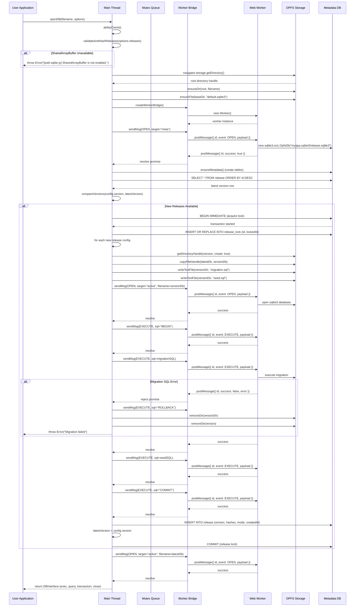
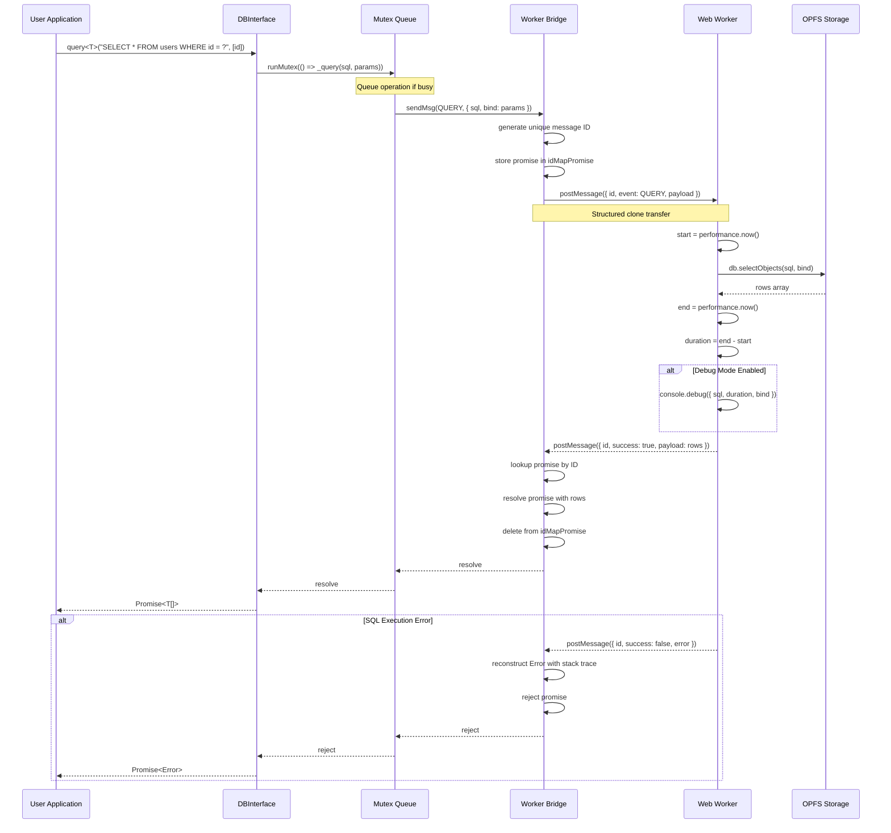
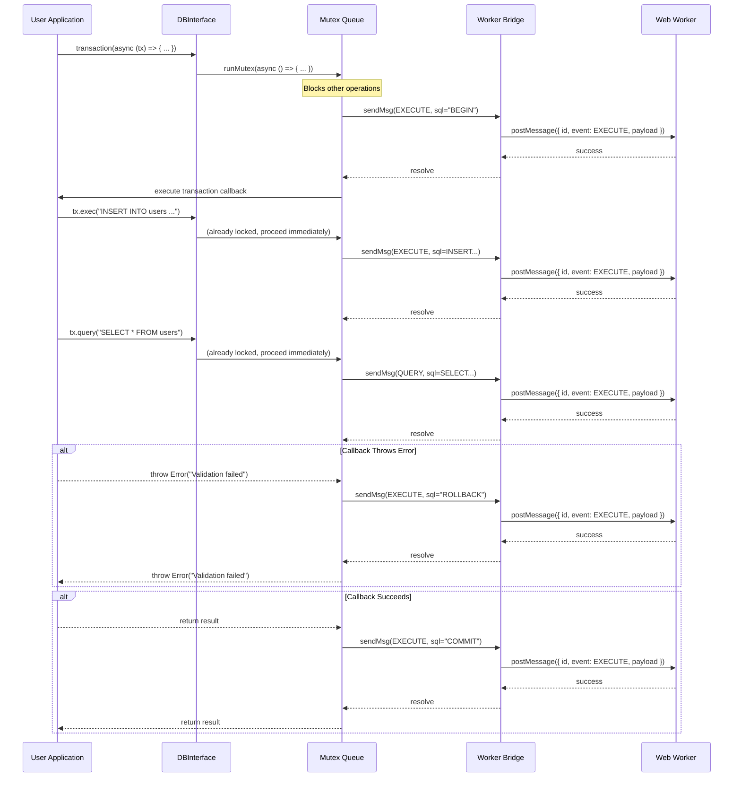
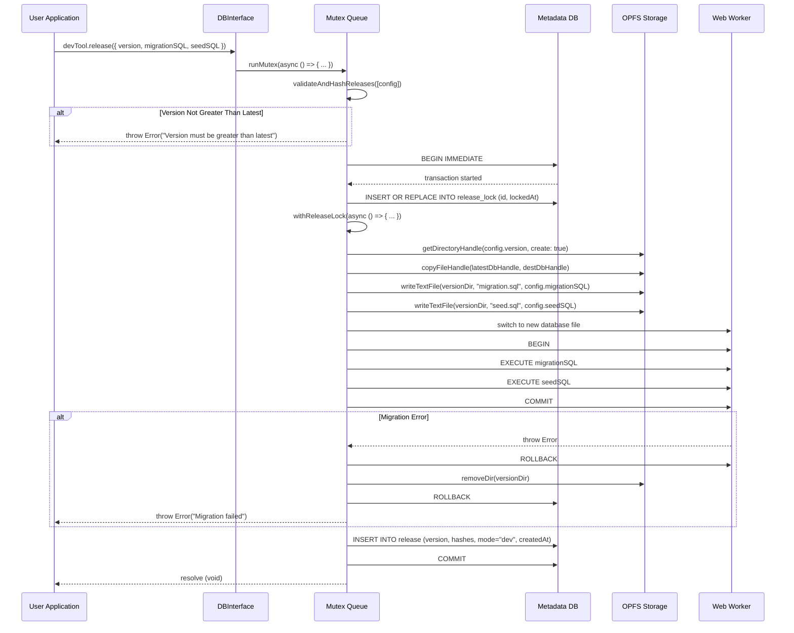
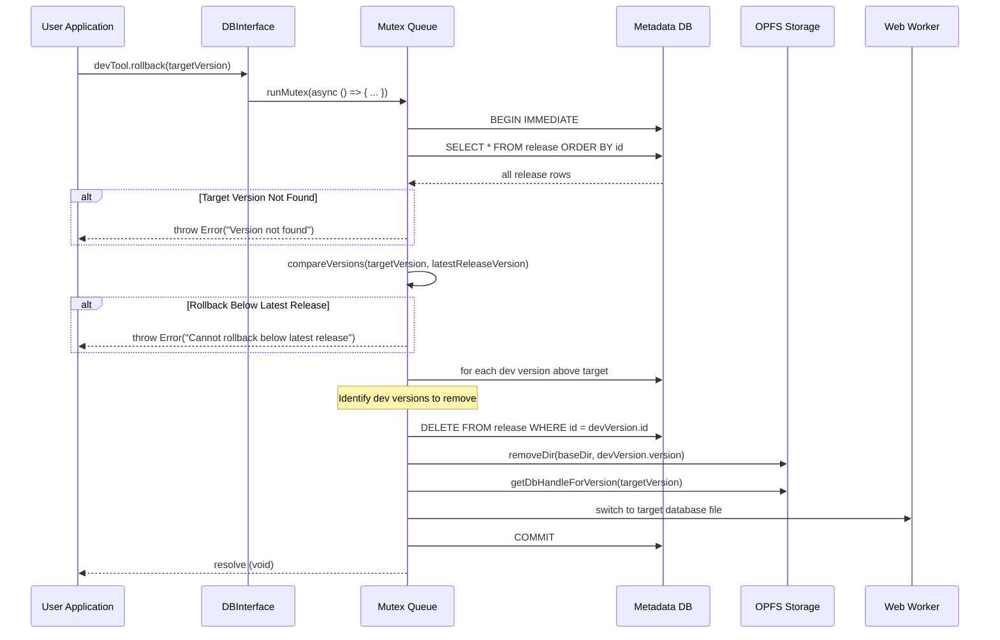
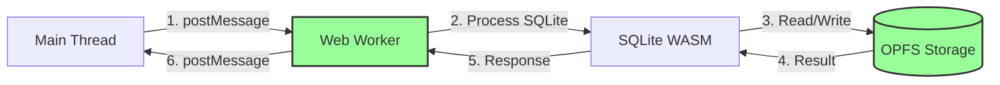
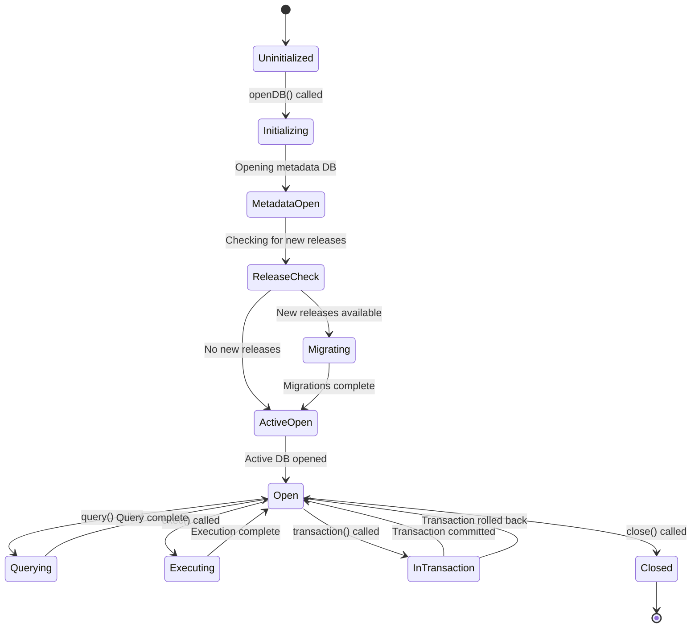
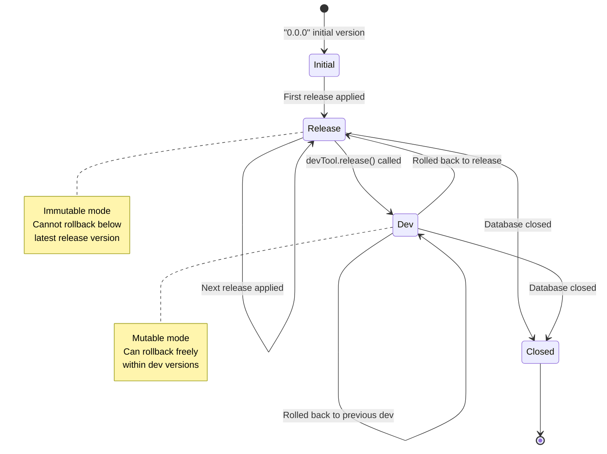
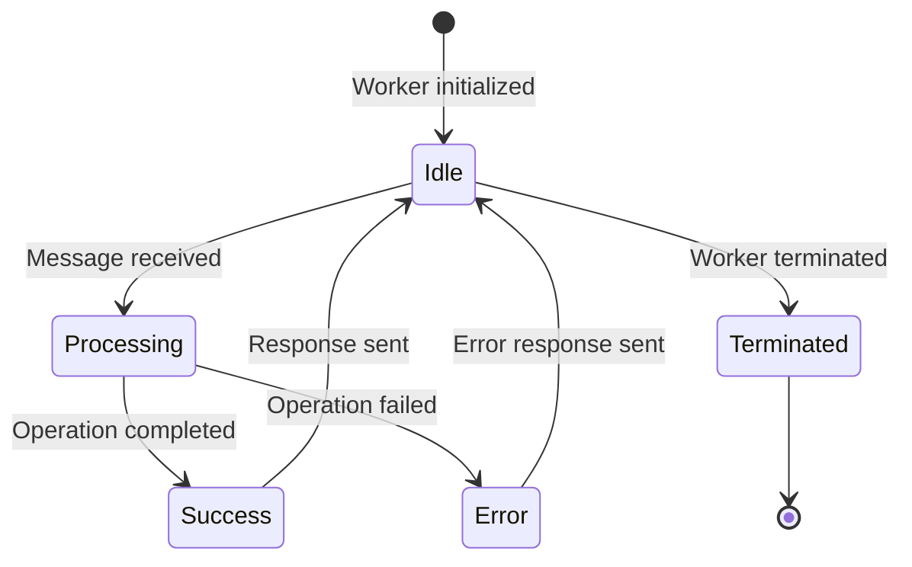
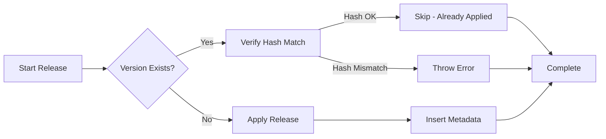

<!--
OUTPUT MAP
docs/03-architecture/02-dataflow.md

TEMPLATE SOURCE
.claude/templates/docs/03-architecture/02-dataflow.md
-->

# 02 Data Flow & Sequences

## 1) Critical Business Flows

### Flow 1: Database Initialization with Release Versioning (Happy Path + Error)

**Goal**: Open a database connection and apply any pending release migrations
**Concurrency**: Metadata lock ensures only one migration process at a time

**Error Handling**:

-   **SharedArrayBuffer Unavailable**: Throws immediately with clear error message
-   **Hash Mismatch**: Throws if archived release hash doesn't match config
-   **Migration Failure**: Automatic ROLLBACK, removes incomplete version directory, propagates error
-   **Lock Conflict**: Throws "Release operation already in progress" if concurrent migration attempt
-   **OPFS Errors**: Propagates as rejected promises with descriptive error messages

### Flow 2: SQL Query Execution

**Goal**: Execute a SELECT query and return results
**Concurrency**: Mutex ensures only one operation at a time

**Performance Characteristics**:

-   **Query Timing**: 0.2-0.5ms per simple query (measured via `performance.now()`)
-   **Mutex Overhead**: ~0.01ms for queue management
-   **Worker Communication**: ~0.05ms for postMessage round-trip
-   **Total Latency**: ~0.3-0.6ms from application call to result

### Flow 3: Transaction Execution

**Goal**: Execute multiple operations atomically
**Concurrency**: Mutex ensures transaction runs sequentially

**Transaction Guarantees**:

-   **Atomicity**: All operations succeed or all fail (BEGIN/COMMIT/ROLLBACK)
-   **Isolation**: Mutex ensures no concurrent transactions
-   **Consistency**: SQL constraints enforced by SQLite
-   **Durability**: OPFS persists changes immediately

### Flow 4: Dev Tool Release Creation

**Goal**: Create a new dev version for testing
**Concurrency**: Metadata lock prevents concurrent release operations

### Flow 5: Dev Tool Rollback

**Goal**: Roll back to a previous version
**Concurrency**: Metadata lock prevents concurrent rollback operations

## 2) Asynchronous Event Flows

**Pattern**: Message-passing via postMessage (not event-driven in traditional sense)

**Event Types**: Worker Message Protocol

-   **OPEN**: Initialize database connection (active or metadata)
-   **EXECUTE**: Run SQL without returning rows (INSERT, UPDATE, DELETE, DDL)
-   **QUERY**: Run SELECT query and return rows
-   **CLOSE**: Close database connections and cleanup

**Message Flow Pattern**:

**Request-Response Correlation**:

-   Each request gets unique incremental ID
-   `idMapPromise` in worker bridge maps IDs to pending promises
-   Worker responses include same ID for promise resolution
-   Timeout protection: promises reject if worker terminates

**No Event Streaming**: Current implementation uses request/response pattern

-   **Future Enhancement**: Query result streaming (Backlog B2) would introduce event-based row streaming

## 3) Entity State Machines

### Entity: Database Connection Lifecycle

### Entity: Release Version State

### Entity: Worker Message State

## 4) Consistency & Recovery

### Distributed Transactions

**No Distributed Transactions**: Single-worker architecture eliminates need for distributed transaction coordination

-   **Single Writer**: Mutex ensures only one SQLite operation at a time
-   **ACID Guarantees**: SQLite transactions provide atomicity, consistency, isolation, durability
-   **No Two-Phase Commit**: All operations within single worker context

### Idempotency

**Operation Idempotency**:

-   **EXECUTE**: Not idempotent by default (e.g., INSERT creates new rows)
-   **QUERY**: Idempotent (read-only, no state change)
-   **CLOSE**: Not idempotent; subsequent close fails with "Database is not open"
-   **devTool.release**: Not idempotent; throws if version is <= latest
-   **devTool.rollback**: Idempotent (safe to rollback to same version)

**Release Application Idempotency**:

### Compensation

**Migration Failure Compensation**:

1. **Detect Error**: Migration SQL throws exception
2. **Automatic ROLLBACK**: Database state restored to pre-migration
3. **Cleanup**: Remove incomplete version directory from OPFS
4. **Metadata Cleanup**: Remove release row from metadata database
5. **Error Propagation**: Reject promise with original error
6. **State Restoration**: Revert to previous version as active database

**Transaction Failure Compensation**:

1. **Detect Error**: Transaction callback throws exception
2. **Automatic ROLLBACK**: Execute ROLLBACK SQL
3. **Error Propagation**: Reject promise with original error
4. **No Cleanup Needed**: Database state already restored by ROLLBACK

**Release Rollback Compensation**:

1. **Identify Dev Versions**: Find all dev versions above target
2. **Remove Metadata**: DELETE FROM release WHERE id = devVersion.id
3. **Remove Files**: removeDir(baseDir, devVersion.version)
4. **Switch Active DB**: Open target version database
5. **Final State**: System at target version with intermediate versions removed

**No Compensation Needed For**:

-   **Query Failures**: Read-only, no state change
-   **Worker Termination**: All pending promises rejected, no in-flight transactions
-   **OPFS Errors**: Errors propagated immediately, no partial state to restore

### Recovery Scenarios

**Scenario 1: Page Refresh During Migration**

-   **Detection**: Metadata lock not released
-   **Recovery**: Next openDB() call waits for lock timeout or manually clears lock
-   **State**: Incomplete version directory may exist
-   **Cleanup**: Next openDB() validates version consistency, removes incomplete versions

**Scenario 2: Worker Crash**

-   **Detection**: Worker.onmessage not called, pending promises timeout
-   **Recovery**: All pending operations rejected with "Worker terminated" error
-   **State**: OPFS files may be in inconsistent state if crash during write
-   **Cleanup**: Transaction rollback ensures database consistency
-   **Next Operation**: openDB() call reinitializes worker, validates metadata

**Scenario 3: OPFS Quota Exceeded**

-   **Detection**: OPFS write throws QuotaExceededError
-   **Recovery**: Error propagated to application
-   **State**: Partial files may exist in version directory
-   **Cleanup**: Application must handle error (e.g., delete old versions, clear data)
-   **Prevention**: Library provides no automatic quota management

**Scenario 4: Hash Mismatch on Archived Release**

-   **Detection**: Release config hash != metadata hash
-   **Recovery**: Throws error immediately, no recovery
-   **State**: Database remains at previous version
-   **Resolution**: Developer must fix release config or manually reset database
-   **Prevention**: Immutable release configs prevent accidental changes

---

## Navigation

**Previous**: [01 High-Level Design](./01-hld.md) - System architecture and components

**Next in Series**: [03 Deployment](./03-deployment.md) - Deployment and infrastructure

**Related Architecture Documents**:

-   [Back to Architecture: 01 HLD](./01-hld.md)
-   [Back to Spec Index](../00-control/00-spec.md)

**Related Design Documents**:

-   [01 API Contracts](../05-design/01-contracts/01-api.md) - API specifications with sequence diagrams

**Continue to**: [Stage 4: ADR Index](../04-adr/) - Architecture decision records
