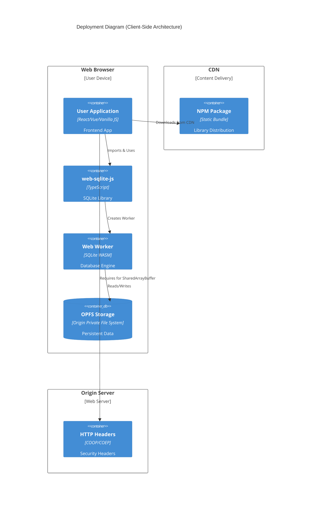
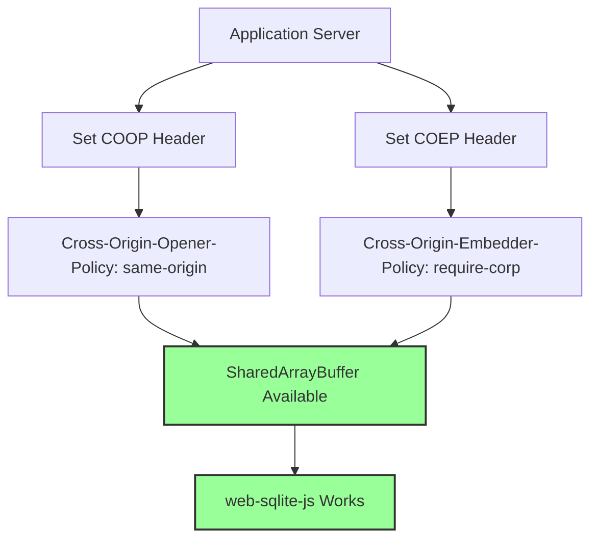
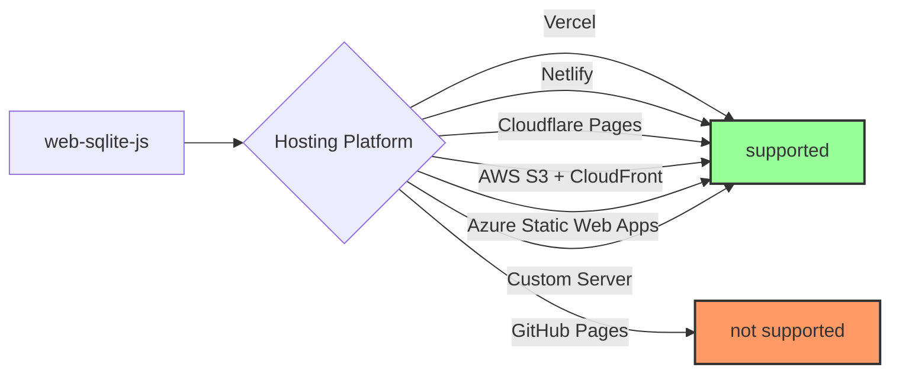

<!--
OUTPUT MAP
docs/03-architecture/03-deployment.md

TEMPLATE SOURCE
.claude/templates/docs/03-architecture/03-deployment.md
-->

# 03 Deployment & Infrastructure

## 1) Deployment Topology (Prod)

- **Cloud/Region**: Client-side deployment (no server infrastructure required)
- **Strategy**: Static library distribution via npm, bundled into user applications



**Deployment Architecture Notes**:

- **No Server-Side Components**: Library runs entirely in browser, no backend required
- **CDN Distribution**: NPM package hosted on registry, bundled by user applications
- **Static Hosting**: User applications can be hosted on any static hosting provider
- **Header Requirements**: Origin server must set COOP/COEP headers for SharedArrayBuffer

## 2) Environment Strategy

| Feature            | Dev                                | Staging                       | Prod                         |
| ------------------ | ---------------------------------- | ----------------------------- | ---------------------------- |
| **Data**           | In-memory or local OPFS            | Isolated OPFS per environment | User's browser OPFS          |
| **Infrastructure** | Local dev server (Vite)            | Preview deployments           | Production CDN               |
| **Headers**        | Vite dev server configured         | Preview server configured     | Production server configured |
| **Build**          | Development build with source maps | Production build minified     | Production build minified    |
| **Debug Mode**     | Enabled by default                 | Disabled by default           | Disabled by default          |
| **Logging**        | console.debug enabled              | console.debug disabled        | console.debug disabled       |

**Environment Differences**:

- **Development**: Hot module reload, detailed error messages, debug logging
- **Staging**: Production-like build, test data, preview deployments
- **Production**: Optimized bundle, no debug logging, real user data

**Build Targets**:

```text
/dist
  index.js              # Main library bundle (includes all code)
  index.d.ts            # TypeScript declarations
  package.json          # NPM package metadata
```

## 3) Capacity & Scaling

- **Expected Load**: Single-user per browser instance (no multi-user server load)
- **Compute Scaling**: Client-side scaling via user's browser resources
- **Database Sizing**:
    - **Default OPFS Quota**: ~500MB-1GB per origin (browser-dependent)
    - **Max Database Size**: Limited by OPFS quota, not library constraints
    - **Typical Database Size**: 10-100MB for most applications
- **Cache Strategy**: No external cache, all data in OPFS
- **Performance Benchmarks**:
    - **Query Execution**: 0.2-0.5ms per simple query
    - **Transaction Throughput**: 1000+ transactions/second
    - **Concurrent Operations**: 100+ concurrent queries via mutex queue
    - **Database Load Time**: <100ms for 50MB database

**Scaling Characteristics**:

- **Horizontal Scaling**: Not applicable (client-side library)
- **Vertical Scaling**: Limited by user's device (CPU, memory, disk)
- **Multi-Tab**: Each tab has isolated OPFS storage, no shared state
- **Multi-Window**: Each window has isolated worker and database connection

**Resource Limits**:

```text
Browser Limits (Typical):
  OPFS Quota:           500MB - 1GB per origin
  Worker Memory:        512MB - 2GB (browser-dependent)
  WASM Memory:          256MB - 1GB (configurable)
  Concurrent Workers:   20-50 (browser-dependent)

Library Limits:
  Max Database Size:    Limited by OPFS quota
  Max Connections:      1 per openDB() call (single worker)
  Query Timeout:        None (user can implement)
  Transaction Timeout:  None (SQLite handles)
```

## 4) Disaster Recovery (DR)

- **RPO (Data Loss)**: 0 minutes (OPFS writes are synchronous)
- **RTO (Downtime)**: Immediate recovery (no server downtime)
- **Recovery Mechanism**: Release versioning system with rollback support

**Recovery Strategy**:

The library provides built-in recovery through the release versioning system:

```typescript
// Rollback to previous version if issues occur
await db.devTool.rollback("1.0.0");
```

**Disaster Scenarios**:

1. **Schema Migration Failure**: New release schema breaks compatibility
    - **Recovery**: Use `devTool.rollback()` to revert to previous working version
    - **Prevention**: Immutable release configs, SHA-256 hash validation

2. **Browser Update Breaking Changes**: Future browser updates restrict OPFS/SharedArrayBuffer
    - **Recovery**: No built-in recovery (browser limitation)
    - **Prevention**: Monitor browser changelogs, test in beta browsers

3. **OPFS Data Corruption**: Browser bugs or quota issues
    - **Recovery**: No built-in recovery (data loss)
    - **Prevention**: Transactional writes, proper error handling

## 5) Network & Security

### Ingress (Browser to Library)

- **No Ingress**: Library is client-side, no external network requests
- **Bundle Loading**: Library loaded via CDN or bundled with application
- **Worker Loading**: Worker code loaded from same origin as application

### Egress (Library to External)

- **No Egress**: Library makes no external network requests
- **OPFS Access**: Same-origin policy restricts access to origin's OPFS
- **Worker Communication**: Same-origin worker only

### Security Architecture

**Cross-Origin Isolation**:



**Required HTTP Headers**:

```http
Cross-Origin-Opener-Policy: same-origin
Cross-Origin-Embedder-Policy: require-corp
```

**Header Configuration Examples**:

```javascript
// Vite (vite.config.ts)
export default {
  server: {
    headers: {
      'Cross-Origin-Opener-Policy': 'same-origin',
      'Cross-Origin-Embedder-Policy': 'require-corp',
    },
  },
};

// Next.js (next.config.js)
module.exports = {
  async headers() {
    return [
      {
        source: '/:path*',
        headers: [
          {
            key: 'Cross-Origin-Opener-Policy',
            value: 'same-origin',
          },
          {
            key: 'Cross-Origin-Embedder-Policy',
            value: 'require-corp',
          },
        ],
      },
    ];
  },
};

// nginx
location / {
  add_header Cross-Origin-Opener-Policy "same-origin" always;
  add_header Cross-Origin-Embedder-Policy "require-corp" always;
}
```

**Security Guarantees**:

- **Same-Origin Isolation**: OPFS restricts access to same origin only
- **No Cross-Origin Data Sharing**: Database files cannot be shared across origins
- **WASM Sandbox**: SQLite runs in WebAssembly sandbox
- **Worker Isolation**: Database operations isolated in worker context
- **SQL Injection Protection**: Parameterized queries recommended, user responsibility

**Security Risks** (User Responsibility):

- **SQL Injection**: Poorly constructed queries can introduce vulnerabilities
    - **Mitigation**: Always use parameterized queries: `db.query("SELECT * WHERE id = ?", [id])`
- **XSS via Stored Data**: If user data is stored without sanitization and later rendered
    - **Mitigation**: Sanitize data before rendering, not before storing
- **OPFS Access**: Malicious scripts can access database files
    - **Mitigation**: Same-origin protection, no cross-origin access

**Secrets Management**:

- **No Secrets**: Library requires no API keys, tokens, or secrets
- **User Application Secrets**: Stored in user application, not in web-sqlite-js
- **Database Encryption**: Not supported (future enhancement: SQLCipher integration)

### Hosting Platform Compatibility

**Supported Platforms** (COOP/COEP Headers Available):



**Platform Configuration**:

- **Vercel**: `vercel.json` configuration

    ```json
    {
        "headers": [
            {
                "source": "/(.*)",
                "headers": [
                    {
                        "key": "Cross-Origin-Opener-Policy",
                        "value": "same-origin"
                    },
                    {
                        "key": "Cross-Origin-Embedder-Policy",
                        "value": "require-corp"
                    }
                ]
            }
        ]
    }
    ```

- **Netlify**: `netlify.toml` configuration

    ```toml
    [[headers]]
      for = "/*"
      [headers.values]
        Cross-Origin-Opener-Policy = "same-origin"
        Cross-Origin-Embedder-Policy = "require-corp"
    ```

- **Cloudflare Pages**: `_headers` file
    ```
    /*
      Cross-Origin-Opener-Policy: same-origin
      Cross-Origin-Embedder-Policy: require-corp
    ```

**Unsupported Platforms**:

- **GitHub Pages**: Does not support custom headers
    - **Workaround**: Use proxy service or different hosting

**Browser Support**:

- **Chrome/Edge/Opera**: Full support (OPFS + SharedArrayBuffer)
- **Firefox**: Partial support (OPFS in development, SharedArrayBuffer requires headers)
- **Safari**: Limited support (OPFS in development, SharedArrayBuffer requires headers)
- **Mobile Browsers**: Varies by browser and OS version

**Feature Detection**:

```typescript
// Library checks SharedArrayBuffer availability
const abilityCheck = () => {
    try {
        new SharedArrayBuffer();
    } catch {
        throw new Error("[web-sqlite-js] SharedArrayBuffer is not enabled.");
    }
};
```

### Performance Optimization

**Bundle Optimization**:

- **WASM Size**: ~500KB minified (SQLite WASM module)
- **JavaScript Bundle**: ~50KB minified (library code)
- **Total Bundle Size**: ~550KB (acceptable for performance gain)
- **Tree Shaking**: No external dependencies, minimal overhead

**Runtime Optimization**:

- **Worker Pool**: Not implemented (single worker per database)
- **Connection Pooling**: Not implemented (single connection per database)
- **Query Caching**: Not implemented (future enhancement)
- **Prepared Statements**: Not implemented (future enhancement, Backlog B1)

**Loading Optimization**:

- **Lazy Loading**: Worker created on first `openDB()` call
- **WASM Initialization**: SQLite WASM loaded on first open
- **OPFS Access**: Directory handles cached after first access

### Monitoring & Observability

**Debug Mode**:

```typescript
const db = await openDB("my-database", {
    debug: true, // Enables SQL execution logging
});
```

**Debug Output**:

```javascript
console.debug({
    sql: "SELECT * FROM users WHERE id = ?",
    duration: 0.35, // milliseconds
    bind: [123],
});
```

**Performance Monitoring** (User Responsibility):

- **Query Timing**: Debug mode provides timing information
- **Memory Usage**: User can monitor via browser DevTools
- **OPFS Usage**: User can monitor via `navigator.storage.estimate()`
- **Worker Health**: User can monitor via worker error handlers

**Error Tracking** (User Responsibility):

- **Integration**: User integrates with Sentry, Rollbar, etc.
- **Error Propagation**: All errors propagated to main thread with stack traces
- **Worker Errors**: Worker errors caught and propagated to main thread

### Deployment Checklist

**Pre-Deployment**:

- [ ] Verify COOP/COEP headers configured on origin server
- [ ] Test SharedArrayBuffer availability in target browser
- [ ] Validate release configs and hashes
- [ ] Test database initialization and queries
- [ ] Test transaction rollback scenarios
- [ ] Test release versioning flow
- [ ] Test dev tooling (release/rollback)

**Post-Deployment**:

- [ ] Monitor browser console for errors
- [ ] Verify database operations execute successfully
- [ ] Test persistence across page reloads
- [ ] Verify OPFS storage usage within quota
- [ ] Monitor query performance in debug mode
- [ ] Test backup/restore procedures (if implemented)

**Troubleshooting**:

- **SharedArrayBuffer Unavailable**: Check COOP/COEP headers
- **OPFS Not Available**: Check browser compatibility
- **Database Fails to Open**: Check console for specific error
- **Migration Failures**: Verify SQL syntax and constraints
- **Performance Issues**: Enable debug mode, check query timing

---

## Navigation

**Previous**: [02 Data Flow](./02-dataflow.md) - Data flow and sequence diagrams

**Architecture Series Complete**

**Related Architecture Documents**:

- [Back to Architecture: 01 HLD](./01-hld.md)
- [Back to Architecture: 02 Data Flow](./02-dataflow.md)
- [Back to Spec Index](../00-control/00-spec.md)

**Related ADRs**:

- [ADR-0005: COOP/COEP Requirement](../04-adr/0005-coop-coep-requirement.md) - Header configuration

**Continue to**: [Stage 4: ADR Index](../04-adr/) - Architecture decision records
