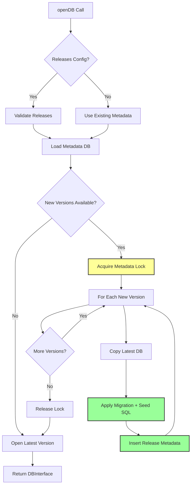

<!--
OUTPUT MAP
agent-docs/04-adr/0004-release-versioning-system.md

TEMPLATE SOURCE
.claude/templates/agent-docs/04-adr/0000-template.md
-->

# ADR-0004: Release Versioning System for Database Migrations

## Status

Accepted

## Context

-   **What is the issue?**

    -   Database schemas evolve over time (new tables, columns, indexes)
    -   Applications need to upgrade user databases without data loss
    -   Developers need a way to test migrations before deploying
    -   Production databases may need rollback capability if migrations fail

-   **What are the constraints?**

    -   OPFS storage is isolated and cannot use server-side migration tools
    -   Migrations must be reversible (or at least rollbackable)
    -   Must support both production releases and dev/testing versions
    -   SQLite doesn't have built-in schema versioning
    -   Migrations must be atomic (all-or-nothing)

-   **Why do we need to decide now?**
    -   Schema migration is critical for application evolution
    -   Changing migration system later would require data migration
    -   Affects OPFS directory structure and metadata database design
    -   Dev tooling depends on migration system architecture

## Decision

We will implement a **release versioning system** with OPFS-based version isolation and metadata tracking.

**Versioning Architecture**: Linear version history with isolated database snapshots



**Key Implementation Details**:

-   **Immutable Releases**: Production releases defined in `openDB()` config, cannot be modified
-   **Dev Versions**: Mutable versions created via `devTool.release()` for testing
-   **Metadata Database**: `release.sqlite3` tracks all versions with hashes
-   **Version Isolation**: Each version has separate OPFS directory with database file
-   **Atomic Migrations**: Migration and seed SQL execute in single transaction
-   **Rollback Support**: `devTool.rollback()` removes dev versions and reverts database
-   **Hash Validation**: SHA-256 hashes ensure release integrity

## Alternatives Considered

### Option 1: No Versioning System (Rejected)

Let developers handle migrations manually with raw SQL.

-   **Pros**:

    -   Simplest implementation (no versioning logic)
    -   Maximum flexibility for developers
    -   No metadata overhead

-   **Cons**:
    -   **Data Loss Risk**: Manual migrations are error-prone
    -   **No Rollback**: Cannot undo failed migrations
    -   **Developer Burden**: Every app must implement migration system
    -   **Schema Drift**: Different users may have different schema versions
    -   **Testing Difficulty**: No way to test migrations before deployment
    -   **Out of Scope**: Requirements R11-R20 specify versioning system

**Evidence**: Requirements explicitly state: "R11: Accept an immutable `releases` configuration array defining schema history"

### Option 2: SQL Migration Files Only (Rejected)

Store migration SQL files but no metadata or version tracking.

-   **Pros**:

    -   Simpler than full versioning system
    -   SQL files are human-readable
    -   Can be version controlled

-   **Cons**:
    -   **No Applied Tracking**: Don't know which migrations ran
    -   **No Hash Validation**: Can't detect modified migration SQL
    -   **No Atomicity**: Migrations may partially apply
    -   **No Rollback**: Cannot revert to previous version
    -   **Ordering Issues**: Must manually ensure correct migration order

**Evidence**: Requirements R13: "Compute SHA-256 hashes for migration and seed SQL" and R18: "Validate release configs match archived versions (hash check)"

### Option 3: Pruning Old Versions (Rejected)

Automatically delete old version directories to save OPFS space.

-   **Pros**:

    -   Reduced OPFS storage usage
    -   Cleaner directory structure
    -   Faster metadata queries

-   **Cons**:
    -   **No Rollback**: Cannot rollback to old versions
    -   **Data Loss**: Old database snapshots lost
    -   **Debugging Difficulty**: Cannot inspect old schema versions
    -   **Violates Spec**: Requirements state "Always keep historical DBs (no pruning)"
    -   **User Control**: Users should control cleanup, not library

**Evidence**: Spec `specs/RELEASES.md` explicitly states: "Always keep historical DBs (no pruning)."

### Option 4: Parallel Release Streams (Rejected)

Support multiple release branches (e.g., stable, beta, dev).

-   **Pros**:

    -   Support for parallel development
    -   A/B testing of different schema versions
    -   Beta testing before stable release

-   **Cons**:
    -   **Complexity**: Requires tracking multiple active versions
    -   **OPFS Usage**: Multiple active databases consume more space
    -   **API Complexity**: User must specify which stream to use
    -   **Merge Conflicts**: Merging streams requires complex logic
    -   **Out of Scope**: Requirements specify linear version history

**Evidence**: Spec `specs/RELEASES.md` states: "Version history is linear; dev and release versions share the same sequence."

## Consequences

### Positive

-   **Schema Evolution**: Safe, atomic database upgrades

    -   Migrations apply automatically on database open
    -   Hash validation prevents accidental SQL changes
    -   Atomic transactions prevent partial migrations
    -   Production-validated (v1.1.0 with 100% test pass rate)

-   **Rollback Capability**: Revert to previous versions

    -   Dev versions can be rolled back freely
    -   Release versions protected (cannot rollback below latest release)
    -   Removes intermediate version directories and metadata
    -   Switches active database to target version

-   **Developer Experience**: Simple, declarative API

    -   Define releases in `openDB()` config
    -   Dev tooling for testing (`devTool.release()`, `devTool.rollback()`)
    -   Clear separation of production vs dev versions
    -   SQL files stored alongside databases for inspection

-   **Integrity**: Hash-based validation

    -   SHA-256 hashes for migration and seed SQL
    -   Prevents accidental modification of release SQL
    -   Detects version conflicts early
    -   Immutable release configs

-   **Isolation**: Version snapshots don't interfere
    -   Each version has separate OPFS directory
    -   Migration failures don't corrupt previous versions
    -   Can inspect old schema versions in DevTools

### Negative

-   **OPFS Space**: Historical versions consume storage

    -   Each version has full database copy
    -   Large databases may exceed OPFS quota quickly
    -   No automatic pruning (by design)
    -   **Mitigation**: User education, manual cleanup via dev tooling

-   **Complexity**: Significant implementation complexity

    -   Metadata database management
    -   OPFS directory creation and copying
    -   Lock acquisition for release operations
    -   Hash validation and version comparison
    -   **Mitigation**: Comprehensive tests, clear documentation

-   **Initialization Overhead**: Database open takes longer with many versions

    -   Must check for new releases on each open
    -   May need to apply multiple migrations
    -   **Mitigation**: Migrations only run when new versions available, caching

-   **Learning Curve**: Developers must understand versioning system
    -   Release vs dev mode distinction
    -   Hash validation errors
    -   Rollback constraints
    -   **Mitigation**: Clear documentation, examples, error messages

### Risks

-   **OPFS Quota Exceeded**: Too many versions may exceed storage limit

    -   **Probability**: Medium (for long-running applications with frequent releases)
    -   **Impact**: High (application stops working)
    -   **Mitigation**: Clear documentation, storage estimation API, manual cleanup guidance

-   **Migration Failures**: Bad SQL can break migrations

    -   **Probability**: Low (testing should catch errors)
    -   **Impact**: High (users cannot upgrade)
    -   **Mitigation**: Atomic transactions, automatic rollback, dev tooling for testing

-   **Hash Mismatches**: Modified release SQL causes errors

    -   **Probability**: Low (immutable configs prevent this)
    -   **Impact**: Medium (database stuck at old version)
    -   **Mitigation**: Clear error messages, developer must fix release config

-   **Lock Contention**: Concurrent migration attempts conflict
    -   **Probability**: Low (only on database open)
    -   **Impact**: Low (one migration fails, other succeeds)
    -   **Mitigation**: Metadata lock, clear error messages

## Implementation Evidence

**File**: `src/release/release-manager.ts`

-   Release orchestration and version management
-   Metadata database operations
-   Lock acquisition and release
-   Version comparison logic

**File**: `src/release/opfs-utils.ts`

-   OPFS directory creation and file operations
-   Database file copying for version isolation
-   SQL file writing alongside databases
-   Directory cleanup for rollback

**File**: `src/release/hash-utils.ts`

-   SHA-256 hash computation for SQL
-   Hash validation against metadata
-   Release config validation

**OPFS Directory Structure**:

```
demo.sqlite3/
  release.sqlite3              # Metadata database
  default.sqlite3              # Initial empty database (version "default")
  0.0.1/
    db.sqlite3                 # Versioned database snapshot
    migration.sql              # Migration SQL (for inspection)
    seed.sql                   # Seed SQL (for inspection)
  0.0.2/
    db.sqlite3
    migration.sql
    seed.sql
  0.0.3/
    db.sqlite3                 # Dev version (mode = "dev")
    migration.sql
    seed.sql
```

**Metadata Database Schema**:

```sql
CREATE TABLE release (
  id INTEGER PRIMARY KEY AUTOINCREMENT,
  version TEXT NOT NULL,
  migrationSQLHash TEXT,
  seedSQLHash TEXT,
  mode TEXT NOT NULL CHECK (mode IN ('release', 'dev')),
  createdAt TEXT NOT NULL
);

CREATE TABLE release_lock (
  id PRIMARY KEY CHECK (id = 1),
  lockedAt TEXT NOT NULL
);
```

**Dev Tooling API**:

```typescript
interface DevTool {
    release(input: ReleaseConfig): Promise<void>;
    rollback(version: string): Promise<void>;
}
```

**Performance Metrics** (from v1.1.0 production):

-   Migration Application: <100ms per version (for typical migrations)
-   Rollback Time: <50ms (directory removal + metadata deletion)
-   Lock Acquisition: <5ms (BEGIN IMMEDIATE transaction)
-   Hash Computation: <1ms per SQL string

**Test Coverage**:

-   E2E tests: `tests/e2e/release.e2e.test.ts`
-   Release application and hash validation
-   Dev tool release and rollback
-   Lock contention scenarios
-   Migration failure rollback

## Related Decisions

-   **ADR-0002**: OPFS for Persistent Storage (versioned directories in OPFS)
-   **ADR-0003**: Mutex Queue for Concurrency Control (used for metadata lock)
-   **Spec**: `specs/RELEASES.md` (detailed release versioning specification)

---

## Navigation

**Previous ADR**: [ADR-0003: Mutex Queue](./0003-mutex-queue-concurrency.md) - Concurrency control

**Next ADR**: [ADR-0005: COOP/COEP](./0005-coop-coep-requirement.md) - Header requirements

**All ADRs**:

-   [ADR-0001: Web Worker](./0001-web-worker-architecture.md)
-   [ADR-0002: OPFS Storage](./0002-opfs-persistent-storage.md)
-   [ADR-0003: Mutex Queue](./0003-mutex-queue-concurrency.md)
-   [ADR-0005: COOP/COEP](./0005-coop-coep-requirement.md)
-   [ADR-0006: TypeScript Types](./0006-typescript-type-system.md)
-   [ADR-0007: Error Handling](./0007-error-handling-strategy.md)

**Related Documents**:

-   [Back to Spec Index](../00-control/00-spec.md)
-   [Spec: RELEASES.md](../../../specs/RELEASES.md) - Detailed release specification
-   [Stage 5: Migration Strategy](../05-design/02-schema/02-migrations.md) - Migration workflows
-   [Stage 5: Release Management Module](../05-design/03-modules/release-management.md) - Implementation
