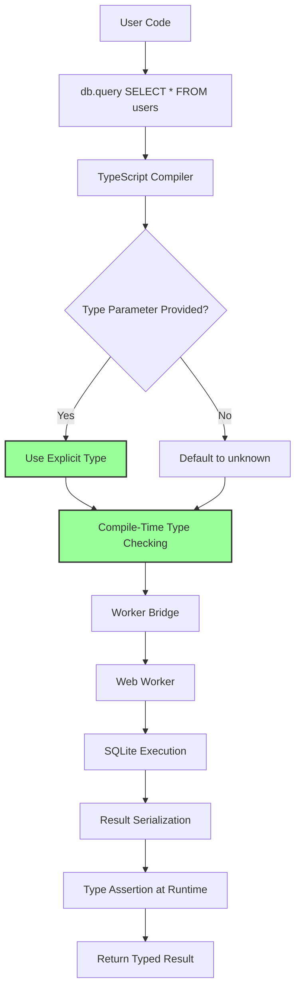

<!--
OUTPUT MAP
docs/04-adr/0006-typescript-type-system.md

TEMPLATE SOURCE
.claude/templates/docs/04-adr/0000-template.md
-->

# ADR-0006: TypeScript Type System Strategy

## Status

Accepted

## Context

- **What is the issue?**
    - SQLite is dynamically typed (no schema enforcement at query level)
    - JavaScript queries return untyped results (arrays of `any` objects)
    - Developers want type safety for query results and compile-time error checking
    - Need to balance type safety with flexibility of dynamic SQL

- **What are the constraints?**
    - TypeScript types must be optional (users can opt-out)
    - Cannot parse SQL to extract types (too complex, edge cases)
    - Types must work with worker communication (serialization boundaries)
    - Must support both positional (`?`) and named (`$name`) parameters
    - Generic types should not compromise runtime performance

- **Why do we need to decide now?**
    - Type system affects entire API design
    - Changing type strategy later would be breaking change
    - Influences developer experience and adoption
    - Must align with TypeScript best practices

## Decision

We will use **generic type parameters** with optional type inference for query results.

**Type System Architecture**: Generic types with manual type annotations



**Key Implementation Details**:

- **Generic Query Results**: `query<T>(sql, params)` returns `Promise<T[]>`
- **Default Type**: `T = unknown` if not specified (no type safety by default)
- **Manual Annotations**: Developers provide types: `query<User>("SELECT * FROM users")`
- **Parameter Types**: `SQLParams` type for bind parameters (positional or named)
- **Exec Result**: `ExecResult` type for changes count and last insert ID
- **Transaction Types**: `transaction<T>(fn)` preserves return types
- **Full Coverage**: All public APIs have type definitions

## Alternatives Considered

### Option 1: No TypeScript Types (Rejected)

Use plain JavaScript without type definitions.

- **Pros**:
    - Simplest implementation (no type definitions to maintain)
    - Works for all users (JS and TS)
    - No type complexity

- **Cons**:
    - **No Type Safety**: No compile-time error checking
    - **Poor DX**: No autocomplete, no inline documentation
    - **Runtime Errors**: Type mismatches only caught at runtime
    - **Modern Standard**: TypeScript is industry standard for libraries
    - **Out of Scope**: Requirements R39-R41 specify TypeScript support

**Evidence**: Requirements explicitly state: "R39: Provide full TypeScript type definitions"

### Option 2: SQL Parsing for Type Inference (Rejected)

Parse SQL strings to automatically extract result types.

- **Pros**:
    - Automatic type inference (no manual annotations)
    - Best developer experience (types inferred from SQL)
    - No type drift (types always match SQL)

- **Cons**:
    - **Extreme Complexity**: Full SQL parser required
    - **Edge Cases**: Subqueries, JOINs, aggregates, views, etc.
    - **Maintenance Burden**: Must support all SQLite syntax
    - **Performance**: Runtime parsing overhead
    - **Imperfect**: Cannot detect schema changes (ALTER TABLE)
    - **Build Tools**: Requires custom TypeScript transformer or plugin

**Evidence**: Requirements R41: "Support generic query results: `query<T>(sql, params)`" - implies manual type annotations.

### Option 3: Schema-First Types (Rejected)

Require users to define schema types and use them for all queries.

- **Pros**:
    - Strong type safety (types based on schema)
    - Single source of truth (schema definition)
    - Can generate types from schema

- **Cons**:
    - **High Friction**: Users must define schema before any query
    - **Rigidity**: Hard to use dynamic SQL or ad-hoc queries
    - **Complexity**: Must maintain schema type definitions
    - **Learning Curve**: Additional concept for users
    - **Out of Scope**: Not in requirements (Backlog B38 for future)

**Evidence**: Requirements don't mention schema definitions, only generic query results.

### Option 4: BRIDGE/ORM Pattern (Rejected)

Generate types from schema like ORMs (TypeORM, Prisma).

- **Pros**:
    - Automatic type generation
    - Schema migration tools
    - Query builders with type safety

- **Cons**:
    - **Wrong Abstraction**: Library is direct SQLite interface, not ORM
    - **Complexity**: ORM implementation is massive effort
    - **Non-Goal**: Requirements NG22 state: "Query builder or ORM functionality"
    - **Overkill**: Most users want simple SQL interface

**Evidence**: Non-goals explicitly state: "NG22: Query builder or ORM functionality"

## Consequences

### Positive

- **Type Safety**: Compile-time error checking for query results
    - Catch type mismatches before runtime
    - Autocomplete support in IDEs
    - Inline documentation via type definitions
    - Production-validated (v1.1.0 with 100% TypeScript coverage)

- **Flexibility**: Optional types, not required
    - Users can opt-out by using `query()` without type parameter
    - No performance overhead for untyped queries
    - Works with JavaScript users (types stripped in compilation)
    - Gradual adoption (users can add types incrementally)

- **Developer Experience**: Clean, intuitive API
    - Familiar TypeScript generics pattern
    - No new concepts or abstractions
    - Works with existing TypeScript tooling
    - No build step required (types in npm package)

- **Maintainability**: Type definitions document API surface
    - Types serve as executable documentation
    - Catch breaking changes during development
    - Self-documenting code
    - Easy to onboard new contributors

### Negative

- **Manual Annotations**: Users must provide types
    - Type safety requires explicit type parameters
    - Potential for type drift (types ≠ actual SQL results)
    - Repetitive for common queries
    - **Mitigation**: Type inference helpers in future (Backlog B38)

- **No Runtime Validation**: Types are compile-time only
    - Types don't guarantee runtime correctness
    - SQL changes may break type annotations
    - Must rely on tests for runtime validation
    - **Mitigation**: Comprehensive test suite, documentation

- **Generic Complexity**: Advanced TypeScript features
    - Generic types may confuse beginners
    - Type errors can be cryptic
    - Requires TypeScript knowledge
    - **Mitigation**: Clear documentation, examples, error messages

- **Type Drift**: Types may become out of sync with SQL
    - ALTER TABLE changes not reflected in types
    - Manual updates required
    - **Mitigation**: Developer discipline, integration tests

### Risks

- **Type Mismatches**: Developers provide wrong types
    - **Probability**: High (manual annotations)
    - **Impact**: Medium (runtime errors, confusing type errors)
    - **Mitigation**: Clear documentation, examples, testing guidance

- **Type Complexity**: Generic types may overwhelm beginners
    - **Probability**: Medium (TypeScript generics are advanced)
    - **Impact**: Low (can ignore types and use `any`)
    - **Mitigation**: Simple examples, gradual learning path

- **Future Schema Changes**: Types break when schema evolves
    - **Probability**: High (applications evolve)
    - **Impact**: Medium (type errors, manual updates)
    - **Mitigation**: Migration system (ADR-0004), testing

## Implementation Evidence

**File**: `src/types/DB.ts`

- Full TypeScript type definitions for public API
- Generic query result types: `query<T = unknown>(sql, params): Promise<T[]>`
- Parameter types: `SQLParams` (union of array and record)
- Exec result types: `ExecResult` (changes, lastInsertRowid)
- Transaction types: `transaction<T>(fn): Promise<T>`
- Dev tool types: `DevTool`, `ReleaseConfig`

**Type Examples**:

```typescript
// Typed query
interface User {
    id: number;
    name: string;
    email: string;
}

const users = await db.query<User>("SELECT * FROM users WHERE id = ?", [1]);
// users: User[]

// Untyped query (default)
const results = await db.query("SELECT * FROM posts");
// results: unknown[]

// Transaction with typed return
const userId = await db.transaction<number>(async (tx) => {
    await tx.exec("INSERT INTO users ...");
    return lastInsertId;
});
// userId: number
```

**Parameter Types**:

```typescript
type SqlValue =
    | null
    | number
    | string
    | boolean
    | bigint
    | Uint8Array
    | ArrayBuffer;

type SQLParams = SqlValue[] | Record<string, SqlValue>;

// Positional parameters
db.exec("INSERT INTO users (name, age) VALUES (?, ?)", ["Alice", 30]);

// Named parameters
db.exec("INSERT INTO users (name, age) VALUES ($name, $age)", {
    $name: "Alice",
    $age: 30,
});
```

**Coverage**: 100% TypeScript coverage

- All public APIs have type definitions
- All exported functions have JSDoc comments
- Type definitions included in npm package
- `strict: true` in `tsconfig.json`

**Test Coverage**:

- Type checking tests: TypeScript compilation succeeds
- Generic type inference tests
- Type correctness validated by compiler
- `npm run typecheck` passes

## Related Decisions

- **ADR-0001**: Web Worker Architecture (types must work across worker boundary)
- **ADR-0004**: Release Versioning System (types for release configs)

## Type System Philosophy

**Design Principles**:

1. **Types Optional**: Users can opt-out by omitting type parameters
2. **No Runtime Overhead**: Types are compile-time only, stripped in compilation
3. **Familiar Patterns**: Use standard TypeScript generics (no custom syntax)
4. **Developer Control**: Users provide types, not inferred from SQL
5. **Flexibility**: Support both typed and untyped queries

**Trade-offs Accepted**:

- Manual type annotations vs automatic inference (chose manual for simplicity)
- Type safety vs flexibility (balanced with optional types)
- Compile-time safety vs runtime validation (compile-time only)
- Complexity vs power (favored simplicity with generics)

**Future Enhancements** (Backlog):

- **B38**: Automatic TypeScript type generation from schema
- **B6**: Performance metrics API with types
- **B1**: Prepared statements with typed result sets

---

## Navigation

**Previous ADR**: [ADR-0005: COOP/COEP](./0005-coop-coep-requirement.md) - Header requirements

**Next ADR**: [ADR-0007: Error Handling](./0007-error-handling-strategy.md) - Error management

**All ADRs**:

- [ADR-0001: Web Worker](./0001-web-worker-architecture.md)
- [ADR-0002: OPFS Storage](./0002-opfs-persistent-storage.md)
- [ADR-0003: Mutex Queue](./0003-mutex-queue-concurrency.md)
- [ADR-0004: Release Versioning](./0004-release-versioning-system.md)
- [ADR-0005: COOP/COEP](./0005-coop-coep-requirement.md)
- [ADR-0007: Error Handling](./0007-error-handling-strategy.md)

**Related Documents**:

- [Back to Spec Index](../00-control/00-spec.md)
- [Stage 5: API Contracts](../05-design/01-contracts/01-api.md) - Type definitions
- [Stage 1: Requirements](../01-discovery/02-requirements.md) - R39-R41: TypeScript support
